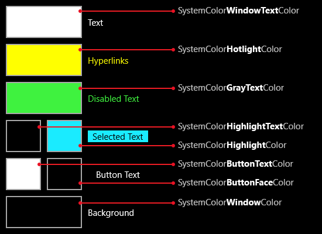

# Thèmes à contraste élevé  

Décrit les étapes requises pour garantir que votre application UWP est utilisable lorsqu’un thème à contraste élevé est actif.

Une application UWP prend en charge les thèmes à contraste élevé par défaut. Si un utilisateur a décidé que le système doit utiliser un thème à contraste élevé parmi les outils d’accessibilité ou les paramètres système, l’infrastructure utilise automatiquement des couleurs et paramètres de style qui produisent une disposition à contraste élevé et un rendu pour les contrôles et composants dans l’interface utilisateur.

Cette prise en charge par défaut est basée sur l’utilisation des thèmes et des modèles par défaut. Ces thèmes et modèles font référence aux couleurs système comme définitions de ressources, et les sources des ressources changent automatiquement quand le système utilise un mode de contraste élevé. Toutefois, si vous utilisez des modèles, thèmes et styles personnalisés pour votre contrôle, prenez soin de ne pas désactiver la prise en charge intégrée du contraste élevé. Si vous utilisez l’un des concepteurs XAML pour Microsoft Visual Studio pour les styles, le concepteur génère un thème à contraste élevé distinct en plus du thème principal chaque fois que vous définissez un modèle qui diffère sensiblement du modèle par défaut. Les dictionnaires de thèmes distincts s’inscrivent dans la collection [**ThemeDictionaries**](https://msdn.microsoft.com/library/windows/apps/windows.ui.xaml.resourcedictionary.themedictionaries.aspx), une propriété dédiée d’un élément [**ResourceDictionary**](https://msdn.microsoft.com/library/windows/apps/BR208794).

Pour plus d’informations sur les thèmes et modèles de contrôles, voir [Démarrage rapide : modèles de contrôles](https://msdn.microsoft.com/library/windows/apps/xaml/Hh465374). Il est souvent très instructif d’examiner les thèmes et dictionnaires de ressources XAML pour des contrôles spécifiques, et de voir la façon dont les thèmes sont créés et dont ils font référence à des ressources qui sont similaires mais différentes pour chaque paramètre de contraste élevé possible.

## Dictionnaires de thème

Pour modifier la couleur par défaut ou pour embellir vos pages à l’aide d’images, comme des images d’arrière-plan, créez une collection **ThemeDictionaries** pour votre application.

* Commencez par créer le système approprié, le cas échéant. Dans App.xaml, créez une collection **ThemeDictionaries**:

``` xaml
 <Application.Resources>
    <ResourceDictionary>
        <ResourceDictionary.ThemeDictionaries>
            <!-- Default is a fallback if a more precise theme isn't called out below -->
            <ResourceDictionary x:Key="Default">

            </ResourceDictionary>
            <!-- HighContrast is used in any high contrast theme -->
            <ResourceDictionary x:Key="HighContrast">

            </ResourceDictionary>
        </ResourceDictionary.ThemeDictionaries>
    </ResourceDictionary>
</Application.Resources
```

* **HighContrast** n’est pas le seul nom de clé disponible. Vous pouvez aussi utiliser **HighContrastBlack**, **HighContrastWhite** et **HighContrastCustom**. Dans la plupart des cas, vous avez seulement besoin de **HighContrast**.
* Dans **Default**, créez le type de classe [**Brush**](http://msdn.microsoft.com/library/windows/apps/xaml/windows.ui.xaml.media.brush.aspx) dont vous avez besoin, généralement **SolidColorBrush**. Attribuez-lui un nom **x: Key** spécifiant son utilisation:<br/>
    `<SolidColorBrush x:Key="BrandedPageBackground" />`
* Attribuez la **couleur** souhaitée:<br/>
    `<SolidColorBrush x:Key="BrandedPageBackground" Color="Red" />`
* Copiez cette classe **Brush** dans la propriété **HighContrast**:

``` xaml
<Application.Resources>
    <ResourceDictionary>
        <ResourceDictionary.ThemeDictionaries>
            <!-- Default is a fallback if a more precise theme isn't called out below -->
            <ResourceDictionary x:Key="Default">
                <SolidColorBrush x:Key="BrandedPageBackground" Color="Red" />
            </ResourceDictionary>
            <!-- HighContrast is used in any high contrast theme -->
            <ResourceDictionary x:Key="HighContrast">
                <SolidColorBrush x:Key="BrandedPageBackground" Color="Red" />
            </ResourceDictionary>
        </ResourceDictionary.ThemeDictionaries>
    </ResourceDictionary>
</Application.Resources>
```

* Déterminez la couleur de votre classe **Brush** et modifiez-la dans la propriété **HighContrast**.

La définition de la couleur d’un contraste élevé nécessite quelques connaissances. Le système que vous avez créé ci-dessus facilite la mise à jour.

## Couleurs à contraste élevé

Les utilisateurs peuvent passer à un contraste élevé par le biais de la page de paramètres. Il existe 4thèmes à contraste élevé par défaut. Lorsque l’utilisateur sélectionne une option, la page montre un aperçu de l’apparence des applications.

<br/>
_Paramètres de contraste élevé_

 Vous pouvez cliquer sur chaque zone de l’aperçu pour en modifier la valeur. Chaque zone mappe aussi directement vers une ressource système.

<br/>
_Ressources de contraste élevé_

Si vous ajoutez aux noms ci-dessus le préfixe _SystemColor_ et le suffixe _Color_, par exemple: **SystemColorWindowTextColor**, les noms seront dynamiquement mis à jour pour correspondre à ce que l’utilisateur a spécifié. Cela vous évite d’avoir à choisir une couleur spécifique pour le contraste élevé. Il vous suffit de choisir une ressource système adaptée à l’utilisation de la couleur. Dans l’exemple ci-dessus, nous avons nommé la couleur d’arrière-plan de la page **SolidColorBrushBrandedPageBackground**. Dans la mesure où cette couleur est utilisée pour un arrière-plan, nous pouvons la mapper vers **SystemColorWindowColor** en contraste élevé:

``` xaml
<Application.Resources>
    <ResourceDictionary>
        <ResourceDictionary.ThemeDictionaries>
            <!-- Default is a fallback if a more precise theme isn't called out below -->
            <ResourceDictionary x:Key="Default">
                <SolidColorBrush x:Key="BrandedPageBackground" Color="Red" />
            </ResourceDictionary>
            <!-- HighContrast is used in any high contrast theme -->
            <ResourceDictionary x:Key="HighContrast">
                <SolidColorBrush x:Key="BrandedPageBackground" Color="{ThemeResource SystemColorWindowColor}" />
            </ResourceDictionary>
        </ResourceDictionary.ThemeDictionaries>
    </ResourceDictionary>
</Application.Resources>
```

Si vous conservez la palette de 8couleurs à contraste élevé, vous n’êtes pas obligé de créer de **ResourceDictionaries** de contraste élevé supplémentaires. Cette palette limitée pose souvent problème pour la représentation des états visuels complexes. Généralement, l’ajout d’une bordure à une zone en contraste élevé uniquement peut aider à clarifier la situation.

### À FAIRE ET À NE PAS FAIRE

* Faites régulièrement et précocement des tests en mode de contraste élevé.
* Utilisez les couleurs nommées dans leur but initial.
* Ajoutez des primitives comme **Color**, **Brush** et **Thickness** dans les **ThemeDictionaries**. Évitez d’ajouter des ressources plus complexes, comme les éléments **Style**. L’exemple suivant fonctionne très bien:

``` xaml
<Application.Resources>
    <ResourceDictionary>
        <ResourceDictionary.ThemeDictionaries>
            <!-- Default is a fallback if a more precise theme isn't called out below -->
            <ResourceDictionary x:Key="Default">
                <SolidColorBrush x:Key="BrandedPageBackground" Color="Red" />
            </ResourceDictionary>
            <!-- HighContrast is used in any high contrast theme -->
            <ResourceDictionary x:Key="HighContrast">
                <SolidColorBrush x:Key="BrandedPageBackground" Color="{ThemeResource SystemColorWindowColor}" />
            </ResourceDictionary>
        </ResourceDictionary.ThemeDictionaries>

        <Style x:Key="MyButtonStyle" TargetType="Button">
            <Setter Property="Foreground" Value="{ThemeResource BrandedPageBackground}" />
        </Style>
    </ResourceDictionary>
</Application.Resources>

...

<Button Style="{StaticResource MyButtonStyle}" />
```

* Utilisez des couleurs de premier plan à contraste élevé pour les éléments d’interface utilisateur au premier plan.
* Utilisez des couleurs à contraste élevé en respectant les paires de couleurs définies. Par exemple, utilisez toujours **BUTTONTEXT** avec **BUTTONFACE**, en particulier dans une situation de premier plan/arrière-plan.
* Utilisez les paires de couleurs à contraste élevé recommandées pour un élément d’interface utilisateur spécifique afin de vous assurer que le coefficient de contraste14:1 requis est satisfait.
* Ne scindez pas les paires de couleur à contraste élevé et ne mélangez pas arbitrairement les couleurs à contraste élevé. Cela rend souvent l’interface utilisateur invisible pour au moins l’un des thèmes à contraste élevé préinstallés.
* N’insérez pas d’objets **Brush** créés en dehors d’une collection **ThemeDictionaries**.
* N’utilisez jamais **StaticResource** pour faire référence à une ressource dans une collection **ThemeDictionaries**. Cela semblera fonctionner jusqu’à ce que l’utilisateur modifie les thèmes pendant que votre application est en cours d’exécution. Utilisez **ThemeResource** à la place.
* N’utilisez pas de valeurs de couleur codées en dur.
* N’utilisez pas une couleur simplement parce que vous l’aimez.

Voir [Ressources de thèmeXAML](https://msdn.microsoft.com/windows/uwp/controls-and-patterns/xaml-theme-resources) pour plus d’informations.

## Quand utiliser les bordures
En mode de contraste élevé, ajoutez une bordure à un élément d’interface utilisateur lorsqu’il faut conserver une limite reconnaissable pour l’élément. Utiliser des bordures pour faire la distinction entre les zones de contenu de navigation, les actions et le contenu.

<br/>
_Volet de navigation séparé du reste de la page_

Si un élément d’interface utilisateur _n’a pas_ de bordure ou d’arrière-plan par défaut, n’ajoutez pas de bordure ou d’arrière-plan à l’état par défaut en mode de contraste élevé.

Si un élément d’interface utilisateur _comporte_ une bordure par défaut, conservez la bordure en mode de contraste élevé.

Les couleurs superposées ou adjacentes doivent pouvoir se distinguer les unes des autres, mais elles ne doivent pas forcément respecter un coefficient de contraste couleur de14:1. Toutefois, il est recommandé de choisir un rapport de contraste de3:1 pour ces types de scénarios.

Si des couleurs d’arrière-plan à contraste élevé sont utilisées pour différencier les éléments d’interface utilisateur qui se chevauchent, la seule manière de garantir un contraste entre ces éléments est d’ajouter des bordures.

## Détection de l’activation d’un thème à contraste élevé  
Utilisez des membres de la classe [**AccessibilitySettings**](https://msdn.microsoft.com/library/windows/apps/BR242237) afin de détecter les paramètres actuels pour les thèmes à contraste élevé. La propriété [**HighContrast**](https://msdn.microsoft.com/library/windows/apps/windows.ui.viewmanagement.accessibilitysettings.highcontrast) détermine si un thème à contraste élevé est actuellement sélectionné. Si **HighContrast** a la valeur **true**, l’étape suivante consiste à vérifier la valeur de la propriété [**HighContrastScheme**](https://msdn.microsoft.com/library/windows/apps/windows.ui.viewmanagement.accessibilitysettings.highcontrastscheme) afin d’obtenir le nom du thème à contraste élevé utilisé. «Contraste blanc élevé» et «Contraste noir élevé» sont les valeurs normales de **HighContrastScheme** auxquelles votre code doit répondre. Comme les clés [**ResourceDictionary**](https://msdn.microsoft.com/library/windows/apps/BR208794) définies en XAML ne peuvent pas contenir d’espaces, les clés de ces thèmes dans un dictionnaire de ressources sont généralement «HighContrastWhite» et «HighContrastBlack», respectivement. Vous devez également disposer d’une logique de remplacement pour un thème à contraste élevé par défaut au cas où la valeur serait une autre chaîne. L’[exemple de contraste élevé XAML](http://go.microsoft.com/fwlink/p/?linkid=254993) illustre cette logique.

> [!NOTE]
> Prenez soin d’appeler le constructeur [**AccessibilitySettings**](https://msdn.microsoft.com/library/windows/apps/BR242237) à partir d’une étendue dans laquelle l’application est initialisée et affiche déjà du contenu.

Les applications peuvent utiliser des valeurs de ressource à contraste élevé pendant qu’elles sont en cours d’exécution. Cela ne fonctionne que si les ressources sont demandées à l’aide de l’[extension de balisage {ThemeResource}](https://msdn.microsoft.com/library/windows/apps/Mt185591) dans le code XAML du style ou du modèle. Comme les thèmes par défaut (generic.xaml) utilisent tous cette technique d’extension de balisage {ThemeResource}, vous obtenez ce comportement si vous utilisez des thèmes de contrôle par défaut. Les contrôles ou styles de contrôle personnalisés prennent cela en charge si vous avez également utilisé cette technique d’extension de balisage {ThemeResource} dans vos modèles et styles personnalisés.

## Rubriques connexes  
* [Accessibilité](accessibility.md)
* [Exemple de paramètres et de contraste d’interface utilisateur](http://go.microsoft.com/fwlink/p/?linkid=231539)
* [Exemple d’accessibilité XAML](http://go.microsoft.com/fwlink/p/?linkid=238570)
* [Exemple de contraste élevé XAML](http://go.microsoft.com/fwlink/p/?linkid=254993)
* [**AccessibilitySettings**](https://msdn.microsoft.com/library/windows/apps/BR242237)


<!--HONumber=Jun16_HO4-->


