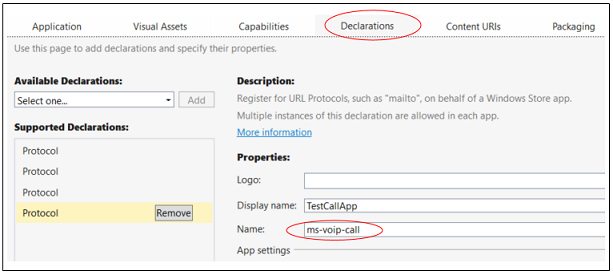

# <a name="connect-your-app-to-actions-on-a-contact-card"></a>Connecter votre application à des actions sur une carte de visite

Votre application peut apparaître en regard des actions sur une carte de visite ou une mini carte de visite. Les utilisateurs peuvent choisir votre application pour effectuer une action telle qu’ouvrir une page de profil, effectuer un appel ou envoyer un message.


Pour commencer, recherchez des contacts existants ou créez-en de nouveaux. Ensuite, créez une *annotation* et quelques entrées du manifeste de package pour décrire les actions prises en charge par votre application. Ensuite, écrivez le code qui effectue les actions.

Pour un exemple plus complet, consultez l’[exemple d’intégration de carte de visite](https://github.com/Microsoft/Windows-universal-samples/tree/master/Samples/ContactCardIntegration).

## <a name="find-or-create-a-contact"></a>Rechercher ou créer un contact

Si votre application aide les personnes à interagir, recherchez les contacts dans Windows, puis annotez-les. Si votre application gère les contacts, vous pouvez les ajouter à une liste de contacts Windows, puis les annoter.

### <a name="find-a-contact"></a>Rechercher un contact

Recherchez les contacts à l’aide d’un nom, d’une adresse de messagerie ou d’un numéro de téléphone.

```cs
ContactStore contactStore = await ContactManager.RequestStoreAsync();

IReadOnlyList<Contact> contacts = null;

contacts = await contactStore.FindContactsAsync(emailAddress);

Contact contact = contacts[0];
```

### <a name="create-a-contact"></a>Créer un contact

Si votre application ressemble davantage à un carnet d’adresses, créez les contacts et ajoutez-les à une liste de contacts.

```cs
Contact contact = new Contact();
contact.FirstName = "TestContact";

ContactEmail email = new ContactEmail();
email.Address = "TestContact@contoso.com";
email.Kind = ContactEmailKind.Other;
contact.Emails.Add(email);

ContactPhone phone = new ContactPhone();
phone.Number = "4255550101";
phone.Kind = ContactPhoneKind.Mobile;
contact.Phones.Add(phone);

ContactStore store = await
    ContactManager.RequestStoreAsync(ContactStoreAccessType.AppContactsReadWrite);

ContactList contactList;

IReadOnlyList<ContactList> contactLists = await store.FindContactListsAsync();

if (0 == contactLists.Count)
    contactList = await store.CreateContactListAsync("TestContactList");
else
    contactList = contactLists[0];

await contactList.SaveContactAsync(contact);

```

## <a name="tag-each-contact-with-an-annotation"></a>Identifier chaque contact avec une annotation

Identifiez chaque contact avec une liste des actions (opérations) que votre application peut effectuer (par exemple: appels vidéo et messagerie).

Ensuite, associez l’identifiant d’un contact à un identifiant que votre application utilise en interne pour identifier cet utilisateur.

```cs
ContactAnnotationStore annotationStore = await
   ContactManager.RequestAnnotationStoreAsync(ContactAnnotationStoreAccessType.AppAnnotationsReadWrite);

ContactAnnotationList annotationList;

IReadOnlyList<ContactAnnotationList> annotationLists = await annotationStore.FindAnnotationListsAsync();
if (0 == annotationLists.Count)
    annotationList = await annotationStore.CreateAnnotationListAsync();
else
    annotationList = annotationLists[0];

ContactAnnotation annotation = new ContactAnnotation();
annotation.ContactId = contact.Id;
annotation.RemoteId = "user22";

annotation.SupportedOperations = ContactAnnotationOperations.Message |
  ContactAnnotationOperations.AudioCall |
  ContactAnnotationOperations.VideoCall |
 ContactAnnotationOperations.ContactProfile;

await annotationList.TrySaveAnnotationAsync(annotation);
```

## <a name="register-for-each-operation"></a>S’inscrire pour chaque opération

Dans le manifeste de package, inscrivez-vous pour chaque opération répertoriée dans votre annotation.

Procédez à l’enregistrement en ajoutant des gestionnaires de protocole à l’élément ``Extensions`` du manifeste.

```xml
<Extensions>
  <uap:Extension Category="windows.protocol">
    <uap:Protocol Name="ms-contact-profile">
      <uap:DisplayName>TestProfileApp</uap:DisplayName>
    </uap:Protocol>
  </uap:Extension>
  <uap:Extension Category="windows.protocol">
    <uap:Protocol Name="ms-ipmessaging">
      <uap:DisplayName>TestMsgApp</uap:DisplayName>
    </uap:Protocol>
  </uap:Extension>
  <uap:Extension Category="windows.protocol">
    <uap:Protocol Name="ms-voip-video">
      <uap:DisplayName>TestVideoApp</uap:DisplayName>
    </uap:Protocol>
  </uap:Extension>
  <uap:Extension Category="windows.protocol">
    <uap:Protocol Name="ms-voip-call">
      <uap:DisplayName>TestCallApp</uap:DisplayName>
    </uap:Protocol>
  </uap:Extension>
</Extensions>
```
Vous pouvez également les ajouter dans l’onglet **Declarations** du concepteur de manifeste de Visual Studio.



## <a name="find-your-app-next-to-actions-in-a-contact-card"></a>Rechercher votre application en regard des actions d’une carte de visite

Ouvrez l’application Contacts. Votre application s’affiche en regard de chaque action (opération) spécifiée dans votre annotation et votre manifeste de package.


Si les utilisateurs choisissent votre application pour une action, elle apparaît en tant qu’application par défaut pour cette action à l’ouverture suivante d’une carte de visite par l’utilisateur.

## <a name="find-your-app-next-to-actions-in-a-mini-contact-card"></a>Rechercher votre application en regard des actions d’une mini carte de visite

Dans les mini cartes de visite, votre application apparaît dans les onglets représentant les actions.


Les applications telles que **Courrier** ouvrent des mini cartes de visite. Votre application peut également les ouvrir. Ce code vous explique comment.

```cs
public async void OpenContactCard(object sender, RoutedEventArgs e)
{
    // Get the selection rect of the button pressed to show contact card.
    FrameworkElement element = (FrameworkElement)sender;

    Windows.UI.Xaml.Media.GeneralTransform buttonTransform = element.TransformToVisual(null);
    Windows.Foundation.Point point = buttonTransform.TransformPoint(new Windows.Foundation.Point());
    Windows.Foundation.Rect rect =
        new Windows.Foundation.Rect(point, new Windows.Foundation.Size(element.ActualWidth, element.ActualHeight));

   // helper method to find a contact just for illustrative purposes.
    Contact contact = await findContact("contoso@contoso.com");

    ContactManager.ShowContactCard(contact, rect, Windows.UI.Popups.Placement.Default);

}
```

Pour découvrir davantage d’exemples avec des mini cartes de visite, consultez l’[exemple de cartes de visite](https://github.com/Microsoft/Windows-universal-samples/tree/master/Samples/ContactCards).

Tout comme avec la carte de visite, chaque onglet enregistre la dernière application utilisée, ce qui facilite l’action de l’utilisateur la fois suivante.

## <a name="perform-operations-when-users-select-your-app-in-a-contact-card"></a>Effectuer des opérations au cours desquelles les utilisateurs sélectionnent votre application dans une carte de visite

Remplacez la méthode [Application.OnActivated](https://msdn.microsoft.com/library/windows/apps/br242330) dans votre fichier **App.cs**, puis dirigez les utilisateurs vers une page de votre application. L’[exemple d’intégration de carte de visite](https://github.com/Microsoft/Windows-universal-samples/tree/master/Samples/ContactCardIntegration) vous présente une façon de procéder.

Dans le fichier code-behind de la page, remplacez la méthode [Page.OnNavigatedTo](https://msdn.microsoft.com/library/windows/apps/windows.ui.xaml.controls.page.onnavigatedto.aspx). La carte de visite transmet à cette méthode le nom de l’opération et l’identifiant de l’utilisateur.

Pour démarrer une vidéo ou un appel audio, consultez cet exemple: [exemple VoIP](https://github.com/Microsoft/Windows-universal-samples/tree/master/Samples/VoIP). Vous trouverez l’API complète dans l’espace de noms [WIndows.ApplicationModel.Calls](https://msdn.microsoft.com/library/windows/apps/windows.applicationmodel.calls.aspx).

Pour simplifier la messagerie, consultez l’espace de noms [Windows.ApplicationModel.Chat](https://msdn.microsoft.com/library/windows/apps/windows.applicationmodel.chat.aspx).

Vous pouvez également démarrer une autre application. C’est ce que fait ce code.

```cs
protected override async void OnNavigatedTo(NavigationEventArgs e)
{
    base.OnNavigatedTo(e);

    var args = e.Parameter as ProtocolActivatedEventArgs;
    // Display the result of the protocol activation if we got here as a result of being activated for a protocol.

    if (args != null)
    {
        var options = new Windows.System.LauncherOptions();
        options.DisplayApplicationPicker = true;

        options.TargetApplicationPackageFamilyName = “ContosoApp”;

        string launchString = args.uri.Scheme + ":" + args.uri.Query;
        var launchUri = new Uri(launchString);
        await Windows.System.Launcher.LaunchUriAsync(launchUri, options);
    }
}
```

La propriété ```args.uri.scheme``` comporte le nom de l’opération, et la propriété ```args.uri.Query``` comporte l’identifiant de l’utilisateur.
