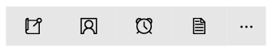
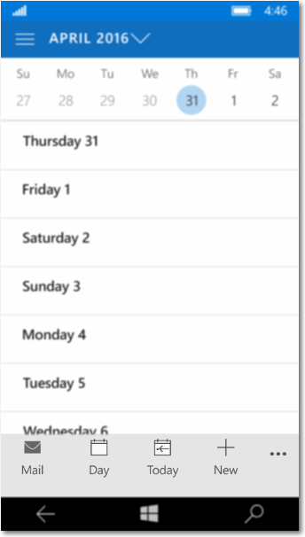
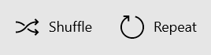
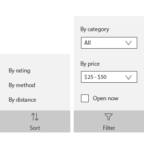

# <a name="app-bar-and-command-bar"></a>Barre de l’application et barre de commandes

<link rel="stylesheet" href="https://az835927.vo.msecnd.net/sites/uwp/Resources/css/custom.css"> 

Les barres de commandes (également appelées « barres de l’application ») permettent aux utilisateurs d’accéder facilement aux actions les plus courantes de votre application. Elles peuvent également servir à afficher les commandes ou les options propres au contexte de l’utilisateur, par exemple celles relatives à la sélection de photos ou au mode dessin. Elles peuvent également être utilisées pour la navigation entre les pages ou les sections de l’application. Les barres de commandes peuvent être utilisées avec n’importe quel modèle de navigation.



<div class="important-apis" >
<b>API importantes</b><br/>
<ul>
<li>[**CommandBar**](https://msdn.microsoft.com/library/windows/apps/windows.ui.xaml.controls.commandbar.aspx)</li>
<li>[**AppBarButton**](https://msdn.microsoft.com/library/windows/apps/windows.ui.xaml.controls.appbarbutton.aspx) </li>
<li> [**AppBarToggleButton**](https://msdn.microsoft.com/library/windows/apps/windows.ui.xaml.controls.appbartogglebutton.aspx)</li>
<li>[**AppBarSeparator**](https://msdn.microsoft.com/library/windows/apps/windows.ui.xaml.controls.appbarseparator.aspx) </li>
</ul>
</div>


## <a name="is-this-the-right-control"></a>Est-ce le contrôle approprié ?

Le contrôle CommandBar est un contrôle à usage général, flexible et léger qui permet d’afficher du contenu complexe, comme des images, des barres de progression ou des blocs de texte, ainsi que des commandes simples, comme des contrôles [AppBarButton](https://msdn.microsoft.com/library/windows/apps/windows.ui.xaml.controls.appbarbutton.aspx), [AppBarToggleButton](https://msdn.microsoft.com/library/windows/apps/windows.ui.xaml.controls.appbartogglebutton.aspx) et [AppBarSeparator](https://msdn.microsoft.com/library/windows/apps/windows.ui.xaml.controls.appbarseparator.aspx).

XAML fournit les contrôles AppBar et CommandBar. Utilisez le contrôle AppBar uniquement lorsque vous mettez à niveau une application Windows 8 universelle qui utilise ce contrôle et si vous avez besoin de réduire les modifications. Pour les nouvelles applications dans Windows 10, nous vous recommandons plutôt d’utiliser le contrôle CommandBar. Ce document part du principe que vous utilisez le contrôle CommandBar.

## <a name="examples"></a>Exemples
Une barre de commandes développée dans l’application Photos Microsoft.


Une barre de commandes dans le Calendrier Outlook sur Windows Phone.



## <a name="anatomy"></a>Anatomie

Par défaut, la barre de commandes affiche une ligne de boutons d’icônes et un bouton « En savoir plus » facultatif, représentant des points de suspension \ [•••\]. Voici la barre de commandes créée par l’exemple de code présenté plus loin. Elle est présentée à l’état compact et fermé.


La barre de commandes peut également être affichée à l’état fermé minimal comme ce qui suit : Voir la section [États ouvert et fermé](#open-and-closed-states) pour plus d’informations.


Voici la même barre de commandes à l’état ouvert. Les étiquettes identifient les principales parties du contrôle.


La barre de commandes est divisée en 4 zones principales :
- Le bouton « En savoir plus » \[•••\] apparaît à droite de la barre. Le fait d’appuyer sur « En savoir plus » \ [•••\] a 2 effets : cela fait apparaître les libellés sur les boutons de commande principaux, et ouvre le menu de dépassement en présence de commandes secondaires. Dans le Kit de développement logiciel (SDK) le plus récent, le bouton ne sera pas visible si aucune commande secondaire ni aucune étiquette masquée ne sont présentes. La propriété [**OverflowButtonVisibility**](https://msdn.microsoft.com/library/windows/apps/windows.ui.xaml.controls.commandbar.overflowbuttonvisibility.aspx) permet aux applications de modifier ce comportement de masquage automatique par défaut.
- La zone de contenu est alignée sur le côté gauche de la barre. Elle s’affiche si la propriété [**Content**](https://msdn.microsoft.com/library/windows/apps/xaml/windows.ui.xaml.controls.contentcontrol.content.aspx) est remplie.
- La zone de commande principale est alignée à droite de la barre, en regard du bouton « En savoir plus » \ [•••\]. Elle s’affiche si la propriété [**PrimaryCommands**](https://msdn.microsoft.com/library/windows/apps/xaml/windows.ui.xaml.controls.commandbar.primarycommands.aspx) est remplie.  
- Le menu de dépassement est visible uniquement quand la barre de commandes est ouverte et si la propriété [**SecondaryCommands**](https://msdn.microsoft.com/library/windows/apps/xaml/windows.ui.xaml.controls.commandbar.secondarycommands.aspx) est remplie. Le nouveau comportement de débordement dynamique déplace automatiquement les commandes principales dans la zone SecondaryCommands lorsque l’espace est limité.

La disposition est inversée lorsque [FlowDirection](https://msdn.microsoft.com/library/windows/apps/windows.ui.xaml.frameworkelement.flowdirection.aspx) est défini sur **RightToLeft**.

## <a name="create-a-command-bar"></a>Créer une barre de commandes
Cet exemple permet de créer la barre de commandes illustrée précédemment.

```xaml
<CommandBar>
    <AppBarToggleButton Icon="Shuffle" Label="Shuffle" Click="AppBarButton_Click" />
    <AppBarToggleButton Icon="RepeatAll" Label="Repeat" Click="AppBarButton_Click"/>
    <AppBarSeparator/>
    <AppBarButton Icon="Back" Label="Back" Click="AppBarButton_Click"/>
    <AppBarButton Icon="Stop" Label="Stop" Click="AppBarButton_Click"/>
    <AppBarButton Icon="Play" Label="Play" Click="AppBarButton_Click"/>
    <AppBarButton Icon="Forward" Label="Forward" Click="AppBarButton_Click"/>

    <CommandBar.SecondaryCommands>
        <AppBarButton Icon="Like" Label="Like" Click="AppBarButton_Click"/>
        <AppBarButton Icon="Dislike" Label="Dislike" Click="AppBarButton_Click"/>
    </CommandBar.SecondaryCommands>

    <CommandBar.Content>
        <TextBlock Text="Now playing..." Margin="12,14"/>
    </CommandBar.Content>
</CommandBar>
```

## <a name="commands-and-content"></a>Commandes et contenu
Le contrôle CommandBar dispose de 3 propriétés qui vous permettent d’ajouter des commandes et du contenu : [**PrimaryCommands**](https://msdn.microsoft.com/library/windows/apps/xaml/windows.ui.xaml.controls.commandbar.primarycommands.aspx), [**SecondaryCommands**](https://msdn.microsoft.com/library/windows/apps/xaml/windows.ui.xaml.controls.commandbar.secondarycommands.aspx), et [**Content**](https://msdn.microsoft.com/library/windows/apps/xaml/windows.ui.xaml.controls.contentcontrol.content.aspx).


### <a name="primary-actions-and-overflow"></a>Actions principales et dépassement

Par défaut, les éléments que vous ajoutez à la barre de commandes enrichissent la collection **PrimaryCommands**. Ces commandes apparaissent à gauche du bouton « En savoir plus » \ [•••\], dans ce que nous appelons l’espace d’action. Placez les commandes les plus importantes et celles que vous souhaitez laisser affichées, dans l’espace d’action. Sur les écrans plus petits (largeur de 320 epx), l’espace d’action de la barre de commandes peut contenir un maximum de 4 éléments.

Vous pouvez ajouter des commandes à la collection **SecondaryCommands**. Ces éléments sont affichés dans la zone de dépassement. Placez les commandes les moins importantes dans la zone de dépassement.

Le style de la zone de dépassement par défaut est défini de manière à pouvoir être distingué de la barre. Vous pouvez ajuster les styles en définissant la propriété [**CommandBarOverflowPresenterStyle**](https://msdn.microsoft.com/library/windows/apps/xaml/windows.ui.xaml.controls.commandbar.commandbaroverflowpresenterstyle.aspx) sur un [Style](https://msdn.microsoft.com/library/windows/apps/xaml/windows.ui.xaml.style.aspx) qui cible [**CommandBarOverflowPresenter**](https://msdn.microsoft.com/library/windows/apps/xaml/windows.ui.xaml.controls.commandbaroverflowpresenter.aspx).

Vous pouvez déplacer par programmation les commandes entre les propriétés PrimaryCommands et SecondaryCommands en fonction des besoins. 

<div class="microsoft-internal-note">
Les commandes peuvent aussi être automatiquement déplacées à l’intérieur ou en dehors de la zone de dépassement quand la barre de commandes change de largeur, par exemple quand les utilisateurs redimensionnent la fenêtre de leur application. Le dépassement dynamique est activé par défaut, mais il peut être désactivé dans les applications en modifiant la valeur de la propriété `IsDynamicOverflowEnabled`.
</div>

### <a name="app-bar-buttons"></a>Boutons de la barre de l’application

Les propriétés PrimaryCommands et SecondaryCommands peuvent être remplies uniquement avec les éléments de commande [**AppBarButton**](https://msdn.microsoft.com/library/windows/apps/xaml/windows.ui.xaml.controls.appbarbutton.aspx), [**AppBarToggleButton**](https://msdn.microsoft.com/library/windows/apps/xaml/windows.ui.xaml.controls.appbartogglebutton.aspx) et [**AppBarSeparator**](https://msdn.microsoft.com/library/windows/apps/xaml/windows.ui.xaml.controls.appbarseparator.aspx). Ces contrôles sont optimisés pour une utilisation dans une barre de commandes, et leur apparence change selon que le contrôle est utilisé dans l’espace d’action ou la zone de dépassement.

Les contrôles des boutons de la barre de l’application sont caractérisés par une icône et un libellé associé. Ils ont deux tailles : normale et compacte. Par défaut, le texte du libellé s’affiche. Lorsque la propriété [**IsCompact**](https://msdn.microsoft.com/library/windows/apps/xaml/windows.ui.xaml.controls.appbarbutton.iscompact.aspx) est définie sur la valeur **true**, le libellé du texte est masqué. Lorsqu’elle est utilisée dans un contrôle CommandBar, la barre de commandes remplace automatiquement la propriété IsCompact du bouton lorsque la barre de commandes est ouverte et fermée.

Pour positionner les étiquettes des boutons de la barre d’application à droite de leurs icônes, les applications peuvent utiliser la nouvelle propriété [**DefaultLabelPosition**](https://msdn.microsoft.com/library/windows/apps/windows.ui.xaml.controls.commandbar.defaultlabelposition.aspx) du contrôle CommandBar.

```xaml
<CommandBar DefaultLabelPosition="Right">
    <AppBarToggleButton Icon="Shuffle" Label="Shuffle"/>
    <AppBarToggleButton Icon="RepeatAll" Label="Repeat"/>
</CommandBar>
```

Voici à quoi ressemble l’extrait de code ci-dessus lorsqu’il est dessiné par une application.



Il n’est pas possible de modifier la position des étiquettes des boutons individuels de la barre d’application. Cela doit être fait globalement sur la barre de commande. Les boutons de la barre d’application peuvent spécifier le masquage permanent de leurs étiquettes en définissant la nouvelle propriété [**LabelPosition**](https://msdn.microsoft.com/library/windows/apps/mt710920.aspx) sur **Collapsed**. Nous vous recommandons de limiter l’utilisation de ce paramètre aux icônes universellement reconnaissables, telles que « + ».

Lorsque vous placez un bouton de la barre de l’application dans le menu de dépassement (SecondaryCommands), il s’affiche sous forme de texte uniquement. La propriété **LabelPosition** des boutons de la barre de l’application dans le dépassement est ignorée. Voici le même bouton bascule de la barre de l’application affiché dans l’espace action sous forme de commande principale (haut), et dans la zone de dépassement sous forme de commande secondaire (bas).


- *S’il existe une commande qui s’affiche de façon cohérente sur plusieurs pages, il est préférable de la laisser à un emplacement cohérent.*
- *Nous recommandons de placer les commandes Accepter, Oui et OK à gauche des commandes Rejeter, Non et Annuler. La cohérence permet aux utilisateurs de se déplacer en toute confiance dans le système et de réutiliser leur connaissance de navigation d’une application à l’autre.*

### <a name="button-labels"></a>Libellé des boutons

Nous recommandons de créer des libellés courts pour les boutons de la barre de l’application, de préférence un seul mot. Les libellés longs placés sous l’icône du bouton de la barre de l’application s’étaleront sur plusieurs lignes, ce qui augmente la hauteur totale de la barre de commandes ouverte. Vous pouvez inclure un trait d’union conditionnel (0x00AD) dans le libellé pour indiquer l’endroit où une césure doit intervenir. En XAML, cela s’exprime par une séquence d’échappement, telle que celle qui suit :

```xaml
<AppBarButton Icon="Back" Label="Areally&#x00AD;longlabel"/>
```

Lorsque le libellé est renvoyé à la ligne à l’emplacement indiqué, cela se présente comme suit.


### <a name="other-content"></a>Autre contenu

Vous pouvez ajouter n’importe quel élément XAML à la zone de contenu en définissant la propriété **Content**. Si vous voulez ajouter plusieurs éléments, vous devez les placer dans un conteneur de panneaux et faire en sorte que le panneau soit le seul enfant de la propriété Content.

En présence de commandes principales et de contenu, les commandes principales sont prioritaires et peuvent provoquer la troncature du contenu. 
<div class="microsoft-internal-note">
Quand le dépassement dynamique est activé, le contenu n’est pas tronqué, car les commandes principales sont déplacées dans le menu de dépassement, libérant ainsi de la place pour le contenu.
</div>

Lorsque [**ClosedDisplayMode**](https://msdn.microsoft.com/library/windows/apps/xaml/windows.ui.xaml.controls.appbar.closeddisplaymode.aspx) est défini sur **Compact**, le contenu peut être tronqué s’il est plus grand que la taille compacte de la barre de commandes. Vous devez gérer les événements [**Opening**](https://msdn.microsoft.com/library/windows/apps/xaml/windows.ui.xaml.controls.appbar.opening.aspx) et [**Closed**](https://msdn.microsoft.com/library/windows/apps/xaml/windows.ui.xaml.controls.appbar.closed.aspx) pour afficher ou masquer des parties de l’interface utilisateur dans la zone de contenu afin qu’elles ne soient pas tronquées. Voir la section [États ouvert et fermé](#open-and-closed-states) pour plus d’informations.

## <a name="open-and-closed-states"></a>États ouvert et fermé

La barre de commandes peut être ouverte ou fermée. Un utilisateur peut basculer entre ces états en appuyant sur le bouton « En savoir plus » \ [•••\]. Vous pouvez basculer d’un état à l’autre par programme en définissant la propriété [**IsOpen**](https://msdn.microsoft.com/library/windows/apps/xaml/windows.ui.xaml.controls.appbar.isopen.aspx). Lorsque la barre de commandes est ouverte, les boutons de commandes principales s’affichent avec les libellés et le menu de dépassement est ouvert en présence de commandes secondaires, comme indiqué précédemment.

Vous pouvez utiliser les événements [**Opening**](https://msdn.microsoft.com/library/windows/apps/xaml/windows.ui.xaml.controls.appbar.opening.aspx), [**Opened**](https://msdn.microsoft.com/library/windows/apps/xaml/windows.ui.xaml.controls.appbar.opened.aspx), [**Closing**](https://msdn.microsoft.com/library/windows/apps/xaml/windows.ui.xaml.controls.appbar.closing.aspx), et [**Closed**](https://msdn.microsoft.com/library/windows/apps/xaml/windows.ui.xaml.controls.appbar.closed.aspx) pour répondre à l’ouverture et à la fermeture de la barre de commandes.  
- Les événements Opening et Closing se produisent avant le début de l’animation de transition.
- Les événements Opened et Closed se produisent après la transition.

Dans cet exemple, les événements Opening et Closing permettent de modifier l’opacité de la barre de commandes. Lorsque la barre de commandes est fermée, celle-ci devient semi-transparente révélant l’arrière-plan de l’application. Lorsque la barre de commandes est ouverte, celle-ci devient opaque de sorte que l’utilisateur puisse se concentrer sur les commandes.

```xaml
<CommandBar Opening="CommandBar_Opening"
            Closing="CommandBar_Closing">
    <AppBarButton Icon="Accept" Label="Accept"/>
    <AppBarButton Icon="Edit" Label="Edit"/>
    <AppBarButton Icon="Save" Label="Save"/>
    <AppBarButton Icon="Cancel" Label="Cancel"/>
</CommandBar>
```

```csharp
private void CommandBar_Opening(object sender, object e)
{
    CommandBar cb = sender as CommandBar;
    if (cb != null) cb.Background.Opacity = 1.0;
}

private void CommandBar_Closing(object sender, object e)
{
    CommandBar cb = sender as CommandBar;
    if (cb != null) cb.Background.Opacity = 0.5;
}

```

### <a name="closeddisplaymode"></a>ClosedDisplayMode

Vous pouvez contrôler la façon dont la barre de commandes est affichée à l’état fermé en définissant la propriété [**ClosedDisplayMode**](https://msdn.microsoft.com/library/windows/apps/xaml/windows.ui.xaml.controls.appbar.closeddisplaymode.aspx). Vous avez le choix entre 3 modes d’affichage lorsque la barre est fermée :
- **Compact** : mode par défaut. Affiche le contenu, les icônes de commande principale sans les libellés et le bouton e« Afficher plus » \ [•••\].
- **Minimal** : affiche uniquement une fine barre qui agit comme le bouton « En savoir plus » \ [•••\]. L’utilisateur peut appuyer n’importe où sur la barre pour l’ouvrir.
- **Hidden** : la barre de commandes ne s’affiche pas quand elle est fermée. Cela peut être utile pour afficher des commandes contextuelles avec une barre de commandes en ligne. Dans ce cas, vous devez ouvrir la barre de commandes par programme en définissant la propriété **IsOpen** ou en modifiant la propriété ClosedDisplayMode pour la définir sur **Minimal** ou **Compact**.

Ici, une barre de commandes est utilisée pour contenir des commandes de mise en forme simples pour un élément [RichEditBox](https://msdn.microsoft.com/library/windows/apps/xaml/windows.ui.xaml.controls.richeditbox.aspx). Lorsque la zone d’édition n’a pas le focus, les commandes de mise en forme peuvent devenir gênantes, c’est pourquoi elles sont masquées. Lorsque la zone d’édition est utilisée, la propriété ClosedDisplayMode de la barre de commandes est définie sur Compact afin que les commandes de mise en forme soient visibles.

```xaml
<StackPanel Width="300"
            GotFocus="EditStackPanel_GotFocus"
            LostFocus="EditStackPanel_LostFocus">
    <CommandBar x:Name="FormattingCommandBar" ClosedDisplayMode="Hidden">
        <AppBarButton Icon="Bold" Label="Bold" ToolTipService.ToolTip="Bold"/>
        <AppBarButton Icon="Italic" Label="Italic" ToolTipService.ToolTip="Italic"/>
        <AppBarButton Icon="Underline" Label="Underline" ToolTipService.ToolTip="Underline"/>
    </CommandBar>
    <RichEditBox Height="200"/>
</StackPanel>
```

```csharp
private void EditStackPanel_GotFocus(object sender, RoutedEventArgs e)
{
    FormattingCommandBar.ClosedDisplayMode = AppBarClosedDisplayMode.Compact;
}

private void EditStackPanel_LostFocus(object sender, RoutedEventArgs e)
{
    FormattingCommandBar.ClosedDisplayMode = AppBarClosedDisplayMode.Hidden;
}
```

>**Remarque**&nbsp;&nbsp; Cet exemple ne porte pas sur l’implémentation des commandes d’édition. Pour plus d’informations, voir l’article [RichEditBox](rich-edit-box.md).

Bien que les modes Minimal et Hidden soient utiles dans certaines situations, n’oubliez pas que le masquage de toutes les actions peut prêter à confusion.

La modification de la propriété ClosedDisplayMode pour fournir plus ou moins d’indications à l’utilisateur affecte la disposition des éléments environnants. En revanche, lorsque CommandBar passe de l’état fermé à ouvert ou inversement, cela n’affecte pas la disposition des autres éléments.

### <a name="issticky"></a>IsSticky

Après l’ouverture de la barre de commandes, si l’utilisateur interagit avec l’application n’importe où en dehors du contrôle, le menu de dépassement se ferme et les libellés sont masqués par défaut. Une telle fermeture porte le nom d’*abandon interactif*. Vous pouvez contrôler la façon dont la barre est fermée en définissant la propriété [**IsSticky**](https://msdn.microsoft.com/library/windows/apps/xaml/windows.ui.xaml.controls.appbar.issticky.aspx). Si la barre est rémanente (`IsSticky="true"`), elle ne peut pas être fermée par un mouvement d’abandon interactif. La barre reste ouverte jusqu’à ce que l’utilisateur appuie sur le bouton « En savoir plus » \ [•••\] ou jusqu’à ce qu’il sélectionne un élément du menu de dépassement. Nous vous recommandons d’éviter les barres de commande rémanentes, car elles ne répondent pas aux attentes des utilisateurs en matière d’abandon interactif.

## <a name="dos-and-donts"></a>Pratiques conseillées et déconseillées

### <a name="placement"></a>Placement

Les barres de commandes peuvent être placées en haut et en bas de la fenêtre d’application et en ligne.


-   Pour les petits appareils de poche, nous vous recommandons de positionner les barres de commande en bas de l’écran pour faciliter leur accessibilité.
-   Pour les écrans plus grands : si vous positionnez une seule barre de commandes, nous vous recommandons de la placer en haut de l’écran.
Utilisez l’API [**DiagonalSizeInInches**](https://msdn.microsoft.com/library/windows/apps/windows.graphics.display.displayinformation.diagonalsizeininches.aspx) pour déterminer la taille physique de l’écran.

Les barres de commandes peuvent être placées dans les zones d’écran suivantes sur les écrans à vue unique (exemple à gauche) et sur les écrans à vues multiples (exemple à droite). Les barres de commandes incorporées peuvent être placées n’importe où dans la zone d’action.


>**Appareils tactiles** : si la barre de commandes doit rester visible à l’utilisateur lorsque le clavier tactile ou virtuel s’affiche, vous pouvez affecter la barre de commandes à la propriété [BottomAppBar](https://msdn.microsoft.com/library/windows/apps/windows.ui.xaml.controls.page.bottomappbar.aspx) d’une page, de sorte qu’elle reste visible en présence du clavier virtuel. Dans le cas contraire, vous devez placer la barre de commandes de sorte qu’elle soit alignée et positionnée par rapport au contenu de votre application.

### <a name="actions"></a>Actions

Classez les actions qui figurent dans la barre de commandes par ordre de priorité en fonction de leur visibilité.

-   Placez dans les tout premiers emplacements de l’espace d’action les commandes les plus importantes et celles que vous souhaitez laisser affichées dans la barre. Sur les écrans plus petits (largeur de 320 epx), l’espace d’action de la barre de commandes peut contenir 2 à 4 éléments en fonction des autres éléments de l’interface utilisateur à l’écran.
-   Placez les commandes moins importantes plus loin dans l’espace d’action de la barre ou dans les tout premiers emplacements de la zone de dépassement. Ces commandes sont visibles si la barre dispose d’un espace suffisant à l’écran, et s’affichent dans le menu déroulant de la zone de dépassement en cas d’espace insuffisant.
-   Placez les commandes les moins importantes dans la zone de dépassement. Ces commandes apparaissent toujours dans le menu déroulant.

S’il existe une commande qui s’affiche de façon cohérente sur plusieurs pages, il est préférable de la laisser à un emplacement cohérent. Nous recommandons de placer les commandes Accepter, Oui et OK à gauche des commandes Rejeter, Non et Annuler. La cohérence permet aux utilisateurs de se déplacer en toute confiance dans le système et de réutiliser leur connaissance de navigation d’une application à l’autre.

Vous pouvez également placer toutes les actions dans la zone de dépassement, afin que seul le bouton « En savoir plus » \ [•••\] soit visible dans la barre de commandes. N’oubliez pas que le masquage de toutes les actions peut prêter à confusion.

### <a name="command-bar-flyouts"></a>Menus volants de barre de commandes

Envisagez le regroupement logique des commandes ; placez par exemple les commandes Répondre, Répondre à tous et Transférer dans un menu Répondre. Un bouton de barre de l’application active en règle générale une seule commande ; il peut cependant être utilisé pour afficher des classes [**MenuFlyout**](https://msdn.microsoft.com/library/windows/apps/windows.ui.xaml.controls.menuflyout.aspx) ou [**Flyout**](https://msdn.microsoft.com/library/windows/apps/windows.ui.xaml.controls.flyout.aspx) avec du contenu personnalisé.



### <a name="overflow-menu"></a>Menu de dépassement


-   Le menu de dépassement est représenté par le bouton « En savoir plus » \ [•••\], qui est le point d’entrée visible du menu. Il se trouve à l’extrême droite de la barre d’outils située en regard des actions principales.
-   L’espace du menu de dépassement est alloué aux actions qui sont moins fréquemment utilisées.
-   Les actions peuvent aller et venir entre l’espace d’action principal et le menu de dépassement aux points d’arrêt. Vous pouvez également indiquer des actions devant rester constamment dans l’espace de l’action principal, quelle que soit la taille de l’écran ou de la fenêtre de l’application.
-   Les actions rarement utilisées peuvent rester dans le menu de dépassement même si la barre d’application est développée sur les écrans plus grands.

## <a name="adaptability"></a>Capacité d’adaptation

-   Le nombre d’actions visibles dans la barre d’application doit être le même en orientation portrait et paysage, ce qui réduit la charge cognitive de l’utilisateur. Cependant, le nombre d’actions disponibles doit être déterminé par la largeur de l’appareil en orientation portrait.
-   Sur les petits écrans susceptibles d’être utilisés d’une seule main, les barres d’application doivent être placées dans la partie inférieure de l’écran.
-   Sur les écrans plus grands, le fait de placer les barres d’application en haut de la fenêtre les rend plus détectables et plus accessibles.
-   En ciblant des points d’arrêt, vous pouvez déplacer des actions dans le menu et hors de celui-ci en cas de modification de la taille de la fenêtre.
-   En ciblant la diagonale d’écran, vous pouvez modifier la position de la barre de l’application en fonction de la taille d’écran de l’appareil.
-   Envisagez de déplacer les étiquettes à droite des icônes de bouton de la barre d’application pour améliorer la lisibilité. Les étiquettes du bas obligent les utilisateurs à ouvrir la barre de commandes pour révéler les étiquettes, tandis que les étiquettes sur la droite sont visibles même lorsque la barre de commandes est fermée. Cette optimisation fonctionne bien sur les grandes fenêtres.

## <a name="get-the-sample-code"></a>Obtenir l’exemple de code
* [Exemple de commandes](http://go.microsoft.com/fwlink/p/?LinkId=620019)
* [Exemple d’éléments de base d’une interface utilisateur XAML](https://github.com/Microsoft/Windows-universal-samples/blob/master/Samples/XamlUIBasics)

## <a name="related-articles"></a>Articles connexes

* [Informations de base relatives à la conception des commandes pour les applications UWP](../layout/commanding-basics.md)
* [**Classe CommandBar**](https://msdn.microsoft.com/library/windows/apps/dn279427)

