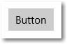
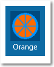

# <a name="buttons"></a>Boutons
<link rel="stylesheet" href="https://az835927.vo.msecnd.net/sites/uwp/Resources/css/custom.css"> 

Un bouton permet à l’utilisateur de déclencher une action immédiate.



<div class="important-apis" >
<b>API importantes</b><br/>
<ul>
<li>[**Classe Button**](https://msdn.microsoft.com/library/windows/apps/windows.ui.xaml.controls.button.aspx)</li>
<li>[**Classe RepeatButton**](https://msdn.microsoft.com/library/windows/apps/windows.ui.xaml.controls.primitives.repeatbutton.aspx)</li>
<li>[**Événement Click**](https://msdn.microsoft.com/library/windows/apps/windows.ui.xaml.controls.primitives.buttonbase.click.aspx)</li>
</ul>
</div>

## <a name="is-this-the-right-control"></a>Est-ce le contrôle approprié?

Un bouton permet à l’utilisateur d’initier une action immédiate, telle que l’envoi d’un formulaire.

N’utilisez pas de bouton lorsque l’action consiste à naviguer vers une autre page; dans ce cas, utilisez plutôt un lien. Voir [Liens hypertexte](hyperlinks.md) pour plus d’informations.
    
> Exception: pour la navigation dans un assistant, utilisez les boutons Précédent et Suivant. Pour les autres types de navigation vers l’arrière ou vers un niveau supérieur, utilisez un bouton Précédent.

## <a name="example"></a>Exemple

Cet exemple utilise deux boutons, Tout fermer et Annuler, dans une boîte de dialogue du navigateur MicrosoftEdge. 


## <a name="create-a-button"></a>Créer un bouton

Cet exemple illustre un bouton qui répond à un clic. 

Créez le bouton en XAML.

```xaml
<Button Content="Submit" Click="SubmitButton_Click"/>
```

Ou créez le bouton dans le code.

```csharp
Button submitButton = new Button();
submitButton.Content = "Submit";
submitButton.Click += SubmitButton_Click;

// Add the button to a parent container in the visual tree.
stackPanel1.Children.Add(submitButton);
```

Gérez l’événement Click.

```csharp
private async void SubmitButton_Click(object sender, RoutedEventArgs e)
{
    // Call app specific code to submit form. For example:
    // form.Submit();
    Windows.UI.Popups.MessageDialog messageDialog = 
        new Windows.UI.Popups.MessageDialog("Thank you for your submission.");
    await messageDialog.ShowAsync();
}
```

### <a name="button-interaction"></a>Interaction de bouton

Lorsque vous appuyez sur un bouton avec un doigt ou un stylet, ou lorsque vous cliquez dessus avec le bouton de la souris, le bouton déclenche l’événement [**Click**](https://msdn.microsoft.com/library/windows/apps/windows.ui.xaml.controls.primitives.buttonbase.click.aspx). Si un bouton est sélectionné au clavier, une pression sur la touche Entrée ou sur la barre d’espace déclenche également l’événement Click.

Généralement, vous ne pouvez pas gérer les événements [**PointerPressed**](https://msdn.microsoft.com/library/windows/apps/windows.ui.xaml.uielement.pointerpressed.aspx) de bas niveau sur un bouton, car un comportement Click lui est affecté à la place. Pour plus d’informations, voir [Vue d’ensemble des événements et des événements routés](https://msdn.microsoft.com/library/windows/apps/mt185584.aspx).

Vous pouvez modifier la façon dont un bouton déclenche l’événement Click en modifiant la propriété [**ClickMode**](https://msdn.microsoft.com/library/windows/apps/windows.ui.xaml.controls.primitives.buttonbase.clickmode.aspx). La valeur ClickMode par défaut est **Release**. Si ClickMode est défini sur **Hover**, l’événement Click ne peut pas être déclenché avec le clavier ou le mode tactile. 


### <a name="button-content"></a>Contenu du bouton

Le bouton est un [**ContentControl**](https://msdn.microsoft.com/library/windows/apps/xaml/windows.ui.xaml.controls.contentcontrol.aspx). Sa propriété de contenu XAML est [**Content**](https://msdn.microsoft.com/library/windows/apps/xaml/windows.ui.xaml.controls.contentcontrol.content.aspx), ce qui permet une syntaxe comme celle-ci pour XAML : `<Button>A button's content</Button>`. Vous pouvez définir n’importe quel objet comme contenu du bouton. Si le contenu est un objet [UIElement](https://msdn.microsoft.com/library/windows/apps/xaml/windows.ui.xaml.uielement.aspx), il est affiché dans le bouton. Si le contenu est un autre type d’objet, sa représentation sous forme de chaîne est affichée dans le bouton.

Ici, un objet **StackPanel** qui contient une image d’une orange, et un texte est défini comme le contenu d’un bouton.

```xaml
<Button Click="Button_Click" 
        Background="#FF0D6AA3" 
        Height="100" Width="80">
    <StackPanel>
        <Image Source="Assets/Slices.png" Height="62"/>
        <TextBlock Text="Orange"  Foreground="White"
                   HorizontalAlignment="Center"/>
    </StackPanel>
</Button>
```

Le bouton ressemble à ceci.



## <a name="create-a-repeat-button"></a>Créer un bouton de répétition

Un [**RepeatButton**](https://msdn.microsoft.com/library/windows/apps/windows.ui.xaml.controls.primitives.repeatbutton.aspx) est un bouton qui déclenche les événements [**Click**](https://msdn.microsoft.com/library/windows/apps/windows.ui.xaml.controls.primitives.buttonbase.click.aspx) plusieurs fois à partir du moment où il est enfoncé jusqu’à ce qu’il soit relâché. Définissez la propriété [**Delay**](https://msdn.microsoft.com/library/windows/apps/windows.ui.xaml.controls.primitives.repeatbutton.delay.aspx) pour spécifier la durée pendant laquelle RepeatButton attend entre le moment où il est actionné et le moment où il commence à répéter l’action de clic. Définissez la propriété [**Interval**](https://msdn.microsoft.com/library/windows/apps/windows.ui.xaml.controls.primitives.repeatbutton.interval.aspx) pour spécifier la durée entre les répétitions de l’action de clic. Les durées pour les deux propriétés sont spécifiées en millisecondes.

L’exemple suivant montre deux contrôles RepeatButton dont les événements Click respectifs sont utilisés pour augmenter ou réduire la valeur affichée dans un bloc de texte.

```xaml
<StackPanel>
    <RepeatButton Width="100" Delay="500" Interval="100" Click="Increase_Click">Increase</RepeatButton>
    <RepeatButton Width="100" Delay="500" Interval="100" Click="Decrease_Click">Decrease</RepeatButton>
    <TextBlock x:Name="clickTextBlock" Text="Number of Clicks:" />
</StackPanel>
```

```csharp
private static int _clicks = 0;
private void Increase_Click(object sender, RoutedEventArgs e)
{
    _clicks += 1;
    clickTextBlock.Text = "Number of Clicks: " + _clicks;
}

private void Decrease_Click(object sender, RoutedEventArgs e)
{
    if(_clicks > 0)
    {
        _clicks -= 1;
        clickTextBlock.Text = "Number of Clicks: " + _clicks;
    }
}
```

## <a name="recommendations"></a>Recommandations

-   Assurez-vous que le but et l’état actuel d’un bouton sont clairs pour l’utilisateur.
-   Utilisez un texte concis, précis et suffisamment explicite qui décrit clairement l’action effectuée par le bouton. Généralement, le texte d’un bouton est représenté par un seul mot, un verbe.
-   Quand plusieurs boutons permettent de faire le même choix (comme dans une boîte de dialogue de confirmation), présentez les boutons de validation dans cet ordre: 
    -   OK/[Faire l’action]/Oui
    -   [Ne pas faire l’action]/Non
    -   Annuler

    (où [Faire l’action] et [Ne pas faire l’action] sont des réponses spécifiques à l’instruction principale.)

-   Si le contenu du texte du bouton est dynamique, par exemple s’il est localisé, songez au redimensionnement du bouton et à ses conséquences sur les contrôles environnant.
-   Pour les boutons de commande avec du texte, utilisez une largeur de bouton minimale.
-   Évitez les boutons de commande trop étroits, petits ou hauts avec des étiquettes de texte.
-   Utilisez la police par défaut à moins que vos instructions de personnalisation imposent d’en utiliser une autre.
-   Pour une action qui doit être disponible sur plusieurs pages dans votre application, pensez à utiliser une [barre d’application inférieure](app-bars.md), au lieu de dupliquer un bouton sur plusieurs pages.
-   Exposez seulement un ou deux boutons à la fois pour l’utilisateur, par exemple Accepter et Annuler. Si vous devez inviter l’utilisateur à effectuer plusieurs actions, pensez à utiliser des [cases à cocher](checkbox.md) ou des [cases d’option](radio-button.md) à partir desquelles l’utilisateur peut sélectionner des actions, avec un seul bouton de commande pour les déclencher.
-   Utilisez le bouton de commande par défaut pour indiquer l’action la plus courante ou recommandée.
-   Envisagez de personnaliser vos boutons. Un bouton est rectangulaire par défaut, mais vous pouvez personnaliser les effets visuels qui constituent son apparence. Le contenu du bouton correspond généralement à du texte (par exemple Accepter ou Annuler) mais vous pouvez remplacer le texte par une icône, ou utiliser une icône plus du texte.
-   Lorsque l’utilisateur interagit avec un bouton, vous devez vous assurer que le bouton change d’état et d’apparence pour fournir un retour à l’utilisateur. Les exemples d’états de bouton sont : normal, enfoncé et désactivé.
-   Déclenchez l’action du bouton lorsque l’utilisateur appuie ou clique dessus. Généralement, l’action est déclenchée lorsque l’utilisateur relâche le bouton, mais vous pouvez également définir l’action d’un bouton de sorte qu’il déclenche une action au premier contact du doigt.
-   N’utilisez pas de bouton de commande pour définir un état.
-   Ne modifiez pas le texte du bouton pendant l’exécution de l’application. Par exemple, ne modifiez pas le texte d’un bouton de « Suivant » en « Continuer ».
-   Ne permutez pas les styles par défaut des boutons submit, reset et button.
-   Ne surchargez pas le contenu d’un bouton. Faites en sorte que le contenu soit concis et facile à comprendre (rien d’autre qu’une image et du texte).

## <a name="back-buttons"></a>Boutons Précédent
Le bouton Précédent est un élément de l’interface utilisateur fournie par le système qui permet de revenir en arrière dans la pile Back ou dans l’historique de navigation de l’utilisateur. Vous n’avez pas besoin de créer votre propre bouton précédent, mais vous devez peut-être effectuer certaines opérations pour obtenir une bonne expérience de navigation vers l’arrière. Pour plus d’informations, voir [Navigation dans l’historique et navigation vers l’arrière](../layout/navigation-history-and-backwards-navigation.md)

## <a name="get-the-sample-code"></a>Obtenir l’exemple de code
*   [Exemple d’éléments de base d’une interface utilisateurXAML](https://github.com/Microsoft/Windows-universal-samples/blob/master/Samples/XamlUIBasics)<br/>
    Affichez tous les contrôles XAML dans un format interactif.


## <a name="related-articles"></a>Articles connexes

- [Cases d’option](radio-button.md)
- [Boutons bascule](toggles.md)
- [Cases à cocher](checkbox.md)
- [**Classe Button**](https://msdn.microsoft.com/library/windows/apps/windows.ui.xaml.controls.button.aspx)


