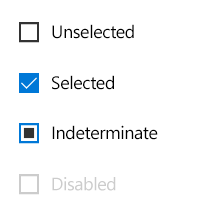
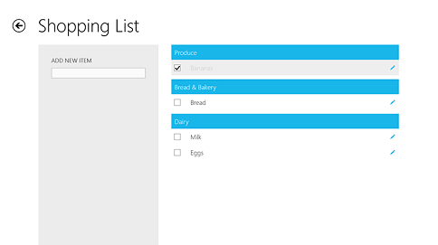
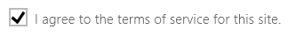
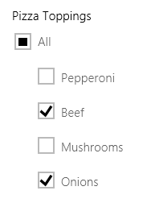
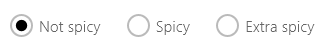

# Check boxes

A check box is used to select or deselect action items, and can be used for a single list item or for multiple list items. The control has three selections states: unselected, selected, and indeterminate. The indeterminate state appears when a collection of sub-choices have both unselected and selected states.



<span class="sidebar_heading" style="font-weight: bold;">Important APIs</span>
-   [**CheckBox class**](https://msdn.microsoft.com/library/windows/apps/br209316) 

## Example

This examples uses check boxes to create a shopping list.



## <a name="is-this-the-right-control"></a>Is this the right control?

Use a single check box for a binary yes/no choice, such as with a "Remember me?" login scenario or with a terms of service agreement.



Use multiple check boxes for multi-select scenarios in which a user chooses one or more items from a group of choices that are not mutually exclusive.

For a binary choice, the main difference between a check box and a toggle switch is that the check box is for status and the toggle switch is for action. You can delay committing a check box interaction (as part of a form submit, for example) while you should immediately commit a toggle switch interaction. Also, only check boxes allow for multi-selection.

Create a group of check boxes when users can select any combination of options.


Unlike radio buttons, where a group of radio buttons represents a single choice, each check box in a group represents a separate, independent choice. When there is more than one option but only one can be selected, use a radio button instead.

When an option applies to more than one object, you can use a check box to indicate whether the option applies to all, some, or none of those objects. When the option applies to some, but not all, of those objects, use the check box's indeterminate state to represent a mixed choice. One example of a mixed choice check box is a "Select all" check box that becomes indeterminate when a user selects some, but not all, sub-items.



For more info, see the [**Indeterminate event (XAML)**](https://msdn.microsoft.com/library/windows/apps/br209797).

## Create a checkbox

To create a checkbox, you use the CheckBox object. 
-   A CheckBox can be a child of any content control. You usually add a checkbox as a child of panel, such as a StackPanel or a Grid. 
-   To assign a label to the checkbox, use the Content property. The label displays next to the checkbox. 
-   To perform an action when the check box state changes, add a handler for the Click event. You could use the Checked event handler instead, but it only fires when a checkbox changes from unchecked to checked, while the Click event fires whenever the checked state changes, making it a bit more useful. 

Multiple checkboxes can share the same event handler. 
This example creates four checkboxes for selecting pizza toppings. The four checkboxes share the same Click event handler. 


```XAML
<StackPanel>
    <CheckBox Content="Pepperoni" x:Name="pepperoniCheckbox" 
        Checked="pizzaToppingCheckBox_Checked">
    </CheckBox>
    <CheckBox Content="Beef" x:Name="beefCheckbox" 
        Checked="pizzaToppingCheckBox_Checked">
    </CheckBox>
    <CheckBox Content="Mushrooms" x:Name="mushroomsCheckbox"
        Checked="pizzaToppingCheckBox_Checked">
    </CheckBox>
    <CheckBox Content="Onions" x:Name="onionsCheckbox"
        Checked="pizzaToppingCheckBox_Checked" >
    </CheckBox>

    <!-- Display the selected toppings. -->
    <TextBlock>Toppings selected:</TextBlock>
    <TextBlock x:Name="toppingsList"></TextBlock>
</StackPanel>
```

The example shows the event handler for the Click event. Every time a checkbox is clicked, it examines the checkboxes to see which ones are checked.

```C#
private void pizzaToppingCheckBox_Clicked(
    object sender, RoutedEventArgs e)
{
    CheckBox selectedCheckbox = sender as CheckBox;

    string selectedToppingsText = "";
    CheckBox[] checkboxes = 
        new CheckBox[] { pepperoniCheckbox, beefCheckbox, 
                         mushroomsCheckbox, onionsCheckbox };
    foreach(CheckBox c in checkboxes)
    {
        if (c.IsChecked == true)
        {
            if (selectedToppingsText.Length > 1)
            {
                selectedToppingsText += ", ";
            }
            selectedToppingsText += c.Content;
        }
     }
     toppingsList.Text = selectedToppingsText;
}
```


## <a name="dos-and-donts"></a>Do's and don'ts 

-   Verify that the purpose and current state of the check box is clear.
-   Limit check box text content to no more than two lines.
-   Word the checkbox label as a statement that the check mark makes true and the absence of a check mark makes false.
-   Use the default font unless your brand guidelines tell you to use another.
-   If there are several choices to present, consider using a [scroll viewer](scroll-controls.md) control with a layout panel inside it.
-   Use the indeterminate state to indicate that an option is set for some, but not all, sub-choices.
-   When using indeterminate state, use subordinate check boxes to show which options are selected and which are not. Design the UI so that the user can get see the sub-choices.
-   If the text content is dynamic, consider how the control will resize and what will happen to visuals around it.
-   If there are two or more mutually exclusive options from which to choose, consider using [radio buttons](radio-button.md).
-   Don't put two check box groups next to each other. Use group labels to separate the groups.
-   Don't use a check box as an on/off control or to perform a command; instead, use a toggle switch.
-   Don't use a check box to display other controls, such as a dialog box.
-   Don't use the indeterminate state to represent a third state. The indeterminate state is used to indicate that an option is set for some, but not all, sub-choices. So, don't allow users to set an indeterminate state directly. For an example of what not to do, this check box uses the indeterminate state to indicate medium spiciness:

    

    Instead, use a radio button group that has three options: Not spicy, Spicy, and Extra spicy.

    


## Related articles

-   [**CheckBox class**](https://msdn.microsoft.com/library/windows/apps/br209316) 


<!--HONumber=Mar16_HO1-->
