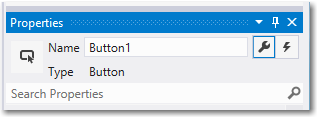
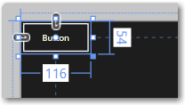
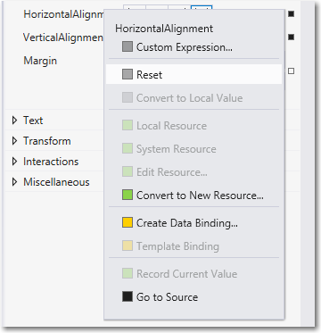
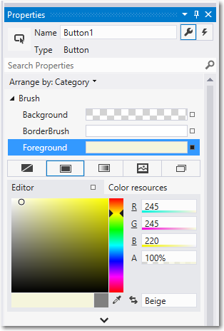
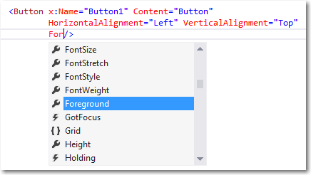
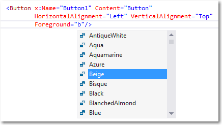
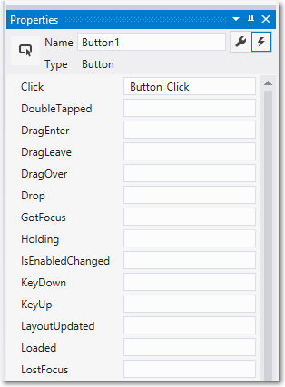
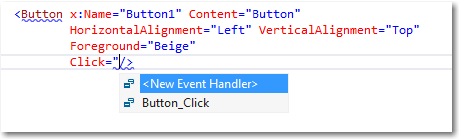

# Présentation des contrôles et des événements

Pour créer l’interface utilisateur de votre application, utilisez des contrôles tels que des boutons, des zones de texte et des zones de liste modifiable pour afficher les données et obtenir les entrées utilisateur. Cette rubrique indique comment ajouter des contrôles à votre application. Il existe 3 étapes principales pour l’ajout de contrôles à votre application : 

- Ajoutez un contrôle à l’interface utilisateur de votre application. 
- Définissez des propriétés sur le contrôle, telles que la largeur, la hauteur ou la couleur de premier plan. 
- Associez du code aux gestionnaires d’événements du contrôle afin qu’il effectue une opération. 

## Ajouter un contrôle
Vous pouvez ajouter un contrôle à une application de plusieurs façons :
 
- Utilisez un outil de conception tel que Blend pour Visual Studio ou le concepteur XAML (Extensible Application Markup Language) Microsoft Visual Studio. 
- Ajoutez le contrôle au balisage XAML dans l’éditeur XAML Visual Studio. 
- Ajoutez le contrôle dans du code. Les contrôles que vous ajoutez dans du code sont visibles lorsque l’application s’exécute, mais pas dans le concepteur XAML Visual Studio.

Dans Visual Studio, lorsque vous ajoutez et manipulez des contrôles dans votre application, vous pouvez utiliser de nombreuses fonctionnalités du programme, notamment la boîte à outils, le concepteur XAML, l’éditeur XAML et la fenêtre Propriétés. 

La boîte à outils Visual Studio affiche de nombreux contrôles utilisables dans votre application. Pour ajouter un contrôle à votre application, double-cliquez dessus dans la boîte à outils. Par exemple, lorsque vous double-cliquez sur le contrôle TextBox, le code XAML suivant est ajouté à la vue XAML. 

```xaml
<TextBox HorizontalAlignment="Left" Text="TextBox" VerticalAlignment="Top"/>
```

Vous pouvez également faire glisser le contrôle à partir de la boîte à outils jusqu’au concepteur XAML.

## Définir le nom d’un contrôle 

Pour utiliser un contrôle dans du code, vous définissez son attribut [x:Name](../xaml-platform/x-name-attribute.md), puis vous le référencez par son nom dans votre code. Vous pouvez définir le nom dans la fenêtre Propriétés de Visual Studio ou en XAML. Voici comment définir le nom du contrôle actuellement sélectionné en utilisant la zone de texte Nom en haut de la fenêtre Propriétés. 

Pour affecter un nom à un contrôle
1. Sélectionnez l’élément à nommer.
2. Dans le panneau Propriétés, tapez un nom dans la zone de texte Nom.
3. Appuyez sur Entrée pour valider le nom.



Voici comment vous pouvez définir le nom d’un contrôle dans l’éditeur XAML en ajoutant l’attribut x:Name.

```xaml
<Button x:Name="Button1" Content="Button"/>
```

## Définir les propriétés de contrôle 

Les propriétés vous permettent de spécifier l’aspect, le contenu et d’autres attributs des contrôles. Lorsque vous ajoutez un contrôle à l’aide d’un outil de conception, certaines propriétés qui contrôlent la taille, la position et le contenu peuvent être définis automatiquement par Visual Studio. Vous pouvez modifier certaines propriétés, telles que Width, Height ou Margin, en sélectionnant et en manipulant le contrôle en mode Création. L’illustration suivante montre certains des outils de redimensionnement disponibles en mode Création. 



Vous souhaiterez peut-être laisser le contrôle être redimensionné et positionné automatiquement. Dans ce cas, vous pouvez redéfinir les propriétés de taille et de position définies automatiquement par Visual Studio.

Pour réinitialiser une propriété
1. Dans le panneau Propriétés, cliquez sur le marqueur de propriété en regard de la valeur de propriété. Le menu des propriétés s’ouvre.
2. Dans le menu des propriétés, cliquez sur Réinitialiser.



Vous pouvez définir les propriétés d’un contrôle dans la fenêtre Propriétés, en XAML ou dans du code. Par exemple, pour modifier la couleur de premier plan d’un objet Button, vous définissez la propriété Foreground du contrôle. L’illustration suivante montre comment définir la propriété Foreground à l’aide du sélecteur de couleurs dans la fenêtre Propriétés. 



Voici comment définir la propriété Foreground dans l’éditeur XAML. Notez l’ouverture de la fenêtre Visual Studio IntelliSense pour une entrée plus aisée de la syntaxe. 





Voici la syntaxe XAML issue de la définition de la propriété Foreground. 

```xaml
<Button x:Name="Button1" Content="Button" 
        HorizontalAlignment="Left" VerticalAlignment="Top"
        Foreground="Beige"/>
```

Voici comment définir la propriété Foreground dans du code. 

```csharp
Button1.Foreground = new SolidColorBrush(Windows.UI.Colors.Beige);
```

## Créer un gestionnaire d’événements 

Chaque contrôle possède des événements qui réagissent aux actions de l’utilisateur ou à d’autres modifications dans votre application. Par exemple, un contrôle Button contient un événement Click qui est déclenché lorsqu’un utilisateur clique sur l’objet Button. Vous créez une méthode, appelée gestionnaire d’événements, pour gérer l’événement. Vous pouvez associer l’événement d’un contrôle à une méthode de gestionnaire d’événements dans la fenêtre Propriétés, en XAML ou dans du code. Pour plus d’informations sur les événements, voir [Vue d’ensemble des événements et des événements routés](../xaml-platform/events-and-routed-events-overview.md).

Pour créer un gestionnaire d’événements, sélectionnez le contrôle, puis cliquez sur l’onglet Événements en haut de la fenêtre Propriétés. La fenêtre Propriétés répertorie tous les événements disponibles pour ce contrôle. Voici une partie des événements associés à un objet Button.



Pour créer un gestionnaire d’événements avec le nom par défaut, double-cliquez sur la zone de texte en regard du nom d’événement dans la fenêtre Propriétés. Pour créer un gestionnaire d’événements avec un nom personnalisé, tapez le nom de votre choix dans la zone de texte, puis appuyez sur Entrée. Le gestionnaire d’événements est créé, et le fichier code-behind est ouvert dans l’éditeur de code. La méthode de gestionnaire d’événements possède 2 paramètres. Le premier est `sender`, qui est une référence à l’objet auquel le gestionnaire est attaché. Le paramètre `sender` est un type **Object**. Vous effectuez généralement une conversion de type (transtypage) `sender` en un type plus précis si vous prévoyez de vérifier ou de modifier l’état sur l’objet `sender` lui-même. En fonction de la conception de votre propre application, vous attendez un type vers lequel un transtypage de `sender` peut être effectué en toute sécurité, en fonction de l’élément auquel le gestionnaire est attaché. La seconde valeur correspond aux données d’événement, qui apparaissent généralement dans les signatures sous la forme du paramètre `e` ou `args`.

Voici le code qui gère l’événement Click d’un objet Button nommé `Button1`. Lorsque vous cliquez sur le bouton, la propriété Foreground de l’objet Button sur lequel vous avez cliqué a la valeur blue. 

```csharp
private void Button_Click(object sender, RoutedEventArgs e)
{
    Button b = (Button)sender;
    b.Foreground = new SolidColorBrush(Windows.UI.Colors.Blue);
}
```

Vous pouvez également associer un gestionnaire d’événements en XAML. Dans l’éditeur XAML, tapez le nom de l’événement à gérer. Visual Studio affiche une fenêtre IntelliSense lorsque vous commencez à taper. Après avoir spécifié l’événement, vous pouvez double-cliquer sur `<New Event Handler>` dans la fenêtre IntelliSense pour créer un gestionnaire d’événements portant le nom par défaut, ou sélectionner un gestionnaire d’événements existant dans la liste. 

Voici la fenêtre IntelliSense qui apparaît. Elle vous permet de créer un gestionnaire d’événements ou de sélectionner un gestionnaire d’événements existants.



L’exemple suivant montre comment associer un événement Click à un gestionnaire d’événements nommé Button_Click en XAML. 

```xaml
<Button Name="Button1" Content="Button" Click="Button_Click"/>
```

Vous pouvez également associer un événement à son gestionnaire d’événements dans le code-behind. Voici comment associer un gestionnaire d’événements dans du code.

```csharp
Button1.Click += new RoutedEventHandler(Button_Click);
```

\[Cet article contient des informations propres aux applications de plateforme Windows universelle (UWP) et à Windows 10. Pour obtenir de l’aide concernant Windows 8.1, téléchargez le [document PDF de recommandations pour Windows 8.1](https://go.microsoft.com/fwlink/p/?linkid=258743) (en anglais).\]

## Rubriques connexes

-   [**Barre de commandes**](app-bars.md)
-   [Rechercher](search.md)
-   [Menus volants](dialogs-popups-menus.md)


<!--HONumber=Mar16_HO1-->


