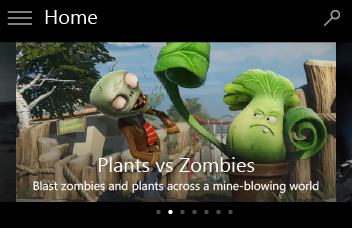
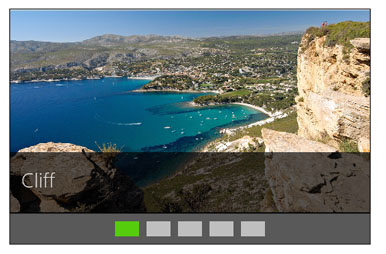

# <a name="flip-view"></a>Vue symétrique

<link rel="stylesheet" href="https://az835927.vo.msecnd.net/sites/uwp/Resources/css/custom.css"> 

La vue symétrique permet de parcourir les images ou d’autres éléments d’une collection, par exemple les photos d’un album ou les éléments d’une page de détails sur le produit, élément après élément. Pour les appareils tactiles, un mouvement de balayage sur un élément permet de parcourir la collection. Pour une souris, les boutons de navigation apparaissent au pointage de la souris. Pour un clavier, les touches de direction permettent de parcourir la collection.

<div class="important-apis" >
<b>API importantes</b><br/>
<ul>
<li>[**Classe FlipView**](https://msdn.microsoft.com/library/windows/apps/windows.ui.xaml.controls.flipview.aspx)</li>
<li> [**Propriété ItemsSource**](https://msdn.microsoft.com/library/windows/apps/windows.ui.xaml.controls.itemscontrol.itemssource.aspx)</li>
<li>[**Propriété ItemTemplate**](https://msdn.microsoft.com/library/windows/apps/windows.ui.xaml.controls.itemscontrol.itemtemplate.aspx)</li>

</ul>
</div>

## <a name="is-this-the-right-control"></a>Est-ce le contrôle approprié ?

La vue symétrique est appropriée pour l’examen des images des petites et moyennes collections (jusqu’à 25 éléments environ). Les exemples de telles collections comprennent les éléments d’une page de détails de produit ou les photos d’un album. Même si nous ne recommandons pas la vue symétrique pour la plupart des grandes collections, ce contrôle est souvent utilisé pour afficher les images individuelles d’un album photo.

## <a name="examples"></a>Exemples

La navigation horizontale, c’est-à-dire à partir de l’élément le plus à gauche et vers la droite, est la disposition de vue symétrique la plus commune. Cette disposition fonctionne bien en orientation portrait ou paysage sur tous les appareils :


Une vue symétrique peut également être utilisée verticalement :


## <a name="create-a-flip-view"></a>Créer une vue symétrique

Le contrôle FlipView est un élément [ItemsControl](https://msdn.microsoft.com/library/windows/apps/windows.ui.xaml.controls.itemscontrol.aspx). Il peut donc contenir une collection d’éléments de n’importe quel type. Pour renseigner la vue, ajoutez des éléments à la collection [**Items**](https://msdn.microsoft.com/library/windows/apps/windows.ui.xaml.controls.itemscontrol.items.aspx), ou définissez une propriété [**ItemsSource**](https://msdn.microsoft.com/library/windows/apps/windows.ui.xaml.controls.itemscontrol.itemssource.aspx) sur une source de données.

Par défaut, un élément de données est affiché dans la vue symétrique en tant que représentation de chaîne de l’objet de données auquel il est lié. Pour définir exactement la manière dont les éléments s’affichent dans la vue symétrique, créez un [**DataTemplate**](https://msdn.microsoft.com/library/windows/apps/windows.ui.xaml.datatemplate.aspx) afin de définir la disposition des contrôles utilisés pour afficher un élément. Les contrôles dans la disposition peuvent être liés aux propriétés d’un objet de données ou leur contenu peut être défini inline. L’objet DataTemplate est affecté à la propriété [**ItemTemplate**](https://msdn.microsoft.com/library/windows/apps/windows.ui.xaml.controls.itemscontrol.itemtemplate.aspx) de l’objet FlipView.

### <a name="add-items-to-the-items-collection"></a>Ajouter des éléments à la collection Items

Vous pouvez ajouter des éléments à la collection [**Items**](https://msdn.microsoft.com/library/windows/apps/windows.ui.xaml.controls.itemscontrol.items.aspx) en utilisant le langage XAML ou du code. Vous ajoutez généralement des éléments de cette façon si vous avez un petit nombre d’éléments qui ne sont pas modifiés et sont facilement définis en XAML, ou si vous générez les éléments dans le code lors de l’exécution. Voici un FlipView avec des éléments définis inline.

```xaml
<FlipView x:Name="flipView1">
    <Image Source="Assets/Logo.png" />
    <Image Source="Assets/SplashScreen.png" />
    <Image Source="Assets/SmallLogo.png" />
</FlipView>
```

```csharp
// Create a new flip view, add content, 
// and add a SelectionChanged event handler.
FlipView flipView1 = new FlipView();
flipView1.Items.Add("Item 1");
flipView1.Items.Add("Item 2");

// Add the flip view to a parent container in the visual tree.
stackPanel1.Children.Add(flipView1);
```

Lorsque vous ajoutez des éléments à une vue symétrique, ils sont placés automatiquement dans un conteneur [**FlipViewItem**](https://msdn.microsoft.com/library/windows/apps/xaml/windows.ui.xaml.controls.flipviewitem.aspx). Pour modifier l’apparence d’un élément, vous pouvez appliquer un style au conteneur d’éléments en définissant la propriété [**ItemContainerStyle**](https://msdn.microsoft.com/library/windows/apps/xaml/windows.ui.xaml.controls.itemscontrol.itemcontainerstyle.aspx). 

Lorsque vous définissez les éléments en XAML, ceux-ci sont automatiquement ajoutés à la collection Items.

### <a name="set-the-items-source"></a>Définir la source des éléments

On utilise en général une vue symétrique pour afficher des données d’une source telle qu’une base de données ou Internet. Pour renseigner une vue symétrique à partir d’une source de données, vous affectez à sa propriété [**ItemsSource**](https://msdn.microsoft.com/library/windows/apps/xaml/windows.ui.xaml.controls.itemscontrol.itemssource.aspx) une collection d’éléments de données.

Ici, la propriété ItemsSource de la vue symétrique prend la valeur de l’instance d’une collection directement dans le code.

```csharp
// Data source.
List<String> itemsList = new List<string>();
itemsList.Add("Item 1");
itemsList.Add("Item 2");

// Create a new flip view, add content, 
// and add a SelectionChanged event handler.
FlipView flipView1 = new FlipView();
flipView1.ItemsSource = itemsList;
flipView1.SelectionChanged += FlipView_SelectionChanged;

// Add the flip view to a parent container in the visual tree.
stackPanel1.Children.Add(flipView1);
```

Vous pouvez également lier la propriété ItemsSource à une collection en XAML. Pour plus d’informations, voir [Liaison de données avec XAML](../data-binding/data-binding-quickstart.md).

Dans le cas présent, la propriété ItemsSource est liée à un objet [**CollectionViewSource**](https://msdn.microsoft.com/library/windows/apps/xaml/windows.ui.xaml.data.collectionviewsource.aspx) nommé `itemsViewSource`. 

```xaml
<Page.Resources>
    <!-- Collection of items displayed by this page -->
    <CollectionViewSource x:Name="itemsViewSource" Source="{Binding Items}"/>
</Page.Resources>

...

<FlipView x:Name="itemFlipView" 
          ItemsSource="{Binding Source={StaticResource itemsViewSource}}"/>
```

>**Remarque**&nbsp;&nbsp;Vous pouvez remplir un contrôle FlipView en ajoutant des éléments directement dans sa collection Items ou en définissant sa propriété ItemsSource, mais vous ne pouvez pas faire les deux à la fois. Si vous définissez la propriété ItemsSource et que vous ajoutez un élément en XAML, l’élément ajouté est ignoré. Si vous définissez la propriété ItemsSource et que vous ajoutez un élément à la collection Items dans le code, une exception est levée.

### <a name="specify-the-look-of-the-items"></a>Spécifier l’accès des éléments

Par défaut, un élément de données est affiché dans la vue symétrique en tant que représentation de chaîne de l’objet de données auquel il est lié. En général, on souhaite afficher une représentation enrichie des données. Pour définir précisément la façon dont les éléments sont affichés dans la vue symétrique, vous devez créer un objet [**DataTemplate**](https://msdn.microsoft.com/library/windows/apps/xaml/windows.ui.xaml.datatemplate.aspx). Le code XAML dans l’objet DataTemplate définit la disposition et l’apparence des contrôles qui permettent d’afficher un élément spécifique. Les contrôles dans la disposition peuvent être liés aux propriétés d’un objet de données ou leur contenu peut être défini inline. L’objet DataTemplate est affecté à la propriété [**ItemTemplate**](https://msdn.microsoft.com/library/windows/apps/xaml/windows.ui.xaml.controls.itemscontrol.itemtemplate.aspx) du contrôle FlipView.

Dans cet exemple, la propriété ItemTemplate d’un objet FlipView est définie inline. Une superposition est ajoutée à l’image pour afficher le nom de l’image. 

```XAML
<FlipView x:Name="flipView1" Width="480" Height="270" 
          BorderBrush="Black" BorderThickness="1">
    <FlipView.ItemTemplate>
        <DataTemplate>
            <Grid>
                <Image Width="480" Height="270" Stretch="UniformToFill"
                       Source="{Binding Image}"/>
                <Border Background="#A5000000" Height="80" VerticalAlignment="Bottom">
                    <TextBlock Text="{Binding Name}" 
                               FontFamily="Segoe UI" FontSize="26.667" 
                               Foreground="#CCFFFFFF" Padding="15,20"/>
                </Border>
            </Grid>
        </DataTemplate>
    </FlipView.ItemTemplate>
</FlipView>
```

Voici à quoi ressemble la disposition définie par le modèle de données.

Modèle de données affiché sous forme de vue symétrique.

### <a name="set-the-orientation-of-the-flip-view"></a>Définir l’orientation de la vue symétrique

Par défaut, la vue symétrique défile horizontalement. Pour le faire défiler verticalement, utilisez un panneau d’empilement avec une orientation verticale comme l’objet [**ItemsPanel**](https://msdn.microsoft.com/library/windows/apps/windows.ui.xaml.controls.itemscontrol.itemspanel.aspx) de la vue symétrique.

Cet exemple montre comment spécifier un panneau d’empilement avec une orientation verticale comme l’objet ItemsPanel d’un contrôle FlipView.

```XAML
<FlipView x:Name="flipViewVertical" Width="480" Height="270" 
          BorderBrush="Black" BorderThickness="1">
    
    <!-- Use a vertical stack panel for vertical flipping. -->
    <FlipView.ItemsPanel>
        <ItemsPanelTemplate>
            <VirtualizingStackPanel Orientation="Vertical"/>
        </ItemsPanelTemplate>
    </FlipView.ItemsPanel>
    
    <FlipView.ItemTemplate>
        <DataTemplate>
            <Grid>
                <Image Width="480" Height="270" Stretch="UniformToFill"
                       Source="{Binding Image}"/>
                <Border Background="#A5000000" Height="80" VerticalAlignment="Bottom">
                    <TextBlock Text="{Binding Name}" 
                               FontFamily="Segoe UI" FontSize="26.667" 
                               Foreground="#CCFFFFFF" Padding="15,20"/>
                </Border>
            </Grid>
        </DataTemplate>
    </FlipView.ItemTemplate>
</FlipView>
```

Voici à quoi ressemble la vue symétrique avec une orientation verticale.


## <a name="adding-a-context-indicator"></a>Ajout d’un indicateur de contexte

Un indicateur de contexte dans une vue symétrique fournit un bon point de référence. Les points d’un indicateur de contexte standard ne sont pas interactifs. Comme illustré dans cet exemple, le meilleur emplacement est généralement au centre et en dessous de la galerie de photos :



Pour les plus grandes collections (10 à 25 éléments), un indicateur qui propose plus de contexte, par exemple une bande de miniatures, peut être utile. Contrairement à un indicateur de contexte qui utilise des points simples, chaque miniature dans la bande affiche une version réduite de l’image correspondante et doit pouvoir être sélectionnée :



Pour obtenir un exemple de code montrant comment ajouter un indicateur de contexte à un FlipView, consultez [Exemple de ListView XAML](http://go.microsoft.com/fwlink/p/?LinkID=311760).

## <a name="dos-and-donts"></a>Pratiques conseillées et déconseillées

-   Les vues symétriques sont particulièrement adaptées aux collections contenant jusqu’à 25 éléments environ.
-   Évitez d’utiliser un contrôle de vue symétrique pour les collections de grande taille, car le passage d’un élément à l’autre peut être fastidieux. Les albums photo, qui possèdent souvent des centaines, voire des milliers d’images, constituent une exception. Ils passent presque toujours en vue symétrique dès lors qu’une photo a été sélectionnée dans l’affichage Grille. Pour les autres collections de grande taille, pensez à [l’affichage Liste ou Grille](lists.md).
-   Pour les indicateurs de contexte :
    -   L’ordre des points (ou n’importe quel marqueur visuel que vous choisissez) fonctionne mieux lorsqu’il est centré et placé sous une galerie avec un mouvement panoramique horizontal.
    -   Si vous souhaitez ajouter un indicateur de contexte dans une galerie avec un mouvement panoramique vertical, nous vous conseillons de le positionner au centre et à droite des images.
    -   Le point en surbrillance indique l’élément actuel. Généralement, le point en surbrillance est blanc et les autres points sont gris.
    -   Le nombre de points peut varier, mais veillez à ne pas en placer trop car l’utilisateur pourrait avoir du mal à se situer. 10 points est généralement le nombre maximal à afficher.

## <a name="globalization-and-localization-checklist"></a>Liste de contrôle de globalisation et de localisation

<table>
<tr>
<th>Considérations bidirectionnelles</th><td>Utilisez la mise en miroir standard pour les langues se lisant de droite à gauche. Les commmandes vers l’arrière et vers l’avant doivent se baser sur le sens de lecture de la langue. Pour les langues se lisant de droite à gauche, le bouton droit doit permettre de naviguer vers l’arrière et le bouton gauche vers l’avant.</td>
</tr>

</table>

## <a name="get-the-sample-code"></a>Obtenir l’exemple de code
* [Exemple d’éléments de base d’une interface utilisateur XAML](https://github.com/Microsoft/Windows-universal-samples/blob/master/Samples/XamlUIBasics)


## <a name="related-articles"></a>Articles connexes

- [Recommandations en matière de listes](lists.md)
- [**Classe FlipView**](https://msdn.microsoft.com/library/windows/apps/br242678)

