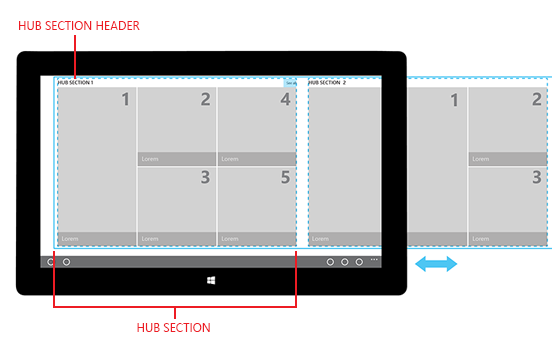
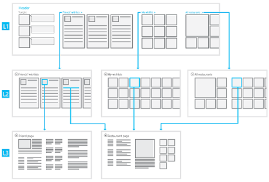
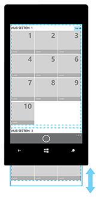
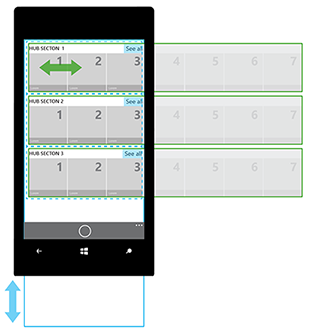

# Modèle/contrôle hub

Un contrôle hub vous permet d’organiser le contenu de l’application en sections ou catégories, distinctes et pourtant liées. Les sections d’un hub sont censées être parcourues dans un ordre préféré et peuvent servir de point de départ pour des expériences plus détaillées.

Le contenu d’un hub peut être affiché dans une vue panoramique robuste qui offre aux utilisateurs un aperçu des nouveautés, des éléments disponibles et du contenu pertinent. Les hubs ont généralement un en-tête de page, alors que plusieurs sections de contenu possèdent chacune un en-tête de section.

Le contrôle hub dispose de plusieurs fonctionnalités qui lui permettent de générer un modèle de navigation de contenu.

-   **Navigation visuelle**

    Un hub permet d’afficher du contenu dans un tableau varié, simple et facile à analyser.

-   **Catégorisation**

    Chaque section du hub permet d’organiser son contenu dans un ordre logique.

-   **Types de contenu mixte**

    Les types de contenu mixte utilisent fréquemment des proportions et des tailles de ressources variables. Un hub permet de disposer chaque type de contenu de façon unique et précise dans chaque section de hub.

-   **Largeurs de page et de contenu variables**

    Grâce à son statut de modèle panoramique, le hub peut prendre en charge des largeurs de section variables. Il constitue donc la solution idéale pour les contenus de profondeurs différentes et permet de formater correctement n’importe quel nombre d’éléments.

-   **Architecture flexible**

    Si vous préférez conserver l’architecture de votre application avec peu de niveaux, vous pouvez ajuster tout le contenu du canal dans un résumé de section du hub.

API importantes

-   [**Classe Hub (XAML)**](https://msdn.microsoft.com/library/windows/apps/dn251843)
-   [**Classe HubSection (XAML)**](https://msdn.microsoft.com/library/windows/apps/dn251845)
-   [**Objet Hub (HTML)**](https://msdn.microsoft.com/library/windows/apps/dn255137)

## Est-ce le contrôle approprié ?

Le contrôle hub fonctionne bien pour afficher de grandes quantités de contenu organisé dans une hiérarchie. Les hubs hiérarchisent la navigation et la découverte de nouveau contenu, et sont utiles pour afficher des éléments dans un magasin ou une collection multimédia.

Un hub fait partie des éléments de navigation que vous pouvez utiliser. Pour en savoir plus sur les modèles de navigation et sur les autres éléments de navigation, voir [Informations de base en matière de conception de la navigation pour les applications de plateforme Windows universelle (UWP)](https://msdn.microsoft.com/library/windows/apps/dn958438).

## Architecture du hub

Le contrôle hub utilise un modèle de navigation hiérarchique qui prend en charge les applications avec une architecture d’informations relationnelle. Un hub comprend différentes catégories de contenu dont chacune est mappée sur les pages de section de l’application. Les pages de section peuvent s’afficher sous la forme qui représente le mieux le scénario et le contenu de la section.

## Dispositions et panoramique/défilement

Plusieurs méthodes permettent de présenter et de parcourir le contenu d’un hub. Assurez-vous simplement que les listes de contenu d’un hub effectuent toujours un mouvement panoramique dans une direction perpendiculaire à sa direction de défilement.

**Mouvement panoramique horizontal**

**Mouvement panoramique vertical**

**Mouvement panoramique horizontal avec une liste/grille à défilement vertical**

**Mouvement panoramique vertical avec une liste/grille à défilement horizontal**

## Exemples

Le Hub permet une grande flexibilité lors de la conception. Il vous permet de concevoir des applications offrant un large éventail d’expériences visuelles riches et attractives. Vous pouvez utiliser une image Hero ou une section de contenu pour le premier groupe ; une grande image pour la zone Hero peut être rognée verticalement et horizontalement sans perte du centre d’intérêt. Voici un exemple d’image Hero simple qui peut être rognée en mode portrait, paysage ou largeur étroite.

Sur les appareils mobiles, une seule section du hub est visible à la fois.

## Recommandations

-   Pour permettre aux utilisateurs de savoir qu’une section du hub contient d’autres informations, nous vous recommandons de détourer le contenu afin qu’une partie dépasse.
-   En fonction des besoins de votre application, vous pouvez ajouter plusieurs sections du hub au contrôle hub, disposant chacune de son propre objectif fonctionnel. Par exemple, une section peut contenir une série de liens et de contrôles, tandis qu’une autre peut servir de référentiel pour les miniatures. L’utilisateur peut faire un mouvement panoramique entre ces sections en utilisant les mouvements pris en charge dans le contrôle hub.
-   Redisposer dynamiquement le contenu est la meilleure façon de l’adapter à différentes tailles de fenêtre.
-   Si votre application comporte de nombreuses sections de hub, pensez à ajouter un zoom sémantique. Cela facilite la recherche des sections lorsque l’application est redimensionnée avec une largeur étroite.
-   Nous recommandons de ne pas avoir d’élément de section de hub conduisant à un autre hub. Il est préférable d’utiliser des en-têtes interactifs pour naviguer vers une autre section ou page de hub.
-   Conçu comme un point de départ, le hub est destiné à être personnalisé pour répondre aux besoins de votre application. Vous pouvez modifier les aspects suivants d’un hub :
    -   Nombre de sections
    -   Type de contenu de chaque section
    -   Emplacements et ordre des sections
    -   Taille des sections
    -   Espacement entre les sections
    -   Espacement entre une section et le haut ou le bas du Hub
    -   Style du texte et taille des en-têtes et du contenu
    -   Couleur de l’arrière-plan, des sections, des en-têtes de section et du contenu des sections

\[Cet article contient des informations propres aux applications UWP et à Windows 10. Pour obtenir de l’aide concernant Windows 8.1, téléchargez le [document PDF de recommandations pour Windows 8.1](https://go.microsoft.com/fwlink/p/?linkid=258743) (en anglais).\]

## Articles connexes
-----------------------------------------------

**Pour les concepteurs**
- [Notions de base sur la navigation](https://msdn.microsoft.com/library/windows/apps/dn958438)

**Pour les développeurs (XAML)**
- [Navigation hiérarchique de A à Z](https://msdn.microsoft.com/library/windows/apps/xaml/dn440585)
- [**Classe Hub Windows.UI.Xaml.Controls**](https://msdn.microsoft.com/library/windows/apps/dn251843)
- [Exemple de contrôle hub XAML](http://go.microsoft.com/fwlink/p/?LinkID=310072)
- [Utilisation d’un hub](https://msdn.microsoft.com/library/windows/apps/xaml/dn308518)

<!--HONumber=Mar16_HO1-->

