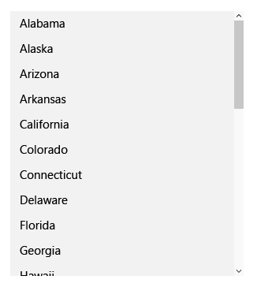

---
Lists display and enable interaction with collection-based content.
Lists
ms.assetid: C73125E8-3768-46A5-B078-FDDF42AB1077
Lists
template: detail.hbs
---
# Lists

Lists display and enable interactions with collection-based content. The four list patterns covered in this article include:

-   List views, which are primarily used to display text-heavy content collections
-   Grid views, which are primarily used to display image-heavy content collections
-   Drop-down lists, which let users choose one item from an expanding list
-   List boxes, which let users choose one item or multiple items from a box that can be scrolled

Design guidelines, features, and examples are given for each list pattern. At the end of the article are links to related topics and APIs.

## Important APIs

-   [**ListView class **](https://msdn.microsoft.com/library/windows/apps/br242878)
-   [**GridView class **](https://msdn.microsoft.com/library/windows/apps/br242705)
-   [**ComboBox class **](https://msdn.microsoft.com/library/windows/apps/br209348)

## List views

List views let you categorize items and assign group headers, drag and drop items, curate content, and reorder items.

### Is this the right control?

Use a list view to:

-   Display a content collection that primarily consists of text.
-   Navigate a single or categorized collection of content.
-   Create the master pane in the [master/details pattern](master-details.md). A master/details pattern is often used in email apps, in which one pane (the master) has a list of selectable items while the other pane (details) has a detailed view of the selected item.

### Examples

When using a [master/details pattern](master-details.md), you can use a list view to organize the master pane. The master pane displays a list of selectable items. When a user selects an item in the master pane, additional info about the selected item is displayed in the details pane. The details pane often contains a grid view.

You can chain together several lists to create complex master/detail hierarchies. For more info, see the [master/details pattern](master-details.md).

The example of a list layout has group headers and displays as a single-column:

### Recommendations

-   Items within a list should have the same behavior.
-   If your list is divided into groups, you can use [semantic zoom](semantic-zoom.md) to make it easier for users to navigate through grouped content.

## Grid views

Grid views are suited for arranging and browsing image-based content collections. A grid view layout scrolls vertically and pans horizontally. Items are laid out in a left-to-right, then top-to-bottom reading order.

### Is this the right control?

Use a list view to:

-   Display a content collection that primarily consists of images.
-   Display content libraries.
-   Format the two content views associated with [semantic zoom](semantic-zoom.md).

### Examples

This example shows a typical grid view layout, in this case for browsing apps. Metadata for grid view items is usually restricted to a few lines of text and an item rating.

A grid view is an ideal solution for a content library, which is often used to present media such as pictures and videos. In a content library, users expect to be able to tap an item to invoke an action.

### Recommendations

-   Items within a list should have the same behavior.
-   If your list is divided into groups, you can use [semantic zoom](semantic-zoom.md) to make it easier for users to navigate through grouped content.

## Drop-down lists

Drop-down lists, also known as combo boxes, start in a compact state and expand to show a list of selectable items. A drop-down list supports either single selection or multiple selection. The selected item is always visible, and non-visible items can be brought into view when the user taps the selected item.

### Is this the right control?

-   Use a drop-down list to let users select a single value from a set of items that can be adequately represented with single lines of text.
-   Use a list or grid view instead of a drop-down to display items that contain multiple lines of text or images.
-   When there are fewer than five items, consider using [radio buttons](radio-button.md) (if only one item can be selected) or [check boxes](checkbox.md) (if multiple items can be selected).
-   Use a drop-down list when the selection items are of secondary importance in the flow of your app. If the default option is recommended for most users in most situations, showing all the items by using a list box might draw more attention to the options than necessary. You can save space and minimize distraction by using a drop-down list.

### Examples

A drop-down list in its compact state can show a header.

Although drop-down lists expand to support longer string lengths, avoid excessively long strings that are difficult to read.

If the collection in a drop-down list is long enough, a scroll bar will appear to accommodate it. Group items logically in the list.

### Recommendations

-   Limit the text content of the drop-down list item to a single line.
-   Sort items in a drop-down list in the most logical order. Group together related options, place the most common options at the top, and order items alphabetically. Sort names in alphabetical order, numbers in numerical order, and dates in chronological order.

## List boxes

A list box allows the user to choose either a single item or multiple items from a collection. List boxes are similar to drop-down lists, except that list boxes are always open—there is no compact (non-expanded) state for a list box. Items in the list can be scrolled if there isn't space to show everything.

### Is this the right control?

-   A list box can be useful when items in the list are important enough to prominently display, and when there's enough screen real estate, to show the full list.
-   A list box should draw the user's attention to the full set of alternatives in an important choice. By contrast, a drop-down list initially draws the user's attention to the selected item.
-   Avoid using a list box if:
    -   There is a very small number of items for the list. A single-select list box that always has the same 2 options might be better presented as [radio buttons](radio-button.md). Also consider using radio buttons when there are 3 or 4 static items in the list.
    -   The list box is single-select and it always has the same 2 options where one can be implied as not the other, such as "on" and "off." Use a single check box or a toggle switch.
    -   There is a very large number of items. A better choice for long lists are grid view and list view. For very long lists of grouped data, semantic zoom is preferred.
    -   The items are contiguous numerical values. If that's the case, consider using a [slider](slider.md).
    -   The selection items are of secondary importance in the flow of your app or the default option is recommended for most users in most situations. Use a drop-down list instead.

### Recommendations

-   The ideal range of items in a list box is 3 to 9.
-   A list box works well when its items can dynamically vary.
-   If possible, set the size of a list box so that its list of items don't need to be panned or scrolled.
-   Verify that the purpose of the list box, and which items are currently selected, is clear.
-   Reserve visual effects and animations for touch feedback, and for the selected state of items.
-   Limit the list box item's text content to a single line. If the items are visuals, you can customize the size. If an item contains multiple lines of text or images, instead use a grid view or list view.
-   Use the default font unless your brand guidelines indicate to use another.
-   Don't use a list box to perform commands or to dynamically show or hide other controls.

## Selection mode

Selection mode lets users select and take action on a single item or on multiple items. It can be invoked through a context menu, by using CTRL+click or SHIFT+click on an item, or by rolling-over a target on an item in a gallery view. When selection mode is active, check boxes appear next to each list item, and actions can appear at the top or the bottom of the screen.

There are three selection modes:

-   Single: The user can select only one item at a time.
-   Multiple: The user can select multiple items without using a modifier.
-   Extended: The user can select multiple items with a modifier, such as holding down the SHIFT key.

Tapping anywhere on an item selects it. Tapping on the command bar action affects all selected items. If no item is selected, command bar actions should be inactive, except for "Select All".

Selection mode doesn't have a light dismiss model; tapping outside of the frame in which selection mode is active won't cancel the mode. This is to prevent accidental deactivation of the mode. Clicking the back button dismisses the multi-select mode.

Show a visual confirmation when an action is selected. Consider displaying a confirmation dialog for certain actions, especially destructive actions such as delete.

Selection mode is confined to the page in which it is active, and can't affect any items outside of that page.

The entry point to selection mode should be juxtaposed against the content it affects.

For command bar recommendations, see [guidelines for command bars](app-bars.md).

\[This article contains information that is specific to Universal Windows Platform (UWP) apps and Windows 10. For Windows 8.1 guidance, please download the [Windows 8.1 guidelines PDF](https://go.microsoft.com/fwlink/p/?linkid=258743).\]

## Related topics

**For designers**
* [Hub](hub.md)
* [Master/details](master-details.md)
* [Nav pane](nav-pane.md)
* [Semantic zoom](semantic-zoom.md)

**For developers**
* [**ListView class**](https://msdn.microsoft.com/library/windows/apps/br242878)
* [**GridView class**](https://msdn.microsoft.com/library/windows/apps/br242705)
* [**ComboBox class**](https://msdn.microsoft.com/library/windows/apps/br209348)
* [**ListBox class**](https://msdn.microsoft.com/library/windows/apps/br242868)
* [Adding combo boxes and list boxes](https://msdn.microsoft.com/library/windows/apps/xaml/hh780616)

<!--HONumber=Mar16_HO1-->
