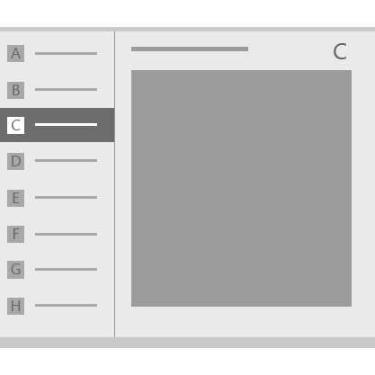
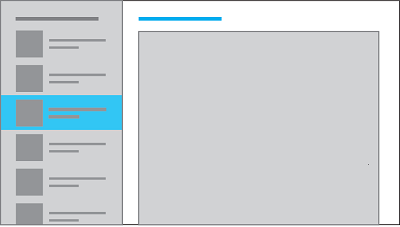

# Modèle Maître/Détails

<link rel="stylesheet" href="https://az835927.vo.msecnd.net/sites/uwp/Resources/css/custom.css"> 

Le modèle Maître/Détails possède un volet principal (généralement avec un [affichage Liste](lists.md)) et un volet d’informations correspondant au contenu. Lorsqu’un élément de la liste principale est sélectionné, le volet d’informations est mis à jour. Ce modèle est souvent utilisé pour le courrier électronique et les carnets d’adresses.

## Est-ce le modèle approprié ?

Le modèle Maître/Détails fonctionne bien si vous souhaitez :

-   créer une application de messagerie, un carnet d’adresses ou une application basés sur une disposition liste/détails ;
-   rechercher et hiérarchiser une grande collection de contenu ;
-   permettre d’ajouter et de supprimer rapidement des éléments dans une liste tout en basculant entre les contextes.

## Choisir le style approprié

Lorsque vous implémentez le modèle Maître/Détails, nous vous recommandons d’utiliser le style empilé ou le style côte à côte, en fonction de l’espace d’écran disponible.

| Largeur de fenêtre disponible | Style recommandé |
|------------------------|-------------------|
| 320 epx-719 epx        | Mode Empilé           |
| 720 epx ou plus large       | Côte à côte      |

 
## Style empilé

Le style empilé ne permet de visualiser qu’un seul volet à la fois : le volet principal ou le volet d’informations.

L’utilisateur commence au niveau du volet principal et descend dans le volet d’informations en sélectionnant un élément dans la liste principale. Pour l’utilisateur, les affichages Maître et Détails apparaissent dans deux pages distinctes.

### Créer un modèle Maître/Détails empilé

L’une des façons de créer le modèle Maître/Détails empilé consiste à utiliser des pages distinctes pour le volet principal et pour le volet d’informations. Placez l’affichage Liste qui contient la liste principale dans une page, et l’élément de contenu du volet d’informations dans une autre page.

Pour le volet principal, un contrôle d’[affichage Liste](lists.md) fonctionne bien pour présenter des listes pouvant contenir des images et du texte.

Pour le volet d’informations, utilisez l’élément de contenu le plus logique. Si vous disposez d’un grand nombre de champs distincts, pensez à utiliser une disposition en grille pour organiser les éléments dans un formulaire.

## Style côte à côte

Dans le style côte à côte, le volet principal et le volet d’informations sont visibles en même temps.

La liste du volet principal possède un objet visuel de sélection pour indiquer l’élément sélectionné. La sélection d’un nouvel élément dans la liste principale entraîne la mise à jour du volet d’informations.

### Créer un modèle Maître/Détails côte à côte

Pour le volet principal, un contrôle d’[affichage Liste](lists.md) fonctionne bien pour présenter des listes pouvant contenir des images et du texte.

Pour le volet d’informations, utilisez l’élément de contenu le plus logique. Si vous disposez d’un grand nombre de champs distincts, pensez à utiliser une disposition en grille pour organiser les éléments dans un formulaire.

## Exemples

La conception d’application ci-dessous qui suit la bourse utilise un modèle Maître/Détails. Dans cet exemple de l’application telle qu’elle serait affichée sur un téléphone, le volet/la liste principal(e) apparaît à gauche, tandis que le volet d’informations figure à droite.

La conception d’application ci-dessous qui suit la bourse utilise un modèle Maître/Détails. Dans cet exemple de l’application telle qu’elle serait affichée sur un ordinateur, le volet/la liste principal(e) et le volet d’informations sont tous deux visibles et en plein écran. Le volet principal comprend une zone de recherche dans sa partie supérieure et une barre de commandes dans sa partie inférieure.

## Articles connexes

- [Listes](lists.md)
- [Recherche](search.md)
- [Barre de l’application et barre de commandes](app-bars.md)
- [**Classe ListView (XAML)**](https://msdn.microsoft.com/library/windows/apps/br242878)

<!--HONumber=Aug16_HO3-->

