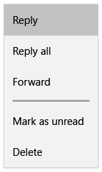

# Menus et menus contextuels

<link rel="stylesheet" href="https://az835927.vo.msecnd.net/sites/uwp/Resources/css/custom.css"> 

Les menus et les menus contextuels affichent une liste de commandes ou d’options lorsque l’utilisateur les demande.



<div class="important-apis" >
<b>API importantes</b><br/>
<ul>
<li><a href="https://msdn.microsoft.com/library/windows/apps/dn299030">Classe MenuFlyout</a></li>
<li><a href="https://msdn.microsoft.com/library/windows/apps/windows.ui.xaml.uielement.contextflyout.aspx">Propriété ContextFlyout</a></li>
<li><a href="https://msdn.microsoft.com/en-us/library/windows/apps/windows.ui.xaml.controls.primitives.flyoutbase.attachedflyout.aspx">Propriété FlyoutBase.AttachedFlyout</a></li>
</ul>

</div>
</div>


## Est-ce le contrôle approprié?
Les menus et les menus contextuels permettent de gagner de l’espace en organisant les commandes et en les masquant jusqu’à ce que l’utilisateur en ait besoin. Si une commande particulière doit être utilisée fréquemment et que vous disposez de l’espace disponible, envisagez de le placer directement dans son propre élément, plutôt que dans un menu, afin que les utilisateurs n’aient pas à passer par un menu afin d’y accéder. 

Les menus et menus contextuels permettent d’organiser les commandes. Pour afficher du contenu arbitraire, comme une notification ou demander confirmation, utilisez une [boîte de dialogue ou un menu volant](dialogs.md).  


## Menus par rapport aux menus contextuels

Les menus et menus contextuels sont identiques en termes d’affichage et de contenu. En fait, vous utilisez le même contrôle nommé [MenuFlyout](https://msdn.microsoft.com/library/windows/apps/dn299030) pour les créer. La seule différence est la façon dont vous permettez à l’utilisateur d’y accéder. 

Quand utiliser un menu ou un menu contextuel?
* Si l’élément hôte est un bouton ou un autre élément de commande dont le principal rôle est d’afficher des commandes supplémentaires, utilisez un menu.
* Si l’élément hôte est un autre type d’élément ayant un autre objectif principal (par exemple, la présentation de texte ou une image), utilisez un menu contextuel. 

Par exemple, utilisez un menu sur un bouton dans un volet de navigation pour fournir des options de navigation supplémentaires. Dans ce scénario, l’objectif principal du contrôle de bouton consiste à fournir un accès à un menu. 

Si vous voulez ajouter des commandes (telles que couper, copier et coller) à un élément de texte, utilisez un menu contextuel au lieu d’un menu. Dans ce scénario, le rôle principal de l’élément de texte est de présenter et de modifier du texte; les commandes supplémentaires (par exemple, couper, copier et coller) sont secondaires et doivent figurer dans un menu contextuel. 

<div class="side-by-side">
<div class="side-by-side-content">
  <div class="side-by-side-content-left">
   <p><b>Les menus:</b></p>
<p>
<ul>
<li>Ont un point d’entrée unique (un menu Fichier en haut de l’écran, par exemple) qui est toujours affiché.</li>
<li>Sont généralement attachés à un bouton ou un élément de menu parent.</li>
<li>Sont appelés en cliquant avec le bouton gauche de la souris (ou par le biais d’une action équivalente, telles que l’appui avec votre doigt).</li>  
<li>Sont associés à un élément via ses propriétés [Flyout](https://msdn.microsoft.com/library/windows/apps/windows.ui.xaml.controls.button.flyout.aspx) ou [FlyoutBase.AttachedFlyout](https://msdn.microsoft.com/en-us/library/windows/apps/windows.ui.xaml.controls.primitives.flyoutbase.attachedflyout.aspx).</li> 
</ul>
</p><br/>

  </div>
  <div class="side-by-side-content-right">
   <p><b>Les menus contextuels:</b></p>
   
<ul>
<li>Sont attachés à un élément unique, mais ne sont accessibles que lorsque le contexte est logique.</li>
<li>Sont appelés en cliquant avec le bouton droit de la souris (ou par le biais d’une action équivalente, telle que l’appui prolongé avec votre doigt).</li>
<li>Sont associés à un élément via sa propriété [ContextFlyout](https://msdn.microsoft.com/library/windows/apps/windows.ui.xaml.uielement.contextflyout.aspx).  
</ul><br/>

  </div>
</div>
</div>

## Créer un menu ou un menu contextuel

Pour créer un menu ou un menu de contenu, vous utilisez la [classe MenuFlyout](https://msdn.microsoft.com/library/windows/apps/dn299030). Vous définissez le contenu du menu en ajoutant des objets [MenuFlyoutItem](https://msdn.microsoft.com/en-us/library/windows/apps/xaml/windows.ui.xaml.controls.menuflyoutitem.aspx), [ToggleMenuFlyoutItem](https://msdn.microsoft.com/en-us/library/windows/apps/xaml/windows.ui.xaml.controls.togglemenuflyoutitem.aspx), et [MenuFlyoutSeparator](https://msdn.microsoft.com/en-us/library/windows/apps/xaml/windows.ui.xaml.controls.menuflyoutseparator.aspx) à MenuFlyout. Voici le rôle de ces objets:
* [MenuFlyoutItem](https://msdn.microsoft.com/en-us/library/windows/apps/xaml/windows.ui.xaml.controls.menuflyoutitem.aspx): effectuer une action immédiate.
* [ToggleMenuFlyoutItem](https://msdn.microsoft.com/en-us/library/windows/apps/xaml/windows.ui.xaml.controls.togglemenuflyoutitem.aspx): activer ou désactiver une option.
* [MenuFlyoutSeparator](https://msdn.microsoft.com/en-us/library/windows/apps/xaml/windows.ui.xaml.controls.menuflyoutseparator.aspx): séparer visuellement des éléments de menu.


Cet exemple crée une [classe MenuFlyout](https://msdn.microsoft.com/library/windows/apps/dn299030) et utilise la propriété [ContextFlyout](https://msdn.microsoft.com/library/windows/apps/windows.ui.xaml.uielement.contextflyout.aspx), disponible pour la plupart des contrôles, pour afficher la [classe MenuFlyout](https://msdn.microsoft.com/library/windows/apps/dn299030) sous la forme d’un menu contextuel.

````xaml
<Rectangle 
  Height="100" Width="100" 
  Tapped="Rectangle_Tapped">
  <Rectangle.ContextFlyout>
    <MenuFlyout>
      <MenuFlyoutItem Text="Change color" Click="ChangeColorItem_Click" />
    </MenuFlyout>
  </Rectangle.ContextFlyout>
  <Rectangle.Fill>
    <SolidColorBrush x:Name="rectangleFill" Color="Red" />
  </Rectangle.Fill>
</Rectangle>
````

````csharp
private void ChangeColorItem_Click(object sender, RoutedEventArgs e)
{
    // Change the color from red to blue or blue to red. 
    if (rectangleFill.Color == Windows.UI.Colors.Red)
    {
        rectangleFill.Color = Windows.UI.Colors.Blue;
    }
    else
    {
        rectangleFill.Color = Windows.UI.Colors.Red;
    }
}
````

L’exemple qui suit est presque identique, mais au lieu d’utiliser la propriété [ContextFlyout](https://msdn.microsoft.com/en-us/library/windows/apps/windows.ui.xaml.uielement.contextflyout.aspx) pour afficher la [classe MenuFlyout](https://msdn.microsoft.com/library/windows/apps/dn299030) sous forme de menu contextuel, l’exemple utilise la propriété [FlyoutBase.ShowAttachedFlyout](https://msdn.microsoft.com/en-us/library/windows/apps/windows.ui.xaml.controls.primitives.flyoutbase.showattachedflyout) pour l’afficher sous forme de menu. 

````xaml
<Rectangle 
  Height="100" Width="100" 
  Tapped="Rectangle_Tapped">
  <FlyoutBase.AttachedFlyout>
    <MenuFlyout>
      <MenuFlyoutItem Text="Change color" Click="ChangeColorItem_Click" />
    </MenuFlyout>
  </FlyoutBase.AttachedFlyout>
  <Rectangle.Fill>
    <SolidColorBrush x:Name="rectangleFill" Color="Red" />
  </Rectangle.Fill>
</Rectangle>
````

````csharp
private void Rectangle_Tapped(object sender, TappedRoutedEventArgs e)
{
    FlyoutBase.ShowAttachedFlyout((FrameworkElement)sender);
}

private void ChangeColorItem_Click(object sender, RoutedEventArgs e)
{
    // Change the color from red to blue or blue to red. 
    if (rectangleFill.Color == Windows.UI.Colors.Red)
    {
        rectangleFill.Color = Windows.UI.Colors.Blue;
    }
    else
    {
        rectangleFill.Color = Windows.UI.Colors.Red;
    }
}
````

> **Remarque**&nbsp;&nbsp;Les contrôles permettant de faire disparaître les contrôles, tels que des menus, des menus contextuels et des menus volants, interceptent le focus du clavier et du boîtier de commande à l’intérieur de l’interface utilisateur temporaire jusqu’à le faire disparaître. Pour fournir une indication visuelle de ce comportement, les contrôles de la Xbox permettant de faire disparaître la luminosité dessinent une superposition qui assombrit l’interface utilisateur hors de portée. Ce comportement peut être modifié à l’aide de la nouvelle propriété [LightDismissOverlayMode](https://msdn.microsoft.com/en-us/library/windows/apps/windows.ui.xaml.controls.primitives.flyoutbase.lightdismissoverlaymode.aspx). Par défaut, les interfaces utilisateur temporaires dessinent la superposition permettant de faire disparaître la luminosité sur la Xbox, mais pas sur d’autres familles d’appareils. Toutefois, les applications peuvent choisir de forcer la superposition afin d’être toujours **activées** ou **désactivées**.
> 
> ```xaml
> <MenuFlyout LightDismissOverlayMode="Off">
```

## Get the samples
*   [XAML UI basics](https://github.com/Microsoft/Windows-universal-samples/blob/master/Samples/XamlUIBasics)<br/>
    See all of the XAML controls in an interactive format.

## Related articles

- [**MenuFlyout class**](https://msdn.microsoft.com/library/windows/apps/dn299030)


<!--HONumber=Aug16_HO3-->


