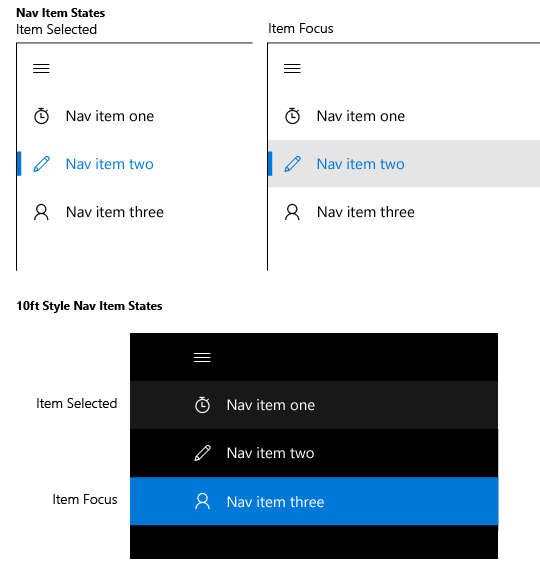

Volets de navigation
=============================================================================================
Un volet de navigation est un modèle qui permet d’inclure de nombreux éléments de navigation de niveau supérieur tout en économisant l’espace de l’écran. Ce volet est largement utilisé pour les applications mobiles, mais il fonctionne également bien avec des écrans plus grands. Lorsqu’il est utilisé en superposition, le volet reste réduit et masqué tant que l’utilisateur n’appuie pas sur le bouton, ce qui est pratique pour les petits écrans. Lorsqu’il est utilisé en mode ancré, le volet reste ouvert, ce qui renforce son utilité s’il y a suffisamment d’espace dans l’écran.

API importantes

-   [**Classe SplitView**](https://msdn.microsoft.com/library/windows/apps/dn864360)

## Est-ce le modèle approprié?

Le volet de navigation fonctionne bien pour:

-   Les applications comportant de nombreux éléments de navigation de niveau supérieur ayant un type similaire. Par exemple, une application sportive avec des catégories comme Football américain, Baseball, Basketball, Football et ainsi de suite.
-   La fourniture d’une expérience de navigation cohérente sur l’ensemble des applications. Un volet de navigation doit inclure uniquement les éléments de navigation, pas les actions.
-   Un nombre moyen ou élevé de catégories de navigation de niveau supérieur (entre 5 et 10, ou plus).
-   Économiser l’espace de l’écran (sous forme de superposition).
-   Les éléments de navigation qui sont rarement consultés. (sous forme de superposition).

## Conception d’un volet de navigation

Le modèle de volet de navigation se compose d’un volet des catégories de navigation, d’une zone de contenu et d’un bouton facultatif pour ouvrir ou fermer le volet. La méthode la plus simple pour créer un volet de navigation consiste à [fractionner le contrôle d’affichage](split-view.md), comprenant un volet vide ainsi qu’une zone de contenu visible en permanence.

Pour tester le code implémentant ce modèle, téléchargez la [solution de navigation XAML](https://github.com/Microsoft/Windows-universal-samples/tree/master/Samples/XamlNavigation) à partir de GitHub.

### Volet

Le volet contient les en-têtes des catégories de navigation. ainsi que les points d’entrée aux paramètres d’application et à la gestion des comptes, le cas échéant. Les en-têtes de navigation sont généralement une liste d’éléments parmi lesquels l’utilisateur peut choisir.

### Zone de contenu

La zone de contenu présente les informations relatives à l’emplacement de navigation sélectionné. Elle peut contenir des éléments individuels ou d’autres éléments de navigation de niveau inférieur.

### Bouton

Lorsqu’il est présent, le bouton permet aux utilisateurs d’ouvrir et de fermer le volet. Le bouton reste visible à un emplacement fixe et ne se déplace pas avec le volet. Nous recommandons de placer le bouton dans le coin supérieur gauche de votre application. Le bouton du volet de navigation est affiché sous la forme de trois lignes horizontales empilées. Il est communément appelé le bouton «hamburger».

Le bouton est généralement associé à une chaîne de texte. Le titre de l’application peut être affiché en regard du bouton dans la partie supérieure de l’application. La chaîne de texte peut être le titre de la page consultée par l’utilisateur dans les niveaux inférieurs de l’application.

## Variantes du volet de navigation

Le volet de navigation comporte trois modes: superposition, compact et inclus. En mode superposition, le volet peut être réduit ou développé au besoin. En mode compact, le volet est toujours affiché sous la forme d’une zone étroite qui peut être développée. Un volet inclus reste ouvert par défaut.

### Superposition

-   La superposition peut être utilisée sur un écran de toute taille et en orientation portrait ou paysage. Dans son état par défaut (réduit), la superposition n’occupe pas d’espace, car seul le bouton est affiché.
-   Permet une navigation à la demande qui économise l’espace de l’écran. Il est idéal pour les applications sur les téléphones et phablettes.
-   Par défaut, le volet est masqué, le bouton seul étant visible.
-   L’ouverture et la fermeture de la superposition s’effectue en appuyant sur le bouton du volet de navigation.
-   L’état développé est temporaire et disparaît lorsqu’une sélection est effectuée, lorsque le bouton Précédent est utilisé ou lorsque l’utilisateur appuie en dehors du volet.
-   La superposition s’étire au-dessus du contenu et n’en modifie pas la présentation.

### Compact

-   Le mode compact peut être spécifié en tant que `CompactOverlay`, qui superpose le contenu lorsque le volet est ouvert ou `CompactInline`, qui déplace le contenu hors de sa zone. Nous vous recommandons d’utiliser CompactOverlay.
-   Les volets en mode compact fournissent des indications sur l’emplacement sélectionné lors de l’utilisation d’une petite quantité d’espace écran.
-   Ce mode convient mieux aux écrans de taille moyenne comme ceux des tablettes.
-   Par défaut, le volet est fermé et seuls les icônes de navigation et le bouton sont visibles.
-   Un appui sur le bouton du volet de navigation permet d’ouvrir et de fermer le volet, qui se comporte comme en mode superposition ou inclus selon le mode d’affichage spécifié.
-   La sélection doit être affichée dans les icônes de liste à mettre en surbrillance lorsque l’utilisateur se trouve dans l’arborescence de navigation.

### Inclus

-   Le volet de navigation reste ouvert. Ce mode convient mieux aux écrans plus grands.
-   Prend en charge les scénarios de glisser-déplacer vers et depuis le volet.
-   Le bouton du volet de navigation n’est pas nécessaire pour cet état. Si le bouton est utilisé, la zone de contenu est déplacée et son contenu s’ajuste dynamiquement.
-   La sélection doit être affichée dans les éléments de liste à mettre en surbrillance lorsque l’utilisateur se trouve dans l’arborescence de navigation.

## Capacité d’adaptation

Pour optimiser la facilité d’utilisation sur différents appareils, nous recommandons l’utilisation de [points d’arrêt](../layout/screen-sizes-and-breakpoints-for-responsive-design.md) et l’ajustement du mode du volet de navigation en fonction de la largeur de sa fenêtre d’application.
-   Petite fenêtre
   -   Inférieur ou égal à640pixels de large.
   -   Le volet de navigation doit être en mode superposition, fermé par défaut.
-   Fenêtre de taille moyenne
   -   Supérieure à 640pixels et inférieure ou égale à 1007pixels de large.
   -   Le volet de navigation doit être en mode zone étroite, fermé par défaut.
-   Grande fenêtre
   -   Supérieure à 1007pixels de large.
   -   Le volet de navigation doit être en mode ancré, ouvert par défaut.

## Personnalisation

Pour optimiser [l’expérience d’interface utilisateur à 3m](http://go.microsoft.com/fwlink/?LinkId=760736), envisagez de personnaliser le volet de navigation en changeant l’apparence visuelle de ses éléments de navigation. Selon le contexte d’interaction, il peut être plus important d’attirer l’attention de l’utilisateur sur l’élément de navigation sélectionné ou sur l’élément de navigation ciblé. Pour une expérience d’interface utilisateur à 3m, dans laquelle le boîtier de commande est l’appareil d’entrée généralement utilisé, il est particulièrement important de s’assurer que l’utilisateur peut facilement suivre l’emplacement de l’élément sélectionné à l’écran.

## Rubriques connexes

* [Contrôle de mode Fractionné](split-view.md)
* [Maître/détails](master-details.md)
* [Notions de base sur la navigation](https://msdn.microsoft.com/library/windows/apps/dn958438)
 

 

<!--HONumber=Jun16_HO4-->

