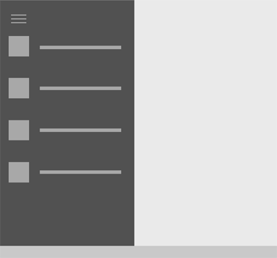
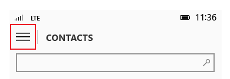

Volets de navigation
=============================================================================================
Un volet de navigation est un modèle qui permet d’inclure de nombreux éléments de navigation de niveau supérieur tout en économisant l’espace de l’écran. Ce volet est largement utilisé pour les applications mobiles, mais il fonctionne également bien avec des écrans plus grands. Lorsqu’il est utilisé en superposition, le volet reste réduit et masqué tant que l’utilisateur n’appuie pas sur le bouton, ce qui est pratique pour les petits écrans. Lorsqu’il est utilisé en mode ancré, le volet reste ouvert, ce qui renforce son utilité s’il y a suffisamment d’espace dans l’écran.

API importantes

-   [**Classe SplitView (XAML)**](https://msdn.microsoft.com/library/windows/apps/dn864360)
-   [**Objet SplitView (HTML)**](https://msdn.microsoft.com/library/windows/apps/dn919970)

<<<<<<< HEAD

=======

>>>>>>> origine

     Est-ce le modèle approprié ?
-----------------------------------------------------------------------------------------------------------------------------------------------------------------

Le volet de navigation fonctionne bien pour :

-   Les applications comportant de nombreux éléments de navigation de niveau supérieur d’une même classe, par exemple une application sportive comportant les catégories Football, Baseball, Basketball, etc.
-   Offrir une expérience de navigation homogène entre les applications, à condition que seuls les éléments de navigation soient placés dans le volet.
-   Les applications comprenant un nombre moyen ou élevé de catégories de navigation de niveau supérieur (entre 5 et 10, ou plus).
-   Économiser l’espace de l’écran (sous forme de superposition).
-   Les éléments de navigation qui sont rarement consultés. (sous forme de superposition).
-   Les scénarios de glisser-déplacer (en mode ancré).

     Conception d’un volet de navigation
-------------------------------------------------------------------------------------------------------------------------------------

Le modèle de volet de navigation se compose d’un bouton, d’un volet des catégories de navigation et d’une zone de contenu. La méthode la plus simple pour créer un volet de navigation consiste à [fractionner le contrôle d’affichage](split-view.md), comprenant un volet vide ainsi qu’une zone de contenu visible en permanence. Le volet peut être visible ou masqué et peut apparaître à partir du côté gauche ou du côté droit d’une fenêtre d’application.

Si vous souhaitez créer un volet de navigation sans contrôle de mode Fractionné, vous avez besoin de trois composants principaux : un bouton, un volet et une zone de contenu. Le bouton permet à l’utilisateur d’ouvrir et de fermer le volet. lequel est un conteneur pour les éléments de navigation. La zone de contenu affiche des informations de l’élément de navigation sélectionné. Le volet de navigation peut également exister en mode ancré, dans lequel il est toujours affiché. Un bouton n’est donc pas nécessaire dans ce cas de figure.

###      Bouton

Le bouton du volet de navigation est affiché, par défaut, sous la forme de trois lignes horizontales empilées. Il est communément appelé le bouton « hamburger ». Il permet à l’utilisateur d’ouvrir et de fermer le volet au besoin, et ne se déplace pas avec le volet. Nous recommandons de placer le bouton dans le coin supérieur gauche de votre application. Le bouton ne se déplace pas avec le volet.

Le bouton est généralement associé à une chaîne de texte. Le titre de l’application peut être affiché en regard du bouton dans la partie supérieure de l’application. La chaîne de texte peut être associée à la page consultée par l’utilisateur dans les niveaux inférieurs de l’application.

###      Volet

Le volet contient les en-têtes des catégories de navigation. ainsi que les points d’entrée aux paramètres d’application et à la gestion des comptes, le cas échéant. Les en-têtes de navigation peuvent être de niveau supérieur ou de niveau supérieur/secondaire imbriqués.

###      Zone de contenu

La zone de contenu présente les informations relatives à l’emplacement de navigation sélectionné. Elle peut contenir des éléments individuels ou d’autres éléments de navigation de niveau inférieur.

     Variantes du volet de navigation
-------------------------------------------------------------------------------------------------------------------------------------

Il existe deux variantes principales pour le volet de navigation : le mode Superposition et le mode ancré. En mode superposition, le volet peut être réduit ou développé au besoin. Un volet ancré reste ouvert par défaut.

###      Superposition

-   La superposition peut être utilisée sur un écran de toute taille et en orientation portrait ou paysage. Dans son état par défaut (réduit), la superposition n’occupe pas d’espace, car seul le bouton est affiché.
-   Permet une navigation à la demande qui économise l’espace de l’écran. Il est idéal pour les applications sur les téléphones et phablettes.
-   Par défaut, le volet est masqué, le bouton seul étant visible.
-   L’ouverture et la fermeture de la superposition s’effectue en appuyant sur le bouton du volet de navigation.
-   L’état développé est temporaire et disparaît lorsqu’une sélection est effectuée, lorsque le bouton Précédent est utilisé ou lorsque l’utilisateur appuie en dehors du volet.
-   La superposition s’étire au-dessus du contenu et n’en modifie pas la présentation.

###      Ancré

-   Le volet de navigation reste ouvert. Ce mode convient mieux aux écrans plus grands, généralement à partir des tablettes.
-   En orientation paysage, la largeur d’écran minimale pouvant tirer parti de l’état ancré est de 720 epx. À cette taille, l’état ancré peut nécessiter une attention particulière pour la mise à l’échelle du contenu.
-   Prend en charge les scénarios de glisser-déplacer vers et depuis le volet.
-   Le bouton du volet de navigation n’est pas nécessaire pour cet état. Si le bouton est utilisé, la zone de contenu est déplacée et son contenu s’ajuste dynamiquement.
-   La sélection doit être affichée dans les éléments de liste à mettre en surbrillance lorsque l’utilisateur se trouve dans l’arborescence de navigation.
-   Lorsque l’écran de l’appareil est trop étroit en orientation portrait pour afficher le volet ancré, le comportement recommandé en cas de rotation de l’appareil est le suivant :
    -   Paysage à portrait. Le volet est réduit à l’état de superposition ou à l’état réduit.
    -   Portrait à paysage. Le volet réapparaît.

 Rubriques connexes
-----------------------------------------------

* [Contrôle de mode Fractionné](split-view.md)
* [Maître/détails](master-details.md)
* [Notions de base sur la navigation](https://msdn.microsoft.com/library/windows/apps/dn958438)
 

 

<!--HONumber=Mar16_HO4-->

