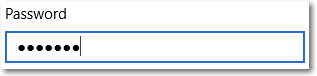
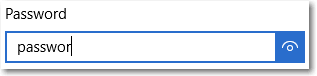

# <a name="password-box"></a>Zone de mot de passe

<link rel="stylesheet" href="https://az835927.vo.msecnd.net/sites/uwp/Resources/css/custom.css"> 

Une zone de mot de passe (PasswordBox) est une zone de saisie de texte qui masque les caractères saisis, pour des raisons de confidentialité. Une zone de mot de passe ressemble à une zone de texte, mais elle affiche des caractères espace réservé à la place du texte qui a été saisi. Vous pouvez configurer le caractère espace réservé.

Par défaut, la zone de mot de passe permet à l’utilisateur d’afficher son mot de passe en appuyant sur un bouton d’affichage. Vous pouvez désactiver ce bouton, ou proposer un autre mécanisme pour faire apparaître le mot de passe, par exemple une case à cocher.

<div class="important-apis" >
<b>API importantes</b><br/>
<ul>
<li>[**Classe PasswordBox**](https://msdn.microsoft.com/library/windows/apps/xaml/windows.ui.xaml.controls.passwordbox.aspx)</li>
<li>[**Propriété Password**](https://msdn.microsoft.com/library/windows/apps/xaml/windows.ui.xaml.controls.passwordbox.password.aspx)</li>
<li>[**Propriété PasswordChar**](https://msdn.microsoft.com/library/windows/apps/xaml/windows.ui.xaml.controls.passwordbox.passwordchar.aspx)</li>
<li>[**Propriété PasswordRevealMode**](https://msdn.microsoft.com/library/windows/apps/xaml/windows.ui.xaml.controls.passwordbox.passwordrevealmode.aspx)</li>
<li>[**Événement PasswordChanged**](https://msdn.microsoft.com/library/windows/apps/xaml/windows.ui.xaml.controls.passwordbox.passwordchanged.aspx)</li>
</ul>
</div>

## <a name="is-this-the-right-control"></a>Est-ce le contrôle approprié ?

Si vous souhaitez recueillir un mot de passe ou d’autres données confidentielles, telles qu’un numéro de sécurité sociale, utilisez un contrôle **PasswordBox**.

Pour plus d’informations sur le choix du contrôle de texte approprié, voir l’article [Contrôles de texte](text-controls.md).

## <a name="examples"></a>Exemples

La zone de mot de passe a plusieurs états possibles, dont les suivants.

Une zone de mot de passe à l’état inactif peut afficher un texte d’information relatif à sa finalité :


Lorsque l’utilisateur effectue une saisie dans une zone de mot de passe, le comportement par défaut consiste à afficher des puces qui masquent le texte entré :



Le bouton d’« affichage » sur la droite permet de jeter un coup d’œil au mot de passe en cours de saisie :



## <a name="create-a-password-box"></a>Créer une zone de mot de passe

Utilisez la propriété [Password](https://msdn.microsoft.com/library/windows/apps/xaml/windows.ui.xaml.controls.passwordbox.password.aspx) pour obtenir ou définir le contenu de PasswordBox. Vous pouvez effectuer cette opération dans le gestionnaire pour que l’événement [PasswordChanged](https://msdn.microsoft.com/library/windows/apps/xaml/windows.ui.xaml.controls.passwordbox.passwordchanged.aspx) procède à la validation lorsque l’utilisateur entre le mot de passe. Vous pouvez aussi utiliser un autre événement, comme un bouton [Click](https://msdn.microsoft.com/library/windows/apps/xaml/windows.ui.xaml.controls.primitives.buttonbase.click.aspx), pour effectuer la validation dès que l’utilisateur a fini de saisir du texte.

Vous trouverez ci-dessous le code XAML d’un contrôle de zone de mot de passe montrant l’apparence par défaut de PasswordBox. Lorsque l’utilisateur saisit un mot de passe, vous vérifiez s’il s’agit de la valeur littérale « Password ». Si tel est le cas, vous affichez un message à l’attention de l’utilisateur.

```xaml
<StackPanel>  
  <PasswordBox x:Name="passwordBox" Width="200" MaxLength="16"
             PasswordChanged="passwordBox_PasswordChanged"/>

  <TextBlock x:Name="statusText" Margin="10" HorizontalAlignment="Center" />
</StackPanel>   
```

```csharp
private void passwordBox_PasswordChanged(object sender, RoutedEventArgs e)
{
    if (passwordBox.Password == "Password")
    {
        statusText.Text = "'Password' is not allowed as a password.";
    }
    else
    {
        statusText.Text = string.Empty;
    }
}
```
Résultat obtenu lorsque ce code est exécuté et que l’utilisateur saisit « Password » :


### <a name="password-character"></a>Caractère de mot de passe

Vous pouvez modifier le caractère utilisé pour masquer le mot de passe en définissant la propriété [PasswordChar](https://msdn.microsoft.com/library/windows/apps/xaml/windows.ui.xaml.controls.passwordbox.passwordchar.aspx). Ici, la puce par défaut est remplacée par un astérisque.

```xaml
<PasswordBox x:Name="passwordBox" Width="200" PasswordChar="*"/>
```

Le résultat se présente ainsi :


### <a name="headers-and-placeholder-text"></a>En-têtes et texte d’espace réservé

Vous pouvez utiliser les propriétés [Header](https://msdn.microsoft.com/library/windows/apps/xaml/windows.ui.xaml.controls.passwordbox.header.aspx) et [PlaceholderText](https://msdn.microsoft.com/library/windows/apps/xaml/windows.ui.xaml.controls.passwordbox.placeholdertext.aspx) pour fournir du contexte à l’élément PasswordBox. Cela est particulièrement utile lorsque vous avez plusieurs zones, comme dans un formulaire, pour modifier un mot de passe.

```xaml
<PasswordBox x:Name="passwordBox" Width="200" Header="Password" PlaceholderText="Enter your password"/>
```


### <a name="maximum-length"></a>Longueur maximale

Spécifiez le nombre maximal de caractères que l’utilisateur peut saisir en définissant la propriété [MaxLength](https://msdn.microsoft.com/library/windows/apps/xaml/windows.ui.xaml.controls.passwordbox.maxlength.aspx). Il n’existe aucune propriété permettant de spécifier une longueur minimale. Toutefois vous pouvez vérifier la longueur de mot de passe et effectuer toute autre validation, dans le code de votre application.

## <a name="password-reveal-mode"></a>Mode d’affichage du mot de passe

PasswordBox dispose d’un bouton intégré sur lequel l’utilisateur peut appuyer pour afficher le texte du mot de passe. Voici le résultat de l’action de l’utilisateur. Lorsque l’utilisateur relâche le bouton, le mot de passe est automatiquement masqué à nouveau.


### <a name="peek-mode"></a>Mode aperçu

Par défaut, le bouton d’affichage du mot de passe (ou « bouton d’aperçu ») s’affiche. L’utilisateur doit rester appuyé sur le bouton pour afficher le mot de passe, afin de maintenir un niveau élevé de sécurité.

La valeur de la propriété [PasswordRevealMode](https://msdn.microsoft.com/library/windows/apps/xaml/windows.ui.xaml.controls.passwordbox.passwordrevealmode.aspx) n’est pas le seul facteur déterminant si un bouton d’affichage du mot de passe est visible à l’utilisateur. Parmi les autres facteurs, figurent ceux indiquant si le contrôle est affiché au-dessus d’une largeur minimale, si le focus porte sur PasswordBox et si le champ de texte contient au moins un caractère. Le bouton d’affichage du mot de passe apparaît uniquement lorsque le focus porte sur PasswordBox pour la première fois et si un caractère est saisi. Si PasswordBox perd le focus, puis le reprend, le bouton d’affichage n’apparaît plus, sauf si le mot de passe est effacé et que la saisie de caractères recommence.

> **Attention**&nbsp;&nbsp;Avant Windows 10, le bouton d’affichage du mot de passe ne s’affichait pas par défaut. Si la sécurité de votre application nécessite que le mot de passe soit toujours masqué, définissez PasswordRevealMode sur Hidden.

### <a name="hidden-and-visible-modes"></a>Modes Masqué et Visible

Les autres valeurs d’énumération [PasswordRevealMode](https://msdn.microsoft.com/library/windows/apps/xaml/windows.ui.xaml.controls.passwordrevealmode.aspx), **Hidden** et **Visible**, masquent le bouton d’affichage du mot de passe et vous permettent de gérer par programme si le mot de passe est masqué.

Pour toujours masquer le mot de passe, définissez PasswordRevealMode sur Hidden. Sauf si vous avez besoin que le mot de passe soit toujours masqué, vous pouvez fournir une interface utilisateur personnalisée pour permettre à l’utilisateur de faire basculer PasswordRevealMode de la valeur Hidden à Visible.

Dans les versions précédentes de Windows Phone, PasswordBox utilisait une case à cocher pour choisir d’afficher ou de masquer le mot de passe. Vous pouvez créer une interface utilisateur similaire pour votre application, comme illustré dans l’exemple suivant. Vous pouvez également utiliser d’autres contrôles, tels que [ToggleButton](https://msdn.microsoft.com/library/windows/apps/xaml/windows.ui.xaml.controls.primitives.togglebutton.aspx), pour permettre à l’utilisateur de basculer entre les modes.

Cet exemple montre comment utiliser un élément [CheckBox](https://msdn.microsoft.com/library/windows/apps/xaml/windows.ui.xaml.controls.checkbox.aspx) pour permettre à un utilisateur de changer le mode d’affichage d’un élément PasswordBox.

```xaml
<StackPanel Width="200">
    <PasswordBox Name="passwordBox1"
                 PasswordRevealMode="Hidden"/>
    <CheckBox Name="revealModeCheckBox" Content="Show password"
              IsChecked="False"
              Checked="CheckBox_Changed" Unchecked="CheckBox_Changed"/>
</StackPanel>
```

```csharp
private void CheckBox_Changed(object sender, RoutedEventArgs e)
{
    if (revealModeCheckBox.IsChecked == true)
    {
        passwordBox1.PasswordRevealMode = PasswordRevealMode.Visible;
    }
    else
    {
        passwordBox1.PasswordRevealMode = PasswordRevealMode.Hidden;
    }
}
```

Cet élément PasswordBox se présente comme suit :


## <a name="choose-the-right-keyboard-for-your-text-control"></a>Choisir le clavier adapté à votre contrôle de texte

Pour faciliter la saisie de données par les utilisateurs au moyen du clavier tactile, ou panneau de saisie, définissez l’étendue des entrées du contrôle de texte de façon qu’elle corresponde au type de données attendu de la part de l’utilisateur. PasswordBox prend en charge uniquement les valeurs d’étendue des entrées **Password** et **NumericPin**. Toute autre valeur est ignorée.

Pour en savoir plus sur l’utilisation des étendues des entrées, voir [Utiliser l’étendue des entrées pour modifier le clavier tactile](https://msdn.microsoft.com/library/windows/apps/mt280229).

## <a name="recommendations"></a>Recommandations

-   Utilisez un texte d’étiquette ou d’espace réservé si l’objectif de la zone de mot de passe n’est pas clair. Une étiquette reste toujours visible, qu’il y ait ou non une valeur dans la zone de saisie de texte. Le texte d’espace réservé s’affiche initialement dans la zone de saisie de texte, mais disparaît après qu’une valeur a été entrée.
-   Attribuez à la zone de mot de passe une largeur appropriée pour la plage de valeurs qui peuvent être entrées. La longueur des mots varie selon la langue. Tenez compte de la localisation si vous souhaitez que votre application soit prête globalement.
-   Ne placez pas d’autre contrôle juste à côté d’une zone de saisie de mot de passe. La zone de mot de passe comporte un bouton d’affichage du mot de passe permettant aux utilisateurs de vérifier les mots de passe qu’ils ont saisis, et le fait de prévoir un autre contrôle juste à côté peut amener les utilisateurs à révéler accidentellement leurs mots de passe quand ils tentent d’interagir avec l’autre contrôle. Pour empêcher que cela se produise, laissez suffisamment d’espace entre la zone de saisie du mot de passe et l’autre contrôle, ou placez celui-ci sur la ligne suivante.
-   Songez à présenter deux zones de mot de passe pour la création de compte : l’un pour le nouveau mot de passe et l’autre pour confirmer ce mot de passe.
-   Affichez une seule zone de mot de passe pour les connexions.
-   Lorsqu’une zone de mot de passe est utilisée pour entrer un PIN, pensez à fournir une réponse dès l’entrée du dernier chiffre au lieu d’utiliser un bouton de confirmation.


## <a name="related-articles"></a>Articles connexes

[Contrôles de texte](text-controls.md)

- [Recommandations en matière de vérification orthographique](spell-checking-and-prediction.md)
- [Ajout de la fonctionnalité de recherche](https://msdn.microsoft.com/library/windows/apps/hh465231)
- [Recommandations en matière de saisie de texte](text-controls.md)
- [**Classe TextBox**](https://msdn.microsoft.com/library/windows/apps/br209683)
- [**Classe PasswordBox Windows.UI.Xaml.Controls**](https://msdn.microsoft.com/library/windows/apps/br227519)
- [Propriété String.Length](https://msdn.microsoft.com/library/system.string.length(v=vs.110).aspx)

