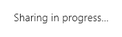
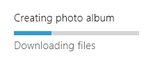
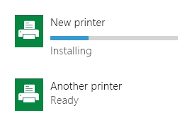
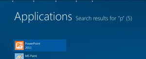
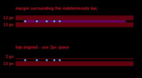

# Contrôles de progression

Un contrôle de progression offre un retour à l’utilisateur lorsqu’une longue opération est en cours. Une barre de progression *déterminée* affiche le pourcentage d’achèvement d’une opération. Une barre de progression, ou un anneau de progression, *indéterminée* affiche qu’une opération est en cours d’exécution.

Un contrôle de progression est en lecture seule ; il n’est pas interactif.

<span class="sidebar_heading" style="font-weight: bold;">API importantes</span>

-   [**Classe ProgressBar**](https://msdn.microsoft.com/library/windows/apps/xaml/windows.ui.xaml.controls.progressbar.aspx)
-   [**Propriété IsIndeterminate**](https://msdn.microsoft.com/library/windows/apps/xaml/windows.ui.xaml.controls.progressbar.isindeterminate.aspx)
-   [**Classe ProgressRing**](https://msdn.microsoft.com/library/windows/apps/xaml/windows.ui.xaml.controls.progressring.aspx)
-   [**Propriété IsActive**](https://msdn.microsoft.com/library/windows/apps/xaml/windows.ui.xaml.controls.progressring.isactive.aspx)


Application Windows : barre de progression indéterminée, anneau de progression et barre de progression déterminée


Application Windows Phone : indicateur de progression de la barre d’état et barres de progression

## Exemples

Voici un exemple de contrôle d’anneau de progression sur un écran de démarrage.


Une barre de progression est également un bon indicateur d’état ou de position. Lorsqu’elle est utilisée pour un morceau de musique, elle indique la chronologie de la chanson : la valeur de la barre est la position dans la chanson ; l’état de suspension indique que la lecture est suspendue.


## Est-ce le contrôle approprié ?

Il n’est pas systématiquement nécessaire de présenter un contrôle de progression. Parfois, le caractère manifeste ou rapide de la progression d’une tâche ne justifie pas la présentation d’un contrôle de progression. Voici quelques points à considérer pour déterminer si vous devez présenter un contrôle de progression.

-   **L’opération nécessite-t-elle plus de deux secondes pour s’accomplir ?**

    Si c’est le cas, affichez un contrôle de progression aussitôt que l’opération démarre. Si une opération nécessite la plupart du temps plus de deux secondes pour s’accomplir, mais qu’elle aboutit parfois en moins de deux secondes, patientez 500 ms avant de afficher le contrôle pour éviter tout scintillement.

-   **L’opération attend-elle que l’utilisateur effectue une tâche ?**

    Si oui, n’utilisez pas de barre de progression. Les barres de progression concernent la progression de l’ordinateur, pas celle de l’utilisateur.

-   **L’utilisateur a-t-il besoin de savoir que quelque chose se produit ?**

    Par exemple, si l’application exécute un téléchargement en arrière-plan et que l’utilisateur n’en est pas l’initiateur, il est inutile d’informer l’utilisateur.

-   **L’opération est-elle une activité en arrière-plan qui ne bloque pas celle de l’utilisateur et dont l’intérêt est minime (mais tout de même existant) pour l’utilisateur ?**

    Utilisez du texte et des points de suspension lorsque votre application effectue des tâches qui n’ont pas à être visibles tout le temps, mais dont vous souhaitez quand même indiquer le statut.

    

    Utilisez les points de suspension pour indiquer que la tâche est en cours. S’il existe plusieurs tâches ou éléments, vous pouvez indiquer le nombre de tâches restantes. Lorsque toutes les tâches sont terminées, faites disparaître l’indicateur.

-   **Pouvez-vous utiliser le contenu de l’opération pour visualiser la progression ?**

    Si oui, ne présentez pas de contrôle de progression. Par exemple, lors de l’affichage d’éléments /src/assets chargés depuis le disque, ceux-ci apparaissent à l’écran un par un au fur et à mesure de leur chargement. L’affichage d’un contrôle de progression ne présenterait aucun avantage et ne ferait qu’encombrer l’interface utilisateur.

-   **Pouvez-vous déterminer, de manière relative, la quantité de travail effectuée tandis que l’opération est en cours de progression ?**

    Dans ce cas, utilisez une barre de progression déterminée, en particulier pour les opérations qui bloquent l’utilisateur. Sinon, utilisez une barre ou un anneau de progression indéterminée. Même si sa seule fonction est d’indiquer à l’utilisateur qu’une opération est en train de se produire, elle s’avère utile.

## Créer un contrôle de progression déterminée

Une barre de progression déterminée affiche l’état d’avancement de la tâche en cours de réalisation par l’application. La barre se remplit à mesure que la tâche progresse. Utilisez une barre de progression déterminée si vous pouvez évaluer la part de la tâche restant à réaliser en termes de temps, d’octets, de fichiers ou de toute autre unité de mesure quantifiable.

La barre de progression fournit plusieurs propriétés qui permettent de définir et de déterminer la progression :
- [
            **IsIndeterminate**](https://msdn.microsoft.com/library/windows/apps/xaml/windows.ui.xaml.controls.progressbar.isindeterminate.aspx) : spécifie si la barre de progression est indéterminée. Appliquez la valeur **false** pour créer une barre de progression déterminée.
- [
            **Minimum**](https://msdn.microsoft.com/library/windows/apps/xaml/windows.ui.xaml.controls.primitives.rangebase.minimum.aspx) : début de la plage de valeurs. La valeur par défaut est 0,0.
- [
            **Maximum**](https://msdn.microsoft.com/library/windows/apps/xaml/windows.ui.xaml.controls.primitives.rangebase.maximum.aspx) : fin de la plage de valeurs. La valeur par défaut est 1,0. 
- [
            **Value**](https://msdn.microsoft.com/library/windows/apps/xaml/windows.ui.xaml.controls.primitives.rangebase.value.aspx) : nombre qui spécifie la progression actuelle. Si vous affichez la progression du téléchargement d’un fichier, cette valeur peut être le nombre d’octets téléchargés (dans ce cas, vous définissez Maximum sur le nombre total d’octets à télécharger).
 
L’exemple suivant montre une barre de progression déterminée basée sur la valeur. 

```xaml
<ProgressBar IsIndeterminate="False" Maximum="100" Width="200"/>
```

```csharp
ProgressBar progressBar1 = new ProgressBar();
progressBar1.IsIndeterminate = false;
progressBar1.Maximum = 100;
progressBar1.Width = 200;

// Add the button to a parent container in the visual tree.
stackPanel1.Children.Add(progressBar1);
```

En règle générale, vous ne spécifiez pas la valeur d’une barre de progression dans le balisage. En fait, vous utilisez un code procédural ou une liaison de données pour mettre à jour la valeur de la barre de progression en réaction à un indicateur d’avancement. Par exemple, si la barre de progression indique le nombre de fichiers ayant été téléchargés, sa valeur est mise à jour dès qu’un autre fichier a été téléchargé.

## Créer un contrôle de progression indéterminée

Utilisez une barre ou un anneau de progression indéterminée lorsque vous ne pouvez pas évaluer la part de la tâche restant à réaliser et que la tâche n’empêche pas les actions utilisateur. Au lieu d’afficher une barre qui se remplit à mesure que la tâche progresse, une barre de progression indéterminée affiche une série de points animés qui se déplacent de gauche à droite. Un anneau de progression indéterminée affiche une série de points animés qui se déplacent en cercle. 

Pour rendre une barre de progression indéterminée, définissez sa propriété [**IsIndeterminate**](https://msdn.microsoft.com/library/windows/apps/xaml/windows.ui.xaml.controls.progressbar.isindeterminate.aspx) sur **true**.

```xaml
<ProgressBar IsIndeterminate="True" Width="200"/>
```

```csharp
ProgressBar progressBar1 = new ProgressBar();
progressBar1.IsIndeterminate = true;
progressBar1.Width = 200;

// Add the button to a parent container in the visual tree.
stackPanel1.Children.Add(progressBar1);
```

Pour afficher un anneau de progression dans votre application, définissez sa propriété [**IsActive**](https://msdn.microsoft.com/library/windows/apps/xaml/windows.ui.xaml.controls.progressring.isactive.aspx) sur **true**.

```xaml
<ProgressRing IsActive="True"/>
```

```csharp
ProgressRing progressRing1 = new ProgressRing();
progressRing1.IsActive = true;

// Add the button to a parent container in the visual tree.
stackPanel1.Children.Add(progressRing1);
```

## Recommandations

-   Utilisez la barre de progression déterminée lorsque la tâche est déterminée, c’est-à-dire que sa durée est bien définie ou sa fin prévisible. Par exemple, si vous pouvez estimer la quantité de travail restante en temps, octets, fichiers ou autres unités de mesure quantifiables, utilisez une barre de progression déterminée. Voici quelques exemples de tâches déterminées :

    -   L’application télécharge une photo de 500 ko et a pour l’heure reçu 100 ko.
    -   L’application affiche une annonce de 15 secondes et 2 secondes se sont écoulées.

    

-   Utilisez l’anneau de progression indéterminée pour les tâches qui ne sont pas déterminées et modales (qui bloquent l’interaction de l’utilisateur).

    

-   Utilisez la barre de progression indéterminée pour les tâches qui ne sont pas déterminées et qui ne sont pas modales (qui ne bloquent pas l’interaction de l’utilisateur).

    

-   Traitez les tâches partiellement modales comme des tâches non modales, si l’état modal dure moins de 2 secondes. Certaines tâches bloquent l’interaction le temps qu’une certaine progression ait lieu, après quoi l’utilisateur peut recommencer à interagir avec l’application. Par exemple, lorsque l’utilisateur effectue une requête de recherche, son interaction est bloquée jusqu’à ce que le premier résultat s’affiche. Traitez ces tâches comme non modales et utilisez la barre de progression indéterminée si l’état modal dure moins de 2 secondes. Si l’état modal peut durer plus de deux secondes, utilisez l’anneau de progression indéterminée pour la phase modale de la tâche et la barre de progression indéterminée pour la phase non modale.
-   Songez à fournir un moyen d’annuler ou de suspendre l’opération en cours de progression, notamment lorsque l’utilisateur est bloqué en attendant l’achèvement de l’opération et connaît sa durée d’exécution restante.
-   N’utilisez pas le « curseur d’attente » pour indiquer une activité, car les utilisateurs qui interagissent de manière tactile avec le système ne le voient pas et ceux qui utilisent la souris n’ont pas besoin de deux manières de visualiser l’activité (le curseur et le contrôle de progression).
-   Présentez un seul contrôle de progression pour plusieurs tâches connexes actives. S’il existe plusieurs éléments connexes à l’écran qui effectuent simultanément un type d’activité, ne présentez pas plusieurs contrôles de progression. Présentez-en plutôt un qui se termine lorsque la dernière tâche est accomplie. Par exemple, si l’application télécharge plusieurs photos, présentez un seul contrôle de progression, plutôt qu’un pour chaque photo.
-   Ne changez pas l’emplacement ou la taille du contrôle de progression pendant que la tâche s’exécute.

### Recommandations en matière de tâches déterminées

-   Si l’opération est modale (elle bloque l’interaction de l’utilisation) et nécessite plus de 10 secondes, fournissez un moyen de l’annuler. La possibilité d’annuler doit être disponible au début de l’opération.
-   Échelonnez les mises à jour de la progression de manière régulière. Évitez les situations dans lesquelles la progression augmente de plus de 80 %, puis s’arrête pendant longtemps. Il est préférable d’accélérer la progression vers la fin, plutôt que de la ralentir. Évitez les sauts considérables, par exemple de 0 % à 90 %.
-   Avant de définir la progression à 100 %, patientez jusqu’à ce que l’animation de la barre de progression déterminée soit terminée avant de la masquer.
-   Si votre tâche est arrêtée (par un utilisateur ou une condition externe), mais que l’utilisateur peut la reprendre, indiquez visuellement que la progression est interrompue. Dans les applications JavaScript, vous utilisez pour cela le style CSS win-paused. Dans les applications C\#/C++/VB, vous effectuez cette opération en affectant à la propriété ShowPaused la valeur True. Fournissez un texte de statut sous la barre de progression pour indiquer à l’utilisateur ce qui se passe.
-   Si la tâche est arrêtée et qu’elle ne peut pas être reprise ou qu’elle doit être redémarrée à partir de zéro, indiquez visuellement la présence d’une erreur. Dans les applications JavaScript, vous utilisez pour cela le style CSS win-error. Dans les applications C\#/C++/VB, vous effectuez cette opération en affectant à la propriété ShowError la valeur True. Remplacez le texte de statut (sous la barre) par un message qui indique à l’utilisateur la nature du problème et la procédure à suivre pour le résoudre (si possible).
-   Si un délai (ou une action) est nécessaire avant de fournir une progression déterminée, utilisez d’abord la barre indéterminée, puis basculez vers la barre déterminée. Par exemple, si la première étape d’une tâche de téléchargement est la connexion à un serveur, vous ne pouvez pas estimer la durée de cette tâche. Une fois la connexion établie, basculez vers la barre de progression déterminée pour montrer la progression du téléchargement. Maintenez la barre de progression exactement au même emplacement, sans modifier sa taille après le basculement.

    

-   Si vous avez une liste d’éléments, telle qu’une liste d’imprimantes, et que certaines actions puissent initier une opération sur les éléments de cette liste (telle que l’installation d’un pilote pour l’une des imprimantes), présentez une barre de progression déterminée en regard de l’élément.

    Montrez l’objet (étiquette) de la tâche au-dessus de la barre de progression et le statut en dessous. N’indiquez pas de texte de statut si ce qui se produit est une évidence. Une fois la tâche terminez, masquez la barre de progression. Utilisez le texte de statut pour communiquer le nouvel état d’un élément.

    

-   Pour montrer une liste de tâches, alignez le contenu dans une grille afin que les utilisateurs puissent voir le statut d’un seul coup. Montrez les barres de progression de tous les éléments, même ceux en attente.

    Étant donné que l’objectif de cette liste est de montrer les opérations en cours, supprimez les opérations de la liste lorsqu’elles sont terminées.

    

-   Si l’utilisateur a initié une tâche à partir de la barre de l’application et qu’elle bloque l’interaction de l’utilisateur, affichez le contrôle de progression dans la barre de l’application.

    Si l’élément auquel s’applique la progression est évident, vous pouvez aligner la barre de progression en haut de la barre de l’application et omettre l’étiquette et le statut ; sinon, entrez un texte pour l’étiquette et le statut.

    Désactivez l’interaction pendant la tâche en désactivant les contrôles dans la barre de l’application et en ignorant la saisie dans la zone de contenu.

-   Ne décrémentez pas la progression. Incrémentez toujours la valeur de la progression. Si vous avez besoin d’inverser une action, présentez la progression de l’inversion comme vous présenteriez la progression de toute autre action.
-   Ne redémarrez pas la progression (de 100 % à 0 %), sauf s’il est évident pour l’utilisateur qu’une étape ou tâche en cours n’est pas la dernière. Par exemple, supposons qu’une tâche comporte deux parties : le téléchargement de certaines données, puis le traitement et l’affichage de ces données. Une fois le téléchargement terminé, réinitialisez la barre de progression à 0 % et commencez à montrer la progression du traitement des données. S’il n’est pas clair pour les utilisateurs qu’il existe plusieurs étapes dans une tâche, réduisez les tâches à une seule échelle 0-100 % et mettez à jour le texte de statut au fur et à mesure que vous passez d’une tâche à la suivante.

### Recommandations en matière de tâches indéterminées, modales, qui utilisent l’anneau de progression

-   Affichez l’anneau de progression dans le contexte de l’action : placez-le près de l’emplacement où l’utilisateur a initié l’action ou à l’endroit où les données qui en résultent vont s’afficher.
-   Fournissez un texte de statut à droite de l’anneau de progression.
-   Utilisez la même couleur pour l’anneau de progression et son texte de statut.
-   Désactivez les contrôles avec lesquels l’utilisateur ne doit pas interagir pendant que la tâche est en cours d’exécution.
-   Si la tâche génère une erreur, masquez l’indicateur de progression et le texte de statut et affichez un message d’erreur à la place.
-   Dans une boîte de dialogue, si une opération doit être terminée avant de pouvoir passer à l’écran suivant, placez l’anneau de progression juste au-dessus de la zone du bouton, en l’alignant à gauche sur le contenu de la boîte de dialogue.

    

-   Dans une fenêtre d’application avec des contrôles alignés à droite, placez l’anneau de progression à gauche ou juste au-dessus du contrôle qui a causé l’action. Alignez l’anneau de progression à gauche sur le contenu connexe.

    

-   Dans une fenêtre d’application avec des contrôles alignés à gauche, placez l’anneau de progression à droite ou juste en dessous du contrôle qui a causé l’action.

    

    

-   Si vous présentez plusieurs éléments, placez l’anneau de progression et le texte de statut en dessous du titre de l’élément. Si une erreur se produit, remplacez l’anneau de progression et le texte de statut par un texte d’erreur.

    

### Recommandations en matière de tâches indéterminées, non modales qui utilisent la barre de progression

-   Si vous affichez la progression dans un menu volant, placez la barre de progression indéterminée en haut du menu volant et définissez sa largeur afin qu’elle s’étende sur la totalité du menu volant. Cette position permet de réduire l’effet de distraction tout en communiquant quand même l’activité en cours. Ne donnez pas de titre au menu volant car celui-ci vous empêcherait de placer la barre de progression en haut du menu volant.

    

-   Si vous affichez la progression dans une fenêtre d’application, placez la barre de progression indéterminée en haut de la fenêtre d’application, en l’étendant sur toute la fenêtre.

    

### Recommandations pour le texte de statut

-   Lorsque vous utilisez la barre de progression déterminée, n’affichez pas le pourcentage de progression dans le texte de statut. Le contrôle fournit déjà cette information.
-   Si vous utilisez un texte pour indiquer l’activité, sans contrôle de progression, utilisez des points de suspension pour indiquer que l’activité est en cours.
-   Si vous utilisez un contrôle de progression, n’utilisez pas de points de suspension dans le texte du statut. Le contrôle de progression indique déjà que l’opération est en cours.

### Recommandations en matière d’apparence et de disposition

-   Une barre de progression déterminée apparaît comme une barre de couleur qui remplit petit à petit une barre d’arrière-plan grise. La proportion de la longueur totale qui est colorée indique, de manière relative, le volume d’opération qui est achevé.
-   Un anneau ou barre de progression indéterminée est constitué de points de couleur en perpétuel mouvement.
-   Choisissez l’emplacement et l’envergure du contrôle de progression en fonction de son importance.

    Des contrôles de progression importants peuvent inciter l’utilisateur à effectuer une action, lui indiquant de reprendre une opération donnée après que le système a terminé son travail. Certaines applications Windows Phone intégrées utilisent un indicateur de progression de barre d’état en haut de l’écran pour les situations importantes. Vous pouvez en faire autant et le configurer en mode déterminé ou indéterminé.

    Pour des situations moins critiques, telles qu’une opération de téléchargement, il peut apparaître en plus petit et être limité à un affichage.

-   Utilisez une étiquette pour afficher la valeur de progression, pour décrire le processus en cours d’exécution ou pour indiquer la suspension de l’opération. Une étiquette est facultative, mais nous conseillons vivement son utilisation.

    Pour décrire le processus en cours, utilisez un substantif (+ en cours), p. ex. « connexion en cours », « téléchargement en cours » ou « envoi en cours ».

    Pour indiquer que la progression est interrompue ou a rencontré une exception, utilisez le participe passé, p. ex. « la connexion a été interrompue », « le téléchargement a échoué » ou « l’envoi est annulé ».

-   Barre de progression déterminée avec étiquette et statut

    

-   Barres de progression multiples

    

-   Anneau de progression indéterminée avec texte de statut

    

-   Barre de progression indéterminée

    

## Indications d’utilisation supplémentaires

### Arbre de décision pour choisir un style de progression

-   **L’utilisateur a-t-il besoin de savoir que quelque chose se produit ?**

    Si la réponse est non, n’affichez pas de contrôle de progression.

-   **Des informations sur la durée de réalisation de la tâche sont-elles disponibles ?**
    -   **Oui :** **la tâche nécessite-t-elle plus de deux secondes pour s’accomplir ?**
        -   **Oui :** utilisez une barre de progression déterminée. Pour les tâches qui nécessitent plus de 10 secondes, fournissez un moyen d’annuler la tâche.
        -   **Non :** ne présentez pas de contrôle de progression.

    -   **Non :** **l’interaction avec l’interface utilisateur est-elle bloquée pour les utilisateurs tant que la tâche n’est pas terminée ?**
        -   **Oui :** **cette tâche fait-elle partie d’un processus en plusieurs étapes qui implique que l’utilisateur connaisse des détails spécifiques de l’opération ?**
            -   **Oui :** utilisez un anneau de progression indéterminée avec texte d’état centré horizontalement dans l’écran.
            -   **Non :** utilisez un anneau de progression indéterminée sans texte au centre de l’écran.
        -   **Non :** **s’agit-il d’une activité principale ?**
            -   **Oui :** **la progression est-elle liée à un seul élément spécifique de l’interface utilisateur ?**
                -   **Oui :** utilisez un anneau de progression indéterminée inséré avec texte d’état en regard de son élément d’interface utilisateur associé.
                -   **Non :** **une grande quantité de données est-elle chargée dans une liste ?**
                    -   **Oui :** utilisez la barre de progression indéterminée en haut avec des espaces réservés pour représenter le contenu entrant.
                    -   **Non :** utilisez la barre de progression indéterminée en haut de l’écran ou de la surface.
            -   **Non :** utilisez du texte d’état dans un angle supérieur de l’écran.

## Articles connexes


- [**Classe ProgressBar**](https://msdn.microsoft.com/library/windows/apps/br227529)
- [**Classe ProgressRing**](https://msdn.microsoft.com/library/windows/apps/br227538)

**Pour les développeurs (XAML)**
- [Ajout de contrôles de progression](https://msdn.microsoft.com/library/windows/apps/xaml/hh780651)
- [Comment créer une barre de progression indéterminée personnalisée pour Windows Phone](http://go.microsoft.com/fwlink/p/?LinkID=392426)


<!--HONumber=May16_HO2-->


