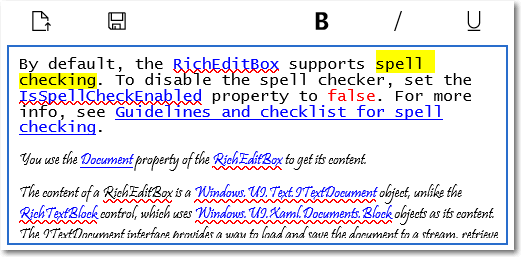

# <a name="rich-edit-box"></a>Zone d’édition enrichie

<link rel="stylesheet" href="https://az835927.vo.msecnd.net/sites/uwp/Resources/css/custom.css"> 

Vous pouvez utiliser un contrôle RichEditBox pour entrer et modifier des documents au format RTF qui contiennent du texte mis en forme, des liens hypertexte et des images. Vous pouvez faire en sorte que RichEditBox soit en lecture seule en définissant sa propriété IsReadOnly sur **true**.

<div class="important-apis" >
<b>API importantes</b><br/>
<ul>
<li>[**Classe RichEditBox**](https://msdn.microsoft.com/library/windows/apps/xaml/windows.ui.xaml.controls.richeditbox.aspx)</li>
<li>[**Propriété Document**](https://msdn.microsoft.com/library/windows/apps/xaml/windows.ui.xaml.controls.richeditbox.document.aspx)</li>
<li>[**Propriété IsReadOnly**](https://msdn.microsoft.com/library/windows/apps/xaml/windows.ui.xaml.controls.richeditbox.isreadonly.aspx)</li>
<li>[**Propriété IsSpellCheckEnabled**](https://msdn.microsoft.com/library/windows/apps/xaml/windows.ui.xaml.controls.richeditbox.isspellcheckenabled.aspx)</li>
</ul>
</div>

## <a name="is-this-the-right-control"></a>Est-ce le contrôle approprié?

Utilisez un contrôle **RichEditBox** pour afficher et modifier les fichiers de texte. Vous n’utilisez pas un contrôle RichEditBox pour obtenir les données entrées dans votre application par l’utilisateur de la même façon que vous utilisez d’autres zones de saisie de texte standard. En fait, ce contrôle vous permet de travailler sur des fichiers de texte séparés de votre application. Le texte entré dans un contrôle RichEditBox est généralement enregistré dans un fichier.rtf.
-   Si l’objectif principal de la zone de texte de plusieurs lignes est de créer des documents (par exemple les entrées d’un blog ou le contenu d’un message électronique) et si ces documents nécessitent du texte enrichi, utilisez une zone de texte enrichi.
-   Si vous voulez permettre aux utilisateurs de mettre en forme leur texte, utilisez une zone de texte enrichi.
-   Pour saisir du texte qui sera uniquement utilisé et non réaffiché aux utilisateurs, utilisez un contrôle de saisie de texte brut.
-   Pour tous les autres cas de figure, utilisez un contrôle d’entrée de texte brut.

Pour plus d’informations sur le choix du contrôle de texte approprié, voir l’article [Contrôles de texte](text-controls.md).

## <a name="examples"></a>Exemples

Un document au format RTF est ouvert dans cette zone d’édition enrichie. Les boutons de mise en forme et de fichier ne font pas partie de la zone d’édition enrichie. Cependant, vous devez fournir au moins un jeu minimal de boutons de style et implémenter leurs actions.



## <a name="create-a-rich-edit-box"></a>Créer une zone d’édition enrichie

Par défaut, le contrôle RichEditBox prend en charge la vérification orthographique. Pour désactiver le vérificateur d’orthographe, définissez la propriété [IsSpellCheckEnabled](https://msdn.microsoft.com/library/windows/apps/xaml/windows.ui.xaml.controls.richeditbox.isspellcheckenabled.aspx) sur **false**. Pour plus d’informations, voir l’article [Recommandations en matière de vérification orthographique](spell-checking-and-prediction.md).

Vous utilisez la propriété [Document](https://msdn.microsoft.com/library/windows/apps/xaml/windows.ui.xaml.controls.richeditbox.document.aspx) du contrôle RichEditBox pour obtenir son contenu. Le contenu d’une classe RichEditBox est un objet [Windows.UI.Text.ITextDocument](https://msdn.microsoft.com/library/windows/apps/xaml/bb774052.aspx), contrairement au contrôle RichTextBlock, qui utilise des objets [Windows.UI.Xaml.Documents.Block](https://msdn.microsoft.com/library/windows/apps/xaml/windows.ui.xaml.documents.block.aspx) en tant que contenu. L’interface ITextDocument permet de charger et d’enregistrer le document dans un flux, de récupérer des plages de texte, d’obtenir la sélection active, d’annuler et de répéter des modifications, de définir des attributs de mise en forme par défaut, etc.

Cet exemple montre comment modifier, charger et enregistrer un fichier au format .RTF (Rich Text Format) dans un contrôle RichEditBox.

```xaml
<RelativePanel Margin="20" HorizontalAlignment="Stretch">
    <RelativePanel.Resources>
        <Style TargetType="AppBarButton">
            <Setter Property="IsCompact" Value="True"/>
        </Style>
    </RelativePanel.Resources>
    <AppBarButton x:Name="openFileButton" Icon="OpenFile"
                  Click="OpenButton_Click" ToolTipService.ToolTip="Open file"/>
    <AppBarButton Icon="Save" Click="SaveButton_Click"
                  ToolTipService.ToolTip="Save file"
                  RelativePanel.RightOf="openFileButton" Margin="8,0,0,0"/>

    <AppBarButton Icon="Bold" Click="BoldButton_Click" ToolTipService.ToolTip="Bold"
                  RelativePanel.LeftOf="italicButton" Margin="0,0,8,0"/>
    <AppBarButton x:Name="italicButton" Icon="Italic" Click="ItalicButton_Click"
                  ToolTipService.ToolTip="Italic" RelativePanel.LeftOf="underlineButton" Margin="0,0,8,0"/>
    <AppBarButton x:Name="underlineButton" Icon="Underline" Click="UnderlineButton_Click"
                  ToolTipService.ToolTip="Underline" RelativePanel.AlignRightWithPanel="True"/>

    <RichEditBox x:Name="editor" Height="200" RelativePanel.Below="openFileButton"
                 RelativePanel.AlignLeftWithPanel="True" RelativePanel.AlignRightWithPanel="True"/>
</RelativePanel>
```


```csharp
private async void OpenButton_Click(object sender, RoutedEventArgs e)
{
    // Open a text file.
    Windows.Storage.Pickers.FileOpenPicker open =
        new Windows.Storage.Pickers.FileOpenPicker();
    open.SuggestedStartLocation =
        Windows.Storage.Pickers.PickerLocationId.DocumentsLibrary;
    open.FileTypeFilter.Add(".rtf");

    Windows.Storage.StorageFile file = await open.PickSingleFileAsync();

    if (file != null)
    {
        try
        {
            Windows.Storage.Streams.IRandomAccessStream randAccStream =
        await file.OpenAsync(Windows.Storage.FileAccessMode.Read);

            // Load the file into the Document property of the RichEditBox.
            editor.Document.LoadFromStream(Windows.UI.Text.TextSetOptions.FormatRtf, randAccStream);
        }
        catch (Exception)
        {
            ContentDialog errorDialog = new ContentDialog()
            {
                Title = "File open error",
                Content = "Sorry, I couldn't open the file.",
                PrimaryButtonText = "Ok"
            };

            await errorDialog.ShowAsync();
        }
    }
}

private async void SaveButton_Click(object sender, RoutedEventArgs e)
{
    Windows.Storage.Pickers.FileSavePicker savePicker = new Windows.Storage.Pickers.FileSavePicker();
    savePicker.SuggestedStartLocation = Windows.Storage.Pickers.PickerLocationId.DocumentsLibrary;

    // Dropdown of file types the user can save the file as
    savePicker.FileTypeChoices.Add("Rich Text", new List<string>() { ".rtf" });

    // Default file name if the user does not type one in or select a file to replace
    savePicker.SuggestedFileName = "New Document";

    Windows.Storage.StorageFile file = await savePicker.PickSaveFileAsync();
    if (file != null)
    {
        // Prevent updates to the remote version of the file until we
        // finish making changes and call CompleteUpdatesAsync.
        Windows.Storage.CachedFileManager.DeferUpdates(file);
        // write to file
        Windows.Storage.Streams.IRandomAccessStream randAccStream =
            await file.OpenAsync(Windows.Storage.FileAccessMode.ReadWrite);

        editor.Document.SaveToStream(Windows.UI.Text.TextGetOptions.FormatRtf, randAccStream);

        // Let Windows know that we're finished changing the file so the
        // other app can update the remote version of the file.
        Windows.Storage.Provider.FileUpdateStatus status = await Windows.Storage.CachedFileManager.CompleteUpdatesAsync(file);
        if (status != Windows.Storage.Provider.FileUpdateStatus.Complete)
        {
            Windows.UI.Popups.MessageDialog errorBox =
                new Windows.UI.Popups.MessageDialog("File " + file.Name + " couldn't be saved.");
            await errorBox.ShowAsync();
        }
    }
}

private void BoldButton_Click(object sender, RoutedEventArgs e)
{
    Windows.UI.Text.ITextSelection selectedText = editor.Document.Selection;
    if (selectedText != null)
    {
        Windows.UI.Text.ITextCharacterFormat charFormatting = selectedText.CharacterFormat;
        charFormatting.Bold = Windows.UI.Text.FormatEffect.Toggle;
        selectedText.CharacterFormat = charFormatting;
    }
}

private void ItalicButton_Click(object sender, RoutedEventArgs e)
{
    Windows.UI.Text.ITextSelection selectedText = editor.Document.Selection;
    if (selectedText != null)
    {
        Windows.UI.Text.ITextCharacterFormat charFormatting = selectedText.CharacterFormat;
        charFormatting.Italic = Windows.UI.Text.FormatEffect.Toggle;
        selectedText.CharacterFormat = charFormatting;
    }
}

private void UnderlineButton_Click(object sender, RoutedEventArgs e)
{
    Windows.UI.Text.ITextSelection selectedText = editor.Document.Selection;
    if (selectedText != null)
    {
        Windows.UI.Text.ITextCharacterFormat charFormatting = selectedText.CharacterFormat;
        if (charFormatting.Underline == Windows.UI.Text.UnderlineType.None)
        {
            charFormatting.Underline = Windows.UI.Text.UnderlineType.Single;
        }
        else {
            charFormatting.Underline = Windows.UI.Text.UnderlineType.None;
        }
        selectedText.CharacterFormat = charFormatting;
    }
}
```

## <a name="choose-the-right-keyboard-for-your-text-control"></a>Choisissez le clavier approprié pour votre contrôle de texte

Pour faciliter la saisie de données par les utilisateurs au moyen du clavier tactile, ou panneau de saisie, définissez l’étendue des entrées du contrôle de texte de sorte qu’elle corresponde au type de données attendu de la part de l’utilisateur. La disposition de clavier par défaut est généralement appropriée pour l’utilisation de documents au format RTF.

Pour en savoir plus sur l’utilisation des étendues des entrées, voir [Utiliser l’étendue des entrées pour modifier le clavier tactile](https://msdn.microsoft.com/library/windows/apps/mt280229).

## <a name="dos-and-donts"></a>Pratiques conseillées et déconseillées

-   Lorsque vous créez une zone de texte enrichi, proposez des boutons de style et implémentez leurs actions.
-   Utilisez une police cohérente avec le style de votre application.
-   Faites en sorte que la hauteur du contrôle de texte soit suffisante pour recevoir des entrées classiques.
-   Ne laissez pas les contrôles de saisie de texte s’allonger en hauteur lorsque les utilisateurs entrent le texte.
-   N’utilisez pas de zone de texte de plusieurs lignes quand les utilisateurs n’ont besoin que d’une seule ligne.
-   N’utilisez pas de contrôle de texte enrichi si un contrôle de texte brut est approprié.


## <a name="related-articles"></a>Articles connexes

* [Contrôles de texte](text-controls.md)
- [Recommandations en matière de vérification orthographique](spell-checking-and-prediction.md)
- [Ajout de la fonctionnalité de recherche](search.md)
- [Recommandations en matière de saisie de texte](text-controls.md)
- [**Classe TextBox**](https://msdn.microsoft.com/library/windows/apps/br209683)
- [**Classe PasswordBox Windows.UI.Xaml.Controls**](https://msdn.microsoft.com/library/windows/apps/br227519)
