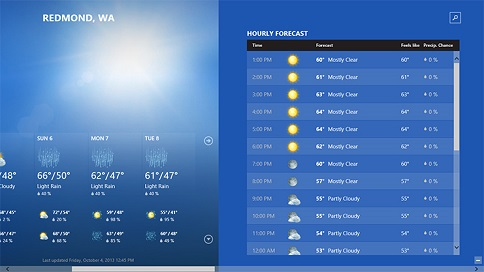

# <a name="scroll-bars"></a>Barres de défilement

<link rel="stylesheet" href="https://az835927.vo.msecnd.net/sites/uwp/Resources/css/custom.css"> 

Le mouvement panoramique et le défilement permettent aux utilisateurs d’atteindre du contenu qui s’étend au-delà des limites de l’écran.

Un contrôle de visionneuse à défilement est composé d’autant de contenu que la fenêtre d’affichage peut en contenir et d’une ou deux barres de défilement. Vous pouvez utiliser des mouvements tactiles pour agrandir ou effectuer un panoramique (les barres de défilement apparaissent en fondu uniquement durant la manipulation) et utiliser le pointeur pour le défilement. Le mouvement de raccourci effectue un panoramique avec l’inertie.

**Remarque** Windows dispose de deux visualisations de barre de défilement, qui sont basées sur le mode d’entrée de l’utilisateur : les indicateurs de défilement en cas d’utilisation de l’interface tactile ou du boîtier de commande, et les barres de défilement interactif pour d’autres périphériques d’entrée, y compris la souris, le clavier et le stylet.


<div class="microsoft-internal-note">
Pour accéder à l’ensemble des lignes rouges, consultez le [Design Depot](http://designdepot/DesignDepot.FrontEnd/#/ML/Dashboard/1805)
</div>

<div class="important-apis" >
<b>API importantes</b><br/>
<ul>
<li>[**Classe ScrollViewer**](https://msdn.microsoft.com/library/windows/apps/br209527)</li>
<li>[**Classe ScrollBar**](https://msdn.microsoft.com/library/windows/apps/windows.ui.xaml.controls.primitives.scrollbar.aspx)</li>
</ul>
</div>


## <a name="examples"></a>Exemples

Un [**ScrollViewer**](https://msdn.microsoft.com/library/windows/apps/xaml/windows.ui.xaml.controls.scrollviewer.aspx) permet d’afficher le contenu dans une zone plus petite que sa taille réelle. Lorsque le contenu de la visionneuse à défilement n’est pas entièrement visible, celle-ci affiche des barres de défilement que l’utilisateur peut utiliser pour déplacer la zone de contenu visible. La zone qui inclut tout le contenu de la visionneuse à défilement est l’*étendue*. La zone visible du contenu est la *fenêtre d’affichage*.



## <a name="create-a-scroll-viewer"></a>Créer une visionneuse à défilement
Pour ajouter un défilement vertical à votre page, placez le contenu de la page dans une visionneuse à défilement.

```xaml
<Page
    x:Class="App1.MainPage"
    xmlns="http://schemas.microsoft.com/winfx/2006/xaml/presentation"
    xmlns:x="http://schemas.microsoft.com/winfx/2006/xaml"
    xmlns:local="using:App1">

    <ScrollViewer>
        <StackPanel>
            <TextBlock Text="My Page Title" Style="{StaticResource TitleTextBlockStyle}"/>
            <!-- more page content -->
        </StackPanel>
    </ScrollViewer>
</Page>
```
Ce code XAML montre comment placer une image dans une visionneuse à défilement et activer le zoom.

```xaml
<ScrollViewer ZoomMode="Enabled" MaxZoomFactor="10"
              HorizontalScrollMode="Enabled" HorizontalScrollBarVisibility="Visible"
              Height="200" Width="200">
    <Image Source="Assets/Logo.png" Height="400" Width="400"/>
</ScrollViewer>
```

## <a name="scrollviewer-in-a-control-template"></a>ScrollViewer dans un modèle de contrôle

Souvent, un ScrollViewer est un élément composite d’autres contrôles. Un élément ScrollViewer, avec la classe [**ScrollContentPresenter**](https://msdn.microsoft.com/library/windows/apps/xaml/windows.ui.xaml.controls.scrollcontentpresenter.aspx) pour la prise en charge, présente une fenêtre d’affichage ainsi que des barres de défilement uniquement lorsque l’espace de disposition du contrôle hôte est limité et plus petit que la taille du contenu étendu. C’est souvent le cas pour les listes : les modèles [**ListView**](https://msdn.microsoft.com/library/windows/apps/xaml/windows.ui.xaml.controls.listview.aspx) et [**GridView**](https://msdn.microsoft.com/library/windows/apps/xaml/windows.ui.xaml.controls.gridview.aspx) incluent toujours un ScrollViewer. [**TextBox**](https://msdn.microsoft.com/library/windows/apps/xaml/windows.ui.xaml.controls.textbox.aspx) et [**RichEditBox**](https://msdn.microsoft.com/library/windows/apps/xaml/windows.ui.xaml.controls.richeditbox.aspx) incluent également un ScrollViewer dans leurs modèles.

Quand un élément **ScrollViewer** existe dans un contrôle, le contrôle hôte dispose souvent d’une gestion des événements intégrée pour certains événements d’entrée et de manipulations qui permettent de faire défiler le contenu. Par exemple, un contrôle GridView interprète un mouvement de balayage, entraînant un défilement horizontal du contenu. Les événements d’entrée et manipulations de données brutes reçus par le contrôle hôte sont considérés comme étant gérés par le contrôle, et les événements de bas niveau tels que [**PointerPressed**](https://msdn.microsoft.com/library/windows/apps/xaml/windows.ui.xaml.uielement.pointerpressed.aspx) ne sont pas déclenchés ni propagés vers des conteneurs parents. Vous pouvez modifier certains aspects de la gestion des contrôles intégrée en remplaçant une classe de contrôle et les méthodes virtuelles **On*** pour les événements, ou en redéfinissant le modèle du contrôle. Toutefois, dans les deux cas, il n’est pas très simple de reproduire le comportement par défaut d’origine, qui a généralement pour but de faire réagir le contrôle d’une façon spécifique aux événements et aux mouvements et actions d’entrée de l’utilisateur. Par conséquent, vous devez déterminer si cet événement d’entrée doit vraiment se déclencher. Vous pouvez rechercher s’il existe d’autres mouvements ou événements d’entrée qui ne sont pas gérés par le contrôle et les exploiter dans la conception de l’interaction de votre application ou de votre contrôle.

Pour permettre aux contrôles qui incluent un ScrollViewer d’influencer certains comportements et propriétés de l’élément ScrollViewer, ScrollViewer définit un certain nombre de propriétés XAML jointes, qui peuvent être définies dans les styles et utilisées dans les liaisons de modèle. Pour plus d’informations sur les propriétés jointes, voir [Vue d’ensemble des propriétés jointes](../xaml-platform/attached-properties-overview.md).

**Propriétés XAML jointes de ScrollViewer**

ScrollViewer définit les propriétés XAML jointes suivantes :
- [ScrollViewer.BringIntoViewOnFocusChange](https://msdn.microsoft.com/library/windows/apps/xaml/windows.ui.xaml.controls.scrollviewer.bringintoviewonfocuschange.aspx)
- [ScrollViewer.HorizontalScrollBarVisibility](https://msdn.microsoft.com/library/windows/apps/xaml/windows.ui.xaml.controls.scrollviewer.horizontalscrollbarvisibility.aspx)
- [ScrollViewer.HorizontalScrollMode](https://msdn.microsoft.com/library/windows/apps/xaml/windows.ui.xaml.controls.scrollviewer.horizontalscrollmode.aspx)
- [ScrollViewer.IsDeferredScrollingEnabled](https://msdn.microsoft.com/library/windows/apps/xaml/windows.ui.xaml.controls.scrollviewer.isdeferredscrollingenabled.aspx)
- [ScrollViewer.IsHorizontalRailEnabled](https://msdn.microsoft.com/library/windows/apps/xaml/windows.ui.xaml.controls.scrollviewer.ishorizontalrailenabled.aspx)
- [ScrollViewer.IsHorizontalScrollChainingEnabled](https://msdn.microsoft.com/library/windows/apps/xaml/windows.ui.xaml.controls.scrollviewer.ishorizontalscrollchainingenabled.aspx)
- [ScrollViewer.IsScrollInertiaEnabled](https://msdn.microsoft.com/library/windows/apps/xaml/windows.ui.xaml.controls.scrollviewer.isscrollinertiaenabled.aspx)
- [ScrollViewer.IsVerticalRailEnabled](https://msdn.microsoft.com/library/windows/apps/xaml/windows.ui.xaml.controls.scrollviewer.isverticalrailenabled.aspx)
- [ScrollViewer.IsVerticalScrollChainingEnabled](https://msdn.microsoft.com/library/windows/apps/xaml/windows.ui.xaml.controls.scrollviewer.isverticalscrollchainingenabled.aspx)
- [ScrollViewer.IsZoomChainingEnabled](https://msdn.microsoft.com/library/windows/apps/xaml/windows.ui.xaml.controls.scrollviewer.iszoominertiaenabled.aspx)
- [ScrollViewer.IsZoomInertiaEnabled](https://msdn.microsoft.com/library/windows/apps/xaml/windows.ui.xaml.controls.scrollviewer.iszoominertiaenabled.aspx)
- [ScrollViewer.VerticalScrollBarVisibility](https://msdn.microsoft.com/library/windows/apps/xaml/windows.ui.xaml.controls.scrollviewer.verticalscrollbarvisibilityproperty.aspx)
- [ScrollViewer.VerticalScrollMode](https://msdn.microsoft.com/library/windows/apps/xaml/windows.ui.xaml.controls.scrollviewer.verticalscrollmode.aspx)
- [ScrollViewer.ZoomMode](https://msdn.microsoft.com/library/windows/apps/xaml/windows.ui.xaml.controls.scrollviewer.zoommode.aspx)

Ces propriétés XAML jointes sont conçues pour les cas où le ScrollViewer est implicite, par exemple lorsque le ScrollViewer existe dans le modèle par défaut pour un contrôle ListView ou GridView et que voulez être en mesure d’influencer le comportement de défilement du contrôle sans accéder à des parties du modèle.

Par exemple, voici comment rendre les barres de défilement vertical toujours visibles pour une visionneuse à défilement intégrée d’un contrôle ListView.
```xaml
<ListView ScrollViewer.VerticalScrollBarVisibility="Visible"/>
```

Pour les cas où un ScrollViewer est explicite dans votre code XAML, comme indiqué dans l’exemple de code, vous n’avez pas besoin d’utiliser une syntaxe de propriété jointe. Utilisez simplement une syntaxe d’attribut, par exemple `<ScrollViewer VerticalScrollBarVisibility="Visible"/>`.


## <a name="dos-and-donts"></a>Pratiques conseillées et déconseillées

-   Dans la mesure du possible, privilégiez le défilement vertical plutôt qu’horizontal.
-   Utilisez le mouvement panoramique sur un axe pour les régions de contenu qui s’étendent au-delà des contours de la fenêtre d’affichage (vertical ou horizontal). Utilisez le mouvement panoramique sur deux axes pour les régions de contenu qui s’étendent au-delà des contours de la fenêtre d’affichage (à la fois vertical et horizontal).
-   Utilisez la fonctionnalité de défilement intégrée dans les contrôles hub, d’affichage de liste, d’affichage de grille, de zone de liste modifiable, de zone de liste et de zone d’entrée de texte. Avec ces contrôles, s’il y a trop d’éléments à afficher simultanément, l’utilisateur peut faire défiler la liste d’éléments horizontalement ou verticalement.
-   Si vous voulez que l’utilisateur puisse effectuer un panoramique dans les deux directions autour d’une zone plus grande et qu’il puisse éventuellement zoomer, par exemple sur une image taille réelle (au lieu d’une image adaptée à la taille de l’écran), placez l’image dans une visionneuse à défilement.
-   Si l’utilisateur doit faire défiler un long passage de texte, configurez la visionneuse à défilement pour qu’elle défile uniquement verticalement.
-   Une visionneuse à défilement ne doit contenir qu’un seul objet. Notez que cet objet peut être un panneau de disposition contenant à son tour un nombre quelconque d’objets.
-   Ne placez pas de contrôle [Pivot](tabs-pivot.md) dans une visionneuse à défilement pour éviter les conflits avec la logique de défilement du sélecteur de vue.

## <a name="related-topics"></a>Rubriques connexes

**Pour les développeurs (XAML)**
* [**Classe ScrollViewer**](https://msdn.microsoft.com/library/windows/apps/br209527)

