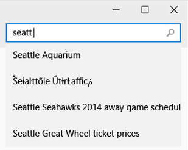
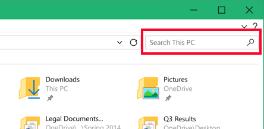
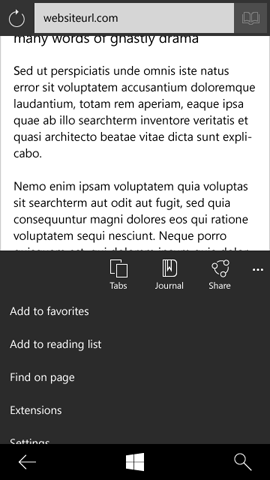
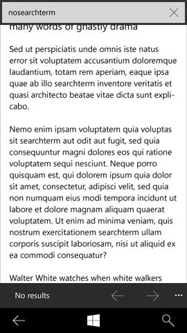

# Recherche et recherche dans la page

L’option de recherche est l’un des moyens les plus courants pour rechercher du contenu dans votre application. Les recommandations de cet article abordent différents aspects de l’expérience de recherche, les étendues de recherche, l’implémentation et des exemples de recherche en contexte.

**API importantes**

-   [**Classe AutoSuggestBox (XAML)**](https://msdn.microsoft.com/library/windows/apps/dn633874)

## Aspects de l’expérience de recherche

**Entrée.**  La saisie de texte est le mode d’entrée de recherche le plus courant et le sujet principal de ce guide. Les modes d’entrée Voix et Webcam sont également couramment utilisés, mais ils nécessitent généralement de pouvoir communiquer avec le matériel et, dans certains cas, l’ajout de contrôles ou d’une interface utilisateur personnalisée au sein de l’application.

**Entrée nulle.**  Lorsque le champ d’entrée est activé par l’utilisateur, mais qu’aucun texte n’a été saisi, vous pouvez afficher ce que l’on appelle un «canevas d’entrée nulle». Le canevas d’entrée nulle apparaît généralement dans les canevas de l’application, afin que la fonction de [suggestion automatique](auto-suggest-box.md) remplace ce contenu lorsque l’utilisateur commence à entrer sa requête. L’historique des dernières recherches, les tendances des recherches, les suggestions de recherche contextuelle, les astuces et les conseils sont tous de bons candidats pour l’état d’entrée nulle.

 

**Formulation de requêtes/suggestion automatique.**  La formulation de requêtes remplace le contenu d’entrée nulle dès que l’utilisateur commence à entrer sa requête. Lorsque les utilisateurs entrent une chaîne de requête, ces derniers aperçoivent un ensemble de suggestions de requête ou d’options de désambiguïsation mis à jour en continu afin d’accélérer le processus d’entrée et de les aider à formuler leur requête. Le comportement des suggestions de requête est intégré au [contrôle de suggestion automatique](auto-suggest-box.md). Il permet également d’afficher l’icône à l’intérieur de la recherche (comme un micro ou une icône de validation). Tout autre comportement incombe à l’application.

 

**Jeu de résultats.**  En règle générale, les résultats de la recherche apparaissent directement sous le champ de recherche. Bien que facultative, la juxtaposition des entrées et des résultats permet de maintenir un contexte et d’accéder immédiatement à la modification de la dernière requête ou à la saisie d’une nouvelle requête. Ce lien peut être indiqué plus loin en remplaçant le texte d’information par la requête à l’origine du jeu de résultats.

Vous pouvez faciliter l’accès aux fonctions de modification de la dernière requête et de saisie d’une nouvelle requête en mettant en surbrillance la dernière requête lorsque le champ est réactivé. Ainsi, la dernière chaîne est remplacée par la séquence de touches saisie, mais la chaîne est conservée afin que l’utilisateur puisse placer son curseur et modifier ou ajouter la chaîne précédente.

L’affichage du jeu de résultats peut prendre différentes formes en fonction du contenu. Le [mode Liste](lists.md) offre une grande flexibilité et convient parfaitement à la plupart des recherches. Le mode Grille fonctionne bien pour les images ou les autres contenus multimédias. Vous pouvez utiliser une carte pour indiquer la distribution spatiale.

## Zones de recherche

La fonction recherche est d’utilisation. Les interfaces utilisateur de recherche sont intégrées à l’interpréteur de commandes et à de nombreuses applications. Bien que les points d’entrée de recherche présentent généralement un aspect similaire, ils permettent d’obtenir des résultats aussi larges (recherche sur le web ou sur un périphérique) que précis (liste de contacts d’un utilisateur). Le point d’entrée de recherche doit être juxtaposé au contenu en cours de recherche.

Voici quelques exemples d’étendues de recherche courantes:

**Global** et **contextuel/optimal.**  Rechercher dans plusieurs sources du cloud et du contenu local. Résultats variés incluant des URL, des documents, des médias, des actions, des applications et plus encore.

**Web.**  Rechercher dans un index Web. Les résultats peuvent contenir des pages, des entités et des réponses.

**Mon contenu.**  Rechercher des informations sur plusieurs appareils, dans le cloud, des graphiques sociaux et plus encore. Les résultats sont différents, mais sont limités par le lien aux comptes d’utilisateur.

Utilisez un texte d’information afin d’indiquer l’étendue de la recherche. Par exemple :

« Rechercher sur Windows et sur le Web »

« Rechercher dans la liste de contacts »

« Rechercher dans la boîte aux lettres »

« Rechercher dans les paramètres »

«Rechercher un emplacement»

 

En délimitant précisément l’étendue d’un point d’entrée de recherche, vous permettez à l’utilisateur de s’assurer que ses critères correspondent bien à la fonction de recherche et vous limitez ainsi les désagréments éventuels.

## Implémentation

Les champs d’entrée de texte sont recommandés pour la plupart des applications, car ils offrent un point d’entrée de recherche bien visible. Les textes d’information facilitent également la découverte et la communication avec l’étendue de la recherche. Lorsque la recherche est une fonction plus secondaire, ou lorsque l’espace est limité, l’icône de recherche peut servir de point d’entrée, sans qu’un champ d’entrée ne lui soit associé. Lorsque la recherche est affichée sous forme d’une icône, assurez-vous qu’il reste suffisamment d’espace pour afficher la zone de recherche modale, comme illustré dans les exemples ci-dessous.

Avant de cliquer sur l’icône de recherche:

 

Après avoir cliqué sur l’icône de recherche:

 

La recherche utilise toujours un glyphe en forme de loupe orienté vers la droite comme point d’entrée. Le glyphe à utiliser est encodé en Segoe UI Symbol, code de caractère hexadécimal 0xE0094, et possède généralement une taille de police de 15 epx.

Le point d’entrée de recherche peut être placé à différents endroits. Son placement indique l’étendue et le contexte de la recherche. Les recherches réunissant des résultats relatifs à une expérience ou externes à l’application sont généralement situés dans un chrome d’application de niveau supérieur, telles que les barres de commandes globales ou la navigation.

À mesure que l’étendue de la recherche s’affine ou se contextualise, l’emplacement indiqué correspond davantage au contenu à rechercher, telle qu’une zone de canevas, un en-tête de liste ou des barres de commandes contextuelles. Dans tous les cas, le lien entre l’entrée de recherche et les résultats (ou le contenu filtré) doit apparaître clairement.

Dans le cas des listes de défilement, il est utile d’afficher systématiquement les entrées de recherche. Nous vous recommandons de rendre l’entrée de recherche rémanente et de faire défiler le contenu en arrière-plan.

Les fonctionnalités d’entrée nulle et de formulation de requêtes sont facultatives pour les recherches contextuelles/optimales, dans lesquelles la liste est filtrée en temps réel par l’entrée de l’utilisateur. Des exceptions existent, notamment lorsque les suggestions de mise en forme des requêtes sont disponibles, comme les options de filtrage de la boîte de réception (à :&lt;input string&gt;, de : &lt;input string&gt;, objet : &lt;input string&gt;, etc.).

## Exemple

Cette section présente des exemples de recherche en contexte.

Recherche en tant qu’action dans la barre d’outils Windows:

 

Recherche en tant qu’entrée sur le canevas d’application:

 

Recherche dans un volet de navigation:

 

La recherche en ligne est réservée au cas où la recherche est rarement utilisée ou est hautement contextuelle:

## Recommandations en matière de recherche dans la page

La recherche dans la page permet aux utilisateurs de trouver des correspondances dans le corps du texte affiché. Les visionneuses de documents, lecteurs et navigateurs constituent les types d’applications les plus classiques offrant cette fonctionnalité.

## Recommandations

-   Placez une barre de commandes dans votre application avec la fonctionnalité de recherche dans la page pour permettre à l’utilisateur d’y trouver du texte. Pour plus d’informations sur le placement, voir la section Exemples.

    -   Les applications proposant une recherche dans la page doivent offrir tous les contrôles requis dans une barre de commandes.
    -   Si votre application comporte un grand nombre de fonctionnalités autres que la recherche dans la page, vous pouvez ajouter un bouton **Rechercher** dans la barre de commandes du haut comme point d’entrée vers une autre barre de commandes contenant tous les contrôles de recherche dans la page.
    -   La barre de commandes de la fonctionnalité de recherche dans la page doit rester visible lorsque l’utilisateur utilise le clavier tactile. Le clavier tactile s’affiche lorsqu’un utilisateur appuie sur la zone de texte. La barre de commandes de recherche dans la page doit être déplacée vers le haut afin que le clavier tactile ne la masque pas.

    -   La fonctionnalité de recherche dans la page doit rester disponible lorsque l’utilisateur interagit avec la vue. Les utilisateurs doivent pouvoir interagir avec le texte de la vue tout en utilisant la fonctionnalité de recherche dans la page. Par exemple, s’ils le veulent, ils doivent pouvoir effectuer un zoom avant ou arrière sur un document ou un mouvement panoramique sur la vue pour lire le texte. Lorsque l’utilisateur commence à se servir de la fonctionnalité de recherche dans la page, la barre de commandes doit rester disponible et un bouton **Fermer** être proposé pour quitter cette fonctionnalité.

    -   Implémentez le raccourci clavier (Ctrl+F). Le raccourci clavier Ctrl+F doit être disponible pour que l’utilisateur puisse rapidement ouvrir la barre de commandes de recherche dans la page.

    -   Intégrez les éléments de base de la fonctionnalité de recherche dans la page. Voici les éléments d’interface utilisateur nécessaires pour implémenter une recherche dans la page :

        -   Zone de texte
        -   Boutons Précédent et Suivant
        -   Nombre de correspondances
        -   Fermer (bureau uniquement)
    -   Les résultats correspondants doivent être mis en surbrillance dans la vue et l’utilisateur doit pouvoir la faire défiler pour passer au résultat suivant à l’écran. Les utilisateurs peuvent se déplacer rapidement au sein du document à l’aide des boutons **Précédent** et **Suivant**, de barres de défilement ou par voie tactile, en procédant à une manipulation directe.

    -   La fonctionnalité de recherche et remplacement doit pouvoir être utilisée parallèlement à la fonctionnalité basique de recherche dans la page. Si votre application dispose d’une fonctionnalité de recherche et remplacement, assurez-vous que la recherche dans la page n’interfère pas avec cette fonctionnalité.

-   Incluez un compteur de correspondances pour indiquer à l’utilisateur le nombre de correspondances de texte sur la page.
-   Implémentez le raccourci clavier (Ctrl+F).

## Exemples

Fournissez un moyen facile d’accéder à la fonctionnalité de recherche dans la page. Dans cet exemple sur une interface utilisateur mobile, la fonctionnalité «Rechercher dans la page» s’affiche après deux commandes «Ajouter à...» dans un menu extensible:

 

Après avoir sélectionné Rechercher dans la page, l’utilisateur entre un terme recherché. Des suggestions de texte peuvent apparaître lors de la saisie du terme recherché:

 

Si aucune correspondance de texte n’est trouvée dans la recherche, une chaîne de texte «Aucun résultat» doit s’afficher dans la zone de résultats:

 

Si la recherche trouve des correspondances de texte, le premier terme doit être surligné dans une couleur distincte, et les autres occurrences dans une couleur plus claire de la même nuance, comme illustré dans cet exemple:

 

La Recherche dans la page a un compteur de correspondances:

## 

**Implémentation de la recherche dans la page**

-   Les visionneuses de documents, lecteurs et navigateurs, qui sont les types d’applications les plus susceptibles d’offrir la fonctionnalité de recherche dans la page, offrent à l’utilisateur une expérience d’affichage/lecture plein écran.
-   La fonctionnalité de recherche dans la page est une fonctionnalité secondaire qui doit figurer dans une barre de commandes.

Pour plus d’informations sur l’ajout de commandes à votre barre de commandes, voir [Barre de commandes](app-bars.md).

## Articles connexes

* [**Zone de suggestion automatique**](auto-suggest-box.md)

 

 

<!--HONumber=Jun16_HO4-->

