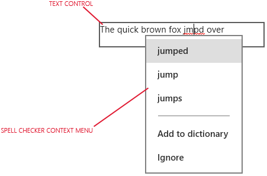

# Recommandations en matière de vérification orthographique

\[ Mise à jour pour les applications UWP sur Windows 10. Pour les articles sur Windows 8.x, voir l’[archive](http://go.microsoft.com/fwlink/p/?linkid=619132). \]

Lors de la saisie et de la modification de texte, le vérificateur orthographique vous informe si un mot a été mal orthographié en le surlignant d’une ligne ondulée rouge et permet de corriger l’erreur.

**API importantes**

-   [**Propriété IsSpellCheckEnabled (XAML)**](https://msdn.microsoft.com/library/windows/apps/br209688)

##    Recommandations

-   Utilisez la vérification orthographique pour aider l’utilisateur lors de la saisie de mots ou de phrases dans les contrôles de saisie de texte. La vérification orthographique fonctionne avec le pavé tactile et l’entrée à l’aide de la souris et du clavier.
-   N’utilisez pas la vérification orthographique pour les mots peu susceptibles de figurer dans le dictionnaire ou quand cela n’apporte rien à l’utilisateur. Par exemple, ne l’activez pas pour les zones de saisie de mots de passe, de numéros de téléphone ni de noms. La vérification orthographique est désactivée par défaut pour ces contrôles.
-   Ne désactivez pas la vérification orthographique au seul motif que le vérificateur d’orthographe actuel ne prend pas en charge la langue de votre application. Si le vérificateur d’orthographe ne prend pas en charge une langue, rien ne se produit, il n’y a donc aucun risque à laisser l’option activée. En outre, certains utilisateurs peuvent utiliser un éditeur de méthode d’entrée (IME) pour saisir dans votre application une autre langue qui elle peut être prise en charge. Par exemple, lorsque vous créez une application en japonais, même si le vérificateur d’orthographe ne reconnaît pas actuellement cette langue, ne le désactivez pas. L’utilisateur pourrait utiliser un IME pour saisir de l’anglais dans l’application ; si la vérification d’orthographe est activée, le texte anglais est vérifié.

##      Indications d’utilisation supplémentaires

Les applications du Windows Store comportent un vérificateur d’orthographe intégré pour les zones de saisie de texte d’une ou de plusieurs lignes et les éléments dont la propriété **contentEditable** a la valeur **true**. Voici un exemple de vérificateur d’orthographe intégré :

Pour plus d’informations, voir [**Classe TextBox**](https://msdn.microsoft.com/library/windows/apps/br209683).

Le vérificateur d’orthographe peut être utilisé avec des contrôles de saisie de texte dans deux objectifs :

-   **La correction automatique des fautes**

    Le vérificateur d’orthographe corrige automatiquement les mots mal orthographiés, lorsqu’il est certain de la correction. Par exemple, il remplace automatiquement « puor » par « pour ».

-   **L’affichage d’autres graphies**

    Lorsque le vérificateur d’orthographe n’est pas sûr des corrections, il souligne le mot mal orthographié en rouge et affiche des suggestions dans un menu contextuel lorsque vous appuyez ou faites un clic droit sur le mot.

Pour les contrôles JavaScript, la vérification orthographique est activée par défaut pour les contrôles de saisie de texte de plusieurs lignes et désactivée pour les contrôles de saisie de texte d’une ligne. Pour l’activer manuellement pour les contrôles d’une seule ligne, définissez la propriété **spellcheck** du contrôle sur **true**. Pour la désactiver, définissez sa propriété **spellcheck** sur **false**.

Pour les contrôles de zone de texte XAML, la vérification orthographique est désactivée par défaut. Vous pouvez l’activer en affectant à la propriété **IsSpellCheckEnabled** la valeur **true**.

\[Cet article contient des informations propres aux applications de plateforme Windows universelle (UWP) et à Windows 10. Pour obtenir de l’aide concernant Windows 8.1, téléchargez le [document PDF de recommandations pour Windows 8.1](https://go.microsoft.com/fwlink/p/?linkid=258743) (en anglais).\]

##  Articles connexes

* [Texte et contrôles de texte](text-controls.md)
* [Recommandations en matière de saisie de texte](https://msdn.microsoft.com/library/windows/apps/hh750315)
* [Recommandations en matière de texte et de typographie](https://msdn.microsoft.com/library/windows/apps/hh700394)
**Pour les développeurs (XAML)**
* [**Propriété TextBox.IsSpellCheckEnabled**](https://msdn.microsoft.com/library/windows/apps/br209688)
* [**Classe TextBox**](https://msdn.microsoft.com/library/windows/apps/br209683)

 

<!--HONumber=Mar16_HO1-->

