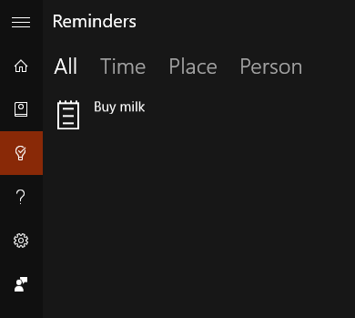

# Sélecteur de vue et onglets

Les contrôles sélecteur de vue et le modèle onglets sont utilisés pour naviguer entre différentes catégories de contenu fréquemment consultées. Les sélecteurs de vue et les onglets sont constitués de plusieurs volets de contenu présentant les en-têtes de catégorie correspondants. Les en-têtes restent affichés à l’écran, et leur état de sélection est clairement indiqué. Les utilisateurs savent ainsi en permanence dans quelle catégorie ils se trouvent.


Les onglets sont une variante visuelle du sélecteur de vue et sont conçus à l’aide du contrôle [**Pivot**](https://msdn.microsoft.com/library/windows/apps/xaml/windows.ui.xaml.controls.pivot.aspx). [
            **L’exemple de code**](https://github.com/Microsoft/Windows-universal-samples/tree/master/Samples/XamlPivot) expliquant comment personnaliser le sélecteur de vue est disponible sur GitHub.

<span class="sidebar_heading" style="font-weight: bold;">API importantes</span>

-   [**Classe Pivot**](https://msdn.microsoft.com/library/windows/apps/dn608241)

## Modèle d’onglet/sélecteur de vue

Lorsque vous créez une application avec le modèle d’onglet/sélecteur de vue, vous devez prendre en compte certaines variables de conception clés.

- **Étiquettes d’en-tête.**  Les en-têtes peuvent être associés à une icône avec du texte ou à du texte seulement.
- **Alignement de l’en-tête.**  Les en-têtes peuvent être alignés à gauche ou centrés.
- **Navigation de niveau supérieur ou inférieur.**  Les onglets/sélecteurs de vue peuvent être utilisés pour les deux niveaux de navigation. Si vous le souhaitez, le [volet de navigation](nav-pane.md) peut servir de niveau principal avec des onglets/sélecteurs de vue servant de niveau secondaire.
- **Prise en charge des entrées tactiles**  Pour les appareils qui prennent en charge les entrées tactiles, vous pouvez utiliser un des deux ensembles d’interactions pour naviguer entre les catégories de contenu :
    1. Appuyez sur un en-tête d’onglet/sélecteur de vue pour accéder à cette catégorie.
    2. Balayez vers la gauche ou vers la droite sur la zone de contenu pour accéder à la catégorie adjacente.

## Exemples

Contrôle Pivot par défaut dans les rappels Cortana.



Modèle onglets dans l’application Alarmes et horloge.


## Créer un contrôle Pivot

Le contrôle [**Pivot**](https://msdn.microsoft.com/library/windows/apps/xaml/windows.ui.xaml.controls.pivot.aspx) est fourni avec les fonctionnalités de base décrites dans cette section.

Ce code XAML crée un contrôle Pivot de base avec 3 sections de contenu.

```xaml
<Pivot x:Name="rootPivot" Title="Pivot Title">
    <PivotItem Header="Pivot Item 1">
        <!--Pivot content goes here-->
        <TextBlock Text="Content of pivot item 1."/>
    </PivotItem>
    <PivotItem Header="Pivot Item 2">
        <!--Pivot content goes here-->
        <TextBlock Text="Content of pivot item 2."/>
    </PivotItem>
    <PivotItem Header="Pivot Item 3">
        <!--Pivot content goes here-->
        <TextBlock Text="Content of pivot item 3."/>
    </PivotItem>
</Pivot>
```

### Éléments du contrôle Pivot

Le contrôle Pivot est un [**ItemsControl**](https://msdn.microsoft.com/library/windows/apps/xaml/windows.ui.xaml.controls.itemscontrol.aspx). Il peut donc contenir une collection d’éléments de n’importe quel type. Tout élément que vous ajoutez au contrôle Pivot qui n’est pas explicitement un élément [**PivotItem**](https://msdn.microsoft.com/library/windows/apps/xaml/windows.ui.xaml.controls.pivotitem.aspx) est implicitement encapsulé dans un PivotItem. Un sélecteur de vue est souvent utilisé pour naviguer entre des pages de contenu. Il est donc courant de remplir la collection [**Items**](https://msdn.microsoft.com/library/windows/apps/xaml/windows.ui.xaml.controls.itemscontrol.items.aspx) directement avec des éléments d’interface utilisateur XAML. Vous pouvez également affecter à la propriété [**ItemsSource**](https://msdn.microsoft.com/library/windows/apps/xaml/windows.ui.xaml.controls.itemscontrol.itemssource.aspx) une source de données. Les éléments liés dans la propriété ItemsSource peuvent être de n’importe quel type. Cependant, s’il ne s’agit pas explicitement d’éléments PivotItem, vous devez définir un [**ItemTemplate**](https://msdn.microsoft.com/library/windows/apps/xaml/windows.ui.xaml.controls.itemscontrol.itemtemplate.aspx) et un [**HeaderTemplate**](https://msdn.microsoft.com/library/windows/apps/xaml/windows.ui.xaml.controls.pivot.headertemplate.aspx) pour spécifier leur mode d’affichage.

Vous pouvez utiliser la propriété [**SelectedItem**](https://msdn.microsoft.com/library/windows/apps/xaml/windows.ui.xaml.controls.pivot.selecteditem.aspx) pour obtenir ou définir l’élément actif du sélecteur de vue. Utilisez la propriété [**SelectedItem**](https://msdn.microsoft.com/library/windows/apps/xaml/windows.ui.xaml.controls.pivot.selectedindex.aspx) pour obtenir ou définir l’index de l’élément actif.

### En-têtes de sélecteur de vue

Vous pouvez utiliser les propriétés [**LeftHeader**](https://msdn.microsoft.com/library/windows/apps/xaml/windows.ui.xaml.controls.pivot.leftheader.aspx) et [**RightHeader**](https://msdn.microsoft.com/library/windows/apps/xaml/windows.ui.xaml.controls.pivot.rightheader.aspx) pour ajouter d’autres contrôles à l’en-tête du sélecteur de vue.

### Interaction avec le sélecteur de vue

Le contrôle offre les interactions d’entrée tactile suivantes :

-   Un appui sur un en-tête d’élément sélecteur de vue permet d’accéder au contenu de la section de cet en-tête.
-   Un mouvement de balayage sur un en-tête d’élément sélecteur de vue vers la gauche ou la droite permet d’accéder à la section adjacente.
-   Un mouvement de balayage sur une section vers la gauche ou la droite permet d’accéder à la section adjacente.

Le contrôle est disponible en deux modes :

**Stationnaire**

-   Les sélecteurs de vue sont stationnaires lorsque l’espace autorisé est suffisant pour contenir tous les en-têtes de sélecteur de vue.
-   Un appui sur une étiquette de sélecteur de vue permet d’accéder à la page correspondante, bien que le sélecteur de vue proprement dit ne bouge pas. Le sélecteur de vue actif est mis en surbrillance.

**Carrousel**

-   Les sélecteurs de vue sont présentés sous forme de carrousel lorsque l’espace autorisé n’est pas suffisant pour contenir tous les en-têtes de sélecteur de vue.
-   Un appui sur une étiquette de sélecteur de vue permet d’accéder à la page correspondante. L’étiquette du sélecteur de vue actif passe en première position par rotation.
-   Placez les éléments sélecteur de vue dans une boucle carrousel de la dernière à la première section de sélecteur de vue.

## Recommandations

-   Définissez l’alignement des en-têtes d’onglet/sélecteur de vue selon la taille de l’écran. Pour les largeurs d’écran inférieures à 720 epx, l’alignement au centre est généralement plus efficace. Dans la plupart des cas, l’alignement à gauche est recommandé pour les largeurs d’écran supérieures à 720 epx.
-   Évitez d’utiliser plus de 5 en-têtes en mode carrousel (rotation), afin de ne pas provoquer de désorientation.
-   Utilisez le modèle onglets uniquement si vos éléments sélecteur de vue comportent des icônes distinctes.
-   Incluez du texte dans les en-têtes d’éléments sélecteur de vue pour aider les utilisateurs à comprendre la signification de chaque section de sélecteur de vue. Les icônes ne sont pas forcément explicites pour tous les utilisateurs.


## Rubriques connexes

[Informations de base relatives à la conception de la navigation](https://msdn.microsoft.com/library/windows/apps/dn958438)


<!--HONumber=May16_HO2-->


