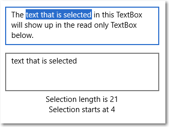
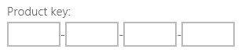
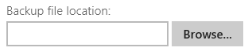
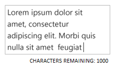

# Zone de texte
Le contrôle TextBox permet à un utilisateur de taper du texte dans une application. Il est généralement utilisé pour capturer une seule ligne de texte, mais peut être configuré pour la saisie de plusieurs lignes. Le texte s’affiche sous la forme d’un texte brut uniforme simple.

Le contrôle TextBox comporte différentes fonctionnalités destinées à simplifier la saisie de texte. Il intègre un menu contextuel familier prenant en charge la copie et le collage de texte. Le bouton Effacer tout (« X ») permet à un utilisateur de supprimer rapidement l’ensemble du texte qui a été entré. Le contrôle intègre également des fonctionnalités de vérification de l’orthographe qui sont activées par défaut.

<span class="sidebar_heading" style="font-weight: bold;">API importantes</span>

-   [**Classe TextBox**](https://msdn.microsoft.com/library/windows/apps/xaml/windows.ui.xaml.controls.textbox.aspx)
-   [**Propriété Text**](https://msdn.microsoft.com/library/windows/apps/xaml/windows.ui.xaml.controls.textbox.text.aspx)


## Est-ce le contrôle approprié ?

Utilisez un contrôle **TextBox** si vous souhaitez permettre à un utilisateur de saisir et de modifier du texte sans mise en forme, dans un formulaire par exemple. Vous pouvez utiliser la propriété [Text](https://msdn.microsoft.com/library/windows/apps/xaml/windows.ui.xaml.controls.textbox.text.aspx) pour obtenir et définir le texte d’un contrôle TextBox.

Vous avez la possibilité de définir un contrôle TextBox en lecture seule, mais il doit s’agir d’un état conditionnel temporaire. Si le texte ne doit jamais être modifiable, envisagez plutôt d’utiliser un contrôle [**TextBlock**](text-block.md).

Si vous souhaitez recueillir un mot de passe ou d’autres données confidentielles, telles qu’un numéro de sécurité sociale, utilisez un contrôle [**PasswordBox**](password-box.md). Une zone de mot de passe ressemble à une zone de saisie de texte, à la différence qu’elle affiche des puces à la place du texte entré.

Pour permettre à l’utilisateur d’entrer des termes de recherche ou pour lui présenter une liste de suggestions dans laquelle il peut effectuer un choix pendant qu’il saisit du texte, utilisez un contrôle [**AutoSuggestBox**](auto-suggest-box.md).

Pour afficher et modifier des fichiers de texte enrichi, utilisez un contrôle [**RichEditBox**](rich-edit-box.md).

Pour plus d’informations sur le choix du contrôle de texte approprié, voir l’article [Contrôles de texte](text-controls.md).

## Exemples


## Créer une zone de texte

Voici le code XAML d’une zone de texte simple avec un texte d’en-tête et un texte d’espace réservé.

```xaml
<TextBox Width="500" Header="Notes" PlaceholderText="Type your notes here"/>
```

```csharp
TextBox textBox = new TextBox();
textBox.Width = 500;
textBox.Header = "Notes";
textBox.PlaceholderText = "Type your notes here";
// Add the TextBox to the visual tree.
rootGrid.Children.Add(textBox);
```

Voici la zone de texte résultant de ce code XAML.


### Utiliser une zone de texte pour l’entrée de données dans un formulaire

Il est courant d’utiliser une zone de texte pour accepter l’entrée de données dans un formulaire, et de recourir à la propriété [Text](https://msdn.microsoft.com/library/windows/apps/xaml/windows.ui.xaml.controls.textbox.text.aspx) pour obtenir la chaîne de texte complète à partir de la zone de texte. Vous utilisez généralement un événement tel qu’un clic sur un bouton d’envoi pour accéder à la propriété Text, mais vous pouvez gérer l’événement [TextChanged](https://msdn.microsoft.com/library/windows/apps/xaml/windows.ui.xaml.controls.textbox.textchanged.aspx) ou [TextChanging](https://msdn.microsoft.com/library/windows/apps/xaml/windows.ui.xaml.controls.textbox.textchanging.aspx) si vous avez besoin d’effectuer une opération spécifique lorsque le texte change. 

Vous pouvez ajouter un contrôle [Header](https://msdn.microsoft.com/library/windows/apps/xaml/windows.ui.xaml.controls.textbox.header.aspx) (ou étiquette) et un contrôle [PlaceholderText](https://msdn.microsoft.com/library/windows/apps/xaml/windows.ui.xaml.controls.textbox.placeholdertext.aspx) (ou filigrane) à la zone de texte pour indiquer à l’utilisateur le rôle de cette zone. Si vous souhaitez personnaliser l’aspect de l’en-tête, vous pouvez définir la propriété [HeaderTemplate](https://msdn.microsoft.com/library/windows/apps/xaml/windows.ui.xaml.controls.textbox.headertemplate.aspx) au lieu de la propriété Header. Pour plus d’informations sur la conception, voir l’article *Recommandations en matière d’étiquettes*.

Vous pouvez restreindre le nombre de caractères que l’utilisateur peut taper en définissant la propriété [MaxLength](https://msdn.microsoft.com/library/windows/apps/xaml/windows.ui.xaml.controls.textbox.maxlength.aspx). Toutefois, la propriété MaxLength ne limite pas la longueur du texte collé. Si cet aspect a de l’importance pour votre application, utilisez l’événement [Paste](https://msdn.microsoft.com/library/windows/apps/xaml/windows.ui.xaml.controls.textbox.paste.aspx) pour modifier le texte collé.

La zone de texte inclut un bouton Effacer tout (« X ») qui s’affiche lorsque du texte est entré dans la zone. Quand un utilisateur clique sur le bouton « X », le texte figurant dans la zone de texte est effacé. Ce bouton apparaît comme suit.


Le bouton Effacer tout s’affiche uniquement pour les zones de texte modifiables d’une seule ligne qui contiennent du texte et qui présentent le focus. 

Le bouton Effacer tout n’apparaît pas dans l’un des cas suivants :
- **IsReadOnly** présente la valeur **true**.
- **AcceptsReturn** présente la valeur **true**.
- **TextWrap** présente une valeur différente de **NoWrap**.

### Configurer une zone de texte en lecture seule

Vous pouvez configurer une zone de texte comme étant en lecture seule en définissant la propriété [IsReadOnly](https://msdn.microsoft.com/library/windows/apps/xaml/windows.ui.xaml.controls.textbox.isreadonly.aspx) sur la valeur **true**. En règle générale, vous activez/désactivez cette propriété dans le code de votre application en fonction de conditions applicables à cette dernière. Si vous avez besoin que le texte soit toujours en lecture seule, envisagez plutôt d’utiliser un contrôle TextBlock.

Pour configurer le contrôle TextBox en lecture seule, définissez la propriété IsReadOnly sur la valeur « true ». Par exemple, vous pouvez avoir besoin de définir un contrôle TextBox ne permettant à un utilisateur d’entrer des commentaires que sous certaines conditions. Vous pouvez alors configurer le contrôle TextBox comme étant en lecture seule jusqu’à ce que ces conditions soient remplies. Si vous souhaitez simplement afficher du texte, envisagez plutôt d’utiliser un contrôle TextBlock ou RichTextBlock.

Une zone de texte en lecture seule présente le même aspect qu’une zone de texte en lecture/écriture, ce qui peut dérouter l’utilisateur. Un utilisateur peut sélectionner et copier du texte.
IsEnabled


### Activer la saisie multiligne

Deux propriétés vous permettent d’indiquer si le contrôle TextBox peut ou non afficher du texte sur plusieurs lignes. En règle générale, vous définissez ces deux propriétés pour configurer une zone de texte multiligne.
- Pour que la zone de texte autorise et afficher les caractères de saut de ligne ou de retour chariot, définissez la propriété [**AcceptsReturn**](https://msdn.microsoft.com/library/windows/apps/xaml/windows.ui.xaml.controls.textbox.acceptsreturn.aspx) sur **true**.
- Pour activer la fonctionnalité de renvoi de texte à la ligne, définissez la propriété [**TextWrapping**](https://msdn.microsoft.com/library/windows/apps/xaml/windows.ui.xaml.controls.textbox.textwrapping.aspx) sur **Wrap**. Le texte est alors automatiquement renvoyé à la ligne lorsqu’il atteint le bord de la zone de texte, indépendamment des caractères séparateurs de ligne.

> **Remarque** &nbsp;&nbsp;Les contrôles TextBox et RichEditBox ne prennent pas en charge la valeur **WrapWholeWords** pour leur propriété TextWrapping. Si vous tentez d’utiliser WrapWholeWords comme valeur pour TextBox.TextWrapping ou pour RichEditBox.TextWrapping, une exception d’argument non valide sera levée.

À mesure que l’utilisateur saisit du texte dans un contrôle TextBox multiligne, la hauteur de ce dernier s’accroît progressivement, sauf si le contrôle est restreint par ses propriétés [Height](https://msdn.microsoft.com/library/windows/apps/xaml/windows.ui.xaml.frameworkelement.height.aspx) ou [MaxHeight](https://msdn.microsoft.com/library/windows/apps/xaml/windows.ui.xaml.frameworkelement.maxheight.aspx) ou par un conteneur parent. Vous devez vérifier qu’une zone de texte multiligne ne dépasse pas les limites de sa zone visible, et restreindre son extension dans le cas contraire. Nous vous recommandons de configurer systématiquement une zone de texte multiligne sur une hauteur appropriée, et de ne pas autoriser l’augmentation progressive de cette hauteur à mesure que l’utilisateur tape du texte. 

Le défilement à l’aide d’une roulette de défilement ou d’une interaction tactile est automatiquement activé s’il y a lieu. Toutefois, les barres de défilement verticales ne sont pas visibles par défaut. Vous pouvez afficher les barres de défilement verticales en définissant [ScrollViewer.VerticalScrollBarVisibility](https://msdn.microsoft.com/library/windows/apps/xaml/windows.ui.xaml.controls.scrollviewer.verticalscrollbarvisibility.aspx) sur **Auto** sur le contrôle ScrollViewer incorporé, comme indiqué ci-après. 

```xaml
<TextBox AcceptsReturn="True" TextWrapping="Wrap" 
         MaxHeight="172" Width="300" Header="Description"
         ScrollViewer.VerticalScrollBarVisibility="Auto"/>
```

```csharp
TextBox textBox = new TextBox();
textBox.AcceptsReturn = true;
textBox.TextWrapping = TextWrapping.Wrap;
textBox.MaxHeight = 172;
textBox.Width = 300;
textBox.Header = "Description";
ScrollViewer.SetVerticalScrollBarVisibility(textBox, ScrollBarVisibility.Auto);
```

Voici à quoi ressemble la zone de texte après un ajout de texte.


### Mettre en forme l’affichage du texte

Pour aligner le texte figurant dans une zone de texte, utilisez la propriété [TextAlignment](). Pour aligner la zone de texte dans la disposition de la page, utilisez les propriétés [HorizontalAlignment](https://msdn.microsoft.com/library/windows/apps/xaml/windows.ui.xaml.frameworkelement.horizontalalignment.aspx) et [VerticalAlignment](https://msdn.microsoft.com/library/windows/apps/xaml/windows.ui.xaml.frameworkelement.verticalalignment.aspx).

Bien que le contrôle TextBox prenne uniquement en charge du texte sans mise en forme, vous pouvez personnaliser la façon dont le texte s’affiche dans la zone de texte pour l’adapter à vos besoins. Vous pouvez ainsi modifier l’aspect du texte en définissant les propriétés [Control](https://msdn.microsoft.com/library/windows/apps/xaml/windows.ui.xaml.controls.control.aspx) standard, comme [FontFamily](https://msdn.microsoft.com/library/windows/apps/xaml/windows.ui.xaml.controls.control.fontfamily.aspx), [FontSize](https://msdn.microsoft.com/library/windows/apps/xaml/windows.ui.xaml.controls.control.fontsize.aspx), [FontStyle](https://msdn.microsoft.com/library/windows/apps/xaml/windows.ui.xaml.controls.control.fontstyle.aspx), [Background](https://msdn.microsoft.com/library/windows/apps/xaml/windows.ui.xaml.controls.control.background.aspx), [Foreground](https://msdn.microsoft.com/library/windows/apps/xaml/windows.ui.xaml.controls.control.foreground.aspx) et [CharacterSpacing](https://msdn.microsoft.com/library/windows/apps/xaml/windows.ui.xaml.controls.control.characterspacing.aspx). Ces propriétés affectent uniquement la façon dont le texte s’affiche localement dans la zone de texte. Par conséquent, si vous deviez copier et coller ce texte dans un contrôle de texte enrichi par exemple, aucune mise en forme ne serait appliquée.

Cet exemple présente un contrôle TextBox en lecture seule dont plusieurs propriétés sont définies pour personnaliser l’apparence du texte.

```xaml
<TextBox Text="Sample Text" IsReadOnly="True" 
         FontFamily="Verdana" FontSize="24"
         FontWeight="Bold" FontStyle="Italic" 
         CharacterSpacing="200" Width="300"
         Foreground="Blue" Background="Beige"/>
```

```csharp
TextBox textBox = new TextBox();
textBox.Text = "Sample Text";
textBox.IsReadOnly = true;
textBox.FontFamily = new FontFamily("Verdana");
textBox.FontSize = 24;
textBox.FontWeight = Windows.UI.Text.FontWeights.Bold;
textBox.FontStyle = Windows.UI.Text.FontStyle.Italic;
textBox.CharacterSpacing = 200;
textBox.Width = 300;
textBox.Background = new SolidColorBrush(Windows.UI.Colors.Beige);
textBox.Foreground = new SolidColorBrush(Windows.UI.Colors.Blue);
// Add the TextBox to the visual tree.
rootGrid.Children.Add(textBox);
```

La zone de texte résultante ressemble à ce qui suit.


### Modifier le menu contextuel

Par défaut, les commandes figurant dans le menu contextuel de la zone de texte dépendent de l’état de cette dernière. Par exemple, le menu contextuel peut présenter les commandes ci-après lorsque la zone de texte est modifiable.

Commande | Condition d’affichage
------- | -------------
Copier | L’utilisateur a sélectionné du texte. 
Couper | L’utilisateur a sélectionné du texte. 
Coller | Le Presse-papiers contient du texte. 
Tout sélectionner | Le contrôle TextBox contient du texte. 
Annuler | L’utilisateur a modifié du texte. 

Pour modifier les commandes figurant dans le menu contextuel, gérez l’événement [ContextMenuOpening](https://msdn.microsoft.com/library/windows/apps/xaml/windows.ui.xaml.controls.textbox.contextmenuopening.aspx). Pour découvrir un exemple de la procédure à suivre, voir le scénario 2 de l’[exemple de menu contextuel](http://go.microsoft.com/fwlink/p/?linkid=234891). Pour plus d’informations sur la conception, voir l’article Recommandations en matière de menus contextuels.

### Sélectionner, copier et coller du texte

Vous pouvez obtenir ou définir le texte sélectionné dans un contrôle TextBox à l’aide de la propriété [SelectedText](https://msdn.microsoft.com/library/windows/apps/xaml/windows.ui.xaml.controls.textbox.selectedtext.aspx). Pour manipuler la sélection de texte, utilisez les propriétés [SelectionStart](https://msdn.microsoft.com/library/windows/apps/xaml/windows.ui.xaml.controls.textbox.selectionstart.aspx) et [SelectionLength](https://msdn.microsoft.com/library/windows/apps/xaml/windows.ui.xaml.controls.textbox.selectionlength.aspx), ainsi que les méthodes [Select](https://msdn.microsoft.com/library/windows/apps/xaml/windows.ui.xaml.controls.textbox.select.aspx) et [SelectAll](https://msdn.microsoft.com/library/windows/apps/xaml/windows.ui.xaml.controls.textbox.selectall.aspx). Pour exécuter une action spécifique lorsque l’utilisateur sélectionne ou désélectionne du texte, gérez l’événement [SelectionChanged](https://msdn.microsoft.com/library/windows/apps/xaml/windows.ui.xaml.controls.textbox.selectionchanged.aspx). Vous pouvez modifier la couleur de mise en surbrillance du texte sélectionné en définissant la propriété [SelectionHighlightColor](https://msdn.microsoft.com/library/windows/apps/xaml/windows.ui.xaml.controls.textbox.selectionhighlightcolor.aspx).

Le contrôle TextBox prend en charge les opérations de copie et de collage par défaut. Vous pouvez appliquer une gestion personnalisée de l’événement [Paste](https://msdn.microsoft.com/library/windows/apps/xaml/windows.ui.xaml.controls.textbox.paste.aspx) aux contrôles de texte modifiables de votre application. Par exemple, vous pouvez supprimer les sauts de ligne d’une adresse multiligne lorsque vous collez cette dernière dans une zone de recherche d’une seule ligne. Vous pouvez également vérifier la longueur du texte collé et avertir l’utilisateur si elle dépasse la longueur maximale pouvant être enregistrée dans une base de données. Pour plus d’informations et d’exemples, voir l’événement [Paste](https://msdn.microsoft.com/library/windows/apps/xaml/windows.ui.xaml.controls.textbox.paste.aspx).

Vous trouverez ci-dessous un exemple d’utilisation de ces propriétés et méthodes. Lorsque vous sélectionnez du texte dans la première zone de texte, ce texte s’affiche dans la seconde zone de texte, qui est en lecture seule. Les valeurs des propriétés [SelectionLength](https://msdn.microsoft.com/library/windows/apps/xaml/windows.ui.xaml.controls.textbox.selectionlength.aspx) et [SelectionStart](https://msdn.microsoft.com/library/windows/apps/xaml/windows.ui.xaml.controls.textbox.selectionstart.aspx) apparaissent sous la forme de deux blocs de texte. Cette opération est effectuée à l’aide de l’événement [SelectionChanged](https://msdn.microsoft.com/library/windows/apps/xaml/windows.ui.xaml.controls.textbox.selectionchanged.aspx).

```xaml
<StackPanel>
   <TextBox x:Name="textBox1" Height="75" Width="300" Margin="10"
         Text="The text that is selected in this TextBox will show up in the read only TextBox below." 
         TextWrapping="Wrap" AcceptsReturn="True"
         SelectionChanged="TextBox1_SelectionChanged" />
   <TextBox x:Name="textBox2" Height="75" Width="300" Margin="5" 
         TextWrapping="Wrap" AcceptsReturn="True" IsReadOnly="True"/>
   <TextBlock x:Name="label1" HorizontalAlignment="Center"/>
   <TextBlock x:Name="label2" HorizontalAlignment="Center"/>
</StackPanel>
```

```csharp
private void TextBox1_SelectionChanged(object sender, RoutedEventArgs e)
{
    textBox2.Text = textBox1.SelectedText;
    label1.Text = "Selection length is " + textBox1.SelectionLength.ToString();
    label2.Text = "Selection starts at " + textBox1.SelectionStart.ToString();
}
```

Voici le résultat de ce code :



## Choisir le clavier adapté à votre contrôle de texte

Pour faciliter la saisie de données par les utilisateurs au moyen du clavier tactile, ou clavier virtuel, définissez l’étendue des entrées du contrôle de texte de façon qu’elle corresponde au type de données attendu de la part de l’utilisateur.

Le clavier tactile permet d’entrer du texte lorsque l’application est exécutée sur un appareil disposant d’un écran tactile. Le clavier tactile est appelé lorsque l’utilisateur appuie sur un champ d’entrée modifiable, tel qu’un contrôle TextBox ou RichEditBox. Vous pouvez nettement faciliter et accélérer la saisie de données par les utilisateurs dans votre application en définissant l’étendue des entrées du contrôle de texte afin qu’elle corresponde au type de données attendu de la part de l’utilisateur. L’étendue des entrées fournit au système une indication sur le type d’entrée de texte attendu par le contrôle, afin que le système puisse fournir une disposition de clavier tactile spécialisée pour le type d’entrée.

Par exemple, si une zone de texte est utilisée uniquement pour la saisie d’un code confidentiel à 4 chiffres, définissez la propriété [InputScope](https://msdn.microsoft.com/library/windows/apps/xaml/windows.ui.xaml.controls.textbox.inputscope.aspx) sur **Number**. Cela indique au système qu’il doit afficher la disposition du pavé numérique, ce qui facilite la saisie d’un code confidentiel par l’utilisateur.

> **Important** &nbsp;&nbsp;L’étendue des entrées n’entraîne l’exécution d’aucune validation des entrées et n’empêche pas l’utilisateur de saisir des données par le biais d’un clavier matériel ou d’un autre dispositif du même ordre. Vous restez responsable de la validation d’une entrée dans votre code, si nécessaire.

Les autres propriétés qui affectent le clavier tactile sont [IsSpellCheckEnabled](https://msdn.microsoft.com/library/windows/apps/xaml/windows.ui.xaml.controls.textbox.isspellcheckenabled.aspx), [IsTextPredictionEnabled](https://msdn.microsoft.com/library/windows/apps/xaml/windows.ui.xaml.controls.textbox.istextpredictionenabled.aspx) et [PreventKeyboardDisplayOnProgrammaticFocus](https://msdn.microsoft.com/library/windows/apps/xaml/windows.ui.xaml.controls.textbox.preventkeyboarddisplayonprogrammaticfocus.aspx). (La propriété IsSpellCheckEnabled a également une incidence sur le contrôle TextBox lorsqu’un clavier matériel est utilisé.) 

Pour plus d’informations et d’exemples, voir [Utiliser l’étendue des entrées pour modifier le clavier tactile]() et la documentation relative aux propriétés.

## Recommandations

-   Utilisez un texte d’étiquette ou d’espace réservé si l’objectif de la zone de texte n’est pas clair. Une étiquette reste toujours visible, qu’il y ait ou non une valeur dans la zone de saisie de texte. Le texte d’espace réservé s’affiche initialement dans la zone de saisie de texte, mais disparaît après qu’une valeur a été entrée.
-   Attribuez à la zone de texte une largeur appropriée pour la plage de valeurs qui peuvent être entrées. La longueur des mots varie selon la langue. Par conséquent, tenez compte de la localisation si vous destinez votre application au marché international.
-   Une zone de saisie de texte se compose généralement d’une seule ligne (`TextWrap = "NoWrap"`). Si les utilisateurs doivent entrer ou modifier une longue chaîne de caractères, utilisez une zone de saisie de texte multiligne (`TextWrap = "Wrap"`).
-   En règle générale, une zone de saisie de texte est utilisée pour du texte modifiable. Vous pouvez toutefois utiliser une zone de saisie de texte en lecture seule. Le contenu de la zone pourra être lu, sélectionné et copié, mais pas modifié.
-   Pour réduire l’encombrement de l’écran, vous pouvez choisir d’afficher certaines zones de saisie de texte uniquement lorsque la case de contrôle associée est cochée. Vous pouvez également lier l’état activé d’une zone de saisie de texte à un contrôle de type case à cocher.
-   Déterminez comment doit se comporter une zone de saisie de texte quand l’utilisateur appuie dessus alors qu’elle contient déjà une valeur. Le comportement par défaut prévoit la modification de la valeur plutôt que son remplacement. Le point d’insertion est inséré entre deux mots et aucune sélection de texte n’est faite. Si la valeur d’une zone de saisie de texte a toutes les chances d’être remplacée par l’utilisateur, modifiez le comportement de la zone afin que tout le texte existant soit sélectionné lorsque le contrôle reçoit le focus, et que la sélection soit remplacée par la nouvelle valeur entrée.

**Zones de saisie d’une seule ligne**

-   Utilisez plusieurs zones de texte d’une ligne pour la saisie de plusieurs éléments de texte de petite taille. Si les zones de texte sont de nature apparentées, regrouper-les.

-   Faites en sorte que la taille des zones de texte d’une ligne soit légèrement supérieure à l’entrée la plus longue prévue. Si cette opération élargit le contrôle de manière excessive, divisez ce dernier en deux contrôles. Par exemple, vous pouvez fractionner une entrée d’adresse unique sous la forme « Ligne d’adresse 1 » et « Ligne d’adresse 2 ».
-   Définissez un nombre maximal de caractères pouvant être entrés. Si la source de données de stockage n’accepte pas les chaînes d’entrée longues, limitez la longueur des entrées et utilisez une fenêtre contextuelle de validation pour indiquer à l’utilisateur qu’il a atteint la limite.
-   Utilisez des contrôles de saisie de texte d’une ligne pour recueillir de petits éléments de texte.
 
    L’exemple suivant montre une zone de texte d’une ligne destinée à saisir une réponse à une question de sécurité. La réponse devant être brève, il convient d’utiliser ici une zone de texte d’une seule ligne.

    
    
-   Utilisez un ensemble de contrôles de saisie de texte d’une ligne courts et de taille fixe pour entrer des données ayant un format spécifique.

    

-   Utilisez un contrôle de saisie de texte d’une ligne sans contraintes pour entrer ou modifier des chaînes, en association avec un bouton de commande qui permette aux utilisateurs de sélectionner les valeurs valides.

    


**Zones de saisie de texte multiligne**

-   Quand vous créez une zone de texte enrichi, proposez des boutons de style et implémentez leurs actions.
-   Utilisez une police cohérente avec le style de votre application.
-   Faites en sorte que la hauteur du contrôle de texte soit suffisante pour recevoir des entrées classiques.
-   Pour la saisie de longues chaînes de texte dont le nombre de mots ou de caractères est limité, utilisez une zone de texte brut et ajoutez un compteur en temps réel qui affiche à l’utilisateur le nombre de caractères ou de mots autorisés restants avant d’atteindre la limite. Vous devez créer le compteur vous-même. Placez-le sous la zone de texte en question et mettez-le à jour de façon dynamique à mesure que l’utilisateur entre chaque mot ou caractère.

    

-   Ne laissez pas les contrôles de saisie de texte s’allonger en hauteur lorsque les utilisateurs entrent le texte.
-   N’utilisez pas de zone de texte de plusieurs lignes quand les utilisateurs n’ont besoin que d’une seule ligne.
-   N’utilisez pas de contrôle de texte enrichi si un contrôle de texte brut est approprié.


## Articles connexes

[Contrôles de texte](text-controls.md)

**Pour les concepteurs**
- [Recommandations en matière de vérification orthographique](spell-checking-and-prediction.md)
- [Ajout de la fonctionnalité de recherche](https://msdn.microsoft.com/library/windows/apps/hh465231)
- [Recommandations en matière de saisie de texte](text-controls.md)

**Pour les développeurs (XAML)**
- [**Classe TextBox**](https://msdn.microsoft.com/library/windows/apps/br209683)
- [**Classe PasswordBox Windows.UI.Xaml.Controls**](https://msdn.microsoft.com/library/windows/apps/br227519)


**Pour les développeurs (autres)**
- [Propriété String.Length](https://msdn.microsoft.com/library/system.string.length(v=vs.110).aspx)


<!--HONumber=Jun16_HO4-->


