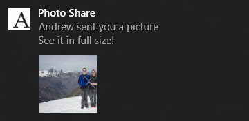
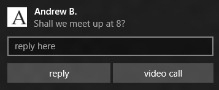

# Notifications toast adaptatives et interactives

<link rel="stylesheet" href="https://az835927.vo.msecnd.net/sites/uwp/Resources/css/custom.css"> 

Les notifications toast adaptatives et interactives vous permettent de créer des notifications contextuelles flexibles présentant davantage de contenu, ainsi que des images incluses et une interaction utilisateur facultatives.

Le modèle de notifications toast adaptatives et interactives comporte les mises à jour ci-après par rapport au catalogue de modèles de notifications toast hérité :

-   possibilité d’inclure des boutons et des entrées sur les notifications ;
-   trois différents types d’activations pour la notification toast principale et pour chaque action ;
-   possibilité de créer une notification pour certains scénarios, comprenant les alarmes, les rappels et les appels entrants.

**Remarque** Pour découvrir les modèles hérités de Windows8.1 et de Windows Phone8.1, voir le [catalogue de modèles de notifications toast hérité](https://msdn.microsoft.com/library/windows/apps/hh761494).

 

## Structure de notification toast


Les notifications toast sont construites en XML et comprennent généralement les éléments clés suivants:

-   &lt;visual&gt; indique le contenu visible par les utilisateurs, incluant le texte et les images
-   &lt;actions&gt; contient les boutons/entrées que le développeur souhaite ajouter au sein de la notification
-   &lt;audio&gt; spécifie le son émis lorsque la notification apparaît

Voici un exemple de code:

```XML
<toast launch="app-defined-string">
  <visual>
    <binding template="ToastGeneric">
      <text>Sample</text>
      <text>This is a simple toast notification example</text>
      <image placement="AppLogoOverride" src="oneAlarm.png" />
    </binding>
  </visual>
  <actions>
    <action content="check" arguments="check" imageUri="check.png" />
    <action content="cancel" arguments="cancel" />
  </actions>
  <audio src="ms-winsoundevent:Notification.Reminder"/>
</toast>
```

Et voici une représentation visuelle de la structure:


### Éléments visuels

L’élément «visual» doit contenir très exactement un seul élément de liaison («binding») intégrant le contenu visuel de la notification toast.

Les notifications par vignette dans les applications de plateforme Windows universelle (UWP) prennent en charge plusieurs modèles reposant sur différentes tailles de vignette. Toutefois, les notifications toast n’emploient qu’un seul nom de modèle: **ToastGeneric**. L’utilisation d’un seul nom de modèle signifie plusieurs choses:

-   Vous pouvez modifier le contenu des notifications toast, par exemple en ajoutant une autre ligne de texte ou une image incluse ou en modifiant le comportement de l’image miniature pour qu’elle affiche autre chose que l’icône de l’application, sans avoir besoin de modifier la totalité du modèle ni risquer de créer une charge utile incorrecte découlant d’une incohérence entre le nom du modèle et le contenu.
-   Vous pouvez utiliser le même code pour construire la charge utile d’une **notification toast** ciblant différents types d’appareils Microsoft Windows, tels que les téléphones, les tablettes, les PC et les systèmes Xbox One. Chacun de ces appareils acceptera la notification et la présentera à l’utilisateur conformément à ses stratégies d’interface utilisateur avec les affordances visuelles et le modèle d’interaction appropriés.

Pour découvrir tous les attributs pris en charge dans la section « visual » et tous les éléments enfants de cette dernière, voir la section « Schéma » ci-dessous. Pour consulter d’autres exemples, voir la section «Exemples XML» ci-après.

### Élément &lt;actions&gt;

Dans les applications UWP, vous pouvez ajouter des boutons et d’autres entrées à vos notifications toast, ce qui permet aux utilisateurs d’effectuer d’autres opérations à l’extérieur de l’application. Vous spécifiez ces actions sous l’élément &lt;actions&gt; en utilisant l’un des deux types d’actions possibles:

-   &lt;action&gt; Cet élément apparaît sous la forme d’un bouton sur les appareils de bureau et sur les appareils mobiles. Vous pouvez spécifier jusqu’à cinq actions personnalisées ou système dans une notification toast.
-   &lt;input&gt; Cet élément permet aux utilisateurs d’entrer des données, telles qu’une réponse rapide à un message, ou de sélectionner une option dans un menu déroulant.

Les éléments &lt;action&gt; et &lt;input&gt; sont tous deux adaptatifs dans la famille d’appareils Windows. Par exemple, sur les appareils mobiles ou de bureau, un élément &lt;action&gt; correspond à un bouton sur lequel l’utilisateur doit appuyer ou cliquer. Un élément &lt;input&gt; de type texte définit une zone permettant aux utilisateurs d’entrer du texte à l’aide d’un clavier physique ou visuel. Ces éléments s’adapteront également aux futurs scénarios d’interaction, tels qu’une action annoncée par la voix ou une entrée de texte dictée.

Quand une action est exécutée par l’utilisateur, vous pouvez effectuer l’une des opérations suivantes en spécifiant l’attribut [**ActivationType**](https://msdn.microsoft.com/library/windows/desktop/dn408447) à l’intérieur de l’élément &lt;action&gt;:

-   activation de l’application au premier plan à l’aide d’un argument propre à l’action qui permet d’accéder à une page ou à un contexte spécifiques ;
-   activation de la tâche en arrière-plan de l’application sans affecter l’utilisateur ;
-   activation d’une autre application par le biais d’un lancement par protocole ;
-   spécification d’une action système à exécuter. Les actions système actuellement disponibles sont la répétition et le masquage d’une alarme ou d’un rappel planifiés et sont décrites en détail dans l’une des sections ci-après.

Pour découvrir tous les attributs pris en charge dans la section « visual » et tous les éléments enfants de cette dernière, voir la section « Schéma » ci-dessous. Pour consulter d’autres exemples, voir la section «Exemples XML» ci-après.

### Élément &lt;audio&gt;

Pour l’instant, les sons personnalisés ne sont pas pris en charge dans les applications UWP qui ciblent la Plate-forme Desktop; à la place, vous pouvez choisir un son dans la liste ms-winsoundevents pour votre application destinée aux appareils de bureau. Les applications UWP ciblant les plateformes mobiles prennent en charge aussi bien les sons ms-winsoundevents que les sons personnalisés aux formats suivants :

-   ms-appx:///
-   ms-appdata:///

Pour plus d’informations sur les éléments audio dans les notifications toast, voir la [page de schéma audio](https://msdn.microsoft.com/library/windows/apps/br230842) qui inclut la liste complète des sons ms-winsoundevents.

## Alarmes, rappels et appels entrants


Vous pouvez utiliser des notifications toast pour les alarmes, les rappels et les appels entrants. Ces notifications toast spéciales ont une apparence semblable à celle des notifications toast standard, mais présentent certains motifs et éléments d’interface utilisateur personnalisés basés sur un scénario :

-   Une notification toast de rappel reste affichée à l’écran jusqu’à ce que l’utilisateur la masque ou exécute une action. Sur Windows Mobile, les notifications toast de rappel s’affichent également sous leur forme pré-développée.
-   Outre le fait de partager les comportements ci-dessus avec les notifications de rappel, les notifications d’alarme émettent automatiquement le son en boucle.
-   Les notifications d’appel entrant s’affichent en plein écran sur les appareils Windows Mobile. Ce résultat est obtenu par la spécification de l’attribut « scenario » à l’intérieur de l’élément racine d’une notification toast, c’est-à-dire &lt;toast&gt; : &lt;toast scenario=" { default | alarm | reminder | incomingCall } " &gt;

## Exemples XML


**Remarque** Les captures d’écran de notification toast correspondant à ces exemples ont été effectuées à partir d’une application exécutée sur un appareil de bureau. Sur les appareils mobiles, une notification toast peut s’afficher sous sa forme réduite en présentant une poignée dans sa partie inférieure pour la développer.

 

**Notification avec un contenu visuel enrichi**

Cet exemple illustre comment inclure plusieurs lignes de texte, une petite image facultative pour remplacer le logo de l’application et une miniature de l’image incluse facultative.

```XML
<toast launch="app-defined-string">
  <visual>
<binding template="ToastGeneric">
    <text>Photo Share</text>
      <text>Andrew sent you a picture</text>
      <text>See it in full size!</text>
      <image placement="appLogoOverride" src="A.png" />
    <image placement="inline" src="hiking.png" />
    </binding>
  </visual>
</toast>
```



 

**Notification avec des actions, exemple1**

Cet exemple illustre...

```XML
<toast launch="app-defined-string">
  <visual>
    <binding template="ToastGeneric">
      <text>Microsoft Company Store</text>
      <text>New Halo game is back in stock!</text>
      <image placement="appLogoOverride" src="A.png" />
    </binding>
  </visual>
  <actions>
    <action activationType="foreground" content="see more details" arguments="details" imageUri="check.png"/>
    <action activationType="background" content="remind me later" arguments="later" imageUri="cancel.png"/>
  </actions>
</toast>
```


 

**Notification avec des actions, exemple2**

Cet exemple illustre...

```XML
<toast launch="app-defined-string">
  <visual>
    <binding template="ToastGeneric">
      <text>Cortana</text>
      <text>We noticed that you are near Wasaki.</text>
      <text>Thomas left a 5 star rating after his last visit, do you want to try?</text>
      <image placement="appLogoOverride" src="A.png" />
    </binding>
  </visual>
  <actions>
    <action activationType="foreground" content="reviews" arguments="reviews" />
    <action activationType="protocol" content="show map" arguments="bingmaps:?q=sushi" />
  </actions>
</toast>
```


 

**Notification avec une entrée de texte et des actions, exemple1**

Cet exemple illustre...

```XML
<toast launch="developer-defined-string">
  <visual>
    <binding template="ToastGeneric">
      <text>Andrew B.</text>
      <text>Shall we meet up at 8?</text>
      <image placement="appLogoOverride" src="A.png" />
    </binding>
  </visual>
  <actions>
    <input id="message" type="text" placeHolderContent="reply here" />
    <action activationType="background" content="reply" arguments="reply" />
    <action activationType="foreground" content="video call" arguments="video" />
  </actions>
</toast>
```



 

**Notification avec une entrée de texte et des actions, exemple2**

Cet exemple illustre...

```XML
<toast launch="developer-defined-string">
  <visual>
    <binding template="ToastGeneric">
      <text>Andrew B.</text>
      <text>Shall we meet up at 8?</text>
      <image placement="appLogoOverride" src="A.png" />
    </binding>
  </visual>
  <actions>
    <input id="message" type="text" placeHolderContent="reply here" />
    <action activationType="background" content="reply" arguments="reply" imageUri="send.png" hint-inputId="message"/>
  </actions>
</toast>
```


 

**Notification avec une entrée de sélection et des actions**

Cet exemple illustre...

```XML
<toast launch="developer-defined-string">
  <visual>
    <binding template="ToastGeneric">
      <text>Spicy Heaven</text>
      <text>When do you plan to come in tomorrow?</text>
      <image placement="appLogoOverride" src="A.png" />
    </binding>
  </visual>
  <actions>
    <input id="time" type="selection" defaultInput="2" >
  <selection id="1" content="Breakfast" />
  <selection id="2" content="Lunch" />
  <selection id="3" content="Dinner" />
    </input>
    <action activationType="background" content="Reserve" arguments="reserve" />
    <action activationType="background" content="Call Restaurant" arguments="call" />
  </actions>
</toast>
```


 

**Notification de rappel**

Cet exemple illustre...

```XML
<toast scenario="reminder" launch="developer-pre-defined-string">
  <visual>
    <binding template="ToastGeneric">
      <text>Adam&#39;s Hiking Camp</text>
      <text>You have an upcoming event for this Friday!</text>
      <text>RSVP before it"s too late.</text>
      <image placement="appLogoOverride" src="A.png" />
      <image placement="inline" src="hiking.png" />
    </binding>
  </visual>
  <actions>
    <action activationType="background" content="RSVP" arguments="rsvp" />
    <action activationType="background" content="Reminder me later" arguments="later" />
  </actions>
</toast>
```


 

## Exemples d’activation


Comme indiqué ci-dessus, le corps et les actions de la notification toast peuvent activer des applications de différentes façons. L’exemple ci-dessous illustre comment gérer différents types d’activations à partir du corps et/ou des actions d’une notification toast.

**Premier plan**

Dans ce scénario, une application utilise l’activation de premier plan pour répondre à une action au sein d’une notification toast interactive en lançant l’application et en accédant au contenu approprié.

Auparavant, l’activation à partir des notifications toast appelait OnLaunched(). Dans Windows 10, les notifications toast possèdent leur propre type d’activation et appellent OnActivated().

```
async protected override void OnActivated(IActivatedEventArgs args)
{
        //Initialize your app if it&#39;s not yet initialized;
    //Find out if this is activated from a toast;
    If (args.Kind == ActivationKind.ToastNotification)
    {
                //Get the pre-defined arguments and user inputs from the eventargs;
        var toastArgs = args as ToastNotificationActivatedEventArgs;
        var arguments = toastArgs.Arguments;
        var input = toastArgs.UserInput["1"]; 
}
     
    //...
}
```

**Arrière-plan**

Dans ce scénario, une application utilise une tâche en arrière-plan pour gérer une action à l’intérieur d’une notification toast interactive. Le code ci-après illustre comment déclarer cette tâche en arrière-plan pour la gestion des activations de notification toast dans le manifeste de votre application, et comment obtenir les arguments à partir de l’action et des entrées utilisateur lorsque les utilisateurs cliquent sur les boutons.

```
<!-- Manifest Declaration -->
<!-- A new task type toastNotification is added -->
<Extension Category = "windows.backgroundTasks" 
EntryPoint = "Tasks.BackgroundTaskClass" >
  <BackgroundTasks>
    <Task Type="systemEvent" />
  </BackgroundTasks>
</Extension>
```

```
namespace ToastNotificationTask
{
    public sealed class ToastNotificationBackgroundTask : IBackgroundTask
    {
        public void Run(IBackgroundTaskInstance taskInstance)
        {
        //Inside here developer can retrieve and consume the pre-defined 
        //arguments and user inputs;
        var details = taskInstance.TriggerDetails as ToastNotificationActionTriggerDetail;
        var arguments = details.Arguments;
        var input = details.Input.Lookup("1");

            // ...
        }        
    }
}
```

## Schémas : &lt;visual&gt; et &lt;audio&gt;


Dans les schémas ci-après, un suffixe «?» signifie qu’un attribut est facultatif.

```
<toast launch? duration? activationType? scenario? >
    <visual version? lang? baseUri? addImageQuery? >
        <binding template? lang? baseUri? addImageQuery? >
            <text lang? >content</text>
            <text />
            <image src placement? alt? addImageQuery? hint-crop? />
        </binding>
    </visual>
    <audio src? loop? silent? />
    <actions>
    </actions>
</toast>
```

**Attributs dans &lt;toast&gt;**

launch?

-   launch? = chaîne
-   Il s’agit d’un attribut facultatif.
-   Chaîne transmise à l’application lorsqu’elle est activée par la notification toast.
-   Selon la valeur d’activationType, cette valeur peut être reçue par l’application au premier plan, à l’intérieur de la tâche en arrière-plan ou par une autre application lancée par protocole à partir de l’application d’origine.
-   L’application définit le format et le contenu de cette chaîne pour son propre usage.
-   Lorsque l’utilisateur appuie ou clique sur la notification toast pour lancer l’application qui lui est associée, la chaîne de lancement précise le contexte à l’application pour permettre à cette dernière de présenter à l’utilisateur une vue adaptée au contenu de la notification toast plutôt qu’une vue par défaut.
-   Si l’activation découle d’un clic par l’utilisateur sur une action plutôt que dans le corps de la notification toast, le développeur récupère les « arguments » prédéfinis dans cette balise &lt;action&gt; à la place de la chaîne « launch » prédéfinie dans la balise &lt;toast&gt;.

duration?

-   duration? = "short|long"
-   Il s’agit d’un attribut facultatif. La valeur par défaut est « short ».
-   Cet attribut n’est proposé que pour des scénarios spécifiques et pour la base de données de compatibilité des applications (AppCompat). Vous n’en avez plus besoin pour le scénario d’alarme.
-   Nous vous déconseillons d’utiliser cette propriété.

activationType?

-   activationType? = "foreground | background | protocol | system"
-   Il s’agit d’un attribut facultatif.
-   La valeur par défaut est « foreground ».

scenario?

-   scenario? = "default | alarm | reminder | incomingCall"
-   Il s’agit d’un attribut facultatif, dont la valeur par défaut est « default ».
-   Vous n’en avez pas besoin, sauf si votre scénario consiste à présenter une alarme, un rappel ou un appel entrant.
-   Ne l’utilisez pas dans le seul but d’assurer la persistance de votre notification à l’écran.

**Attributs dans &lt;visual&gt;**

version?

-   version? = nonNegativeInteger
-   Cet attribut n’est pas nécessaire, car le contrôle de version sera déconseillé dans la section &lt;visual&gt;. Nous vous proposerons prochainement un nouveau modèle de contrôle de version que vous spécifierez à partir d’une hiérarchie plus élevée en cas de besoin.

lang?

-   Pour plus de détails sur cet attribut facultatif, voir [cet article concernant le schéma des éléments](https://msdn.microsoft.com/library/windows/apps/br230847).

baseUri?

-   Pour plus de détails sur cet attribut facultatif, voir [cet article concernant le schéma des éléments](https://msdn.microsoft.com/library/windows/apps/br230847).

addImageQuery?

-   Pour plus de détails sur cet attribut facultatif, voir [cet article concernant le schéma des éléments](https://msdn.microsoft.com/library/windows/apps/br230847).

**Attributs dans &lt;binding&gt;**

template?

-   \[Important\] template? = "ToastGeneric"
-   Si vous avez recours à l’une des nouvelles fonctionnalités des notifications adaptatives et interactives, vérifiez que vous commencez par utiliser le modèle « ToastGeneric » plutôt que le modèle hérité.
-   Même si l’utilisation des modèles hérités avec les nouvelles actions fonctionne encore, il ne s’agit pas du cas d’utilisation prévu, et nous ne pouvons pas garantir que cette approche continuera de fonctionner à l’avenir.

lang?

-   Pour plus de détails sur cet attribut facultatif, voir [cet article concernant le schéma des éléments](https://msdn.microsoft.com/library/windows/apps/br230847).

baseUri?

-   Pour plus de détails sur cet attribut facultatif, voir [cet article concernant le schéma des éléments](https://msdn.microsoft.com/library/windows/apps/br230847).

addImageQuery?

-   Pour plus de détails sur cet attribut facultatif, voir [cet article concernant le schéma des éléments](https://msdn.microsoft.com/library/windows/apps/br230847).

**Attributs dans &lt;text&gt;**

lang?

-   Pour plus de détails sur cet attribut facultatif, voir [cet article concernant le schéma des éléments](https://msdn.microsoft.com/library/windows/apps/br230847).

**Attributs dans &lt;image&gt;**

src

-   Pour plus de détails sur cet attribut obligatoire, voir [cet article concernant le schéma des éléments](https://msdn.microsoft.com/library/windows/apps/br230844).

placement?

-   placement? = "inline" | "appLogoOverride"
-   Cet attribut est facultatif.
-   Il spécifie l’endroit où cette image s’affichera.
-   L’élément « inline » indique de placer l’image dans le corps de la notification toast, sous le texte ; L’élément « appLogoOverride » indique de remplacer l’icône de l’application (qui s’affiche dans le coin supérieur gauche de la notification toast).
-   Vous ne pouvez définir qu’une seule image par attribut « placement ».

alt?

-   Pour plus de détails sur cet attribut facultatif, voir [cet article concernant le schéma des éléments](https://msdn.microsoft.com/library/windows/apps/br230844).

addImageQuery?

-   Pour plus de détails sur cet attribut facultatif, voir [cet article concernant le schéma des éléments](https://msdn.microsoft.com/library/windows/apps/br230844).

hint-crop?

-   hint-crop? = "none" | "circle"
-   Cet attribut est facultatif.
-   L’élément « none » est la valeur par défaut qui signifie aucun rognage.
-   L’élément « circle » rogne l’image pour lui donner une forme circulaire. Utilisez cette valeur pour les images de profil d’un contact, les images d’une personne, etc.

**Attributs dans &lt;audio&gt;**

src?

-   Pour plus de détails sur cet attribut facultatif, voir [cet article concernant le schéma des éléments](https://msdn.microsoft.com/library/windows/apps/br230842).

loop?

-   Pour plus de détails sur cet attribut facultatif, voir [cet article concernant le schéma des éléments](https://msdn.microsoft.com/library/windows/apps/br230842).

silent?

-   Pour plus de détails sur cet attribut facultatif, voir [cet article concernant le schéma des éléments](https://msdn.microsoft.com/library/windows/apps/br230842).

## Schémas: &lt;action&gt;


Dans les schémas ci-après, un suffixe «?» signifie qu’un attribut est facultatif.

```
<toast>
    <visual>
    </visual>
    <audio />
    <actions>
        <input id type title? placeHolderContent? defaultInput? >
            <selection id content />
        </input>
        <action content arguments activationType? imageUri? hint-inputId />
    </actions>
</toast>
```

**Attributs dans &lt;input&gt;**

id

-   id = chaîne
-   Cet attribut est obligatoire.
-   L’attribut « id » est obligatoire et permet aux développeurs de récupérer les entrées utilisateur une fois l’application activée (au premier plan ou en arrière-plan).

type

-   type = "text | selection"
-   Cet attribut est obligatoire.
-   Il permet de spécifier une entrée de texte ou une entrée effectuée à partir d’une liste de sélections prédéfinies.
-   Sur les appareils mobiles et de bureau, cet attribut sert à indiquer si vous souhaitez créer une entrée de zone de texte ou une entrée de zone de liste.

title?

-   title? = chaîne
-   L’attribut « title » est facultatif et permet aux développeurs de spécifier un titre pour l’entrée à afficher par les interpréteurs de commande lorsqu’il existe une affordance.
-   Sur les appareils mobiles et de bureau, ce titre apparaîtra au-dessus de l’entrée.

placeHolderContent?

-   placeHolderContent? = chaîne
-   L’attribut « placeHolderContent » est facultatif et constitue le texte d’information grisé d’une entrée de type texte. Cet attribut est ignoré lorsque l’entrée ne présente pas le type « text ».

defaultInput?

-   defaultInput? = chaîne
-   L’attribut « defaultInput » est facultatif et permet de fournir une valeur d’entrée par défaut.
-   Si l’entrée présente le type « text », cette valeur sera traitée comme une entrée de chaîne.
-   Si l’entrée présente le type «selection», cette valeur doit correspondre à l’identificateur de l’une des sélections disponibles dans les éléments de cette entrée.

**Attributs dans &lt;selection&gt;**

id

-   Cet attribut est obligatoire. Il permet d’identifier les sélections de l’utilisateur. L’identificateur est renvoyé à votre application.

content

-   Cet attribut est obligatoire. Il fournit la chaîne à afficher pour cet élément de sélection.

**Attributs dans &lt;action&gt;**

content

-   content = chaîne
-   L’attribut « content » est obligatoire. Il fournit la chaîne de texte affichée sur le bouton.

arguments

-   arguments = chaîne
-   L’attribut « arguments » est obligatoire. Il décrit les données définies par l’application que cette dernière peut récupérer par la suite une fois activée par l’utilisateur exécutant cette action.

activationType?

-   activationType? = "foreground | background | protocol | system"
-   L’attribut « activationType » est facultatif et présente la valeur par défaut « foreground ».
-   Il décrit le type d’activation généré par cette action : au premier plan, en arrière-plan, lancement d’une autre application par le biais d’un lancement par protocole ou appel d’une action système.

imageUri?

-   imageUri? = chaîne
-   L’attribut « imageUri » est facultatif et permet de fournir une icône d’image pour cette action à afficher dans le bouton avec le contenu de texte.

hint-inputId

-   hint-inputId = chaîne
-   L’attribut « hint-inpudId » est obligatoire. Il est spécifiquement destiné au scénario de réponse rapide.
-   Cette valeur doit correspondre à l’identificateur de l’élément d’entrée que vous souhaitez associer.
-   Sur les appareils mobiles et de bureau, cet attribut placera le bouton juste à côté de la zone d’entrée.

## Attributs pour les actions gérées par le système


Le système peut gérer les actions de répétition et de masquage des notifications si vous ne voulez pas que votre application traite la répétition/replanification des notifications sous la forme d’une tâche en arrière-plan. Les actions gérées par le système peuvent être combinées (ou spécifiées individuellement), mais nous vous déconseillons d’implémenter une action de répétition sans une action de masquage.

Combinaison de commandes système : SnoozeAndDismiss

```
<toast>
    <visual>
    </visual>
    <audio />
    <actions hint-systemCommands? = "SnoozeAndDismiss" />
</toast>
```

Actions gérées par le système individuelles

```
<toast>
    <visual>
    </visual>
    <audio />
<actions>
<input id="snoozeTime" type="selection" defaultInput="10">
  <selection id="5" content="5 minutes" />
  <selection id="10" content="10 minutes" />
  <selection id="20" content="20 minutes" />
  <selection id="30" content="30 minutes" />
  <selection id="60" content="1 hour" />
</input>
<action activationType="system" arguments="snooze" hint-inputId="snoozeTime" content=""/>
<action activationType="system" arguments="dismiss" content=""/>
</actions>
</toast>
```

Pour construire des actions de répétition et de masquage individuelles, procédez comme suit :

-   Spécifiez : activationType = "system".
-   Spécifiez : arguments = "snooze" | "dismiss".
-   Spécifiez le contenu:
    -   Si vous souhaitez afficher les chaînes localisées de « snooze » et de « dismiss » sur les actions, spécifiez le contenu comme étant une chaîne vide : &lt;action content = ""/&gt;
    -   Si vous voulez définir une chaîne personnalisée, fournissez simplement sa valeur : &lt;action content="Me le rappeler ultérieurement" /&gt;
-   Spécifiez l’entrée:
    -   Si vous ne voulez pas que l’utilisateur sélectionne un intervalle de répétition, mais souhaitez simplement que votre notification se répète une seule fois pendant un intervalle de temps défini par le système (et cohérent dans l’ensemble du système d’exploitation), ne construisez aucun élément &lt;input&gt;.
    -   Si vous voulez fournir des sélections d’intervalle de répétition:
        -   Spécifiez l’attribut «hint-inputId» dans l’action de répétition.
        -   Faites correspondre l’identificateur de l’entrée avec la valeur de l’attribut «hint-inputId» de l’action de répétition: &lt;input id="snoozeTime"&gt;&lt;/input&gt;&lt;action hint-inputId="snoozeTime"/&gt;
        -   Spécifiez l’identificateur de sélection comme étant un entier non négatif (nonNegativeInteger) qui représente l’intervalle de répétition en minutes: &lt;selection id="240" /&gt; signifie une répétition pendant 4heures.
        -   Assurez-vous que la valeur de l’attribut « defaultInput » dans &lt;input&gt; correspond à l’un des identificateurs des éléments enfants &lt;selection&gt;.
        -   Fournissez jusqu’à 5 valeurs &lt;selection&gt; (au maximum).

 

 


<!--HONumber=Aug16_HO3-->


