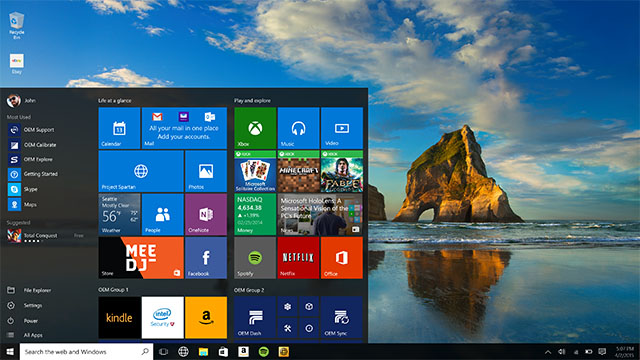
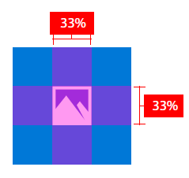
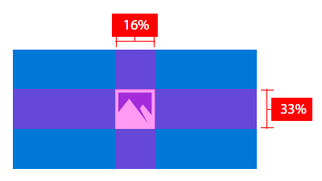
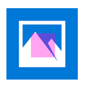
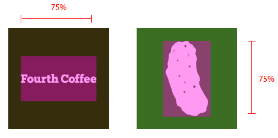
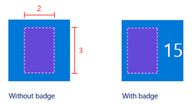

# Recommandations en matière de ressources de vignette et d’icône

<link rel="stylesheet" href="https://az835927.vo.msecnd.net/sites/uwp/Resources/css/custom.css"> 


Les ressources d’icône d’application, qui s’affichent sous différentes formes dans le système d’exploitation Windows10, sont les cartes de visite de votre application de plateforme Windows universelle (UWP). Ces recommandations précisent où apparaissent les ressources d’icône d’application dans le système et fournissent des conseils de conception détaillés pour vous aider à créer les plus belles icônes.



## Mise à l’échelle adaptative


Tout d’abord, voici une brève vue d’ensemble de la mise à l’échelle adaptative pour mieux comprendre comment fonctionne la mise à l’échelle avec des ressources. Windows 10 introduit une évolution du modèle de mise à l’échelle existant. En plus de la mise à l’échelle du contenu vectoriel, il existe un ensemble unifié de facteurs d’échelle qui assurent la cohérence de taille des éléments d’interface utilisateur en fonction de diverses tailles d’écran et résolutions d’affichage. Ces facteurs d’échelle sont également compatibles avec les facteurs d’échelle d’autres systèmes d’exploitation tels qu’iOS et Android. Cela facilite le partage de ressources entre ces plateformes.

Le Store sélectionne les ressources à télécharger notamment en fonction de la résolution de l’appareil. Seules les ressources correspondant au mieux à l’appareil sont téléchargées.

## Éléments de vignette


Les composants de base d’une vignette de démarrage comprennent une plaque de fond, une icône, une barre de marque, des marges et un titre d’application:


La barre de marque au bas d’une vignette comprend le nom de l’application, le badge et le compteur (le cas échéant):


La hauteur de la barre de marque dépend du facteur d’échelle de l’appareil sur lequel la vignette s’affiche:

| Facteur d’échelle | Pixels |
|--------------|--------|
| 100%         | 32     |
| 125 %         | 40     |
| 150 %         | 48     |
| 200 %         | 64     |
| 400 %         | 128    |

 

Le système définit les marges de vignette. Elles ne peuvent pas être modifiées. La majorité du contenu s’affiche entre les marges, comme illustré dans cet exemple:


La largeur des marges dépend du facteur d’échelle de l’appareil sur lequel la vignette s’affiche:

| Facteur d’échelle | Pixels |
|--------------|--------|
| 100%         | 8      |
| 125 %         | 10     |
| 150 %         | 12     |
| 200 %         | 16     |
| 400 %         | 32     |

 

## Ressources de vignette


Chaque ressource de vignette a la même taille que la vignette sur laquelle elle est positionnée. Vous pouvez personnaliser les vignettes de votre application avec deux représentations différentes d’une ressource:

1. Une icône ou un logo centrés avec remplissage. La couleur de la plaque de fond apparaît ainsi sur les éléments suivants:


2. Une vignette personnalisée en pleine page sans remplissage:


Par souci de cohérence entre les appareils, chaque taille de vignette (petite, moyenne, large et grande) a son propre ratio de dimensionnement. Pour obtenir un positionnement homogène de l’icône sur l’ensemble des vignettes, nous vous donnons quelques recommandations de base en matière de remplissage pour les tailles de vignette suivantes. L’emplacement idéal d’une icône est à l’intersection des deux superpositions violettes. Même si les icônes ne tiennent pas toujours à l’intérieur de l’emplacement, le volume visuel d’une icône devrait plus ou moins correspondre aux exemples fournis.

Dimensionnement d’une petite vignette:


Dimensionnement d’une vignette moyenne:



Dimensionnement d’une vignette large:



Dimensionnement d’une grande vignette:


Dans cet exemple, l’icône est trop grande pour la vignette:



Dans cet exemple, l’icône est trop petite pour la vignette:


Les taux de remplissage suivants sont particulièrement adaptés aux icônes positionnées à l’horizontale ou à la verticale.

Pour les petites vignettes, limitez la largeur et la hauteur de l’icône à 66% de la taille de la vignette:


Pour les vignettes moyennes, limitez la largeur de l’icône à 66% et la hauteur de l’icône à 50% de la taille de la vignette. Cela empêche le chevauchement des éléments dans la barre de marque:


Pour les vignettes larges, limitez la largeur de l’icône à 66% et la hauteur de l’icône à 50% de la taille de la vignette. Cela empêche le chevauchement des éléments dans la barre de marque:


Pour les grandes vignettes, limitez la largeur et la hauteur de l’icône à 50% de la taille de la vignette:


Certaines icônes sont conçues pour être positionnées à l’horizontale ou à la verticale, tandis que certaines ont des formes plus complexes qui les empêchent de respecter les dimensions cibles. Les icônes qui semblent centrées peuvent déborder d’un côté. Dans ce cas, certaines parties de l’icône peuvent se retrouver hors de l’emplacement recommandé, à condition que l’icône offre le même attrait visuel qu’une icône aux bonnes dimensions:


Pour les ressources pleine page, prenez en compte les éléments qui interagissent avec les marges et les bords des vignettes. Conservez des marges équivalentes à au moins 16 % de la hauteur ou de la largeur de la vignette. Ce pourcentage représente le double de la largeur des marges pour la plus petite taille de vignette:


Dans cet exemple, les marges sont trop étroites:


## Ressources de vignette dans les affichages Liste


Les vignettes peuvent également apparaître dans un affichage Liste. Les recommandations de dimensionnement des ressources de vignette qui apparaissent dans les affichages Liste diffèrent légèrement de celles des ressources de vignette décrites précédemment. Cette section détaille ces caractéristiques de dimensionnement spécifiques.


Limitez la largeur et la hauteur de l’icône à 75% de la taille de la vignette:


Pour les icônes horizontales et verticales, limitez la largeur et la hauteur de l’icône à 75% de la taille de la vignette:



Pour des illustrations pleine page d’éléments de marque importants, conservez des marges d’au moins 12,5%:


Dans cet exemple, l’icône est trop grande pour la vignette:


Dans cet exemple, l’icône est trop petite pour la vignette:


## Ressources basées sur la taille de la cible avec plaque


Les ressources basées sur la cible sont destinées aux icônes et vignettes qui apparaissent dans la barre des tâches Windows, dans les applications actives, dans l’affichage Alt+Tab, dans l’alignement automatique et dans le coin inférieur droit des vignettes de démarrage. Vous n’avez pas besoin d’ajouter du remplissage à ces ressources ; Windows s’en charge le cas échéant. Ces ressources doivent présenter un encombrement minimal de 16 pixels. Voici un exemple de ces ressources telles qu’elles apparaissent dans les icônes de la barre des tâches Windows:


Même si ces interfaces utilisateur positionnent par défaut une ressource basée sur la cible sur une plaque de fond en couleur, vous pouvez également utiliser une ressource basée sur la cible sans plaque. Lorsque vous créez des ressources sans plaque, pensez au fait qu’elles pourront apparaître sur différentes couleurs d’arrière-plan.


Voici des recommandations de dimensionnement pour les ressources basées sur la cible, à l’échelle 100%:


**Ressources d’application utilisant un modèle sous forme d’icône**

Le modèle sous forme d’icône (également connu sous le nom de modèle « IconWithBadge ») vous permet d’afficher une petite image au centre de la vignette. Windows 10 prend en charge le modèle à la fois sur les téléphones et sur les tablettes/ordinateurs de bureau. (Pour en savoir plus sur la création de vignettes sous forme d’icône, voir l’article [Modèles de vignette spéciaux](tiles-and-notifications-special-tile-templates-catalog.md).)

Les applications qui utilisent un modèle sous forme d’icône, telles que les applications Messagerie, Téléphone et Windows Store, disposent de ressources basées sur la cible pouvant intégrer un badge (avec compteur dynamique). À l’instar des autres ressources basées sur la cible, aucun remplissage n’est nécessaire. Les ressources sous forme d’icône ne font pas partie du manifeste de l’application, mais d’une charge utile de vignettes dynamiques. Les ressources sont redimensionnées et centrées dans un conteneur de coefficient 3:2:



Pour les ressources carrées, un centrage automatique est effectué dans le conteneur:


Pour les ressources non carrées, un centrage horizontal/vertical automatique et un alignement de la largeur/hauteur sont effectués dans le conteneur:


## Ressources d’écran de démarrage


L’image d’écran de démarrage peut être fournie sous la forme d’un chemin d’accès direct à un fichier image ou en tant que ressource. En utilisant une référence à une ressource, vous pouvez fournir des images d’échelles différentes afin que Windows puisse choisir la taille la mieux adaptée à l’appareil et à la résolution d’écran. Vous pouvez également fournir des images à contraste élevé pour l’accessibilité et des images localisées correspondant aux différentes langues d’interface utilisateur.

Si vous ouvrez le fichier « Package.appxmanifest » dans un éditeur de texte, l’élément [**SplashScreen**](https://msdn.microsoft.com/library/windows/apps/br211467) s’affiche en tant qu’enfant de l’élément [**VisualElements**](https://msdn.microsoft.com/library/windows/apps/br211471). Le balisage de l’écran de démarrage par défaut dans le fichier manifeste ressemble à ceci dans un éditeur de texte :

```XML
<uap:SplashScreen Image="Assets\SplashScreen.png" /></code></pre></td>
</tr>
</tbody>
</table>
```

Les ressources d’écran de démarrage sont centrées sur chaque appareil sur lequel elles apparaissent:


## Ressources à contraste élevé


Le mode de contraste élevé utilise des jeux de ressources distincts pour le blanc à contraste élevé (arrière-plan blanc avec texte noir) et le noir à contraste élevé (arrière-plan noir avec texte blanc). Si vous ne fournissez pas de ressources à contraste élevé pour votre application, les ressources standard seront utilisées.

Si les ressources standard de votre application offrent un affichage acceptable sur un arrière-plan noir et blanc, alors votre application pourra au moins offrir un affichage satisfaisant en mode de contraste élevé. Si vos ressources standard n’offrent pas un affichage acceptable sur un arrière-plan noir et blanc, envisagez d’inclure des ressources à contraste élevé. Ces exemples illustrent les deux types de ressources à contraste élevé:


Si vous décidez de fournir des ressources à contraste élevé, vous devez inclure les deux types de ressources: blanc sur noir et noir sur blanc. Au moment d’ajouter ces ressources à votre package, vous pouvez créer un dossier «contraste noir» pour les ressources blanc sur noir et un dossier «contraste blanc» pour les ressources noir sur blanc.

## Tableaux des tailles de ressource


Nous vous recommandons vivement de fournir au moins des ressources pour les facteurs d’échelle 100, 200 et 400. Si vous fournissez des ressources pour tous les facteurs d’échelle, l’expérience utilisateur sera optimale.

**Ressources basées sur l’échelle**

| Catégorie             | Nom d’élément      | À l’échelle 100 % | À l’échelle 125 % | À l’échelle 150 % | À l’échelle 200 % | À l’échelle 400 % |
|----------------------|-------------------|---------------|---------------|---------------|---------------|---------------|
| Petite                | Square71x71Logo   | 71 x 71         | 89 x 89         | 107 x 107       | 142 x 142       | 284 x 284       |
| Moyenne               | Square150x150Logo | 150 x 150       | 188 x 188       | 225 x 225       | 300 x 300       | 600 x 600       |
| Large                 | Square310x150Logo | 310 x 150       | 388 x 188       | 465 x 225       | 620 x 300       | 1 240 x 600      |
| Grande (bureau uniquement) | Square310x310Logo | 310 x 310       | 388 x 388       | 465 x 465       | 620 x 620       | 1240x 1240     |
| Liste des applications (icône)      | Square44x44Logo   | 44 x 44         | 55 x 55         | 66 x 66         | 88 x 88         | 176 x 176       |

 

**Exemples de nom de fichier pour les ressources basées sur l’échelle**

| Catégorie             | Nom d’élément      | À l’échelle 100 %                  | À l’échelle 125 %                  | À l’échelle 150 %                  |
|----------------------|-------------------|--------------------------------|--------------------------------|--------------------------------|
| Petite                | Square71x71Logo   | AppNameSmallTile.scale-100.png | AppNameSmallTile.scale-125.png | AppNameSmallTile.scale-150.png |
| Moyenne               | Square150x150Logo | AppNameMedTile.scale-100.png   | AppNameMedTile.scale-125.png   | AppNameMedTile.scale-150.png   |
| Large                 | Square310x150Logo | AppNameWideTile.scale-100.png  | AppNameWideTile.scale-125.png  | AppNameWideTile.scale-150.png  |
| Grande (bureau uniquement) | Square310x310Logo | AppNameLargeTile.scale-100.png | AppNameLargeTile.scale-125.png | AppNameLargeTile.scale-150.png |
| Liste des applications (icône)      | Square44x44Logo   | AppNameLargeTile.scale-100.png | AppNameLargeTile.scale-125.png | AppNameLargeTile.scale-150.png |

 

| Catégorie             | Nom d’élément      | À l’échelle 200 %                  | À l’échelle 400 %                  |
|----------------------|-------------------|--------------------------------|--------------------------------|
| Petite                | Square71x71Logo   | AppNameSmallTile.scale-200.png | AppNameSmallTile.scale-400.png |
| Moyenne               | Square150x150Logo | AppNameMedTile.scale-200.png   | AppNameMedTile.scale-400.png   |
| Large                 | Square310x150Logo | AppNameWideTile.scale-200.png  | AppNameWideTile.scale-400.png  |
| Grande (bureau uniquement) | Square310x310Logo | AppNameLargeTile.scale-200.png | AppNameLargeTile.scale-400.png |
| Liste des applications (icône)      | Square44x44Logo   | AppNameLargeTile.scale-200.png | AppNameLargeTile.scale-400.png |

 

**Ressources basées sur la taille de la cible avec plaque**

Les ressources basées sur la cible sont utilisées dans plusieurs facteurs d’échelle. Le nom d’élément pour les ressources basées sur la cible est **Square44x44Logo**. Nous vous recommandons vivement de fournir au moins les ressources suivantes :

16 x 16, 24 x 24, 32 x 32, 48 x 48, 256 x 256

Le tableau suivant répertorie toutes les tailles de ressources basées sur la cible et les exemples de nom de fichier correspondants :

| Taille de la ressource | Exemple de nom de fichier                 |
|------------|-----------------------------------|
| 16 x 16\*    | AppNameAppList.targetsize-16.png  |
| 24 x 24\*    | AppNameAppList.targetsize-24.png  |
| 32 x 32\*    | AppNameAppList.targetsize-32.png  |
| 48 x 48\*    | AppNameAppList.targetsize-48.png  |
| 256 x 256\*  | AppNameAppList.targetsize-256.png |
| 20 x 20      | AppNameAppList.targetsize-20.png  |
| 30 x 30      | AppNameAppList.targetsize-30.png  |
| 36 x 36      | AppNameAppList.targetsize-36.png  |
| 40 x 40      | AppNameAppList.targetsize-40.png  |
| 60 x 60      | AppNameAppList.targetsize-60.png  |
| 64 x 64      | AppNameAppList.targetsize-64.png  |
| 72 x 72      | AppNameAppList.targetsize-72.png  |
| 80 x 80      | AppNameAppList.targetsize-80.png  |
| 96 x 96      | AppNameAppList.targetsize-96.png  |

 

\* Fournissez ces tailles de ressource à titre de référence

## Types de ressources


Voici tous les types de ressources, leur utilisation et les noms de fichier recommandés.

**Ressources de vignette**

-   Les ressources centrées sont généralement utilisées sur l’écran de démarrage pour présenter votre application.
-   Format de nom de fichier: \*Tile.scale-\*.PNG
-   Applications concernées: toutes les applications UWP
-   Utilisations :
    -   Vignettes d’écran de démarrage par défaut (bureau et appareil mobile)
    -   Centre de maintenance (bureau et appareil mobile)
    -   Sélecteur de tâches (appareil mobile)
    -   Sélecteur Partager (appareil mobile)
    -   Sélecteur (appareil mobile)
    -   Windows Store

**Ressources évolutives avec plaque**

-   Ces ressources sont utilisées sur les surfaces qui requièrent des facteurs d’échelle. Les ressources sont équipées d’une plaque par le système ou sont fournies avec leur propre couleur d’arrière-plan si l’application inclut cette fonctionnalité.
-   Format de nom de fichier: \*AppList.scale-\*.PNG
-   Applications concernées: toutes les applications UWP
-   Utilisations :
    -   Liste Toutes les applications du menu Démarrer (bureau)
    -   Liste Les plus utilisées du menu Démarrer (bureau)
    -   Gestionnaire des tâches (bureau)
    -   Résultats de recherche Cortana
    -   Liste Toutes les applications du menu Démarrer (appareil mobile)
    -   Paramètres

**Ressources basées sur la taille de la cible avec plaque**

-   Ces tailles de ressource fixes ne sont pas mises à l’échelle avec les plaques. Principalement utilisées pour les expériences héritées. Les ressources sont vérifiées par le système.
-   File Format de nom de fichier: \*AppList.targetsize-\*.PNG
-   Applications concernées: toutes les applications UWP
-   Utilisations :
    -   Liste des raccourcis du menu Démarrer (bureau)
    -   Coin inférieur de la vignette du menu Démarrer (bureau)
    -   Raccourcis (bureau)
    -   Panneau de configuration (bureau)

**Ressources basées sur la taille de la cible sans plaque**

-   Ces ressources ne sont pas équipées de plaque ni mises à l’échelle par le système.
-   Format de nom de fichier: \*AppList.targetsize-\*\_altform-unplated.PNG
-   Applications concernées: toutes les applications UWP
-   Utilisations :
    -   Barre des tâches et miniature de la barre des tâches (bureau)
    -   Liste des raccourcis de la barre des tâches
    -   Applications actives
    -   Alt+Tab

**Ressources d’extension de fichier**

-   Ces ressources sont spécifiques aux extensions de fichier. Elles s’affichent en regard des icônes d’association de fichier de type Win32 dans l’Explorateur de fichiers et doivent être indépendantes du thème défini. Le dimensionnement diffère selon les plateformes mobiles et de bureau.
-   Format de nom de fichier: \*LogoExtensions.targetsize-\*.PNG
-   Applications concernées : Musique, Vidéo, Photos, MicrosoftEdge, Microsoft Office
-   Utilisations :
    -   Explorateur de fichiers
    -   Cortana
    -   Différentes surfaces d’interface utilisateur (bureau)

**Écran de démarrage**

-   La ressource qui s’affiche sur l’écran de démarrage de votre application. Elle est automatiquement mise à l’échelle sur les plateformes mobiles et de bureau.
-   Format de nom de fichier: \*SplashScreen.screen-100.PNG
-   Applications concernées: toutes les applications UWP
-   Utilisations :
    -   Écran de démarrage de l’application

**Ressources de vignette sous forme d’icône**

-   Il s’agit des ressources pour les applications utilisant le modèle sous forme d’icône.
-   Format de nom de fichier : non applicable
-   Applications concernées : Messagerie, Téléphone, Windows Store, etc.
-   Utilisations :
    -   Vignette sous forme d’icône


## Rubriques connexes


* [Modèles de vignette spéciaux](tiles-and-notifications-special-tile-templates-catalog.md)
 

 


<!--HONumber=Aug16_HO3-->


