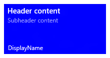
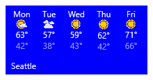
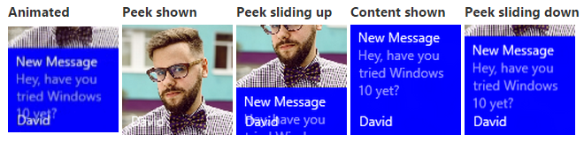

# Créer des vignettes adaptatives


\[ Mise à jour pour les applications UWP sur Windows 10. Pour les articles sur Windows 8.x, voir la [documentation archivée](http://go.microsoft.com/fwlink/p/?linkid=619132). \]


Les modèles de vignette adaptative sont une nouvelle fonctionnalité de Windows 10, qui vous permet de concevoir votre propre contenu de notification par vignette à l’aide d’un langage de balisage simple et flexible adapté à différentes densités d’écran. Cet article vous indique comment créer des vignettes dynamiques adaptatives pour votre application de plateforme Windows universelle (UWP). Pour obtenir la liste complète des éléments et attributs adaptatifs, voir [Schéma des vignettes adaptatives](tiles-and-notifications-adaptive-tiles-schema.md).

(Si vous le souhaitez, vous pouvez toujours utiliser les modèles prédéfinis du [catalogue de modèles de vignette Windows 8](https://msdn.microsoft.com/library/windows/apps/hh761491) lors de la conception de notifications pour Windows 10.)

## <span id="Getting_started"> </span> <span id="getting_started"> </span> <span id="GETTING_STARTED"> </span>Prise en main


**Installez NotificationsExtensions.** Si vous préférez utiliser C# plutôt que XML pour générer des notifications, installez le package NuGet nommé [NotificationsExtensions](https://github.com/WindowsNotifications/NotificationsExtensions/wiki). Les exemples de code C# indiqués dans cet article utilisent NotificationsExtensions.

**Installez Notifications Visualizer.** Cette application UWP gratuite vous permet de concevoir des vignettes dynamiques adaptatives en fournissant un aperçu visuel instantané de votre vignette lorsque vous la modifiez, comparable au mode Création/Éditeur XAML de Visual Studio. Pour plus d’informations, vous pouvez lire [ce billet de blog](http://blogs.msdn.com/b/tiles_and_toasts/archive/2015/09/22/introducing-notifications-visualizer-for-windows-10.aspx). Vous pouvez également télécharger Notifications Visualizer [ici](https://www.microsoft.com/store/apps/notifications-visualizer/9nblggh5xsl1).

## <span id="Usage_guidance"> </span> <span id="usage_guidance"> </span> <span id="USAGE_GUIDANCE"> </span>Conseils d’utilisation


Les modèles adaptatifs sont conçus pour fonctionner dans différents facteurs de forme et types de notifications. Les éléments tels qu’un groupe ou un sous-groupe, relient du contenu et n’impliquent pas de comportement visuel particulier. L’apparence finale d’une notification varie en fonction de l’appareil sur lequel elle s’affiche, selon qu’il s’agit d’un téléphone, d’une tablette, d’un ordinateur de bureau ou d’un autre appareil.

Les indications sont des attributs facultatifs qui peuvent être ajoutés à des éléments afin d’obtenir un comportement visuel spécifique. Elles peuvent être propres à un appareil ou à une notification.

## <span id="A_basic_example"> </span> <span id="a_basic_example"> </span> <span id="A_BASIC_EXAMPLE"> </span>Exemple de base


Cet exemple montre ce que les modèles de vignette adaptative peuvent produire.

```XML
<tile>
  <visual>
  
    <binding template="TileMedium">
      ...
    </binding>
  
    <binding template="TileWide">
      <text hint-style="subtitle">Jennifer Parker</text>
      <text hint-style="captionSubtle">Photos from our trip</text>
      <text hint-style="captionSubtle">Check out these awesome photos I took while in New Zealand!</text>
    </binding>
  
    <binding template="TileLarge">
      ...
    </binding>
  
  </visual>
</tile>
```

```CSharp
TileContent content = new TileContent()
{
    Visual = new TileVisual()
    {
        TileMedium = ...
  
        TileWide = new TileBinding()
        {
            Content = new TileBindingContentAdaptive()
            {
                Children =
                {
                    new TileText()
                    {
                        Text = "Jennifer Parker",
                        Style = TileTextStyle.Subtitle
                    },
  
                    new TileText()
                    {
                        Text = "Photos from our trip",
                        Style = TileTextStyle.CaptionSubtle
                    },
  
                    new TileText()
                    {
                        Text = "Check out these awesome photos I took while in New Zealand!",
                        Style = TileTextStyle.CaptionSubtle
                    }
                }
            }
        },
  
        TileLarge = ...
    }
};
```

**Résultat :**


## <span id="Tile_sizes"> </span> <span id="tile_sizes"> </span> <span id="TILE_SIZES"> </span>Tailles des vignettes


Le contenu de chaque taille de vignette est spécifié individuellement dans des éléments [&lt;binding&gt;](tiles-and-notifications-adaptive-tiles-schema.md) distincts au sein de la charge utile XML. Choisissez la taille cible en définissant l’attribut de modèle sur l’une des valeurs suivantes :

-   TileSmall
-   TileMedium
-   TileWide
-   TileLarge (uniquement pour les ordinateurs de bureau)

Pour une charge utile XML de notification par vignette, indiquez des éléments &lt;binding&gt; pour chaque taille de vignette que vous souhaitez prendre en charge, comme illustré dans cet exemple :

```XML
<tile>
  <visual>
  
    <binding template="TileSmall">
      <text>Small</text>
    </binding>
  
    <binding template="TileMedium">
      <text>Medium</text>
    </binding>
  
    <binding template="TileWide">
      <text>Wide</text>
    </binding>
  
    <binding template="TileLarge">
      <text>Large</text>
    </binding>
  
  </visual>
</tile>
```

```CSharp
TileContent content = new TileContent()
{
    Visual = new TileVisual()
    {
        TileSmall = new TileBinding()
        {
            Content = new TileBindingContentAdaptive()
            {
                Children =
                {
                    new TileText() { Text = "Small" }
                }
            }
        },
  
        TileMedium = new TileBinding()
        {
            Content = new TileBindingContentAdaptive()
            {
                Children =
                {
                    new TileText() { Text = "Medium" }
                }
            }
        },
  
        TileWide = new TileBinding()
        {
            Content = new TileBindingContentAdaptive()
            {
                Children =
                {
                    new TileText() { Text = "Wide" }
                }
            }
        },
  
        TileLarge = new TileBinding()
        {
            Content = new TileBindingContentAdaptive()
            {
                Children =
                {
                    new TileText() { Text = "Large" }
                }
            }
        }
    }
};
```

**Résultat :**


## <span id="Branding"> </span> <span id="branding"> </span> <span id="BRANDING"> </span>Personnalisation


Vous pouvez contrôler la personnalisation en bas d’une vignette dynamique (nom d’affichage et logo d’angle) à l’aide de l’attribut « branding » de la charge utile de notification. Vous pouvez choisir de ne rien afficher (valeur « none »), d’afficher uniquement le nom (valeur « name »), d’afficher uniquement le logo (valeur « logo ») ou d’afficher à la fois le nom et le logo (valeur « nameAndLogo »).

**Remarque** Étant donné que Windows Phone ne prend pas en charge le logo d’angle, les valeurs « logo » et « nameAndLogo » sont redéfinies par défaut sur « name » sur un téléphone.

 

```XML
<visual branding="logo">
  ...
</visual>
```

```CSharp
new TileVisual()
{
    Branding = TileBranding.Logo,
    ...
}

new TileVisual()
{
    Branding = TileBranding.Logo,
    ...
}
```

**Résultat :**


Vous pouvez appliquer une personnalisation à des tailles de vignettes spécifiques en procédant de l’une des deux manières suivantes :

1. en appliquant l’attribut à l’élément [&lt;binding&gt;](tiles-and-notifications-adaptive-tiles-schema.md) ;
2. en appliquant l’attribut à l’élément [&lt;visual&gt;](tiles-and-notifications-adaptive-tiles-schema.md), ce qui affecte l’intégralité de la charge utile de notification.
Si vous ne spécifiez pas de personnalisation pour une liaison, la personnalisation indiquée pour l’élément visuel sera utilisée.

```XML
<tile>
  <visual branding="nameAndLogo">
 
    <binding template="TileMedium" branding="logo">
      ...
    </binding>
 
    <!--Inherits branding from visual-->
    <binding template="TileWide">
      ...
    </binding>
 
  </visual>
</tile>
```

```CSharp
TileContent content = new TileContent()
{
    Visual = new TileVisual()
    {
        Branding = TileBranding.NameAndLogo,
 
        TileMedium = new TileBinding()
        {
            Branding = TileBranding.Logo,
            ...
        },
 
        // Inherits branding from Visual
        TileWide = new TileBinding()
        {
            ...
        }
    }
};
```

**Résultat de la personnalisation par défaut :**


Si vous ne spécifiez aucune personnalisation dans votre charge utile de notification, les propriétés de base de la vignette déterminent la personnalisation. Si la vignette de base indique le nom d’affichage, alors la personnalisation est définie par défaut sur « name ». Si le nom d’affichage n’est pas indiqué, la personnalisation est définie par défaut sur « none ».

**Remarque** Il s’agit d’une modification par rapport à Windows 8.x, dans lequel la personnalisation par défaut était définie sur « logo ».

 

## <span id="Display_name"> </span> <span id="display_name"> </span> <span id="DISPLAY_NAME"> </span>Nom d’affichage


Vous pouvez remplacer le nom d’affichage d’une notification en entrant la chaîne de texte de votre choix avec l’attribut **displayName**. Comme pour la personnalisation, vous pouvez spécifier cet aspect dans l’élément [&lt;visual&gt;](tiles-and-notifications-adaptive-tiles-schema.md), ce qui affecte toute la charge utile de notification, ou bien le spécifier dans l’élément [&lt;binding&gt;](tiles-and-notifications-adaptive-tiles-schema.md), ce qui affecte uniquement les vignettes individuelles.

```XML
<tile>
  <visual branding="nameAndLogo" displayName="Wednesday 22">
 
    <binding template="TileMedium" displayName="Wed. 22">
      ...
    </binding>
 
    <!--Inherits displayName from visual-->
    <binding template="TileWide">
      ...
    </binding>
 
  </visual>
</tile>
```

```CSharp
TileContent content = new TileContent()
{
    Visual = new TileVisual()
    {
        Branding = TileBranding.NameAndLogo,
        DisplayName = "Wednesday 22",
 
        TileMedium = new TileBinding()
        {
            DisplayName = "Wed. 22",
            ...
        },
 
        // Inherits DisplayName from Visual
        TileWide = new TileBinding()
        {
            ...
        }
    }
};
```

**Résultat :**


## <span id="Text"> </span> <span id="text"> </span> <span id="TEXT"> </span>Texte


L’élément [&lt;text&gt;](tiles-and-notifications-adaptive-tiles-schema.md) permet d’afficher un texte. Vous pouvez utiliser des indications pour en modifier l’apparence.

```XML
<text>This is a line of text</text></code></pre></td>
</tr>
</tbody>
</table>
```

<span codelanguage="CSharp"></span>
```CSharp
<colgroup>
<col width="100%" />
</colgroup>
<thead>
<tr class="header">
<th align="left">C#</th>
</tr>
</thead>
<tbody>
<tr class="odd">
new TileText()
{
    Text = "This is a line of text"
};
```

**Résultat :**


## <span id="Text_wrapping"> </span> <span id="text_wrapping"> </span> <span id="TEXT_WRAPPING"> </span>Renvoi de texte à la ligne


Par défaut, le texte n’est pas renvoyé à la ligne et déborde de la vignette. Utilisez l’attribut **hint-wrap** pour définir le renvoi de texte à la ligne sur un élément de texte. Vous pouvez également contrôler les nombres minimal et maximal de lignes à l’aide des éléments **hint-minLines** et **hint-maxLines**, qui acceptent des entiers positifs.

```XML
<text hint-wrap="true">This is a line of wrapping text</text></code></pre></td>
</tr>
</tbody>
</table>
```

<span codelanguage="CSharp"></span>
```CSharp
<colgroup>
<col width="100%" />
</colgroup>
<thead>
<tr class="header">
<th align="left">C#</th>
</tr>
</thead>
<tbody>
<tr class="odd">
new TileText()
{
    Text = "This is a line of wrapping text",
    Wrap = true
};
```

**Résultat :**


## <span id="Text_styles"> </span> <span id="text_styles"> </span> <span id="TEXT_STYLES"> </span>Styles de texte


Les styles contrôlent la taille de police, la couleur et l’épaisseur des éléments de texte. Plusieurs styles sont disponibles, notamment une variation « subtile » de chaque style qui définit l’opacité sur 60 %, ce qui transforme généralement la couleur du texte en nuance de gris clair.

```XML
<text hint-style="base">Header content</text>
<text hint-style="captionSubtle">Subheader content</text>
```

```CSharp
new TileText()
{
    Text = "Header content",
    Style = TileTextStyle.Base
},
 
new TileText()
{
    Text = "Subheader content",
    Style = TileTextStyle.CaptionSubtle
}
```

**Résultat :**



**Remarque** Par défaut, le style est défini sur « caption » si aucun élément hint-style n’est spécifié.

 

**Styles de texte de base**

|                                |                           |             |
|--------------------------------|---------------------------|-------------|
| &lt;text hint-style="\*" /&gt; | Hauteur de police               | Épaisseur de police |
| caption                        | 12 pixels effectifs (epx) | Normale     |
| body                           | 15 epx                    | Normale     |
| base                           | 15 epx                    | Semibold    |
| subtitle                       | 20 epx                    | Normale     |
| title                          | 24 epx                    | Semilight   |
| subheader                      | 34 epx                    | Maigre       |
| header                         | 46 epx                    | Maigre       |

 

**Variations de style de texte numérique**

Ces variations réduisent la hauteur de ligne afin que le contenu situé au-dessus et au-dessous soit beaucoup plus proche du texte.

|                  |
|------------------|
| titleNumeral     |
| subheaderNumeral |
| headerNumeral    |

 

**Variations de style de texte de sous-titre**

Chaque style dispose d’une variation de sous-titre qui octroie au texte une opacité de 60 %, qui transforme généralement la couleur du texte en nuance de gris clair.

|                        |
|------------------------|
| captionSubtle          |
| bodySubtle             |
| baseSubtle             |
| subtitleSubtle         |
| titleSubtle            |
| titleNumeralSubtle     |
| subheaderSubtle        |
| subheaderNumeralSubtle |
| headerSubtle           |
| headerNumeralSubtle    |

 

## <span id="Text_alignment"> </span> <span id="text_alignment"> </span> <span id="TEXT_ALIGNMENT"> </span>Alignement du texte


Le texte peut être aligné horizontalement à gauche, au centre ou à droite. Pour les langues qui s’écrivent de gauche à droite, par exemple l’anglais, le texte est aligné à gauche par défaut. Pour les langues qui s’écrivent de droite à gauche, telles que l’arabe, le texte est aligné à droite par défaut. Vous pouvez définir l’alignement manuellement en utilisant l’attribut **hint-align** dans des éléments.

```XML
<text hint-align="center">Hello</text></code></pre></td>
</tr>
</tbody>
</table>
```

<span codelanguage="CSharp"></span>
```CSharp
<colgroup>
<col width="100%" />
</colgroup>
<thead>
<tr class="header">
<th align="left">C#</th>
</tr>
</thead>
<tbody>
<tr class="odd">
new TileText()
{
    Text = "Hello",
    Align = TileTextAlign.Center
};
```

**Résultat :**


## <span id="Groups_and_subgroups"> </span> <span id="groups_and_subgroups"> </span> <span id="GROUPS_AND_SUBGROUPS"> </span>Groupes et sous-groupes


Les groupes vous permettent de déclarer au niveau sémantique que le contenu à l’intérieur du groupe est lié et qu’il doit être affiché dans son intégralité pour avoir du sens. Par exemple, vous pouvez avoir deux éléments de texte, un en-tête et un sous-titre, et il ne serait pas logique de n’afficher que l’en-tête. En regroupant ces éléments à l’intérieur d’un sous-groupe, les éléments sont tous affichés (s’ils peuvent s’ajuster à la vignette) ou pas affichés du tout (s’ils ne peuvent pas s’ajuster à la vignette).

Pour que l’expérience soit la meilleure possible sur les appareils et les écrans, indiquez plusieurs groupes. L’indication de plusieurs groupes permet à votre vignette de s’adapter aux écrans plus grands.

**Remarque** Le seul enfant valide d’un groupe est un sous-groupe.

 

```XML
...
<binding template="TileWide" branding="nameAndLogo">
  <group>
    <subgroup>
      <text hint-style="subtitle">Jennifer Parker</text>
      <text hint-style="captionSubtle">Photos from our trip</text>
      <text hint-style="captionSubtle">Check out these awesome photos I took while in New Zealand!</text>
    </subgroup>
  </group>
 
  <text />
 
  <group>
    <subgroup>
      <text hint-style="subtitle">Steve Bosniak</text>
      <text hint-style="captionSubtle">Build 2015 Dinner</text>
      <text hint-style="captionSubtle">Want to go out for dinner after Build tonight?</text>
    </subgroup>
  </group>
</binding>
...
```

```CSharp
...
 
TileWide = new TileBinding()
{
    Branding = TileBranding.NameAndLogo,
    Content = new TileBindingContentAdaptive()
    {
        Children =
        {
            CreateGroup(
                from: "Jennifer Parker",
                subject: "Photos from our trip",
                body: "Check out these awesome photos I took while in New Zealand!"),
 
            // For spacing
            new TileText(),
 
            CreateGroup(
                from: "Steve Bosniak",
                subject: "Build 2015 Dinner",
                body: "Want to go out for dinner after Build tonight?")
        }
    }
}
 
...
 
 
private static TileGroup CreateGroup(string from, string subject, string body)
{
    return new TileGroup()
    {
        Children =
        {
            new TileSubgroup()
            {
                Children =
                {
                    new TileText()
                    {
                        Text = from,
                        Style = TileTextStyle.Subtitle
                    },
 
                    new TileText()
                    {
                        Text = subject,
                        Style = TileTextStyle.CaptionSubtle
                    },
 
                    new TileText()
                    {
                        Text = body,
                        Style = TileTextStyle.CaptionSubtle
                    }
                }
            }
        }
    };
}
```

**Résultat :**


## <span id="Subgroups__columns_"> </span> <span id="subgroups__columns_"> </span> <span id="SUBGROUPS__COLUMNS_"> </span>Sous-groupes (colonnes)


Les sous-groupes vous permettent également de répartir les données en sections sémantiques au sein d’un groupe. Pour les vignettes dynamiques, cela se traduit visuellement par des colonnes.

L’attribut **hint-weight** vous permet de contrôler la largeur des colonnes. La valeur de l’attribut **hint-weight** est exprimée sous forme de pondération de l’espace disponible, qui est identique au comportement **GridUnitType.Star**. Pour obtenir des colonnes de largeur égale, définissez chaque pondération sur 1.

<table>
<colgroup>
<col width="50%" />
<col width="50%" />
</colgroup>
<tbody>
<tr class="odd">
<td align="left">hint-weight</td>
<td align="left">Pourcentage de largeur</td>
</tr>
<tr class="even">
<td align="left">1</td>
<td align="left">25 %</td>
</tr>
<tr class="odd">
<td align="left">1</td>
<td align="left">25 %</td>
</tr>
<tr class="even">
<td align="left">1</td>
<td align="left">25 %</td>
</tr>
<tr class="odd">
<td align="left">1</td>
<td align="left">25 %</td>
</tr>
<tr class="even">
<td align="left">Pondération totale : 4</td>
<td align="left"></td>
</tr>
</tbody>
</table>

 


Pour qu’une colonne soit deux fois plus large qu’une autre colonne, attribuez la pondération 1 à la colonne la moins large, et la pondération 2 à la colonne la plus large.

<table>
<colgroup>
<col width="50%" />
<col width="50%" />
</colgroup>
<tbody>
<tr class="odd">
<td align="left">hint-weight</td>
<td align="left">Pourcentage de largeur</td>
</tr>
<tr class="even">
<td align="left">1</td>
<td align="left">33,3 %</td>
</tr>
<tr class="odd">
<td align="left">2</td>
<td align="left">66,7 %</td>
</tr>
<tr class="even">
<td align="left">Pondération totale : 3</td>
<td align="left"></td>
</tr>
</tbody>
</table>

 


Si vous souhaitez que les première et seconde colonnes occupent respectivement 20 % et 80 % de la largeur totale, définissez la première pondération sur 20 et la seconde sur 80. Si la totalité des pondérations est égale à 100, elles correspondent à des pourcentages.

<table>
<colgroup>
<col width="50%" />
<col width="50%" />
</colgroup>
<tbody>
<tr class="odd">
<td align="left">hint-weight</td>
<td align="left">Pourcentage de largeur</td>
</tr>
<tr class="even">
<td align="left">20</td>
<td align="left">20 %</td>
</tr>
<tr class="odd">
<td align="left">80</td>
<td align="left">80 %</td>
</tr>
<tr class="even">
<td align="left">Pondération totale : 100</td>
<td align="left"></td>
</tr>
</tbody>
</table>

 


**Remarque** Une marge de 8 pixels est automatiquement ajoutée entre les colonnes.

 

Si vous disposez de plus de deux sous-groupes, vous devez spécifier l’attribut **hint-weight**, qui accepte uniquement des entiers positifs. Si vous ne spécifiez pas l’attribut hint-weight pour le premier sous-groupe, la pondération 50 lui est attribuée. Le sous-groupe suivant pour lequel aucun attribut hint-weight n’est spécifié, se voit attribuer une pondération égal à 100 moins la somme des pondérations précédentes, ou une pondération égale à 1 si le résultat est zéro. La pondération 1 est attribué aux sous-groupes restants pour lesquels aucun attribut hint-weight n’est attribué.

Voici un exemple de code pour une vignette météo, qui montre comment obtenir une vignette avec cinq colonnes de largeur égale :

```XML
...
<binding template="TileWide" displayName="Seattle" branding="name">
  <group>
    <subgroup hint-weight="1">
      <text hint-align="center">Mon</text>
      <image src="Assets\Weather\Mostly Cloudy.png" hint-removeMargin="true"/>
      <text hint-align="center">63°</text>
      <text hint-align="center" hint-style="captionsubtle">42°</text>
    </subgroup>
    <subgroup hint-weight="1">
      <text hint-align="center">Tue</text>
      <image src="Assets\Weather\Cloudy.png" hint-removeMargin="true"/>
      <text hint-align="center">57°</text>
      <text hint-align="center" hint-style="captionsubtle">38°</text>
    </subgroup>
    <subgroup hint-weight="1">
      <text hint-align="center">Wed</text>
      <image src="Assets\Weather\Sunny.png" hint-removeMargin="true"/>
      <text hint-align="center">59°</text>
      <text hint-align="center" hint-style="captionsubtle">43°</text>
    </subgroup>
    <subgroup hint-weight="1">
      <text hint-align="center">Thu</text>
      <image src="Assets\Weather\Sunny.png" hint-removeMargin="true"/>
      <text hint-align="center">62°</text>
      <text hint-align="center" hint-style="captionsubtle">42°</text>
    </subgroup>
    <subgroup hint-weight="1">
      <text hint-align="center">Fri</text>
      <image src="Assets\Weather\Sunny.png" hint-removeMargin="true"/>
      <text hint-align="center">71°</text>
      <text hint-align="center" hint-style="captionsubtle">66°</text>
    </subgroup>
  </group>
</binding>
...
```

```CSharp
...
TileWide = new TileBinding()
{
    DisplayName = "Seattle",
    Branding = TileBranding.Name,
    Content = new TileBindingContentAdaptive()
    {
        Children =
        {
            new TileGroup()
            {
                Children =
                {
                    CreateSubgroup("Mon", "Mostly Cloudy.png", "63°", "42°"),
 
                    CreateSubgroup("Tue", "Cloudy.png", "57°", "38°"),
 
                    CreateSubgroup("Wed", "Sunny.png", "59°", "43°"),
 
                    CreateSubgroup("Thu", "Sunny.png", "62°", "42°"),
 
                    CreateSubgroup("Fri", "Sunny.png", "71°", "66°")
                }
            }
        }
    }
}
...
 
 
private static TileSubgroup CreateSubgroup(string day, string image, string highTemp, string lowTemp)
{
    return new TileSubgroup()
    {
        Weight = 1,
 
        Children =
        {
            new TileText()
            {
                Text = day,
                Align = TileTextAlign.Center
            },
 
            new TileImage()
            {
                Source = new TileImageSource("Assets/Weather/" + image),
                RemoveMargin = true
            },
 
            new TileText()
            {
                Text = highTemp,
                Align = TileTextAlign.Center
            },
 
            new TileText()
            {
                Text = lowTemp,
                Align = TileTextAlign.Center,
                Style = TileTextStyle.CaptionSubtle
            }
        }
    };
}
```

**Résultat :**



## <span id="Images"> </span> <span id="images"> </span> <span id="IMAGES"> </span>Images


L’élément &lt;image&gt; permet d’afficher des images dans la notification par vignette. Les images peuvent être incorporées au sein du contenu de la vignette (par défaut), en tant qu’image d’arrière-plan derrière le contenu ou en tant qu’image furtive qui s’anime à partir du haut de la notification.

**Remarque** Il existe des [restrictions sur la taille des fichiers et les dimensions des images](https://msdn.microsoft.com/library/windows/apps/hh781198).

 

Si aucun comportement supplémentaire n’est spécifié, les images sont uniformément réduites ou développées pour remplir la largeur disponible. L’exemple ci-dessous présente une vignette utilisant deux colonnes et des images incorporées. Les images incorporées sont étirées pour remplir la largeur de la colonne.

```XML
...
<binding template="TileMedium" displayName="Seattle" branding="name">
  <group>
    <subgroup>
      <text hint-align="center">Mon</text>
      <image src="Assets\Apps\Weather\Mostly Cloudy.png" hint-removeMargin="true"/>
      <text hint-align="center">63°</text>
      <text hint-style="captionsubtle" hint-align="center">42°</text>
    </subgroup>
    <subgroup>
      <text hint-align="center">Tue</text>
      <image src="Assets\Apps\Weather\Cloudy.png" hint-removeMargin="true"/>
      <text hint-align="center">57°</text>
      <text hint-style="captionSubtle" hint-align="center">38°</text>
    </subgroup>
  </group>
</binding>
...
```

```CSharp
...
TileMedium = new TileBinding()
{
    DisplayName = "Seattle",
    Branding = TileBranding.Name,
    Content = new TileBindingContentAdaptive()
    {
        Children =
        {
            new TileGroup()
            {
                Children =
                {
                    CreateSubgroup("Mon", "Mostly Cloudy.png", "63°", "42°"),
 
                    CreateSubgroup("Tue", "Cloudy.png", "57°", "38°")
                }
            }
        }
    }
}
...
 
 
private static TileSubgroup CreateSubgroup(string day, string image, string highTemp, string lowTemp)
{
    return new TileSubgroup()
    {
        Children =
        {
            new TileText()
            {
                Text = day,
                Align = TileTextAlign.Center
            },
 
            new TileImage()
            {
                Source = new TileImageSource("Assets/Weather/" + image),
                RemoveMargin = true
            },
 
            new TileText()
            {
                Text = highTemp,
                Align = TileTextAlign.Center
            },
 
            new TileText()
            {
                Text = lowTemp,
                Align = TileTextAlign.Center,
                Style = TileTextStyle.CaptionSubtle
            }
        }
    };
}
```

**Résultat :**


Les images placées à la racine de &lt;binding&gt; ou dans le premier groupe sont également étirées pour s’ajuster à la hauteur disponible.

### <span id="Image_alignment"> </span> <span id="image_alignment"> </span> <span id="IMAGE_ALIGNMENT"> </span>Alignement d’images

Les images peuvent être définies pour s’aligner à gauche, au centre ou à droite à l’aide de l’attribut **hint-align**. Cela entraîne également leur affichage à leur résolution native, et non leur étirement pour remplir la largeur.

```XML
...
<binding template="TileLarge">
  <image src="Assets/fable.jpg" hint-align="center"/>
</binding>
...
```

```CSharp
...
TileLarge = new TileBinding()
{
    Content = new TileBindingContentAdaptive()
    {
        Children =
        {
            new TileImage()
            {
                Source = new TileImageSource("Assets/fable.jpg"),
                Align = TileImageAlign.Center
            }
        }
    }
}
...
```

**Résultat :**


### <span id="Image_margins"> </span> <span id="image_margins"> </span> <span id="IMAGE_MARGINS"> </span>Marges d’images

Par défaut, une marge de 8 pixels est insérée dans les images incluses entre le contenu et l’image située au-dessus ou au-dessous. Cette marge peut être supprimée à l’aide de l’attribut **hint-removeMargin** dans l’image. Toutefois, les images conservent toujours la marge de 8 pixels à partir du bord de la vignette, et les sous-groupes (colonnes) conservent toujours le remplissage de 8 pixels entre les colonnes.

```XML
...
<binding template="TileMedium" branding="none">
  <group>
    <subgroup>
      <text hint-align="center">Mon</text>
      <image src="Assets\Numbers\4.jpg" hint-removeMargin="true"/>
      <text hint-align="center">63°</text>
      <text hint-style="captionsubtle" hint-align="center">42°</text>
    </subgroup>
    <subgroup>
      <text hint-align="center">Tue</text>
      <image src="Assets\Numbers\3.jpg" hint-removeMargin="true"/>
      <text hint-align="center">57°</text>
      <text hint-style="captionsubtle" hint-align="center">38°</text>
    </subgroup>
  </group>
</binding>
...
```

```CSharp
...
 
TileMedium = new TileBinding()
{
    Branding = TileBranding.None,
    Content = new TileBindingContentAdaptive()
    {
        Children =
        {
            new TileGroup()
            {
                Children =
                {
                    CreateSubgroup("Mon", "4.jpg", "63°", "42°"),
 
                    CreateSubgroup("Tue", "3.jpg", "57°", "38°")
                }
            }
        }
    }
}
 
...
 
 
private static TileSubgroup CreateSubgroup(string day, string image, string highTemp, string lowTemp)
{
    return new TileSubgroup()
    {
        Weight = 1,
 
        Children =
        {
            new TileText()
            {
                Text = day,
                Align = TileTextAlign.Center
            },
 
            new TileImage()
            {
                Source = new TileImageSource("Assets/Numbers/" + image),
                RemoveMargin = true
            },
 
            new TileText()
            {
                Text = highTemp,
                Align = TileTextAlign.Center
            },
 
            new TileText()
            {
                Text = lowTemp,
                Align = TileTextAlign.Center,
                Style = TileTextStyle.CaptionSubtle
            }
        }
    };
}
```


### <span id="Image_cropping"> </span> <span id="image_cropping"> </span> <span id="IMAGE_CROPPING"> </span>Rognage d’images

Les images peuvent être rognées dans un cercle à l’aide de l’attribut **hint-crop**, qui ne prend actuellement en charge que les valeurs « none » (par défaut) ou « circle ».

```XML
...
<binding template="TileLarge" hint-textStacking="center">
  <group>
    <subgroup hint-weight="1"/>
    <subgroup hint-weight="2">
      <image src="Assets/Apps/Hipstame/hipster.jpg" hint-crop="circle"/>
    </subgroup>
    <subgroup hint-weight="1"/>
  </group>
 
  <text hint-style="title" hint-align="center">Hi,</text>
  <text hint-style="subtitleSubtle" hint-align="center">MasterHip</text>
</binding>
...
```

```CSharp
...
TileLarge = new TileBinding()
{
    Content = new TileBindingContentAdaptive()
    {
        TextStacking = TileTextStacking.Center,
 
        Children =
        {
            new TileGroup()
            {
                Children =
                {
                    new TileSubgroup() { Weight = 1 },
 
                    new TileSubgroup()
                    {
                        Weight = 2,
                        Children =
                        {
                            new TileImage()
                            {
                                Source = new TileImageSource("Assets/Apps/Hipstame/hipster.jpg"),
                                Crop = TileImageCrop.Circle
                            }
                        }
                    },
 
                    new TileSubgroup() { Weight = 1 }
                }
            },
 
 
            new TileText()
            {
                Text = "Hi,",
                Style = TileTextStyle.Title,
                Align = TileTextAlign.Center
            },
 
            new TileText()
            {
                Text = "MasterHip",
                Style = TileTextStyle.SubtitleSubtle,
                Align = TileTextAlign.Center
            }
        }
    }
}
...
```

**Résultat :**


### <span id="Background_image"> </span> <span id="background_image"> </span> <span id="BACKGROUND_IMAGE"> </span>Image d’arrière-plan

Pour définir une image d’arrière-plan, placez un élément image à la racine de &lt;binding&gt; et définissez l’attribut placement sur « background ».

```XML
...
<binding template="TileWide">
  <image src="Assets\Mostly Cloudy-Background.jpg" placement="background"/>
  <group>
    <subgroup hint-weight="1">
      <text hint-align="center">Mon</text>
      <image src="Assets\Weather\Mostly Cloudy.png" hint-removeMargin="true"/>
      <text hint-align="center">63°</text>
      <text hint-align="center" hint-style="captionsubtle">42°</text>
    </subgroup>
    ...
  </group>
</binding>
...
```

```CSharp
...
TileWide = new TileBinding()
{
    Content = new TileBindingContentAdaptive()
    {
        BackgroundImage = new TileBackgroundImage()
        {
            Source = new TileImageSource("Assets/Mostly Cloudy-Background.jpg")
        },
 
        Children =
        {
            new TileGroup()
            {
                Children =
                {
                    CreateSubgroup("Mon", "Mostly Cloudy.png", "63°", "42°")
                    ...
                }
            }
        }
    }
}
...
 
 
private static TileSubgroup CreateSubgroup(string day, string image, string highTemp, string lowTemp)
{
    return new TileSubgroup()
    {
        Weight = 1,
 
        Children =
        {
            new TileText()
            {
                Text = day,
                Align = TileTextAlign.Center
            },
 
            new TileImage()
            {
                Source = new TileImageSource("Assets/Weather/" + image),
                RemoveMargin = true
            },
 
            new TileText()
            {
                Text = highTemp,
                Align = TileTextAlign.Center
            },
 
            new TileText()
            {
                Text = lowTemp,
                Align = TileTextAlign.Center,
                Style = TileTextStyle.CaptionSubtle
            }
        }
    };
}
```

**Résultat :**


En outre, vous pouvez définir une superposition noire sur votre image d’arrière-plan à l’aide de l’attribut **hint-overlay**, qui accepte des entiers compris entre 0 et 100, 0 correspondant à l’absence de superposition et 100 étant une superposition noire complète. La valeur par défaut est de 20.

```XML
...
<binding template="TileWide" hint-overlay="60">
  <image src="Assets\Mostly Cloudy-Background.jpg" placement="background"/>
  ...
</binding>
...
```

```CSharp
...
 
TileWide = new TileBinding()
{
    Content = new TileBindingContentAdaptive()
    {
        BackgroundImage = new TileBackgroundImage()
        {
            Source = new TileImageSource("Assets/Mostly Cloudy-Background.jpg"),
            Overlay = 60
        },
 
        ...
    }
}
 
...
```

**Résultat de l’application de l’attribut hint-overlay :**


### <span id="Peek_image"> </span> <span id="peek_image"> </span> <span id="PEEK_IMAGE"> </span>Image furtive

Vous pouvez spécifier une image qui défile furtivement à partir du haut de la vignette. L’image furtive utilise une animation qui glisse vers le bas/haut à partir du haut de la vignette, puis rebascule pour afficher le contenu principal de la vignette. Pour définir une image furtive, placez un élément image à la racine de &lt;binding&gt; et définissez l’attribut placement sur « peek ».

```XML
...
<binding template="TileMedium" branding="name">
  <image placement="peek" src="Assets/Apps/Hipstame/hipster.jpg"/>
  <text>New Message</text>
  <text hint-style="captionsubtle" hint-wrap="true">Hey, have you tried Windows 10 yet?</text>
</binding>
...
```

```CSharp
...
 
TileWide = new TileBinding()
{
    Branding = TileBranding.Name,
 
    Content = new TileBindingContentAdaptive()
    {
        PeekImage = new TilePeekImage()
        {
            Source = new TileImageSource("Assets/Apps/Hipstame/hipster.jpg")
        },
 
        Children =
        {
            new TileText()
            {
                Text = "New Message"
            },
 
            new TileText()
            {
                Text = "Hey, have you tried Windows 10 yet?",
                Style = TileTextStyle.CaptionSubtle,
                Wrap = true
            }
        }
    }
}
 
...
```



**Rognage d’images furtives et d’arrière-plan dans un cercle**

Pour rogner les images furtives et d’arrière-plan dans un cercle, utilisez l’attribut suivant :

hint-crop="circle"

Le résultat présentera l’aspect suivant :


**Utilisation d’une image furtive et d’une image d’arrière-plan simultanément**

Pour utiliser une image furtive et une image d’arrière-plan sur une notification par vignette, spécifiez ces deux images dans la charge utile de notification.

Le résultat présentera l’aspect suivant :


**Utilisation de l’attribut hint-overlay sur une image furtive**

Vous pouvez utiliser **hint-overlay** sur une image furtive pour augmenter l’opacité et améliorer la lisibilité du nom complet de la vignette. Si vous spécifiez **hint-overlay** sur l’élément &lt;binding&gt;, la superposition sera appliquée à l’image d’arrière-plan et à l’image furtive simultanément.

Vous pouvez également appliquer **hint-overlay** à un élément &lt;image&gt; présentant le code « placement="peek" » ou « placement="background" » afin de disposer de niveaux d’opacité distincts pour chacune de ces images. Si vous ne spécifiez pas de superposition, la valeur d’opacité par défaut est de 20 % pour l’image d’arrière-plan et de 0 % pour l’image furtive.

Cet exemple illustre une image d’arrière-plan avec une opacité de 20 % (à gauche) et une opacité de 0 % (à droite) :


## <span id="Vertical_alignment__text_stacking_"> </span> <span id="vertical_alignment__text_stacking_"> </span> <span id="VERTICAL_ALIGNMENT__TEXT_STACKING_"> </span>Alignement vertical (empilement de texte)


Vous pouvez contrôler l’alignement vertical du contenu sur votre vignette à l’aide de l’attribut **hint-textStacking** à la fois sur l’élément [&lt;binding&gt;](tiles-and-notifications-adaptive-tiles-schema.md) et sur l’élément [&lt;subgroup&gt;](tiles-and-notifications-adaptive-tiles-schema.md). Par défaut, tous les éléments sont alignés verticalement vers le haut, mais vous pouvez également aligner le contenu vers le bas ou le centre.

### <span id="Text_stacking_on_binding_element"> </span> <span id="text_stacking_on_binding_element"> </span> <span id="TEXT_STACKING_ON_BINDING_ELEMENT"> </span>Empilement de texte dans l’élément de liaison

Lorsqu’il est appliqué au niveau [&lt;binding&gt;](tiles-and-notifications-adaptive-tiles-schema.md), l’empilement de texte définit l’alignement vertical du contenu de la notification dans son ensemble, en s’alignant dans l’espace vertical disponible au-dessus de la zone de personnalisation/badge.

```XML
...
<binding template="TileMedium" hint-textStacking="center" branding="logo">
  <text hint-style="base" hint-align="center">Hi,</text>
  <text hint-style="captionSubtle" hint-align="center">MasterHip</text>
</binding>
...
```

```CSharp
...
 
TileMedium = new TileBinding()
{
    Branding = TileBranding.Logo,
 
    Content = new TileBindingContentAdaptive()
    {
        TextStacking = TileTextStacking.Center,
 
        Children =
        {
            new TileText()
            {
                Text = "Hi,",
                Style = TileTextStyle.Base,
                Align = TileTextAlign.Center
            },
 
            new TileText()
            {
                Text = "MasterHip",
                Style = TileTextStyle.CaptionSubtle,
                Align = TileTextAlign.Center
            }
        }
    }
}
 
...
```


### <span id="Text_stacking_on_subgroup_element"> </span> <span id="text_stacking_on_subgroup_element"> </span> <span id="TEXT_STACKING_ON_SUBGROUP_ELEMENT"> </span>Empilement de texte dans l’élément de sous-groupe

Lorsqu’il est appliqué au niveau [&lt;subgroup&gt;](tiles-and-notifications-adaptive-tiles-schema.md), l’empilement de texte définit l’alignement vertical du contenu du sous-groupe (colonne), en s’alignant dans l’espace vertical disponible au sein du groupe tout entier.

```XML
...
<binding template="TileWide" branding="nameAndLogo">
  <group>
    <subgroup hint-weight="33">
      <image src="Assets/Apps/Hipstame/hipster.jpg" hint-crop="circle"/>
    </subgroup>
    <subgroup hint-textStacking="center">
      <text hint-style="subtitle">Hi,</text>
      <text hint-style="bodySubtle">MasterHip</text>
    </subgroup>
  </group>
</binding>
...
```

```CSharp
...
 
TileWide = new TileBinding()
{
    Branding = TileBranding.NameAndLogo,
 
    Content = new TileBindingContentAdaptive()
    {
        Children =
        {
            new TileGroup()
            {
                Children =
                {
                    // Image column
                    new TileSubgroup()
                    {
                        Weight = 33,
                        Children =
                        {
                            new TileImage()
                            {
                                Source = new TileImageSource("Assets/Apps/Hipstame/hipster.jpg"),
                                Crop = TileImageCrop.Circle
                            }
                        }
                    },
 
                    // Text column
                    new TileSubgroup()
                    {
                        // Vertical align its contents
                        TextStacking = TileTextStacking.Center,
 
                        Children =
                        {
                            new TileText()
                            {
                                Text = "Hi,",
                                Style = TileTextStyle.Subtitle
                            },
 
                            new TileText()
                            {
                                Text = "MasterHip",
                                Style = TileTextStyle.BodySubtle
                            }
                        }
                    }
                }
            }
        }
    }
}
 
...
```

## <span id="related_topics"> </span>Rubriques connexes


* [Schéma des vignettes adaptatives](tiles-and-notifications-adaptive-tiles-schema.md)
* [NotificationsExtensions sur GitHub](https://github.com/WindowsNotifications/NotificationsExtensions/wiki)
* [Catalogue de modèles de vignette spéciaux](tiles-and-notifications-special-tile-templates-catalog.md)
 

 


<!--HONumber=Mar16_HO1-->


