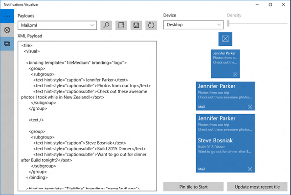

# Notifications Visualizer

Notifications Visualizer est une nouvelle application de plateforme Windows universelle (UWP) dans [le Store](https://www.microsoft.com/store/apps/notifications-visualizer/9nblggh5xsl1) qui permet aux développeurs de concevoir des vignettes dynamiques adaptatives pour Windows 10.

## Vue d’ensemble

L’application Notifications Visualizer fournit des aperçus visuels instantanés de votre vignette pendant que vous effectuez des modifications, similaires à la vue de l’éditeur/de la conception XAML de Visual Studio. L’application contrôle également les erreurs, ce qui vous permet de créer une charge utile de vignette valide.

Cette capture d’écran à partir de l’application montre la charge utile XML et la façon dont les tailles de vignette apparaissent sur un appareil sélectionné :

 

Avec Notifications Visualizer, vous pouvez créer et tester des charges utiles de vignettes adaptatives sans avoir à modifier et déployer l’application proprement dite. Une fois que vous avez créé une charge utile avec des résultats visuels satisfaisants, vous pouvez l’intégrer dans votre application. Pour plus d’informations, voir [Envoyer une notification par vignette locale](tiles-and-notifications-sending-a-local-tile-notification.md).

**Remarque** La simulation Notifications Visualizer du menu Démarrer de Windows n’est pas toujours tout à fait précise, et elle ne prend pas en charge certaines propriétés de charge utile comme [baseUri](https://msdn.microsoft.com/library/windows/apps/br208712). Une fois la conception de vignette voulue obtenue, testez-la en épinglant la vignette au menu Démarrer réel pour vérifier qu’elle s’affiche comme vous le souhaitez.

 

## Fonctionnalités

Notifications Visualizer est fourni avec quelques exemples de charges utiles pour montrer ce qu’il est possible de réaliser avec des vignettes dynamiques adaptatives et vous aider à démarrer. Vous pouvez tester les différentes options de texte, les gorupes/sous-groupes, les images d’arrière-plan, et vous pouvoir voir de quelle façon les vignettes s’adaptent aux différents écrans et appareils. Une fois les modifications effectuées, vous pouvez enregistrer votre charge utile mise à jour dans un fichier pour l’utiliser ultérieurement.

L’éditeur fournit des avertissements et des erreurs en temps réel. Par exemple, si la charge utile de votre application est limitée à 5 Ko maximum (limitation de la plateforme), Notifications Visualizer vous avertit si votre charge utile dépasse cette limite. Vous êtes averti en cas de noms ou de valeurs d’attributs incorrects, ce qui vous permet de déboguer les problèmes visuels.

Vous pouvez contrôler les propriétés des vignettes comme le nom complet, la couleur, les logos, ShowName, la valeur de badge. Ces options vous aident à comprendre instantanément de quelle façon les propriétés des vignettes et les charges utiles de notification des vignettes interagissent, et quels sont les résultats produits.

Cette capture d’écran de l’application montre l’éditeur de vignettes :

 

## Rubriques connexes

* [Obtenir Notifications Visualizer dans le Windows Store](https://www.microsoft.com/store/apps/notifications-visualizer/9nblggh5xsl1)
* [Créer des vignettes adaptatives](tiles-and-notifications-create-adaptive-tiles.md)
* [Modèles de vignette adaptative : schéma et documentation](tiles-and-notifications-adaptive-tiles-schema.md)
* [Vignettes et toasts (blog MSDN, en anglais)](http://blogs.msdn.com/b/tiles_and_toasts/)
* [Bibliothèque NotificationsExtensions (blog MSDN, en anglais)](http://blogs.msdn.com/b/tiles_and_toasts/archive/2015/08/20/introducing-notificationsextensions-for-windows-10.aspx)
 

 

<!--HONumber=May16_HO2-->

