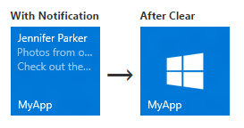

# Envoyer une notification par vignette locale


Les vignettes d’application principales de Windows 10 sont définies dans le manifeste de votre application, tandis que les vignettes secondaires sont créées et définies par programme par le code de votre application. Cet article décrit comment envoyer une notification par vignette locale à une vignette principale et une vignette secondaire à l’aide de modèles de vignette adaptative. (Une notification locale est une notification envoyée à partir du code d’application, par opposition à une notification qui fait l’objet d’une transmission de type push ou pull à partir d’un serveur web).


**Remarque** Pour plus d’informations, voir [Créer des vignettes adaptatives](tiles-and-notifications-create-adaptive-tiles.md) et [Modèles de vignette adaptative : schéma et conseils](tiles-and-notifications-adaptive-tiles-schema.md).

 

## <span id="Install_the_NuGet_package"></span><span id="install_the_nuget_package"></span><span id="INSTALL_THE_NUGET_PACKAGE"></span>Installation du package NuGet


Nous vous recommandons d’installer le [package NotificationsExtensions NuGet](https://www.nuget.org/packages/NotificationsExtensions.Win10/) qui simplifie les choses en générant les charges utiles de vignettes à l’aide d’objets au lieu de code XML brut.

Les exemples de code inclus dans cet article concernent C# avec le package NuGet [NotificationsExtensions](https://github.com/WindowsNotifications/NotificationsExtensions/wiki) installé. (Si vous préférez créer votre propre code XML, vous trouverez des exemples de code sans [NotificationsExtensions](https://github.com/WindowsNotifications/NotificationsExtensions/wiki) vers la fin de l’article.)

## <span id="Add_namespace_declarations"></span><span id="add_namespace_declarations"></span><span id="ADD_NAMESPACE_DECLARATIONS"></span>Ajouter des déclarations d’espace de noms


Pour accéder aux API de vignette, incluez l’espace de noms [**Windows.UI.Notifications**](https://msdn.microsoft.com/library/windows/apps/br208661). Nous vous recommandons également d’inclure l’espace de noms **NotificationsExtensions.Tiles** pour tirer parti de nos API d’assistance de vignette (vous devez installer le package NuGet [NotificationsExtensions](https://github.com/WindowsNotifications/NotificationsExtensions/wiki) pour accéder à ces API).

```
using Windows.UI.Notifications;
using NotificationsExtensions.Tiles; // NotificationsExtensions.Win10
```

## <span id="Create_the_notification_content"></span><span id="create_the_notification_content"></span><span id="CREATE_THE_NOTIFICATION_CONTENT"></span>Créer le contenu d’une notification


Dans Windows 10, les charges utiles de vignette sont définies à l’aide de modèles de vignette adaptative qui vous permettent de créer des dispositions visuelles personnalisées pour vos notifications. (Pour plus de possibilités avec les vignettes adaptatives, voir les articles [Créer des vignettes adaptatives](tiles-and-notifications-create-adaptive-tiles.md) et [Modèles de vignette adaptative](tiles-and-notifications-adaptive-tiles-schema.md).)

Cet exemple de code crée le contenu de vignette adaptative pour les vignettes moyennes et larges.

```
// In a real app, these would be initialized with actual data
string from = "Jennifer Parker";
string subject = "Photos from our trip";
string body = "Check out these awesome photos I took while in New Zealand!";
 
 
// Construct the tile content
TileContent content = new TileContent()
{
    Visual = new TileVisual()
    {
        TileMedium = new TileBinding()
        {
            Content = new TileBindingContentAdaptive()
            {
                Children =
                {
                    new TileText()
                    {
                        Text = from
                    },
 
                    new TileText()
                    {
                        Text = subject,
                        Style = TileTextStyle.CaptionSubtle
                    },
 
                    new TileText()
                    {
                        Text = body,
                        Style = TileTextStyle.CaptionSubtle
                    }
                }
            }
        },
 
        TileWide = new TileBinding()
        {
            Content = new TileBindingContentAdaptive()
            {
                Children =
                {
                    new TileText()
                    {
                        Text = from,
                        Style = TileTextStyle.Subtitle
                    },
 
                    new TileText()
                    {
                        Text = subject,
                        Style = TileTextStyle.CaptionSubtle
                    },
 
                    new TileText()
                    {
                        Text = body,
                        Style = TileTextStyle.CaptionSubtle
                    }
                }
            }
        }
    }
};
```

Le contenu de la notification se présente comme suit pour une vignette moyenne :


## <span id="Create_the_notification"></span><span id="create_the_notification"></span><span id="CREATE_THE_NOTIFICATION"></span>Créer la notification


Une fois que vous disposez de votre contenu de notification, vous devez créer un élément [**TileNotification**](https://msdn.microsoft.com/library/windows/apps/br208616). Le constructeur **TileNotification** prend un objet Windows Runtime [**XmlDocument**](https://msdn.microsoft.com/library/windows/apps/br208620) que vous pouvez obtenir à partir de la méthode **TileContent.GetXml** si vous utilisez [NotificationsExtensions](https://github.com/WindowsNotifications/NotificationsExtensions/wiki).

Cet exemple de code crée une notification pour une nouvelle vignette.

```
// Create the tile notification
var notification = new TileNotification(content.GetXml());
```

## <span id="Set_an_expiration_time_for_the_notification__optional_"></span><span id="set_an_expiration_time_for_the_notification__optional_"></span><span id="SET_AN_EXPIRATION_TIME_FOR_THE_NOTIFICATION__OPTIONAL_"></span>Définir un délai d’expiration pour la notification (facultatif)


Par défaut, les notifications locales par vignette et de badge n’expirent pas, alors que les notifications Push, périodiques et planifiées expirent après trois jours. Étant donné que le contenu de la vignette ne doit pas être conservé plus longtemps que nécessaire, il est recommandé de définir un délai d’expiration approprié pour votre application, en particulier sur les notifications locales par vignette et de badge.

Cet exemple de code crée une notification qui arrive à expiration et est supprimée de la vignette au bout de 10 minutes.

```
tileNotification.ExpirationTime = DateTimeOffset.UtcNow.AddMinutes(10);</code></pre></td>
</tr>
</tbody>
</table>
```

## <span id="Send_the_notification"></span><span id="send_the_notification"></span><span id="SEND_THE_NOTIFICATION"></span>Envoyer la notification


Bien que l’envoi local d’une notification par vignette soit simple, l’envoi de la notification à une vignette principale ou secondaire est légèrement différent.

**Vignette principale**

Pour envoyer une notification à une vignette principale, utilisez le [**TileUpdateManager**](https://msdn.microsoft.com/library/windows/apps/br208622) pour créer une mise à jour de vignette pour la vignette principale et envoyez la notification en appelant la méthode « Update ». Qu’elle soit visible ou non, la vignette principale de votre application existe toujours ; vous pouvez donc lui envoyer des notifications même si elle n’est pas épinglée. Si l’utilisateur épingle votre vignette principale ultérieurement, les notifications que vous avez envoyées seront alors affichées.

Cet exemple de code envoie une notification à une vignette principale.

<span codelanguage=""></span>
```
<colgroup>
<col width="100%" />
</colgroup>
<tbody>
<tr class="odd">
// And send the notification
TileUpdateManager.CreateTileUpdaterForApplication().Update(notification);
```

**Vignette secondaire**

Pour envoyer une notification à une vignette secondaire, assurez-vous d’abord que la vignette secondaire existe. Si vous essayez de créer une mise à jour pour une vignette secondaire qui n’existe pas (par exemple, si l’utilisateur a désépinglé la vignette secondaire), une exception est levée. Vous pouvez utiliser [**SecondaryTile.Exists**](https://msdn.microsoft.com/library/windows/apps/br242205)(tileId) pour détecter si votre vignette secondaire est épinglée, puis créer une mise à jour pour la vignette secondaire et envoyer la notification.

Cet exemple de code envoie une notification à une vignette secondaire.

```
// If the secondary tile is pinned
if (SecondaryTile.Exists("MySecondaryTile"))
{
    // Get its updater
    var updater = TileUpdateManager.CreateTileUpdaterForSecondaryTile("MySecondaryTile");
 
    // And send the notification
    updater.Update(notification);
}
```


## <span id="Clear_notifications_on_the_tile__optional_"></span><span id="clear_notifications_on_the_tile__optional_"></span><span id="CLEAR_NOTIFICATIONS_ON_THE_TILE__OPTIONAL_"></span>Effacer des notifications sur la vignette (facultatif)


Dans la plupart des cas, vous devez effacer une notification une fois que l’utilisateur a interagi avec ce contenu. Par exemple, lorsque l’utilisateur lance votre application, il peut être judicieux d’effacer toutes les notifications de la vignette. Si vos modifications sont temporaires, nous vous recommandons de définir un délai d’expiration au niveau de la notification au lieu de l’effacer explicitement.

Cet exemple de code permet d’effacer la notification par vignette.

```
TileUpdateManager.CreateTileUpdaterForApplication().Clear();</code></pre></td>
</tr>
</tbody>
</table>
```

Si la file d’attente est activée pour une vignette et qu’il y a des notifications en file d’attente, l’appel de la méthode Clear a pour effet de vider la file d’attente. Vous ne pouvez pas, cependant, effacer une notification via un serveur de votre application ; seul le code d’application local peut effacer des notifications.

Les notifications périodiques ou Push peuvent uniquement ajouter de nouvelles notifications ou remplacer les notifications existantes. Un appel local à la méthode Clear effacera la vignette, que les notifications aient été fournies ou non par le biais push, périodique ou local. Les notifications planifiées qui n’ont pas encore été affichées ne sont pas effacées par cette méthode.



## <span id="Next_steps"></span><span id="next_steps"></span><span id="NEXT_STEPS"></span>Étapes suivantes


**Utilisation de la file d’attente de notifications**

Maintenant que vous avez réalisé votre première mise à jour de vignette, vous pouvez développer les fonctionnalités de la vignette en activant une [file d’attente de notifications](https://msdn.microsoft.com/library/windows/apps/xaml/hh868234).

**Autres modes de remise des notifications**

Cet article vous montre comment envoyer la mise à jour de vignette sous forme de notification. Pour découvrir d’autres modes de remise de notification, y compris les notifications planifiées, périodiques et Push, voir [Remise de notifications](tiles-and-notifications-choosing-a-notification-delivery-method.md).

**Mode de remise XmlEncode**

Si vous n’utilisez pas [NotificationsExtensions](https://github.com/WindowsNotifications/NotificationsExtensions/wiki), ce mode de remise de notification représente une autre solution.

<span codelanguage=""></span>
```
<colgroup>
<col width="100%" />
</colgroup>
<tbody>
<tr class="odd">
public string XmlEncode(string text)
{
    StringBuilder builder = new StringBuilder();
    using (var writer = XmlWriter.Create(builder))
    {
        writer.WriteString(text);
    }

    return builder.ToString();
}
```

## <span id="Code_examples_without_NotificationsExtensions"></span><span id="code_examples_without_notificationsextensions"></span><span id="CODE_EXAMPLES_WITHOUT_NOTIFICATIONSEXTENSIONS"></span>Exemples de code sans NotificationsExtensions


Si vous préférez travailler avec du code XML brut à la place du package NuGet [NotificationsExtensions](https://github.com/WindowsNotifications/NotificationsExtensions/wiki), utilisez ces autres exemples de code pour les trois premiers exemples fournis dans cet article. Les exemples de code restants peuvent être utilisés avec [NotificationsExtensions](https://github.com/WindowsNotifications/NotificationsExtensions/wiki) ou avec du code XML brut.

Ajouter des déclarations d’espace de noms

```
using Windows.UI.Notifications;
using Windows.Data.Xml.Dom;
```

Créer le contenu d’une notification

```
// In a real app, these would be initialized with actual data
string from = "Jennifer Parker";
string subject = "Photos from our trip";
string body = "Check out these awesome photos I took while in New Zealand!";
 
 
// TODO - all values need to be XML escaped
 
 
// Construct the tile content as a string
string content = $@"
<tile>
    <visual>
 
        <binding template=&#39;TileMedium&#39;>
            <text>{from}</text>
            <text hint-style=&#39;captionSubtle&#39;>{subject}</text>
            <text hint-style=&#39;captionSubtle&#39;>{body}</text>
        </binding>
 
        <binding template=&#39;TileWide&#39;>
            <text hint-style=&#39;subtitle&#39;>{from}</text>
            <text hint-style=&#39;captionSubtle&#39;>{subject}</text>
            <text hint-style=&#39;captionSubtle&#39;>{body}</text>
        </binding>
 
    </visual>
</tile>";
```

Créer la notification

```
// Load the string into an XmlDocument
XmlDocument doc = new XmlDocument();
doc.LoadXml(content);
 
// Then create the tile notification
var notification = new TileNotification(doc);
```

## <span id="related_topics"></span>Rubriques connexes


* [Créer des vignettes adaptatives](tiles-and-notifications-create-adaptive-tiles.md)
* [Modèles de vignette adaptative : schéma et documentation](tiles-and-notifications-adaptive-tiles-schema.md)
* [NotificationsExtensions.Win10 (package NuGet)](https://www.nuget.org/packages/NotificationsExtensions.Win10/)
* [NotificationsExtensions sur GitHub](https://github.com/WindowsNotifications/NotificationsExtensions/wiki)
* [Exemple de code complet sur GitHub](https://github.com/WindowsNotifications/quickstart-sending-local-tile-win10)
* [**Espace de noms Windows.UI.Notifications**](https://msdn.microsoft.com/library/windows/apps/br208661)
* [Comment utiliser la file d’attente de notifications (XAML)](https://msdn.microsoft.com/library/windows/apps/xaml/hh868234)
* [Remise de notifications](tiles-and-notifications-choosing-a-notification-delivery-method.md)
 

 


<!--HONumber=Jun16_HO4-->


