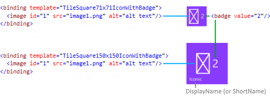

# <a name="special-tile-templates"></a>Modèles de vignette spéciaux
<link rel="stylesheet" href="https://az835927.vo.msecnd.net/sites/uwp/Resources/css/custom.css"> 

Les modèles de vignette spéciaux sont des modèles uniques qui sont animés, ou qui vous permettent simplement d’effectuer des opérations qui ne sont pas possibles avec des vignettes adaptatives. Chaque modèle de vignette spécial a été spécifiquement conçu pour Windows 10, sauf pour le modèle de vignette Icônes, modèle spécial classique qui a été mis à jour pour Windows 10. Cet article traite des trois modèles de vignette spéciaux: Icônes, Photos et Contacts.

## <a name="iconic-tile-template"></a>Modèle de vignette Icônes


Le modèle Icônes (également connu sous le nom de modèle «IconWithBadge») vous permet d’afficher une petite image dans le centre de la vignette. Windows10 prend en charge le modèle à la fois sur les téléphones et sur les tablettes/ordinateurs de bureau.


### <a name="how-to-create-an-iconic-tile"></a>Comment créer une vignette Icônes

Les étapes suivantes couvrent tout ce que vous devez savoir pour créer une vignette Icônes pour Windows10. D’un point de vue général, vous avez besoin de la ressource de votre image d’icône, puis vous envoyez une notification à la vignette à l’aide du modèle Icônes, et enfin vous envoyez une notification de badge qui fournit le numéro devant être affiché sur la vignette.


**Étape 1: créez vos ressources d’image au format PNG**

Créez les ressources d’icônes pour la vignette et placez-les dans votre projet avec vos autres ressources. Créez une icône d’au moins 200 x 200 pixels, qui peut être utilisée pour les petites et moyennes vignettes sur le téléphone et le bureau. Pour une meilleure expérience utilisateur, créez une icône pour chaque taille. Aucun remplissage n’est nécessaire sur ces ressources. Voir les détails de dimensionnement dans l’image présentée plus bas.

Enregistrez les ressources d’icônes au format PNG avec une transparence. Sur Windows Phone, chaque pixel non transparent s’affiche en blanc (RVB 255, 255, 255). Pour plus de cohérence et de simplicité, utilisez également le blanc pour les icônes du bureau.

Windows 10 sur tablette, ordinateur portable et ordinateur de bureau prend uniquement en charge les ressources d’icônes carrées. WindowsPhone prend en charge à la fois les ressources carrées et les ressources qui sont plus hautes que larges, jusqu’à un rapport de largeur:hauteur de 2:3. Ceci est donc très utile pour les images comme les icônes de téléphone.


Pour les ressources carrées, un centrage automatique est effectué dans le conteneur:


Pour les ressources non carrées, un centrage horizontal/vertical automatique et un alignement de la largeur/hauteur sont effectués dans le conteneur:


**Étape2: créez votre vignette de base**

Vous pouvez utiliser le modèle Icônes sur les vignettes principales et secondaires. Si vous l’utilisez sur une vignette secondaire, vous devez tout d’abord créer la vignette secondaire ou utiliser une vignette secondaire déjà épinglée. Les vignettes principales sont implicitement épinglées et peuvent toujours recevoir des notifications.

**Étape 3 : envoyez une notification à votre vignette**

Bien que cette étape puisse varier si la notification est envoyée localement ou par transmission des messages par le serveur, la charge utile XML que vous envoyez reste identique. Pour envoyer une notification à une vignette locale, créez un [**TileUpdater**](https://msdn.microsoft.com/library/windows/apps/br208628) pour votre vignette (vignette principale ou secondaire), puis envoyez une notification à la vignette qui utilise le modèle de vignette Icônes comme illustré ci-dessous. Dans l’idéal, vous devez également inclure des liaisons pour des tailles de vignettes grandes et larges à l’aide de [modèles de vignette adaptative](tiles-and-notifications-adaptive-tiles-schema.md).

Voici un exemple de code pour la charge utile XML:

```XML
<tile>
  <visual>

    <binding template="TileSquare150x150IconWithBadge">
      <image id="1" src="Iconic.png" alt="alt text"/>
    </binding>
    
    <binding template="TileSquare71x71IconWithBadge">
      <image id="1" src="Iconic.png" alt="alt text"/>
    </binding>

  </visual>
</tile>
```

Cette charge utile XML du modèle de vignette Icônes utilise un élément d’image qui pointe vers l’image que vous avez créée à l’étape 1. Votre vignette est maintenant prête à afficher le badge en regard de votre icône ; il ne reste plus qu’à envoyer des notifications de badge.

**Étape 4 : envoyez une notification de badge à votre vignette**

Comme à l’étape 3, cette étape peut varier si la notification est envoyée localement ou par transmission des messages par le serveur. Cependant, la charge utile XML que vous envoyez reste identique. Pour envoyer une notification de badge locale, créez un [**BadgeUpdater**](https://msdn.microsoft.com/library/windows/apps/br208537) pour votre vignette (vignette principale ou secondaire), puis envoyez une notification de badge avec la valeur souhaitée (ou effacez le badge).

Voici un exemple de code pour la charge utile XML :

```XML
<badge value="2"/>
```

Le badge de la vignette se met à jour en conséquence.

**Étape 5 : synthèse de tous les éléments**

L’image suivante illustre la façon dont les différentes API et charges utiles sont associées à chacun des aspects du modèle de vignette Icônes. Une [notification par vignette](https://msdn.microsoft.com/library/windows/apps/hh779724) (qui contient les éléments &lt;binding&gt;) est utilisée pour spécifier le modèle Icônes et les ressources d’image ; une [notification de badge](https://msdn.microsoft.com/library/windows/apps/hh779719) spécifie la valeur numérique, et les propriétés de vignette contrôlent le nom d’affichage de la vignette, la couleur et plus encore.



## <a name="photos-tile-template"></a>Modèle de vignette Photos


Le modèle de vignette Photos vous permet d’afficher un diaporama de photos sur votre vignette dynamique. Le modèle est pris en charge sur toutes les tailles de vignettes, y compris les petites, et se comporte de la même façon sur chacune des tailles. L’exemple ci-dessous montre cinq images de vignette moyenne qui utilisent le modèle Photos. Le modèle comprend un zoom et une animation en fondu enchaîné qui fait défiler les photos sélectionnées et s’exécute en boucle indéfiniment.


### <a name="how-to-use-the-photos-template"></a>Comment utiliser le modèle Photos

L’utilisation du modèle Photos est simple si vous avez installé la [bibliothèque Notifications](https://www.nuget.org/packages/Microsoft.Toolkit.Uwp.Notifications/). Même si vous pouvez utiliser du codeXML brut, nous vous recommandons vivement d’opter pour la bibliothèque Notifications afin de ne pas vous soucier de la génération de contenuXML ou d’échappementXML valide.

Windows Phone affiche jusqu’à 9photos dans un diaporama; les tablettes, ordinateurs portables et PC de bureau, jusqu’à12.

Pour plus d’informations sur l’envoi de la notification par vignette, voir l’[article Envoyer des notifications](tiles-badges-notifications.md).


```XML
<!--
 
To use the Photos template...
 
 - On any adaptive tile binding (like TileMedium or TileWide)
   - Set the hint-presentation attribute to "photos"
   - Add up to 12 images as children of the binding.
    
-->
 
<tile>
  <visual>
     
    <binding template="TileMedium" hint-presentation="photos">
       
      <image src="Assets/1.jpg" />
      <image src="ms-appdata:///local/Images/2.jpg"/>
      <image src="http://msn.com/images/3.jpg"/>
       
      <!--TODO: Can have 12 images total-->
       
    </binding>
     
    <!--TODO: Add bindings for other tile sizes-->
     
  </visual>
</tile>
```

```CSharp
/*
 
To use the Photos template...
 
 - On any TileBinding object
   - Set Content property to new instance of TileBindingContentPhotos
   - Add up to 12 images to Images property of TileBindingContentPhotos.
 
*/
 
TileContent content = new TileContent()
{
    Visual = new TileVisual()
    {
        TileMedium = new TileBinding()
        {
            Content = new TileBindingContentPhotos()
            {
                Images =
                {
                    new TileBasicImage() { Source = "Assets/1.jpg" },
                    new TileBasicImage() { Source = "ms-appdata:///local/Images/2.jpg" },
                    new TileBasicImage() { Source = "http://msn.com/images/3.jpg" }
 
                    // TODO: Can have 12 images total
                }
            }
        }
 
        // TODO: Add other tile sizes
    }
};
```

## <a name="people-tile-template"></a>Modèle de vignette Contacts


L’application Contacts dans Windows10 utilise un modèle de vignette spécial qui affiche une collection d’images dans des cercles qui peuvent glisser verticalement ou horizontalement sur la vignette. Ce modèle de vignette est disponible depuis Windows 10 Build 10572 et tout le monde est invité à l’utiliser dans son application.

Le modèle de vignette Contacts fonctionne sur les vignettes des tailles suivantes :

**Vignette moyenne** (TileMedium)


 

**Vignette large** (TileWide)


 

**Grande vignette (bureau uniquement)** (TileLarge)


 

Si vous utilisez la [bibliothèque Notifications](https://www.nuget.org/packages/Microsoft.Toolkit.Uwp.Notifications/), la seule chose à faire pour utiliser le modèle de vignette Contacts est de créer un objet *TileBindingContentPeople* pour votre contenu *TileBinding*. La classe *TileBindingContentPeople* a une propriété Images où vous ajoutez vos images.

Si vous utilisez du codeXML brut, attribuez à *hint-presentation* la valeur «people» et ajoutez vos images en tant qu’enfants de l’élément de liaison.

L’exemple de code C# suivant suppose que vous utilisez la [bibliothèque Notifications](https://www.nuget.org/packages/Microsoft.Toolkit.Uwp.Notifications/).

```CSharp
TileContent content = new TileContent()
{
    Visual = new TileVisual()
    {
        TileMedium = new TileBinding()
        {
            Content = new TileBindingContentPeople()
            {
                Images =
                {
                    new TileBasicImage() { Source = "Assets/ProfilePics/1.jpg" },
                    new TileBasicImage() { Source = "Assets/ProfilePics/2.jpg" },
                    new TileBasicImage() { Source = "Assets/ProfilePics/3.jpg" },
                    new TileBasicImage() { Source = "Assets/ProfilePics/4.jpg" },
                    new TileBasicImage() { Source = "Assets/ProfilePics/5.jpg" },
                    new TileBasicImage() { Source = "Assets/ProfilePics/6.jpg" },
                    new TileBasicImage() { Source = "Assets/ProfilePics/7.jpg" },
                    new TileBasicImage() { Source = "Assets/ProfilePics/8.jpg" },
                    new TileBasicImage() { Source = "Assets/ProfilePics/9.jpg" }
                }
            }
        }
    }
};
```

```XML
<tile>
  <visual>
 
    <binding template="TileMedium" hint-presentation="people">
      <image src="Assets/ProfilePics/1.jpg"/>
      <image src="Assets/ProfilePics/2.jpg"/>
      <image src="Assets/ProfilePics/3.jpg"/>
      <image src="Assets/ProfilePics/4.jpg"/>
      <image src="Assets/ProfilePics/5.jpg"/>
      <image src="Assets/ProfilePics/6.jpg"/>
      <image src="Assets/ProfilePics/7.jpg"/>
      <image src="Assets/ProfilePics/8.jpg"/>
      <image src="Assets/ProfilePics/9.jpg"/>
    </binding>
 
  </visual>
</tile>
```

Pour une expérience utilisateur optimale, nous vous recommandons d’indiquer le nombre de photos suivant pour chaque taille de vignette:

-   Vignette moyenne : 9 photos
-   Vignette large : 15 photos
-   Grande vignette : 20 photos

Avec ce nombre de photos, cela permet de garder quelques cercles vides, et la vignette ne sera pas trop occupée visuellement. N’hésitez pas à modifier le nombre de photos pour obtenir l’apparence qui correspond le mieux à vos besoins.

Pour envoyer la notification, voir [Choisir une méthode de remise de notification](tiles-and-notifications-choosing-a-notification-delivery-method.md).

## <a name="related-topics"></a>Rubriques connexes


* [Exemple de code complet sur GitHub](https://github.com/WindowsNotifications/quickstart-people-tile-template)
* [Bibliothèque Notifications](https://www.nuget.org/packages/Microsoft.Toolkit.Uwp.Notifications/)
* [Vignettes, badges et notifications](tiles-badges-notifications.md)
* [Créer des vignettes adaptatives](tiles-and-notifications-create-adaptive-tiles.md)
* [Modèles de vignette adaptative : schéma et documentation](tiles-and-notifications-adaptive-tiles-schema.md)
 

 


