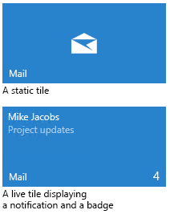

---
Découvrez comment utiliser les vignettes, badges, toasts et notifications pour fournir des points d’entrée dans votre application et maintenir les utilisateurs informés.
Vignettes, badges et notifications
ms.assetid: 48ee4328-7999-40c2-9354-7ea7d488c538
Vignettes, badges et notifications
template: detail.hbs
---

# Vignettes, badges et notifications pour les applications UWP

\[ Mise à jour pour les applications UWP sur Windows 10. Pour les articles sur Windows 8.x, voir la [documentation archivée](http://go.microsoft.com/fwlink/p/?linkid=619132). \]

Découvrez comment utiliser les vignettes, badges, toasts et notifications pour fournir des points d’entrée dans votre application et maintenir les utilisateurs informés.

<table>
<colgroup>
<col width="50%" />
<col width="50%" />
</colgroup>
<tbody>
<tr class="odd">
<td align="left"></td>
<td align="left">
Chaque application dispose d’une vignette. Une <em>vignette</em> est la représentation d’une application dans le menu Démarrer. Vous pouvez activer différentes tailles de vignettes (petite, moyenne, large et grande). Vous pouvez utiliser une <em>notification par vignette</em> pour mettre à jour la vignette afin de communiquer de nouvelles informations à l’utilisateur, telles que des titres d’actualités ou l’objet du dernier message non lu. Vous pouvez utiliser un <em>badge</em> ou un <em>badge de notification</em> pour fournir des informations d’état ou de résumé sous la forme d’un glyphe fourni par le système ou d’un nombre compris entre 1 et 99.

Une <em>notification toast</em> est une notification que votre application envoie à l’utilisateur par le biais d’un élément de l’interface utilisateur contextuelle appelé <em>toast</em> (ou <em>bannière</em>). La notification est visible, que l’utilisateur se trouve dans votre application ou non.

Une <em>notification Push</em>, ou <em>notification brute</em>, est une notification envoyée à votre application à partir du service de notifications Push Windows (WNS) ou d’une tâche en arrière-plan. Votre application peut répondre à ces notifications soit en informant l’utilisateur qu’un événement l’intéressant s’est produit (par le biais d’une mise à jour de badge, d’une mise à jour de vignette ou d’un toast), soit de la manière de votre choix.
</td>
</tr>
</tbody>
</table>

 
## Vignettes 
<table>
<colgroup>
<col width="50%" />
<col width="50%" />
</colgroup>
<thead>
<tr class="header">
<th align="left">Rubrique</th>
<th align="left">Description</th>
</tr>
</thead>
<tbody>
<tr class="odd">
<td align="left">
[Create tiles](tiles-and-notifications-creating-tiles.md)
</td>
<td align="left">
Personnalisez la vignette par défaut de votre application et fournissez des ressources pour différentes tailles d’écran.
</td>
</tr>
<tr class="even">
<td align="left">
[Create adaptive tiles](tiles-and-notifications-create-adaptive-tiles.md)
</td>
<td align="left">
Les modèles de vignette adaptative sont une nouvelle fonctionnalité de Windows 10, qui vous permet de concevoir votre propre contenu de notification par vignette à l’aide d’un langage de balisage simple et flexible adapté à différentes densités d’écran. Cet article vous indique comment créer des vignettes dynamiques adaptatives pour votre application de plateforme Windows universelle (UWP).
</td>
</tr>
<tr class="odd">
<td align="left">
[Adaptive tiles schema](tiles-and-notifications-adaptive-tiles-schema.md)
</td>
<td align="left">
Voici les éléments et attributs permettant de créer des vignettes adaptatives.
</td>
</tr>
<tr class="even">
<td align="left">
[Special tile templates](tiles-and-notifications-special-tile-templates-catalog.md)
</td>
<td align="left">
Les modèles de vignette spéciaux sont des modèles uniques qui sont animés, ou qui vous permettent simplement d’effectuer des opérations qui ne sont pas possibles avec des vignettes adaptatives.
</td>
</tr>
<tr class="odd">
<td align="left">
[App icon assets](tiles-and-notifications-app-assets.md)
</td>
<td align="left">
Les ressources d’icône d’application, qui s’affichent sous différentes formes dans le système d’exploitation Windows 10, sont les cartes de visite de votre application de plateforme Windows universelle (UWP). Ces recommandations précisent où apparaissent les ressources d’icône d’application dans le système et fournissent des conseils de conception détaillés pour vous aider à créer les plus belles icônes.
</td>
</tr>
</tbody>
</table>

## Notifications

<table>
<colgroup>
<col width="50%" />
<col width="50%" />
</colgroup>
<thead>
<tr class="header">
<th align="left">Rubrique</th>
<th align="left">Description</th>
</tr>
</thead>
<tbody>
<tr class="odd">
<td align="left">
[Adaptive and interactive toast notifications](tiles-and-notifications-adaptive-interactive-toasts.md)
</td>
<td align="left">
Les notifications toast adaptatives et interactives vous permettent de créer des notifications contextuelles flexibles présentant davantage de contenu, ainsi que des images incluses et une interaction utilisateur facultatives.
</td>
</tr>
<tr class="even">
<td align="left">
[Notifications Visualizer](tiles-and-notifications-notifications-visualizer.md)
</td>
<td align="left">
Notifications Visualizer est une nouvelle application de plateforme Windows universelle (UWP) dans [the Store](https://www.microsoft.com/store/apps/notifications-visualizer/9nblggh5xsl1) qui permet aux développeurs de concevoir des vignettes dynamiques adaptatives pour Windows 10.
</td>
</tr>
<tr class="odd">
<td align="left">
[Choose a notification delivery method](tiles-and-notifications-choosing-a-notification-delivery-method.md)
</td>
<td align="left">
Ce article présente les quatre options de notification—locale, planifiée, périodique et Push—disponibles pour remettre des mises à jour de vignette et de badge, ainsi que du contenu de notification toast.
</td>
</tr>
<tr class="even">
<td align="left">
[Send a local tile notification](tiles-and-notifications-sending-a-local-tile-notification.md)
</td>
<td align="left">
Cet article décrit comment envoyer une notification par vignette locale à une vignette principale et une vignette secondaire à l’aide de modèles de vignette adaptative.
</td>
</tr>
<tr class="odd">
<td align="left">
[Periodic notification overview](tiles-and-notifications-periodic-notification-overview.md)
</td>
<td align="left">
Les notifications périodiques, également appelées notifications interrogées, mettent à jour les vignettes et les badges à intervalle fixe en téléchargeant du contenu à partir d’un service cloud.
</td>
</tr>
<tr class="even">
<td align="left">
[Windows Push Notification Services (WNS) overview](tiles-and-notifications-windows-push-notification-services--wns--overview.md)
</td>
<td align="left">
Les services de notifications Push Windows (WNS) permettent aux développeurs tiers d’envoyer des mises à jour de toast, de vignette et de badge, ainsi que des mises à jour brutes à partir de leur propre service cloud. Il en résulte un mécanisme fiable et optimal de remise des nouvelles mises à jour aux utilisateurs.
</td>
</tr>
<tr class="odd">
<td align="left">
[Code generated by the push notification wizard](tiles-and-notifications-the-code-generated-by-the-push-notification-wizard.md)
</td>
<td align="left">
Grâce à un Assistant Visual Studio, vous pouvez générer des notifications Push à partir d’un service mobile créé par le biais de Microsoft Azure Mobile Services. L’Assistant Visual Studio génère du code qui devrait vous aider à démarrer. Cette rubrique explique la façon dont l’Assistant modifie votre projet, les opérations effectuées par le code généré, le mode d’utilisation de ce code et les étapes à suivre ensuite pour tirer le meilleur parti des notifications Push. Voir [Windows Push Notification Services (WNS) overview](tiles-and-notifications-windows-push-notification-services--wns--overview.md).
</td>
</tr>
<tr class="even">
<td align="left">
[Raw notification overview](tiles-and-notifications-raw-notification-overview.md)
</td>
<td align="left">
Les notifications brutes sont des notifications Push courtes à usage général. Elles ont une finalité exclusivement didactique et n’incluent aucun composant d’interface utilisateur. Comme dans le cas d’autres notifications Push, la fonctionnalité WNS transmet les notifications brutes de votre service cloud à votre application.
</td>
</tr>
</tbody>
</table>

 

 

 

<!--HONumber=Mar16_HO1-->

