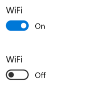

# Boutons bascule

Le bouton bascule représente un commutateur physique qui permet à l’utilisateur d’activer ou de désactiver des options. Utilisez des contrôles **ToggleSwitch** pour présenter aux utilisateurs exactement deux options qui s’excluent mutuellement (comme activé/désactivé), de sorte que la sélection d’une option se traduise par une action immédiate.

<span class="sidebar_heading" style="font-weight: bold;">API importantes</span>

-   [**Classe ToggleSwitch**](https://msdn.microsoft.com/library/windows/apps/windows.ui.xaml.controls.toggleswitch.aspx)
-   [**Propriété IsOn**](https://msdn.microsoft.com/library/windows/apps/windows.ui.xaml.controls.toggleswitch.ison.aspx)
-   [**Événement Toggled**](https://msdn.microsoft.com/library/windows/apps/windows.ui.xaml.controls.toggleswitch.toggled.aspx)

## Est-ce le contrôle approprié ?

Utilisez un bouton bascule pour les opérations binaires qui prennent effet dès que l’utilisateur change l’état du bouton. Par exemple, vous pouvez utiliser un bouton bascule pour activer ou désactiver des services ou des composants matériels, comme le WiFi :



Si un commutateur physique est adapté à l’action, un bouton bascule est probablement le meilleur contrôle à utiliser.

Après que l’utilisateur active ou désactive le commutateur, il est préférable que l’action correspondante soit effectuée immédiatement.

### Choix entre le bouton bascule et la case à cocher

Le bouton bascule et la case à cocher peuvent tous deux convenir à certaines actions. Pour déterminer le contrôle le mieux approprié, suivez ces conseils :

-   Utilisez un bouton bascule pour les paramètres binaires impliquant des modifications qui deviennent immédiatement effectives une fois que l’utilisateur les a apportées.

    

    Dans l’exemple précédent, il est évident dans le cas du bouton bascule que la fonctionnalité sans fil est activée. Mais pour la case à cocher, l’utilisateur doit se demander si la fonctionnalité sans fil est en marche ou s’il doit activer la case à cocher pour la mettre en marche.

-   Utilisez une case à cocher lorsque l’utilisateur doit réaliser des étapes supplémentaires afin de rendre effectives les modifications. À titre d’exemple, si l’utilisateur doit cliquer sur un bouton « Envoyer » ou « Suivant » pour appliquer les modifications, utilisez une case à cocher.

    

-   Utilisez des cases à cocher ou une [zone de liste](lists.md) lorsque l’utilisateur peut sélectionner plusieurs éléments :

    

## Exemples

Boutons bascule dans les paramètres généraux de l’application Actualités.


Boutons bascule dans les paramètres du menu Démarrer dans Windows.


## Créer un bouton bascule

Voici comment créer un bouton bascule simple. Ce code XAML crée le bouton bascule WiFi présenté précédemment.

```xaml
<ToggleSwitch x:Name="wiFiToggle" Header="Wifi"/>
```
Voici comment créer le même bouton bascule à l’aide de code.

```csharp
ToggleSwitch wiFiToggle = new ToggleSwitch();
wiFiToggle.Header = "WiFi";

// Add the toggle switch to a parent container in the visual tree.
stackPanel1.Children.Add(wiFiToggle);
```

### IsOn

Le commutateur peut être activé ou désactivé. Utilisez la propriété [**IsOn**](https://msdn.microsoft.com/library/windows/apps/windows.ui.xaml.controls.toggleswitch.ison.aspx) pour déterminer l’état du commutateur. Lorsque le commutateur est utilisé pour contrôler l’état d’une autre propriété binaire, vous pouvez utiliser une liaison, comme illustré ici.

```
<StackPanel Orientation="Horizontal">
    <ToggleSwitch x:Name="ToggleSwitch1" IsOn="True"/>
    <ProgressRing IsActive="{x:Bind ToggleSwitch1.IsOn, Mode=OneWay}" Width="130"/>
</StackPanel>
```

### Toggled

Dans les autres cas, vous pouvez gérer l’événement [**Toggled**](https://msdn.microsoft.com/library/windows/apps/windows.ui.xaml.controls.toggleswitch.toggled.aspx) afin de répondre aux modifications de l’état.

Cet exemple indique comment ajouter un gestionnaire d’événements Toggled en XAML et à l’aide de code. L’événement Toggled est géré de façon à activer ou désactiver un anneau de progression et à en modifier la visibilité.

```xaml
<ToggleSwitch x:Name="toggleSwitch1" IsOn="True" 
              Toggled="ToggleSwitch_Toggled"/>
```

Voici comment créer le même bouton bascule à l’aide de code.

```csharp
// Create a new toggle switch and add a Toggled event handler.
ToggleSwitch toggleSwitch1 = new ToggleSwitch();
toggleSwitch1.Toggled += ToggleSwitch_Toggled;

// Add the toggle switch to a parent container in the visual tree.
stackPanel1.Children.Add(toggleSwitch1);
```

Voici le gestionnaire de l’événement Toggled.

```csharp
private void ToggleSwitch_Toggled(object sender, RoutedEventArgs e)
{
    ToggleSwitch toggleSwitch = sender as ToggleSwitch;
    if (toggleSwitch != null)
    {
        if (toggleSwitch.IsOn == true)
        {
            progress1.IsActive = true;
            progress1.Visibility = Visibility.Visible;
        }
        else
        {
            progress1.IsActive = false;
            progress1.Visibility = Visibility.Collapsed;
        }
    }
}
```

### Étiquettes On/Off

Par défaut, le bouton bascule inclut des étiquettes On et Off littérales, qui sont localisées automatiquement. Vous pouvez remplacer ces étiquettes en définissant les propriétés [**OnContent**](https://msdn.microsoft.com/library/windows/apps/windows.ui.xaml.controls.toggleswitch.oncontent.aspx) et [**OffContent**](https://msdn.microsoft.com/library/windows/apps/windows.ui.xaml.controls.toggleswitch.offcontent.aspx).

Cet exemple remplace les étiquettes On/Off par des étiquettes Show/Hide.  

```xaml
<ToggleSwitch x:Name="imageToggle" Header="Show images"
              OffContent="Show" OnContent="Hide" 
              Toggled="ToggleSwitch_Toggled"/>
```

Vous pouvez également utiliser un contenu plus complexe en définissant les propriétés [**OnContentTemplate**](https://msdn.microsoft.com/library/windows/apps/windows.ui.xaml.controls.toggleswitch.oncontenttemplate.aspx) et [**OffContentTemplate**](https://msdn.microsoft.com/library/windows/apps/windows.ui.xaml.controls.toggleswitch.offcontenttemplate.aspx).

## Recommandations

-   Remplacez les étiquettes « Activé » et « Désactivé » quand il en existe de plus spécifiques pour le paramètre. S’il existe des étiquettes courtes (de 3 ou 4 caractères) qui représentent des choix binaires plus pertinents pour un paramètre donné, utilisez-les. Par exemple, vous pouvez utiliser « Show/Hide » si le paramètre offre la possibilité d’afficher des images. L’utilisation d’étiquettes plus précises peut contribuer à faciliter la localisation de l’interface utilisateur.
-   Évitez de remplacer les étiquettes On et Off, sauf si vous y êtes tenu ; utilisez les étiquettes par défaut, à moins que la situation n’appelle des étiquettes personnalisées.
-   Les étiquettes ne doivent pas contenir plus de 4 caractères.

## Articles connexes

[**ToggleSwitch**](https://msdn.microsoft.com/library/windows/apps/hh701411)
- [Cases d’option](radio-button.md)
- [Boutons bascule](toggles.md)
- [Cases à cocher](checkbox.md)

**Pour les développeurs (XAML)**
- [**Classe ToggleSwitch**](https://msdn.microsoft.com/library/windows/apps/br209712)


<!--HONumber=Mar16_HO1-->


