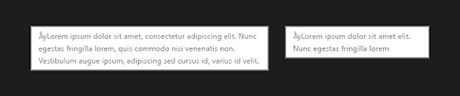
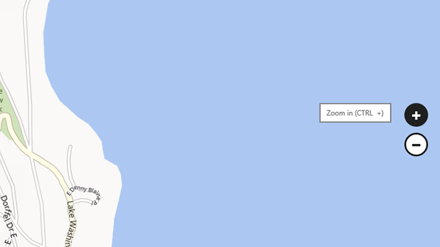

# Info-bulles

\[ Mise à jour pour les applications UWP sur Windows 10. Pour les articles sur Windows 8.x, voir la [documentation archivée](http://go.microsoft.com/fwlink/p/?linkid=619132). \]

Une info-bulle est une brève description qui est liée à un autre contrôle ou objet. Les info-bulles aident à comprendre des objets peu familiers qui ne sont pas directement décrits dans l’interface utilisateur. Une info-bulle s’affiche automatiquement lorsque l’utilisateur appuie de façon prolongée ou pointe avec sa souris sur un contrôle. Elle disparaît lorsque l’utilisateur déplace son doigt, le pointeur de la souris ou le stylet.

**API importantes**

-   [**Classe ToolTip**](https://msdn.microsoft.com/library/windows/apps/br227608)

##      Exemple

##      Est-ce le contrôle approprié ?

Une info-bulle est une brève description qui est liée à un autre contrôle ou objet. Les info-bulles aident à comprendre des objets peu familiers qui ne sont pas directement décrits dans l’interface utilisateur. Une info-bulle s’affiche automatiquement lorsque l’utilisateur appuie de façon prolongée ou pointe avec sa souris sur un contrôle. L’info-bulle disparaît lorsque l’utilisateur déplace son doigt, le pointeur de la souris ou le stylet.

Utilisez une info-bulle pour fournir plus d’informations sur un contrôle avant d’inviter l’utilisateur à effectuer une action. Vous pouvez également utiliser une info-bulle pour afficher l’élément qui se trouve sous le doigt de l’utilisateur au moment où il appuie sur l’écran, afin qu’il sache où il se trouve. (Efforcez-vous d’abord de faire en sorte qu’il n’y ait aucune ambiguïté possible, en utilisant par exemple un contrôle plus grand, plus d’espace ou en appliquant des styles à l’état actif/pointé du contrôle.)

Quand utiliser une info-bulle Pour vous décider, posez-vous les questions suivantes :

-   **L’information à afficher est-elle basée sur une action de pointage ?**

    Si ce n’est pas le cas, utilisez un autre contrôle. Les info-bulles doivent uniquement être affichées par une action de l’utilisateur ; ne les laissez jamais s’afficher d’elles-mêmes.

-   **Le contrôle a-t-il une étiquette avec un libellé ?**

    Si ce n’est pas le cas, utilisez une info-bulle pour l’indiquer. Attribuer une étiquette à la plus grande partie des contrôles est une bonne habitude de programmation et pour ceci, vous n’avez pas besoin d’info-bulles. Les contrôles et les commandes des barres d’outils doivent toujours être accompagnés d’une info-bulle.

-   **Un objet a-t-il besoin d’une description plus détaillée ou d’informations complémentaires ?**

    Si c’est le cas, utilisez une info-bulle. Mais le texte doit être complémentaire, c’est-à-dire non essentiel aux tâches principales. S’il est essentiel, mettez-le directement dans l’interface utilisateur de sorte que les utilisateurs le trouvent sans peine.

-   **L’information complémentaire est-elle une erreur, un avertissement ou un état ?**

    Si c’est le cas, utilisez un autre élément d’interface utilisateur, tel un menu volant.

-   **Les utilisateurs doivent-ils interagir avec l’info-bulle ?**

    Le cas échéant, utilisez un autre contrôle. Il est impossible d’interagir avec une info-bulle parce qu’elle disparaît lorsqu’on déplace la souris.

-   **Les utilisateurs ont-ils besoin d’imprimer l’information complémentaire ?**

    Le cas échéant, utilisez un autre contrôle.

-   **Les utilisateurs pourraient-ils être ennuyés ou gênés par les info-bulles ?**

    Si cela peut être le cas, envisagez une autre solution, notamment de ne rien ajouter du tout. Si les info-bulles sont susceptibles de gêner l’utilisateur, permettez-lui de les désactiver.

Un bon moyen d’utiliser les info-bulles consiste à afficher un aperçu du site web lié lorsque les utilisateurs appuient sur un lien hypertexte.

##      Pratiques conseillées et déconseillées

-   Utilisez les info-bulles avec parcimonie (ou pas du tout). Les info-bulles sont une interruption. Une info-bulle peut être aussi distrayante qu’une fenêtre contextuelle. Dès lors, utilisez-les seulement si elles apportent un plus.
-   Veillez à ce que le texte de l’info-bulle soit concis. Les info-bulles sont adaptées aux phrases courtes et aux fragments de phrases. Les blocs de texte plus longs sont difficiles à lire et encombrants.
-   Veillez à ce que l’information complémentaire soit utile et pertinente. Le texte de l’info-bulle doit être instructif. N’écrivez pas quelque chose qui est évident ou qui apparaît déjà à l’écran. Le texte de l’info-bulle n’étant pas toujours visible, il doit apporter une information complémentaire que l’utilisateur n’est pas obligé de lire. Les informations importantes doivent être communiquées via un étiquetage explicite des contrôles ou via un texte complémentaire placé directement dans l’interface utilisateur.
-   Utilisez les images de façon appropriée. Il est parfois préférable d’utiliser une image dans une info-bulle. Par exemple, quand l’utilisateur touche un lien hypertexte, vous pouvez utiliser une info-bulle pour afficher un aperçu de la page liée.
-   N’utilisez pas d’info-bulle pour afficher du texte déjà visible dans l’interface utilisateur. Par exemple, ne placez pas sur un bouton une info-bulle dont le texte est identique à celui du bouton, à moins que le fait de toucher le bouton ne masque le texte.
-   Ne placez pas de contrôles interactifs à l’intérieur de l’info-bulle.
-   Ne placez pas d’images qui semblent être interactives à l’intérieur de l’info-bulle.

##    Indications d’utilisation supplémentaires

Les info-bulles doivent être utilisées avec parcimonie, et uniquement quand elles aident l’utilisateur à accomplir une tâche. En règle générale, si les informations sont déjà disponibles autre part, n’ajoutez pas une info-bulle. Une info-bulle utile donne un éclairage sur une action qui n’est pas bien expliquée.

Utilisez une info-bulle pour fournir plus d’informations sur un contrôle avant d’inviter l’utilisateur à effectuer une action. Vous pouvez également utiliser une info-bulle pour afficher l’élément qui se trouve sous le doigt de l’utilisateur au moment où ce dernier appuie sur l’écran, afin qu’il sache où il se trouve.

##  Articles connexes

* [**Classe ToolTip**](https://msdn.microsoft.com/library/windows/apps/br227608)

 

 

<!--HONumber=Mar16_HO1-->
