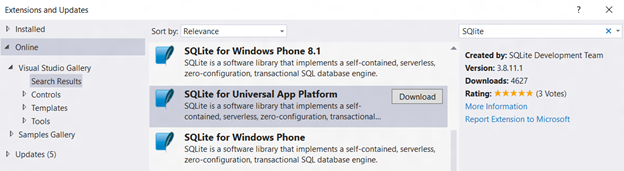

# Bases de données SQLite

\[ Mise à jour pour les applications UWP sur Windows10. Pour les articles sur Windows8.x, voir l’[archive](http://go.microsoft.com/fwlink/p/?linkid=619132). \]

SQLite est un moteur de base de données intégré, sans serveur. Cet article explique comment utiliser la bibliothèque SQLite incluse dans le Kit de développement logiciel (SDK), empaqueter votre propre bibliothèque SQLite dans une application Windows universelle ou la générer à partir de la source.

## Qu’est-ce que SQLite et quand l’utiliser ?

SQLite est une base de données open source intégrée, sans serveur. Au fil des ans, elle s’est imposée comme la technologie dominante côté appareil pour le stockage de données sur de nombreuses plateformes et appareils. La plateforme Windows universelle (UWP) prend en charge et recommande SQLite pour le stockage local sur toutes les familles d’appareils Windows 10.

SQLite convient parfaitement aux applications de téléphone, aux applications intégrées pour Windows10 IoT Standard (IoT Standard), et sert de cache pour les données de base de données relationnelle d’entreprise (RDBS). SQLite répond à la plupart des besoins d’accès aux données locales, sauf en cas d’écritures simultanées ou de données trop volumineuses, scénarios peu probable avec la plupart des applications.

Dans les applications de jeu et de lecture de contenus multimédias, SQLite peut également être utilisé comme format de fichier pour stocker les catalogues ou d’autres ressources, telles que les niveaux d’un jeu, qui peuvent être téléchargés en l’état à partir d’un serveur web.

## Ajout de SQLite à un projet d’application UWP

Il existe trois façons d’ajouter SQLite à un projet UWP.

1.  [Utilisation du Kit de développement logiciel (SDK) SQLite](#using-the-sdk-sqlite)
2.  [Inclusion de SQLite dans le package d’application](#including-sqlite-in-the-app-package)
3.  [Création d’une bibliothèque SQLite à partir de la source dans Visual Studio](#building-sqlite-from-source-in-visual-studio)

### Utilisation du Kit de développement logiciel (SDK) SQLite

Vous pouvez, si vous le souhaitez, utiliser la bibliothèque SQLite incluse dans le SDK UWP pour réduire la taille de votre package d’application, auquel cas la plateforme se chargera de la mise à jour périodique de la bibliothèque. L’utilisation de la bibliothèque SQLite du SDK présente également des avantages en termes de performances, avec notamment des temps de démarrage plus rapides dans la mesure où la bibliothèque SQLite sera très probablement déjà chargée dans la mémoire pour être utilisée par les composants système.

Pour référencer le Kit de développement logiciel (SDK) SQLite, incluez l’en-tête suivant dans votre projet. L’en-tête contient également la version de SQLite prise en charge dans la plateforme.

`#include <winsqlite/winsqlite3.h>`

Configurer le projet pour créer un lien vers winsqlite3.lib. Dans l’**Explorateur de solutions**, cliquez avec le bouton droit sur votre projet. Sélectionnez **Propriétés** &gt;**Éditeur de liens** &gt;**Entrée**, puis ajoutez winsqlite3.lib à **Dépendances supplémentaires**.

### 2. Inclusion de SQLite dans le package d’application

Vous pouvez, si vous le souhaitez, créer un package de votre propre bibliothèque au lieu d’utiliser la version du SDK. Vous pouvez par exemple utiliser une version de bibliothèque SQLite différente de celle incluse dans le SDK sur vos clients multiplateformes.

Installez la bibliothèque SQLite sur l’extension Visual Studio de plateforme Windows universelle disponible sur SQLite.org ou à l’aide de l’outil Extensions et mises à jour.

Une fois l’extension installée, référencez le fichier d’en-tête suivant dans votre code.

`#include <sqlite3.h>`

### 3. Création d’une bibliothèque SQLite à partir de la source dans Visual Studio

Vous pouvez, si vous le souhaitez, compiler votre propre fichier binaire SQLite pour utiliser [diverses options de compilateur](http://www.sqlite.org/compile.html) et réduire la taille du fichier, régler les performances de la bibliothèque ou adapter le jeu de fonctionnalités de votre application. SQLite fournit des options de configuration de plateforme, définir des valeurs de paramètres par défaut, définir des limites de taille, contrôler les caractéristiques d’exploitation, activer les fonctionnalités normalement désactivées, désactiver les fonctionnalités normalement activées, omettre des fonctionnalités, activer l’analyse et le débogage, et gérer le comportement d’allocation de mémoire sur Windows.

*Ajout d’une source d’un projet Visual Studio*

Le code source SQLite est disponible en téléchargement sur la [page de téléchargement SQLite.org](https://www.sqlite.org/download.html). Ajoutez ce fichier au projet Visual Studio de l’application dans laquelle vous souhaitez utiliser SQLite.

*Configurer des préprocesseurs*

Utilisez toujours SQLITE\_OS\_WINRT et SQLITE\_API=\_\_declspec(dllexport) en plus des autres [options de moment de compilation](http://www.sqlite.org/compile.html).

## Gestion d’une base de données SQLite

Il est possible de créer, de mettre à jour et de supprimer des bases de données SQLite avec les API C SQLite. Vous trouverez plus d’informations sur l’API C SQLite dans la page [Introduction To The SQLite C/C++ Interface (anglais)](http://www.sqlite.org/cintro.html) de SQLite.org.

Pour bien comprendre le fonctionnement de SQLite, vous devez tout reprendre à partir de la tâche principale de la base de données SQL qui consiste à évaluer les instructions SQL. Deux objets sont à garder à l’esprit:

-   [Handle de connexion de base de données](https://www.sqlite.org/c3ref/sqlite3.html)
-   [Objet d’instruction préparé](https://www.sqlite.org/c3ref/stmt.html)

Six interfaces permettent d’effectuer des opérations de base de données sur ces objets:

-   [sqlite3\_open()](https://web.archive.org/web/20141228070025/http:/www.sqlite.org/c3ref/open.html)
-   [sqlite3\_prepare()](https://web.archive.org/web/20141228070025/http:/www.sqlite.org/c3ref/prepare.html)
-   [sqlite3\_step()](https://web.archive.org/web/20141228070025/http:/www.sqlite.org/c3ref/step.html)
-   [sqlite3\_column()](https://web.archive.org/web/20141228070025/http:/www.sqlite.org/c3ref/column_blob.html)
-   [sqlite3\_finalize()](https://web.archive.org/web/20141228070025/http:/www.sqlite.org/c3ref/finalize.html)
-   [sqlite3\_close()](https://web.archive.org/web/20141228070025/http:/www.sqlite.org/c3ref/close.html)

 

 

<!--HONumber=Aug16_HO3-->

