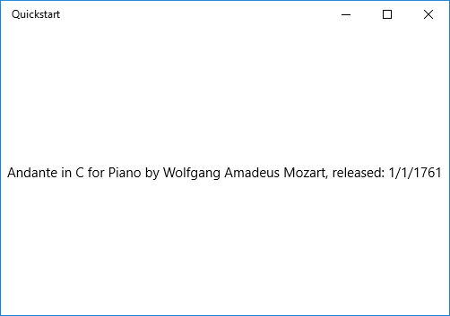
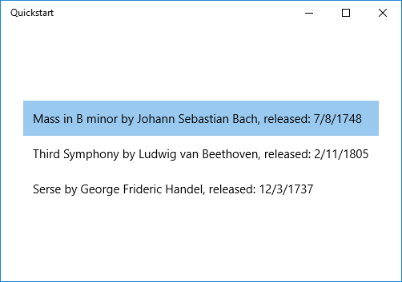

# <a name="data-binding-overview"></a>Vue d’ensemble de la liaison de données

Cette rubrique vous montre comment lier un contrôle (ou un autre élément d’interface utilisateur) à un élément individuel ou lier un contrôle d’éléments à ou un contrôle de liste à une collection d’éléments dans une application de plateforme Windows universelle (UWP). Elle explique également comment contrôler le rendu des éléments, implémenter un affichage détails en fonction d’une sélection et convertir des données pour l’affichage. Pour obtenir des informations plus détaillées, consultez [Présentation détaillée de la liaison de données](data-binding-in-depth.md).

## <a name="prerequisites"></a>Connaissances requises

Dans cette rubrique, nous partons du principe que vous savez créer une application UWP de base. Pour obtenir des instructions sur la création de votre première application UWP, voir [Prise en main des applications Windows](https://developer.microsoft.com/windows/getstarted).

## <a name="create-the-project"></a>Créer le projet

Commencez par créer un projet **Application vide (universelle Windows)**. Nommez-le «Quickstart».

## <a name="binding-to-a-single-item"></a>Liaison à un élément unique

Chaque liaison se compose d’une cible et d’une source de liaison. En règle générale, la cible est une propriété d’un contrôle ou d’un autre élément d’interface utilisateur, et la source est une propriété d’une instance de classe (un modèle de données ou un modèle d’affichage). Cet exemple montre comment lier un contrôle à un élément unique. La cible est la propriété **Text** d’un contrôle **TextBlock**. La source est une instance d’une classe simple nommée **Recording**, qui représente un enregistrement audio. Examinons d’abord la classe.

Si vous utilisez c# ou C++ / CX, puis ajoutez une nouvelle classe à votre projet et nommez la classe **l’enregistrement**.

Si vous utilisez [C++ / WinRT](/windows/uwp/cpp-and-winrt-apis/intro-to-using-cpp-with-winrt), puis ajouter de nouveaux éléments de **Fichier Midl (.idl)** au projet, nommé comme indiqué dans C++ / WinRT exemple l’intégralité du code ci-dessous. Remplacez le contenu de ces nouveaux fichiers par le code [MIDL 3.0](/uwp/midl-3/intro) indiqué dans la liste, générez le projet pour générer `Recording.h` et `.cpp` et `RecordingViewModel.h` et `.cpp`, puis ajoutez le code pour les fichiers générés pour correspondre à la liste. Pour plus d’informations sur ces fichiers générés et comment les copier dans votre projet, consultez [contrôles XAML; liaison à C++ / WinRT propriété](/windows/uwp/cpp-and-winrt-apis/binding-property).

```csharp
namespace Quickstart
{
    public class Recording
    {
        public string ArtistName { get; set; }
        public string CompositionName { get; set; }
        public DateTime ReleaseDateTime { get; set; }
        public Recording()
        {
            this.ArtistName = "Wolfgang Amadeus Mozart";
            this.CompositionName = "Andante in C for Piano";
            this.ReleaseDateTime = new DateTime(1761, 1, 1);
        }
        public string OneLineSummary
        {
            get
            {
                return $"{this.CompositionName} by {this.ArtistName}, released: "
                    + this.ReleaseDateTime.ToString("d");
            }
        }
    }
    public class RecordingViewModel
    {
        private Recording defaultRecording = new Recording();
        public Recording DefaultRecording { get { return this.defaultRecording; } }
    }
}
```

```cppwinrt
// Recording.idl
namespace Quickstart
{
    runtimeclass Recording
    {
        Recording(String artistName, String compositionName, Windows.Globalization.Calendar releaseDateTime);
        String ArtistName{ get; };
        String CompositionName{ get; };
        Windows.Globalization.Calendar ReleaseDateTime{ get; };
        String OneLineSummary{ get; };
    }
}

// RecordingViewModel.idl
import "Recording.idl";

namespace Quickstart
{
    runtimeclass RecordingViewModel
    {
        RecordingViewModel();
        Quickstart.Recording DefaultRecording{ get; };
    }
}

// Recording.h
// Add these fields:
...
#include <sstream>
...
private:
    std::wstring m_artistName;
    std::wstring m_compositionName;
    Windows::Globalization::Calendar m_releaseDateTime;
...

// Recording.cpp
// Implement like this:
...
Recording::Recording(hstring const& artistName, hstring const& compositionName, Windows::Globalization::Calendar const& releaseDateTime) :
    m_artistName{ artistName.c_str() },
    m_compositionName{ compositionName.c_str() },
    m_releaseDateTime{ releaseDateTime } {}

hstring Recording::ArtistName(){ return hstring{ m_artistName }; }
hstring Recording::CompositionName(){ return hstring{ m_compositionName }; }
Windows::Globalization::Calendar Recording::ReleaseDateTime(){ return m_releaseDateTime; }

hstring Recording::OneLineSummary()
{
    std::wstringstream wstringstream;
    wstringstream << m_compositionName.c_str();
    wstringstream << L" by " << m_artistName.c_str();
    wstringstream << L", released: " << m_releaseDateTime.MonthAsNumericString().c_str();
    wstringstream << L"/" << m_releaseDateTime.DayAsString().c_str();
    wstringstream << L"/" << m_releaseDateTime.YearAsString().c_str();
    return hstring{ wstringstream.str().c_str() };
}
...

// RecordingViewModel.h
// Add this field:
...
#include "Recording.h"
...
private:
    Quickstart::Recording m_defaultRecording{ nullptr };
...

// RecordingViewModel.cpp
// Implement like this:
...
Quickstart::Recording RecordingViewModel::DefaultRecording()
{
    Windows::Globalization::Calendar releaseDateTime;
    releaseDateTime.Year(1761);
    releaseDateTime.Month(1);
    releaseDateTime.Day(1);
    m_defaultRecording = winrt::make<Recording>(L"Wolfgang Amadeus Mozart", L"Andante in C for Piano", releaseDateTime);
    return m_defaultRecording;
}
...
```

```cppcx
// Recording.h
#include <sstream>
namespace Quickstart
{
    public ref class Recording sealed
    {
    private:
        Platform::String^ artistName;
        Platform::String^ compositionName;
        Windows::Globalization::Calendar^ releaseDateTime;
    public:
        Recording(Platform::String^ artistName, Platform::String^ compositionName,
            Windows::Globalization::Calendar^ releaseDateTime) :
            artistName{ artistName },
            compositionName{ compositionName },
            releaseDateTime{ releaseDateTime } {}
        property Platform::String^ ArtistName
        {
            Platform::String^ get() { return this->artistName; }
        }
        property Platform::String^ CompositionName
        {
            Platform::String^ get() { return this->compositionName; }
        }
        property Windows::Globalization::Calendar^ ReleaseDateTime
        {
            Windows::Globalization::Calendar^ get() { return this->releaseDateTime; }
        }
        property Platform::String^ OneLineSummary
        {
            Platform::String^ get()
            {
                std::wstringstream wstringstream;
                wstringstream << this->CompositionName->Data();
                wstringstream << L" by " << this->ArtistName->Data();
                wstringstream << L", released: " << this->ReleaseDateTime->MonthAsNumericString()->Data();
                wstringstream << L"/" << this->ReleaseDateTime->DayAsString()->Data();
                wstringstream << L"/" << this->ReleaseDateTime->YearAsString()->Data();
                return ref new Platform::String(wstringstream.str().c_str());
            }
        }
    };
    public ref class RecordingViewModel sealed
    {
    private:
        Recording ^ defaultRecording;
    public:
        RecordingViewModel()
        {
            Windows::Globalization::Calendar^ releaseDateTime = ref new Windows::Globalization::Calendar();
            releaseDateTime->Year = 1761;
            releaseDateTime->Month = 1;
            releaseDateTime->Day = 1;
            this->defaultRecording = ref new Recording{ L"Wolfgang Amadeus Mozart", L"Andante in C for Piano", releaseDateTime };
        }
        property Recording^ DefaultRecording
        {
            Recording^ get() { return this->defaultRecording; };
        }
    };
}

// Recording.cpp
#include "pch.h"
#include "Recording.h"
```

Ensuite, exposez la classe de source de liaison à partir de la classe qui représente votre page de balisage. Pour ce faire, nous ajoutons une propriété de type **RecordingViewModel** à **MainPage**.

Si vous utilisez [C++ / WinRT](/windows/uwp/cpp-and-winrt-apis/intro-to-using-cpp-with-winrt), puis la première mise à jour `MainPage.idl`. Générez le projet pour régénérer `MainPage.h` et `.cpp`et fusionner les modifications dans ces fichiers générés dans celles dans votre projet.

```csharp
namespace Quickstart
{
    public sealed partial class MainPage : Page
    {
        public MainPage()
        {
            this.InitializeComponent();
            this.ViewModel = new RecordingViewModel();
        }
        public RecordingViewModel ViewModel{ get; set; }
    }
}
```

```cppwinrt
// MainPage.idl
// Add this property:
import "RecordingViewModel.idl";
...
RecordingViewModel ViewModel{ get; };
...

// MainPage.h
// Add this property and this field:
...
#include "RecordingViewModel.h"
...
    Quickstart::RecordingViewModel ViewModel();

private:
    Quickstart::RecordingViewModel m_viewModel{ nullptr };
...

// MainPage.cpp
// Implement like this:
...
MainPage::MainPage()
{
    InitializeComponent();
    m_viewModel = winrt::make<RecordingViewModel>();
}
Quickstart::RecordingViewModel MainPage::ViewModel()
{
    return m_viewModel;
}
...
```

```cppcx
// MainPage.h
...
#include "Recording.h"

namespace Quickstart
{
    public ref class MainPage sealed
    {
    private:
        RecordingViewModel ^ viewModel;
    public:
        MainPage();

        property RecordingViewModel^ ViewModel
        {
            RecordingViewModel^ get() { return this->viewModel; };
        }
    };
}

// MainPage.cpp
...
MainPage::MainPage()
{
    InitializeComponent();
    this->viewModel = ref new RecordingViewModel();
}
```

La dernière étape consiste à lier un contrôle **TextBlock** à la propriété **ViewModel.DefaultRecording.OneLiner**.

```xml
<Page x:Class="Quickstart.MainPage" ... >
    <Grid Background="{ThemeResource ApplicationPageBackgroundThemeBrush}">
        <TextBlock Text="{x:Bind ViewModel.DefaultRecording.OneLineSummary}"
    HorizontalAlignment="Center"
    VerticalAlignment="Center"/>
    </Grid>
</Page>
```

Si vous utilisez [C++ / WinRT](/windows/uwp/cpp-and-winrt-apis/intro-to-using-cpp-with-winrt), vous devez supprimer la fonction **MainPage::ClickHandler** afin que le projet à générer.

Résultat:



## <a name="binding-to-a-collection-of-items"></a>Liaison à une collection d’éléments

Un scénario courant consiste à créer une liaison à une collection d’objets métier. Dans C# et Visual Basic, la classe [**ObservableCollection&lt;T&gt;**](https://msdn.microsoft.com/library/windows/apps/xaml/ms668604.aspx) générique est un bon choix de collection pour la liaison de données, car elle implémente les interfaces [**INotifyPropertyChanged**](https://msdn.microsoft.com/library/windows/apps/xaml/system.componentmodel.inotifypropertychanged.aspx) et [**INotifyCollectionChanged**](https://msdn.microsoft.com/library/windows/apps/xaml/system.collections.specialized.inotifycollectionchanged.aspx). Ces interfaces envoient une notification de modification aux liaisons lorsque des éléments sont ajoutés ou supprimés ou qu’une propriété de la liste est elle-même modifiée. Si vous voulez que vos contrôles liés soient mis à jour avec les modifications apportées aux propriétés des objets de la collection, l’objet métier doit également implémenter **INotifyPropertyChanged**. Pour plus d’informations, consultez [Présentation détaillée de la liaison de données](data-binding-in-depth.md).

Si vous utilisez [C++ / WinRT](/windows/uwp/cpp-and-winrt-apis/intro-to-using-cpp-with-winrt), puis vous pouvez en savoir plus sur la liaison à une collection observable dans [contrôles d’éléments XAML; liaison à C++ / WinRT collection](/windows/uwp/cpp-and-winrt-apis/binding-collection). Si vous lisez cette rubrique tout d’abord, puis l’intention de C++ / WinRT listing du code indiqué ci-dessous seront plus claire.

L’exemple suivant lie une classe [**ListView**](https://msdn.microsoft.com/library/windows/apps/BR242878) à une collection d’objets `Recording`. Commençons par ajouter la collection à notre modèle d’affichage. Il suffit d’ajouter ces nouveaux membres à la classe **RecordingViewModel**.

```csharp
public class RecordingViewModel
{
    ...
    private ObservableCollection<Recording> recordings = new ObservableCollection<Recording>();
    public ObservableCollection<Recording> Recordings{ get{ return this.recordings; } }
    public RecordingViewModel()
    {
        this.recordings.Add(new Recording(){ ArtistName = "Johann Sebastian Bach",
            CompositionName = "Mass in B minor", ReleaseDateTime = new DateTime(1748, 7, 8) });
        this.recordings.Add(new Recording(){ ArtistName = "Ludwig van Beethoven",
            CompositionName = "Third Symphony", ReleaseDateTime = new DateTime(1805, 2, 11) });
        this.recordings.Add(new Recording(){ ArtistName = "George Frideric Handel",
            CompositionName = "Serse", ReleaseDateTime = new DateTime(1737, 12, 3) });
    }
}
```

```cppwinrt
// RecordingViewModel.idl
// Add this property:
...
Windows.Foundation.Collections.IVector<IInspectable> Recordings{ get; };
...

// RecordingViewModel.h
// Change the constructor declaration, and add this property and this field:
...
    RecordingViewModel();
    Windows::Foundation::Collections::IVector<Windows::Foundation::IInspectable> Recordings();

private:
    Windows::Foundation::Collections::IVector<Windows::Foundation::IInspectable> m_recordings;
...

// RecordingViewModel.cpp
// Implement like this:
...
RecordingViewModel::RecordingViewModel()
{
    std::vector<Windows::Foundation::IInspectable> recordings;

    Windows::Globalization::Calendar releaseDateTime;
    releaseDateTime.Month(7); releaseDateTime.Day(8); releaseDateTime.Year(1748);
    recordings.push_back(winrt::make<Recording>(L"Johann Sebastian Bach", L"Mass in B minor", releaseDateTime));

    releaseDateTime = Windows::Globalization::Calendar{};
    releaseDateTime.Month(11); releaseDateTime.Day(2); releaseDateTime.Year(1805);
    recordings.push_back(winrt::make<Recording>(L"Ludwig van Beethoven", L"Third Symphony", releaseDateTime));

    releaseDateTime = Windows::Globalization::Calendar{};
    releaseDateTime.Month(3); releaseDateTime.Day(12); releaseDateTime.Year(1737);
    recordings.push_back(winrt::make<Recording>(L"George Frideric Handel", L"Serse", releaseDateTime));

    m_recordings = winrt::single_threaded_observable_vector<Windows::Foundation::IInspectable>(std::move(recordings));
}

Windows::Foundation::Collections::IVector<Windows::Foundation::IInspectable> RecordingViewModel::Recordings() { return m_recordings; }
...
```

```cppcx
// Recording.h
...
public ref class RecordingViewModel sealed
{
private:
    ...
    Windows::Foundation::Collections::IVector<Recording^>^ recordings;
public:
    RecordingViewModel()
    {
        ...
        releaseDateTime = ref new Windows::Globalization::Calendar();
        releaseDateTime->Year = 1748;
        releaseDateTime->Month = 7;
        releaseDateTime->Day = 8;
        Recording^ recording = ref new Recording{ L"Johann Sebastian Bach", L"Mass in B minor", releaseDateTime };
        this->Recordings->Append(recording);
        releaseDateTime = ref new Windows::Globalization::Calendar();
        releaseDateTime->Year = 1805;
        releaseDateTime->Month = 2;
        releaseDateTime->Day = 11;
        recording = ref new Recording{ L"Ludwig van Beethoven", L"Third Symphony", releaseDateTime };
        this->Recordings->Append(recording);
        releaseDateTime = ref new Windows::Globalization::Calendar();
        releaseDateTime->Year = 1737;
        releaseDateTime->Month = 12;
        releaseDateTime->Day = 3;
        recording = ref new Recording{ L"George Frideric Handel", L"Serse", releaseDateTime };
        this->Recordings->Append(recording);
    }
    ...
    property Windows::Foundation::Collections::IVector<Recording^>^ Recordings
    {
        Windows::Foundation::Collections::IVector<Recording^>^ get()
        {
            if (this->recordings == nullptr)
            {
                this->recordings = ref new Platform::Collections::Vector<Recording^>();
            }
            return this->recordings;
        };
    }
};
```

Ensuite, liez un contrôle [**ListView**](https://msdn.microsoft.com/library/windows/apps/BR242878) à la propriété **ViewModel.Recordings**.

```xml
<Page x:Class="Quickstart.MainPage" ... >
    <Grid Background="{ThemeResource ApplicationPageBackgroundThemeBrush}">
        <ListView ItemsSource="{x:Bind ViewModel.Recordings}"
        HorizontalAlignment="Center" VerticalAlignment="Center"/>
    </Grid>
</Page>
```

Nous n’avons pas encore fourni de modèle de données pour la classe **Recording**. Par conséquent, le mieux que l’infrastructure d’interface utilisateur puisse faire est d’appeler [**ToString**](https://msdn.microsoft.com/library/windows/apps/system.object.tostring.aspx) pour chaque élément de [**ListView**](https://msdn.microsoft.com/library/windows/apps/BR242878). L’implémentation par défaut de **ToString** consiste à renvoyer le nom du type.


Pour résoudre ce problème, nous pouvons soit remplacer [**ToString**](https://msdn.microsoft.com/library/windows/apps/system.object.tostring.aspx) pour renvoyer la valeur de **OneLineSummary**, ou nous pouvons fournir un modèle de données. L’option de modèle de données est une solution plus habituelle et une flexibilité. Pour spécifier un modèle de données, vous devez utiliser la propriété [**ContentTemplate**](https://msdn.microsoft.com/library/windows/apps/BR209369) d’un contrôle de contenu ou la propriété [**ItemTemplate**](https://msdn.microsoft.com/library/windows/apps/BR242830) d’un contrôle d’éléments. Voici deux manières de créer un modèle de données pour **Recording** avec une illustration du résultat:

```xml
<ListView ItemsSource="{x:Bind ViewModel.Recordings}"
HorizontalAlignment="Center" VerticalAlignment="Center">
    <ListView.ItemTemplate>
        <DataTemplate x:DataType="local:Recording">
            <TextBlock Text="{x:Bind OneLineSummary}"/>
        </DataTemplate>
    </ListView.ItemTemplate>
</ListView>
```



```xml
<ListView ItemsSource="{x:Bind ViewModel.Recordings}"
HorizontalAlignment="Center" VerticalAlignment="Center">
    <ListView.ItemTemplate>
        <DataTemplate x:DataType="local:Recording">
            <StackPanel Orientation="Horizontal" Margin="6">
                <SymbolIcon Symbol="Audio" Margin="0,0,12,0"/>
                <StackPanel>
                    <TextBlock Text="{x:Bind ArtistName}" FontWeight="Bold"/>
                    <TextBlock Text="{x:Bind CompositionName}"/>
                </StackPanel>
            </StackPanel>
        </DataTemplate>
    </ListView.ItemTemplate>
</ListView>
```


Pour en savoir plus sur la syntaxe XAML, consultez [Créer une interface utilisateur avec XAML](https://msdn.microsoft.com/library/windows/apps/Mt228349). Pour en savoir plus sur la mise en forme de contrôle, consultez [Définir des dispositions avec XAML](https://msdn.microsoft.com/library/windows/apps/Mt228350).

## <a name="adding-a-details-view"></a>Ajout d’un affichage de détails

Vous pouvez choisir d’afficher tous les détails des objets **Recording** dans les éléments [**ListView**](https://msdn.microsoft.com/library/windows/apps/BR242878). Cependant, l’espace occupé à l’écran sera considérable. Au lieu de cela, vous pouvez afficher juste assez de données dans l’élément à identifier puis, lorsque l’utilisateur effectue une sélection, afficher tous les détails de l’élément sélectionné dans un élément d’interface utilisateur distinct appelé affichage détails. Cette disposition est également connue sous le nom d’affichage maître/détails ou d’affichage liste/détails.

Il existe deux façons de procéder : Vous pouvez lier l’affichage de détails à la propriété [**SelectedItem**](https://msdn.microsoft.com/library/windows/apps/BR209770) de [**ListView**](https://msdn.microsoft.com/library/windows/apps/BR242878). Ou vous pouvez utiliser un [**CollectionViewSource**](https://msdn.microsoft.com/library/windows/apps/BR209833), auquel cas vous liez le **contrôle ListView** et l’affichage Détails au **CollectionViewSource** (en train de faire c’est le cas prend en charge de l’élément actuellement sélectionné pour vous). Ces deux techniques sont présentées ci-dessous et donnent les mêmes résultats (illustrés dans l’illustration).

> [!NOTE]
> Jusqu’à présent, nous avons uniquement utilisé l’[extension de balisage {x:Bind}](https://msdn.microsoft.com/library/windows/apps/Mt204783), mais les deux techniques que nous allons présenter ci-dessous requièrent l’[extension de balisage {Binding}](https://msdn.microsoft.com/library/windows/apps/Mt204782), plus souple (mais moins performante).

Si vous utilisez C++ / extensions de composant WinRT ou Visual c++ (C++ / CX) ensuite, pour utiliser l’extension de balisage [{Binding}](https://msdn.microsoft.com/library/windows/apps/Mt204782) , vous devez ajouter l’attribut [**BindableAttribute**](https://msdn.microsoft.com/library/windows/apps/Hh701872) à n’importe quelle classe runtime que vous souhaitez lier. Pour utiliser [{x: Bind}](https://msdn.microsoft.com/library/windows/apps/Mt204783), vous n’avez pas besoin cet attribut.

> [!IMPORTANT]
> Si vous utilisez [C++ / WinRT](/windows/uwp/cpp-and-winrt-apis/intro-to-using-cpp-with-winrt), puis l’attribut [**BindableAttribute**](https://msdn.microsoft.com/library/windows/apps/Hh701872) est disponible si vous avez installé le SDK Windows version 10.0.17763.0 (Windows 10, version 1809), ou une version ultérieure. Sans cet attribut, vous devez implémenter les interfaces [ICustomPropertyProvider](/uwp/api/windows.ui.xaml.data.icustompropertyprovider) et [ICustomProperty](/uwp/api/windows.ui.xaml.data.icustomproperty) pour qu’ils soient en mesure d’utiliser l’extension de balisage [{Binding}](https://msdn.microsoft.com/library/windows/apps/Mt204782) .

Tout d’abord, voici la technique [**SelectedItem**](https://msdn.microsoft.com/library/windows/apps/BR209770).

```csharp
// No code changes necessary for C#.
```

```cppwinrt
// Recording.idl
// Add this attribute:
...
[Windows.UI.Xaml.Data.Bindable]
runtimeclass Recording
...
```

```cppcx
[Windows::UI::Xaml::Data::Bindable]
public ref class Recording sealed
{
    ...
};
```

La seule autre modification nécessaire concerne le balisage.

```xml
<Page x:Class="Quickstart.MainPage" ... >
    <Grid Background="{ThemeResource ApplicationPageBackgroundThemeBrush}">
        <StackPanel HorizontalAlignment="Center" VerticalAlignment="Center">
            <ListView x:Name="recordingsListView" ItemsSource="{x:Bind ViewModel.Recordings}">
                <ListView.ItemTemplate>
                    <DataTemplate x:DataType="local:Recording">
                        <StackPanel Orientation="Horizontal" Margin="6">
                            <SymbolIcon Symbol="Audio" Margin="0,0,12,0"/>
                            <StackPanel>
                                <TextBlock Text="{x:Bind CompositionName}"/>
                            </StackPanel>
                        </StackPanel>
                    </DataTemplate>
                </ListView.ItemTemplate>
            </ListView>
            <StackPanel DataContext="{Binding SelectedItem, ElementName=recordingsListView}"
            Margin="0,24,0,0">
                <TextBlock Text="{Binding ArtistName}"/>
                <TextBlock Text="{Binding CompositionName}"/>
                <TextBlock Text="{Binding ReleaseDateTime}"/>
            </StackPanel>
        </StackPanel>
    </Grid>
</Page>
```

Pour la technique [**CollectionViewSource**](https://msdn.microsoft.com/library/windows/apps/BR209833), commencez par ajouter une classe **CollectionViewSource** comme ressource de page.

```xml
<Page.Resources>
    <CollectionViewSource x:Name="RecordingsCollection" Source="{x:Bind ViewModel.Recordings}"/>
</Page.Resources>
```

Ensuite, réglez les liaisons sur le contrôle [**ListView**](https://msdn.microsoft.com/library/windows/apps/BR242878) (qui n’a plus besoin d’être nommé) et sur l’affichage de détails de manière à utiliser la classe [**CollectionViewSource**](https://msdn.microsoft.com/library/windows/apps/BR209833). Notez qu’en liant l’affichage de détails directement à la classe **CollectionViewSource**, vous impliquez que vous souhaitez créer une liaison à l’élément actuel dans les liaisons où le chemin est introuvable au sein même de la collection. Il est inutile de spécifier la propriété **CurrentItem** en tant que chemin de la liaison, bien que vous puissiez le faire s’il existe la moindre ambiguïté.

```xml
...
<ListView ItemsSource="{Binding Source={StaticResource RecordingsCollection}}">
...
<StackPanel DataContext="{Binding Source={StaticResource RecordingsCollection}}" ...>
...
```

Et voici le résultat identique dans chacun des cas.

> [!NOTE]
> Si vous utilisez C++, votre interface utilisateur ne recherche exactement à l’illustration ci-dessous: le rendu de la propriété **ReleaseDateTime** est différent. Consultez la section suivante pour plus d’informations.


## <a name="formatting-or-converting-data-values-for-display"></a>Mise en forme ou conversion des valeurs de données pour l’affichage

Il existe un problème avec le rendu ci-dessus. La propriété **ReleaseDateTime** n’est pas simplement une date, il est [**DateTime**](/uwp/api/windows.foundation.datetime) (si vous utilisez C++, il s’agit d’un [**calendrier**](/uwp/api/windows.globalization.calendar)). Par conséquent, en c#, il s’affiche avec une plus grande précision que nous avons besoin. Et en C++, il est en cours restitué comme nom de type. Une solution consiste à ajouter une propriété de chaîne à la classe de **l’enregistrement** qui renvoie l’équivalent de `this.ReleaseDateTime.ToString("d")`. Nommer cette propriété **ReleaseDate** indiquerait qu’elle renvoie une date et pas une date et une heure. Nommer cette propriété **ReleaseDateAsString** indiquerait en plus qu’elle renvoie une chaîne.

Une solution plus souple consiste à utiliser un élément connu sous le nom de convertisseur de valeurs. Voici un exemple montrant comment créer votre propre convertisseur de valeurs. Ajoutez ce code à votre fichier de code source Recording.cs.

```csharp
public class StringFormatter : Windows.UI.Xaml.Data.IValueConverter
{
    // This converts the value object to the string to display.
    // This will work with most simple types.
    public object Convert(object value, Type targetType,
        object parameter, string language)
    {
        // Retrieve the format string and use it to format the value.
        string formatString = parameter as string;
        if (!string.IsNullOrEmpty(formatString))
        {
            return string.Format(formatString, value);
        }

        // If the format string is null or empty, simply
        // call ToString() on the value.
        return value.ToString();
    }

    // No need to implement converting back on a one-way binding
    public object ConvertBack(object value, Type targetType,
        object parameter, string language)
    {
        throw new NotImplementedException();
    }
}
```

```cppwinrt
// StringFormatter.idl
namespace Quickstart
{
    runtimeclass StringFormatter : Windows.UI.Xaml.Data.IValueConverter
    {
        StringFormatter();
    }
}

// StringFormatter.h
#pragma once

#include "StringFormatter.g.h"
#include <sstream>

namespace winrt::Quickstart::implementation
{
    struct StringFormatter : StringFormatterT<StringFormatter>
    {
        StringFormatter() = default;

        Windows::Foundation::IInspectable Convert(Windows::Foundation::IInspectable const& value, Windows::UI::Xaml::Interop::TypeName const& targetType, Windows::Foundation::IInspectable const& parameter, hstring const& language);
        Windows::Foundation::IInspectable ConvertBack(Windows::Foundation::IInspectable const& value, Windows::UI::Xaml::Interop::TypeName const& targetType, Windows::Foundation::IInspectable const& parameter, hstring const& language);
    };
}

namespace winrt::Quickstart::factory_implementation
{
    struct StringFormatter : StringFormatterT<StringFormatter, implementation::StringFormatter>
    {
    };
}

// StringFormatter.cpp
#include "pch.h"
#include "StringFormatter.h"

namespace winrt::Quickstart::implementation
{
    Windows::Foundation::IInspectable StringFormatter::Convert(Windows::Foundation::IInspectable const& value, Windows::UI::Xaml::Interop::TypeName const& /* targetType */, Windows::Foundation::IInspectable const& /* parameter */, hstring const& /* language */)
    {
        // Retrieve the value as a Calendar.
        Windows::Globalization::Calendar valueAsCalendar{ value.as<Windows::Globalization::Calendar>() };

        std::wstringstream wstringstream;
        wstringstream << L"Released: ";
        wstringstream << valueAsCalendar.MonthAsNumericString().c_str();
        wstringstream << L"/" << valueAsCalendar.DayAsString().c_str();
        wstringstream << L"/" << valueAsCalendar.YearAsString().c_str();
        return winrt::box_value(hstring{ wstringstream.str().c_str() });
    }

    Windows::Foundation::IInspectable StringFormatter::ConvertBack(Windows::Foundation::IInspectable const& /* value */, Windows::UI::Xaml::Interop::TypeName const& /* targetType */, Windows::Foundation::IInspectable const& /* parameter */, hstring const& /* language */)
    {
        throw hresult_not_implemented();
    }
}
```

```cppcx
...
public ref class StringFormatter sealed : Windows::UI::Xaml::Data::IValueConverter
{
public:
    virtual Platform::Object^ Convert(Platform::Object^ value, TypeName targetType, Platform::Object^ parameter, Platform::String^ language)
    {
        // Retrieve the value as a Calendar.
        Windows::Globalization::Calendar^ valueAsCalendar = dynamic_cast<Windows::Globalization::Calendar^>(value);

        std::wstringstream wstringstream;
        wstringstream << L"Released: ";
        wstringstream << valueAsCalendar->MonthAsNumericString()->Data();
        wstringstream << L"/" << valueAsCalendar->DayAsString()->Data();
        wstringstream << L"/" << valueAsCalendar->YearAsString()->Data();
        return ref new Platform::String(wstringstream.str().c_str());
    }

    // No need to implement converting back on a one-way binding
    virtual Platform::Object^ ConvertBack(Platform::Object^ value, TypeName targetType, Platform::Object^ parameter, Platform::String^ language)
    {
        throw ref new Platform::NotImplementedException();
    }
};
...
```

Nous pouvons maintenant ajouter une instance de **StringFormatter** comme ressource de page et l’utiliser dans notre liaison.

```xml
<Page.Resources>
    <local:StringFormatter x:Key="StringFormatterValueConverter"/>
</Page.Resources>
...
<TextBlock Text="{Binding ReleaseDateTime,
    Converter={StaticResource StringFormatterValueConverter},
    ConverterParameter=Released: \{0:d\}}"/>
...
```

Comme vous pouvez le voir ci-dessus, nous utilisons pour mettre en forme de flexibilité le balisage pour passer une chaîne de format dans le convertisseur par le biais du paramètre de convertisseur. Dans les exemples de code présentés dans cette rubrique, uniquement le code c# convertisseur de valeur rend utiliser ce paramètre. Toutefois, vous pouvez facilement passer une chaîne de format de style C++ en tant que paramètre de convertisseur et l’utiliser dans votre convertisseur de valeur à une fonction de mise en forme comme **wprintf** ou **swprintf**.

Résultat :


> [!NOTE]
> À compter de Windows 10, version 1607, l’infrastructure XAML fournit un convertisseur de valeur booléenne-à-visibilité intégré. Le convertisseur mappe **true** à la valeur d’énumération **Visibility.Visible** et **false** sur **Visibility/Collapsed** vous pouvez ainsi lier une propriété Visibility à une valeur booléenne sans avoir à créer un convertisseur. Pour utiliser le convertisseur intégré, la version du SDK cible de votre application doit être 14393 ou une version ultérieure. Vous ne pouvez pas l’utiliser si votre application cible des versions antérieures de Windows10. Pour plus d’informations sur les versions cibles, voir [code adaptatif de Version](https://msdn.microsoft.com/windows/uwp/debug-test-perf/version-adaptive-code).

## <a name="see-also"></a>Voir également
* [Liaison de données](index.md)
