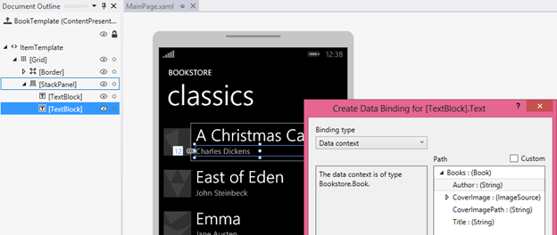

<a name="sample-data-on-the-design-surface-and-for-prototyping"></a>Exemples de données sur l’aire de conception et pour la création d’un prototype
=============================================================================================


**Remarque**le degré auquel vous avez besoin d’exemples de données, et combien il vous sera utile — dépend de si vos liaisons utilisent l' [extension de balisage {Binding}](https://msdn.microsoft.com/library/windows/apps/Mt204782) , ou l' [extension de balisage {x: Bind}](https://msdn.microsoft.com/library/windows/apps/Mt204783). Les techniques décrites dans cette rubrique sont basées sur l’utilisation d’une [**DataContext**](https://msdn.microsoft.com/library/windows/apps/BR208713), afin qu’elles soient appropriées uniquement pour **{Binding}**. Si vous utilisez **{x:Bind}**, vos liaisons affichent au moins les valeurs d’espace réservé sur la surface de conception (même pour les contrôles d’éléments), si bien que vous n’avez pas tout à fait le même besoin d’exemples de données.

Il peut être impossible ou non souhaitable (peut-être pour des raisons de confidentialité ou de performances) pour votre application d’afficher des données actives sur la surface de conception dans Microsoft Visual Studio ou Blend pour Visual Studio. Pour que vos contrôles soient remplis avec les données (de sorte que vous puissiez travailler sur la disposition de votre application, les modèles et les autres propriétés visuelles), vous pouvez utiliser vos exemples de données au moment de la conception de diverses manières. Les exemples de données peuvent également être vraiment utiles et permettre de gagner du temps si vous créez une application de croquis (ou de prototype). Vous pouvez utiliser des exemples de données dans votre croquis ou prototype au moment de l’exécution pour illustrer vos idées sans avoir à vous connecter aux données actives/réelles.

**Exemples d’applications illustrant {Binding}**

-   Téléchargez l’application [Bookstore1](http://go.microsoft.com/fwlink/?linkid=532950).
-   Téléchargez l’application [Bookstore2](http://go.microsoft.com/fwlink/?linkid=532952).

<a name="setting-datacontext-in-markup"></a>Configuration de DataContext dans le balisage
-----------------------------

Il est assez courant pour un développeur d’utiliser le code impératif (en code-behind) pour définir la propriété [**DataContext**](https://msdn.microsoft.com/library/windows/apps/BR208713) d’un contrôle utilisateur ou de page pour afficher une instance de modèle.

``` csharp
public MainPage()
{
    InitializeComponent();
    this.DataContext = new BookstoreViewModel();
}
```

En procédant ainsi, votre page n’est plus aussi «configurable» qu’elle pourrait l’être. Cela s’explique par le fait que votre page XAML est ouverte dans Visual Studio ou Blend pour Visual Studio et que le code impératif qui affecte la valeur de **DataContext** n’est jamais exécuté (en fait, aucun code-behind ne l’est). Les outils XAML analysent bien évidemment votre balisage et instancient les objets déclarés dans celui-ci, mais pas réellement le type de page en lui-même. Par conséquent, les données ne s’afficheront pas dans vos contrôles ou dans la boîte de dialogue **Créer une liaison de données** et le façonnage et la disposition de votre page seront plus difficile à réaliser.


La première solution à essayer consiste à commenter l’affectation de cette propriété **DataContext** et définir **DataContext** plutôt dans le balisage de la page. Ainsi, vos données actives s’affichent au moment de la conception et de l’exécution. Pour ce faire, ouvrez d’abord votre page XAML. Ensuite, dans la fenêtre **Structure du document**, cliquez sur l’élément configurable racine (généralement intitulé **[Page]**) pour le sélectionner. Dans la fenêtre **Propriétés**, recherchez la propriété **DataContext** (à l’intérieur de la catégorie Common), puis cliquez sur **Nouveau**. Cliquez sur le type de modèle de vue à partir de la boîte de dialogue **Sélectionner un objet**, puis cliquez sur **OK**.


Voici à quoi ressemble le balisage qui en résulte.

``` xaml
<Page ... >
    <Page.DataContext>
        <local:BookstoreViewModel/>
    </Page.DataContext>
```

Et voici à quoi ressemble la surface de conception une fois vos liaisons résolues. Notez que le sélecteur **Chemin d’accès** de la boîte de dialogue **Créer une liaison de données** est désormais rempli en fonction du type **DataContext** et des propriétés que vous pouvez y associer.



La boîte de dialogue **Créer une liaison de données** nécessite uniquement un type à partir duquel travailler et les liaisons exigent que les propriétés soient initialisées avec des valeurs. Si vous ne voulez pas accéder à votre service cloud au moment de la conception (en raison des performances, du transfert de données payant, des problèmes de confidentialité ou d’un problème similaire), votre code d’initialisation peut vérifier que votre application s’exécute dans un outil de conception (par exemple, Visual Studio ou Blend pour Visual Studio) et qu’elle charge des exemples de données à utiliser au moment de la conception uniquement.

``` csharp
if (Windows.ApplicationModel.DesignMode.DesignModeEnabled)
{
    // Load design-time books.
}
else
{
    // Load books from a cloud service.
}
```

Vous pourriez utiliser un localisateur de modèle d’affichage si vous avez besoin de transmettre des paramètres à votre code d’initialisation. Un localisateur de modèle d’affichage est une classe que vous pouvez placer dans les ressources d’application. Il possède une propriété qui expose le modèle d’affichage et la propriété **DataContext** s’associe à cette propriété. Le localisateur ou le modèle d’affichage peut également utiliser l’injection de dépendances, qui peut créer un fournisseur de données au moment de la conception ou de l’exécution (qui implémente une interface commune), le cas échéant.

<a name="sample-data-from-class-and-design-time-attributes"></a>« Exemple de données à partir de la classe » et attributs au moment de la conception
---------------------------------------------------------------------------------------

Si pour une raison quelconque, aucune des options de la section précédente ne fonctionne, vous disposez encore d’un grand nombre d’options de données au moment de la conception disponibles à partir des fonctionnalités et des attributs au moment de la conception des outils XAML. **Créer un exemple de données à partir de la classe** est une fonctionnalité utile de Blend pour Visual Studio. Vous pouvez trouver cette commande sur l’un des boutons situés en haut du panneau **Données**.

Il vous suffit de spécifier une classe pour la commande à utiliser. La commande effectue ensuite deux choses importantes pour vous. Tout d’abord, elle génère un fichier XAML qui contient des exemples de données adaptés à l’hydratation d’une instance de la classe choisie et de tous ses membres, de manière récursive (en fait, les outils fonctionnement aussi bien avec des fichiers XAML ou JSON). Ensuite, elle remplit le panneau **Données** avec le schéma de la classe choisie. Vous pouvez ensuite faire glisser des membres du panneau **Données** sur la surface de conception pour effectuer différentes tâches. En fonction des éléments que vous faites glisser et de l’endroit où vous les déposez, vous pouvez ajouter des liaisons à des contrôles existants (à l’aide de **{Binding}**), ou créer de nouveaux contrôles et les lier en même temps. Dans les deux cas, l’opération définit également pour vous un contexte de données au moment de la conception (**d:DataContext**) (s’il n’est pas déjà défini) à la racine de la disposition de votre page. Ce contexte de données au moment de la conception utilise l’attribut **d:DesignData** pour obtenir ses exemples de données à partir du fichier XAML généré (que, par ailleurs, vous êtes libre de rechercher dans votre projet et de modifier pour qu’il contienne l’exemple de données voulu).

``` xaml
<Page ...
    xmlns:d="http://schemas.microsoft.com/expression/blend/2008"
    xmlns:mc="http://schemas.openxmlformats.org/markup-compatibility/2006"
    mc:Ignorable="d">
    <Grid ... d:DataContext="{d:DesignData /SampleData/RecordingViewModelSampleData.xaml}"/>
        <ListView ItemsSource="{Binding Recordings}" ... />
        ...
    </Grid>
</Page>
```

Les diverses déclarations xmlns signifient que les attributs portant le préfixe **d:** sont interprétés seulement au moment de la conception et ignorées au moment de l’exécution. Ainsi, l’attribut **d:DataContext** affecte la valeur de la propriété [**DataContext**](https://msdn.microsoft.com/library/windows/apps/BR208713) uniquement au moment de la conception ; il n’a aucun effet au moment de l’exécution. Vous pouvez même définir **d:DataContext** et **DataContext** dans le balisage, si vous le souhaitez. **d:DataContext** procédera au remplacement à la conception, et **DataContext** procédera au remplacement à l’exécution. Ces mêmes règles de substitution s’appliquent à tous les attributs au moment de la conception et de l’exécution.

L’attribut **d:DataContext** et tous les autres attributs au moment de la conception, sont traités dans la rubrique [Attributs au moment de la conception](http://go.microsoft.com/fwlink/p/?LinkId=272504), qui est toujours valide pour les applications de plateforme Windows universelle (UWP).

[**CollectionViewSource**](https://msdn.microsoft.com/library/windows/apps/BR209833) ne dispose pas de propriété **DataContext**, mais d’une propriété **Source**. Par conséquent, il existe une propriété **d:Source** que vous pouvez utiliser pour définir des exemples de données sur une classe **CollectionViewSource** uniquement au moment de la conception.

``` xaml
    <Page.Resources>
        <CollectionViewSource x:Name="RecordingsCollection" Source="{Binding Recordings}"
            d:Source="{d:DesignData /SampleData/RecordingsSampleData.xaml}"/>
    </Page.Resources>

    ...

        <ListView ItemsSource="{Binding Source={StaticResource RecordingsCollection}}" ... />
    ...
```

Pour ce faire, vous disposez d’une classe nommée `Recordings : ObservableCollection<Recording>`, et modifiez le fichier XAML d’exemple de données de sorte qu’il contienne uniquement un objet **Recordings** (comportant des objets **Recording**), comme illustré ici.

``` xml
<Quickstart:Recordings xmlns:Quickstart="using:Quickstart">
    <Quickstart:Recording ArtistName="Mollis massa" CompositionName="Cubilia metus"
        OneLineSummary="Morbi adipiscing sed" ReleaseDateTime="01/01/1800 15:53:17"/>
    <Quickstart:Recording ArtistName="Vulputate nunc" CompositionName="Parturient vestibulum"
        OneLineSummary="Dapibus praesent netus amet vestibulum" ReleaseDateTime="01/01/1800 15:53:17"/>
    <Quickstart:Recording ArtistName="Phasellus accumsan" CompositionName="Sit bibendum"
        OneLineSummary="Vestibulum egestas montes dictumst" ReleaseDateTime="01/01/1800 15:53:17"/>
</Quickstart:Recordings>
```

Si vous utilisez un fichier d’exemple de données JSON au lieu d’un fichier XAML, vous devez définir la propriété **Type**.

``` xaml
    d:Source="{d:DesignData /SampleData/RecordingsSampleData.json, Type=local:Recordings}"
```

Jusqu’ici, nous avons utilisé **d:DesignData** pour charger les exemples de données au moment de la conception à partir d’un fichier XAML ou JSON. Vous pouvez également utiliser l’extension de balisage **d:DesignInstance**, qui indique que la source au moment de la conception repose sur la classe définie par la propriété **Type**. Voici un exemple:

``` xaml
    <CollectionViewSource x:Name="RecordingsCollection" Source="{Binding Recordings}"
        d:Source="{d:DesignInstance Type=local:Recordings, IsDesignTimeCreatable=True}"/>
```

La propriété **IsDesignTimeCreatable** indique que l’outil de conception doit réellement créer une instance de la classe, qui implique que la classe possède un constructeur public par défaut, et qu’il se remplit lui-même de données (données réelles ou exemple de données). Si vous ne définissez pas **IsDesignTimeCreatable** (ou si vous le définissez sur **False**), les exemples de données ne s’afficheront pas sur la surface de conception. L’outil de conception se contente dans ce cas consiste à analyser la classe ses propriétés pouvant être liées et afficher ces dans le panneau de **données** et dans la boîte de dialogue **Créer une liaison de données** .

<a name="sample-data-for-prototyping"></a>Exemple de données pour créer un prototype
--------------------------------------------------------

Pour créer un prototype, vous voulez des exemples de données au moment de la conception et de l’exécution. Pour ce cas d’utilisation, Blend pour Visual Studio dispose de la fonctionnalité **Nouvel exemple de données**. Vous pouvez trouver cette commande sur l’un des boutons situés en haut du panneau **Données**.

Au lieu de spécifier une classe, vous pouvez concevoir le schéma de votre source d’exemples de données directement dans le panneau **Données**. Vous pouvez également modifier les valeurs des exemples de données dans le panneau **Données**: il est inutile d’ouvrir et de modifier un fichier (bien que vous puissiez procéder ainsi si vous préférez).

La fonctionnalité **Nouvel exemple de données** utilise [**DataContext**](https://msdn.microsoft.com/library/windows/apps/BR208713), et non **d:DataContext**, afin que l’exemple de données soit disponible lors de la conception et l’exécution de votre croquis ou prototype. Le panneau **Données** accélère vraiment vos tâches de conception et de liaison. Par exemple, le simple fait de glisser une propriété de collection à partir du panneau **Données** sur la surface de conception génère un contrôle d’éléments liés aux données et les modèles nécessaires, le tout prêt à être généré et exécuté.


