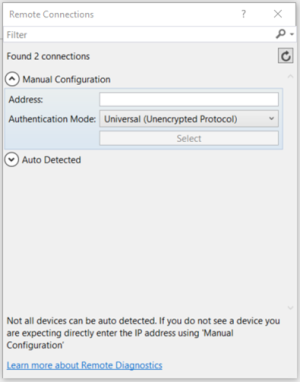

# <a name="deploying-and-debugging-uwp-apps"></a>Déploiement et débogage des applications UWP


Cet article vous guide tout au long des étapes nécessaires pour cibler différents objectifs de déploiement et de débogage.

Microsoft Visual Studio vous permet de déployer et déboguer vos applications de plateforme Windows universelle (UWP) sur un grand nombre d’appareils Windows 10. Visual Studio gère le processus de génération et d’inscription de l’application sur l’appareil cible.

## <a name="picking-a-deployment-target"></a>Sélection d’une cible de déploiement

Pour sélectionner une cible, accédez à la liste déroulante des cibles de débogage située à côté du bouton **Démarrer le débogage** et choisissez la cible vers laquelle vous voulez déployer votre application. Une fois la cible sélectionnée, choisissez **Démarrer le débogage (F5)** pour procéder au déploiement et au débogage sur cette cible, ou sélectionnez **Ctrl+F5** pour simplement effectuer le déploiement sur cette cible.


-   Le **Simulateur** déploie l’application sur un environnement simulé sur votre ordinateur de développement actuel. Cette option est disponible uniquement si la **Version minimale de la plateforme cible** de votre application est inférieure ou égale à celle du système d’exploitation de votre ordinateur de développement.
-   L’**Ordinateur local** déploie l’application sur votre ordinateur de développement actuel. Cette option est disponible uniquement si la **Version minimale de la plateforme cible** de votre application est inférieure ou égale à celle du système d’exploitation de votre ordinateur de développement.
-   L’**Ordinateur distant** vous permet de spécifier une cible distante pour déployer l’application. Pour plus d’informations sur le déploiement sur un ordinateur distant, voir [Spécification d’un appareil distant](#specifying-a-remote-device).
-   L’**Appareil** déploie l’application sur un appareil USB connecté. L’appareil doit être déverrouillé par le développeur et son écran doit être déverrouillé.
-   Un **Émulateur** démarre et déploie l’application sur un émulateur avec la configuration spécifiée dans le nom. Émulateurs sont disponibles uniquement sur Hyper-V en cours d’exécution Windows8.1 des ordinateurs ou supérieur.


## <a name="debugging-deployed-apps"></a>Débogage des applications déployées
Visual Studio assure également l’attachement à n’importe quel processus d’application UWP en cours d’exécution. Pour cela, sélectionnez **Déboguer**, puis **Attacher au processus**. L’attachement à un processus en cours d’exécution ne nécessite pas le projet Visual Studio d’origine. Cependant, le chargement des [symboles](#symbols) du processus sera d’une grande aide pour déboguer un processus dont vous ne disposez pas du code d’origine.  

En outre, vous pouvez attacher et déboguer n’importe quel package d’application installé en sélectionnant **Déboguer**, **Autres**, puis **Déboguer le package d’application installé**.   

   

Si vous sélectionnez **Ne pas lancer, mais déboguer mon code au démarrage**, le débogueur Visual Studio sera attaché à votre application UWP au moment où vous la lancerez. Il s’agit d’un moyen efficace pour déboguer les chemins d’accès de contrôle à partir de [différentes méthodes de lancement](../xbox-apps/automate-launching-uwp-apps.md), notamment en cas d’activation du protocole avec des paramètres personnalisés.  

Les applications UWP peuvent être développées et compilées sur Windows8.1 ou une version ultérieure, mais leur exécution nécessite Windows10. Si vous développez une application UWP sur un PC Windows8.1, vous pouvez déboguer à distance une application UWP s’exécutant sur un autre appareil Windows10, sous réserve que les ordinateurs hôte et cible soient sur le même LAN. Pour ce faire, téléchargez et installez les [Outils de contrôle à distance de Visual Studio](https://www.visualstudio.com/downloads/) sur les deux machines. La version installée doit correspondre à la version existante de Visual Studio que vous avez installée, et l’architecture que vous sélectionnez (x86, x64) doit également correspondre à celle de votre application cible.   

## <a name="package-layout"></a>Disposition de package
À compter de Visual Studio 2015 Update 3, nous avons ajouté la possibilité aux développeurs de spécifier le chemin d’accès de la disposition de leurs applications UWP. Cela permet de déterminer l’emplacement sur le disque où est copiée la disposition de package quand vous générez l’application. Par défaut, cette propriété est définie par rapport au répertoire racine du projet. Si vous ne modifiez pas cette propriété, le comportement reste le même que celui des versions antérieures de Visual Studio.

Cette propriété peut être modifiée dans les propriétés de **débogage** du projet.

Si vous voulez inclure tous les fichiers de disposition dans votre package d’application au moment de sa création, vous devez ajouter la propriété de projet `<IncludeLayoutFilesInPackage>true</IncludeLayoutFilesInPackage>`.

Pour ajouter cette propriété:

1. Cliquez avec le bouton droit sur le projet, puis sélectionnez **Décharger le projet**.
2. Cliquez avec le bouton droit sur le projet, puis sélectionnez **Modifier [nom_projet].xxproj** (.xxproj varie selon la langue du projet).
3. Ajoutez la propriété, puis rechargez le projet.

## <a name="specifying-a-remote-device"></a>Spécification d’un appareil distant

### <a name="c-and-microsoft-visual-basic"></a>C# et Microsoft Visual Basic

Pour spécifier un ordinateur distant pour des applications en C# ou Microsoft Visual Basic, sélectionnez **Ordinateur distant** dans la liste déroulante des cibles de débogage. La boîte de dialogue **Connexions à distance** s’affiche et vous permet d’indiquer une adresse IP ou de sélectionner un appareil détecté. Par défaut, le mode d’authentification **Universel** est sélectionné. Pour déterminer le mode d’authentification à utiliser, voir [Modes d’authentification](#authentication-modes).



Pour revenir à cette boîte de dialogue, vous pouvez ouvrir les propriétés du projet et accédez à l’onglet **Déboguer** . À partir de là, activez **trouver** à **ordinateur distant:**


Pour déployer une application sur un PC distant exécutant une version antérieure à CreatorsUpdate, vous devez également télécharger et installer les outils de contrôle à distance de VisualStudio sur le PC cible. Voir [Instructions pour un PC distant](#remote-pc-instructions) pour obtenir des instructions complètes.  Toutefois, à partir de CreatorsUpdate, le PC prend également en charge le déploiement distant.  

### <a name="c-and-javascript"></a>C++ et JavaScript

Pour spécifier une cible de l’ordinateur distant pour une application C++ ou JavaScriptUWP:

1. Dans l’**Explorateur de solutions**, cliquez avec le bouton droit sur le projet, puis cliquez sur **Propriétés**.
2. Accédez aux paramètres de **Débogage** et sous **Débogueur à lancer**, sélectionnez **Ordinateur distant**.
3. Entrez le **Nom de l’ordinateur** (ou cliquez sur **Rechercher** pour en trouver un), puis définissez la propriété **Type d’authentification**.


Une fois que l’ordinateur est spécifié, vous pouvez sélectionner **Ordinateur distant** dans la liste déroulante des cibles de débogage pour revenir à cet ordinateur spécifié. Un seul ordinateur distant peut être sélectionné à la fois.

### <a name="remote-pc-instructions"></a>Instructions pour un PC distant

> [!NOTE]
> Ces instructions sont uniquement requises pour les versions antérieures de Windows10.  À partir de CreatorsUpdate, un PC peut être traité comme une Xbox.  Autrement dit, vous pouvez activer la détection d'appareils dans le menu Mode développeur du PC et utiliser le mode d'authentification Universel pour le couplage de code PIN et la connexion au PC. 

Pour effectuer un déploiement sur un PC distant exécutant une version antérieure à CreatorsUpdate, les outils de contrôle à distance de VisualStudio doivent être installés sur le PC cible. Le PC distant doit également exécuter une version de Windows supérieure ou égale à la propriété **Version minimale de la plateforme cible** de vos applications. Une fois que vous avez installé les outils de contrôle à distance, vous devez lancer le débogueur distant sur le PC cible.

Pour ce faire, recherchez **Débogueur distant** dans le menu **Démarrer**, ouvrez-le et, si vous y êtes invité, autorisez le débogueur à configurer vos paramètres de pare-feu. Par défaut, le débogueur est lancé avec l’authentification Windows. Vous avez donc besoin des informations d’identification de l’utilisateur si ce dernier n’est pas le même sur les deux PC.

Pour changer l’option en **aucune authentification**, dans le **Débogueur distant**, accédez à **Outils** -&gt;**Options**, puis définissez-la sur **Aucune authentification**. Une fois que le débogueur distant est configuré, vous devez également vérifier que vous avez défini l’appareil hôte sur [Mode développeur](https://msdn.microsoft.com/windows/uwp/get-started/enable-your-device-for-development). Ensuite, vous pouvez effectuer le déploiement à partir de votre ordinateur de développement.

Pour plus d’informations, voir la page [Centre de téléchargementVisual Studio](https://www.visualstudio.com/downloads/).

## <a name="passing-command-line-debug-arguments"></a>Transmission d’arguments de ligne de commande pour le débogage 
Dans Visual Studio2017, vous pouvez transmettre des arguments de ligne de commande pour le débogage lorsque vous commencez à déboguer des applications UWP. Vous pouvez accéder aux arguments de ligne de commande relatifs au débogage à partir du paramètre *args* de la méthode **OnLaunched** de la classe [**Application**](https://docs.microsoft.com/en-us/uwp/api/windows.ui.xaml.application). Pour spécifier des arguments de ligne de commande pour le débogage, ouvrez les propriétés du projet et accédez à l’onglet **Déboguer**. 

> [!NOTE]
> Cette fonctionnalité est disponible dans VisualStudio2017 (version15.1) pour C#, VB et C++. JavaScript est disponible dans les versions ultérieures de VisualStudio2017. Les arguments de ligne de commande relatifs au débogage sont disponibles pour tous les types de déploiements, à l’exception du Simulateur.

Pour les projets UWP C# et VB, vous verrez un champ **Arguments de la ligne de commande:** sous **Options de démarrage**. 


Dans le cas des projets UWP C++ et JS, le champ **Arguments de la ligne de commande** apparaît dans **Propriétés de débogage**.


Une fois que vous avez spécifié les arguments de ligne de commande, vous pouvez accéder à la valeur de l’argument dans la méthode **OnLaunched** de l’application. L’objet *args* de la classe [**LaunchActivatedEventArgs**](https://docs.microsoft.com/en-us/uwp/api/windows.applicationmodel.activation.launchactivatedeventargs) présente une propriété **Arguments** dont la valeur est définie sur le texte figurant dans le champ **Arguments de la ligne de commande**. 


## <a name="authentication-modes"></a>Modes d’authentification

Il existe trois modes d’authentification de déploiement sur un ordinateur distant :

- **Universel (protocole non chiffré)**: Utilisez ce mode d’authentification chaque fois que vous effectuez un déploiement sur un appareil distant. Actuellement, ce mode convient aux appareils IoT, aux appareils Xbox et aux appareils HoloLens, ainsi qu'aux PC exécutant CreatorsUpdate ou version ultérieure. Le mode Universel (protocole non chiffré) doit uniquement être utilisé sur les réseaux approuvés. La connexion de débogage est vulnérable aux utilisateurs malveillants qui peuvent intercepter les données transmises entre la machine de développement et la machine distante, et les modifier.
- **Windows**: Ce mode d’authentification est destiné uniquement à être utilisé pour un PC distant (ordinateur de bureau ou portable) exécutant les outils de contrôle à distance de VisualStudio. Utilisez ce mode d’authentification quand vous avez accès aux informations d’identification de l’utilisateur connecté sur l’ordinateur cible. Il s’agit du canal le plus sécurisé pour le déploiement à distance.
- **Aucun**: Ce mode d’authentification est destiné à être utilisé uniquement pour un PC distant (ordinateur de bureau ou portable) exécutant les outils de contrôle à distance de VisualStudio. Utilisez ce mode d’authentification quand vous disposez d’un ordinateur de test configuré dans un environnement avec un compte de test connecté, et que vous ne pouvez pas entrer les informations d’identification. Vérifiez que les paramètres du débogueur distant sont définis pour n’accepter aucune authentification.

## <a name="advanced-remote-deployment-options"></a>Options avancées de déploiement distant
Comme de la version de Visual Studio 2015 Update 3 et la mise à jour anniversaire de Windows 10, il existe des avancées de déploiement distant nouvelles options pour certains appareils Windows 10. Les options avancées de déploiement distant se trouvent dans le menu **Déboguer** des propriétés du projet.

Les nouvelles propriétés sont notamment:
* Type de déploiement
* Chemin d’inscription du package
* Conserver tous les fichiers sur l’appareil, même ceux qui ne font plus partie de votre disposition

### <a name="requirements"></a>Configuration requise
Pour utiliser les options avancées de déploiement distant, vous devez avoir la configuration requise suivante:
* Disposer de Visual Studio 2015 Update 3 ou certains Visual Studio version ultérieure installée avec la version 1.4.1 des outils Windows 10 ou version ultérieure (incluant le SDK de mise à jour anniversaire Windows 10) nous vous recommandons d’utiliser la dernière version de Visual Studio avec les mises à jour pour garantir vous obtiendrez tous les nouvelles fonctionnalités de sécurité et de développement.
* Ciblez un appareil distant Xbox avec la Mise à jour anniversaire Windows10 ou un PC avec Windows10CreatorsUpdate 
* Utilisez le mode d’authentification Universel

### <a name="properties-pages"></a>Pages de propriétés
Pour une application UWP en C# ou Visual Basic, la page de propriétés ressemble à ce qui suit.


Pour une application UWP en C++, la page de propriétés ressemble à ce qui suit.


### <a name="copy-files-to-device"></a>Copier les fichiers sur l’appareil
L’option **Copier les fichiers sur l’appareil** transfère physiquement les fichiers sur l’appareil distant via le réseau. Elle copie et inscrit la disposition de package générée dans le **Chemin du dossier de disposition**. Visual Studio synchronise les fichiers copiés sur l’appareil avec les fichiers de votre projet Visual Studio. Toutefois, une option vous permet de **conserver tous les fichiers sur l’appareil, même ceux qui ne font plus partie de votre disposition**. Quand vous sélectionnez cette option, tous les fichiers qui ont été précédemment copiés sur l’appareil distant, mais qui ne font plus partie de votre projet, restent sur l’appareil distant.

Le **chemin d’inscription de package** spécifié quand vous **copiez les fichiers sur l’appareil** est l’emplacement physique sur l’appareil distant dans lequel les fichiers sont copiés. Ce chemin peut être spécifié comme tout autre chemin relatif. L’emplacement dans lequel les fichiers sont déployés est relatif à une racine de fichiers de développement qui varie en fonction de l’appareil cible. La spécification de ce chemin est utile si plusieurs développeurs partagent le même appareil et utilisent des packages avec un écart de build.

> [!NOTE]
> L'option **Copier les fichiers sur l’appareil** est actuellement prise en charge sur Xbox exécutant la Mise à jour anniversaire Windows10 et les PC exécutant Windows10CreatorsUpdate.

Sur l’appareil distant, la disposition est copiée à l’emplacement par défaut suivant: `\\MY-DEVKIT\DevelopmentFiles\PACKAGE-REGISTRATION-PATH`

### <a name="register-layout-from-network"></a>Inscrire la disposition à partir du réseau
Quand vous choisissez d’inscrire la disposition à partir du réseau, vous pouvez générer votre disposition de package dans un partage réseau, puis inscrire la disposition sur l’appareil distant directement à partir du réseau. Pour cela , vous spécifiez un chemin de dossier de disposition (un partage réseau) accessible à partir de l’appareil distant. La propriété **Chemin du dossier de disposition** est le chemin relatif défini sur le PC exécutant Visual Studio, tandis que la propriété **Chemin d’inscription du package** désigne le même chemin, mais spécifié sur l’appareil distant.

Pour inscrire correctement la disposition à partir du réseau, vous devez d’abord définir le **chemin du dossier de disposition** sur un dossier partagé sur le réseau. Pour ce faire, cliquez avec le bouton droit sur le dossier dans l’Explorateur de fichiers, sélectionnez **Partager avec&gt; Des personnes spécifiques**, puis choisissez les utilisateurs avec lesquels vous voulez partager le dossier. Quand vous tentez d’inscrire la disposition à partir du réseau, vous êtes invité à entrer vos informations d’identification pour vérifier que l’utilisateur avec lequel vous vous inscrivez a accès au partage.

Pour obtenir de l’aide, voir les exemples suivants:

- Exemple1 (dossier de disposition local, accessible en tant que partage réseau):
  * **Chemin du dossier de disposition** = `D:\Layouts\App1`
  * **Chemin d’inscription du package** = `\\NETWORK-SHARE\Layouts\App1`

- Exemple2 (dossier de disposition sur le réseau):
  * **Chemin du dossier de disposition** = `\\NETWORK-SHARE\Layouts\App1`
  * **Chemin d’inscription du package** = `\\NETWORK-SHARE\Layouts\App1`

Quand vous inscrivez la disposition à partir du réseau pour la première fois, vos informations d’identification sont mises en cache sur l’appareil cible, vous n’avez donc pas besoin de vous connecter chaque fois. Pour supprimer les informations d’identification mises en cache, vous pouvez utiliser l’[outil WinAppDeployCmd.exe](https://msdn.microsoft.com/windows/uwp/packaging/install-universal-windows-apps-with-the-winappdeploycmd-tool) du SDK Windows10 avec la commande **deletecreds**.

Vous ne pouvez pas sélectionner **conserver tous les fichiers sur l’appareil** quand vous inscrivez la disposition à partir du réseau, car aucun fichier n’est copié physiquement sur l’appareil distant.

> [!NOTE]
> L'option **Inscrire la disposition à partir du réseau** est actuellement prise en charge sur Xbox exécutant la Mise à jour anniversaire Windows10 et les PC exécutant Windows10CreatorsUpdate.

Sur l’appareil distant, la disposition est inscrite à l’emplacement par défaut suivant en fonction de la famille d’appareils: `Xbox: \\MY-DEVKIT\DevelopmentFiles\XrfsFiles` - cette est un lien symbolique vers le **chemin d’inscription du package** PC n’utilise pas un lien symbolique et enregistre à la place directement le package ** chemin d’inscription**


## <a name="debugging-options"></a>Options de débogage

Dans Windows 10, les performances de démarrage des applications UWP sont améliorées en lançant de manière proactive, puis en les suspendant dans une technique appelée [prélancement](https://msdn.microsoft.com/library/windows/apps/Mt593297). De nombreuses applications fonctionnent dans ce mode sans configuration particulière, mais certaines doivent peut-être ajuster leur comportement. Pour permettre le débogage des problèmes dans ces chemins de code, vous pouvez commencer à déboguer l’application à partir de Visual Studio en mode de prélancement.

Le débogage est pris en charge à la fois à partir d’un projet Visual Studio (**Déboguer** -&gt;**Autres cibles de débogage** -&gt; **Déboguer le prélancement d’application Windows universelle**) et pour les applications déjà installées sur l’ordinateur (**Déboguer** -&gt; **Autres cibles de débogage** -&gt;**Déboguer le package d’application installé**, puis cochez la case **Activer l’application par prélancement**). Pour plus d’informations, voir [Déboguer le prélancement d’applications UWP](http://go.microsoft.com/fwlink/p/?LinkId=717245).

Vous pouvez définir les options de déploiement suivantes dans la page de propriétés de **débogage** du projet de démarrage:

- **Autoriser le bouclage réseau local**

  Pour des raisons de sécurité, une application UWP installée de manière standard n’est pas autorisée à effectuer des appels réseau à l’appareil sur lequel elle est installée. Par défaut, le déploiement de Visual Studio crée une exemption à cette règle pour l’application déployée. Cette exemption vous permet de tester les procédures de communication sur un seul et même ordinateur. Avant de soumettre votre application dans le Microsoft Store, vous devez la tester sans l’exemption.

  Pour supprimer l’exemption de bouclage réseau de l’application:

  -   Sur la page de propriétés en c# et Visual Basic**Déboguer** , désactivez la case à cocher **Autoriser le bouclage réseau local** .
  -   Dans la page de propriétés de **débogage** en JavaScript et C++, définissez la valeur **Autoriser le bouclage réseau local** sur **Non**.

- **Ne pas lancer, mais déboguer mon code au démarrage/ Lancer l’application**

  Pour configurer le déploiement afin de démarrer automatiquement une session de débogage au lancement de l’application:

  -   Sur la page de propriétés en c# et Visual Basic**Déboguer** , sélectionnez la case à cocher **ne pas lancer, mais déboguer mon code au démarrage** .
  -   Dans la page de propriétés de **débogage** en JavaScript et C++, définissez la valeur **Lancer l’application** sur **Oui**.

## <a name="symbols"></a>Symboles

Les fichiers de symboles contiennent une variété de données très utiles lors du débogage du code, notamment des variables, des noms de fonctions et des adresses de points d’entrée, ce qui vous permet de mieux comprendre les exceptions et l’ordre d’exécution de la pile des appels. Les symboles sont disponibles par le biais du [serveur de symboles Microsoft](http://msdl.microsoft.com/download/symbols) pour la plupart des variantes de Windows. Pour des recherches hors connexion plus rapides, vous pouvez également les télécharger à partir de la page [Télécharger des packages de symboles Windows](http://aka.ms/winsymbols).

Pour définir les options de symbole de Visual Studio, sélectionnez **Outils&gt; Options**, puis accédez à **Débogage&gt; Symboles** dans la boîte de dialogue.


Pour charger les symboles dans une session de débogage avec [WinDbg](#windbg), définissez la variable **sympath** sur l’emplacement du package de symboles. Par exemple, l’exécution de la commande suivante permet de charger des symboles à partir du serveur de symboles Microsoft et de les mettre en cache dans le répertoire C:\Symbols:

```
.sympath SRV*C:\Symbols*http://msdl.microsoft.com/download/symbols
.reload
```

Vous pouvez ajouter des chemins en utilisant le délimiteur `‘;’`. Vous pouvez également utiliser la commande `.sympath+`. Pour les opérations de symbole plus avancées qui utilisent WinDbg, voir [Symboles publics et privés](https://msdn.microsoft.com/library/windows/hardware/ff553493).

## <a name="windbg"></a>WinDbg

WinDbg est un débogueur puissant fourni avec la suite d’outils de débogage pour Windows, qui est incluse dans le [SDK Windows](http://go.microsoft.com/fwlink/p/?LinkID=271979). Lors de l’installation du SDK Windows, vous pouvez installer les outils de débogage pour Windows en tant que produit autonome. Si WinDbg s’avère très utile pour le débogage de code natif, nous ne le recommandons pas pour les applications écrites en code managé ou HTML5.

Pour utiliser WinDbg avec les applications UWP, vous devez commencer par désactiver la Gestion de la durée de vie des processus (PLM) de votre package d’application à l’aide de PLMDebug, comme décrit dans [Outils de test et de débogage pour la Gestion de la durée de vie des processus](testing-debugging-plm.md).

```
plmdebug /enableDebug [PackageFullName] ""C:\Program Files\Debugging Tools for Windows (x64)\WinDbg.exe\" -server npipe:pipe=test"
```

Contrairement à Visual Studio, WinDbg a pour principale fonctionnalité de fournir des commandes à la fenêtre de commandes. Les commandes fournies vous permettent d’afficher l’état d’exécution, d’examiner les vidages sur incident en mode utilisateur et d’effectuer le débogage dans une variété de modes.

`!analyze -v` est l’une des commandes les plus utilisées de WinDbg. Elle permet de récupérer des informations détaillées sur l’exception actuelle, notamment:

- FAULTING_IP: pointeur d’instruction au moment de l’erreur
- EXCEPTION_RECORD: adresse, code et indicateurs de l’exception actuelle
- STACK_TEXT: arborescence des appels de procédure avant l’exception

Pour obtenir la liste complète de toutes les commandes de WinDbg, consultez [Commandes du débogueur](https://msdn.microsoft.com/library/ff540507).

## <a name="related-topics"></a>Rubriques connexes
- [Outils de test et de débogage pour la PLM](testing-debugging-plm.md)
- [Débogage, tests et analyse des performances](index.md)
