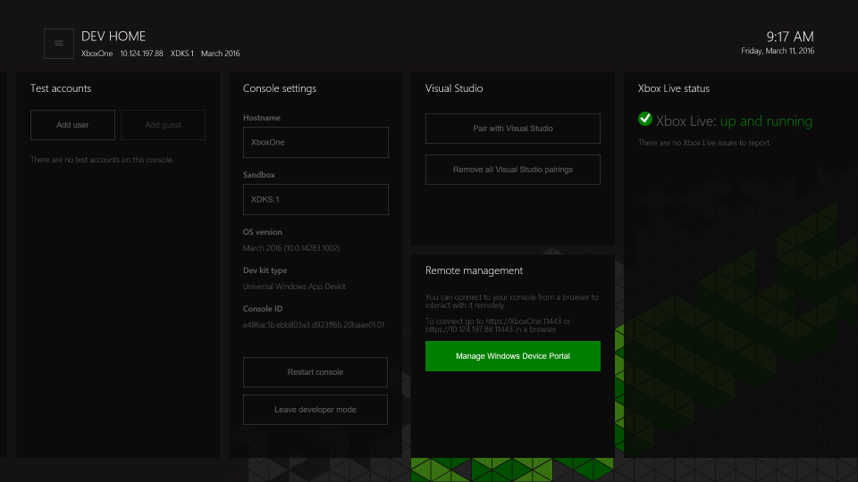

# Device Portal pour Xbox

## Configurer Device Portal pour Xbox

### Activer Device Portal

**Pour activer Device Portal**

1. Sélectionnez la vignette Dev Home sur l’écran d’accueil (voir image)  

2. Au sein de Dev Home, accédez à l’outil **Gestion à distance**. 

3. Sélectionnez **Gérer Windows Device Portal** et appuyez sur la touche **A**.
4. Cochez le paramètre **Activer Windows Device Portal**.
5. Entrez un nom d’utilisateur et un mot de passe à utiliser pour authentifier l’accès à votre Kit de développement à partir d’un navigateur, puis enregistrez-les.
6. Fermez la page des paramètres et notez l’URL répertoriée sur l’outil de gestion à distance pour se connecter.
7. Entrez l’URL dans votre navigateur et connectez-vous avec les informations d’identification que vous avez configurées.
8. Vous recevrez un avertissement concernant le certificat fourni, similaire à celui illustré ci-dessous. Vous devez cliquer sur **Poursuivre sur ce site web** pour accéder à Windows Device Portal dans la version d’évaluation.

## Pages Device Portal

Device Portal sur XBox propose les pages standard. Pour obtenir une description détaillée, voir [Vue d’ensemble de Windows Device Portal](device-portal.md).

- Applications
- Processus
- Performances
- Suivi d’événements pour Windows (ETW)
- Suivi des performances
- Appareils
- Mise en réseau

<!--HONumber=Mar16_HO5-->

