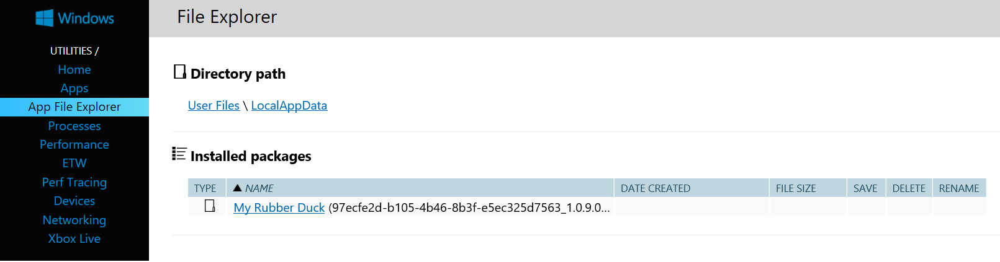
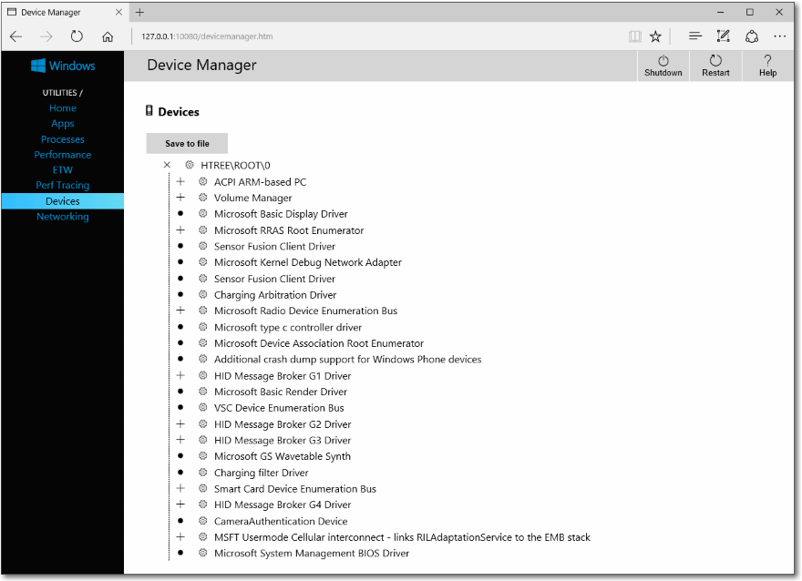

# <a name="windows-device-portal-overview"></a>Vue d’ensemble de Windows Device Portal

Windows Device Portal vous permet de configurer et de gérer à distance votre appareil par le biais d’une connexion réseau ou USB. Il fournit également des outils de diagnostic avancés pour vous aider à résoudre les problèmes et afficher les performances en temps réel de votre appareil Windows.

Windows Device Portal est un serveur web sur votre appareil que vous pouvez vous connecter à partir d’un navigateur web sur un PC. Si votre appareil dispose d’un navigateur web, vous pouvez également vous connecter localement avec le navigateur sur cet appareil.

Windows Device Portal est disponible sur chaque famille d’appareils, mais les fonctionnalités et la configuration varient en fonction de la configuration requise de chaque appareil. Cet article fournit une description générale de Device Portal et des liens vers des articles contenant des informations plus spécifiques pour chaque famille d’appareils.

Les fonctionnalités de Windows Device Portal sont implémentée avec les [API REST](device-portal-api-core.md) que vous pouvez utiliser directement pour accéder aux données et contrôler votre appareil par programme.

## <a name="setup"></a>Installation

Chaque appareil possède des instructions spécifiques concernant la connexion à Device Portal. Toutefois, chacun nécessite d’effectuer les étapes générales suivantes.
1. Activer le Mode développeur et Device Portal sur votre appareil (configuré dans l’application paramètres).
2. Connectez votre appareil et un PC par le biais d’un réseau local ou USB.
3. Accéder à la page Device Portal dans votre navigateur. Ce tableau indique les ports et protocoles utilisés par chaque famille d’appareils.

Famille d’appareils | Activé par défaut? | HTTP | HTTPS | USB
--------------|----------------|------|-------|----
HoloLens | Oui, en mode de développement | 80 (par défaut) | 443 (par défaut) | http://127.0.0.1:10080
IoT | Oui, en mode de développement | 8080 | Activer via la clé de registre | Non applicable
Xbox | Activer dans le mode de développement | Désactivé | 11443 | Non applicable
Bureau| Activer dans le mode de développement | 50080\* | 50043\* | Non applicable
Téléphone | Activer dans le mode de développement | 80| 443 | http://127.0.0.1:10080

\ * Cela n’est pas toujours le cas, car Device Portal sur le bureau revendique des ports dans la plage éphémère (&gt;50000) afin d’éviter les collisions avec les déclarations de port existant sur l’appareil. Pour plus d’informations, consultez la section [Paramètres de port](device-portal-desktop.md#registry-based-configuration-for-device-portal) pour le bureau.  

Pour obtenir des instructions d’installation propres à chaque appareil, consultez:
- [Device Portal pour HoloLens](https://docs.microsoft.com/windows/uwp/debug-test-perf/device-portal-hololens)
- [Device Portal pour IoT](https://go.microsoft.com/fwlink/?LinkID=616499)
- [Device Portal pour appareils mobiles](device-portal-mobile.md)
- [Device Portal pour Xbox](device-portal-xbox.md)
- [Device Portal pour Bureau](device-portal-desktop.md#set-up-device-portal-on-windows-desktop)

## <a name="features"></a>Fonctionnalités

### <a name="toolbar-and-navigation"></a>Barre d’outils et navigation

La barre d’outils en haut de la page permet d’accéder aux fonctionnalités couramment utilisées.
- **Alimentation**: accéder aux options d’alimentation.
  - **Arrêt**: éteint l’appareil.
  - **Redémarrer**: mise sous tension de l’appareil par cycle.
- **Aide**: ouvre la page d’aide.

Utilisez les liens du volet de navigation sur le côté gauche de la page pour naviguer vers les outils d’analyse et de gestion disponibles pour votre appareil.

Les outils qui sont communes à des familles d’appareils sont décrits ici. D’autres options peuvent être disponibles selon l’appareil. Pour plus d’informations, consultez la page spécifique de votre type d’appareil.

### <a name="apps-manager"></a>App Manager (Gestionnaire d’applications)

Le Gestionnaire d’applications fournit l’installation ou la désinstallation et la fonction de gestion de l’application de packages et des ensembles de sur l’appareil hôte.


- **Les applications installées**: utiliser le menu déroulant pour supprimer ou de démarrer des applications qui sont installées sur l’appareil. Installer une nouvelle application en cliquant sur **Ajouter**. Cette opération lance l’installation expérience utilisateur pour déployer les applications empaquetées dans local, réseau ou web héberge et enregistrer des fichiers libres de partages réseau.
- **Les applications en cours d’exécution**: obtenir des informations sur les applications qui sont en cours d’exécution et de les fermer si nécessaire.

#### <a name="install-an-app"></a>Installer une application

1.  Lorsque vous avez créé un package d’application, vous pouvez l’installer à distance sur votre appareil. Une fois créé dans Visual Studio, un dossier de sortie est généré.
  
2.  Dans la section du portail d’appareil de Gestionnaire des applications, cliquez sur **Ajouter** , puis sélectionnez **installer le package d’application à partir du stockage local**.
3.  Cliquez sur **Parcourir** et recherchez votre package d’application.
3.  Cliquez sur **Parcourir** et recherchez le fichier de certificat (_.cer_) (non requis sur tous les appareils.)
4.  Cases à cocher le respectifs si vous souhaitez installer facultatif ou des packages d’infrastructure, ainsi que l’installation de l’application. Si vous avez plusieurs objets, ajoutez chacun d’eux individuellement.     
5.  Cliquez sur **suivant** pour passer à l’étape suivante et **installer** pour lancer l’installation. 

#### <a name="uninstall-an-app"></a>Désinstaller une application
1.  Assurez-vous que votre application n’est pas en cours d’exécution. 
2.  S’il s’agit, accédez à **l’exécution des applications** et fermez-le. Si vous essayez de désinstaller pendant l’exécution de l’application, celle-ci provoquera des problèmes lorsque vous essayez de réinstaller l’application. 
3.  Sélectionnez l’application à partir de la liste déroulante, puis cliquez sur **Supprimer**.

### <a name="running-processes"></a>Processus en cours d’exécution

Cette page affiche des détails sur les processus en cours d’exécution sur l’appareil hôte. Cela comprend les processus relatifs aux applications au système. Sur certaines plateformes (Desktop, IoT et HoloLens), vous pouvez arrêter les processus.


### <a name="file-explorer"></a>Explorateur de fichiers

Cette page vous permet d’afficher et de manipuler les fichiers stockés par toutes les applications chargées de manière indépendante. Consultez le blog [à l’aide de l’Explorateur de fichiers d’application](https://blogs.windows.com/buildingapps/2016/06/08/using-the-app-file-explorer-to-see-your-app-data/) pour en savoir plus sur l’Explorateur de fichiers et comment l’utiliser. 



### <a name="performance"></a>Analyse des performances

La page de performances affiche des informations de diagnostic système comme la consommation d’énergie, la fréquence d’images, des graphiques en temps réel et chargez de processeur.

Voici les mesures disponibles:
- **Processeur**: pourcentage du total disponible de l’UC
- **Mémoire**: totale, en cours d’utilisation, disponible validée, paginée et non paginée
- **E/s**: les quantités de données en lecture et écriture
- **Réseau**: réceptions et envois des données
- **GPU**: % du GPU disponible total de l’utilisation du moteur


### <a name="event-tracing-for-windows-etw-logging"></a>Journalisation des événements suivi pour Windows (ETW)

La page de la journalisation ETW gère les informations de suivi d’événements pour Windows (ETW) en temps réel sur l’appareil.


Cochez la case **Masquer les fournisseurs** pour n’afficher que la liste des événements.
- **Les fournisseurs enregistrés**: sélectionnez le fournisseur d’événements et le niveau de suivi. Le niveau de suivi est une des valeurs suivantes:
  1. Sortie ou arrêt anormal
  2. Erreurs graves
  3. Avertissements
  4. Avertissements sans erreur
  5. Suivi détaillé

  Cliquez ou appuyez sur **Activer** pour démarrer le suivi. Le fournisseur est ajouté à la liste déroulante **Fournisseurs activés**.
- **Fournisseurs personnalisés** sélectionnez un fournisseur ETW personnalisé et le niveau de suivi. Identifiez le fournisseur par son GUID. N’incluez pas de crochets dans le GUID.
- **Les fournisseurs activé**: cela répertorie les fournisseurs activés. Sélectionnez un fournisseur dans la liste déroulante, puis cliquez sur ou appuyez sur **Désactiver** pour arrêter le suivi. Cliquez ou appuyez sur **Arrêter tout** pour suspendre tout le suivi.
- **Historique des fournisseurs**: Cela affiche les fournisseurs ETW qui ont été activées au cours de la session en cours. Cliquez ou appuyez sur **Activer** pour activer un fournisseur qui a été désactivé. Cliquez ou appuyez sur **Effacer** pour supprimer l’historique.
- **Filtres / événements**: la section **événements** répertorie les événements ETW des fournisseurs sélectionnés sous forme de tableau. Le tableau est mis à jour en temps réel. Utilisez le menu **filtres** pour configurer des filtres personnalisés pour lequel les événements seront affichés. Cliquez sur le bouton **Effacer** pour supprimer tous les événements ETW du tableau. Cela ne désactive pas les fournisseurs. Vous pouvez cliquer sur **Enregistrer dans un fichier** pour exporter les événements ETW actuellement collectés dans un fichier CSV local.

Pour plus d’informations sur l’utilisation de la journalisation ETW, consultez le blog de [l’Utilisation de Device Portal pour afficher les journaux de débogage](https://blogs.windows.com/buildingapps/2016/06/10/using-device-portal-to-view-debug-logs-for-uwp/) . 

### <a name="performance-tracing"></a>Suivi des performances

La page de suivi des performances vous permet de pour afficher les traces de [L’enregistreur de Performance Windows (WPR)](https://msdn.microsoft.com/library/hh448205.aspx) à partir de l’appareil hôte.


- **Profils disponibles**: sélectionnez le profil WPR dans la liste déroulante, puis cliquez ou appuyez sur **Démarrer** pour commencer le suivi.
- **Profils personnalisés**: cliquez ou appuyez sur **Parcourir** pour choisir un profil WPR depuis votre PC. Cliquez ou appuyez sur **Charger et démarrer** pour commencer le suivi.

Pour arrêter le suivi, cliquez sur **Arrêter**. Restez sur cette page jusqu'à ce que le fichier de suivi (. ETL) a terminé le téléchargement.

Capturé. Les fichiers ETL peuvent être ouverts pour analyse dans l' [Analyseur de Performance Windows](https://msdn.microsoft.com/library/windows/desktop/hh448170.aspx).

### <a name="device-manager"></a>Gestionnaire de périphériques

La page Gestionnaire de périphériques énumère tous les périphériques connectés à votre appareil. Vous pouvez cliquer sur les icônes de paramètres pour afficher les propriétés de chaque.



### <a name="networking"></a>Réseaux

La page de mise en réseau gère les connexions réseau sur l’appareil. Sauf si vous êtes connecté à Device Portal via USB, la modification de ces paramètres entraînera certainement la déconnexion de Device Portal.
- **Réseaux disponibles**: affiche les réseaux Wi-Fi disponibles sur l’appareil. Appuyez ou cliquez sur un réseau pour vous y connecter et fournir une clé d’accès si nécessaire. Device Portal ne prend pas en charge l’authentification d’entreprise. Vous pouvez également utiliser la liste déroulante des **profils** pour tenter de se connecter à un des profils Wi-Fi connus à l’appareil.
- **Configuration IP**: affiche des informations adresse chacun de l’hôte de ports de réseau de l’appareil.


## <a name="service-features-and-notes"></a>Remarques et fonctionnalités de Service

### <a name="dns-sd"></a>DNS-SD

DevicePortal signale sa présence sur le réseau local à l’aide deDNS-SD. Toutes les instances DevicePortal, quel que soit le type d’appareil, sont signalées sous «WDP._wdp._tcp.local». Les enregistrementsTXT relatifs à l’instance de service fournissent les éléments suivants:

Clé | Type | Description 
----|------|-------------
S | entier | Port sécurisé pour Device Portal. Si la valeur est égale à0 (zéro), DevicePortal ne détecte pas les connexionsHTTPS. 
D | chaîne | Type d’appareil. Cette information sera au format «Windows.*», par exemple Windows.Xbox ou Windows.Desktop
A | chaîne | Architecture d’appareil. Par exemple ARM, x 86 ou AMD64.  
T | liste de chaînes délimitées par des caractèresNull | Balises appliquées par l’utilisateur pour l’appareil. Reportez-vous à l’API REST Tags pour apprendre à l’utiliser. La liste se termine par deux caractèresNull.  

La connexion au portHTTPS est suggérée, car les appareils ne sont pas tous détectés sur le portHTTP signalé par l’enregistrement DNS-SD. 

### <a name="csrf-protection-and-scripting"></a>ProtectionCSRF et écriture de scripts

Afin d’offrir une protection contre les [attaquesCSRF](https://wikipedia.org/wiki/Cross-site_request_forgery), un jeton unique est requis pour toutes les demandes nonGET. Ce jeton, qui est l’en-tête de demande X-CSRF-Token, dérive d’un cookie de session, CSRF-Token. Dans l’interface utilisateur DevicePortal, le cookie CSRF-Token est copié dans l’en-tête X-CSRF-Token à chaque demande.

> [!IMPORTANT]
> Cette protection empêche les utilisations de l’API REST à partir d’un client autonome (par exemple, des utilitaires de ligne de commande). Cette situation peut être résolue de 3manières différentes: 
> - Utilisez un nom d’utilisateur «auto-». Les clients qui font précéder leur nom d’utilisateur du préfixe « auto-» contournent la protectionCSRF. Ce nom d’utilisateur ne doit pas servir à se connecter à DevicePortal par le biais du navigateur, car il rend le service vulnérable aux attaquesCSRF. Exemple: Si le nom d’utilisateur DevicePortal est «admin», ```curl -u auto-admin:password <args>``` doit être utilisé pour contourner la protectionCSRF. 
> - Implémentez le schéma de type cookie vers en-tête dans le client. Cette opération nécessite une requêteGET afin d’établir le cookie de session, puis l’inclusion de l’en-tête et du cookie sur toutes les requêtes ultérieures. 
> - Désactivez l’authentification et utilisez le protocoleHTTP. La protectionCSRF s’applique uniquement aux points de terminaisonHTTPS: les connexions au niveau des points de terminaisonHTTP n’ont donc pas besoin de satisfaire les conditions ci-dessus. 

#### <a name="cross-site-websocket-hijacking-cswsh-protection"></a>Protection CSWSH (Cross-Site WebSocket Hijacking)

Afin d’éliminer les risques d’[attaques CSWSH](https://www.christian-schneider.net/CrossSiteWebSocketHijacking.html), tous les clients ouvrant une connexion WebSocket à DevicePortal doivent également fournir un en-tête Origin correspondant à l’en-tête Host. Cela prouve à DevicePortal que la requête provient soit de l’interface utilisateur de DevicePortal, soit d’une application cliente valide. Si la requête ne présente pas d’en-tête Origin, elle sera rejetée. 
