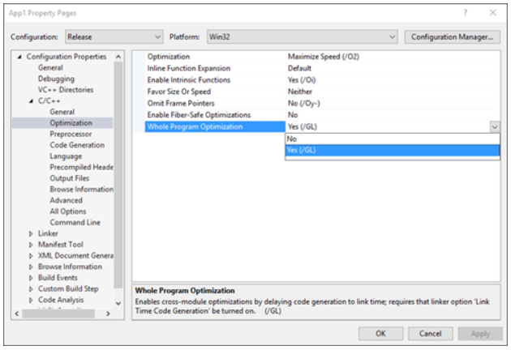
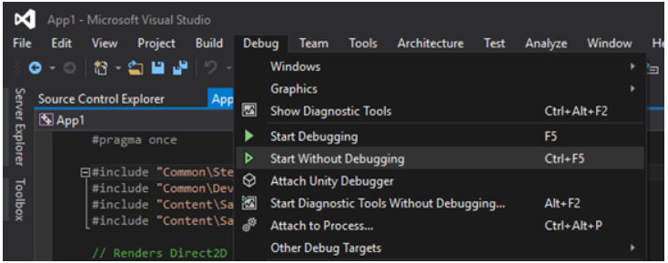

# <a name="running-profile-guided-optimization-on-universal-windows-platform-apps"></a>Exécution de l’optimisation guidée par profil sur des applications de plateforme Windows universelle 
 
Cette rubrique vous guide pas à pas dans l’application de l’optimisation guidée par profil aux applications de plateforme Windows universelle (UWP). Les étapes disponibles pour les applications win32 classiques ne sont pas toutes disponibles pour les applications UWP. Notre objectif consiste donc à expliquer le processus nécessaire pour incorporer la PGO afin de faciliter l’optimisation et la rendre plus accessible aux développeurs UWP.

Voici une procédure pas à pas de base pour appliquer la PGO au modèle d’application (UWP) DirectX11 par défaut à l’aide de Visual Studio2015 Update3.
 
Les captures d’écran incluses dans ce guide sont basées sur le nouveau projet suivant: 

Pour appliquer la PGO au modèle d’application DirectX11:

1. Définissez la configuration de votre solution sur **Version finale** ou choisissez une configuration de solution dans laquelle vous générez le code optimisé destiné à la version finale. Même si théoriquement vous pouvez exécuter la PGO sur une build de débogage, elle est inefficace pour optimiser une build non optimisée par un autre biais. 
 
 
 
2. Vérifiez dans les propriétés de votre projet (**Propriétés** > **C/C++** > **Optimisation**) que vous effectuez la génération avec l’indicateur /GL pour **Optimisation de l’ensemble du programme** (cette option est peut-être déjà définie par votre configuration).

 

3. Accédez aux propriétés de votre éditeur de liens (**Propriétés** > **Éditeur de liens** > **Optimisation**) et définissez la **génération de code durant l’édition de liens** sur **Optimisation guidée par profil - Instrumenter (LTCG: PGInstrument)**.
 
 

4. Sélectionnez **Générer la solution**, puis **Déployer la solution**. 

 
 
 Vous pouvez vérifier que tout a correctement fonctionné en accédant à l’emplacement de sortie de la génération pour vérifier qu’un fichier .pgd a été généré. Dans cet exemple, cela signifie que le fichier suivant a été généré avec la sortie de génération:
 
 `C:\Users\<USER>\Documents\Visual Studio 2015\Projects\App1\Release\App1\App1.pgd`

 Par défaut, le fichier .pgd a le même nom que votre fichier exécutable. Vous pouvez également changer le nom du fichier .pgd généré en modifiant l’option de l’éditeur de liens **Base de données guidée par profil**. 
 
5. Accédez à votre répertoire de fichiers binaires Visual Studio VC (par défaut, il ressemble à `C:\Program Files (x86)\Microsoft Visual Studio 14.0\VC\bin`). Pour les exécutables x86, copiez `pgort140.dll`. Pour les exécutables x64, copiez la version x64 à partir de `amd64\pgort140.dll`. Collez la version appropriée de `pgort140.dll` à la racine de votre package déployé. Dans cet exemple, le chemin est le suivant:

 `C:\Users\<USER>\Documents\Visual Studio 2015\Projects\App1\Release\App1\AppX\`

 Cette étape est nécessaire,car les applications UWP peuvent charger uniquement les bibliothèques qui existent au sein de leur package.

 
 
6. Exécutez l’application à partir du menu Démarrer ou du menu **Déboguer** de Visual Studio avec l’option **Exécuter sans débogage**. 

 
 
7. La build qui s’exécute maintenant est instrumentée et génère des données PGO. À ce stade, vous devez exécuter l’application dans certains scénarios les plus courants que vous avez l’intention d’optimiser. Après l’exécution du programme dans les scénarios visés, recherchez l’outil pgosweep.exe situé dans le même dossier que celui où vous avez trouvé la version appropriée de `pgort140.dll`. Une invite de commandes des outils natifs Visual Studio (x86/x64) peut également déjà contenir la version appropriée dans son chemin. Pour collecter les données PGO, exécutez la commande suivante pendant que l’application est toujours en cours d’exécution afin de générer un fichier .pgc pour contenir les données de profilage:
 
  `pgosweep.exe <executable name> <output file>` 
 
  Vous pouvez également accéder à l’aide de pgosweep.exe (`pgosweep.exe /help`) pour afficher les autres arguments facultatifs permettant de contrôler la façon de collecter les données PGO.
 
  Nous vous conseillons de générer les fichiers .pgc dans l’emplacement de génération où se trouve le fichier .pgd et de nommer les fichiers `<PGDName>!<RunIdentifier>.pgc`. Dans cet exemple, il s’agit de:
 
  ```
  pgosweep.exe App1.exe “C:\Users\<USER>\Documents\Visual Studio 2015\Projects\App1\Release\App1\App1!1.pgc”
  ```
 
  Vous pouvez également collecter `App1!CoreScenario.pgc`, `App1!UseCase5.pgc`, etc.. Si les fichiers .pgc sont nommés de cette façon et se trouvent dans l’emplacement de sortie de génération avec le fichier .pgd, ils sont automatiquement fusionnés durant la liaison à l’étape9.
 
8. FACULTATIF: Par défaut, tous les fichiers .pgc nommés comme spécifié à l’étape7 et placés à côté du fichier .pgd sont fusionnés durant la liaison et pondérés de manière égale, mais vous pouvez également mieux contrôler la façon dont certaines séries sont pondérées. Pour ce faire, vous utilisez l’outil **pgomgr.exe** qui se trouve également dans le premier dossier dans lequel vous avez trouvé la copie de `pgort140.dll`. Par exemple, pour fusionner la série `CoreScenario` avec une priorité 3fois supérieure à celle des autres séries, je peux utiliser la commande suivante:
 
 ```
 pgomgr.exe -merge:3 “C:\Users\<USER>\Documents\Visual Studio 2015\Projects\App1\Release\App1\App1!CoreScenario.pgc” “C:\Users\<USER>\Documents\Visual Studio 2015\Projects\App1\Release\App1\App1.pgd”
 ```
 
9. Une fois que vous avez généré un ou plusieurs fichiers .pgc et que vous les avez placés à côté de votre fichier .pgd, ou que vous les avez fusionnés manuellement (étape8), nous pouvons utiliser l’éditeur de liens pour créer la build finale optimisée. Retournez dans les propriétés de votre éditeur de liens (**Propriétés** > **Éditeur de liens** > **Optimisation**) et définissez la **génération de code durant l’édition de liens** sur **Optimisation guidée par profil - Optimisation (LTCG:PGOptimize)**, et vérifiez que **Base de données guidée par profil** pointe sur le fichier .pgd que vous voulez utiliser (si vous ne l’avez pas modifié, tout doit être en ordre).

 
 
10. À présent que le projet est généré, l’éditeur de liens appelle pgomgr.exe pour fusionner tous les fichiers `<PGDName>!*.pgc` du fichier .pgd avec une pondération de1 par défaut, et l’application résultante est optimisée en fonction des données de profilage.

## <a name="see-also"></a>Voir également
- [Performances](performance-and-xaml-ui.md)

 

