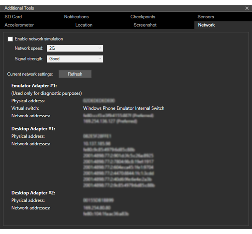

# <a name="test-with-the-microsoft-emulator-for-windows-10-mobile"></a>Tester à l’aide de l’émulateur Microsoft pour Windows10 Mobile

Simulez une interaction réaliste avec un appareil et testez les fonctionnalités de votre application à l’aide des outils fournis avec l’émulateur Microsoft pour Windows 10 Mobile. L’émulateur est une application de bureau qui émule un appareil mobile exécutant Windows 10. Il offre un environnement virtualisé dans lequel vous pouvez déboguer et tester les applications Windows sans appareil physique. Il fournit également un environnement isolé pour vos prototypes d’application.

L’émulateur a pour but de fournir des performances comparables à un appareil réel. Cependant, avant de publier votre application sur le MicrosoftStore, nous vous recommandons de tester votre application sur un appareil physique.

Vous pouvez tester votre application universelle à l’aide d’une image de l’émulateur pour Windows 10 Mobile unique pour différentes configurations de résolution et de taille d’écran. Vous pouvez simuler une interaction réaliste avec un appareil et tester les différentes fonctionnalités de votre application à l’aide des outils fournis avec l’émulateur Microsoft.

## <a name="system-requirements"></a>Configuration système requise

Votre ordinateur doit présenter la configuration suivante :

UC (ces paramètres, le cas échéant, peuvent être activés dans le BIOS)

-   Assistance matérielle à la virtualisation ([vérifier la compatibilité](https://www.microsoft.com/download/details.aspx?id=592)).
-   Traduction d’adresse de second niveau (SLAT, Second Level Address Translation)
-   Prévention de l’exécution des données au niveau matériel (DEP, Data Execution Prevention)

RAM

-   4 Go ou plus

Système d’exploitation

-   Windows 8 ou version ultérieure (Windows 10 fortement recommandé)
-   64 bits
-   Édition Professionnelle ou version supérieure

Pour vérifier la configuration requise du BIOS, consultez [Activation d’Hyper-V pour l’émulateur pour WindowsPhone8](https://msdn.microsoft.com/library/windows/apps/xaml/jj863509.aspx).

Pour vérifier la configuration requise en termes de RAM et de système d’exploitation, dans le Panneau de configuration, sélectionnez **Système et sécurité**, puis **Système**.

Microsoft Emulator pour Windows 10 Mobile nécessite Visual Studio 2015 ou version ultérieure; Il n’est pas compatible avec les versions antérieures de Visual Studio.

L’émulateur Microsoft pour Windows 10 Mobile ne peut pas charger des applications destinées à des versions de Windows Phone OS antérieures à Windows Phone OS 7.1.

## <a name="installing-uninstalling-and-running-the-emulator"></a>L’installation, de désinstallation et de l’émulateur en cours d’exécution

### <a name="installing"></a>L’installation
L’émulateur Microsoft pour Windows10 Mobile est fourni avec le Kit de développement logiciel (SDK) Windows10. Ils peuvent tous deux être installés avec VisualStudio. Consultez la [page de téléchargement de VisualStudio](https://go.microsoft.com/fwlink/p/?LinkId=534785).

Vous pouvez également installer l’émulateur Microsoft pour Windows10 Mobile à l’aide du [programme d’installation de l’émulateur Microsoft](https://go.microsoft.com/fwlink/p/?LinkID=615095).

### <a name="uninstalling"></a>Désinstallation

Vous pouvez désinstaller l’émulateur Microsoft pour Windows10 Mobile à l’aide du programme d’installation/réparation de Visual Studio. Vous pouvez également utiliser l’option **Programmes et fonctionnalités** du **Panneau de configuration** pour supprimer l’émulateur.

Lorsque vous désinstallez l’émulateur Microsoft pour Windows 10 Mobile, la carte Ethernet virtuelle Hyper-V créée pour l’émulateur à utiliser n’est pas automatiquement supprimée. Vous pouvez la supprimer manuellement sous **Connexions réseau**, dans le **Panneau de configuration**.

### <a name="running"></a>Running

Pour exécuter une application dans l’émulateur, sélectionnez simplement un périphérique émulé dans le menu déroulant **exécution** dans Visual Studio.


## <a name="whats-new-in-microsoft-emulator-for-windows-10-mobile"></a>Nouveautés de l’émulateur Microsoft pour Windows10 Mobile

Outre la prise en charge de la plateforme Windows universelle (UWP, Universal Windows Platform), l’émulateur offre les nouvelles fonctionnalités suivantes:

-   Prise en charge des modes d’entrée de souris pour différencier les entrées de souris des entrées tactiles uniques.
-   Prise en charge de la communication en champ proche (NFC, Near Field Communication) L’émulateur permet de simuler la communication NFC et de tester et développer des applications universelles de proximité et NFC.
-   L’accélération matérielle native améliore les performances graphiques dans l’émulateur à l’aide de la carte graphique locale. Vous devez disposer d’une carte graphique prise en charge et activer l’accélération dans l’onglet **Capteurs** de l’interface utilisateur des paramètres **Outils supplémentaires** de l’émulateur pour utiliser l’accélération.

## <a name="features-that-you-can-test-in-the-emulator"></a>Fonctionnalités que vous pouvez tester dans l’émulateur

Outre les nouvelles fonctionnalités mentionnées dans la section précédente, vous pouvez tester les fonctionnalités couramment utilisées suivantes dans l’émulateur Microsoft pour Windows 10 Mobile.

-   **Résolution d’écran, taille d’écran et mémoire**. Visez un large marché pour votre application en la testant sur plusieurs images de l’émulateur afin de simuler différentes résolutions d’écran, tailles physiques et contraintes de mémoire.


-   **Configuration de l’écran**. Basculez l’émulateur du mode Portrait au mode Paysage. Modifiez la valeur de zoom pour adapter l’émulateur à l’écran de l’ordinateur.

-   **Mise en réseau**. La prise en charge réseau est intégrée à l’émulateur Windows Phone. La mise en réseau est activée par défaut. Dans la plupart des environnements, vous n’avez pas à installer les pilotes réseau de l’émulateur Windows Phone ou à configurer les options de mise en réseau manuellement.

    L’émulateur utilise la connexion réseau de l’ordinateur hôte. Il n’apparaît pas comme appareil distinct sur le réseau. Certains problèmes de configuration que l’utilisateur rencontrait avec l’émulateur du Kit de développement logiciel (SDK) de Windows Phone 8.0 n’existent ainsi plus.

-   **Langue et paramètres régionaux**. Préparez votre application au marché international en modifiant la langue d’affichage et les paramètres régionaux de l’émulateur Windows Phone.

    Sur l’émulateur en cours d’exécution, accédez à l’application **Paramètres**, sélectionnez les paramètres **système**, puis sélectionnez **langue** ou **région**. Modifiez les paramètres que vous voulez tester. Si vous y êtes invité, cliquez sur **redémarrer le téléphone** pour appliquer les nouveaux paramètres et redémarrer l’émulateur.

-   **Cycle de vie des applications et «tombstoning»**. Testez le comportement de votre application quand elle est désactivée ou «tombstoned» en modifiant la valeur de l’option **Tombstone sur désactivation lors du débogage** dans la page **Débogage** des propriétés du projet.

-   **Stockage de dossiers local (précédemment appelé stockage isolé)**. Les données d’un stockage isolé sont conservées pendant que l’émulateur est en cours d’exécution, mais perdues une fois qu’il se ferme.

-   **Microphone**. Nécessite et utilise le microphone de l’ordinateur hôte.

-   **Clavier du téléphone**. L’émulateur prend en charge le mappage du clavier matériel de votre ordinateur de développement sur le clavier d’un WindowsPhone. Le comportement des clés est le même que sur un appareil WindowsPhone

-   **Écran de verrouillage**. L’émulateur étant ouvert, appuyez deux fois sur la touche F12 du clavier de votre ordinateur. La touche F12 émule le bouton Marche/Arrêt du téléphone. Le premier appui éteint l’affichage. Le second appui rallume l’affichage et active l’écran de verrouillage. Déverrouillez l’écran en le faisant glisser vers le haut à l’aide de la souris.

## <a name="features-that-you-cant-test-in-the-emulator"></a>Fonctionnalités que vous ne pouvez pas tester dans l’émulateur

Testez les fonctionnalités suivantes uniquement sur un appareil physique.

-   Boussole
-   Gyroscope
-   Contrôleur de vibration
-   Luminosité. Le niveau de luminosité de l’émulateur est toujours élevé.
-   Vidéo haute résolution. Les vidéos dont la résolution est supérieure à la résolution VGA (640 x 480) ne peuvent pas s’afficher correctement, en particulier sur les images d’émulateur n’ayant que 512 Mo de mémoire.

## <a name="mouse-input"></a>Saisie à la souris

Simulez les entrées de souris à l’aide de la souris physique ou du Trackpad sur votre PC Windows et le bouton d’entrée de souris sur la barre d’outils de l’émulateur. Cette fonctionnalité est utile si votre application permet à l’utilisateur d’utiliser une souris associée à son appareil Windows 10 pour les entrées.

Appuyez sur le bouton d’entrée de souris de la barre d’outils de l’émulateur pour activer l’entrée de souris. Les événements de clic dans l’environnement de l’émulateur sont désormais envoyés au système d’exploitation Windows 10 Mobile exécuté sur l’ordinateur virtuel de l’émulateur en tant qu’événements de souris.


Écran de l’émulateur avec l’entrée de souris activée.


Bouton d’entrée de souris de la barre d’outils de l’émulateur.

## <a name="keyboard-input"></a>Saisie au clavier

L’émulateur prend en charge le mappage du clavier matériel de votre ordinateur de développement sur le clavier d’un WindowsPhone. Le comportement des clés est le même que sur un appareil WindowsPhone. 

Par défaut, le clavier matériel n’est pas activé. Cette implémentation est équivalente à un clavier coulissant qui doit être déployé avant de pouvoir être utilisé. Avant d’activer le clavier matériel, l’émulateur n’accepte d’entrée par touche qu’à partir des touches de contrôle.

Les caractères spéciaux sur le clavier d’une version localisée d’un ordinateur de développement Windows ne sont pas pris en charge par l’émulateur. Pour entrer les caractères spéciaux présents sur un clavier localisé, utilisez plutôt le panneau de saisie. 

Pour utiliser le clavier de votre ordinateur dans l’émulateur, appuyez surF4.

Pour arrêter d’utiliser le clavier de votre ordinateur dans l’émulateur, appuyez surF4.

Le tableau suivant répertorie les touches d’un clavier matériel que vous pouvez utiliser pour émuler les boutons et d’autres contrôles sur un Windows Phone.

Notez que dans l’émulateur build10.0.14332, le mappage de clés matérielles de l’ordinateur a été modifié. Les valeurs dans la deuxième colonne du tableau ci-dessous représentent ces nouvelles clés. 

Clés matérielles de l’ordinateur (émulateur build10.0.14295 et versions antérieures) | Clés matérielles de l’ordinateur (émulateur build10.0.14332 et versions antérieures) | Bouton matériel de Windows Phone | Remarques
--------------------- | ------------------------- | ----------------------------- | -----
F1 | WIN + ÉCHAP | RETOUR | Les pressions longues fonctionnent comme prévu.
F2 | WIN + F2 | ÉCRAN D’ACCUEIL | Les pressions longues fonctionnent comme prévu.
F3 | WIN + F3 | RECHERCHER |  
F4 | F4 (aucune modification) | Bascule entre l’utilisation du clavier de l’ordinateur local et la non utilisation du clavier de l’ordinateur local. | 
F6 | WIN + F6 | APPAREIL PHOTO, À MOITIÉ | Bouton d’appareil photo enfoncé à moitié.
F7 | WIN + F7 | APPAREIL PHOTO, COMPLET | Bouton d’appareil photo dédié.
F9 | WIN + F9 | MONTER LE VOLUME | 
F10 | WIN + F10 | BAISSER LE VOLUME | 
F12 | WIN + F12 | ALIMENTATION | Appuyez sur la toucheF12 à deux reprises pour activer l’écran de verrouillage. Les pressions longues fonctionnent comme prévu.
ÉCHAP | WIN + ÉCHAP | RETOUR | Les pressions longues fonctionnent comme prévu.
 


## <a name="near-field-communications-nfc"></a>Communication en champ proche (NFC)

Générez et testez les applications qui utilisent des fonctionnalitésNFC sur Windows10Mobile à l’aide de l’onglet **NFC** du menu **Outils supplémentaires** de l’émulateur. Ces fonctionnalités sont utiles dans de nombreuses situations : des scénarios de proximité (par exemple, Toucher pour partager) à l’émulation de carte (par exemple, Toucher pour payer).

Vous pouvez tester votre application en simulant deux téléphones rapprochés à l’aide de deux émulateurs ou en simulant une approche auprès d’une balise. Dans Windows 10, les appareils mobiles bénéficient de la fonction d’émulation de la carte hôte (HCE, Host Card Emulation). À l’aide de l’émulateur de téléphone, vous pouvez simuler l’approche de votre appareil auprès d’un terminal de paiement pour le trafic de réponse à la commande APDU.

L’onglet NFC prend en charge trois modes :

-   Mode Proximité
-   Mode HCE
-   Mode Lecteur de carte à puce

Dans tous les modes, la fenêtre de l’émulateur présente trois zones d’intérêt.

-   La section supérieure gauche est spécifique au mode sélectionné. Les fonctionnalités de cette section dépendent du mode et sont décrites dans les sections spécifiques aux modes ci-dessous.
-   La section supérieure droite répertorie les journaux. Lorsque vous rapprochez deux appareils (ou approchez votre appareil auprès du terminal de PDV) puis les éloignez, les événements correspondants sont enregistrés. Cette section enregistre également si votre application a répondu avant que la connexion ne soit interrompue et toute autre action effectuée via l’interface utilisateur de l’émulateur, avec horodatage. Les données des journaux sont conservées entre les changements de mode. Vous pouvez effacer les journaux à tout moment en appuyant sur le bouton **Effacer** situé au-dessus de l’écran **Journaux**.
-   Dans la partie inférieure de l’écran figurent le journal des messages et la transcription de tous les messages envoyés ou reçus dans le cadre de la connexion sélectionnée, en fonction du mode sélectionné.

> **Important**lors du premier lancement de l’outil d’approche, vous obtiendrez un pare-feu Windows invite. Vous devez activer les 3cases à cocher et empêcher tout blocage de l’outil par le pare-feu. Sinon, l’outil échouera sans avertissement.

Après le lancement du programme d’installation rapide, suivez rigoureusement l’instruction ci-dessus : activez les 3 cases à cocher à l’invite du pare-feu. En outre, l’outil d’approche doit être installé et utilisé sur le même ordinateur hôte physique que l’émulateur Microsoft.

### <a name="proximity-mode"></a>Mode Proximité

Pour simuler le rapprochement de deux téléphones, vous devez lancer 2 émulateurs Windows Phone 8. Visual Studio ne prend pas en charge l’exécution simultanée de deux émulateurs identiques. Pour contourner ce problème, vous devez sélectionner différentes résolutions pour chacun des émulateurs.


Lorsque vous activez la case à cocher **Activer la découverte d’appareils homologues**, la zone de liste déroulante **Appareil homologue** présente les émulateurs Microsoft (en cours d’exécution sur le même ordinateur hôte physique ou sur le réseau local), ainsi que les ordinateurs Windows exécutant le pilote du simulateur (en cours d’exécution sur le même ordinateur ou sur le réseau local).

Une fois que les deux émulateurs sont en cours d’exécution :

-   Sélectionnez l’émulateur que vous voulez cibler dans la liste **Appareil homologue**.
-   Sélectionnez la case d’option **Envoyer à l’appareil homologue**.
-   Cliquez sur le bouton **Approcher**. Cela simule le rapprochement des deux appareils. Vous devriez entendre la notification sonore d’approche NFC.
-   Pour déconnecter les 2appareils, appuyez simplement sur le bouton **Déconnecter**.

Vous pouvez également activer la case à cocher **Déconnecter automatiquement dans (secondes)** et spécifier le nombre de secondes durant lesquelles vous souhaitez approcher les appareils avant que ceux-ci ne soient automatiquement déconnectés. Cela simule les attentes d’un utilisateur dans une situation réelle: il ne tiendrait ses téléphones à proximité l’un de l’autre que pendant une courte durée. Actuellement, le journal des messages n’est pas disponible après la déconnexion.

Pour simuler la lecture des messages à partir d’une balise ou la réception de messages à partir d’un autre appareil :

-   Activez la case d’option **Envoyer à soi-même** pour tester les scénarios qui ne nécessitent qu’un seul appareil NFC.
-   Cliquez sur le bouton **Approcher**. Cela simule l’approche d’un appareil auprès d’une balise. Vous devriez entendre la notification sonore d’approche NFC.
-   Pour effectuer la déconnexion, appuyez simplement sur le bouton **Déconnecter**.

En utilisant le mode de proximité, vous pouvez injecter des messages comme s’ils provenaient d’une balise ou d’un autre appareil homologue. L’outil vous permet d’envoyer des messages des types suivants.

-   WindowsURI
-   WindowsMime
-   WritableTag
-   Pairing:Bluetooth
-   NDEF
-   NDEF:MIME
-   NDEF:URI
-   NDEF:wkt.U

Vous pouvez créer ces messages en effectuant des modifications dans les fenêtres **Charge utile** ou en les fournissant dans un fichier. Pour plus d’informations sur ces types et sur leur utilisation, voir la section Remarques de la page de référence[**ProximityDevice.PublishBinaryMessage**](https://msdn.microsoft.com/library/windows/apps/Hh701129).

Windows8 Driver Kit (WDK) inclut un exemple de pilote présentant le même protocole que l’émulateur Windows Phone8. Vous devez télécharger le DDK, créer cet exemple de pilote, l’installer sur un appareil Windows 8, ajouter l’adresse IP ou le nom d’hôte de l’appareil Windows 8 à la liste d’appareils, puis l’approcher d’un autre appareil Windows 8 ou d’un émulateur Windows Phone 8.

### <a name="host-card-emulation-hce-mode"></a>Mode HCE

En mode d’émulation de la carte hôte (HCE, Host Card Emulation), vous pouvez tester votre application d’émulation de carte basée sur HCE en écrivant vos propres scripts personnalisés pour simuler un terminal de lecteur de carte à puce, par exemple un terminal de point de vente (PDV). Cet outil part du principe que vous êtes familiarisé avec les paires de réponse à la commande (conformes à la norme ISO-7816-4) envoyées entre un terminal de lecteur (par exemple, PDV, lecteur de badge ou lecteur de carte de transport public) et la carte à puce (que vous émulez dans votre application).


-   Créez un nouveau script en cliquant sur le bouton **Ajouter** dans la section de l’éditeur de script. Vous pouvez nommer votre script. Une fois que vous avez terminé la modification, vous pouvez enregistrer votre script à l’aide du bouton **Enregistrer**.
-   Vos scripts enregistrés seront disponibles la prochaine fois que vous lancez l’émulateur.
-   Exécutez vos scripts en appuyant sur le bouton **Lire** dans la fenêtre de l’éditeur de script. Cette action entraîne la simulation de l’approche de votre téléphone auprès du terminal et de l’envoi des commandes écrites dans votre script. Vous pouvez également appuyer sur le bouton **Approcher**, puis sur le bouton **Lire**. Le script s’exécutera uniquement lorsque vous aurez appuyé sur le bouton **Lire** .
-   Vous pouvez arrêter l’envoi de commandes à votre application en appuyant sur le bouton **Arrêter**. Cependant, les appareils ne se déconnectent que lorsque vous appuyez sur le bouton **Déconnecter**.
-   Supprimez vos scripts en sélectionnant le script souhaité dans le menu déroulant et en appuyant sur le bouton **Supprimer**.
-   L’outil de l’émulateur ne vérifie la syntaxe de vos scripts que lorsque vous exécutez le script à l’aide du bouton **Lire**. Les messages envoyés par votre script dépendent de l’implémentation de votre application d’émulation de carte.

Vous pouvez également utiliser l’outil de simulation de terminal de MasterCard ([https://www.terminalsimulator.com/](https://www.terminalsimulator.com/ )) pour tester les applications de paiement.

-   Activez la case à cocher de l’écouteur **Activer MasterCard** sous les fenêtres de l’éditeur de script et lancez le simulateur de MasterCard.
-   Grâce à cet outil, vous pouvez générer des commandes qui sont transmises à votre application exécutée sur l’émulateur par le biais de l’outil NFC.

Pour en savoir plus sur la prise en charge de l’émulationHCE et le développement d’applicationsHCE dans Windows10Mobile, consultez le [blog de l’équipe NFC de Microsoft](http://go.microsoft.com/fwlink/?LinkId=534749).

### <a name="how-to-create-scripts-for-hce-testing"></a>Création de scripts pour les tests HCE

Les scripts sont écrits en codeC# et la méthode d’exécution de votre script est appelée lorsque vous cliquez sur le bouton **Lire**. Cette méthode exploite une interface IScriptProcessor utilisée pour émettre les commandesAPDU, générer la fenêtre de journal et contrôler le délai d’attente de réponseAPDU à partir du téléphone.

Vous trouverez ci-dessous une référence sur les fonctionnalités disponibles :

```csharp     
        public interface IScriptProcessor
        {
            // Sends an APDU command given as a hex-encoded string, and returns the APDU response
            string Send(string s);

            // Sends an APDU command given as a byte array, and returns the APDU response
            byte[] Send(byte[] s);

            // Logs a string to the log window
            void Log(string s);

            // Logs a byte array to the log window
            void Log(byte[] s);

            // Sets the amount of time the Send functions will wait for an APDU response, after which
            // the function will fail
            void SetResponseTimeout(double seconds);
        }
```

### <a name="smart-card-reader-mode"></a>Mode Lecteur de carte à puce

L’émulateur peut être connecté à un lecteur de carte à puce sur votre ordinateur hôte, de sorte que les cartes à puce insérées ou approchées s’affichent dans l’application de votre téléphone et puissent communiquer avec des commandesAPDU à l’aide de la classe [**Windows.Devices.SmartCards.SmartCardConnection**](https://msdn.microsoft.com/library/windows/apps/Dn608002). Pour cela, un lecteur de carte à puce compatible doit être connecté à votre ordinateur. Des lecteurs de carte à puce USB (NFC/sans contact et de type insertion/contact) sont largement disponibles sur le marché. Pour permettre à l’émulateur de fonctionner avec un lecteur de carte à puce connecté, vous devez d’abord choisir le mode **Lecteur de carte**. Dans ce mode, une zone de liste déroulante répertoriant tous les lecteurs de carte à puce compatibles connectés au système hôte s’affiche. Choisissez le lecteur de carte à puce à connecter dans la liste déroulante.

Notez que certains lecteurs de carte à puce NFC ne prennent pas en charge les commandes APDU de carte de stockage PC/SC standard et certains types de cartes NFC.

## <a name="multi-point-input"></a>Entrée multipoint

Simulez l’entrée tactile multipoint pour effectuer un pincement et un zoom, une rotation ou un mouvement panoramique sur les objets, à l’aide du bouton **Entrée tactile multipoint** de la barre d’outils de l’émulateur. Cette fonctionnalité est utile si votre application affiche des photos, des cartes ou autres éléments visuels sur lesquels les utilisateurs peuvent effectuer un pincement et un zoom, une rotation ou un mouvement panoramique.

1.  Appuyez sur le bouton **Entrée tactile multipoint** de la barre d’outils de l’émulateur pour activer l’entrée multipoint. Deux points tactiles apparaissent sur l’écran de l’émulateur autour d’un point central.
2.  Cliquez avec le bouton droit sur l’un des points tactiles et faites-le glisser pour le placer sans toucher l’écran.
3.  Effectuez un clic gauche et faites glisser l’un des points tactiles pour simuler un pincement et un zoom, une rotation ou un mouvement panoramique.
4.  Appuyez sur le bouton **Entrée point unique** de la barre d’outils de l’émulateur pour rétablir l’entrée normale.

La capture d’écran suivante illustre l’entrée tactile multipoint.

1.  L’image à gauche montre le bouton **Entrée tactile multipoint** de la barre d’outils de l’émulateur.
2.  L’image du milieu illustre l’écran de l’émulateur après que l’utilisateur a appuyé sur le bouton **Entrée tactile multipoint** pour afficher les points tactiles.
3.  L’image du milieu montre l’écran de l’émulateur une fois que l’utilisateur a déplacé les points tactiles pour effectuer un zoom sur l’image.


## <a name="accelerometer"></a>Accéléromètre

Testez les applications qui suivent le mouvement du téléphone à l’aide de l’onglet **Accéléromètre** des **Outils supplémentaires** de l’émulateur.

Vous pouvez tester l’accéléromètre avec des données réelles ou des données déjà enregistrées. Le seul type de données enregistrées disponibles simule le fait de secouer le téléphone. Vous ne pouvez pas enregistrer ou sauvegarder vos propres simulations pour l’accéléromètre.

1.  Sélectionnez l’orientation de départ souhaitée dans la liste déroulante **Orientation**.

2.  -   Sélectionnez le type d’entrée.

        **Pour exécuter la simulation à l’aide de données réelles**

        Au milieu du simulateur de l’accéléromètre, faites glisser le point de couleur pour simuler le mouvement de l’appareil dans un plan en 3D.

        Le déplacement du point sur l’accès horizontal entraîne une rotation du simulateur d’un côté à l’autre. Le déplacement du point sur l’accès vertical entraîne un mouvement de va-et-vient du simulateur, avec une rotation autour de l’axe X. Au fur et à mesure que vous déplacez le point, les coordonnées X, Y et Z se mettent à jour en fonction des calculs de rotation. Vous ne pouvez pas déplacer le point en dehors du cercle englobant de la zone de la tablette tactile.

        Vous pouvez aussi cliquer sur le bouton **Réinitialiser** pour rétablir l’orientation de départ.

    -   **Pour exécuter la simulation à l’aide de données enregistrées**

        Dans la section **Données enregistrées**, cliquez sur le bouton **Lire** pour démarrer la lecture des données simulées. La seule option disponible de la liste **Données enregistrées** est la possibilité de secouer l’appareil. Le simulateur ne se déplace pas sur l’écran quand il lit les données.


## <a name="location-and-driving"></a>Emplacement et conduite

Testez les applications qui utilisent la navigation ou le géorepérage à l’aide de l’onglet **Emplacement** des **Outils supplémentaires** de l’émulateur. Cette fonctionnalité permet de simuler la conduite en voiture ou à vélo, ou la marche dans des conditions similaires à celles du monde réel.

Vous pouvez tester votre application tandis que vous simulez le déplacement d’un lieu vers un autre à différentes vitesses et selon différents profils de précision. Le simulateur d’emplacement peut vous aider à identifier les modifications de votre utilisation des API d’emplacement qui améliorent l’expérience utilisateur. Par exemple, l’outil peut vous permettre d’identifier que vous devez régler les paramètres de géorepérage, comme la taille ou la durée de résidence, pour détecter correctement les géorepérages des différents scénarios.

L’onglet **Emplacement** prend en charge trois modes. Dans tous les modes, quand l’émulateur reçoit une nouvelle position, celle-ci est disponible pour déclencher l’événement [**PositionChanged**](https://msdn.microsoft.com/library/windows/apps/BR225540) ou pour répondre à un appel [**GetGeopositionAsync**](https://msdn.microsoft.com/library/windows/apps/Hh973536) de votre application de géolocalisation.

-   Dans le mode **Punaise**, vous placez des punaises sur la carte. Lorsque vous cliquez sur **Lire tous les points**, le simulateur d’emplacement envoie l’emplacement de chaque punaise à l’émulateur l’un après l’autre, selon l’intervalle spécifié dans la zone de texte **Secondes par punaise**.

-   En mode **Réel**, vous placez les punaises sur la carte. Le simulateur d’emplacement envoie l’emplacement de chaque punaise à l’émulateur aussitôt que vous les avez placées sur la carte.

-   En mode **Itinéraire**, vous placez les punaises sur la carte pour signaler les points de navigation et le simulateur d’emplacement calcule automatiquement un itinéraire. L’itinéraire inclut les punaises non visibles à un intervalle d’une seconde le long de l’itinéraire. Par exemple, si vous avez sélectionné le profil de vitesse **Marche**, qui présume une vitesse de 5km/h, les punaises invisibles sont générées à des intervalles de1,39m. Lorsque vous cliquez sur **Lire tous les points**, le simulateur d’emplacement envoie l’emplacement de chaque punaise à l’émulateur l’un après l’autre, selon l’intervalle déterminé par le profil de vitesse sélectionné dans la liste déroulante.

Dans tous les modes du simulateur d’emplacement, vous pouvez exécuter les tâches suivantes.

-   Rechercher un emplacement à l’aide de la zone **Rechercher**.

-   Effectuer un **Zoom avant** et un **Zoom arrière** sur la carte.

-   Enregistrer l’ensemble des points de données actifs dans un fichier XML et recharger le fichier ultérieurement pour réutiliser les mêmes points de données.

-   **Activer/désactiver le mode Punaise** et **Effacer tous les points**.

En mode Punaise ou Itinéraire, vous pouvez aussi exécuter les tâches suivantes.

-   Enregistrer un itinéraire que vous avez créé en vue d’une utilisation ultérieure.

-   Charger un itinéraire préalablement créé. Vous pouvez même charger les fichiers d’itinéraire créés à l’aide de versions antérieures de l’outil.

-   Modifier un itinéraire en supprimant les punaises (en mode Punaise) ou les points de navigation (en mode Itinéraire).

**Profils de précision**

Dans tous les modes du simulateur d’emplacement, vous pouvez sélectionner l’un des profils de précision dans la liste déroulante **Profil de précision**.

| Profil  | Description                                        |
|----------|----------------------------------------------------|
| Punaise | Suppose une lecture d’emplacement parfaitement exacte. Ce paramètre n’est pas réaliste, mais est utile pour tester la logique de votre emplacement.  |
| Urbain    | Suppose que les immeubles limitent le nombre de satellites en vue, mais qu’il existe souvent une forte densité de pylônes de téléphonie cellulaire et de points d’accès Wi-Fi qui peuvent être utilisés pour le positionnement. |
| Périphérique | Suppose que le positionnement des satellites est relativement satisfaisant et qu’il existe une bonne densité de pylônes de téléphonie cellulaire, alors que la densité de points d’accès Wi-Fi n’est pas élevée.  |
| Rural    | Suppose que le positionnement des satellites est satisfaisant, mais que la densité de pylônes de téléphonie cellulaire est faible et qu’il n’existe pratiquement aucun point d’accès Wi-Fi susceptible d’être utilisé pour le positionnement. |

**Profils de vitesse**

En mode **Itinéraire**, vous pouvez sélectionner l’un des profils de vitesse suivants dans la liste déroulante.

| Profil | Vitesse par heure               | Vitesse par seconde | Description | 
|---------|------------------------------|------------------|-------------|
| Limite de vitesse | Limite de vitesse de l’itinéraire | Non applicable   | Parcourez l’itinéraire en respectant la limite de vitesse indiquée. |
| Marche     | 5 km/h                   | 1,39 m           | Parcourez l’itinéraire au pas de 5 km/h. |
| Vélo      | 25 km/h                  | 6,94 m           | Parcourez l’itinéraire à la vitesse de 25 km/h. |
| Rapide        |                          |                  |Parcourez l’itinéraire en dépassant la limite de vitesse indiquée. | 

**Mode Itinéraire**

Le mode Itinéraire présente les caractéristiques et limitations suivantes.

-   Le mode Internet nécessite une connexion Internet.

-   Lorsque le profil de précision Urbain, Périphérique ou Rural est sélectionné, le simulateur d’emplacement calcule une position satellite simulée, une position Wi-Fi simulée et une position cellulaire simulée pour chaque punaise. Votre application ne reçoit qu’une seule de ces positions. Les trois ensembles de coordonnées de l’emplacement actif sont affichés en différentes couleurs sur la carte et dans la liste **Emplacement actuel**.

-   La précision des punaises le long de l’itinéraire n’est pas uniforme. Certaines punaises utilisent la précision satellitaire, d’autres la précision Wi-Fi et d’autres encore la précision cellulaire.

-   Vous ne pouvez pas sélectionner plus de 20 points de navigation pour l’itinéraire.

-   Les positions des punaises visibles et non visibles sur la carte ne sont générés qu’après que vous avez sélectionné un nouveau profil de précision. Lorsque vous lisez l’itinéraire plus d’une fois avec le même profil de précision pendant la même session de l’émulateur, les positions précédemment générées sont réutilisées.

La capture d’écran suivante illustre le mode Itinéraire. La ligne orange indique l’itinéraire. Le point bleu indique l’emplacement précis de la voiture, déterminé par le positionnement satellite. Le point rouge et le point vert correspondent à des emplacements moins précis calculés à partir du positionnement Wi-Fi et cellulaire, et du profil de précision Périphérique. Les trois emplacements calculés sont aussi affichés dans la liste **Emplacement actuel**.


**Plus d’informations sur le simulateur d’emplacement**

-   Vous pouvez demander une position avec une précision définie avec la valeur zéro (0). La limitation qui existait dans la version Windows Phone 8 du simulateur d’emplacement, et qui nécessitait que vous demandiez une position avec une précision définie avec la valeur Haute, a été corrigée.

-   Lorsque vous testez le géorepérage dans l’émulateur, créez une simulation qui fournit au moteur du géorepérage une période de préparation pour apprendre les modèles de déplacement et s’y adapter.

-   Les seules propriétés de position simulées sont les suivantes : Latitude, Longitude, Accuracy et PositionSource. Le simulateur d’emplacement ne simule pas d’autres propriétés, comme Speed, Heading, etc.

## <a name="network"></a>Réseau

Testez votre application avec différentes vitesses du réseau et forces du signal à l’aide de l’onglet **Réseau** des **Outils supplémentaires** de l’émulateur. Cette fonctionnalité est utile si votre application appelle les services web ou transfère les données.

La simulation du réseau vous permet de vous assurer que votre application s’exécutera correctement dans la réalité. L’émulateur Windows Phone s’exécute sur un ordinateur qui possède généralement une connexion Wi-Fi ou Ethernet rapide. Votre application, cependant, s’exécute sur des téléphones qui sont généralement connectés via une connexion cellulaire plus lente.

1.  Activez **Activer la simulation de réseau** pour tester votre application avec différentes vitesses du réseau et forces du signal.
2.  Dans la liste déroulante **Vitesse du réseau**, sélectionnez l’une des options suivantes:
    -   Pas de réseau
    -   2G
    -   3G
    -   4G

3.  Dans la liste déroulante **Force du signal**, sélectionnez l’une des options suivantes:
    -   Bonne
    -   Moyenne
    -   Médiocre

4.  Désactivez **Activer la simulation de réseau** pour rétablir le comportement par défaut, qui utilise les paramètres réseau de votre ordinateur de développement.

Vous pouvez aussi vérifier les paramètres en cours du réseau sous l’onglet **Réseau**.



## <a name="sd-card"></a>Carte SD

Testez votre application avec une carte SD amovible simulée à l’aide de l’onglet **Carte SD** des **Outils supplémentaires**. Cette fonctionnalité est utile si votre application lit ou écrit des fichiers.


L’onglet **Carte SD** utilise un dossier de l’ordinateur de développement pour simuler une carte SD amovible dans le téléphone.

1.  **Sélectionnez un dossier**.

    Cliquez sur **Parcourir** pour sélectionner un dossier sur l’ordinateur de développement où sera placé le contenu de la carteSD simulée.

2.  **Insérez la carte SD**.

    Après avoir sélectionné un dossier, cliquez sur **Insérer une carte SD**. Lorsque vous insérez la carte SD, les événements suivants peuvent se produire :

    -   Si vous n’avez pas indiqué de dossier, ou que le dossier n’est pas valide, il se produit une erreur.
    -   Les fichiers stockés dans le dossier indiqué de l’ordinateur de développement sont copiés dans le dossier racine de la carte SD simulée de l’émulateur. Une barre de progression indique la progression de l’opération de synchronisation.
    -   Le bouton **Insérer la carte SD** se change en **Éjecter la carte SD**.
    -   Si vous cliquez sur **Éjecter la carte SD** alors que l’opération de synchronisation est en cours, l’opération est annulée.

3.  Le cas échéant, activez ou désactivez **Resynchroniser les fichiers mis à jour sur le dossier local quand j’éjecte la carte SD**.

    Cette option est activée par défaut. Si cette option est activée, les fichiers sont resynchronisés depuis l’émulateur sur le dossier de l’ordinateur de développement lorsque vous éjectez la carte SD.

4.  **Éjecter la carte SD**.

    Cliquez sur **Éjecter la carte SD**. Lorsque vous éjectez la carte SD, les événements suivants peuvent se produire :

    -   Si vous avez sélectionné **Resynchroniser les fichiers mis à jour sur le dossier local quand j’éjecte la carte SD**, les événements suivants peuvent se produire :
        -   Les fichiers de la carte SD simulée de l’émulateur sont copiés sur le dossier spécifié de l’ordinateur de développement. Une barre de progression indique la progression de l’opération de synchronisation.
        -   Le bouton **Éjecter la carte SD** se change en **Annuler la synchronisation**.
        -   Si vous cliquez sur **Annuler la synchronisation** pendant que l’opération de synchronisation est en cours, la carte est éjectée et les résultats de l’opération de synchronisation sont incomplets.
    -   Le bouton **Éjecter la carte SD** se change à nouveau en **Insérer la carte SD**.

> **Remarque**comme les cartes SD utilisées par le téléphone sont formatées avec le système de fichiers FAT32, la taille maximale est de 32 Go.

La vitesse de lecture et d’écriture de la carte SD simulée est limitée afin de reproduire les vitesses réelles. L’accès à une carte SD est plus lent que l’accès au disque dur de l’ordinateur.

## <a name="notifications"></a>Notifications

Envoyez les notifications push à votre application à l’aide de l’onglet **Notifications** des **Outils supplémentaires de l’émulateur**. Cette fonctionnalité est utile si votre application reçoit les notifications push.

Vous pouvez facilement tester les notifications push sans créer le service cloud requis après que vous avez publié votre application.

1.  **Activez la simulation.**

    Après que vous avez sélectionné **Activé**, toutes les applications déployées sur l’émulateur utilisent le moteur de simulation au lieu du service WNS ou MPN jusqu’à ce que vous désactiviez la simulation.

2.  **Sélectionnez une application pour recevoir les notifications.**

    La liste **AppId** est automatiquement remplie avec toutes les applications déployées sur l’émulateur et activées pour les notifications push. Sélectionnez une application dans la liste déroulante.

    Si vous déployez une autre application activée pour les notifications push après avoir activé la simulation, cliquez sur **Actualiser** pour ajouter l’application à la liste.

3.  **Sélectionnez un canal de notification.**

    Après que vous avez sélectionné une application dans la liste **AppId**, la liste **URI** est automatiquement remplie avec tous les canaux de notification enregistrés pour l’application sélectionnée. Sélectionnez un canal de notification dans la liste déroulante.

4.  **Sélectionnez un type de notification.**

    Après que vous avez sélectionné un canal de notification dans la liste **URI**, la liste **Type de notification** est automatiquement remplie avec tous les types disponibles pour le service de notification. Sélectionnez un type de notification dans la liste déroulante.

    Le simulateur utilise le format Uri du canal de notification pour déterminer si l’application utilise les notifications push WNS ou MPN.

    La simulation prend en charge tous les types de notification. Le type de notification par défaut est **Vignette**.

    -   Les types de notification WNS suivants sont pris en charge :

        -   Brute
        -   Toast

            Quand votre application utilise les notifications WNS et que vous sélectionnez le type de notification **Toast**, l’onglet Simulation affiche les champs **Mot clé** et **Groupe**. Vous pouvez sélectionner ces options et entrer les valeurs **Mot clé** et **Groupe** pour gérer les notifications toast du Centre de notifications.

        -   Vignette
        -   Badge

    -   Les types de notification MPN suivants sont pris en charge.

        -   Brute
        -   Toast
        -   Vignette

5.  **Sélectionnez un modèle de notification.**

    Après que vous avez sélectionné un type de notification dans la liste **Type de notification**, la liste **Modèles** est automatiquement remplie avec tous les modèles disponibles pour le type de notification. Sélectionnez un modèle dans la liste déroulante.

    La simulation prend en charge tous les types de modèle.

6.  **Le cas échéant, modifiez la charge utile de notification.**

    Après que vous avez sélectionné un modèle dans la liste **Modèles**, la zone de texte **Charge utile de notification** est automatiquement remplie avec un exemple de charge utile pour le modèle. Vérifiez l’exemple de charge utile dans la zone de texte **Charge utile de notification**.

    -   Vous pouvez envoyer l’exemple de charge utile sans le modifier.

    -   Vous pouvez modifier l’exemple de charge utile dans la zone de texte.

    -   Vous pouvez cliquer sur **Charger** pour charger une charge utile à partir d’un fichier texte ou XML.

    -   Vous pouvez cliquer sur **Enregistrer** pour enregistrer le texte XML de la charge utile à réutiliser ultérieurement.

    Le simulateur ne valide pas le texte XML de la charge utile.

7.  **Envoyez la notification push.**

    Cliquez sur **Envoyer** pour transmettre la notification push à l’application sélectionnée.

    L’écran affiche un message de succès ou d’échec.


## <a name="sensors"></a>Capteurs

Testez comment votre application fonctionne sur les téléphones à bas prix qui ne possèdent pas tous les capteurs facultatifs ou fonctionnalités photographiques, à l’aide de l’onglet **Capteurs** des **Outils supplémentaires** de l’émulateur. Cette fonctionnalité est utile si votre application utilise l’appareil photo ou certains capteurs du téléphone, et que vous souhaitez que votre application atteigne le marché le plus large possible.

-   Par défaut, tous les capteurs sont activés dans la liste **Capteurs facultatifs**. Activez ou désactivez les cases à cocher pour activer ou désactiver les capteurs correspondants.
-   Une fois que vous avez modifié vos sélections, cliquez sur **Appliquer**. Puis, redémarrez l’émulateur.
-   Si vous avez effectué des modifications, puis que vous passez d’un onglet à un autre ou que vous fermez la fenêtre **Outils supplémentaires** sans cliquer sur **Appliquer**, vos modifications sont ignorées.
-   Vos paramètres sont conservés d’une session de l’émulateur à l’autre tant que vous ne les modifiez pas ou ne les réinitialisez pas. Si vous capturez un point de contrôle, les paramètres sont enregistrés avec le point de contrôle. Les paramètres ne sont conservés que pour l’émulateur particulier que vous utilisez : par exemple, l’**émulateur8.1 WVGA4"512Mo**.


**Options des capteurs**

Vous pouvez activer ou désactiver les capteurs matériels facultatifs suivants :

-   Capteur de lumière ambiante
-   Appareil photo de face
-   Gyroscope
-   Boussole (magnétomètre)
-   Communication en champ proche (NFC)
-   Boutons logiciels (uniquement sur certaines images d’émulateur haute résolution)

**Options de l’appareil photo**

Vous pouvez activer ou désactiver l’appareil photo de face en activant ou en désactivant la case à cocher de la liste **Capteurs facultatifs**.

Vous pouvez aussi sélectionner l’un des profils d’appareil photo suivants dans la liste déroulante **Appareil photo**.

-   Appareil photo Windows Phone 8.0.
-   Appareil photo Windows Phone 8.1.

Voici la liste des fonctionnalités d’appareil photo prise en charge par chacun des profils.

| Fonctionnalité            | Appareil photo Windows Phone 8.0 | Appareil photo Windows Phone 8.1  |
|--------------------|--------------------------|---------------------------|
| Résolution         | 640 x 480 (VGA)          | 640 x 480 (VGA) ou supérieure |
| Autofocus          | Oui                      | Oui                       |
| Flash              | Non                       | Oui                       |
| Zoom               | 2x (numérique ou optique)  | 2x (numérique ou optique)   |
| Résolution vidéo   | 640 x 480 (VGA)          | 640 x 480 (VGA) ou supérieure |
| Résolution de l’aperçu | 640 x 480 (VGA)          | 640 x 480 (VGA)           |

## <a name="frame-rate-counters"></a>Compteurs de fréquence des trames

Utilisez les compteurs de fréquence d’images de l’émulateur Windows Phone pour surveiller les performances de votre application en cours d’exécution.


**Descriptions des compteurs de fréquence d’images**

Le tableau suivant décrit chaque compteur de fréquence d’images.

| Compteur de fréquence d’images                           | Description        |
|----------------------------------------------|--------------------|
| Fréquence d’images du thread (images par seconde) de composition (rendu) | Fréquence à laquelle l’écran est mis à jour.  |
| Fréquence d’images du thread (images par seconde) d’interface utilisateur       | Fréquence à laquelle le thread de l’interface utilisateur s’exécute.    |
| Utilisation de la mémoire de texture                         | Copies de textures de la mémoire vidéo et de la mémoire système utilisées dans l’application.    |
| Compteur de surfaces                              | Nombre de surfaces explicites transmises au GPU pour traitement.     |
| Compteur de surfaces intermédiaires                 | Nombre de surfaces implicites générées comme résultat de surfaces mises en cache.    |
| Compteur du taux de remplissage de l’écran                     | Nombre de pixels peints par image en termes d’écrans. La valeur 1 représente le nombre de pixels de la résolution d’écran active : 480 x 800 pixels, par exemple. |

**Activation et désactivation des compteurs de fréquence d’images**

Vous pouvez activer ou désactiver l’affichage des compteurs de fréquence d’images dans votre code. Lorsque vous créez un projet d’application Windows Phone dans Visual Studio, le code suivant permet d’activer les compteurs de fréquence d’images. Il est ajouté par défaut dans le fichier App.xaml.cs. Pour désactiver les compteurs de fréquence d’images, définissez **EnableFrameRateCounter** sur **false**, ou placez la ligne de code en commentaire.

> [!div class="tabbedCodeSnippets"]
>```csharp
>// Show graphics profiling information while debugging.
>if (System.Diagnostics.Debugger.IsAttached)
>{
>    // Display the current frame rate counters.
>    Application.Current.Host.Settings.EnableFrameRateCounter = true;
>    
>    // other code…
>}
>```
>```vb
>' Show graphics profiling information while debugging.
>If System.Diagnostics.Debugger.IsAttached Then
>
>    ' Display the current frame rate counters.
>    Application.Current.Host.Settings.EnableFrameRateCounter = True
>
>    ' other code...
>End If
>```

## <a name="known-issues"></a>Problèmes connus

Vous trouverez ci-après des problèmes connus liés à l’émulateur, ainsi que des suggestions de solutions pour les contourner.

### <a name="error-message-failed-while-removing-virtual-ethernet-switch"></a>Message d’erreur : « Échec lors de la suppression du commutateur Ethernet virtuel »

Dans certains cas, y compris une fois que vous mettez à jour vers une nouvelle version d’évaluation de Windows 10, un commutateur réseau virtuel associé à l’émulateur peut obtenir dans un état où il ne peut pas être supprimé par le biais de l’interface utilisateur.

Pour résoudre ce problème, exécutez « netcfg -d » à partir d’une invite de commandes administrateur : `C:\Program Files (x86)\Microsoft XDE\<version>\XdeCleanup.exe`. À l’issue de l’exécution de la commande, redémarrez votre ordinateur pour terminer le processus de récupération.

**Remarque**cette commande supprime tous les périphériques de mise en réseau, pas seulement ceux qui sont associés à l’émulateur. Lorsque l’ordinateur redémarre, tous les périphériques réseau matériels sont découverts automatiquement.
 
### <a name="unable-to-launch-the-emulators"></a>Impossible de lancer les émulateurs

L’émulateur Microsoft inclut XDECleanup.exe, un outil qui supprime tous les ordinateurs virtuels, les disques différentiels et les commutateurs réseau propres à l’émulateur ; il est déjà fourni avec les fichiers binaires de l’émulateur (XDE). Vous devez utiliser cet outil pour nettoyer les ordinateurs virtuels d’émulateur si leur état est incorrect. Exécutez l’outil à partir d’une invite de commandes administrateur:`C:\Program Files (x86)\Microsoft XDE\<version>\XdeCleanup.exe`

> **Remarque**XDECleanup.exe supprime l’émulateur tous les ordinateurs virtuels Hyper-V spécifiques et il points de contrôle ou les États.

### <a name="uninstall-windows-10-for-mobile-image"></a>Désinstaller l’image système Windows10 pour Mobile

Lorsque vous installez l’émulateur, une image système Windows10 pour Mobile de disque dur virtuel est installée. Elle possède sa propre entrée dans la liste **Programmes et fonctionnalités** du Panneau de configuration. Pour désinstaller l’image, recherchez **Image système Windows 10 pour Mobile - <version>** dans la liste des programmes installés, cliquez dessus avec le bouton droit, puis choisissez **Désinstaller**.

Dans la version actuelle, vous devez alors supprimer manuellement le fichier de disque dur virtuel correspondant à l’émulateur. Si vous avez choisi le chemin d’accès par défaut pour l’installation de l’émulateur, le fichier de disque dur virtuel est situé à l’emplacement suivant: C:\\Program Files (x86)\\Windows Kits\\10\\Emulation\\Mobile\\<version>\\flash.vhd.

### <a name="how-to-disable-hardware-accelerated-graphics"></a>Procédure de désactivation des graphiques à accélération matérielle

Par défaut, l’émulateur Windows10Mobile utilise des graphiques à accélération matérielle. Si vous rencontrez des problèmes au démarrage de l’émulateur lorsque l’accélération matérielle est activée, vous pouvez la désactiver en affectant une valeur de Registre.

Pour désactiver l’accélération matérielle:

1. Démarrez l’Éditeur du Registre.
2. Créez la sous-clé de Registre suivante si elle n’existe pas: HKEY_LOCAL_MACHINE\SOFTWARE\Wow6432Node\Microsoft\Xde\10.0
3. Cliquez avec le bouton droit de la souris sur le dossier10.0, pointez sur **Nouveau**, puis cliquez sur **Valeur DWORD**.
4. Tapez **DisableRemoteFx**, puis appuyez sur Entrer.
5. Double-cliquez sur **DisableRemoteFx**, entrez 1 dans la zone de données **Valeur**, sélectionnez l’option **Décimal**, puis cliquez sur **OK**.
6. Fermez l’Éditeur du Registre.

**Remarque:** Après avoir défini cette valeur de Registre, vous devez supprimer la machine virtuelle dans le Gestionnaire Hyper-V pour la configuration que vous avez lancée dans Visual Studio, puis relancez l’émulateur avec des graphiques rendus par logiciel.

## <a name="support-resources"></a>Ressources de support

Pour trouver des réponses à vos questions et résoudre vos problèmes lorsque vous commencez à travailler avec les outils Windows10, consultez le [forum sur les outils Windows 10](http://go.microsoft.com/fwlink/?LinkId=534765). Pour voir tous les forums ayant trait au développement Windows10, cliquez sur [ce lien](http://go.microsoft.com/fwlink/?LinkId=535000).

## <a name="related-topics"></a>Rubriques connexes

* [Exécuter les applications du Windows Phone dans l’émulateur](https://msdn.microsoft.com/library/windows/apps/xaml/dn632391.aspx)
* [Archive du kit de développement logiciel (SDK) Windows et Windows Phone](https://dev.windows.com/downloads/sdk-archive)
 

