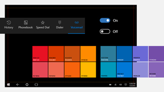

<link rel="stylesheet" href="https://az835927.vo.msecnd.net/sites/uwp/Resources/css/custom.css"> 

# Téléchargements de conceptions pour les applications UWP

Cette section regroupe des téléchargements liés à la conception et à l’interface utilisateur des applications UWP. Pour obtenir des outils supplémentaires, tels que Visual Studio, consultez [la page principale des téléchargements](https://developer.microsoft.com/downloads). 

## Modèles de conception

  

    
<b>PowerPoint</b> 
Ce support dispose de tous les éléments nécessaires pour rapidement créer une maquette de vos applications UWP, dont des contrôles et des dispositions. [Télécharger les modèles de conception pour PowerPoint](https://go.microsoft.com/fwlink/p/?LinkId=534632)

  

  

  

  

            
<b>AdobeIllustrator</b> 
Ces modèles Adobe Illustrator fournissent des contrôles et dispositions pour la conception d’applications UWP. [Télécharger les modèles de conception pour Adobe Illustrator](https://go.microsoft.com/fwlink/p/?LinkId=534634)
    
  

  

  

  

            
<b>Adobe Photoshop</b> 
Contrôles et dispositions pour la conception d’applications UWP dans AdobePhotoshop. [Télécharger les modèles de conception pour AdobePhotoshop](http://go.microsoft.com/fwlink/p/?LinkId=626453)
    
  

  

  

## Outils

  

            
<b>Générateur de vignettes et d’icônes pour AdobePhotoshop</b> 
Cet ensemble d’actions pour AdobePhotoshop génère les 68vignettes et icônes recommandées à partir de seulement 7fichiers.  [Télécharger le générateur de vignettes et d’icônes](http://go.microsoft.com/fwlink/p/?LinkId=760394)
    
  

  

  

  

            
<b>Outil Profileur pour AdobeIllustrator</b> 
Générez facilement des lignes rouges à partir de vos prototypesIllustrator.  [Télécharger l’outil Profileur pour AdobeIllustrator](https://go.microsoft.com/fwlink/p/?LinkId=534641)
    
  

  

  

## Exemples

  

            
<b>Application de partage de photos</b>  
Cet exemple d’application présente un scénario de partage de photos sur des réseaux sociaux du monde réel. Il propose une démonstration de diverses fonctionnalités, telles que la conception réactive, les achats intégrés, les services Azure, les notifications Push, etc.  [Télécharger l’exemple d’application de partage de photos](http://go.microsoft.com/fwlink/p/?LinkId=760402) [En savoir plus sur PhotoSharingApp](http://go.microsoft.com/fwlink/p/?LinkId=760401)
    
  

  

  

  

            
<b>Hue Lights </b> 
Cet exemple intègre des fonctionnalités Windows avec une automatisation domestique intelligente. Il décrit plus précisément la manière dont vous pouvez utiliser Cortana et la technologie Bluetooth Low Energy (Bluetooth LE) pour créer une expérience interactive avec les ampoules Hue Phillips (système d’éclairage par Wi-Fi).  [Télécharger l’exemple Hue Lights](https://github.com/Microsoft/Windows-appsample-huelightcontroller/archive/master.zip) [En savoir plus sur l’exemple Hue Lights](https://github.com/Microsoft/Windows-appsample-huelightcontroller)
    
  

  

  

<b>Vous voulez plus de code?</b> Consultez la page d’exemples Windows pour obtenir la liste complète de tous nos exemples d’applications UWP. [Accédez au portail d’exemples](https://developer.microsoft.com/samples)

<!--HONumber=Jul16_HO1-->

