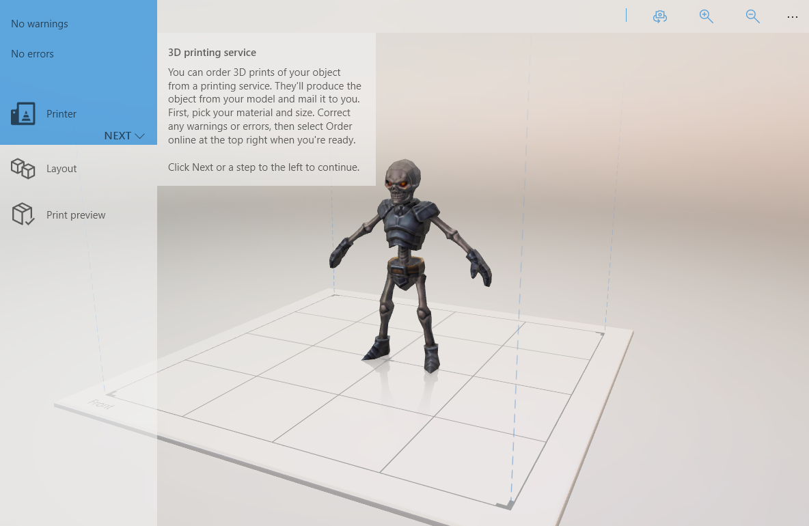

# Impression3D

\[ Mise à jour pour les applications UWP sur Windows10. Pour les articles sur Windows8.x, voir l’[archive](http://go.microsoft.com/fwlink/p/?linkid=619132). \]

Cette section explique comment utiliser l’[API d’impression 3D](https://msdn.microsoft.com/library/windows/apps/windows.graphics.printing3d.aspx) pour ajouter la fonctionnalité d’impression 3D à votre application Windows universelle.  

<!--  -->

Pour plus d’informations sur l’impression 3D avec Windows10, y compris les ressources pour les partenaires de matériel, forums de discussion de la Communauté et des informations générales sur les fonctionnalités d’impression 3D, voir le site [Impression 3D avec Windows10](https://developer.microsoft.com/windows/hardware/3d-print-support-windows-10) dans le Centre de développement matériel.

| Rubrique | Description |
|-------|-------------|
| [Impression3D à partir de votre application](3d-print-from-app.md) | Découvrez comment ajouter des fonctionnalités d’impression3D à votre application Windows universelle. Cette rubrique explique comment lancer la boîte de dialogue d’impression3D après s’être assuré que votre modèle3D est imprimable et au format qui convient. |
| [Générer un package 3MF](generate-3mf.md) | Décrit la structure du type de fichier3DManufacturingFormat, ainsi que les procédures de création et de manipulation de ce type de fichier avec l’API Windows.Graphics.Printing3D. |

## Rubriques connexes

* [Impression 3D avec Windows10 (Centre de développement matériel)](https://developer.microsoft.com/windows/hardware/3d-print-support-windows-10)
* [Exemple d’impression3DUWP](https://github.com/Microsoft/Windows-universal-samples/tree/master/Samples/3DPrinting)
* [Exemple d’impression3DUWP à partir de Unity](https://github.com/Microsoft/Windows-universal-samples/tree/master/Samples/3DPrintingFromUnity)

 
