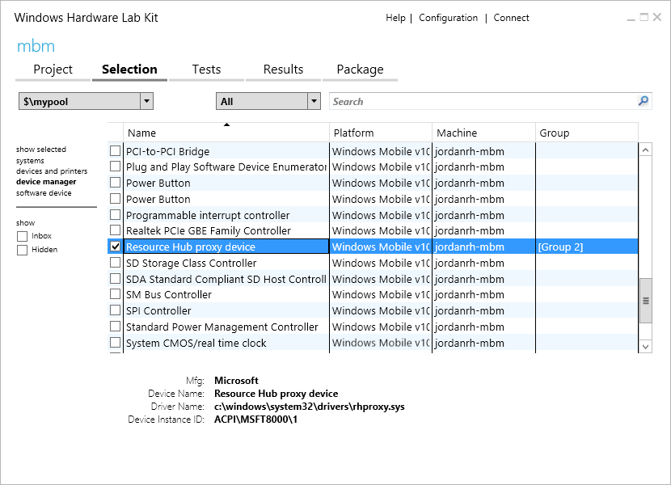

# <a name="enable-usermode-access-to-gpio-i2c-and-spi"></a>Activer l’accès en mode utilisateur à GPIO, I2C et SPI

Windows10contient de nouvelles API d’accès à GPIO, I2C, SPI et UART directement à partir du mode utilisateur. Les cartes de développement comme RaspberryPi2 exposent un sous-ensemble de ces connexions, qui permettent aux utilisateurs d’étendre un module de calcul de base avec des circuits personnalisés pour l’adressage d’une application donnée. Ces bus de bas niveau sont généralement partagés avec d’autres fonctions critiques intégrées, et seul un sous-ensemble des broches et des bus GPIO sont exposés sur les en-têtes. Pour préserver la stabilité du système, il est nécessaire de spécifier les broches et les bus qui peuvent être modifiés en toute sécurité par les applications en mode utilisateur.

Ce document explique comment spécifier cette configuration dans l’interface ACPI et fournit des outils pour confirmer que la configuration a été correctement spécifiée.

> [!IMPORTANT]
> Ce document est destiné aux développeurs UEFI et ACPI. Il suppose que vous êtes déjà familiarisé avec l’interfaceACPI, la création d’ASL et les extensions SpbCx/GpioClx.

L’accès en mode utilisateur aux bus de bas niveau sur Windows est ajouté via les infrastructures `GpioClx` et `SpbCx` existantes. Un nouveau pilote appelé *RhProxy*, uniquement disponible sur Windows IoT Core et Windows Enterprise, expose les ressources `GpioClx` et `SpbCx` au mode utilisateur. Pour activer les API, vous devez avoir déclaré un nœud d’appareil pour rhproxy dans vos tables ACPI avec chacune des ressources GPIO et SPB qui doivent être exposées au mode utilisateur. Ce document présente la procédure de création et de vérification de l’ASL.

## <a name="asl-by-example"></a>ASL par exemple

Examinons la déclaration d’un nœud d’appareil rhproxy sur RaspberryPi2. Tout d’abord, créez la déclaration d’appareil ACPI dans l’étendue \\_SB.

```cpp
Device(RHPX)
{
    Name(_HID, "MSFT8000")
    Name(_CID, "MSFT8000")
    Name(_UID, 1)
}
```

* _HID – Hardware Id. Définissez ce paramètre sur un ID matériel spécifique au fournisseur.
* _CID – Compatible Id. Il doit s’agir de «MSFT8000».
* _UID – ID unique. Définissez ce paramètre sur1.

Nous allons ensuite déclarer chacune des ressources GPIO et SPB qui doivent être exposées au mode utilisateur. L’ordre dans lequel les ressources sont déclarées est important, car les index de ressource sont utilisés pour associer les propriétés avec des ressources. Si plusieurs bus I2C ou SPI sont exposés, le premier bus déclaré est considéré comme le bus « par défaut » pour ce type et sera l’instance renvoyée par les méthodes `GetDefaultAsync()` de [Windows.Devices.I2c.I2cController](https://msdn.microsoft.com/library/windows/apps/windows.devices.i2c.i2ccontroller.aspx) et [Windows.Devices.Spi.SpiController](https://msdn.microsoft.com/library/windows/apps/windows.devices.spi.spicontroller.aspx).

### <a name="spi"></a>SPI

RaspberryPi comporte deux bus SPI exposés. SPI0 comporte deux lignes de sélection de microprocesseur et SPI1 comporte une seule ligne de sélection de microprocesseur. Une déclaration de ressource SPISerialBus() est requise pour chaque ligne de sélection de processeur pour chaque bus. Les deux déclarations de ressource SPISerialBus suivantes sont pour les deux lignes de sélection de processeur sur SPI0. Le champ DeviceSelection contient une valeur unique que le pilote interprète comme un identificateur de ligne de sélection de microprocesseur. La valeur exacte que vous indiquez dans le champ DeviceSelection dépend de la manière dont votre pilote interprète ce champ du descripteur de connexion ACPI.

```cpp
// Index 0
SPISerialBus(              // SCKL - GPIO 11 - Pin 23
                           // MOSI - GPIO 10 - Pin 19
                           // MISO - GPIO 9  - Pin 21
                           // CE0  - GPIO 8  - Pin 24
    0,                     // Device selection (CE0)
    PolarityLow,           // Device selection polarity
    FourWireMode,          // wiremode
    0,                     // databit len: placeholder
    ControllerInitiated,   // slave mode
    0,                     // connection speed: placeholder
    ClockPolarityLow,      // clock polarity: placeholder
    ClockPhaseFirst,       // clock phase: placeholder
    "\\_SB.SPI0",          // ResourceSource: SPI bus controller name
    0,                     // ResourceSourceIndex
                           // Resource usage
    )                      // Vendor Data

// Index 1
SPISerialBus(              // SCKL - GPIO 11 - Pin 23
                           // MOSI - GPIO 10 - Pin 19
                           // MISO - GPIO 9  - Pin 21
                           // CE1  - GPIO 7  - Pin 26
    1,                     // Device selection (CE1)
    PolarityLow,           // Device selection polarity
    FourWireMode,          // wiremode
    0,                     // databit len: placeholder
    ControllerInitiated,   // slave mode
    0,                     // connection speed: placeholder
    ClockPolarityLow,      // clock polarity: placeholder
    ClockPhaseFirst,       // clock phase: placeholder
    "\\_SB.SPI0",          // ResourceSource: SPI bus controller name
    0,                     // ResourceSourceIndex
                           // Resource usage
    )                      // Vendor Data

```

Comment le logiciel sait-il que ces deux ressources doivent être associées au même bus? Le mappage entre le nom convivial de bus et l’index de ressource est spécifié dans le DSD:

```cpp
Package(2) { "bus-SPI-SPI0", Package() { 0, 1 }},
```

Cela crée un bus nommé «SPI0» avec deux lignes de sélection de processeur: les index de ressource0 et1. Plusieurs autres propriétés sont requises pour déclarer les fonctionnalités du bus SPI.

```cpp
Package(2) { "SPI0-MinClockInHz", 7629 },
Package(2) { "SPI0-MaxClockInHz", 125000000 },
```

Les propriétés **MinClockInHz** et **MaxClockInHz** spécifient les vitesses d’horloge minimale et maximale prises en charge par le contrôleur. L’API empêche les utilisateurs de spécifier des valeurs en dehors de cette plage. La vitesse d’horloge est transmise à votre piloteSPB dans le champ _SPE du descripteur de connexion (ACPI section6.4.3.8.2.2).

```cpp
Package(2) { "SPI0-SupportedDataBitLengths", Package() { 8 }},
```

La propriété **SupportedDataBitLengths** répertorie les longueurs de bits de données prises en charge par le contrôleur. Il est possible de spécifier plusieurs valeurs dans une liste séparée par des virgules. L’API empêche les utilisateurs de spécifier des valeurs en dehors de cette liste. La longueur de bits de données est transmise au piloteSPB dans le champ _LEN du descripteur de connexion (ACPI section6.4.3.8.2.2).

Vous pouvez considérer ces déclarations de ressources comme des «modèles». Certains champs sont résolus au démarrage du système tandis que d’autres sont spécifiés dynamiquement lors de l’exécution. Les champs suivants du descripteur SPISerialBus sont résolus:

* DeviceSelection
* DeviceSelectionPolarity
* WireMode
* SlaveMode
* ResourceSource

Les champs suivants sont des espaces réservés pour les valeurs spécifiées par l’utilisateur lors de l’exécution:

* DataBitLength
* ConnectionSpeed
* ClockPolarity
* ClockPhase

Dans la mesure où SPI1 contient une seule ligne de sélection de processeur, une seule ressource `SPISerialBus()` est déclarée :

```cpp
// Index 2
SPISerialBus(              // SCKL - GPIO 21 - Pin 40
                           // MOSI - GPIO 20 - Pin 38
                           // MISO - GPIO 19 - Pin 35
                           // CE1  - GPIO 17 - Pin 11
    1,                     // Device selection (CE1)
    PolarityLow,           // Device selection polarity
    FourWireMode,          // wiremode
    0,                     // databit len: placeholder
    ControllerInitiated,   // slave mode
    0,                     // connection speed: placeholder
    ClockPolarityLow,      // clock polarity: placeholder
    ClockPhaseFirst,       // clock phase: placeholder
    "\\_SB.SPI1",          // ResourceSource: SPI bus controller name
    0,                     // ResourceSourceIndex
                           // Resource usage
    )                      // Vendor Data

```

La déclaration de nom convivial qui l’accompagne (obligatoire) est spécifiée dans le DSD et fait référence à l’index de cette déclaration de ressource.

```cpp
Package(2) { "bus-SPI-SPI1", Package() { 2 }},
```

Cela crée un bus nommé «SPI1» et l’associe à l’index de ressource2.

#### <a name="spi-driver-requirements"></a>Exigences liées au piloteSPI

* Doit utiliser `SpbCx` ou être compatible SpbCx
* Doit avoir réussi les [tests SPI dans MITT](https://msdn.microsoft.com/library/windows/hardware/dn919873.aspx)
* Doit prendre en charge une vitesse d’horloge de 4MHz
* Doit prendre en charge la longueur des données de 8bits
* Doit prendre en charge tous les Modes SPI: 0, 1, 2, 3

### <a name="i2c"></a>I2C

Ensuite, nous déclarons les ressourcesI2C. RaspberryPi expose un seul busI2C sur les broches3 et5.

```cpp
// Index 3
I2CSerialBus(              // Pin 3 (GPIO2, SDA1), 5 (GPIO3, SCL1)
    0xFFFF,                // SlaveAddress: placeholder
    ,                      // SlaveMode: default to ControllerInitiated
    0,                     // ConnectionSpeed: placeholder
    ,                      // Addressing Mode: placeholder
    "\\_SB.I2C1",          // ResourceSource: I2C bus controller name
    ,
    ,
    )                      // VendorData

```

La déclaration de nom convivial qui l’accompagne (obligatoire) est spécifiée dans le DSD:

```cpp
Package(2) { "bus-I2C-I2C1", Package() { 3 }},
```

Ce code déclare un busI2C avec un nom convivial «I2C1» qui fait référence à l’index de ressource3, qui est l’index de la ressource I2CSerialBus() que nous avons déclarée ci-dessus.

Les champs suivants du descripteur I2CSerialBus() sont résolus:

* SlaveMode
* ResourceSource

Les champs suivants sont des espaces réservés pour les valeurs spécifiées par l’utilisateur lors de l’exécution:

* SlaveAddress
* ConnectionSpeed
* AddressingMode

#### <a name="i2c-driver-requirements"></a>Exigences liées au piloteI2C

* Doit utiliser SpbCx ou être compatible SpbCx
* Doit avoir réussi les [tests I2C dans MITT](https://msdn.microsoft.com/library/windows/hardware/dn919852.aspx)
* Doit prendre en charge l’adressage 7bits
* Doit prendre en charge une vitesse d’horloge de 100KHz
* Doit prendre en charge une vitesse d’horloge de 400KHz

### <a name="gpio"></a>GPIO

Ensuite, nous déclarons tous les broches GPIO qui sont exposées au mode utilisateur. Nous vous recommandons de procéder comme suit pour décider quelles broches exposer:

* Déclarez toutes les broches sur les en-têtes exposées.
* Déclarez les broches connectées à des fonctions intégrées utiles comme les boutons et les voyants.
* Ne déclarez pas les broches qui sont réservées aux fonctions système ou qui ne sont connectées à rien.

Le bloc suivant d’ASL déclare deux broches: GPIO4 et GPIO5. Les autres broches n’apparaissent pas ici par souci de brièveté. L’annexeC contient un exemple de script powershell qui peut être utilisé pour générer les ressourcesGPIO.

```cpp
// Index 4 – GPIO 4
GpioIO(Shared, PullUp, , , , “\\_SB.GPI0”, , , , ) { 4 }
GpioInt(Edge, ActiveBoth, Shared, PullUp, 0, “\\_SB.GPI0”,) { 4 }

// Index 6 – GPIO 5
GpioIO(Shared, PullUp, , , , “\\_SB.GPI0”, , , , ) { 5 }
GpioInt(Edge, ActiveBoth, Shared, PullUp, 0, “\\_SB.GPI0”,) { 5 }
```

Les conditions suivantes doivent être respectées lors de la déclaration des brochesGPIO:

* Seuls les contrôleurs GPIO mappés en mémoire sont pris en charge. Les contrôleurs GPIO interfacés sur I2C/SPI ne sont pas pris en charge. Le pilote du contrôleur est un contrôleur mappé en mémoire s’il définit l’indicateur [MemoryMappedController](https://msdn.microsoft.com/library/windows/hardware/hh439449.aspx) dans la structure [CLIENT_CONTROLLER_BASIC_INFORMATION](https://msdn.microsoft.com/library/windows/hardware/hh439358.aspx) en réponse au rappel [CLIENT_QueryControllerBasicInformation](https://msdn.microsoft.com/library/windows/hardware/hh439399.aspx).
* Chaque broche nécessite une ressource GpioIO et une ressource GpioInt. La ressource GpioInt doit immédiatement suivre la ressource GpioIO et doit faire référence au même numéro de broche.
* Les ressources GPIO doivent être classées par numéro de broche croissant.
* Chaque ressource GpioIO et GpioInt doit contenir exactement un numéro de broche dans la liste des broches.
* Le champ ShareType de ces deux descripteurs doit valoir Shared
* Le champ EdgeLevel du descripteur GpioInt doit valoir Edge
* Le champ ActiveLevel du descripteur GpioInt doit valoir ActiveBoth
* Le champ PinConfig
  * Doit avoir la même valeur dans les descripteurs GpioIO et GpioInt
  * Doit valoir PullUp, PullDown ou PullNone. Il ne peut pas valoir PullDefault.
  * La configuration de collecte doit correspondre à l’état de mise sous tension de la broche. Le fait d’activer le mode de collecte spécifié pour la broche à partir de l’état de mise sous tension ne doit pas changer l’état de la broche. Par exemple, si la feuille de données spécifie que la broche est fournie avec une résistance pull-up, spécifiez PinConfig comme PullUp.

Le code d’initialisation du microprogramme, d’UEFI et du pilote ne doit pas modifier l’état d’une broche à partir de son état de mise sous tension au cours du démarrage. L’utilisateur est le seul à savoir quels éléments sont attachés à une broche et par conséquent, quelles transitions d’état sont sécurisées. L’état de mise sous tension de chaque broche doit être documenté pour que les utilisateurs puissent concevoir un matériel qui crée une interface correcte avec une broche. Une broche ne doit pas changer d’état de façon inattendue au cours du démarrage.

#### <a name="supported-drive-modes"></a>Modes de lecteur pris en charge

Si votre contrôleur GPIO prend en charge les résistances pull-up et pull-down intégrées en plus d’une impédance d’entrée et de sortie CMOS élevée, vous devez spécifier cela avec la propriété SupportedDriveModes facultative.

```cpp
Package (2) { “GPIO-SupportedDriveModes”, 0xf },
```

La propriété SupportedDriveModes indique quels modes de lecteur sont pris en charge par le contrôleur GPIO. Dans l’exemple ci-dessus, tous les modes de lecteur suivants sont pris en charge. La propriété est un masque de bits des valeurs suivantes:

| Valeur de l’indicateur | Mode du lecteur | Description |
|------------|------------|-------------|
| 0x1        | InputHighImpedance | La broche prend en charge une impédance d’entrée élevée, qui correspond à la valeur «PullNone» dans l’interface ACPI. |
| 0x2        | InputPullUp | La broche prend en charge une résistance pull-up intégrée, qui correspond à la valeur «PullUp» dans l’interface ACPI. |
| 0x4        | InputPullDown | La broche prend en charge une résistance pull-down intégrée, qui correspond à la valeur «PullDown» dans l’interface ACPI. |
| 0x8        | OutputCmos | La broche prend en charge la génération de fortes hausses et de fortes baisses (contrairement aux purges directes). |

InputHighImpedance et OutputCmos sont pris en charge par la plupart des contrôleurs GPIO. Si la propriété SupportedDriveModes n’est pas spécifiée, il s’agit de la valeur par défaut.

Si un signal GPIO passe à travers un convertisseur de niveau avant d’atteindre un en-tête exposé, déclarez les modes du lecteur pris en charge par le SOC, même si le mode du lecteur n’est pas observable sur l’en-tête externe. Par exemple, si une broche passe à travers un convertisseur de niveau bidirectionnel pour apparaître comme un collecteur ouvert avec résistance pull-up, vous n’observerez jamais un état d’impédance élevé sur l’en-tête exposé même si la broche est configurée avec une impédance d’entrée élevée. Vous devez toujours déclarer que la broche prend en charge une impédance d’entrée élevée.

#### <a name="pin-numbering"></a>Numérotation de broche

Windows prend en charge deux modèles de numérotation de broche:

* Numérotation séquentielle de broche: les utilisateurs voient des nombres comme 0, 1, 2 jusqu’au nombre de broches exposées. 0 est la première ressource GpioIo déclarée dans ASL, 1 est la deuxième ressource GpioIo déclarée dans ASL et ainsi de suite.
* Numérotation native de broche: les utilisateurs voient les numéros de broche spécifiés dans les descripteurs GpioIo, par exemple, 4, 5, 12, 13, ... .

```cpp
Package (2) { “GPIO-UseDescriptorPinNumbers”, 1 },
```

La propriété **UseDescriptorPinNumbers** indique à Windows d’utiliser la numérotation native de broche au lieu de la numérotation séquentielle. Si la propriété UseDescriptorPinNumbers n’est pas spécifiée ou si sa valeur vaut zéro, Windows utilise la numérotation séquentielle de broche par défaut.

Si la numérotation native de broche est utilisée, vous devez également spécifier la propriété **PinCount**.

```cpp
Package (2) { “GPIO-PinCount”, 54 },
```

La propriété **PinCount** doit correspondre à la valeur renvoyée par le biais de la propriété **TotalPins** dans le rappel [CLIENT_QueryControllerBasicInformation](https://msdn.microsoft.com/library/windows/hardware/hh439399.aspx) du pilote `GpioClx`.

Choisissez le modèle de numérotation le plus compatible avec la documentation publiée existante pour votre carte. Par exemple, RaspberryPi utilise la numérotation native de broche car de nombreux diagrammes de brochage existants utilisent les numéros de brocheBCM2835. MinnowBoardMax utilise la numérotation séquentielle de broche car il y a peu de diagrammes de brochage existants, et la numérotation séquentielle de broche simplifie l’expérience du développeur car seules 10broches sur plus de200 sont exposées. La décision d’utiliser la numérotation séquentielle ou native de broche doit avoir pour objet de réduire la confusion du développeur.

#### <a name="gpio-driver-requirements"></a>Exigences liées au piloteGPIO

* Doit utiliser `GpioClx`
* Doit être mappé en mémoire sur SOC
* Doit utiliser la gestion d’interruption ActiveBoth émulée

### <a name="uart"></a>UART

Si votre pilote UART utilise `SerCx` ou `SerCx2`, vous pouvez utiliser rhproxy pour exposer le pilote en mode utilisateur. Les pilotes UART qui créent une interface de périphérique de type `GUID_DEVINTERFACE_COMPORT` n’ont pas besoin d’utiliser rhproxy. Le pilote de boîte de réception `Serial.sys` est dans l’un de ces cas.

Pour exposer un UART de style `SerCx` au mode utilisateur, déclarez une ressource `UARTSerialBus` en procédant comme suit.

```cpp
// Index 2
UARTSerialBus(           // Pin 17, 19 of JP1, for SIO_UART2
    115200,                // InitialBaudRate: in bits ber second
    ,                      // BitsPerByte: default to 8 bits
    ,                      // StopBits: Defaults to one bit
    0xfc,                  // LinesInUse: 8 1-bit flags to declare line enabled
    ,                      // IsBigEndian: default to LittleEndian
    ,                      // Parity: Defaults to no parity
    ,                      // FlowControl: Defaults to no flow control
    32,                    // ReceiveBufferSize
    32,                    // TransmitBufferSize
    "\\_SB.URT2",          // ResourceSource: UART bus controller name
    ,
    ,
    ,
    )
```

Seul le champ ResourceSource est résolu. Tous les autres champs sont des espaces réservés pour les valeurs spécifiées par l’utilisateur lors de l’exécution.

La déclaration de nom convivial associée est la suivante:

```cpp
Package(2) { "bus-UART-UART2", Package() { 2 }},
```

Ce code affecte le nom convivial «UART2» au contrôleur, qui est l’identificateur dont les utilisateurs se serviront pour accéder au bus à partir du mode utilisateur.

## <a name="runtime-pin-muxing"></a>Multiplexage de broche au moment de l’exécution

Le multiplexage de broche est la capacité d’utiliser la même broche physique pour différentes fonctions. Il est possible d’acheminer plusieurs appareils sur puce, par exemple un contrôleurI2C, un contrôleurSPI et un contrôleurGPIO, vers la même broche physique sur unSOC. Le bloc mux contrôle quelle fonction est active sur la broche à tout moment. Généralement, le microprogramme est chargé de déterminer les affectations de fonction au démarrage, et ces affectations restent statiques tout au long de la session de démarrage. Le multiplexage de broche au moment de l’exécution ajoute la capacité de reconfigurer les affectations de fonction de la broche à l’exécution. Le fait de laisser les utilisateurs choisir la fonction d’une broche à l’exécution accélère le développement en leur permettant de reconfigurer rapidement les broches d’une carte. En outre, cela permet au matériel de prendre en charge un plus large éventail d’applications qu’une configuration statique.

Les utilisateurs profitent de la prise en charge du multiplexage pour GPIO, I2C, SPI et UART sans écrire de code supplémentaire. Quand un utilisateur ouvre un GPIO ou un bus en utilisant [OpenPin()](https://msdn.microsoft.com/library/dn960157.aspx) ou [FromIdAsync()](https://msdn.microsoft.com/windows.devices.i2c.i2cdevice.fromidasync), les broches physiques sous-jacentes sont automatiquement multiplexées sur la fonction demandée. Si les broches sont déjà utilisées par une autre fonction, l’appel à OpenPin() ou FromIdAsync() échoue. Lorsque l’utilisateur ferme l’appareil en supprimant l’objet [GpioPin](https://msdn.microsoft.com/library/windows/apps/windows.devices.gpio.gpiopin.aspx), [I2cDevice](https://msdn.microsoft.com/library/windows/apps/windows.devices.i2c.i2cdevice.aspx), [SpiDevice](https://msdn.microsoft.com/library/windows/apps/windows.devices.spi.spidevice.aspx) ou [SerialDevice](https://msdn.microsoft.com/library/windows/apps/windows.devices.serialcommunication.serialdevice.aspx), les broches sont libérées, ce qui permet de les ouvrir ultérieurement pour une autre fonction.

Windows contient la prise en charge intégrée pour le multiplexage de broche dans les infrastructures [GpioClx](https://msdn.microsoft.com/library/windows/hardware/hh439515.aspx), [SpbCx](https://msdn.microsoft.com/library/windows/hardware/hh406203.aspx) et [SerCx](https://msdn.microsoft.com/library/windows/hardware/dn265349.aspx). Ces infrastructures fonctionnent ensemble pour basculer automatiquement une broche vers la fonction appropriée lors de l’accès à une broche ou un bus GPIO. L’accès aux broches fait l’objet d’un arbitrage pour éviter les conflits entre plusieurs clients. Outre cette prise en charge intégrée, les interfaces et les protocoles de multiplexage de broche ont un usage général et peuvent être étendus pour prendre en charge des scénarios et des appareils supplémentaires.

Ce document décrit tout d’abord les interfaces et les protocoles sous-jacents impliqués dans le multiplexage de broche et décrit comment ajouter la prise en charge du multiplexage de broche aux pilotes de contrôleurs GpioClx, SpbCx et SerCx.

### <a name="pin-muxing-architecture"></a>Architecture de multiplexage de broche

Cette section décrit les interfaces et les protocoles sous-jacents impliqués dans le multiplexage de broche. Il n’est pas obligatoire de connaître les protocoles sous-jacents pour prendre en charge le multiplexage de broche avec les pilotes GpioClx/SpbCx/SerCx. Pour plus d’informations sur la prise en charge du multiplexage de broche avec les pilotes GpioCls/SpbCx/SerCx, consultez [Implémentation de la prise en charge du multiplexage de broche dans les pilotes clients GpioClx](#supporting-muxing-support-in-gpioclx-client-drivers) et [Utilisation de la prise en charge du multiplexage dans les pilotes de contrôleur SpbCx et SerCx](#supporting-muxing-in-spbcx-and-sercx-controller-drivers).

Le multiplexage de broche est accompli via l’utilisation conjointe de plusieurs composants.

* Les serveurs de multiplexage de broche: il s’agit des pilotes qui contrôlent le bloc de contrôle du multiplexage de broche. Les serveurs de multiplexage de broche reçoivent les requêtes de multiplexage de broche des clients via les requêtes de réservation des ressources de multiplexage (via les requêtes *IRP_MJ_CREATE*) et les requêtes de basculement de la fonction d’une broche (via les requêtes *IOCTL_GPIO_COMMIT_FUNCTION_CONFIG_PINS*). Le serveur de multiplexage de broche est généralement le pilote GPIO, dans la mesure où le bloc de multiplexage fait parfois partie du bloc GPIO. Même si le bloc de multiplexage est un périphérique distinct, le pilote GPIO est un emplacement logique pour placer des fonctionnalités de multiplexage.
* Clients du multiplexage de broche: il s’agit des pilotes qui utilisent le multiplexage de broche. Les clients du multiplexage de broche reçoivent des ressources de multiplexage de broche à partir du microprogramme ACPI. Les ressources de multiplexage de broche sont un type de ressource de connexion et sont gérées par le concentrateur de ressources. Les clients du multiplexage de broche réservent des ressources de multiplexage de broche en ouvrant un handle vers la ressource. Pour appliquer un changement de matériel, les clients doivent valider la configuration en envoyant une requête *IOCTL_GPIO_COMMIT_FUNCTION_CONFIG_PINS*. Les clients libèrent les ressources de multiplexage de broche en fermant le handle, auquel cas la configuration du multiplexage est rétablie à son état par défaut.
* Microprogramme ACPI : spécifie la configuration du multiplexage avec des ressources `MsftFunctionConfig()`. Les ressources MsftFunctionConfig expriment quelles broches sont requises par un client, et dans quelle configuration de multiplexage. Les ressources MsftFunctionConfig contiennent le numéro de fonction, la configuration de la résistance pull et la liste des numéros de broche. Les ressources MsftFunctionConfig sont fournies aux clients du multiplexage de broche en tant que ressources matérielles, qui sont reçues par les pilotes dans leur rappel PrepareHardware de la même manière que les ressources de connexion GPIO et SPB. Les clients reçoivent un ID de concentrateur de ressource qui peut être utilisé pour ouvrir un handle vers la ressource.

> Vous devez faire passer le commutateur de ligne de commande `/MsftInternal` à `asl.exe` pour compiler les fichiers ASL contenant les descripteurs `MsftFunctionConfig()`, car ces descripteurs sont actuellement examinés par le comité de travail ACPI. Par exemple: `asl.exe /MsftInternal dsdt.asl`

La séquence des opérations impliquées dans le multiplexage de broche est présentée ci-dessous.


1. Le client reçoit les ressources MsftFunctionConfig à partir du microprogramme ACPI dans son rappel [EvtDevicePrepareHardware()](https://msdn.microsoft.com/library/windows/hardware/ff540880.aspx).
2. Le client utilise la fonction d’assistance du concentrateur de ressources `RESOURCE_HUB_CREATE_PATH_FROM_ID()` pour créer un chemin d’accès à partir de l’ID de ressource, puis ouvre un handle vers le chemin d’accès (à l’aide de [ZwCreateFile()](https://msdn.microsoft.com/library/windows/hardware/ff566424.aspx), [IoGetDeviceObjectPointer()](https://msdn.microsoft.com/library/windows/hardware/ff549198.aspx) ou [WdfIoTargetOpen()](https://msdn.microsoft.com/library/windows/hardware/ff548634.aspx)).
3. Le serveur extrait l’ID du concentrateur de ressources à partir du chemin d’accès au fichier à l’aide des fonctions d’assistance du concentrateur de ressources `RESOURCE_HUB_ID_FROM_FILE_NAME()`, puis interroge le concentrateur de ressources pour récupérer le descripteur des ressources.
4. Le serveur effectue un arbitrage du partage pour chaque broche dans le descripteur et termine la requête IRP_MJ_CREATE.
5. Le client émet une requête *IOCTL_GPIO_COMMIT_FUNCTION_CONFIG_PINS* sur le handle reçu.
6. En réponse à *IOCTL_GPIO_COMMIT_FUNCTION_CONFIG_PINS*, le serveur effectue l’opération de multiplexage du matériel en rendant la fonction spécifiée active sur chaque broche.
7. Le client poursuit les opérations qui dépendent de la configuration du multiplexage de broche demandée.
8. Lorsque le client n’a plus besoin que les broches soient multiplexées, il ferme le handle.
9. En réponse à la fermeture du handle, le serveur rétablit l’état initial de la broche.

### <a name="protocol-description-for-pin-muxing-clients"></a>Description du protocole pour les clients du multiplexage de broche

Cette section explique comment un client utilise la fonctionnalité de multiplexage de broche. Cela ne s’applique pas aux pilotes de contrôleur `SerCx` et `SpbCx`, dans la mesure où les infrastructures implémentent ce protocole pour le compte des pilotes de contrôleur.

#### <a name="parsing-resources"></a>Analyse des ressources

Un pilote WDF reçoit des ressources `MsftFunctionConfig()` dans sa routine [EvtDevicePrepareHardware()](https://msdn.microsoft.com/library/windows/hardware/ff540880.aspx). Les ressources MsftFunctionConfig peuvent être identifiées par les champs suivants:

```cpp
CM_PARTIAL_RESOURCE_DESCRIPTOR::Type = CmResourceTypeConnection
CM_PARTIAL_RESOURCE_DESCRIPTOR::u.Connection.Class = CM_RESOURCE_CONNECTION_CLASS_FUNCTION_CONFIG
CM_PARTIAL_RESOURCE_DESCRIPTOR::u.Connection.Type = CM_RESOURCE_CONNECTION_TYPE_FUNCTION_CONFIG
```

Une routine `EvtDevicePrepareHardware()` peut extraire des ressources MsftFunctionConfig comme suit:

```cpp
EVT_WDF_DEVICE_PREPARE_HARDWARE evtDevicePrepareHardware;

_Use_decl_annotations_
NTSTATUS
evtDevicePrepareHardware (
    WDFDEVICE WdfDevice,
    WDFCMRESLIST ResourcesTranslated
    )
{
    PAGED_CODE();

    LARGE_INTEGER connectionId;
    ULONG functionConfigCount = 0;

    const ULONG resourceCount = WdfCmResourceListGetCount(ResourcesTranslated);
    for (ULONG index = 0; index < resourceCount; ++index) {
        const CM_PARTIAL_RESOURCE_DESCRIPTOR* resDescPtr =
            WdfCmResourceListGetDescriptor(ResourcesTranslated, index);

        switch (resDescPtr->Type) {
        case CmResourceTypeConnection:
            switch (resDescPtr->u.Connection.Class) {
            case CM_RESOURCE_CONNECTION_CLASS_FUNCTION_CONFIG:
                switch (resDescPtr->u.Connection.Type) {
                case CM_RESOURCE_CONNECTION_TYPE_FUNCTION_CONFIG:
                    switch (functionConfigCount) {
                    case 0:
                        // save the connection ID
                        connectionId.LowPart = resDescPtr->u.Connection.IdLowPart;
                        connectionId.HighPart = resDescPtr->u.Connection.IdHighPart;
                        break;
                    } // switch (functionConfigCount)
                    ++functionConfigCount;
                    break; // CM_RESOURCE_CONNECTION_TYPE_FUNCTION_CONFIG

                } // switch (resDescPtr->u.Connection.Type)
                break; // CM_RESOURCE_CONNECTION_CLASS_FUNCTION_CONFIG
            } // switch (resDescPtr->u.Connection.Class)
            break;
        } // switch
    } // for (resource list)

    if (functionConfigCount < 1) {
        return STATUS_INVALID_DEVICE_CONFIGURATION;
    }
    // TODO: save connectionId in the device context for later use

    return STATUS_SUCCESS;
}
```

#### <a name="reserving-and-committing-resources"></a>Réservation et validation des ressources

Quand un client veut multiplexer des broches, il réserve et valide la ressource MsftFunctionConfig. L’exemple suivant montre comment un client peut réserver et valider des ressources MsftFunctionConfig.

```cpp
_IRQL_requires_max_(PASSIVE_LEVEL)
NTSTATUS AcquireFunctionConfigResource (
    WDFDEVICE WdfDevice,
    LARGE_INTEGER ConnectionId,
    _Out_ WDFIOTARGET* ResourceHandlePtr
    )
{
    PAGED_CODE();

    //
    // Form the resource path from the connection ID
    //
    DECLARE_UNICODE_STRING_SIZE(resourcePath, RESOURCE_HUB_PATH_CHARS);
    NTSTATUS status = RESOURCE_HUB_CREATE_PATH_FROM_ID(
            &resourcePath,
            ConnectionId.LowPart,
            ConnectionId.HighPart);
    if (!NT_SUCCESS(status)) {
        return status;
    }

    //
    // Create a WDFIOTARGET
    //
    WDFIOTARGET resourceHandle;
    status = WdfIoTargetCreate(WdfDevice, WDF_NO_ATTRIBUTES, &resourceHandle);
    if (!NT_SUCCESS(status)) {
        return status;
    }

    //
    // Reserve the resource by opening a WDFIOTARGET to the resource
    //
    WDF_IO_TARGET_OPEN_PARAMS openParams;
    WDF_IO_TARGET_OPEN_PARAMS_INIT_OPEN_BY_NAME(
        &openParams,
        &resourcePath,
        FILE_GENERIC_READ | FILE_GENERIC_WRITE);

    status = WdfIoTargetOpen(resourceHandle, &openParams);
    if (!NT_SUCCESS(status)) {
        return status;
    }
    //
    // Commit the resource
    //
    status = WdfIoTargetSendIoctlSynchronously(
            resourceHandle,
            WDF_NO_HANDLE,      // WdfRequest
            IOCTL_GPIO_COMMIT_FUNCTION_CONFIG_PINS,
            nullptr,            // InputBuffer
            nullptr,            // OutputBuffer
            nullptr,            // RequestOptions
            nullptr);           // BytesReturned

    if (!NT_SUCCESS(status)) {
        WdfIoTargetClose(resourceHandle);
        return status;
    }

    //
    // Pins were successfully muxed, return the handle to the caller
    //
    *ResourceHandlePtr = resourceHandle;
    return STATUS_SUCCESS;
}
```

Le pilote doit stocker le WDFIOTARGET dans l’une de ses zones de contexte afin de pouvoir être fermé ultérieurement. Lorsque le pilote est prêt à libérer la configuration du multiplexage, il doit fermer le handle de ressource en appelant la méthode [WdfObjectDelete()](https://msdn.microsoft.com/library/windows/hardware/ff548734.aspx) ou [WdfIoTargetClose()](https://msdn.microsoft.com/library/windows/hardware/ff548586.aspx) si vous avez l’intention de réutiliser le WDFIOTARGET.

```cpp
    WdfObjectDelete(resourceHandle);
```

Lorsque le client ferme son handle de ressource, les broches sont multiplexées pour retrouver leur état initial et peuvent alors être acquises par un client différent.

### <a name="protocol-description-for-pin-muxing-servers"></a>Description du protocole pour les serveurs du multiplexage de broche

Cette section explique comment un serveur de multiplexage de broche expose sa fonctionnalité aux clients. Cela ne s’applique pas aux pilotes de miniport `GpioClx`, dans la mesure où les infrastructures implémentent ce protocole pour le compte des pilotes clients. Pour plus d’informations sur la prise en charge du multiplexage de broche dans les pilotes clients `GpioClx`, voir [Implémentation de la prise en charge du multiplexage dans pilotes clients GpioClx](#supporting-muxing-support-in-gpioclx-client-drivers).

#### <a name="handling-irpmjcreate-requests"></a>Gestion des requêtes IRP_MJ_CREATE

Les clients ouvrent un handle vers une ressource lorsqu’ils veulent réserver une ressource de multiplexage de broche. Un serveur de multiplexage de broche reçoit des requêtes *IRP_MJ_CREATE* par le biais d’une opération d’analyse à partir du concentrateur de ressources. Le composant de chemin d’accès final de la requête *IRP_MJ_CREATE* contient l’ID du concentrateur de ressources, qui est un entier 64bits au format hexadécimal. Le serveur doit extraire l’ID du concentrateur de ressources à partir du nom de fichier en utilisant `RESOURCE_HUB_ID_FROM_FILE_NAME()` de reshub.h et envoyer *IOCTL_RH_QUERY_CONNECTION_PROPERTIES* vers le concentrateur de ressources pour obtenir le descripteur `MsftFunctionConfig()`.

Le serveur doit valider le descripteur et extraire le mode de partage et la liste des broches à partir du descripteur. Il doit ensuite effectuer l’arbitrage du partage des broches et, en cas de succès, marquer les broches comme réservées avant de terminer la requête.

L’arbitrage global du partage réussit si l’arbitrage du partage réussit pour chaque broche dans la liste des broches. Chaque broche doit être arbitrée comme suit:

* Si la broche n’est pas déjà réservée, l’arbitrage du partage réussit.
* Si la broche est déjà réservée comme broche exclusive, l’arbitrage du partage échoue.
* Si la broche est déjà réservée comme broche partagée,
  * et que la requête entrante est partagée, l’arbitrage du partage réussit.
  * et que la requête entrante est exclusive, l’arbitrage du partage échoue.

Si l’arbitrage du partage échoue, la requête doit être effectuée avec *STATUS_GPIO_INCOMPATIBLE_CONNECT_MODE*. Si l’arbitrage du partage réussit, la requête doit être effectuée avec *STATUS_SUCCESS*.

Le mode de partage de la requête entrante doit être récupéré à partir du descripteur MsftFunctionConfig, et non [IrpSp-&gt;Parameters.Create.ShareAccess](https://msdn.microsoft.com/library/windows/hardware/ff548630.aspx).

#### <a name="handling-ioctlgpiocommitfunctionconfigpins-requests"></a>Gestion des demandes IOCTL_GPIO_COMMIT_FUNCTION_CONFIG_PINS

Une fois que le client a réussi à réserver une ressource MsftFunctionConfig en ouvrant un handle, il peut envoyer *IOCTL_GPIO_COMMIT_FUNCTION_CONFIG_PINS* pour demander au serveur d’effectuer l’opération de multiplexage réelle du matériel. Lorsque le serveur reçoit *IOCTL_GPIO_COMMIT_FUNCTION_CONFIG_PINS*, pour chaque broche de la liste des broches il doit

* Définir le mode pull spécifié dans le membre PinConfiguration de la structure PNP_FUNCTION_CONFIG_DESCRIPTOR dans le matériel.
* Multiplexer la broche sur la fonction spécifiée par le membre FunctionNumber de la structure PNP_FUNCTION_CONFIG_DESCRIPTOR.

Le serveur doit ensuite effectuer la requête avec *STATUS_SUCCESS*.

La signification de FunctionNumber est définie par le serveur, et il est entendu que le descripteur MsftFunctionConfig a été créé en sachant de quelle façon le serveur interprète ce champ.

Souvenez-vous que lorsque le handle est fermé, le serveur devra rétablir la configuration des broches au moment où IOCTL_GPIO_COMMIT_FUNCTION_CONFIG_PINS a été reçu, si bien que le serveur peut avoir à enregistrer l’état des broches avant de les modifier.

#### <a name="handling-irpmjclose-requests"></a>Gestion des requêtes IRP_MJ_CLOSE

Quand un client n’a plus besoin d’une ressource de multiplexage, il ferme son handle. Quand un serveur reçoit une requête *IRP_MJ_CLOSE*, il doit rétablir l’état des broches au moment où *IOCTL_GPIO_COMMIT_FUNCTION_CONFIG_PINS* a été reçu. Si le client n’a jamais envoyé un *IOCTL_GPIO_COMMIT_FUNCTION_CONFIG_PINS*, aucune action n’est nécessaire. Le serveur doit ensuite marquer les broches comme disponibles par rapport à l’arbitrage du partage, et effectuer la requête avec *STATUS_SUCCESS*. Assurez-vous de synchroniser correctement la gestion de *IRP_MJ_CLOSE* avec la gestion de *IRP_MJ_CREATE*.

### <a name="authoring-guidelines-for-acpi-tables"></a>Création de recommandations pour les tables ACPI

Cette section décrit comment fournir des ressources de multiplexage aux pilotes clients. Notez que vous aurez besoin du compilateur Microsoft ASL build 14327 ou version ultérieure pour compiler les tables contenant des ressources `MsftFunctionConfig()`. `MsftFunctionConfig()` Les ressources sont fournies aux clients du multiplexage de broche en tant que ressources matérielles. `MsftFunctionConfig()` Les ressources doivent être fournies aux pilotes qui requièrent des modifications de multiplexage de broche, qui sont généralement des pilotes de contrôleur série et SPB, mais ne doivent pas être fournies aux pilotes de périphériques série ou SPB, dans la mesure où le pilote de contrôleur gère la configuration du multiplexage.
La macro ACPI `MsftFunctionConfig()` est définie comme suit :

```cpp
  MsftFunctionConfig(Shared/Exclusive
                PinPullConfig,
                FunctionNumber,
                ResourceSource,
                ResourceSourceIndex,
                ResourceConsumer/ResourceProducer,
                VendorData) { Pin List }

```

* Shared/Exclusive: si Exclusive est défini, cette broche peut être obtenue par un seul client à la fois. Si Shared est défini, plusieurs clients partagés peuvent acquérir la ressource. Définissez toujours ce paramètre sur Exclusive, dans la mesure où le fait d’autoriser plusieurs clients non coordonnés à accéder à une ressource mutable peut générer des courses de données et donc des résultats imprévisibles.
* PinPullConfig: l’une des valeurs
  * PullDefault: utiliser la configuration pull par défaut de mise sous tension définie par le SOC
  * PullUp: activer la résistance pull-up
  * Pulldown: activer la résistance pull-down
  * PullNone: désactiver tous les résistances pull
* FunctionNumber: le numéro de fonction à programmer dans le multiplexage.
* ResourceSource: le chemin d’espace de noms ACPI du serveur de multiplexage de broche
* ResourceSourceIndex: définissez ce paramètre sur0
* ResourceConsumer/ResourceProducer: définissez ce paramètre sur ResourceConsumer
* VendorData: données binaires facultatives dont la signification est définie par le serveur de multiplexage de broche. Ce champ doit généralement rester vide.
* Pin List: liste séparée par des virgules des numéros de broches auxquels ma configuration s’applique. Lorsque le serveur de multiplexage de broche est un pilote GpioClx, il s’agit de numéros de broches GPIO qui ont la même signification que les numéros de broche dans un descripteur GpioIo.

L’exemple suivant montre comment fournir une ressource MsftFunctionConfig() à un pilote de contrôleurI2C.

```cpp
Device(I2C1)
{
    Name(_HID, "BCM2841")
    Name(_CID, "BCMI2C")
    Name(_UID, 0x1)
    Method(_STA)
    {
        Return(0xf)
    }
    Method(_CRS, 0x0, NotSerialized)
    {
        Name(RBUF, ResourceTemplate()
        {
            Memory32Fixed(ReadWrite, 0x3F804000, 0x20)
            Interrupt(ResourceConsumer, Level, ActiveHigh, Shared) { 0x55 }
            MsftFunctionConfig(Exclusive, PullUp, 4, "\\_SB.GPI0", 0, ResourceConsumer, ) { 2, 3 }
        })
        Return(RBUF)
    }
}
```

En plus des ressources de mémoire et d’interruption généralement requises par un pilote de contrôleur, une ressource `MsftFunctionConfig()` est également spécifiée. Cette ressource permet au pilote de contrôleur I2C de placer les broches2 et3 (gérées par le nœud d’appareil au niveau de \\_SB. GPIO0) dans la fonction4 avec la résistance pull-up activée.

## <a name="supporting-muxing-support-in-gpioclx-client-drivers"></a>Prise en charge du multiplexage dans les pilotes clients GpioClx

`GpioClx` intègre la prise en charge du multiplexage de broche. Les pilotes miniport GpioClx (également appelés «pilotes clients GpioClx») contrôlent le matériel du contrôleur GPIO. À partir de Windows10 build14327, les pilotes miniport GpioClx peuvent ajouter la prise en charge du multiplexage de broche en implémentant deux nouveaux DDI:

* CLIENT_ConnectFunctionConfigPins : appelée par `GpioClx` pour commander le pilote miniport et appliquer la configuration du multiplexage spécifiée.
* CLIENT_DisconnectFunctionConfigPins : appelée par `GpioClx` pour commander le pilote miniport et rétablir la configuration du multiplexage.

Consultez la page [Fonctions de rappel d’événement GpioClx](https://msdn.microsoft.com/library/windows/hardware/hh439464.aspx) pour une description de ces routines.

Outre ces deux nouvellesDDI, les DDI existantes doivent être auditées pour la compatibilité du multiplexage de broche:

* CLIENT_ConnectIoPins/CLIENT_ConnectInterrupt – CLIENT_ConnectIoPins est appelée par GpioClx pour commander le pilote miniport et configurer une broche définie pour l’entrée ou la sortie GPIO. GPIO est mutuellement exclusif avec MsftFunctionConfig, ce qui signifie qu’une broche ne sera jamais connectée pour GPIO et MsftFunctionConfig en même temps. Dans la mesure où la fonction par défaut d’une broche ne doit pas obligatoirement être GPIO, une broche ne doit pas nécessairement être multiplexée sur GPIO lorsque ConnectIoPins est appelée. ConnectIoPins est requis pour effectuer toutes les opérations nécessaires pour préparer la broche aux entrées/sorties GPIO, notamment les opérations de multiplexage. *CLIENT_ConnectInterrupt* doit se comporter de la même façon, dans la mesure où les interruptions peuvent être considérées comme un cas spécial d’entrée GPIO.
* CLIENT_DisconnectIoPins/CLIENT_DisconnectInterrupt: ces routines doivent rétablir l’état des broches au moment où CLIENT_ConnectIoPins/CLIENT_ConnectInterrupt a été appelée, sauf si l’indicateur PreserveConfiguration a été spécifié. En plus de rétablir le sens des broches à leur état par défaut, le miniport doit également rétablir l’état de multiplexage de chaque broche au moment où la routine _Connect a été appelée.

Par exemple, supposons que la configuration du multiplexage par défaut d’une broche est UART, et que la broche peut également être utilisée comme GPIO. Lorsque CLIENT_ConnectIoPins est appelée pour connecter la broche pour GPIO, elle doit multiplexer la broche sur GPIO et, dans CLIENT_DisconnectIoPins, elle doit à nouveau multiplexer la broche sur UART. En général, les routines _Disconnect doivent annuler les opérations effectuées par les routines _Connect.

## <a name="supporting-muxing-in-spbcx-and-sercx-controller-drivers"></a>Prise en charge du multiplexage dans les pilotes de contrôleur SpbCx et SerCx

À partir de Windows 10 build 14327, les infrastructures `SpbCx` et `SerCx` contiennent la prise en charge intégrée du multiplexage de broche qui permet aux contrôleurs de pilote `SpbCx` et `SerCx` d’être des clients de multiplexage de broche sans apporter aucune modification de code aux pilotes de contrôleur eux-mêmes. Par extension, tout pilote de périphérique SpbCx/SerCx qui se connecte à un pilote de contrôleur SpbCx/SerCx prêt pour le multiplexage déclenchera une activité de multiplexage de broche.

Le diagramme suivant montre les dépendances entre chacun de ces composants. Comme vous pouvez le constater, le multiplexage de broche introduit une dépendance entre les pilotes de contrôleur SerCx et SpbCx et le pilote GPIO, qui est généralement responsable du multiplexage.


Au moment de l’initialisation de l’appareil, les infrastructures `SpbCx` et `SerCx` analysent toutes les ressources `MsftFunctionConfig()` fournies sous forme de ressources matérielles à l’appareil. SpbCx/SerCx obtiennent et libèrent ensuite à la demande les ressources de multiplexage de broche.

`SpbCx` applique la configuration de multiplexage de broche dans son gestionnaire *IRP_MJ_CREATE*, juste avant d’appeler le rappel [EvtSpbTargetConnect()](https://msdn.microsoft.com/library/windows/hardware/hh450818.aspx) du pilote client. Si la configuration du multiplexage n’a pas pu être appliquée, le rappel `EvtSpbTargetConnect()` du pilote de contrôleur ne sera pas appelé. Par conséquent, un pilote de contrôleur SPB peut supposer que les broches sont multiplexées sur la fonction SPB avant que `EvtSpbTargetConnect()` soit appelée.

`SpbCx` rétablit la configuration de multiplexage de broche dans son gestionnaire *IRP_MJ_CLOSE*, juste après l’appel du rappel [EvtSpbTargetDisconnect()](https://msdn.microsoft.com/library/windows/hardware/hh450820.aspx) du pilote de contrôleur. Résultat: les broches sont multiplexées sur la fonction SPB chaque fois qu’un pilote de périphérique ouvre un handle sur le pilote de contrôleur SPB, et sont à nouveau multiplexées lorsque le pilote de périphérique ferme son handle.

`SerCx` se comporte de la même façon. `SerCx` acquiert toutes les ressources `MsftFunctionConfig()` dans son gestionnaire *IRP_MJ_CREATE* juste avant d’appeler le rappel [EvtSerCx2FileOpen()](https://msdn.microsoft.com/library/windows/hardware/dn265209.aspx) du pilote de contrôleur, et libère toutes les ressources dans son gestionnaire IRP_MJ_CLOSE, juste après l’appel du rappel [EvtSerCx2FileClose](https://msdn.microsoft.com/library/windows/hardware/dn265208.aspx) du pilote de contrôleur.

Avec le multiplexage de broche dynamique, les pilotes de contrôleur `SerCx` et `SpbCx` doivent pouvoir tolérer les broches multiplexées à partir de la fonction SPB/UART à certains moments. Les pilotes de contrôleur doivent supposer que les broches ne seront pas multiplexées jusqu’à ce que `EvtSpbTargetConnect()` ou `EvtSerCx2FileOpen()` soit appelée. Les broches ne sont pas nécessairement mixées sur la fonction SPB/UART pendant les rappels suivants. La liste suivante n’est pas complète, mais représente les routines PNP les plus courantes implémentées par les pilotes de contrôleur.

* DriverEntry
* EvtDriverDeviceAdd
* EvtDevicePrepareHardware/EvtDeviceReleaseHardware
* EvtDeviceD0Entry/EvtDeviceD0Exit

## <a name="verification"></a>Vérification

Lorsque vous êtes prêt à tester rhproxy, il est utile de suivre la procédure pas à pas suivante.

1. Vérifiez que chaque pilote de contrôleur `SpbCx`, `GpioClx` et `SerCx` se charge et fonctionne correctement
1. Vérifiez que `rhproxy` est bien présent dans le système. Certaines éditions et versions de Windows ne l’ont pas.
1. Compilez et chargez votre nœud rhproxy à l’aide de `ACPITABL.dat`
1. Vérifiez que le nœud d’appareil `rhproxy` existe
1. Vérifiez que `rhproxy` se charge bien et démarre
1. Vérifiez que les appareils attendus sont exposés au mode utilisateur
1. Vérifiez que vous pouvez interagir avec chaque appareil à partir de la ligne de commande
1. Vérifiez que vous pouvez interagir avec chaque appareil à partir d’une application UWP
1. Exécutez les tests HLK

### <a name="verify-controller-drivers"></a>Vérifiez les pilotes de contrôleur

Comme rhproxy expose d’autres appareils du système au mode utilisateur, il ne fonctionne que si ces appareils fonctionnent déjà. La première étape consiste à vérifier que ces appareils (les contrôleurs I2C, SPI et GPIO que vous souhaitez exposer) fonctionnent déjà.

À l’invite de commandes, lancez l’exécution.

```ps
devcon status *
```

Examinez la sortie et vérifiez que tous les appareils concernés ont bien démarré. Si un appareil a un problème de code, vous devez le résoudre et savoir pourquoi cet appareil n’est pas chargé. Tous les appareils doivent avoir été activés pendant le chargement initial de la plateforme. Le dépannage des pilotes de contrôleur `SpbCx`, `GpioClx`, ou `SerCx` n’entre pas dans le cadre de ce document.

### <a name="verify-that-rhproxy-is-present-on-the-system"></a>Vérifiez que rhproxy est bien présent dans le système

Vérifiez que le service `rhproxy` est bien présent dans le système.

```ps
reg query HKEY_LOCAL_MACHINE\SYSTEM\ControlSet001\Services\rhproxy
```

Si la clé de Registre n’est pas présente, rhproxy n’existe pas sur votre système. Rhproxy est présent sur toutes les versions de Windows IoT Core et Windows Enterprise version 15063 et ultérieures.

### <a name="compile-and-load-asl-with-acpitabldat"></a>Compilez et chargez ASL avec ACPITABL.dat

Vous avez créé un nœud ASL rhproxy, il est donc temps de compiler et de charger. Vous pouvez compiler le nœud rhproxy dans un fichier AML autonome pouvant être ajouté aux tables système ACPI. Sinon, si vous avez accès à des sources ACPI de votre système, vous pouvez insérer le nœud rhproxy directement dans les tables ACPI de votre plateforme. Toutefois, pendant le chargement initial, il peut être plus facile d’utiliser `ACPITABL.dat`.

1. Créez un fichier nommé yourboard.asl et placez le nœud d’appareil RHPX à l’intérieur d’un DefinitionBlock:

```cpp
DefinitionBlock ("ACPITABL.dat", "SSDT", 1, "MSFT", "RHPROXY", 1)
{
    Scope (\_SB)
    {
        Device(RHPX)
        {
        ...
        }
    }
}
```

2. Téléchargez le [WDK](https://docs.microsoft.com/windows-hardware/drivers/download-the-wdk) et recherchez le fichier `asl.exe` à `C:\Program Files (x86)\Windows Kits\10\Tools\x64\ACPIVerify`
3. Exécutez la commande suivante pour générer ACPITABL.dat:

```ps
asl.exe yourboard.asl
```

4. Copiez le fichier ACPITABL.dat produit dans c:\windows\system32 sur votre système en cours de test.
5. Activez testsigning sur votre système en cours de test:

```ps
bcdedit /set testsigning on
```

6. Redémarrez le système en cours de test. Le système ajoutera les tables ACPI définies dans ACPITABL.dat aux tables du microprogramme du système.

### <a name="verify-that-the-rhproxy-device-node-exists"></a>Vérifiez que le nœud d’appareil rhproxy existe

Exécutez la commande suivante pour énumérer le nœud d’appareil rhproxy.

```ps
devcon status *msft8000
```

La sortie de devcon doit indiquer que l’appareil est présent. Si ce n’est pas le cas, c’est que les tables ACPI n’ont pas été ajoutées au système.

### <a name="verify-that-rhproxy-is-loading-and-starting"></a>Vérifiez que rhproxy se charge bien et démarre

Vérifiez l’état de rhproxy:

```ps
devcon status *msft8000
```

Si la sortie indique que rhproxy a démarré, c’est qu’il a été chargé et a démarré avec succès. Si vous voyez un problème de code, vous devez en rechercher la raison. Parmi les problèmes de code courants, on trouve:

* Problème 51 - `CM_PROB_WAITING_ON_DEPENDENCY` -le système ne démarre pas rhproxy, car l’une de ses dépendances n’a pas pu se charger. Cela signifie que les ressources transmises au point rhproxy pour les nœuds ACPI ne sont pas valides ou que les appareils cibles ne démarrent pas. Commencez par vérifier que tous les appareils s’exécutent correctement (voir «Vérifier les pilotes de contrôleur» ci-dessus). Ensuite, vérifiez à nouveau votre ASL et assurez-vous que tous les chemins de vos ressources (par exemple, `\_SB.I2C1`) sont corrects et pointent sur des nœuds valides dans votre DSDT.
* Problème 10 - `CM_PROB_FAILED_START` -Rhproxy n’a pas pu démarrer, probablement en raison d’un problème d’analyse de ressource. Passez en revue votre ASL et vérifiez l’index de ressource dans le DSD, puis vérifiez que les ressources GPIO sont spécifiées dans l’ordre de broche croissant.

### <a name="verify-that-the-expected-devices-are-exposed-to-usermode"></a>Vérifiez que les appareils attendus sont exposés au mode utilisateur

Maintenant que rhproxy est en cours d’exécution, des interfaces d’appareils sont normalement créées et sont accessibles en mode utilisateur. Nous allons utiliser plusieurs outils de ligne de commande pour énumérer les appareils et voir ceux qui sont présents.

Cloner le [https://github.com/ms-iot/samples](https://github.com/ms-iot/samples) référentiel et build le `GpioTestTool`, `I2cTestTool`, `SpiTestTool`, et `Mincomm` exemples. Copiez les outils sur votre appareil en cours de test et utilisez les commandes suivantes pour énumérer les appareils.

```ps
I2cTestTool.exe -list
SpiTestTool.exe -list
GpioTestTool.exe -list
MinComm.exe -list
```

Vos appareils et les noms conviviaux doivent être répertoriés. Si vous ne voyez pas les appareils et les noms conviviaux corrects, vérifiez à nouveau votre ASL.

### <a name="verify-each-device-on-the-command-line"></a>Vérifiez chaque appareil sur la ligne de commande

L’étape suivante consiste à utiliser les outils de ligne de commande pour ouvrir et interagir avec les appareils.

Exemple de I2CTestTool:

```ps
I2cTestTool.exe 0x55 I2C1
> write {1 2 3}
> read 3
> writeread {1 2 3} 3
```

Exemple de SpiTestTool:

```ps
SpiTestTool.exe -n SPI1
> write {1 2 3}
> read 3
```

Exemple de GpioTestTool:

```ps
GpioTestTool.exe 12
> setdrivemode output
> write 0
> write 1
> setdrivemode input
> read
> interrupt on
> interrupt off
```

Exemple MinComm (en série). Connecter Rx à Tx avant l’exécution:

```ps
MinComm "\\?\ACPI#FSCL0007#3#{86e0d1e0-8089-11d0-9ce4-08003e301f73}\0000000000000006"
(type characters and see them echoed back)
```

### <a name="verify-each-device-from-a-uwp-app"></a>Vérifier chaque appareil à partir d’une application UWP

Utilisez les exemples suivants pour valider le fonctionnement des appareils à partir de l’UWP.

| Exemple | Lien |
|------|------|
| IoT-GPIO | https://github.com/Microsoft/Windows-universal-samples/tree/master/Samples/IoT-GPIO |
| IoT-I2C | https://github.com/Microsoft/Windows-universal-samples/tree/master/Samples/IoT-I2C |
| IoT-SPI | https://github.com/Microsoft/Windows-universal-samples/tree/master/Samples/IoT-SPI |
| CustomSerialDeviceAccess | https://github.com/Microsoft/Windows-universal-samples/tree/master/Samples/CustomSerialDeviceAccess |

### <a name="run-the-hlk-tests"></a>Exécutez les tests HLK

Téléchargez le [Kit d’évaluation de matériel en laboratoire (HLK)](https://docs.microsoft.com/windows-hardware/test/hlk/windows-hardware-lab-kit). Les tests suivants sont disponibles:

* [GPIO WinRT Functional et tests de résistance](https://docs.microsoft.com/windows-hardware/test/hlk/testref/f1fc0922-1186-48bd-bfcd-c7385a2f6f96)
* [Tests d’écriture I2C WinRT (EEPROM obligatoire)](https://docs.microsoft.com/windows-hardware/test/hlk/testref/2ab0df1b-3369-4aaf-a4d5-d157cb7bf578)
* [Tests de lecture I2C WinRT (EEPROM obligatoire)](https://docs.microsoft.com/windows-hardware/test/hlk/testref/ca91c2d2-4615-4a1b-928e-587ab2b69b04)
* [Tests d’adresse esclave inexistante I2C WinRT](https://docs.microsoft.com/windows-hardware/test/hlk/testref/2746ad72-fe5c-4412-8231-f7ed53d95e71)
* [Tests fonctionnels avancés I2C WinRT (mbed LPC1768 obligatoire)](https://docs.microsoft.com/windows-hardware/test/hlk/testref/a60f5a94-12b2-4905-8416-e9774f539f1d)
* [Tests de vérification de fréquence d’horloge SPI WinRT (mbed LPC1768obligatoire)](https://docs.microsoft.com/windows-hardware/test/hlk/testref/50cf9ccc-bbd3-4514-979f-b0499cb18ed8)
* [Tests de transfert E/SSPI WinRT (mbed LPC1768obligatoire)](https://docs.microsoft.com/windows-hardware/test/hlk/testref/00c892e8-c226-4c71-9c2a-68349fed7113)
* [Tests de vérification SPI WinRT Stride](https://docs.microsoft.com/windows-hardware/test/hlk/testref/20c6b079-62f7-4067-953f-e252bd271938)
* [Tests de détection des écarts de transfert SPI WinRT (mbed LPC1768obligatoire)](https://docs.microsoft.com/windows-hardware/test/hlk/testref/6da79d04-940b-4c49-8f00-333bf0cfbb19)

Lorsque vous sélectionnez le nœud d’appareil rhproxy dans le gestionnaire HLK, les tests applicables sont automatiquement sélectionnés.

Dans le gestionnaire HLK, sélectionnez «Appareil proxy du concentrateur de ressources»:



Cliquez sur l’onglet Tests, puis sélectionnez les tests I2CWinRT, GpioWinRT et SpiWinRT.


Cliquez sur Exécuter la sélection. Vous pouvez accéder à une documentation supplémentaire sur chaque test en cliquant avec le bouton droit sur le test et en cliquant sur «Description du test».

## <a name="resources"></a>Ressources

| Destination | Lien |
|-------------|------|
| Spécification ACPI5.0 | http://acpi.info/spec.htm |
| Asl.exe (compilateur Microsoft ASL) | https://msdn.microsoft.com/library/windows/hardware/dn551195.aspx |
| Windows.Devices.Gpio | https://msdn.microsoft.com/library/windows/apps/windows.devices.gpio.aspx |
| Windows.Devices.I2c | https://msdn.microsoft.com/library/windows/apps/windows.devices.i2c.aspx |
| Windows.Devices.Spi | https://msdn.microsoft.com/library/windows/apps/windows.devices.spi.aspx |
| Windows.Devices.SerialCommunication | https://msdn.microsoft.com/library/windows/apps/windows.devices.serialcommunication.aspx |
| Test Authoring and Execution Framework (TAEF) | https://msdn.microsoft.com/library/windows/hardware/hh439725.aspx |
| SpbCx | https://msdn.microsoft.com/library/windows/hardware/hh450906.aspx |
| GpioClx | https://msdn.microsoft.com/library/windows/hardware/hh439508.aspx |
| SerCx | https://msdn.microsoft.com/library/windows/hardware/ff546939.aspx |
| Tests MITT I2C | https://msdn.microsoft.com/library/windows/hardware/dn919852.aspx |
| GpioTestTool | https://developer.microsoft.com/windows/iot/samples/GPIOTestTool |
| I2cTestTool | https://developer.microsoft.com/windows/iot/samples/I2cTestTool |
| SpiTestTool | https://developer.microsoft.com/windows/iot/samples/spitesttool |
| MinComm (Série) | https://github.com/ms-iot/samples/tree/develop/MinComm |
| Kit d’évaluation de matériel en laboratoire (HLK) | https://msdn.microsoft.com/library/windows/hardware/dn930814.aspx |

## <a name="apendix"></a>Annexe

### <a name="appendix-a---raspberry-pi-asl-listing"></a>AnnexeA - Liste d’ASL RaspberryPi

Brochage d’en-tête:https://developer.microsoft.com/windows/iot/samples/PinMappingsRPi2

```cpp
DefinitionBlock ("ACPITABL.dat", "SSDT", 1, "MSFT", "RHPROXY", 1)
{

    Scope (\_SB)
    {
        //
        // RHProxy Device Node to enable WinRT API
        //
        Device(RHPX)
        {
            Name(_HID, "MSFT8000")
            Name(_CID, "MSFT8000")
            Name(_UID, 1)

            Name(_CRS, ResourceTemplate()
            {
                // Index 0
                SPISerialBus(              // SCKL - GPIO 11 - Pin 23
                                           // MOSI - GPIO 10 - Pin 19
                                           // MISO - GPIO 9  - Pin 21
                                           // CE0  - GPIO 8  - Pin 24
                    0,                     // Device selection (CE0)
                    PolarityLow,           // Device selection polarity
                    FourWireMode,          // wiremode
                    0,                     // databit len: placeholder
                    ControllerInitiated,   // slave mode
                    0,                     // connection speed: placeholder
                    ClockPolarityLow,      // clock polarity: placeholder
                    ClockPhaseFirst,       // clock phase: placeholder
                    "\\_SB.SPI0",          // ResourceSource: SPI bus controller name
                    0,                     // ResourceSourceIndex
                                           // Resource usage
                    )                      // Vendor Data

                // Index 1
                SPISerialBus(              // SCKL - GPIO 11 - Pin 23
                                           // MOSI - GPIO 10 - Pin 19
                                           // MISO - GPIO 9  - Pin 21
                                           // CE1  - GPIO 7  - Pin 26
                    1,                     // Device selection (CE1)
                    PolarityLow,           // Device selection polarity
                    FourWireMode,          // wiremode
                    0,                     // databit len: placeholder
                    ControllerInitiated,   // slave mode
                    0,                     // connection speed: placeholder
                    ClockPolarityLow,      // clock polarity: placeholder
                    ClockPhaseFirst,       // clock phase: placeholder
                    "\\_SB.SPI0",          // ResourceSource: SPI bus controller name
                    0,                     // ResourceSourceIndex
                                           // Resource usage
                    )                      // Vendor Data

                // Index 2
                SPISerialBus(              // SCKL - GPIO 21 - Pin 40
                                           // MOSI - GPIO 20 - Pin 38
                                           // MISO - GPIO 19 - Pin 35
                                           // CE1  - GPIO 17 - Pin 11
                    1,                     // Device selection (CE1)
                    PolarityLow,           // Device selection polarity
                    FourWireMode,          // wiremode
                    0,                     // databit len: placeholder
                    ControllerInitiated,   // slave mode
                    0,                     // connection speed: placeholder
                    ClockPolarityLow,      // clock polarity: placeholder
                    ClockPhaseFirst,       // clock phase: placeholder
                    "\\_SB.SPI1",          // ResourceSource: SPI bus controller name
                    0,                     // ResourceSourceIndex
                                           // Resource usage
                    )                      // Vendor Data
                // Index 3
                I2CSerialBus(              // Pin 3 (GPIO2, SDA1), 5 (GPIO3, SCL1)
                    0xFFFF,                // SlaveAddress: placeholder
                    ,                      // SlaveMode: default to ControllerInitiated
                    0,                     // ConnectionSpeed: placeholder
                    ,                      // Addressing Mode: placeholder
                    "\\_SB.I2C1",          // ResourceSource: I2C bus controller name
                    ,
                    ,
                    )                      // VendorData

                // Index 4 - GPIO 4 -
                GpioIO(Shared, PullUp, , , , "\\_SB.GPI0", , , , ) { 4 }
                GpioInt(Edge, ActiveBoth, Shared, PullUp, 0, "\\_SB.GPI0",) { 4 }
                // Index 6 - GPIO 5 -
                GpioIO(Shared, PullUp, , , , "\\_SB.GPI0", , , , ) { 5 }
                GpioInt(Edge, ActiveBoth, Shared, PullUp, 0, "\\_SB.GPI0",) { 5 }
                // Index 8 - GPIO 6 -
                GpioIO(Shared, PullUp, , , , "\\_SB.GPI0", , , , ) { 6 }
                GpioInt(Edge, ActiveBoth, Shared, PullUp, 0, "\\_SB.GPI0",) { 6 }
                // Index 10 - GPIO 12 -
                GpioIO(Shared, PullDown, , , , "\\_SB.GPI0", , , , ) { 12 }
                GpioInt(Edge, ActiveBoth, Shared, PullDown, 0, "\\_SB.GPI0",) { 12 }
                // Index 12 - GPIO 13 -
                GpioIO(Shared, PullDown, , , , "\\_SB.GPI0", , , , ) { 13 }
                GpioInt(Edge, ActiveBoth, Shared, PullDown, 0, "\\_SB.GPI0",) { 13 }
                // Index 14 - GPIO 16 -
                GpioIO(Shared, PullDown, , , , "\\_SB.GPI0", , , , ) { 16 }
                GpioInt(Edge, ActiveBoth, Shared, PullDown, 0, "\\_SB.GPI0",) { 16 }
                // Index 16 - GPIO 18 -
                GpioIO(Shared, PullDown, , , , "\\_SB.GPI0", , , , ) { 18 }
                GpioInt(Edge, ActiveBoth, Shared, PullDown, 0, "\\_SB.GPI0",) { 18 }
                // Index 18 - GPIO 22 -
                GpioIO(Shared, PullDown, , , , "\\_SB.GPI0", , , , ) { 22 }
                GpioInt(Edge, ActiveBoth, Shared, PullDown, 0, "\\_SB.GPI0",) { 22 }
                // Index 20 - GPIO 23 -
                GpioIO(Shared, PullDown, , , , "\\_SB.GPI0", , , , ) { 23 }
                GpioInt(Edge, ActiveBoth, Shared, PullDown, 0, "\\_SB.GPI0",) { 23 }
                // Index 22 - GPIO 24 -
                GpioIO(Shared, PullDown, , , , "\\_SB.GPI0", , , , ) { 24 }
                GpioInt(Edge, ActiveBoth, Shared, PullDown, 0, "\\_SB.GPI0",) { 24 }
                // Index 24 - GPIO 25 -
                GpioIO(Shared, PullDown, , , , "\\_SB.GPI0", , , , ) { 25 }
                GpioInt(Edge, ActiveBoth, Shared, PullDown, 0, "\\_SB.GPI0",) { 25 }
                // Index 26 - GPIO 26 -
                GpioIO(Shared, PullDown, , , , "\\_SB.GPI0", , , , ) { 26 }
                GpioInt(Edge, ActiveBoth, Shared, PullDown, 0, "\\_SB.GPI0",) { 26 }
                // Index 28 - GPIO 27 -
                GpioIO(Shared, PullDown, , , , "\\_SB.GPI0", , , , ) { 27 }
                GpioInt(Edge, ActiveBoth, Shared, PullDown, 0, "\\_SB.GPI0",) { 27 }
                // Index 30 - GPIO 35 -
                GpioIO(Shared, PullUp, , , , "\\_SB.GPI0", , , , ) { 35 }
                GpioInt(Edge, ActiveBoth, Shared, PullUp, 0, "\\_SB.GPI0",) { 35 }
                // Index 32 - GPIO 47 -
                GpioIO(Shared, PullUp, , , , "\\_SB.GPI0", , , , ) { 47 }
                GpioInt(Edge, ActiveBoth, Shared, PullUp, 0, "\\_SB.GPI0",) { 47 }
            })

            Name(_DSD, Package()
            {
                ToUUID("daffd814-6eba-4d8c-8a91-bc9bbf4aa301"),
                Package()
                {
                    // Reference http://www.raspberrypi.org/documentation/hardware/raspberrypi/spi/README.md
                    // SPI 0
                    Package(2) { "bus-SPI-SPI0", Package() { 0, 1 }},                       // Index 0 & 1
                    Package(2) { "SPI0-MinClockInHz", 7629 },                               // 7629 Hz
                    Package(2) { "SPI0-MaxClockInHz", 125000000 },                          // 125 MHz
                    Package(2) { "SPI0-SupportedDataBitLengths", Package() { 8 }},          // Data Bit Length
                    // SPI 1
                    Package(2) { "bus-SPI-SPI1", Package() { 2 }},                          // Index 2
                    Package(2) { "SPI1-MinClockInHz", 30518 },                              // 30518 Hz
                    Package(2) { "SPI1-MaxClockInHz", 125000000 },                          // 125 MHz
                    Package(2) { "SPI1-SupportedDataBitLengths", Package() { 8 }},          // Data Bit Length
                    // I2C1
                    Package(2) { "bus-I2C-I2C1", Package() { 3 }},
                    // GPIO Pin Count and supported drive modes
                    Package (2) { "GPIO-PinCount", 54 },
                    Package (2) { "GPIO-UseDescriptorPinNumbers", 1 },
                    Package (2) { "GPIO-SupportedDriveModes", 0xf },                        // InputHighImpedance, InputPullUp, InputPullDown, OutputCmos
                }
            })
        }
    }
}

```

### <a name="appendix-b---minnowboardmax-asl-listing"></a>AnnexeB - Liste d’ASL MinnowBoardMax

Brochage d’en-tête:https://developer.microsoft.com/windows/iot/samples/PinMappingsMBM

```cpp
DefinitionBlock ("ACPITABL.dat", "SSDT", 1, "MSFT", "RHPROXY", 1)
{
    Scope (\_SB)
    {
        Device(RHPX)
        {
            Name(_HID, "MSFT8000")
            Name(_CID, "MSFT8000")
            Name(_UID, 1)

            Name(_CRS, ResourceTemplate()
            {
                // Index 0
                SPISerialBus(            // Pin 5, 7, 9 , 11 of JP1 for SIO_SPI
                    1,                     // Device selection
                    PolarityLow,           // Device selection polarity
                    FourWireMode,          // wiremode
                    8,                     // databit len
                    ControllerInitiated,   // slave mode
                    8000000,               // Connection speed
                    ClockPolarityLow,      // Clock polarity
                    ClockPhaseSecond,      // clock phase
                    "\\_SB.SPI1",          // ResourceSource: SPI bus controller name
                    0,                     // ResourceSourceIndex
                    ResourceConsumer,      // Resource usage
                    JSPI,                  // DescriptorName: creates name for offset of resource descriptor
                    )                      // Vendor Data

                // Index 1
                I2CSerialBus(            // Pin 13, 15 of JP1, for SIO_I2C5 (signal)
                    0xFF,                  // SlaveAddress: bus address
                    ,                      // SlaveMode: default to ControllerInitiated
                    400000,                // ConnectionSpeed: in Hz
                    ,                      // Addressing Mode: default to 7 bit
                    "\\_SB.I2C6",          // ResourceSource: I2C bus controller name (For MinnowBoard Max, hardware I2C5(0-based) is reported as ACPI I2C6(1-based))
                    ,
                    ,
                    JI2C,                  // Descriptor Name: creates name for offset of resource descriptor
                    )                      // VendorData

                // Index 2
                UARTSerialBus(           // Pin 17, 19 of JP1, for SIO_UART2
                    115200,                // InitialBaudRate: in bits ber second
                    ,                      // BitsPerByte: default to 8 bits
                    ,                      // StopBits: Defaults to one bit
                    0xfc,                  // LinesInUse: 8 1-bit flags to declare line enabled
                    ,                      // IsBigEndian: default to LittleEndian
                    ,                      // Parity: Defaults to no parity
                    ,                      // FlowControl: Defaults to no flow control
                    32,                    // ReceiveBufferSize
                    32,                    // TransmitBufferSize
                    "\\_SB.URT2",          // ResourceSource: UART bus controller name
                    ,
                    ,
                    UAR2,                  // DescriptorName: creates name for offset of resource descriptor
                    )

                // Index 3
                GpioIo (Shared, PullNone, 0, 0, IoRestrictionNone, "\\_SB.GPO2",) {0}  // Pin 21 of JP1 (GPIO_S5[00])
                // Index 4
                GpioInt(Edge, ActiveBoth, SharedAndWake, PullNone, 0,"\\_SB.GPO2",) {0}

                // Index 5
                GpioIo (Shared, PullNone, 0, 0, IoRestrictionNone, "\\_SB.GPO2",) {1}  // Pin 23 of JP1 (GPIO_S5[01])
                // Index 6
                GpioInt(Edge, ActiveBoth, SharedAndWake, PullNone, 0,"\\_SB.GPO2",) {1}

                // Index 7
                GpioIo (Shared, PullNone, 0, 0, IoRestrictionNone, "\\_SB.GPO2",) {2}  // Pin 25 of JP1 (GPIO_S5[02])
                // Index 8
                GpioInt(Edge, ActiveBoth, SharedAndWake, PullNone, 0,"\\_SB.GPO2",) {2}

                // Index 9
                UARTSerialBus(           // Pin 6, 8, 10, 12 of JP1, for SIO_UART1
                    115200,                // InitialBaudRate: in bits ber second
                    ,                      // BitsPerByte: default to 8 bits
                    ,                      // StopBits: Defaults to one bit
                    0xfc,                  // LinesInUse: 8 1-bit flags to declare line enabled
                    ,                      // IsBigEndian: default to LittleEndian
                    ,                      // Parity: Defaults to no parity
                    FlowControlHardware,   // FlowControl: Defaults to no flow control
                    32,                    // ReceiveBufferSize
                    32,                    // TransmitBufferSize
                    "\\_SB.URT1",          // ResourceSource: UART bus controller name
                    ,
                    ,
                    UAR1,              // DescriptorName: creates name for offset of resource descriptor
                    )

                // Index 10
                GpioIo (Shared, PullNone, 0, 0, IoRestrictionNone, "\\_SB.GPO0",) {62}  // Pin 14 of JP1 (GPIO_SC[62])
                // Index 11
                GpioInt(Edge, ActiveBoth, SharedAndWake, PullNone, 0,"\\_SB.GPO0",) {62}

                // Index 12
                GpioIo (Shared, PullNone, 0, 0, IoRestrictionNone, "\\_SB.GPO0",) {63}  // Pin 16 of JP1 (GPIO_SC[63])
                // Index 13
                GpioInt(Edge, ActiveBoth, SharedAndWake, PullNone, 0,"\\_SB.GPO0",) {63}

                // Index 14
                GpioIo (Shared, PullNone, 0, 0, IoRestrictionNone, "\\_SB.GPO0",) {65}  // Pin 18 of JP1 (GPIO_SC[65])
                // Index 15
                GpioInt(Edge, ActiveBoth, SharedAndWake, PullNone, 0,"\\_SB.GPO0",) {65}

                // Index 16
                GpioIo (Shared, PullNone, 0, 0, IoRestrictionNone, "\\_SB.GPO0",) {64}  // Pin 20 of JP1 (GPIO_SC[64])
                // Index 17
                GpioInt(Edge, ActiveBoth, SharedAndWake, PullNone, 0,"\\_SB.GPO0",) {64}

                // Index 18
                GpioIo (Shared, PullNone, 0, 0, IoRestrictionNone, "\\_SB.GPO0",) {94}  // Pin 22 of JP1 (GPIO_SC[94])
                // Index 19
                GpioInt(Edge, ActiveBoth, SharedAndWake, PullNone, 0,"\\_SB.GPO0",) {94}

                // Index 20
                GpioIo (Shared, PullNone, 0, 0, IoRestrictionNone, "\\_SB.GPO0",) {95}  // Pin 24 of JP1 (GPIO_SC[95])
                // Index 21
                GpioInt(Edge, ActiveBoth, SharedAndWake, PullNone, 0,"\\_SB.GPO0",) {95}

                // Index 22
                GpioIo (Shared, PullNone, 0, 0, IoRestrictionNone, "\\_SB.GPO0",) {54}  // Pin 26 of JP1 (GPIO_SC[54])
                // Index 23
                GpioInt(Edge, ActiveBoth, SharedAndWake, PullNone, 0,"\\_SB.GPO0",) {54}
            })

            Name(_DSD, Package()
            {
                ToUUID("daffd814-6eba-4d8c-8a91-bc9bbf4aa301"),
                Package()
                {
                    // SPI Mapping
                    Package(2) { "bus-SPI-SPI0", Package() { 0 }},

                    Package(2) { "SPI0-MinClockInHz", 100000 },
                    Package(2) { "SPI0-MaxClockInHz", 15000000 },
                    // SupportedDataBitLengths takes a list of support data bit length
                    // Example : Package(2) { "SPI0-SupportedDataBitLengths", Package() { 8, 7, 16 }},
                    Package(2) { "SPI0-SupportedDataBitLengths", Package() { 4, 5, 6, 7, 8, 9, 10, 11, 12, 13, 14, 15, 16, 17, 18, 19, 20, 21, 22, 23, 24, 25, 26, 27, 28, 29, 30, 31, 32 }},
                     // I2C Mapping
                    Package(2) { "bus-I2C-I2C5", Package() { 1 }},
                    // UART Mapping
                    Package(2) { "bus-UART-UART2", Package() { 2 }},
                    Package(2) { "bus-UART-UART1", Package() { 9 }},
                }
            })
        }
    }
}
```

### <a name="appendix-c---sample-powershell-script-to-generate-gpio-resources"></a>AnnexeC - Exemple de script Powershell pour générer des ressources GPIO

Vous pouvez utiliser le script suivant pour générer les déclarations de ressource GPIO pour RaspberryPi:

```ps
$pins = @(
    @{PinNumber=4;PullConfig='PullUp'},
    @{PinNumber=5;PullConfig='PullUp'},
    @{PinNumber=6;PullConfig='PullUp'},
    @{PinNumber=12;PullConfig='PullDown'},
    @{PinNumber=13;PullConfig='PullDown'},
    @{PinNumber=16;PullConfig='PullDown'},
    @{PinNumber=18;PullConfig='PullDown'},
    @{PinNumber=22;PullConfig='PullDown'},
    @{PinNumber=23;PullConfig='PullDown'},
    @{PinNumber=24;PullConfig='PullDown'},
    @{PinNumber=25;PullConfig='PullDown'},
    @{PinNumber=26;PullConfig='PullDown'},
    @{PinNumber=27;PullConfig='PullDown'},
    @{PinNumber=35;PullConfig='PullUp'},
    @{PinNumber=47;PullConfig='PullUp'})

# generate the resources
$FIRST_RESOURCE_INDEX = 4
$resourceIndex = $FIRST_RESOURCE_INDEX
$pins | % {
    $a = @"
// Index $resourceIndex - GPIO $($_.PinNumber) - $($_.Name)
GpioIO(Shared, $($_.PullConfig), , , , "\\_SB.GPI0", , , , ) { $($_.PinNumber) }
GpioInt(Edge, ActiveBoth, Shared, $($_.PullConfig), 0, "\\_SB.GPI0",) { $($_.PinNumber) }
"@
    Write-Host $a
    $resourceIndex += 2;
}
```
