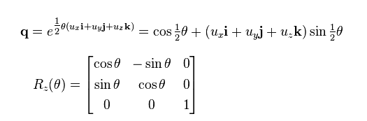
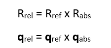

# <a name="sensor-orientation"></a>Orientation de capteur


**API importantes**

-   [**Windows.Devices.Sensors**](https://msdn.microsoft.com/library/windows/apps/BR206408)
-   [**Windows.Devices.Sensors.Custom**](https://msdn.microsoft.com/library/windows/apps/Dn895032)

Les données du capteur provenant des classes [**Accelerometer**](https://msdn.microsoft.com/library/windows/apps/BR225687), [**Gyrometer**](https://msdn.microsoft.com/library/windows/apps/BR225718), [**Compass**](https://msdn.microsoft.com/library/windows/apps/BR225705), [**Inclinometer**](https://msdn.microsoft.com/library/windows/apps/BR225766) et [**OrientationSensor**](https://msdn.microsoft.com/library/windows/apps/BR206371) sont définies par leurs axes de référence. Ces axes sont définis par l’image de référence de l’appareil, et pivotent avec celui-ci à mesure que l’utilisateur le fait tourner. Si votre application prend en charge la rotation automatique et se réoriente pour s’adapter à l’appareil à mesure que l’utilisateur le fait pivoter, vous devez ajuster vos données du capteur par rapport à la rotation avant de l’utiliser.

## <a name="display-orientation-vs-device-orientation"></a>Orientation de l’affichage et orientation de l’appareil

Pour comprendre les axes de référence pour les capteurs, vous devez distinguer l’orientation de l’affichage de l’orientation de l’appareil. L’orientation de l’affichage correspond au sens dans lequel le texte et les images sont affichés à l’écran, alors que l’orientation de l’appareil correspond au positionnement physique de l’appareil. Dans l’image suivante, l’orientation de l’appareil et de l’affichage se trouve en mode **Paysage** (notez que les axes de capteur indiqués s’appliquent uniquement aux appareils à priorité Paysage).


L’image suivante montre l’orientation de l’affichage et de l’appareil en mode **LandscapeFlipped**.


L’image suivante montre l’orientation d’affichage en mode Landscape tandis que l’orientation de l’appareil est en mode LandscapeFlipped.


Vous pouvez effectuer une requête sur les valeurs d’orientation dans la classe [**DisplayInformation**](https://msdn.microsoft.com/library/windows/apps/Dn264258) à l’aide de la méthode [**GetForCurrentView**](https://msdn.microsoft.com/library/windows/apps/windows.graphics.display.displayinformation.getforcurrentview.aspx) avec la propriété [**CurrentOrientation**](https://msdn.microsoft.com/library/windows/apps/windows.graphics.display.displayinformation.currentorientation.aspx). Vous pouvez ensuite créer une logique en comparant ces valeurs avec l’énumération [**DisplayOrientations**](https://msdn.microsoft.com/library/windows/apps/BR226142). Souvenez-vous que, pour chaque orientation que vous prenez en charge, vous devez prendre en charge une conversion des axes de référence dans cette orientation.

## <a name="landscape-first-vs-portrait-first-devices"></a>Appareils à priorité Paysage ou à priorité Portrait

Les fabricants produisent des appareils à priorité Paysage ou Portrait. Le cadre de référence varie selon que les appareils sont à priorité Paysage (tels que les ordinateurs de bureau et ordinateurs portables) ou à priorité Portrait (comme les téléphones et certaines tablettes). Le tableau suivant montre les axes de capteur pour les appareils à priorité Paysage et Portrait.

| Orientation | Priorité Paysage | Priorité Portrait |
|-------------|-----------------|----------------|
| **Paysage** |  |  |
| **Portrait** |  |  |
| **LandscapeFlipped** |  |  | 
| **PortraitFlipped** | |  |

## <a name="devices-broadcasting-display-and-headless-devices"></a>Appareils diffusant leur affichage et appareils sans affichage

Certains appareils sont capables de diffuser leur affichage vers un autre appareil. Par exemple, vous pouvez avoir une tablette capable de diffuser son affichage vers un projecteur en orientation paysage. Dans cette situation, il est important de garder à l’esprit que l’orientation de l’appareil est basée sur celle de l’appareil d’origine et non sur celle de l’appareil qui affiche. Par conséquent, un accéléromètre indiquerait les données pour la tablette.

En outre, certains appareils n’ont pas d’affichage. L’orientation par défaut de ces appareils est le mode Portrait.

## <a name="display-orientation-and-compass-heading"></a>Orientation de l’affichage et orientation de la boussole


L’orientation de la boussole dépend des axes de référence. Elle change donc avec l’orientation de l’appareil. Vous compensez en vous appuyant sur le tableau suivant (en supposant que l’utilisateur est orienté au nord).

| Orientation de l’affichage | Axe de référence pour l’orientation de la boussole | Orientation de la boussole de l’API avec une orientation au nord (à priorité Paysage) | Orientation de la boussole de l’API avec une orientation au nord (à priorité Portrait) |Compensation de l’orientation de la boussole (à priorité Paysage) | Compensation de l’orientation de la boussole (à priorité Portrait) |
|---------------------|------------------------------------|---------------------------------------------------------|--------------------------------------------------------|------------------------------------------------|-----------------------------------------------|
| Paysage           | -Z | 0   | 270 | Orientation               | (Orientation + 90) % 360  |
| Portrait            |  Y | 90  | 0   | (Orientation + 270) % 360 |  Orientation              |
| LandscapeFlipped    |  Z | 180 | 90  | (Orientation + 180) % 360 | (Orientation + 270) % 360 |
| PortraitFlipped     |  Y | 270 | 180 | (Orientation + 90) % 360  | (Orientation + 180) % 360 |

Modifiez le cap de la boussole tel qu’indiqué dans le tableau pour afficher correctement le cap. L’extrait de code suivant montre comment procéder.

```csharp
private void ReadingChanged(object sender, CompassReadingChangedEventArgs e)
{
    double heading = e.Reading.HeadingMagneticNorth;        
    double displayOffset;
    
    // Calculate the compass heading offset based on
    // the current display orientation.
    DisplayInformation displayInfo = DisplayInformation.GetForCurrentView();
    
    switch (displayInfo.CurrentOrientation) 
    { 
        case DisplayOrientations.Landscape: 
            displayOffset = 0; 
            break;
        case DisplayOrientations.Portrait: 
            displayOffset = 270; 
            break; 
        case DisplayOrientations.LandscapeFlipped: 
            displayOffset = 180; 
            break; 
        case DisplayOrientations.PortraitFlipped: 
            displayOffset = 90; 
            break; 
     } 
    

    double displayCompensatedHeading = (heading + displayOffset) % 360;
    
    // Update the UI...
}
```

## <a name="display-orientation-with-the-accelerometer-and-gyrometer"></a>Orientation de l’affichage avec l’accéléromètre et le gyromètre

Le tableau suivant convertit les données de l’accéléromètre et du gyromètre pour obtenir l’orientation de l’affichage.

| Axes de référence        |  X |  Y | Z |
|-----------------------|----|----|---|
| **Paysage**         |  X |  Y | Z |
| **Portrait**          |  Y | -X | Z |
| **LandscapeFlipped**  | -X | -Y | Z |
| **PortraitFlipped**   | -Y |  X | Z |

L’exemple de code suivant applique ces conversions au gyromètre.

```csharp
private void ReadingChanged(object sender, GyrometerReadingChangedEventArgs e)
{
    double x_Axis;
    double y_Axis;
    double z_Axis;

    GyrometerReading reading = e.Reading;  
    
    // Calculate the gyrometer axes based on
    // the current display orientation.
    DisplayInformation displayInfo = DisplayInformation.GetForCurrentView();
    switch (displayInfo.CurrentOrientation) 
    { 
        case DisplayOrientations.Landscape: 
            x_Axis = reading.AngularVelocityX;
            y_Axis = reading.AngularVelocityY;
            z_Axis = reading.AngularVelocityZ;
            break;
        case DisplayOrientations.Portrait: 
            x_Axis = reading.AngularVelocityY;
            y_Axis = -1 * reading.AngularVelocityX;
            z_Axis = reading.AngularVelocityZ;
            break; 
        case DisplayOrientations.LandscapeFlipped: 
            x_Axis = -1 * reading.AngularVelocityX;
            y_Axis = -1 * reading.AngularVelocityY;
            z_Axis = reading.AngularVelocityZ;
            break; 
        case DisplayOrientations.PortraitFlipped: 
            x_Axis = -1 * reading.AngularVelocityY;
            y_Axis = reading.AngularVelocityX;
            z_Axis = reading.AngularVelocityZ;
            break; 
     } 
    
    
    // Update the UI...
}
```

## <a name="display-orientation-and-device-orientation"></a>Orientation d’affichage et orientation d’appareil

Les données [**OrientationSensor**](https://msdn.microsoft.com/library/windows/apps/BR206371) doivent être modifiées d’une autre façon. Considérez ces différentes orientations comme des rotations dans le sens inverse des aiguilles d’une montre appliquées à l’axe des Z. Nous devons donc inverser la rotation pour revenir à l’orientation de l’utilisateur. Pour les données de quaternion, nous pouvons utiliser la formule d’Euler pour définir une rotation avec un quaternion de référence. Nous pouvons également utiliser une matrice de rotation de référence.



Pour obtenir l’orientation relative souhaitée, multipliez l’objet de référence par l’objet absolu. Notez que cette formule mathématique n’est pas commutative.



Dans l’expression précédente, l’objet absolu est retourné par les données du capteur.


| Orientation de l’affichage  | Rotation dans le sens inverse des aiguilles d’une montre autour de Z | Quaternion de référence (rotation inverse) | Matrice de rotation de référence (rotation inverse) | 
|----------------------|------------------------------------|-----------------------------------------|----------------------------------------------|
| **Paysage**        | 0                                  | 1 + 0i + 0j + 0k                        | \[1 0 0<br/> 0 1 0<br/> 0 0 1\]               |
| **Portrait**         | 90                                 | cos(-45⁰) + (i + j + k)*sin(-45⁰)       | \[0 1 0<br/>-1 0 0<br/>0 0 1]              |
| **LandscapeFlipped** | 180                                | 0 - i - j - k                           | \[1 0 0<br/> 0 1 0<br/> 0 0 1]               |
| **PortraitFlipped**  | 270                                | cos(-135⁰) + (i + j + k)*sin(-135⁰)     | \[0 -1 0<br/> 1  0 0<br/> 0  0 1]             |

