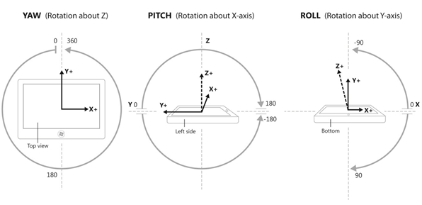

# Capteurs

Les capteurs permettent à votre application de connaître la relation entre un appareil et le monde physique qui l’entoure. Ils peuvent indiquer à votre application la direction, l’orientation et le mouvement de l’appareil. Ces capteurs peuvent rendre votre jeu, votre utilitaire ou votre application de réalité augmentée plus utile et interactive en fournissant une forme unique d’entrée, par exemple l’utilisation du mouvement de l’appareil pour organiser les personnages à l’écran ou pour simuler la présence dans un cockpit avec l’appareil pour volant.

En règle générale, vous devez décider dès le début si votre application dépendra exclusivement des capteurs ou si ceux-ci offriront simplement un mécanisme supplémentaire de contrôle. Par exemple, un jeu de course automobile utilisant l’appareil comme volant virtuel pourrait également être contrôlé par l’intermédiaire d’une interface graphique utilisateur à l’écran. De cette façon, l’application fonctionne quels que soient les capteurs disponibles sur le système. En revanche, un jeu de labyrinthe à bille avec inclinaison pourrait être codé pour ne fonctionner que sur les systèmes équipés des capteurs adéquats. Vous devez faire le choix stratégique quant à la dépendance totale envers des capteurs. Notez qu’un modèle de contrôle avec la souris ou les fonctionnalités tactiles procure davantage de contrôle, en contrepartie d’une immersion moindre.

| Rubrique                                                       | Description  |
|-------------------------------------------------------------|--------------|
| [Étalonner les capteurs](calibrate-sensors.md)                   | Dans un appareil basé sur le magnétomètre (la boussole, l’inclinomètre et le capteur d’orientation), il peut s’avérer nécessaire d’étalonner les capteurs en raison de facteurs environnementaux. L’énumération [<strong>MagnetometerAccuracy</strong>](https://msdn.microsoft.com/library/windows/apps/Dn297552) peut aider à déterminer la marche à suivre quand votre appareil doit être étalonné. |
| [Orientation de capteur](sensor-orientation.md)                 | Les données du capteur provenant des classes [<strong>OrientationSensor</strong>](https://msdn.microsoft.com/library/windows/apps/BR206371) sont définies par leurs axes de référence. Ces axes sont définis par l’orientation paysage de l’appareil et pivotent avec celui-ci à mesure que l’utilisateur le fait tourner. |
| [Utiliser l’accéléromètre](use-the-accelerometer.md)           | Découvrez comment utiliser l’accéléromètre pour répondre aux mouvements de l’utilisateur. |
| [Utiliser la boussole](use-the-compass.md)                       | Découvrez comment utiliser la boussole pour déterminer l’orientation actuelle. |
| [Utiliser le gyromètre](use-the-gyrometer.md)                   | Découvrez comment utiliser le gyromètre pour détecter les changements de mouvements de l’utilisateur. | 
| [Utiliser l’inclinomètre](use-the-inclinometer.md)             | Découvrez comment utiliser l’inclinomètre pour déterminer le tangage, le roulis et le lacet. |
| [Utiliser le capteur de luminosité](use-the-light-sensor.md)             | Découvrez comment utiliser le capteur de luminosité ambiante pour détecter les changements de luminosité. |
| [Utiliser le capteur d’orientation](use-the-orientation-sensor.md) | Découvrez comment utiliser les capteurs d’orientation pour déterminer l’orientation de l’appareil.|

## Traitement par lot du capteur

Certains capteurs prennent en charge le concept de traitement par lot. Cela varie selon le capteur individuel disponible. Lorsqu’un capteur implémente le traitement par lot, il recueille plusieurs points de données sur un intervalle de temps spécifié et transfère toutes ces données en même temps. Cela diffère du comportement normal, où un capteur communique ses résultats dès qu’il effectue une lecture. Le diagramme suivant montre comment les données sont collectées et ensuite remises, tout d’abord avec la remise normale, puis avec la remise par lot.

Le principal avantage du traitement par lot du capteur est de prolonger l’autonomie de la batterie. L’envoi différé des données permet de réduire la consommation d’énergie du processeur et d’éliminer la nécessité d’un traitement immédiat des données. Les composants du système peuvent rester en veille jusqu’à ce qu’ils soient requis, ce qui génère d’importantes économies d’énergie.

Vous pouvez modifier la fréquence à laquelle le capteur envoie les lots en ajustant la latence. Par exemple, le capteur [**Accelerometer**](https://msdn.microsoft.com/library/windows/apps/BR225687) présente la propriété [**ReportLatency**](https://msdn.microsoft.com/library/windows/apps/windows.devices.sensors.accelerometer.reportlatency). Lorsque cette propriété est définie pour une application, le capteur envoie les données après le laps de temps spécifié. Vous pouvez contrôler la quantité de données accumulée sur une période de latence donnée en définissant la propriété [**ReportInterval**](https://msdn.microsoft.com/library/windows/apps/windows.devices.sensors.accelerometer.reportinterval).

La définition de la latence s’accompagne néanmoins de quelques inconvénients. Le premier est que chaque capteur présente une valeur [**MaxBatchSize**](https://msdn.microsoft.com/library/windows/apps/windows.devices.sensors.accelerometer.maxbatchsize.aspx) qui varie selon ses caractéristiques. Cette valeur correspond au nombre d’événements que le capteur peut mettre en cache avant d’être obligé de les envoyer. Si vous multipliez **MaxBatchSize** par [**ReportInterval**](https://msdn.microsoft.com/library/windows/apps/windows.devices.sensors.accelerometer.reportinterval), vous obtenez la valeur [**ReportLatency**](https://msdn.microsoft.com/library/windows/apps/windows.devices.sensors.accelerometer.reportlatency) maximale. Si vous spécifiez une valeur supérieure à celle-ci, la latence maximale est utilisée afin d’empêcher la perte de données. En outre, différentes applications peuvent chacune définir une latence spécifique. Pour répondre aux besoins de toutes les applications, la période de latence la plus courte est utilisée. Pour ces raisons, la latence que vous définissez dans votre application peut ne pas correspondre à la latence observée.

Si un capteur utilise la création de rapports par lot, l’appel de [**GetCurrentReading**](https://msdn.microsoft.com/library/windows/apps/windows.devices.sensors.accelerometer.getcurrentreading) permet d’effacer le lot actuel de données et de démarrer une nouvelle période de latence.

## Accéléromètre

Le capteur [**Accelerometer**](https://msdn.microsoft.com/library/windows/apps/BR225687) mesure les valeurs de force G le long des axes X, Y et Z de l’appareil. Il convient parfaitement aux applications simples basées sur des mouvements. Notez que les «valeurs de force G» incluent l’accélération due à la gravité. Si l’appareil a **FaceUp** comme [**SimpleOrientation**](https://msdn.microsoft.com/library/windows/apps/BR206399) sur une table, l’accéléromètre indique -1 G sur l’axe Z. Ainsi, les accéléromètres ne mesurent pas nécessairement simplement l’accélération par rapport aux coordonnées, le taux de changement de vélocité. Durant l’utilisation d’un accéléromètre, assurez-vous d’effectuer la distinction entre le vecteur gravitationnel de la gravité et le vecteur d’accélération linéaire du mouvement. Notez que le vecteur gravitationnel doit avoir une valeur normalisée de 1 pour un appareil immobile.

Les schémas suivants illustrent ce qui suit :

-   V1 = Vecteur 1 = Force due à la gravité
-   V2 = Vecteur 2 = Axe -Z du châssis de l’appareil (pointe vers la direction opposée à l’arrière de l’écran)
-   Θi = Angle d’inclinaison = angle entre l’axe –Z du châssis de l’appareil et le vecteur de gravité

Parmi les applications qui peuvent utiliser l’accéléromètre, citons les jeux dans lesquels une bille à l’écran glisse dans la direction dans laquelle vous inclinez l’appareil (vecteur gravitationnel). Ce type de fonctionnalité reflète étroitement celui de l’[**Inclinometer**](https://msdn.microsoft.com/library/windows/apps/BR225766) et pourrait être obtenu avec ce capteur, à l’aide d’une combinaison de tangage et de roulis. Le recours au vecteur de gravité de l’accéléromètre simplifie quelque peu ce processus en fournissant un vecteur manipulé facilement de manière mathématique pour l’inclinaison de l’appareil. Autre exemple : une application qui émet un bruit de fouet quand l’utilisateur déplace l’appareil d’un coup sec (vecteur d’accélération linéaire).

Pour un exemple d’implémentation, consultez l'[exemple d'accéléromètre](https://github.com/Microsoft/Windows-universal-samples/tree/master/Samples/Accelerometer).

## Capteur d’activité

Le capteur [**Activity**](https://msdn.microsoft.com/library/windows/apps/Dn785096) détermine l’état actuel de l’appareil connecté au capteur. Ce capteur est fréquemment utilisé dans des applications de santé et forme pour suivre l’activité de course ou de marche d’un utilisateur porteur d’un appareil. Pour obtenir la liste des activités que cette API de capteur peut détecter, consultez [**ActivityType**](https://msdn.microsoft.com/library/windows/apps/Dn785128).

Pour un exemple d'implémentation, consultez l'[exemple de capteur d'activité](https://github.com/Microsoft/Windows-universal-samples/tree/master/Samples/ActivitySensor).

## Altimètre

Le capteur [**Altimeter**](https://msdn.microsoft.com/library/windows/apps/Dn858893) renvoie une valeur qui indique l’altitude du capteur. Cela vous permet de suivre les changements d’altitude en termes de mètres par rapport au niveau de la mer. Un exemple d’application pouvant utiliser cela est une application qui mesure les changements d’altitude durant une course pour calculer les calories brûlées. Dans ce cas, les données de ce capteur pourraient être combinées avec celles du capteur [**Activity**](https://msdn.microsoft.com/library/windows/apps/Dn785096) pour fournir des informations de suivi plus précises.

Pour un exemple d'implémentation, consultez l'[exemple d'altimètre](https://github.com/Microsoft/Windows-universal-samples/tree/master/Samples/Altimeter).

## Baromètre

Le capteur [**Barometer**](https://msdn.microsoft.com/library/windows/apps/Dn872405) permet à une application d’obtenir les lectures barométriques. Une application météo pourrait utiliser ces informations pour indiquer la pression atmosphérique actuelle. Cela permettrait de fournir des informations plus détaillées et de prévoir d’éventuels changements des conditions météo.

Pour un exemple d'implémentation, consultez l'[exemple de baromètre](https://github.com/Microsoft/Windows-universal-samples/tree/master/Samples/Barometer).

## Boussole

Le capteur [**Compass**](https://msdn.microsoft.com/library/windows/apps/BR225705) renvoie un cap 2D par rapport au Nord magnétique et au plan horizontal de la Terre. Le capteur de boussole ne doit pas être utilisé pour déterminer l’orientation spécifique de l’appareil ou pour représenter quoi que ce soit dans un espace en trois dimensions. Certaines caractéristiques géographiques pouvant provoquer une inclinaison naturelle du cap, certains systèmes prennent en charge à la fois [**HeadingMagneticNorth**](https://msdn.microsoft.com/library/windows/apps/windows.devices.sensors.compassreading.headingmagneticnorth.aspx) et [**HeadingTrueNorth**](https://msdn.microsoft.com/library/windows/apps/windows.devices.sensors.compassreading.headingtruenorth.aspx). Réfléchissez à celle qui convient le mieux à votre application, mais souvenez-vous que les systèmes n’indiquent pas tous la valeur du Nord magnétique. Le gyromètre et le magnétomètre (un appareil mesurant la magnitude de la force magnétique) combinent leurs données pour générer le cap de la boussole, ce qui a comme effet net de stabiliser les données (la force du champ magnétique est très instable en raison des composants électriques du système).

Les applications qui doivent afficher une rose des vents ou parcourir une carte utilisent généralement le capteur de boussole.

Pour un exemple d'implémentation, consultez l'[exemple de boussole](https://github.com/Microsoft/Windows-universal-samples/tree/master/Samples/Compass).

## Gyromètre

Le capteur [**Gyrometer**](https://msdn.microsoft.com/library/windows/apps/BR225718) mesure les vélocités angulaires le long des axes X, Y et Z. Ces valeurs sont très utiles dans les applications simples basées sur des mouvements, qui ne se soucient pas de l’orientation de l’appareil mais de sa rotation à différentes vitesses. Les gyromètres peuvent être perturbés en cas de bruit dans les données ou de décalage constant le long d’un ou plusieurs axes. Interrogez l’accéléromètre pour vérifier si l’appareil se déplace, afin de déterminer si le gyromètre est perturbé par un décalage, puis compensez le cas échéant dans votre application.

Comme exemple d’application pouvant utiliser le gyromètre, citons un jeu qui fait tourner une roulette de casino en fonction d’un bref mouvement de l’appareil.

Pour un exemple d'implémentation, consultez l'[exemple de gyromètre](https://github.com/Microsoft/Windows-universal-samples/tree/master/Samples/Gyrometer).

## Inclinomètre

Le capteur [**Inclinometer**](https://msdn.microsoft.com/library/windows/apps/BR225766) spécifie les valeurs de lacet, tangage et roulis d’un appareil et convient parfaitement aux applications pour lesquelles l’emplacement de l’appareil dans l’espace est important. Les valeurs de tangage et de roulis sont dérivées en prenant le vecteur de gravité de l’accéléromètre et en intégrant les données du gyromètre. Le lacet est établi à partir des données du magnétomètre et du gyromètre (de manière semblable au cap de la boussole). Les inclinomètres offrent des données d’orientation avancées dans un format facilement compréhensible et utilisable. Vous pouvez les utiliser quand vous souhaitez connaître l’orientation de l’appareil mais que vous n’avez pas besoin de manipuler les données des capteurs.

Les applications qui changent leur vue pour s’adapter à l’orientation de l’appareil peuvent utiliser le capteur inclinomètre. Une application qui affiche un avion dont la position correspond au tangage, au roulis et au lacet de l’appareil utiliserait également les mesures de l’inclinomètre.

Pour un exemple d’implémentation, consultez l’exemple d’inclinomètre [https://github.com/Microsoft/Windows-universal-samples/tree/master/Samples/Inclinometer](https://github.com/Microsoft/Windows-universal-samples/tree/master/Samples/Inclinometer).

## Capteur de lumière

Le capteur [**Light**](https://msdn.microsoft.com/library/windows/apps/BR225790) est capable de déterminer la lumière ambiante. Cela permet à une application de déterminer les changements de luminosité à proximité de l’appareil. Par exemple, un utilisateur disposant d’un appareil de type tablette peut passer d’un espace couvert à un espace découvert pendant une journée ensoleillée. Une application intelligente pourrait utiliser cette valeur pour modifier le contraste entre l’arrière-plan et la police affichée. Le contenu resterait ainsi lisible dans les conditions plus lumineuses de l’extérieur.

Pour un exemple d'implémentation, consultez l'[exemple de capteur de lumière](https://github.com/Microsoft/Windows-universal-samples/tree/master/Samples/LightSensor).

## Capteur d’orientation

L’orientation de l’appareil est exprimée par l’intermédiaire du quaternion et d’une matrice de rotation. L’[**OrientationSensor**](https://msdn.microsoft.com/library/windows/apps/BR206371) offre un degré élevé de précision dans la détermination de la position de l’appareil dans l’espace par rapport au cap absolu. Les données **OrientationSensor** sont dérivées de l’accéléromètre, du gyromètre et du magnétomètre. Comme tels, les capteurs inclinomètre et boussole peuvent être dérivés des valeurs de quaternion. Les quaternions et les matrices de rotation se prêtent bien à la manipulation mathématique avancée et sont souvent utilisés dans la programmation graphique. Les applications ayant recours à une manipulation complexe doivent utiliser de préférence le capteur d’orientation, car de nombreuses transformations sont basées sur les quaternions et les matrices de rotation.

Le capteur d’orientation est souvent utilisé dans les applications de réalité augmentée avancées qui peignent une superposition sur votre environnement en fonction de la direction dans laquelle pointe l’arrière de l’appareil.

Pour un exemple d'implémentation, consultez l'[exemple de capteur d'orientation](https://github.com/Microsoft/Windows-universal-samples/tree/master/Samples/OrientationSensor).

## Podomètre

Le capteur [**Pedometer**](https://msdn.microsoft.com/library/windows/apps/Dn878203) suit le nombre de pas effectués par l’utilisateur porteur de l’appareil connecté. Le capteur est configuré pour suivre le nombre de pas pendant une période donnée. Plusieurs applications de forme et santé suivent ainsi le nombre de pas effectués pour aider l’utilisateur à définir et à atteindre divers objectifs. Ces informations peuvent ensuite être collectées et stockées pour afficher la progression au fil du temps.

Pour un exemple d'implémentation, consultez l'[exemple de podomètre](https://github.com/Microsoft/Windows-universal-samples/tree/master/Samples/Pedometer).

## Capteur de proximité

Le capteur [**Proximity**](https://msdn.microsoft.com/library/windows/apps/Dn872427) peut indiquer s’il détecte ou non certains objets. En plus de déterminer si un objet est ou non à portée de l’appareil, le capteur de proximité peut également déterminer la distance de l’objet détecté. Un exemple d’utilisation pourrait être une application qui doit sortir du mode veille quand un utilisateur entre dans une plage spécifiée. L’appareil pourrait rester en état de veille avec faible consommation d’énergie jusqu’à ce que le capteur de proximité détecte un objet, avec pour effet d’activer l’appareil.

Pour un exemple d'implémentation, consultez l'[exemple de capteur de proximité](https://github.com/Microsoft/Windows-universal-samples/tree/master/Samples/ProximitySensor).

## Orientation simple

Le [**SimpleOrientationSensor**](https://msdn.microsoft.com/library/windows/apps/windows.devices.sensors.simpleorientationsensor.aspx) détecte l’orientation de quadrant actuelle de l’appareil spécifié, ou s’il est face vers le haut ou face vers le bas. Il possède six états [**SimpleOrientation**](https://msdn.microsoft.com/library/windows/apps/BR206399) possibles (**NotRotated**, **Rotated90**, **Rotated180**, **Rotated270**, **FaceUp**, **FaceDown**).

Une application de lecture qui change son affichage selon que l’appareil est tenu parallèlement ou perpendiculairement au sol utiliserait les valeurs de SimpleOrientationSensor pour déterminer comment l’appareil est tenu.

Pour un exemple d'implémentation, consultez l'[exemple de capteur d'orientation simple](https://github.com/Microsoft/Windows-universal-samples/tree/master/Samples/SimpleOrientationSensor).
