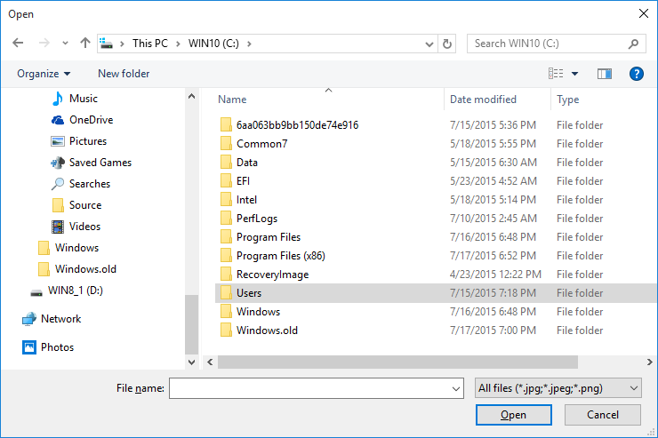

# <a name="open-files-and-folders-with-a-picker"></a>Ouvrir des fichiers et dossiers à l’aide d’un sélecteur

**API importantes**

-   [**FileOpenPicker**](https://msdn.microsoft.com/library/windows/apps/br207847)
-   [**FolderPicker**](https://msdn.microsoft.com/library/windows/apps/br207881)
-   [**StorageFile**](https://msdn.microsoft.com/library/windows/apps/br227171)

Accédez aux fichiers et dossiers en permettant à l’utilisateur d’interagir avec ceux-ci à l’aide d’un sélecteur. Vous pouvez utiliser les classes [**FileOpenPicker**](https://msdn.microsoft.com/library/windows/apps/br207847) et [**FileSavePicker**](https://msdn.microsoft.com/library/windows/apps/br207871) pour accéder à des fichiers et la classe [**FolderPicker**](https://msdn.microsoft.com/library/windows/apps/br207881) pour accéder à un dossier.

> [!NOTE]
> Pour obtenir un exemple complet, consultez l’[exemple de sélecteur de fichiers](http://go.microsoft.com/fwlink/p/?linkid=619994).

## <a name="prerequisites"></a>Prérequis


-   **Comprendre la programmation asynchrone pour les applications pour la plateforme Windows universelle (UWP)**

    Pour apprendre à écrire des applications asynchrones en C# ou Visual Basic, voir [Appeler des API asynchrones en C# ou Visual Basic](https://msdn.microsoft.com/library/windows/apps/mt187337). Pour apprendre à écrire des applications asynchrones en C++, voir [Programmation asynchrone en C++](https://msdn.microsoft.com/library/windows/apps/mt187334).

-   **Autorisations d’accès à l’emplacement**

    Voir [Autorisations d’accès aux fichiers](file-access-permissions.md).

## <a name="file-picker-ui"></a>Interface utilisateur de sélecteur de fichiers


Un sélecteur de fichiers affiche des informations pour guider les utilisateurs et leur offrir une expérience cohérente quand ils ouvrent ou enregistrent des fichiers.

Ces informations sont les suivantes:

-   emplacement actuel ;
-   éléments que l'utilisateur a sélectionnés ;
-   arborescence des emplacements auxquels l’utilisateur peut accéder. Ces emplacements incluent des emplacements du système de fichiers (tels que les dossiers Musique ou Téléchargements), ainsi que les applications qui implémentent le contrat du sélecteur de fichiers (telles que Caméra, Photos et Microsoft OneDrive).

Une application de messagerie peut afficher un sélecteur de fichiers pour permettre à l’utilisateur de sélectionner des pièces jointes.



## <a name="how-pickers-work"></a>Fonctionnement des sélecteurs de fichiers


Grâce à un sélecteur de fichiers, votre application peut consulter, parcourir et enregistrer des fichiers et dossiers sur le système de l’utilisateur. Votre application reçoit ces sélections en tant qu’objets [**StorageFile**](https://msdn.microsoft.com/library/windows/apps/br227171) et [**StorageFolder**](https://msdn.microsoft.com/library/windows/apps/br227230) que vous pouvez ensuite utiliser.

Le sélecteur de fichiers utilise une interface unique et unifiée permettant à l’utilisateur de sélectionner des fichiers et dossiers à partir du système de fichiers ou d’autres applications. Les fichiers sélectionnés à partir d’autres applications sont comme ceux du système de fichiers: ils sont renvoyés en tant qu’objets [**StorageFile**](https://msdn.microsoft.com/library/windows/apps/br227171). En règle générale, votre application peut travailler sur ces fichiers de la même manière que sur les autres objets. D’autres applications rendent les fichiers disponibles en participant à des contrats de sélecteurs de fichiers. Pour que votre application indique des fichiers, un emplacement d’enregistrement ou des mises à jour de fichiers aux autres applications, voir [Intégration aux contrats du sélecteur de fichiers](https://msdn.microsoft.com/library/windows/apps/hh465192).

Par exemple, vous pouvez appeler le sélecteur de fichiers dans votre application de sorte que votre utilisateur puisse ouvrir un fichier. Cela fait de votre application l’application d’appel. Le sélecteur de fichiers interagit avec le système ou d’autres applications pour permettre à l’utilisateur de naviguer et de sélectionner le fichier. Lorsque l’utilisateur choisit un fichier, le sélecteur de fichiers retourne celui-ci à votre application. Voici le processus quand l’utilisateur choisit un fichier à partir d’une application de distribution telle que OneDrive.


## <a name="pick-a-single-file-complete-code-listing"></a>Sélectionner un seul fichier: code complet


```cs
var picker = new Windows.Storage.Pickers.FileOpenPicker();
picker.ViewMode = Windows.Storage.Pickers.PickerViewMode.Thumbnail;
picker.SuggestedStartLocation = Windows.Storage.Pickers.PickerLocationId.PicturesLibrary;
picker.FileTypeFilter.Add(".jpg");
picker.FileTypeFilter.Add(".jpeg");
picker.FileTypeFilter.Add(".png");

Windows.Storage.StorageFile file = await picker.PickSingleFileAsync();
if (file != null)
{
    // Application now has read/write access to the picked file
    this.textBlock.Text = "Picked photo: " + file.Name;
}
else
{
    this.textBlock.Text = "Operation cancelled.";
}
```

## <a name="pick-a-single-file-step-by-step"></a>Sélectionner un seul fichier: procédure pas à pas


Utiliser un sélecteur de fichiers consiste à créer et à personnaliser un objet sélecteur de fichiers, puis à afficher le sélecteur à l'utilisateur afin de lui permettre de sélectionner un ou plusieurs éléments.

1.  **Créer et personnaliser un sélecteur FileOpenPicker**

    ```cs
    var picker = new Windows.Storage.Pickers.FileOpenPicker();
    picker.ViewMode = Windows.Storage.Pickers.PickerViewMode.Thumbnail;
    picker.SuggestedStartLocation = Windows.Storage.Pickers.PickerLocationId.PicturesLibrary;
    picker.FileTypeFilter.Add(".jpg");
    picker.FileTypeFilter.Add(".jpeg");
    picker.FileTypeFilter.Add(".png");
    ```
    Définissez des propriétés sur l’objet sélecteur de fichiers qui sont pertinentes pour vos utilisateurs et votre application.

    Cet exemple crée un riche éventail visuel d’images dans un emplacement approprié où l’utilisateur peut opérer une sélection en définissant trois propriétés: [**ViewMode**](https://msdn.microsoft.com/library/windows/apps/br207855), [**SuggestedStartLocation**](https://msdn.microsoft.com/library/windows/apps/br207854) et [**FileTypeFilter**](https://msdn.microsoft.com/library/windows/apps/br207850).

    -   La définition de [**ViewMode**](https://msdn.microsoft.com/library/windows/apps/br207855) sur la valeur enum **Thumbnail** [**PickerViewMode**](https://msdn.microsoft.com/library/windows/apps/xaml/windows.storage.pickers.pickerviewmode.aspx#thumbnail) crée un riche éventail visuel en utilisant des images miniatures pour représenter les fichiers dans le sélecteur de fichiers. Procédez de la sorte pour sélectionner des fichiers visuels tels que des images ou des vidéos. Autrement, utilisez [**PickerViewMode.List**](https://msdn.microsoft.com/library/windows/apps/xaml/windows.storage.pickers.pickerviewmode.aspx#list). Une application de messagerie hypothétique offrant des fonctionnalités permettant de **joindre une image ou une vidéo** et de **joindre un document** définirait la propriété **ViewMode** appropriée pour la fonctionnalité avant d’afficher le sélecteur de fichiers.

    -   Définir [**SuggestedStartLocation**](https://msdn.microsoft.com/library/windows/apps/br207854) sur Images avec [**PickerLocationId.PicturesLibrary**](https://msdn.microsoft.com/library/windows/apps/br207890) permet à l’utilisateur de démarrer à un emplacement où il est susceptible de trouver des images. Définissez **SuggestedStartLocation** sur un emplacement approprié pour le type de fichier sélectionné, par exemple, Musique, Images, Vidéos ou Documents. À partir de l’emplacement de départ, l’utilisateur peut accéder à d’autres emplacements.

    -   L’utilisation du [**FileTypeFilter**](https://msdn.microsoft.com/library/windows/apps/br207850) pour spécifier les types de fichiers permet à l’utilisateur de se concentrer sur la sélection de fichiers appropriés. Si vous souhaitez remplacer d’anciens types de fichiers dans le **FileTypeFilter** par de nouvelles entrées, vous pouvez utiliser la méthode [**ReplaceAll**](https://msdn.microsoft.com/library/windows/apps/br207844) à la place de la méthode [**Add**](https://msdn.microsoft.com/library/windows/apps/br207834).

2.  **Montrer le FileOpenPicker**

    - **Pour sélectionner un fichier**

    ```cs
    Windows.Storage.StorageFile file = await picker.PickSingleFileAsync();
    if (file != null)
    {
        // Application now has read/write access to the picked file
        this.textBlock.Text = "Picked photo: " + file.Name;
    }
    else
    {
        this.textBlock.Text = "Operation cancelled.";
    }
    ```

    - **Pour sélectionner plusieurs fichiers**  

    ```cs
    var files = await picker.PickMultipleFilesAsync();
    if (files.Count > 0)
    {
        StringBuilder output = new StringBuilder("Picked files:\n");

        // Application now has read/write access to the picked file(s)
        foreach (Windows.Storage.StorageFile file in files)
        {
            output.Append(file.Name + "\n");
        }
        this.textBlock.Text = output.ToString();
    }
    else
    {
        this.textBlock.Text = "Operation cancelled.";
    }
    ```

## <a name="pick-a-folder-complete-code-listing"></a>Sélectionner un dossier: code complet


```cs
var folderPicker = new Windows.Storage.Pickers.FolderPicker();
folderPicker.SuggestedStartLocation = Windows.Storage.Pickers.PickerLocationId.Desktop;
folderPicker.FileTypeFilter.Add("*");

Windows.Storage.StorageFolder folder = await folderPicker.PickSingleFolderAsync();
if (folder != null)
{
    // Application now has read/write access to all contents in the picked folder
    // (including other sub-folder contents)
    Windows.Storage.AccessCache.StorageApplicationPermissions.
    FutureAccessList.AddOrReplace("PickedFolderToken", folder);
    this.textBlock.Text = "Picked folder: " + folder.Name;
}
else
{
    this.textBlock.Text = "Operation cancelled.";
}
```

> [!TIP]
> Chaque fois que votre application accède à un fichier ou à un dossier par le biais d’un sélecteur, ajoutez-le aux listes [**FutureAccessList**](https://msdn.microsoft.com/library/windows/apps/br207457) ou [**MostRecentlyUsedList**](https://msdn.microsoft.com/library/windows/apps/br207458) de votre application pour en garder la trace. Pour plus d’informations sur l’utilisation de ces listes, consultez [Comment suivre les fichiers et les dossiers récemment utilisés](how-to-track-recently-used-files-and-folders.md).