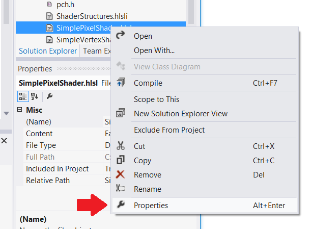

# <a name="convert-the-rendering-framework"></a>Convertir l’infrastructure de rendu


**Résumé**

-   [Partie 1 : Initialiser Direct3D 11](simple-port-from-direct3d-9-to-11-1-part-1--initializing-direct3d.md)
-   Partie 2 : Convertir l’infrastructure de rendu
-   [Partie 3 : La boucle du jeu de port](simple-port-from-direct3d-9-to-11-1-part-3--viewport-and-game-loop.md)


Montre comment convertir une infrastructure de rendu simple de Direct3D 9 à Direct3D 11, notamment comment porter des tampons de géométrie, comment compiler et charger des programmes de nuanceurs HLSL et comment implémenter la chaîne de rendu dans Direct3D 11. Partie 2 de la procédure pas à pas [Porter une application Direct3D 9 simple vers DirectX 11 et la plateforme Windows universelle (UWP)](walkthrough--simple-port-from-direct3d-9-to-11-1.md).

## <a name="convert-effects-to-hlsl-shaders"></a>Convertir des effets en nuanceurs HLSL


L’exemple suivant est une technique D3DX simple, écrite pour l’API Effets héritée, pour la transformation de vertex matériel et les données de couleurs directes.

Code de nuanceur Direct3D 9

```cpp
// Global variables
matrix g_mWorld;        // world matrix for object
matrix g_View;          // view matrix
matrix g_Projection;    // projection matrix

// Shader pipeline structures
struct VS_OUTPUT
{
    float4 Position   : POSITION;   // vertex position
    float4 Color      : COLOR0;     // vertex diffuse color
};

struct PS_OUTPUT
{
    float4 RGBColor : COLOR0;  // Pixel color    
};

// Vertex shader
VS_OUTPUT RenderSceneVS(float3 vPos : POSITION, 
                        float3 vColor : COLOR0)
{
    VS_OUTPUT Output;
    
    float4 pos = float4(vPos, 1.0f);

    // Transform the position from object space to homogeneous projection space
    pos = mul(pos, g_mWorld);
    pos = mul(pos, g_View);
    pos = mul(pos, g_Projection);

    Output.Position = pos;
    
    // Just pass through the color data
    Output.Color = float4(vColor, 1.0f);
    
    return Output;
}

// Pixel shader
PS_OUTPUT RenderScenePS(VS_OUTPUT In) 
{ 
    PS_OUTPUT Output;

    Output.RGBColor = In.Color;

    return Output;
}

// Technique
technique RenderSceneSimple
{
    pass P0
    {          
        VertexShader = compile vs_2_0 RenderSceneVS();
        PixelShader  = compile ps_2_0 RenderScenePS(); 
    }
}
```

Dans Direct3D 11, nous pouvons toujours utiliser nos nuanceurs HLSL. Nous mettons chaque nuanceur dans son propre fichier HLSL afin que Visual Studio les compile dans des fichiers distincts et que nous les chargions plus tard en tant que ressources Direct3D distinctes. Nous définissons la cible au niveau [Shader Model 4 niveau 9\_1 (/ 4\_0\_niveau\_9\_1)](https://msdn.microsoft.com/library/windows/desktop/ff476876) car ces nuanceurs sont écrits pour DirectX 9.1 GPU.

Quand nous avons défini le schéma d’entrée, nous avons vérifié qu’il représentait la même structure de données que celle que nous utilisons pour stocker les données par vertex dans la mémoire système et la mémoire GPU. De même, la sortie d’un nuanceur de vertex doit correspondre à la structure utilisée en tant qu’entrée du nuanceur de pixels. Les règles ne sont pas les mêmes que pour passer des données d’une fonction à une autre en C++ ; vous pouvez omettre les variables inutilisées à la fin de la structure. Mais il n’est pas possible de réorganiser l’ordre et vous ne pouvez pas ignorer le contenu du milieu de la structure de données.

> **Remarque**    les règles dans Direct3D 9 pour les nuanceurs de sommets de liaison pour les nuanceurs de pixels ont été plus souples que les règles dans Direct3D 11. La disposition Direct3D 9 était flexible, mais inefficace.

 

Il est possible que vos fichiers HLSL utilise la syntaxe antérieure sémantiques de nuanceur - par exemple, couleur au lieu de SV\_cible. Le cas échéant, vous devez activer le mode de compatibilité HLSL (option de compilateur /Gec) ou mettre à jour la [sémantique](https://msdn.microsoft.com/library/windows/desktop/bb509647) de nuanceur vers la syntaxe actuelle. Le nuanceur de vertex de cet exemple a été mis à jour avec la syntaxe actuelle.

Voici notre nuanceur de vertex de transformation matérielle, cette fois défini dans son propre fichier.

> **Remarque**  nuanceurs de sommets sont nécessaires pour générer le SV\_valeur système POSITION sémantique. Cette sémantique traduit les données de position du vertex en coordonnées, où x et y sont des valeurs comprises entre -1 et 1, z est divisé par la valeur w de la coordonnée homogène initiale (z/w), et w correspond à 1 divisé par la valeur w initiale (1/w).

 

Nuanceur de vertex HLSL (niveau de fonctionnalité 9.1)

```cpp
cbuffer ModelViewProjectionConstantBuffer : register(b0)
{
    matrix mWorld;       // world matrix for object
    matrix View;        // view matrix
    matrix Projection;  // projection matrix
};

struct VS_INPUT
{
    float3 vPos   : POSITION;
    float3 vColor : COLOR0;
};

struct VS_OUTPUT
{
    float4 Position : SV_POSITION; // Vertex shaders must output SV_POSITION
    float4 Color    : COLOR0;
};

VS_OUTPUT main(VS_INPUT input) // main is the default function name
{
    VS_OUTPUT Output;

    float4 pos = float4(input.vPos, 1.0f);

    // Transform the position from object space to homogeneous projection space
    pos = mul(pos, mWorld);
    pos = mul(pos, View);
    pos = mul(pos, Projection);
    Output.Position = pos;

    // Just pass through the color data
    Output.Color = float4(input.vColor, 1.0f);

    return Output;
}
```

C’est tout ce dont nous avons besoin pour notre nuanceur de pixels direct. Même si nous l’appelons direct, il obtient en fait des données de couleurs interpolées de perspective correcte pour chaque pixel. Notez que la VP\_sémantique de valeur du système cible est appliqué à la sortie de valeur de couleur à notre nuanceur de pixels comme requis par l’API.

> **Remarque**  au niveau du nuanceur 9\_x pixel nuanceurs ne peut pas lire à partir de cette variation\_valeur système POSITION sémantique. Les nuanceurs de pixels 4.0 (et versions supérieures) de modèle peuvent utiliser SV\_POSITION à laquelle récupérer l’emplacement des pixels sur l’écran, où x est comprise entre 0 et la largeur de cible de rendu et les y est comprise entre 0 et la hauteur de cible de rendu (chaque décalage par 0,5).

 

La plupart des nuanceurs de pixels sont beaucoup plus complexes qu’un nuanceur de pixels direct ; notez que les niveaux de fonctionnalité Direct3D plus élevés permettent d’effectuer beaucoup plus de calculs par programme de nuanceur.

Nuanceur de pixels HLSL (niveau de fonctionnalité 9.1)

```cpp
struct PS_INPUT
{
    float4 Position : SV_POSITION;  // interpolated vertex position (system value)
    float4 Color    : COLOR0;       // interpolated diffuse color
};

struct PS_OUTPUT
{
    float4 RGBColor : SV_TARGET;  // pixel color (your PS computes this system value)
};

PS_OUTPUT main(PS_INPUT In)
{
    PS_OUTPUT Output;

    Output.RGBColor = In.Color;

    return Output;
}
```

## <a name="compile-and-load-shaders"></a>Compiler et charger des nuanceurs


Les jeux Direct3D 9 ont souvent utilisé la bibliothèque d’effets pour implémenter des pipelines programmables. Il était possible de compiler les effets au moment de l’exécution à l’aide de la méthode [**D3DXCreateEffectFromFile function**](https://msdn.microsoft.com/library/windows/desktop/bb172768).

Chargement d’un effet dans Direct3D 9

```cpp
// Turn off preshader optimization to keep calculations on the GPU
DWORD dwShaderFlags = D3DXSHADER_NO_PRESHADER;

// Only enable debug info when compiling for a debug target
#if defined (DEBUG) || defined (_DEBUG)
dwShaderFlags |= D3DXSHADER_DEBUG;
#endif

D3DXCreateEffectFromFile(
    m_pd3dDevice,
    L"CubeShaders.fx",
    NULL,
    NULL,
    dwShaderFlags,
    NULL,
    &m_pEffect,
    NULL
    );
```

Direct3D 11 fonctionne avec les programmes de nuanceurs sous forme de ressources binaires. Les nuanceurs sont compilés quand le projet est créé, puis traités en tant que ressources. Par conséquent, notre exemple va charger le bytecode de nuanceur dans la mémoire système, utiliser l’interface de périphérique Direct3D pour créer une ressource Direct3D pour chaque nuanceur, puis pointer vers les ressources de nuanceurs Direct3D quand nous allons configurer chaque image.

Chargement d’une ressource de nuanceur dans Direct3D 11

```cpp
// BasicReaderWriter is a tested file loader used in SDK samples.
BasicReaderWriter^ readerWriter = ref new BasicReaderWriter();


// Load vertex shader:
Platform::Array<byte>^ vertexShaderData =
    readerWriter->ReadData("CubeVertexShader.cso");

// This call allocates a device resource, validates the vertex shader 
// with the device feature level, and stores the vertex shader bits in 
// graphics memory.
m_d3dDevice->CreateVertexShader(
    vertexShaderData->Data,
    vertexShaderData->Length,
    nullptr,
    &m_vertexShader
    );
```

Pour inclure le bytecode de nuanceur dans votre package d’application compilé, il suffit d’ajouter le fichier HLSL au projet Visual Studio. Visual Studio va utiliser l’[Outil compilateur d’effet](https://msdn.microsoft.com/library/windows/desktop/bb232919) (FXC) pour compiler les fichiers HLSL dans des objets de nuanceur compilés (fichiers .CSO) et les inclure dans le package d’application.

> **Remarque**    veillez à définir le niveau de fonctionnalité cible correct pour le compilateur HLSL : cliquez sur le fichier de code source HLSL dans Visual Studio, sélectionnez Propriétés et modifiez le **Shader Model** sous **Compilateur HLSL -&gt; général**. Direct3D vérifie cette propriété par rapport aux fonctionnalités matérielles quand votre application crée la ressource de nuanceur Direct3D.

 



Voici un bon endroit pour créer le schéma d’entrée, qui correspond à la déclaration de flux de vertex dans Direct3D 9. La structure de données par vertex a besoin de correspondre à ce que le nuanceur de vertex utilise ; dans Direct3D 11, nous avons plus de contrôle sur le schéma d’entrée. Nous pouvons définir la taille du tableau et la longueur en bits des vecteurs à virgule flottante et spécifier la sémantique pour le nuanceur de vertex. Nous créons un [ **D3D11\_entrée\_élément\_DESC** ](https://msdn.microsoft.com/library/windows/desktop/ff476180) structurer et l’utiliser pour informer Direct3D quoi ressemblera les données par sommet. Nous avons attendu la fin du chargement du nuanceur de vertex pour définir le schéma d’entrée car l’API valide ce dernier par rapport à la ressource de nuanceur de vertex. Si le nuanceur de vertex n’est pas compatible, alors Direct3D lève une exception.

Les données par vertex doivent être stockées dans des types compatibles dans la mémoire système. Types de données DirectXMath peuvent aider ; par exemple, DXGI\_FORMAT\_R32G32B32\_FLOAT correspond à [ **XMFLOAT3**](https://msdn.microsoft.com/library/windows/desktop/ee419475).

> **Remarque**    mémoires tampons constantes utilisent une disposition d’entrée fixe qui aligne à quatre nombres à virgule flottante à la fois. [**XMFLOAT4** ](https://msdn.microsoft.com/library/windows/desktop/ee419608) (et ses dérivées) sont recommandés pour les données de la mémoire tampon constante.

 

Définition du schéma d’entrée dans Direct3D 11

```cpp
// Create input layout:
const D3D11_INPUT_ELEMENT_DESC vertexDesc[] = 
{
    { "POSITION", 0, DXGI_FORMAT_R32G32B32_FLOAT,
        0, 0,  D3D11_INPUT_PER_VERTEX_DATA, 0 },

    { "COLOR",    0, DXGI_FORMAT_R32G32B32_FLOAT, 
        0, 12, D3D11_INPUT_PER_VERTEX_DATA, 0 },
};
```

## <a name="create-geometry-resources"></a>Créer des ressources de géométrie


Dans Direct3D 9, nous stockions les ressources de géométrie en créant des tampons sur le périphérique Direct3D, en verrouillant la mémoire et en copiant les données depuis la mémoire du processeur vers la mémoire GPU.

Direct3D 9

```cpp
// Create vertex buffer:
VOID* pVertices;

// In Direct3D 9 we create the buffer, lock it, and copy the data from 
// system memory to graphics memory.
m_pd3dDevice->CreateVertexBuffer(
    sizeof(CubeVertices),
    0,
    D3DFVF_XYZ | D3DFVF_DIFFUSE,
    D3DPOOL_MANAGED,
    &pVertexBuffer,
    NULL);

pVertexBuffer->Lock(
    0,
    sizeof(CubeVertices),
    &pVertices,
    0);

memcpy(pVertices, CubeVertices, sizeof(CubeVertices));
pVertexBuffer->Unlock();
```

DirectX 11 suit un processus plus simple. L’API copie automatiquement les données depuis la mémoire système vers le GPU. Nous pouvons utiliser des pointeurs intelligents COM pour faciliter la programmation.

DirectX 11

```cpp
D3D11_SUBRESOURCE_DATA vertexBufferData = {0};
vertexBufferData.pSysMem = CubeVertices;
vertexBufferData.SysMemPitch = 0;
vertexBufferData.SysMemSlicePitch = 0;
CD3D11_BUFFER_DESC vertexBufferDesc(
    sizeof(CubeVertices),
    D3D11_BIND_VERTEX_BUFFER);
  
// This call allocates a device resource for the vertex buffer and copies
// in the data.
m_d3dDevice->CreateBuffer(
    &vertexBufferDesc,
    &vertexBufferData,
    &m_vertexBuffer
    );
```

## <a name="implement-the-rendering-chain"></a>Implémenter la chaîne de rendu


Les jeux Direct3D 9 utilisaient souvent une chaîne de rendu basée sur un effet. Ce type de chaîne de rendu configure l’objet de l’effet, le fournit avec les ressources dont il a besoin, puis le laisse générer le rendu de chaque passage.

Chaîne de rendu Direct3D 9

```cpp
// Clear the render target and the z-buffer.
m_pd3dDevice->Clear(
    0, NULL,
    D3DCLEAR_TARGET | D3DCLEAR_ZBUFFER,
    D3DCOLOR_ARGB(0, 45, 50, 170),
    1.0f, 0
    );

// Set the effect technique
m_pEffect->SetTechnique("RenderSceneSimple");

// Rotate the cube 1 degree per frame.
D3DXMATRIX world;
D3DXMatrixRotationY(&world, D3DXToRadian(m_frameCount++));


// Set the matrices up using traditional functions.
m_pEffect->SetMatrix("g_mWorld", &world);
m_pEffect->SetMatrix("g_View", &m_view);
m_pEffect->SetMatrix("g_Projection", &m_projection);

// Render the scene using the Effects library.
if(SUCCEEDED(m_pd3dDevice->BeginScene()))
{
    // Begin rendering effect passes.
    UINT passes = 0;
    m_pEffect->Begin(&passes, 0);
    
    for (UINT i = 0; i < passes; i++)
    {
        m_pEffect->BeginPass(i);
        
        // Send vertex data to the pipeline.
        m_pd3dDevice->SetFVF(D3DFVF_XYZ | D3DFVF_DIFFUSE);
        m_pd3dDevice->SetStreamSource(
            0, pVertexBuffer,
            0, sizeof(VertexPositionColor)
            );
        m_pd3dDevice->SetIndices(pIndexBuffer);
        
        // Draw the cube.
        m_pd3dDevice->DrawIndexedPrimitive(
            D3DPT_TRIANGLELIST,
            0, 0, 8, 0, 12
            );
        m_pEffect->EndPass();
    }
    m_pEffect->End();
    
    // End drawing.
    m_pd3dDevice->EndScene();
}

// Present frame:
// Show the frame on the primary surface.
m_pd3dDevice->Present(NULL, NULL, NULL, NULL);
```

La chaîne de rendu DirectX 11 effectue toujours les mêmes tâches, mais les passages de rendu doivent être implémentés différemment. Au lien de placer les spécificités dans des fichiers FX et de laisser les techniques de rendu plus ou moins opaques pour notre code C++, nous allons configurer tout notre rendu en C++.

Voici ce à quoi va ressembler notre chaîne de rendu. Nous avons besoin de fournir le schéma de rendu que nous avons créé après avoir chargé le nuanceur de vertex, de fournir chacun des objets de nuanceur et de spécifier les tampons constants à utiliser pour chaque nuanceur. Cet exemple n’inclut pas plusieurs passages de rendu, mais si c’était le cas, nous ferions une chaîne de rendu similaire pour chaque passage, en modifiant la configuration selon les besoins.

Chaîne de rendu Direct3D 11

```cpp
// Clear the back buffer.
const float midnightBlue[] = { 0.098f, 0.098f, 0.439f, 1.000f };
m_d3dContext->ClearRenderTargetView(
    m_renderTargetView.Get(),
    midnightBlue
    );

// Set the render target. This starts the drawing operation.
m_d3dContext->OMSetRenderTargets(
    1,  // number of render target views for this drawing operation.
    m_renderTargetView.GetAddressOf(),
    nullptr
    );


// Rotate the cube 1 degree per frame.
XMStoreFloat4x4(
    &m_constantBufferData.model, 
    XMMatrixTranspose(XMMatrixRotationY(m_frameCount++ * XM_PI / 180.f))
    );

// Copy the updated constant buffer from system memory to video memory.
m_d3dContext->UpdateSubresource(
    m_constantBuffer.Get(),
    0,      // update the 0th subresource
    NULL,   // use the whole destination
    &m_constantBufferData,
    0,      // default pitch
    0       // default pitch
    );


// Send vertex data to the Input Assembler stage.
UINT stride = sizeof(VertexPositionColor);
UINT offset = 0;

m_d3dContext->IASetVertexBuffers(
    0,  // start with the first vertex buffer
    1,  // one vertex buffer
    m_vertexBuffer.GetAddressOf(),
    &stride,
    &offset
    );

m_d3dContext->IASetIndexBuffer(
    m_indexBuffer.Get(),
    DXGI_FORMAT_R16_UINT,
    0   // no offset
    );

m_d3dContext->IASetPrimitiveTopology(D3D11_PRIMITIVE_TOPOLOGY_TRIANGLELIST);
m_d3dContext->IASetInputLayout(m_inputLayout.Get());


// Set the vertex shader.
m_d3dContext->VSSetShader(
    m_vertexShader.Get(),
    nullptr,
    0
    );

// Set the vertex shader constant buffer data.
m_d3dContext->VSSetConstantBuffers(
    0,  // register 0
    1,  // one constant buffer
    m_constantBuffer.GetAddressOf()
    );


// Set the pixel shader.
m_d3dContext->PSSetShader(
    m_pixelShader.Get(),
    nullptr,
    0
    );


// Draw the cube.
m_d3dContext->DrawIndexed(
    m_indexCount,
    0,  // start with index 0
    0   // start with vertex 0
    );
```

La chaîne de permutation fait partie de l’infrastructure graphique, donc nous utilisons notre chaîne de permutation DXGI pour présenter l’image terminée. DXGI bloque l’appel jusqu’à la prochaine synchronisation verticale, puis il revient et notre boucle de jeu peut passer à l’itération suivante.

Présentation d’une image à l’écran avec DirectX 11

```cpp
m_swapChain->Present(1, 0);
```

La chaîne de rendu que nous venons de créer sera appelée à partir d’une boucle de jeu implémentée dans la méthode [**IFrameworkView::Run**](https://msdn.microsoft.com/library/windows/apps/hh700505). Ceci est illustré dans [partie 3 : Fenêtre d’affichage et le jeu de boucle](simple-port-from-direct3d-9-to-11-1-part-3--viewport-and-game-loop.md).

 

 


