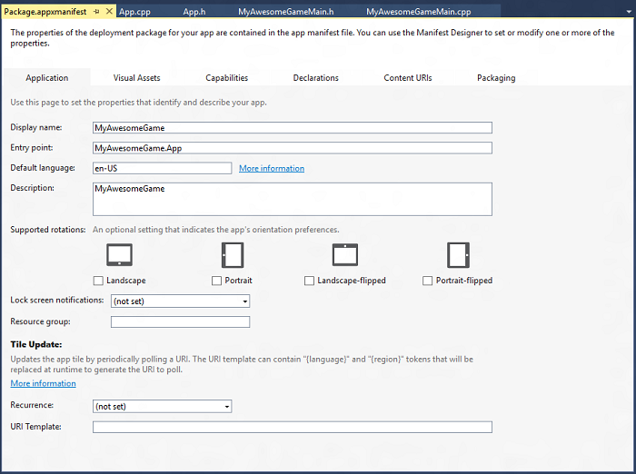
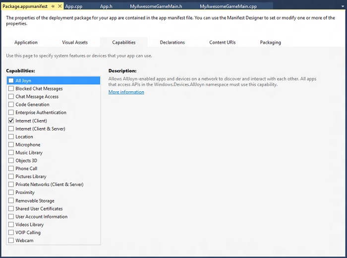

---
Configurer le projet de jeu
La première étape de l’assemblage de votre jeu consiste à configurer un projet dans Microsoft Visual Studio de façon à réduire la quantité de travail nécessaire sur l’infrastructure de code.
ms.assetid: 9fde90b3-bf79-bcb3-03b6-d38ab85803f2
---

# Configurer le projet de jeu


\[ Mise à jour pour les applications UWP sur Windows 10. Pour les articles sur Windows 8.x, voir la [documentation archivée](http://go.microsoft.com/fwlink/p/?linkid=619132). \]

La première étape de l’assemblage de votre jeu consiste à configurer un projet dans Microsoft Visual Studio de façon à réduire la quantité de travail nécessaire sur l’infrastructure de code. Vous pouvez gagner du temps et éviter bien des tracas en utilisant le modèle approprié et en configurant le projet spécifiquement pour le développement de jeux. Nous vous guidons tout au long de l’installation et la configuration d’un projet de jeu simple.

## Objectif


-   Apprendre à configurer un projet de jeu Direct3D dans Visual Studio.

## Configuration du projet de jeu


Vous pouvez écrire un jeu depuis le début, juste avec un éditeur de texte à portée de main, quelques exemples et plein de matière grise brute. Cependant, ce n’est probablement pas la façon la plus efficace d’utiliser votre temps. Si vous débutez dans le développement UWP, pourquoi ne pas laisser Visual Studio vous alléger un peu la tâche ? Voici comment procéder pour que votre projet démarre sur les chapeaux de roues.

## 1. Choisir le modèle approprié


Un modèle Visual Studio est une collection de paramètres et de fichiers de code qui ciblent un type spécifique d’application selon la technologie et le langage préférés. Dans Microsoft Visual Studio 2015, vous trouverez de nombreux modèles qui peuvent considérablement simplifier le développement d’applications graphiques et de jeux. Si vous n’utilisez pas de modèle, vous devez développer vous-même une grande partie de l’infrastructure d’affichage et du rendu graphique de base, ce qui peut représenter une corvée pour un développeur de jeux débutant.

Le modèle approprié pour ce didacticiel est celui intitulé Application DirectX 11 (Windows universel). Dans Visual Studio 2015, cliquez sur **Fichier...** &gt; **Nouveau projet**, puis procédez comme suit :

1.  Dans **Modèles**, sélectionnez **Visual C++**, **Windows**, **Universel**.
2.  Dans le volet central, sélectionnez **Application DirectX 11 (Windows universelle)**.
3.  Attribuez un nom à votre projet de jeu, puis cliquez sur **OK**.


Ce modèle vous fournit l’infrastructure de base pour une application UWP utilisant DirectX avec C++. Allez, créez-le et exécutez-le avec F5 ! Regardez cet écran bleu poudre. Prenez un moment pour examiner le code fourni par le modèle. Le modèle crée plusieurs fichiers de code contenant les fonctionnalités de base pour une application UWP utilisant DirectX avec C++. Nous parlerons davantage des autres fichiers de code à l’[étape 3](#3-review-the-included-libraries-and-headers). Pour l’instant, examinons rapidement **App.h**.

```cpp
    ref class App sealed : public Windows::ApplicationModel::Core::IFrameworkView
    {
    public:
        App();

        // IFrameworkView Methods.
        virtual void Initialize(Windows::ApplicationModel::Core::CoreApplicationView^ applicationView);
        virtual void SetWindow(Windows::UI::Core::CoreWindow^ window);
        virtual void Load(Platform::String^ entryPoint);
        virtual void Run();
        virtual void Uninitialize();

    protected:
        // Application lifecycle event handlers.
        void OnActivated(Windows::ApplicationModel::Core::CoreApplicationView^ applicationView, Windows::ApplicationModel::Activation::IActivatedEventArgs^ args);
        void OnSuspending(Platform::Object^ sender, Windows::ApplicationModel::SuspendingEventArgs^ args);
        void OnResuming(Platform::Object^ sender, Platform::Object^ args);

        // Window event handlers.
        void OnWindowSizeChanged(Windows::UI::Core::CoreWindow^ sender, Windows::UI::Core::WindowSizeChangedEventArgs^ args);
        void OnVisibilityChanged(Windows::UI::Core::CoreWindow^ sender, Windows::UI::Core::VisibilityChangedEventArgs^ args);
        void OnWindowClosed(Windows::UI::Core::CoreWindow^ sender, Windows::UI::Core::CoreWindowEventArgs^ args);

        // DisplayInformation event handlers.
        void OnDpiChanged(Windows::Graphics::Display::DisplayInformation^ sender, Platform::Object^ args);
        void OnOrientationChanged(Windows::Graphics::Display::DisplayInformation^ sender, Platform::Object^ args);
        void OnDisplayContentsInvalidated(Windows::Graphics::Display::DisplayInformation^ sender, Platform::Object^ args);

    private:
        std::shared_ptr<DX::DeviceResources> m_deviceResources;
        std::unique_ptr<MyAwesomeGameMain> m_main;
        bool m_windowClosed;
        bool m_windowVisible;
    };
```

Vous créez ces cinq méthodes, [**Initialize**](https://msdn.microsoft.com/library/windows/apps/hh700495), [**SetWindow**](https://msdn.microsoft.com/library/windows/apps/hh700509), [**Load**](https://msdn.microsoft.com/library/windows/apps/hh700501), [**Run**](https://msdn.microsoft.com/library/windows/apps/hh700505) et [**Uninitialize**](https://msdn.microsoft.com/library/windows/apps/hh700523), lors de l’implémentation de l’interface [**IFrameworkView**](https://msdn.microsoft.com/library/windows/apps/hh700469) qui définit un fournisseur de vues. Ces méthodes sont exécutées par le singleton de l’application qui est créé lors du lancement du jeu, chargent toutes les ressources de votre application et connectent les gestionnaires d’événements appropriés.

Votre méthode **main** se trouve dans le fichier source **App.cpp**. Elle se présente comme suit :

```cpp
[Platform::MTAThread]
int main(Platform::Array<Platform::String^>^)
{
    auto direct3DApplicationSource = ref new Direct3DApplicationSource();
    CoreApplication::Run(direct3DApplicationSource);
    return 0;
}
```

Pour le moment, elle crée une instance du fournisseur de vues Direct3D à partir de la fabrique de fournisseurs de vues (**Direct3DApplicationSource**, définie dans **App.h**), et la transmet au singleton de l’application pour exécution ([**CoreApplication::Run**](https://msdn.microsoft.com/library/windows/apps/hh700469)). Cela signifie que le point de départ de votre jeu se trouve dans le corps de l’implémentation de la méthode [**IFrameworkView::Run**](https://msdn.microsoft.com/library/windows/apps/hh700505), **App::Run** dans ce cas précis. Voici le code :

```cpp
void App::Run()
{
    while (!m_windowClosed)
    {
        if (m_windowVisible)
        {
            CoreWindow::GetForCurrentThread()->Dispatcher->ProcessEvents(CoreProcessEventsOption::ProcessAllIfPresent);

            m_main->Update();

            if (m_main->Render())
            {
                m_deviceResources->Present();
            }
        }
        else
        {
            CoreWindow::GetForCurrentThread()->Dispatcher->ProcessEvents(CoreProcessEventsOption::ProcessOneAndAllPending);
        }
    }
}
```

Si la fenêtre de votre jeu n’est pas fermée, elle distribue tous les événements, met à jour le minuteur, restitue et présente les résultats de votre chaîne de transformations graphiques. Nous abordons ceci plus en détail dans [Définition de l’infrastructure UWP du jeu](tutorial--building-the-games-metro-style-app-framework.md) et [Assemblage du pipeline de rendu](tutorial--assembling-the-rendering-pipeline.md). À ce stade, vous devez avoir une idée de la structure de code de base d’un jeu UWP DirectX.

## 2. Examiner et mettre à jour le fichier package.appxmanifest


Le modèle ne se résume pas aux seuls fichiers de code. Le fichier **package.appxmanifest** contient des métadonnées relatives à votre projet qui sont utilisées pour la création de packages et le lancement de votre jeu, ainsi que pour l’envoi au Windows Store. Il contient également des informations importantes utilisées par le système du joueur pour fournir l’accès aux ressources système nécessaires au fonctionnement du jeu.

Lancez le **concepteur de manifeste** en double-cliquant sur le fichier **package.appxmanifest** dans l’**Explorateur de solutions**. La vue suivante s’affiche :



Pour plus d’informations sur le fichier **package.appxmanifest** et sur la création de packages, voir [Concepteur de manifeste](https://msdn.microsoft.com/library/windows/apps/br230259.aspx). Pour le moment, examinez l’onglet **Fonctionnalités** et les options proposées.



Si vous ne sélectionnez pas les fonctionnalités utilisées par votre jeu, par exemple l’accès à **Internet** pour le tableau global des meilleurs scores, vous ne serez pas en mesure d’accéder aux fonctionnalités ou aux ressources correspondantes. Lorsque vous créez un jeu, veillez à sélectionner les fonctionnalités nécessaires au fonctionnement du jeu !

Examinons maintenant le reste des fichiers qui accompagnent le modèle d’**application DirectX 11 (Windows universelle)**.

## 3. Passer en revue les bibliothèques et en-têtes inclus


Il reste quelques fichiers que nous n’avons pas encore examinés. Ces fichiers offrent une prise en charge et des outils supplémentaires typiques des scénarios de développement de jeux Direct3D.

| Fichier source du modèle         | Description                                                                                                                                                                                                            |
|------------------------------|------------------------------------------------------------------------------------------------------------------------------------------------------------------------------------------------------------------------|
| StepTimer.h                  | Définit un minuteur haute résolution utile pour les applications de rendu interactives ou les jeux.                                                                                                                                       |
| Sample3DSceneRenderer.h/.cpp | Définit une implémentation de convertisseur de base qui connecte une chaîne de permutation Direct3D et une carte graphique à votre UWP utilisant DirectX.                                                                                            |
| DirectXHelper.h              | Implémente une seule méthode, **DX::ThrowIfFailed**, qui permet de convertir les valeurs d’erreur HRESULT renvoyées par les API DirectX en exceptions Windows Runtime. Utilisez cette méthode pour placer un point d’arrêt pour le débogage des erreurs DirectX. |
| pch.h/.cpp                   | Contient tous les fichiers Include système Windows pour les API utilisées par une application Direct3D, notamment les API DirectX 11.                                                                                                           |
| SamplePixelShader.hlsl       | Contient le code de langage HLSL (High-Level Shader Language) pour un nuanceur de pixels très simple.                                                                                                                                     |
| SampleVertexShader.hlsl      | Contient le code de langage HLSL (High-Level Shader Language) pour un vertex shader très simple.                                                                                                                                    |

 

### Étapes suivantes

À ce stade, vous pouvez créer un projet de jeu UWP avec DirectX et identifier les composants et fichiers fournis par le modèle d’application DirectX 11 (Windows universelle).

Dans le didacticiel suivant, [Définition de l’infrastructure UWP du jeu](tutorial--building-the-games-metro-style-app-framework.md), nous allons utiliser un jeu complet et examiner comment il utilise et étend un grand nombre des concepts et composants fournis par le modèle.

 

 


<!--HONumber=Mar16_HO1-->


