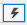
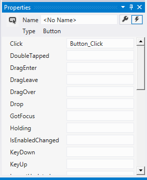
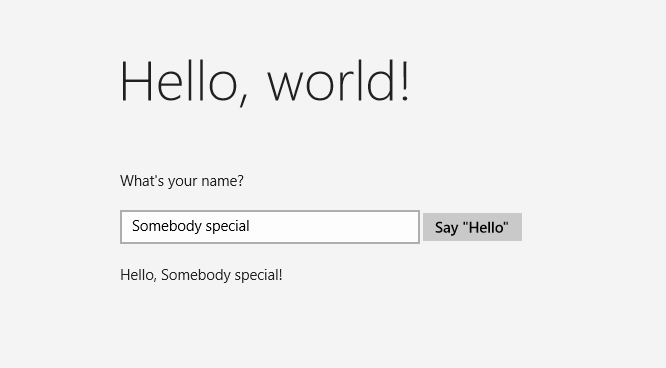

# <a name="create-a-hello-world-app-in-ccx"></a>Créer une application «Hello world» en C++ / CX

> [!IMPORTANT]
> Ce didacticiel utilise C++ / CX. Microsoft a publié C++ / WinRT: une entièrement standard C ++ 17 projection de langage moderne API Windows Runtime (WinRT). Pour plus d’informations sur cette langue, veuillez consulter [C++ / WinRT](https://docs.microsoft.com/windows/uwp/cpp-and-winrt-apis/). 

Avec Microsoft Studio2017 visuel, vous pouvez utiliser C++ / CX pour développer une application qui s’exécute sur Windows 10 avec une interface utilisateur qui est définie dans le balisage langage XAML (Extensible Application).

> [!NOTE]
> Ce didacticiel utilise Visual Studio Community 2017. Si vous utilisez une autre version de Visual Studio, son aspect peut vous sembler légèrement différent.

## <a name="before-you-start"></a>Avant de commencer

-   Pour suivre ce didacticiel, vous devez utiliser Visual StudioCommunity 2017 ou l’une des versions de Visual Studio2017, autres que Community sur un ordinateur qui exécute Windows 10. Pour télécharger les éléments nécessaires, voir [Obtenir les outils](http://go.microsoft.com/fwlink/p/?LinkId=532666).
-   Nous supposons que vous avez une connaissance de base de C++ / CX, XAML et les concepts abordés dans la [vue d’ensemble du code XAML](https://msdn.microsoft.com/library/windows/apps/Mt185595).
-   Nous partons du principe que vous utilisez la disposition de fenêtre par défaut dans Visual Studio. Pour rétablir la disposition par défaut, dans la barre de menus, choisissez **Fenêtre** > **Rétablir la disposition de la fenêtre**.

## <a name="comparing-c-desktop-apps-to-windows-apps"></a>Comparatif entre les applications de bureau C++ et les applications Windows

Si vous avez déjà programmé des applications de bureau Windows en C++, vous constaterez sans doute que certains aspects de l'écriture d'applications pour UWP présentent des similitudes. D’autres aspects, au contraire, vous demanderont d’acquérir de nouvelles connaissances.

### <a name="whats-the-same"></a>Points communs

-   Vous pouvez utiliser la bibliothèque STL, la bibliothèque CRT (avec quelques exceptions) et toute autre bibliothèque C++ tant que le code appelle uniquement des fonctions Windows qui sont accessibles à partir de l’environnement Windows Runtime.

-   Si vous êtes habitué aux concepteurs visuels, vous pouvez toujours utiliser le concepteur intégré à Microsoft Visual Studio ou utiliser Blend pour Visual Studio qui comporte davantage de fonctionnalités. Si vous avez l’habitude de coder manuellement l’interface utilisateur, vous pouvez procéder de la même façon avec le code XAML.

-   Vous créez toujours des applications qui utilisent les types du système d’exploitation Windows et vos propres types.

-   Vous utilisez toujours le débogueur, le profileur et les autres outils de développement de Visual Studio.

-   Vous créez toujours des applications qui sont compilées en code machine natif par le compilateur Visual C++. Les applications UWP en C++ / CX ne s’exécutent pas dans un environnement d’exécution managé.

### <a name="whats-new"></a>Quelles sont les nouveautés ?

-   Les principes de conception régissant les applications UWP et les applications Windows universelles sont très différents de ceux des applications de bureau. Les bordures des fenêtres, les étiquettes, les boîtes de dialogue, etc., sont reléguées au deuxième plan. C’est le contenu qui est mis en avant. Les applications Windows universelles réussies intègrent ces principes dès le début de la phase de planification.

-   Vous utilisez XAML pour définir l’interface utilisateur dans sa totalité. La séparation entre l’interface utilisateur et la logique du programme résident est beaucoup plus nette dans une application Windows universelle que dans une application MFC ou Win32. Pendant que vous mettez au point le comportement dans le fichier de code, d’autres personnes peuvent travailler sur l’apparence de l’interface utilisateur dans le fichier XAML.

-   Bien que, sur les appareils Windows, Win32 soit toujours disponible pour certaines fonctionnalités, vous programmez avant tout dans une nouvelle API conviviale orientée objet : Windows Runtime.

-   Vous utilisez C++/CX pour consommer et créer des objets Windows Runtime. C++/CX autorise la gestion des exceptions, les délégués et les événements C++, ainsi que le décompte de références automatique des objets créés dynamiquement. Quand vous utilisez C++/CX, les détails des architectures COM et Windows sous-jacentes sont soustraits du code de votre application. Pour plus d’informations, voir les [Informations de référence en matière de langage C++/CX](https://msdn.microsoft.com/library/windows/apps/hh699871.aspx).

-   Votre application est compilée dans un package qui contient aussi des métadonnées sur les types présents dans votre application, les ressources qu’elle utilise, ainsi que les capacités dont elle a besoin (accès aux fichiers, à Internet, à un appareil photo et ainsi de suite).

-   Dans le Microsoft Store et le Windows Phone Store, votre application est validée comme étant digne de confiance par un processus de certification, puis mise à la disposition de millions de clients potentiels.

## <a name="hello-world-store-app-in-ccx"></a>Application de Store Hello World en C++ / CX

Notre première application, intitulée « Hello World », présente certaines fonctionnalités de base en matière d’interactivité, de présentation et de style. Nous allons créer une application à partir du modèle de projet d’application Windows universelle. Si vous avez développé des applications pour Windows8.1 et Windows Phone 8.1, vous vous rappelez probablement que vous deviez avoir trois projets dans Visual Studio, un pour l’application Windows, l’un pour l’application téléphonique et l’autre avec code partagé. Windows 10 Universal Windows Platform (UWP) rend possible d’avoir qu’un seul projet, qui s’exécute sur tous les appareils, y compris les ordinateurs de bureau et portables exécutant Windows 10, les appareils tels que les tablettes, les téléphones mobiles, les appareils de réalité virtuelle, et ainsi de suite.

Commençons par les bases:

-   Découvrez comment créer un projet Windows universel dans Visual Studio2017.

-   Comprendre les projets et fichiers qui sont créés.

-   Comprendre les extensions dans les extensions de composant Visual c++ (C++ / CX) et quand les utiliser.

**Créer une solution dans Visual Studio**

1.  Dans Visual Studio, dans la barre de menus, choisissez **Fichier** > **Nouveau** > **Projet**.

2.  Dans la boîte de dialogue **Nouveau projet**, dans le volet gauche, développez **Installé** > **Visual C++** > **Windows universel**.

> [!NOTE]
> Vous pouvez être invité à installer les outils Windows universels pour le développement C++.

3.  Dans le volet central, sélectionnez **Application vide (Windows universel)**.

   (Si vous ne voyez pas ces options, assurez-vous que vous avez installé les outils de développement d’applications Windows universelles. Pour plus d’informations, voir [Se préparer](get-set-up.md).)

4.  Entrez un nom pour le projet. Appelons-le HelloWorld.

 

5.  Choisissez le bouton **OK**.

> [!NOTE]
> Si vous utilisez Visual Studio pour la première fois, il est possible que la boîte de dialogue Paramètres s'affiche et vous demande d’activer le **Mode développeur**. Le mode développeur est un paramètre qui permet d'accéder à certaines fonctionnalités, telles que l’autorisation d’exécuter des applications directement plutôt qu’uniquement à partir du Windows Store. Pour plus d’informations, consultez [Activer votre appareil pour le développement](enable-your-device-for-development.md). Pour continuer avec ce guide, sélectionnez le **Mode développeur**, cliquez sur **Oui** et fermez la boîte de dialogue.

   Vos fichiers de projet sont créés.

Avant de continuer, examinons de plus près ce que contient la solution.


### <a name="about-the-project-files"></a>À propos des fichiers de projet

Chaque fichier .xaml inclus dans un dossier de projet est associé à un fichier .xaml.h et à un fichier .xaml.cpp correspondants dans le même dossier, ainsi qu’à un fichier .g et à un fichier .g.hpp dans le dossier Fichiers générés qui figure sur le disque mais ne fait pas partie du projet. Vous modifiez les fichiers XAML pour créer des éléments d’interface utilisateur et les connecter à des sources de données (DataBinding). Vous modifiez les fichiers .h et .cpp pour ajouter une logique personnalisée pour des gestionnaires d’événements. Les fichiers auto-générés représentent la transformation du balisage XAML en C++ / CX. Ne modifiez pas ces fichiers, mais étudiez-les pour mieux comprendre comment fonctionne le code-behind. En gros, le fichier généré contient une définition de classe partielle pour un élément racine XAML ; cette classe est la même que celle que vous modifiez dans les fichiers \*.xaml.h et .cpp. Les fichiers générés déclarent les éléments enfants d’interface utilisateur XAML en tant que membres de classe pour que vous puissiez les référencer dans le code que vous écrivez. Au moment de la génération, le code généré et votre code sont fusionnés dans une définition de classe complète, puis compilés.

Examinons tout d’abord les fichiers de projet.

-   **App.xaml, App.xaml.h, App.xaml.cpp :** ces fichiers représentent l’objet Application, qui est le point d’entrée d’une application. Le fichier App.xaml ne contient pas de balisage d’interface utilisateur spécifique à chaque page, mais vous pouvez ajouter des styles d’interface utilisateur et d’autres éléments que vous voulez rendre accessibles depuis chaque page. Les fichiers code-behind contiennent des gestionnaires pour les événements **OnLaunched** et **OnSuspending**. En règle générale, c’est ici que vous ajoutez du code personnalisé pour initialiser votre application quand elle démarre et effectuer un nettoyage quand elle est suspendue ou arrêtée.
-   **MainPage.xaml, MainPage.xaml.h, MainPage.xaml.cpp :** ces fichiers contiennent le balisage XAML et le code-behind de la page de « démarrage » par défaut d’une application. Cette page n’inclut pas de prise en charge de la navigation ni de contrôles intégrés.
-   **pch.h, pch.cpp :** il s’agit d’un fichier d’en-tête précompilé et du fichier qui l’inclut dans votre projet. Dans pch.h, vous pouvez inclure tous les en-têtes qui ne changent pas souvent et qui sont inclus dans d’autres fichiers de la solution.
-   **package.appxmanifest :** il s’agit d’un fichier XML qui décrit les fonctionnalités d’appareil requises par votre application, ainsi que les informations liées à la version et à d’autres métadonnées de l’application. Pour ouvrir ce fichier dans le **Concepteur de manifeste**, il suffit de double-cliquer dessus.
-   **HelloWorld\_TemporaryKey.pfx :** clé permettant le déploiement de l’application sur cet ordinateur, à partir de Visual Studio.

## <a name="a-first-look-at-the-code"></a>Découverte du code

Si vous examinez le code dans les fichiers App.xaml.h et App.xaml.cpp dans le projet partagé, vous pouvez remarquer qu’il s’agit en majorité de code C++ que vous connaissez déjà. Toutefois, certains éléments de syntaxe peuvent ne pas vous être aussi familiers si vous découvrez les applications Windows Runtime ou si vous avez travaillé avec C++/CLI. Voici donc les éléments de syntaxe non standard les plus courants en C++/CX :

**Classes ref**

Presque toutes les classes Windows Runtime, qui incluent tous les types de l’API Windows (les contrôles XAML, les pages dans votre application, la classe App elle-même, tous les objets appareil et réseau, tous les types de conteneurs) sont déclarées sous forme de **ref class**. (Quelques types Windows correspondent à une **value class** ou **value struct**). Une classe ref est consommable à partir de tous les langages. En C++ / CX, la durée de vie de ces types est régie par le décompte (non le nettoyage) afin que vous ne supprimez jamais explicitement ces objets de références automatique. Vous pouvez créer vos propres classes ref également.

```cpp
namespace HelloWorld
{
   /// <summary>
   /// An empty page that can be used on its own or navigated to within a Frame.
   /// </summary>
   public ref class MainPage sealed
   {
      public:
      MainPage();
   };
}
```    

Tous les types Windows Runtime doivent être déclarés au sein d’un espace de noms alors qu’en C++ ISO, les types eux-mêmes possèdent un modificateur d’accessibilité. Le modificateur **public** rend la classe visible pour les composants Windows Runtime en dehors de l’espace de noms. Le mot clé **sealed** signifie que la classe ne peut pas servir de classe de base. Presque toutes les classes ref sont des classes «sealed»; l’héritage de classe n’est pas largement utilisé, car JavaScript ne le comprend pas.

**ref new** et **^ (hats)**

Pour déclarer une variable d’une classe ref, vous utilisez l’opérateur ^ (accent circonflexe) et vous instanciez l’objet avec le nouveau mot-clé ref. Ensuite, vous accédez aux méthodes d’instance de l’objet avec l’opérateur -&gt;, à l’instar d’un pointeur C++. Pour accéder aux méthodes statiques, vous utilisez l’opérateur :: comme en C++ ISO.

Dans le code suivant, nous utilisons le nom complet pour instancier un objet et l’opérateur -&gt; pour appeler une méthode d’instance.

```cpp
Windows::UI::Xaml::Media::Imaging::BitmapImage^ bitmapImage =
     ref new Windows::UI::Xaml::Media::Imaging::BitmapImage();
      
bitmapImage->SetSource(fileStream);
```

En règle générale, dans un fichier .cpp, nous ajoutons une directive `using namespace  Windows::UI::Xaml::Media::Imaging` et le mot clé auto, pour que le même code ressemble à ce qui suit:

```cpp
auto bitmapImage = ref new BitmapImage();
bitmapImage->SetSource(fileStream);
```

**Propriétés**

Une classe ref peut avoir des propriétés, qui, comme dans les langages managés, sont des fonctions membres spéciales qui apparaissent sous forme de champs dans le code consommateur.

```cpp
public ref class SaveStateEventArgs sealed
{
   public:
   // Declare the property
   property Windows::Foundation::Collections::IMap<Platform::String^, Platform::Object^>^ PageState
   {
      Windows::Foundation::Collections::IMap<Platform::String^, Platform::Object^>^ get();
   }
   ...
};

   ...
   // consume the property like a public field
   void PhotoPage::SaveState(Object^ sender, Common::SaveStateEventArgs^ e)
   {    
      if (mruToken != nullptr && !mruToken->IsEmpty())
   {
      e->PageState->Insert("mruToken", mruToken);
   }
}
```

**Délégués**

Comme dans les langages managés, un délégué est un type de référence qui encapsule une fonction avec une signature spécifique. Les délégués sont le plus souvent utilisés avec des événements et des gestionnaires d’événements.

```cpp
// Delegate declaration (within namespace scope)
public delegate void LoadStateEventHandler(Platform::Object^ sender, LoadStateEventArgs^ e);

// Event declaration (class scope)
public ref class NavigationHelper sealed
{
   public:
   event LoadStateEventHandler^ LoadState;
};

// Create the event handler in consuming class
MainPage::MainPage()
{
   auto navigationHelper = ref new Common::NavigationHelper(this);
   navigationHelper->LoadState += ref new Common::LoadStateEventHandler(this, &MainPage::LoadState);
}
```

## <a name="adding-content-to-the-app"></a>Ajout de contenu à l’application

Ajoutons du contenu à l’application.

**Étape 1: modifier votre page de démarrage**

1.  Dans l’**Explorateur de solutions**, ouvrez MainPage.xaml.
2.  Créez des contrôles pour l’interface utilisateur en ajoutant le code XAML suivant à la classe [**Grid**](https://msdn.microsoft.com/library/windows/apps/BR242704) racine, juste avant sa balise de fermeture. Il contient un [**StackPanel**](https://msdn.microsoft.com/library/windows/apps/BR209635) comportant un [**TextBlock**](https://msdn.microsoft.com/library/windows/apps/BR209652) qui demande le nom de l’utilisateur, un élément [**TextBox**](https://msdn.microsoft.com/library/windows/apps/BR209683) qui accepte le nom de l’utilisateur, un [**Button**](https://msdn.microsoft.com/library/windows/apps/BR209265), puis un autre élément **TextBlock**.

    ```xaml
    <StackPanel x:Name="contentPanel" Margin="120,30,0,0">
        <TextBlock HorizontalAlignment="Left" Text="Hello World" FontSize="36"/>
        <TextBlock Text="What's your name?"/>
        <StackPanel x:Name="inputPanel" Orientation="Horizontal" Margin="0,20,0,20">
            <TextBox x:Name="nameInput" Width="300" HorizontalAlignment="Left"/>
            <Button x:Name="inputButton" Content="Say &quot;Hello&quot;"/>
        </StackPanel>
        <TextBlock x:Name="greetingOutput"/>
    </StackPanel>
    ```

3.  À ce stade, vous avez créé une application Windows universelle très basique. Pour voir à quoi l’application UWP ressemblera, appuyez sur F5 pour générer, déployer et exécuter l’application en mode débogage.

L’écran de démarrage par défaut s’affiche en premier. Il comporte une image, Assets\\SplashScreen.scale-100.png, et une couleur d’arrière-plan spécifiées dans le fichier manifeste de l’application. Pour apprendre à personnaliser l’écran de démarrage, voir [Ajout d’un écran de démarrage](https://msdn.microsoft.com/library/windows/apps/Hh465332).

Quand l’écran de démarrage disparaît, votre application apparaît. La page principale de l’application apparaît.


Félicitations! Même si elle ne propose pas encore beaucoup de fonctions, vous venez de générer votre première application pour la plateforme Windows universelle.

Pour arrêter le débogage et fermer l’application, retournez dans Visual Studio et appuyez sur Maj+F5.

Pour plus d’informations, voir [Exécuter une application du Store à partir de Visual Studio](http://go.microsoft.com/fwlink/p/?LinkId=619619).

Dans l’application, vous pouvez taper dans le [**TextBox**](https://msdn.microsoft.com/library/windows/apps/BR209683), mais quand vous cliquez sur le [**Button**](https://msdn.microsoft.com/library/windows/apps/BR209265), il ne se passe rien. Dans les étapes suivantes, vous créez un gestionnaire d’événements pour l’événement [**Click**](https://msdn.microsoft.com/library/windows/apps/BR227737) du bouton qui affiche une formule de salutation personnalisée.

## <a name="step-2-create-an-event-handler"></a>Étape2: créer un gestionnaire d’événements

1.  Dans MainPage.xaml, en mode XAML ou Création, sélectionnez le [**Button**](https://msdn.microsoft.com/library/windows/apps/BR209265) « Say Hello » dans le [**StackPanel**](https://msdn.microsoft.com/library/windows/apps/BR209635) que vous avez ajouté précédemment.
2.  Ouvrez la **Fenêtre Propriétés** en appuyant sur F4, puis choisissez le bouton Événements ().
3.  Recherchez l’événement [**Click**](https://msdn.microsoft.com/library/windows/apps/BR227737). Dans sa zone de texte, tapez le nom de la fonction qui gère l’événement **Click**. Pour cet exemple, tapez «Button\_Click».

    

4.  Appuyez sur Entrée. La méthode du gestionnaire d’événements est créée dans MainPage.xaml.cpp et ouverte afin que vous puissiez ajouter le code qui est exécuté quand l’événement se produit.

   Au même moment, dans MainPage.xaml, le code XAML de [**Button**](https://msdn.microsoft.com/library/windows/apps/BR209265) est mis à jour pour déclarer le gestionnaire d’événements [**Click**](https://msdn.microsoft.com/library/windows/apps/BR227737) comme suit :

    ```xaml
    <Button Content="Say &quot;Hello&quot;" Click="Button_Click"/>
    ```

   Vous pourriez également avoir simplement ajouté cela au code xaml manuellement, ce qui peut être utile si le concepteur ne se charge pas. Si vous ajoutez cela manuellement, tapez « Click », puis laissez IntelliSense afficher l’option pour ajouter un nouveau gestionnaire d’événements. De cette façon, Visual Studio crée la déclaration de méthode nécessaire et un stub.

   Le concepteur ne se charge pas si une exception non gérée se produit pendant l’opération de rendu. L’opération de rendu dans le concepteur implique l’exécution d’une version de conception de la page. Il peut être utile de désactiver l’exécution du code utilisateur. Vous pouvez le faire en modifiant le paramètre dans la boîte de dialogue **Outils, Options**. Sous **Concepteur XAML**, désactivez l’option **Exécuter le code du projet dans le concepteur XAML (si pris en charge)**.

5.  Dans MainPage.xaml.cpp, ajoutez le code suivant au gestionnaire d’événements **Button\_Click** que vous venez de créer. Ce code récupère le nom de l’utilisateur à partir du contrôle `nameInput` [**TextBox**](https://msdn.microsoft.com/library/windows/apps/BR209683) et s’en sert pour créer une salutation. Le contrôle `greetingOutput` [**TextBlock**](https://msdn.microsoft.com/library/windows/apps/BR209652) affiche le résultat.

    ```cpp
    void HelloWorld::MainPage::Button_Click(Platform::Object^ sender, Windows::UI::Xaml::RoutedEventArgs^ e)
    {
        greetingOutput->Text = "Hello, " + nameInput->Text + "!";
    }
    ```

6.  Définissez le projet comme projet de démarrage, puis appuyez sur F5 pour générer et exécuter l’application. Quand vous tapez un nom dans la zone de texte et que vous cliquez sur le bouton, l’application affiche une formule de salutation personnalisée.


## <a name="step-3-style-the-start-page"></a>Étape 3 : définir le style de la page de démarrage

### <a name="choosing-a-theme"></a>Choix d’un thème

Il est très simple de personnaliser l’apparence d’une application. Par défaut, votre application utilise des ressources sont le style est à dominante claire. Les ressources système comportent également un thème à dominante claire. Testons-le pour voir à quoi il ressemble.

**Pour basculer vers le thème foncé**

1.  Ouvrez App.xaml.
2.  Dans la balise de début [**Application**](https://msdn.microsoft.com/library/windows/apps/BR242324), modifiez la propriété [**RequestedTheme**](https://msdn.microsoft.com/library/windows/apps/windows.ui.xaml.application.requestedtheme) et attribuez-lui la valeur **Dark** :

    ```xaml
    RequestedTheme="Dark"
    ```

    Voici l’intégralité de la balise [**Application**](https://msdn.microsoft.com/library/windows/apps/BR242324) avec le thème foncé :

    ```xaml 
        <Application
        x:Class="HelloWorld.App"
        xmlns="http://schemas.microsoft.com/winfx/2006/xaml/presentation"
        xmlns:x="http://schemas.microsoft.com/winfx/2006/xaml"
        xmlns:local="using:HelloWorld"
        RequestedTheme="Dark">
    ```

3.  Appuyez sur la touche F5 pour générer et exécuter l’application. Remarquez qu’elle utilise le thème à dominante foncée.


Quel thème utiliser ? Tout est question de goût personnel. Toutefois, nous recommandons le thème à dominante foncée pour les applications qui affichent essentiellement des images ou de la vidéo, et le thème à dominante claire pour les applications qui contiennent beaucoup de texte. Si vous recourez à un modèle de couleurs personnalisé, utilisez le thème qui s’accorde le mieux à l’apparence de votre application. Dans le reste de ce didacticiel, nous utilisons le thème à dominante claire dans les captures d’écran.

**Remarque**le thème s’applique au démarrage de l’application et ne peut pas être modifiée pendant l’exécution de l’application.

### <a name="using-system-styles"></a>Utilisation de styles système

Pour l’heure, le texte de l’application Windows est de très petite taille et difficile à lire. Remédions à cela en appliquant un style système.

**Pour modifier le style d’un élément**

1.  Dans le projet Windows, ouvrez MainPage.xaml.
2.  En mode XAML ou Création, sélectionnez le [**TextBlock**](https://msdn.microsoft.com/library/windows/apps/BR209652) « What’s your name? » que vous avez ajouté précédemment.
3.  Dans la fenêtre **Propriétés** (**F4**), choisissez le bouton Propriétés () dans l’angle supérieur droit.
4.  Développez le groupe **Texte** et affectez 18 pixels à la taille de police.
5.  Développez le groupe **Divers** et recherchez la propriété **Style**.
6.  Cliquez sur le marqueur de propriété (zone verte à droite de la propriété **Style**), puis, dans le menu, choisissez **Ressource système** > **BaseTextBlockStyle**.

     **BaseTextBlockStyle** est une ressource définie dans la classe [**ResourceDictionary**](https://msdn.microsoft.com/library/windows/apps/BR208794) dans <root>\\Program Files\\Windows Kits\\10\\Include\\winrt\\xaml\\design\\generic.xaml.

    

     Dans l’aire de conception XAML, l’apparence du texte change. Dans l’éditeur XAML, le code XAML de [**TextBlock**](https://msdn.microsoft.com/library/windows/apps/BR209652) est mis à jour :

    ```xaml
    <TextBlock Text="What's your name?" Style="{ThemeResource BaseTextBlockStyle}"/>
    ```

7.  Répétez le processus pour définir la taille de la police et affectez **BaseTextBlockStyle** à l’élément `greetingOutput`[**TextBlock**](https://msdn.microsoft.com/library/windows/apps/BR209652).

    **Conseil**bien qu’il n’existe aucun texte dans ce [**TextBlock**](https://msdn.microsoft.com/library/windows/apps/BR209652), lorsque vous déplacez le pointeur au-dessus de l’aire de conception XAML, un contour bleu indique où il s’agit afin que vous pouvez le sélectionner.  

    Votre code XAML doit maintenant se présenter ainsi:

    ```xaml
    <StackPanel x:Name="contentPanel" Margin="120,30,0,0">
        <TextBlock Style="{ThemeResource BaseTextBlockStyle}" FontSize="18" Text="What's your name?"/>
        <StackPanel x:Name="inputPanel" Orientation="Horizontal" Margin="0,20,0,20">
            <TextBox x:Name="nameInput" Width="300" HorizontalAlignment="Left"/>
            <Button x:Name="inputButton" Content="Say &quot;Hello&quot;" Click="Button_Click"/>
        </StackPanel>
        <TextBlock Style="{ThemeResource BaseTextBlockStyle}" FontSize="18" x:Name="greetingOutput"/>
    </StackPanel>
    ```

8.  Appuyez sur la touche F5 pour générer et exécuter l’application. Elle se présente maintenant comme suit :



### <a name="step-4-adapt-the-ui-to-different-window-sizes"></a>Étape 4 : adapter l’interface utilisateur à différentes tailles de fenêtre

Nous allons à présent adapter l’interface utilisateur à différentes tailles d’écran afin qu’elle s’affiche correctement sur des appareils mobiles. Pour ce faire, vous ajoutez un élément [**VisualStateManager**](https://msdn.microsoft.com/library/windows/apps/BR209021) et vous définissez des propriétés qui s’appliquent à différents états visuels.

**Pour ajuster la disposition de l’interface utilisateur**

1.  Dans l’éditeur XAML, ajoutez le bloc de code XAML ci-dessous après la balise de début de l’élément [**Grid**](https://msdn.microsoft.com/library/windows/apps/BR242704) racine.

    ```xaml
    <VisualStateManager.VisualStateGroups>
        <VisualStateGroup>
            <VisualState x:Name="wideState">
                <VisualState.StateTriggers>
                    <AdaptiveTrigger MinWindowWidth="641" />
                </VisualState.StateTriggers>
            </VisualState>
            <VisualState x:Name="narrowState">
                <VisualState.StateTriggers>
                    <AdaptiveTrigger MinWindowWidth="0" />
                </VisualState.StateTriggers>
                <VisualState.Setters>
                    <Setter Target="contentPanel.Margin" Value="20,30,0,0"/>
                    <Setter Target="inputPanel.Orientation" Value="Vertical"/>
                    <Setter Target="inputButton.Margin" Value="0,4,0,0"/>
                </VisualState.Setters>
            </VisualState>
        </VisualStateGroup>
    </VisualStateManager.VisualStateGroups>
    ```

2.  Déboguez l’application sur l’ordinateur local. Notez que l’interface utilisateur présente le même aspect qu’auparavant, à moins que la fenêtre ne présente une taille inférieure à 641 DIP (device-independent pixel).
3.  Déboguez l’application sur l’émulateur d’appareil mobile. Notez que l’interface utilisateur utilise les propriétés que vous avez définies dans l’élément `narrowState` et s’affiche correctement sur le petit écran.


Si vous avez utilisé un élément [**VisualStateManager**](https://msdn.microsoft.com/library/windows/apps/BR209021) dans des versions précédentes du langage XAML, vous pouvez remarquer que le code XAML spécifié ici utilise une syntaxe simplifiée.

L’élément [**VisualState**](https://msdn.microsoft.com/library/windows/apps/BR209007) nommé `wideState` comporte un élément [**AdaptiveTrigger**](https://msdn.microsoft.com/library/windows/apps/Dn890382) dont la propriété [**MinWindowWidth**](https://msdn.microsoft.com/library/windows/apps/windows.ui.xaml.adaptivetrigger.minwindowwidth) est définie sur 641. Cela signifie que l’état ne doit s’appliquer que si la largeur de la fenêtre n’est pas inférieure à la valeur minimale de 641 DIP. Vous ne définissez aucun objet [**Setter**](https://msdn.microsoft.com/library/windows/apps/BR208817) pour cet état, de sorte qu’il utilise les propriétés de disposition que vous avez définies dans le code XAML pour le contenu de la page.

Le second élément [**VisualState**](https://msdn.microsoft.com/library/windows/apps/BR209007), `narrowState`, comporte un élément [**AdaptiveTrigger**](https://msdn.microsoft.com/library/windows/apps/Dn890382) dont la propriété [**MinWindowWidth**](https://msdn.microsoft.com/library/windows/apps/windows.ui.xaml.adaptivetrigger.minwindowwidth) est définie sur 0. Cet état est appliqué lorsque la largeur de la fenêtre est supérieure à 0, mais inférieure à 641DIP. (À 641 DIP, l’état `wideState` s’applique.) Dans cet état, vous définissez certains objets [**Setter**](https://msdn.microsoft.com/library/windows/apps/BR208817) de façon à modifier les propriétés de disposition des contrôles dans l’interface utilisateur :

-   Vous réduisez la marge gauche de l’élément `contentPanel` de 120 à 20.
-   Vous remplacez l’[**Orientation**](https://msdn.microsoft.com/library/windows/apps/windows.ui.xaml.controls.stackpanel.orientation)&nbsp;**Horizontal** de l’élément `inputPanel` par l’orientation **Vertical**.
-   Vous ajoutez une marge supérieure de 4 DIP à l’élément `inputButton`.

### <a name="summary"></a>Récapitulatif

C’est ici que prend fin le premier didacticiel. Il vous a appris à ajouter du contenu dans des applications Windows universelles, à y ajouter de l’interactivité et à modifier leur apparence.

## <a name="next-steps"></a>Étapes suivantes

Si vous avez un projet d’application Windows universelle qui cible Windows8.1 et/ou Windows Phone 8.1, vous pouvez le porter vers Windows 10. Aucune procédure automatique n’existe pour ce faire, mais vous pouvez effectuer le portage manuellement. Commencez par un nouveau projet Windows universel pour obtenir la dernière structure du système de projet et les derniers fichiers manifeste, copiez vos fichiers de code dans la structure de répertoire du projet, ajoutez les éléments à votre projet, puis réécrivez votre code XAML à l’aide du [**VisualStateManager**](https://msdn.microsoft.com/library/windows/apps/BR209021) en suivant les recommandations de cette rubrique. Pour plus d’informations, voir [Portage d’un projet Windows Runtime 8 vers un projet de plateforme Windows universelle (UWP)](https://msdn.microsoft.com/library/windows/apps/Mt188203) et [Portage vers la plateforme Windows universelle (C++)](http://go.microsoft.com/fwlink/p/?LinkId=619525).

Si vous disposez de code C++ existant que vous souhaitez intégrer avec une application UWP, par exemple, pour créer une interface utilisateur UWP pour une application existante, voir [Utilisation de code C++ existant dans un projet Windows universel](http://go.microsoft.com/fwlink/p/?LinkId=619623).

