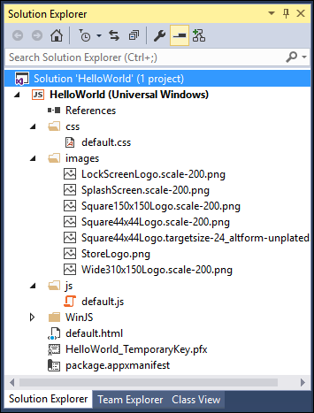
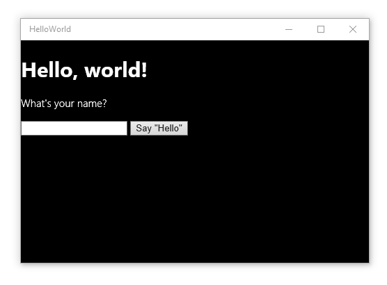
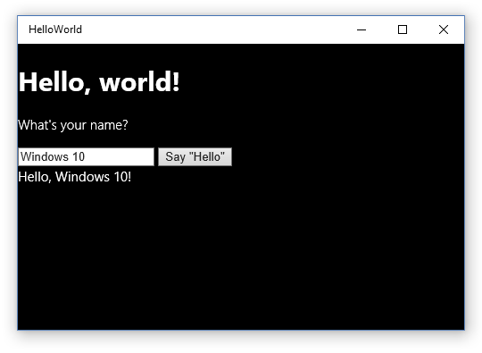
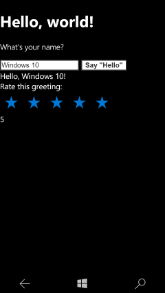

# Créer une application « Hello World » (JS)

Ce didacticiel vous expliquer comment utiliser JavaScript et HTML pour créer une simple application « Hello World » ciblant la plateforme Windows universelle (UWP) sur Windows 10. À l’aide d’un seul projet dans Microsoft Visual Studio, vous pouvez générer une application qui s’exécute sur tout appareil Windows 10. Nous allons nous concentrer sur la création d’une application qui s’exécute aussi bien sur des ordinateurs de bureau que sur des appareils mobiles.

**Important** Ce didacticiel est destiné à être utilisé avec Microsoft Visual Studio 2015 et Windows 10. Il ne fonctionnera pas correctement avec les versions antérieures de ces applications.

Vous allez apprendre à effectuer les opérations suivantes :

-   créer un projet ;
-   ajouter du contenu HTML à votre page de démarrage ;
-   gérer les entrées tactiles, les entrées effectuées à l’aide du stylet et les entrées effectuées à l’aide de souris ;
-   exécuter le projet sur l’ordinateur local et sur l’émulateur de téléphone dans Visual Studio ;
-   créer vos propres styles personnalisés ;
-   utiliser un contrôle de la bibliothèque Windows pour JavaScript.

##Avant de commencer...


-   Nous allons accéder directement aux étapes permettant de créer une application universelle simple. Avant de commencer ce didacticiel, nous vous recommandons vivement de lire attentivement les informations de présentation des articles [Nouveautés de Windows 10](https://dev.windows.com/whats-new-windows-10-dev-preview) et [Qu’est-ce qu’une application Windows universelle ?](whats-a-uwp.md).
-   Pour suivre ce didacticiel, vous avez besoin de Windows 10 et de Visual Studio 2015. Pour plus d’informations, voir [Se préparer](get-set-up.md).
-   Nous partons également du principe que vous utilisez la disposition de fenêtre par défaut de Visual Studio. Si vous modifiez la disposition par défaut, vous pouvez la réinitialiser dans le menu **Fenêtre** en choisissant la commande **Rétablir la disposition de fenêtre**.

##Étape 1 : créer un projet dans Visual Studio


Créons une application intitulée `HelloWorld`. Voici comment procéder :

1.  Lancez Visual Studio 2015.

    L’écran d’accueil de Visual Studio 2015 s’affiche.

    (Désormais, nous désignerons Visual Studio 2015 simplement sous le nom Visual Studio .)

2.  Dans le menu **Fichier**, sélectionnez **Nouveau** > **Projet**.

    La boîte de dialogue **Nouveau projet** s’affiche. Le volet gauche de la boîte de dialogue permet de choisir le type de modèle à afficher.

3.  Dans le volet gauche, développez **Installé > Modèles > JavaScript > Windows**, puis sélectionnez le groupe de modèles **Universel**. Le volet central de la boîte de dialogue affiche une liste de modèles de projets pour les applications de la plateforme Windows universelle (UWP).

    

    Pour ce didacticiel, nous utilisons le modèle **Application vide**. Ce modèle crée une application UWP dépouillée qui peut être compilée et exécutée, mais qui ne contient ni contrôles d’interface utilisateur, ni données. Dans le cadre de ce didacticiel, vous allez ajoutez des contrôles et des données à l’application.

4.  Dans le volet central, sélectionnez le modèle **Application vide (Windows universel)**.

    Le modèle **Application vide** crée une application UWP dépouillée qui peut être compilée et exécutée, mais qui ne contient aucun contrôle d’interface utilisateur ni aucune donnée. Au cours de ce didacticiel, vous allez ajouter des contrôles à l’application.

5.  Dans la zone de texte **Name**, tapez « HelloWorld ».
6.  Cliquez sur **OK** pour créer le projet.

    Visual Studio crée votre projet et l’affiche dans l’**Explorateur de solutions**.

    

Même si le modèle **Application vide** est dépouillé, il contient quelques fichiers :

-   un fichier manifeste (package.appxmanifest) qui décrit votre application (nom, description, vignette, page d’accueil, écran de démarrage, etc.) et répertorie les fichiers contenus dans votre application ;
-   un ensemble d’images de logo (images/Square150x150Logo.scale-200.png, images/Square44x44Logo.scale-200.png, et images/Wide310x150Logo.scale-200.png) à afficher dans le menu Démarrer ;
-   une image (images/StoreLogo.png) pour représenter votre application dans le Windows Store ;
-   un écran de démarrage (images/SplashScreen.scale-200.png) pour indiquer quand votre application démarre ;
-   une page de démarrage (default.html) et un fichier JavaScript associé (default.js) qui s’exécute au démarrage de l’application.

Pour afficher et modifier les fichiers, double-cliquez dessus dans l’**Explorateur de solutions**.

Ces fichiers sont indispensables pour toutes les applications UWP en JavaScript. Ils figurent dans tous les projets que vous créez dans Visual Studio.

##Étape 2 : lancer l’application


À ce stade, vous avez créé une application très simple. Le moment est bien choisi pour générer, déployer et lancer votre application et voir à quoi elle ressemble. Vous pouvez déboguer votre application sur l’ordinateur local, dans un simulateur ou un émulateur, ou sur un appareil distant. Voici le menu des périphériques cibles dans Visual Studio.


### Démarrer l’application sur un ordinateur de bureau

Par défaut, l’application s’exécute sur l’ordinateur local. Le menu des périphériques cibles vous offre plusieurs options pour le débogage de votre application sur des périphériques de la famille des ordinateurs de bureau.

-   **Simulateur**
-   **Ordinateur local**
-   **Ordinateur distant**

**Pour démarrer le débogage sur l’ordinateur local**

1.  Dans le menu des appareils cibles () figurant sur la barre d’outils **Standard**, assurez-vous que l’option **Ordinateur local** est sélectionnée. (Il s’agit de la sélection par défaut.)
2.  Cliquez sur le bouton **Démarrer le débogage** () de la barre d’outils.

   –ou–

   Dans le menu **Déboguer**, cliquez sur **Démarrer le débogage**.

   –ou–

   Appuyez sur F5.

L’application s’ouvre dans une fenêtre, et un écran de démarrage par défaut s’affiche en premier. Cet écran est défini par une image (SplashScreen.png) et par une couleur d’arrière-plan (spécifiées dans le fichier manifeste de votre application).

L’écran de démarrage disparaît pour céder la place à votre application. Elle contient un écran noir avec la mention « Le contenu s’affiche ici ».


Appuyez sur la touche Windows pour ouvrir le menu **Démarrer**, puis affichez toutes les applications. Notez que le déploiement de l’application entraîne l’ajout local de sa vignette au menu **Démarrer**. Pour exécuter de nouveau l’application (non en mode débogage), appuyez ou cliquez sur sa vignette dans le menu **Démarrer**.

Félicitations ! Vous venez de générer votre première application UWP, même si celle-ci ne propose pas (encore) beaucoup de fonctions.

**Pour arrêter le débogage**

-   Cliquez sur le bouton **Arrêter le débogage** () dans la barre d’outils.

   –ou–

   Dans le menu **Déboguer**, cliquez sur **Arrêter le débogage**.

   –ou–

   Fermez la fenêtre de l’application.

### Démarrer l’application sur un émulateur d’appareil mobile

Votre application s’exécute sur n’importe quel appareil Windows 10. Examinons donc son aspect sur un Windows Phone.

Outre les options de débogage sur un ordinateur de bureau, Visual Studio offre des options de déploiement et de débogage de votre application sur un appareil mobile physique connecté à l’ordinateur ou sur un émulateur d’appareil mobile. Vous pouvez choisir parmi plusieurs émulateurs d’appareil correspondant à différentes configurations de mémoire et d’affichage.

-   **Appareil**
-   **Émulateur <SDK version> WVGA 4 pouces 512 Mo**
-   **Émulateur <SDK version> WVGA 4 pouces 1 Go**
-   etc. (Divers émulateurs associés à d’autres configurations)

Il est judicieux de tester votre application sur un appareil doté d’un petit écran et d’une mémoire limitée. Par conséquent, choisissez l’option **Émulateur 10.0.10240.0 WVGA 4 pouces 512 Mo**.
**Pour démarrer le débogage sur un émulateur d’appareil mobile**

1.  Dans le menu des appareils cibles () situé sur la barre d’outils **Standard**, choisissez **Émulateur 10.0.10240.0 WVGA 4 pouces 512 Mo**.
2.  Cliquez sur le bouton **Démarrer le débogage** () dans la barre d’outils.

   –ou–

   Dans le menu **Déboguer**, cliquez sur **Démarrer le débogage**.

   
Visual Studio démarre l’émulateur sélectionné, puis déploie et démarre votre application. Sur l’émulateur d’appareil mobile, l’application se présente comme suit.


## Étape 3 : modifier votre page de démarrage

default.html est l’un des fichiers créés automatiquement par Visual Studio. Il s’agit de la page de démarrage de votre application. Quand l’application s’exécute, elle affiche le contenu de sa page de démarrage. La page de démarrage contient également des références aux fichiers de code et aux feuilles de style de l’application. Voici la page d’accueil automatiquement créée par Visual Studio pour vous :

```html
<!DOCTYPE html>
<html>
<head>
    <meta charset="utf-8" />
    <title>HelloWorld</title>

    <!-- WinJS references -->
    <link href="WinJS/css/ui-dark.css" rel="stylesheet" />
    <script src="WinJS/js/base.js"></script>
    <script src="WinJS/js/ui.js"></script>

    <!-- HelloWorld references -->
    <link href="/css/default.css" rel="stylesheet" />
    <script src="/js/default.js"></script>
</head>
<body class="win-type-body">
    <p>Content goes here</p>
</body>
</html>
```

Ajoutons du contenu au fichier default.html. Vous devez ajouter votre contenu à l’intérieur de l’élément [**body**](https://msdn.microsoft.com/library/windows/apps/Hh453011), comme vous le feriez pour n’importe quel autre fichier HTML. Vous pouvez utiliser des éléments HTML5 pour créer votre application (à [quelques exceptions](https://msdn.microsoft.com/library/windows/apps/Hh465380) près). En d’autres termes, vous pouvez utiliser des éléments HTML5 comme [**h1**](https://msdn.microsoft.com/library/windows/apps/Hh441078), [**p**](https://msdn.microsoft.com/library/windows/apps/Hh453431), [**button**](https://msdn.microsoft.com/library/windows/apps/Hh453017), [**div**](https://msdn.microsoft.com/library/windows/apps/Hh453133) et [**img**](https://msdn.microsoft.com/library/windows/apps/Hh466114).

**Pour modifier votre page de démarrage**

1.  Remplacez le contenu existant de l’élément [**body**](https://msdn.microsoft.com/library/windows/apps/Hh453011) par le titre de premier niveau « Hello, world! », du texte qui demande le nom de l’utilisateur, un élément [**input**](https://msdn.microsoft.com/library/windows/apps/Hh453271) pour accepter le nom de l’utilisateur, un [**button**](https://msdn.microsoft.com/library/windows/apps/Hh453017) et un élément [**div**](https://msdn.microsoft.com/library/windows/apps/Hh453133). Assignez des ID aux éléments **input**, **button** et **div**.

 ```html
    <body class="win-type-body">
        <h1>Hello, world!</h1>
        <p>What' s your name?</p>
        <input id="nameInput" type="text" />
        <button id="helloButton">Say "Hello"</button>
        <div id="greetingOutput"></div>
    </body>
 ```

2.  Exécutez l’application sur l’ordinateur local. Elle se présente comme suit :



   Vous pouvez écrire dans l’élément [**input**](https://msdn.microsoft.com/library/windows/apps/Hh453271), mais rien ne se produit pour l’instant si vous cliquez sur [**button**](https://msdn.microsoft.com/library/windows/apps/Hh453017). Des objets tels que **button** peuvent envoyer des messages lorsque certains événements se produisent. Ces messages d’événement vous permettent de réagir en réponse à l’événement. Insérez le code de réponse à l’événement dans une méthode de gestionnaire d’événements.

   Dans les étapes suivantes, nous allons créer un gestionnaire d’événements pour [**button**](https://msdn.microsoft.com/library/windows/apps/Hh453017) qui affiche une formule de salutations personnalisée. Nous ajouterons le code du gestionnaire d’événements au fichier default.js.

##Étape 4 : créer un gestionnaire d’événements

Lorsque nous avons créé le projet, Visual Studio a créé automatiquement un fichier /js/default.js. Ce fichier contient du code permettant de gérer le cycle de vie de l’application. C’est également ici que vous écrivez le code supplémentaire assurant l’interactivité du fichier default.html.

Ouvrez le fichier default.js.

Avant d’ajouter notre propre code, examinons les premières et dernières lignes de code du fichier :

```javascript
(function () {
    "use strict";

     // Omitted code 

 })(); 
```

Vous vous demandez peut-être ce à quoi tout ceci correspond. Ces lignes de code encapsulent le reste du code default.js dans une fonction anonyme qui s’exécute automatiquement. Une fonction anonyme s’exécutant automatiquement permet d’éviter plus facilement des conflits de noms ou des situations dans lesquelles vous modifiez accidentellement une valeur. De même, cela maintient les identificateurs inutiles à l’extérieur de l’espace de noms global, ce qui favorise les performances. Même si cela paraît un peu étrange, il s’agit d’une bonne pratique de programmation.

La ligne de code suivante active le [mode strict](https://msdn.microsoft.com/en-us/library/windows/apps/br230269.aspx) pour votre code JavaScript. Le mode strict assure une vérification supplémentaire des erreurs au niveau de votre code. Par exemple, il vous empêche d’utiliser des variables déclarées implicitement ou d’assigner une valeur à une propriété en lecture seule.

Examinez le reste du code dans default.js. Il gère les événements [**activated**](https://msdn.microsoft.com/library/windows/apps/BR212679) et [**checkpoint**](https://msdn.microsoft.com/library/windows/apps/BR229839) de votre application. Nous nous pencherons plus en détail sur ces événements ultérieurement. Pour l’heure, sachez simplement que l’événement **activated** se déclenche au démarrage de votre application.

```javascript
   (function () {
    "use strict";

    var app = WinJS.Application;
    var activation = Windows.ApplicationModel.Activation;

    app.onactivated = function (args) {
        if (args.detail.kind === activation.ActivationKind.launch) {
            if (args.detail.previousExecutionState !== activation.ApplicationExecutionState.terminated) {
                // TODO: This application has been newly launched. Initialize your application here.
            } else {
                // TODO: This application was suspended and then terminated.
                // To create a smooth user experience, restore application state here so that it looks like the app never stopped running.
            }
            args.setPromise(WinJS.UI.processAll());
        }
    };

    app.oncheckpoint = function (args) {
        // TODO: This application is about to be suspended. Save any state that needs to persist across suspensions here.
        // You might use the WinJS.Application.sessionState object, which is automatically saved and restored across suspension.
        // If you need to complete an asynchronous operation before your application is suspended, call args.setPromise().
    };

    app.start();
})();
```

Définissons un gestionnaire d’événements pour votre objet [**button**](https://msdn.microsoft.com/library/windows/apps/Hh453017). Notre nouveau gestionnaire d’événements obtient le nom de l’utilisateur auprès du contrôle `nameInput` [**input**](https://msdn.microsoft.com/library/windows/apps/Hh453271) et l’utilise pour sortir une salutation à destination de l’élément `greetingOutput` [**div**](https://msdn.microsoft.com/library/windows/apps/Hh453133) que vous avez créé dans la section précédente.

### Utilisation d’événements qui fonctionnent pour les entrées tactiles, de la souris et du stylet

Dans une application UWP, vous n’avez pas besoin de vous inquiéter des différences entre les entrées tactiles, de la souris et des autres formes d’entrées de pointeur. Vous pouvez utiliser les événements que vous connaissez, comme [**click**](https://msdn.microsoft.com/library/windows/apps/Hh441312) ; ils fonctionnent pour toutes les formes d’entrée.

**Conseil** Votre application peut également utiliser les nouveaux événements *MSPointer\** et *MSGesture\**, qui fonctionnent pour les entrées tactiles, de la souris et du stylet. Ils peuvent également fournir des informations supplémentaires sur l’appareil qui a déclenché l’événement. Pour plus d’informations, voir [Réponse à l’interaction utilisateur](https://msdn.microsoft.com/library/windows/apps/Hh700412) et [Mouvements, manipulations et interactions](https://msdn.microsoft.com/library/windows/apps/Hh761498).

Poursuivons en créant le gestionnaire d’événements.

**Pour créer le gestionnaire d’événements**

1.  Dans default.js, après le gestionnaire d’événements [**app.oncheckpoint**](https://msdn.microsoft.com/library/windows/apps/BR229839) et avant l’appel à [**app.start**](https://msdn.microsoft.com/library/windows/apps/BR229705), créez une fonction de gestionnaire d’événements [**click**](https://msdn.microsoft.com/library/windows/apps/Hh441312) nommée `buttonClickHandler` qui prend un paramètre unique nommé `eventInfo`.
```javascript
    function buttonClickHandler(eventInfo) {
     
        }
    ```

2.  Inside our event handler, retrieve the user's name from the `nameInput` [**input**](https://msdn.microsoft.com/library/windows/apps/Hh453271) control and use it to create a greeting. Use the `greetingOutput` [**div**](https://msdn.microsoft.com/library/windows/apps/Hh453133) to display the result.
```javascript
    function buttonClickHandler(eventInfo) {
            var userName = document.getElementById("nameInput").value;
            var greetingString = "Hello, " + userName + "!";
            document.getElementById("greetingOutput").innerText = greetingString; 
        }
 ```

Vous avez ajouté votre gestionnaire d’événements à default.js. Nous devons à présent l’inscrire.

## Étape 5 : inscrire le gestionnaire d’événements au lancement de votre application


Il ne nous reste plus qu’à inscrire le gestionnaire d’événements avec le bouton. Pour inscrire un gestionnaire d’événements, il est recommandé d’appeler [**addEventListener**](https://msdn.microsoft.com/library/windows/apps/Hh441145) à partir du code. Il est tout indiqué de le faire lors de l’activation de l’application. Heureusement, Visual Studio a généré du code automatiquement dans notre fichier default.js chargé de gérer l’activation de notre application : le gestionnaire d’événements [**app.onactivated**](https://msdn.microsoft.com/library/windows/apps/BR212679). Examinons ce code.

```javascript
    var app = WinJS.Application;
    var activation = Windows.ApplicationModel.Activation;

    app.onactivated = function (args) {
        if (args.detail.kind === activation.ActivationKind.launch) {
            if (args.detail.previousExecutionState !== activation.ApplicationExecutionState.terminated) {
                // TODO: This application has been newly launched. Initialize your application here.
            } else {
                // TODO: This application was suspended and then terminated.
                // To create a smooth user experience, restore application state here so that it looks like the app never stopped running.
            }
            args.setPromise(WinJS.UI.processAll());
        }
    };
```

À l’intérieur du gestionnaire [**onactivated**](https://msdn.microsoft.com/library/windows/apps/BR212679), le code vérifie le type d’activation qui s’est produit. Il existe différents types d’activation. Par exemple, votre application est activée lorsque l’utilisateur lance votre application et lorsqu’il cherche à ouvrir un fichier associé à votre application. (Pour plus d’informations, voir [Cycle de vie de l’application](https://msdn.microsoft.com/library/windows/apps/Mt243287).)

Celui qui nous intéresse est l’activation [**launch**](https://msdn.microsoft.com/library/windows/apps/BR224693). Le *lancement* d’une application intervient chaque fois qu’un utilisateur active l’application alors qu’elle n’est pas en cours d’exécution.

```javascript
    app.onactivated = function (args) {
        if (args.detail.kind === activation.ActivationKind.launch) {
```

Si l’activation correspond à une activation de lancement, le code vérifie la façon dont l’application a été arrêtée lors de sa dernière exécution.

```javascript
            if (args.detail.previousExecutionState !== activation.ApplicationExecutionState.terminated) {
                // TODO: This application has been newly launched. Initialize your application here.
            } else {
                // TODO: This application was suspended and then terminated.
                // To create a smooth user experience, restore application state here so that it looks like the app never stopped running.
            }
```

Elle appelle ensuite [**WinJS.UI.processAll**](https://msdn.microsoft.com/library/windows/apps/Hh440975).

```javascript
            args.setPromise(WinJS.UI.processAll());
        }
    };
```    

L’appel à [**WinJS.UI.processAll**](https://msdn.microsoft.com/library/windows/apps/Hh440975) se produit systématiquement, que l’application ait été arrêtée antérieurement ou qu’il s’agisse de son tout premier lancement. **WinJS.UI.processAll** est incorporé dans un appel à la méthode [**setPromise**](https://msdn.microsoft.com/library/windows/apps/JJ215609) chargée de maintenir l’écran de démarrage affiché jusqu’à ce que la page de l’application soit prête.

**Conseil** La fonction [**WinJS.UI.processAll**](https://msdn.microsoft.com/library/windows/apps/Hh440975) analyse le fichier default.html à la recherche de contrôles WinJS et les initialise. Jusqu’ici, nous n’avons ajouté aucun de ces contrôles, mais il est judicieux de conserver ce code au cas où vous voudriez en ajouter par la suite.

L’inscription de gestionnaires d’événements pour des contrôles autres que les contrôles WinJS se fera, de préférence, juste après l’appel de [**WinJS.UI.processAll**](https://msdn.microsoft.com/library/windows/apps/Hh440975).

**Pour inscrire le gestionnaire d’événements**

-   Dans le gestionnaire d’événements [**onactivated**](https://msdn.microsoft.com/library/windows/apps/BR212679) du fichier default.js, récupérez `helloButton` et utilisez [**addEventListener**](https://msdn.microsoft.com/library/windows/apps/Hh441145) pour inscrire le gestionnaire d’événements pour l’événement [**click**](https://msdn.microsoft.com/library/windows/apps/Hh441312). Ajoutez ce code après l’appel à [**WinJS.UI.processAll**](https://msdn.microsoft.com/library/windows/apps/Hh440975).

```javascript
   app.onactivated = function (args) {
            if (args.detail.kind === activation.ActivationKind.launch) {
                if (args.detail.previousExecutionState !== activation.ApplicationExecutionState.terminated) {
                    // TODO: This application has been newly launched. Initialize your application here.
                } else {
                    // TODO: This application was suspended and then terminated.
                    // To create a smooth user experience, restore application state here so that it looks like the app never stopped running.
                }
                args.setPromise(WinJS.UI.processAll());

             // Retrieve the button and register our event handler. 
                var helloButton = document.getElementById("helloButton");
                helloButton.addEventListener("click", buttonClickHandler, false);
            }
        };
```    

Le code complet du fichier default.js mis à jour est présenté ci-dessous :

```javascript
   (function () {
    "use strict";

    var app = WinJS.Application;
    var activation = Windows.ApplicationModel.Activation;

    app.onactivated = function (args) {
        if (args.detail.kind === activation.ActivationKind.launch) {
            if (args.detail.previousExecutionState !== activation.ApplicationExecutionState.terminated) {
                // TODO: This application has been newly launched. Initialize your application here.
            } else {
                // TODO: This application was suspended and then terminated.
                // To create a smooth user experience, restore application state here so that it looks like the app never stopped running.
            }
            args.setPromise(WinJS.UI.processAll());

            // Retrieve the button and register our event handler. 
            var helloButton = document.getElementById("helloButton");
            helloButton.addEventListener("click", buttonClickHandler, false);
        }
    };

    app.oncheckpoint = function (args) {
        // TODO: This application is about to be suspended. Save any state that needs to persist across suspensions here.
        // You might use the WinJS.Application.sessionState object, which is automatically saved and restored across suspension.
        // If you need to complete an asynchronous operation before your application is suspended, call args.setPromise().
    };

    function buttonClickHandler(eventInfo) {
        var userName = document.getElementById("nameInput").value;
        var greetingString = "Hello, " + userName + "!";
        document.getElementById("greetingOutput").innerText = greetingString;
    }

    app.start();
})();
```

Exécutez l’application. Lorsque vous entrez votre nom dans la zone de texte et que vous cliquez sur le bouton, l’application affiche un message de salutations personnalisé. Voici comment il apparaît sur l’ordinateur local et dans l’émulateur.




**Remarque** Si vous êtes curieux de savoir pourquoi nous utilisons [**addEventListener**](https://msdn.microsoft.com/library/windows/apps/Hh441145) pour inscrire l’événement dans le code au lieu de définir l’événement [**onclick**](https://msdn.microsoft.com/library/windows/apps/Hh441312) dans le code HTML, voir [Codage d’applications de base](https://msdn.microsoft.com/library/windows/apps/Hh780660) pour une explication détaillée.

## Étape 6 : ajouter un contrôle de bibliothèque Windows pour JavaScript


En plus des contrôles HTML standard, votre application peut utiliser tout contrôle de la bibliothèque Windows pour JavaScript, tels que [**WinJS.UI.DatePicker**](https://msdn.microsoft.com/library/windows/apps/BR211681), [**WinJS.UI.FlipView**](https://msdn.microsoft.com/library/windows/apps/BR211711), [**WinjS.UI.ListView**](https://msdn.microsoft.com/library/windows/apps/BR211837) et [**WinJS.UI.Rating**](https://msdn.microsoft.com/library/windows/apps/BR211895).

À la différence des contrôles HTML, les contrôles WinJS ne possèdent pas d’éléments de balisage dédiés : vous ne pouvez pas créer de contrôle [**Rating**](https://msdn.microsoft.com/library/windows/apps/BR211895) à l’aide d’un élément `<rating />`, par exemple. Pour ajouter un contrôle WinJS, créez un élément [**div**](https://msdn.microsoft.com/library/windows/apps/Hh453133) et utilisez l’attribut [**data-win-control**](https://msdn.microsoft.com/library/windows/apps/Hh440969) pour spécifier le type de contrôle souhaité. Pour ajouter un contrôle **Rating**, affectez à l’attribut la valeur « WinJS.UI.Rating ».

Ajoutons un contrôle [**Rating**](https://msdn.microsoft.com/library/windows/apps/BR211895) à votre application.

1.  Dans votre fichier default.html, ajoutez un élément [**label**](https://msdn.microsoft.com/library/windows/apps/Hh453321) et un contrôle [**Rating**](https://msdn.microsoft.com/library/windows/apps/BR211895) après l’élément `greetingOutput` [**div**](https://msdn.microsoft.com/library/windows/apps/Hh453133).

```html
        <body class="win-type-body">
        <h1>Hello, world!</h1>
        <p>What' s your name?</p>
        <input id="nameInput" type="text" />
        <button id="helloButton">Say "Hello"</button>
        <div id="greetingOutput"></div>
        <label for="ratingControlDiv">
            Rate this greeting:
        </label>
        <div id="ratingControlDiv" data-win-control="WinJS.UI.Rating">
        </div>
    </body>
```

    For the [**Rating**](https://msdn.microsoft.com/library/windows/apps/BR211895) to load, your page must call [**WinJS.UI.processAll**](https://msdn.microsoft.com/library/windows/apps/Hh440975). Because our app is using one of the Visual Studio templates, your default.js already includes a call to **WinJS.UI.processAll**, as described earlier, so you don't have to add any code.

2.  Exécutez l’application sur l’ordinateur local. Notez le nouveau contrôle [**Rating**](https://msdn.microsoft.com/library/windows/apps/BR211895).

   

Pour l’instant, un clic sur le contrôle [**Rating**](https://msdn.microsoft.com/library/windows/apps/BR211895) ne fait que modifier l’évaluation, rien de plus. Utilisons un gestionnaire d’événements pour effectuer une action quand l’utilisateur modifie l’évaluation.

## Étape 7 : inscrire un gestionnaire d’événements pour un contrôle de la bibliothèque Windows pour JavaScript


L’inscription d’un gestionnaire d’événements pour un contrôle WinJS diffère quelque peu de l’inscription d’un gestionnaire d’événements pour un contrôle HTML standard. Nous avons mentionné plus tôt que le gestionnaire d’événements [**onactivated**](https://msdn.microsoft.com/library/windows/apps/BR212679) appelle la méthode [**WinJS.UI.processAll**](https://msdn.microsoft.com/library/windows/apps/Hh440975) pour initialiser la bibliothèque WinJS dans votre balisage. **WinJS.UI.processAll** est incorporé dans un appel à la méthode [**setPromise**](https://msdn.microsoft.com/library/windows/apps/JJ215609).

```javascript
            args.setPromise(WinJS.UI.processAll());           
```

Si [**Rating**](https://msdn.microsoft.com/library/windows/apps/BR211895) était un contrôle HTML standard, vous pourriez ajouter votre gestionnaire d’événements après cet appel à [**WinJS.UI.processAll**](https://msdn.microsoft.com/library/windows/apps/Hh440975). Mais cela est un peu plus compliqué pour un contrôle WinJS comme **Rating**. Comme **WinJS.UI.processAll** crée automatiquement le contrôle **Rating**, nous ne pouvons pas ajouter le gestionnaire d’événements à **Rating** tant que **WinJS.UI.processAll** n’a pas fini son traitement.

Si [**WinJS.UI.processAll**](https://msdn.microsoft.com/library/windows/apps/Hh440975) était une méthode classique, nous pourrions inscrire le gestionnaire d’événements [**Rating**](https://msdn.microsoft.com/library/windows/apps/BR211895) juste après l’avoir appelée. La méthode **WinJS.UI.processAll** étant asynchrone, tout code qui la suit peut s’exécuter avant la fin de l’exécution de **WinJS.UI.processAll**. Alors, que faire ? Nous utilisons un objet [**Promise**](https://msdn.microsoft.com/library/windows/apps/BR211867) pour recevoir une notification à la fin de l’exécution de **WinJS.UI.processAll**.

Comme toutes les méthodes WinJS asynchrones, [**WinJS.UI.processAll**](https://msdn.microsoft.com/library/windows/apps/Hh440975) retourne un objet [**Promise**](https://msdn.microsoft.com/library/windows/apps/BR211867). Un objet **Promise** est une « promesse » qu’un événement va se produire à l’avenir ; lorsqu’il se produit, l’objet **Promise** est considéré comme ayant terminé.

Les objets [**Promise**](https://msdn.microsoft.com/library/windows/apps/BR211867) incluent une méthode [**then**](https://msdn.microsoft.com/library/windows/apps/BR229728) qui accepte une fonction « completed » comme paramètre. L’objet **Promise** appelle cette fonction lorsqu’il a terminé.

En ajoutant votre code à une fonction « completed » et en la passant à la méthode [**then**](https://msdn.microsoft.com/library/windows/apps/BR229728) de l’objet [**Promise**](https://msdn.microsoft.com/library/windows/apps/BR211867), vous pouvez être sûr que votre code est exécuté à la fin de [**WinJS.UI.processAll**](https://msdn.microsoft.com/library/windows/apps/Hh440975).

1.  Produisons la valeur d’évaluation lorsque l’utilisateur sélectionne une évaluation. Dans votre fichier default.html, créez un élément [**div**](https://msdn.microsoft.com/library/windows/apps/Hh453133) pour afficher la valeur d’évaluation et affectez-lui l’**id** « ratingOutput ».
```html
        <body class="win-type-body">
        <h1>Hello, world!</h1>
        <p>What' s your name?</p>
        <input id="nameInput" type="text" />
        <button id="helloButton">Say "Hello"</button>
        <div id="greetingOutput"></div>
        <label for="ratingControlDiv">
            Rate this greeting:
        </label>
        <div id="ratingControlDiv" data-win-control="WinJS.UI.Rating">
        </div>
        <div id="ratingOutput"></div>
    </body>
```

2.  Dans le fichier default.js, créez un gestionnaire d’événements pour l’événement [**change**](https://msdn.microsoft.com/library/windows/apps/BR211891) du contrôle [**Rating**](https://msdn.microsoft.com/library/windows/apps/BR211895) nommé `ratingChanged`. Le paramètre [**eventInfo**](https://msdn.microsoft.com/library/windows/apps/Hh465776) contient une propriété **detail.tentativeRating** qui fournit la nouvelle évaluation de l’utilisateur. Récupérez cette valeur et affichez-la dans l’élément [**div**](https://msdn.microsoft.com/library/windows/apps/Hh453133) de sortie.

```javascript
        function ratingChanged(eventInfo) {

            var ratingOutput = document.getElementById("ratingOutput");
            ratingOutput.innerText = eventInfo.detail.tentativeRating; 
        }
    ```

3.  Update the code in the [**onactivated**](https://msdn.microsoft.com/library/windows/apps/BR212679) event handler that calls [**WinJS.UI.processAll**](https://msdn.microsoft.com/library/windows/apps/Hh440975) by adding a call to the [**then**](https://msdn.microsoft.com/library/windows/apps/BR229728) method and passing it a `completed` function. In the `completed` function, retrieve the `ratingControlDiv` element that hosts the [**Rating**](https://msdn.microsoft.com/library/windows/apps/BR211895) control. Then use the [**winControl**](https://msdn.microsoft.com/library/windows/apps/Hh770814) property to retrieve the actual **Rating** control. (This example defines the `completed` function inline.)

```javascript
           args.setPromise(WinJS.UI.processAll().then(function completed() {

                    // Retrieve the div that hosts the Rating control.
                    var ratingControlDiv = document.getElementById("ratingControlDiv");

                    // Retrieve the actual Rating control.
                    var ratingControl = ratingControlDiv.winControl;

                    // Register the event handler. 
                    ratingControl.addEventListener("change", ratingChanged, false);

                }));
    ```

4.  While it's fine to register event handlers for HTML controls after the call to [**WinJS.UI.processAll**](https://msdn.microsoft.com/library/windows/apps/Hh440975), it's also OK to register them inside your `completed` function. For simplicity, let's go ahead and move all your event handler registrations inside the [**then**](https://msdn.microsoft.com/library/windows/apps/BR229728) event handler.

Here's the updated [**onactivated**](https://msdn.microsoft.com/library/windows/apps/BR212679) event handler:

```javascript
       app.onactivated = function (args) {
            if (args.detail.kind === activation.ActivationKind.launch) {
                if (args.detail.previousExecutionState !== activation.ApplicationExecutionState.terminated) {
                    // TODO: This application has been newly launched. Initialize your application here.
                } else {
                    // TODO: This application was suspended and then terminated.
                    // To create a smooth user experience, restore application state here so that it looks like the app never stopped running.
                }
                args.setPromise(WinJS.UI.processAll().then(function completed() {

                    // Retrieve the div that hosts the Rating control.
                    var ratingControlDiv = document.getElementById("ratingControlDiv");

                    // Retrieve the actual Rating control.
                    var ratingControl = ratingControlDiv.winControl;

                    // Register the event handler. 
                    ratingControl.addEventListener("change", ratingChanged, false);

                    // Retrieve the button and register our event handler. 
                    var helloButton = document.getElementById("helloButton");
                    helloButton.addEventListener("click", buttonClickHandler, false);

                }));

            }
        };
```        

5.  Exécutez l’application. Lorsque vous sélectionnez une valeur d’évaluation, la valeur numérique est générée sous le contrôle [**Rating**](https://msdn.microsoft.com/library/windows/apps/BR211895).




## Résumé

Félicitations, vous avez créé votre première application pour Windows 10 et l’UWP en JavaScript et HTML.


<!--HONumber=Mar16_HO1-->


