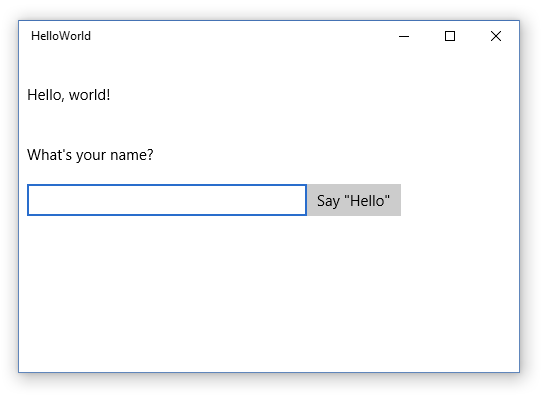

# Créer une application « Hello World » (XAML)

Ce didacticiel vous apprend à utiliser le langage Extensible Application Markup Language (XAML) avec C# pour créer une application « Hello World » simple ciblant la plateforme UWP (Universal Windows Platform) sur Windows 10. À l’aide d’un seul projet dans Microsoft Visual Studio, vous pouvez générer une application qui s’exécute sur tout appareil Windows 10. Nous allons nous concentrer sur la création d’une application qui s’exécute aussi bien sur des ordinateurs de bureau que sur des appareils mobiles.

**Important** Ce didacticiel est destiné à être utilisé avec Microsoft Visual Studio 2015 et Windows 10. Il ne fonctionnera pas correctement avec les versions antérieures de ces applications.

Vous allez apprendre à effectuer les opérations suivantes :

-   créer un projet Visual Studio qui cible Windows 10 et UWP ;
-   ajouter du contenu XAML à votre page d’accueil ;
-   gérer les entrées tactiles, ainsi que les entrées effectuées à l’aide du stylet ou de la souris ;
-   exécuter le projet sur l’ordinateur local et sur l’émulateur de téléphone dans Visual Studio ;
-   adapter l’interface utilisateur à différentes tailles d’écran.

## Avant de commencer...


-   Nous allons accéder directement aux étapes permettant de créer une application universelle simple. Avant de commencer ce didacticiel, nous vous recommandons vivement de lire attentivement les informations de présentation des articles [Nouveautés de Windows 10](https://dev.windows.com/whats-new-windows-10-dev-preview) et [Qu’est-ce qu’une application Windows universelle ?](whats-a-uwp.md).
-   Pour suivre ce didacticiel, vous avez besoin de Windows 10 et de Visual Studio 2015. Pour plus d’informations, voir [Se préparer](get-set-up.md).
-   Nous supposons que vous avez une connaissance de base du code XAML et des concepts décrits dans la [Vue d’ensemble du langage XAML](https://msdn.microsoft.com/library/windows/apps/Mt185595).
-   Nous partons également du principe que vous utilisez la disposition de fenêtre par défaut de Visual Studio. Si vous modifiez la disposition par défaut, vous pouvez la réinitialiser dans le menu **Fenêtre** en choisissant la commande **Rétablir la disposition de fenêtre**.

##  Étape 1 : créer un projet dans Visual Studio


1.  Lancez Visual Studio 2015.

   La page d’accueil de Visual Studio 2015 apparaît. (Désormais, nous désignerons Visual Studio 2015 simplement sous le nom Visual Studio .)

2.  Dans le menu **Fichier**, sélectionnez **Nouveau** > **Projet**.

   La boîte de dialogue **Nouveau projet** s’affiche. Le volet gauche de la boîte de dialogue vous permet de sélectionner le type de modèle à afficher.

3.  Dans le volet gauche, développez **Installé > Modèles > Visual C# > Windows**, puis sélectionnez le groupe de modèles **Universel**. Le volet central de la boîte de dialogue affiche une liste de modèles de projets pour les applications de plateforme Windows universelle (UWP).

   

4.  Dans le volet central, sélectionnez le modèle **Application vide (Windows universel)**.

   Le modèle **Application vide** crée une application UWP dépouillée qui peut être compilée et exécutée, mais qui ne contient aucun contrôle d’interface utilisateur ni aucune donnée. Au cours de ce didacticiel, vous allez ajouter des contrôles à l’application.

5.  Dans la zone de texte **Name**, tapez « HelloWorld ».
6.  Cliquez sur **OK** pour créer le projet.

   Visual Studio crée votre projet et l’affiche dans l’**Explorateur de solutions**.

   

Même si le modèle **Application vide** est dépouillé, il contient cependant de nombreux fichiers :

-   un fichier manifeste (Package.appxmanifest) qui décrit votre application (nom, description, vignette, page d’accueil, etc.) et répertorie les fichiers contenus dans cette dernière ;
-   un ensemble d’images de logo (Assets/Square150x150Logo.scale-200.png, Assets/Square44x44Logo.scale-200.png et Assets/Wide310x150Logo.scale-200.png) à afficher dans le menu Démarrer ;
-   une image (Assets/StoreLogo.png) représentant votre application dans le Windows Store ;
-   un écran de démarrage (Assets/SplashScreen.scale-200.png) à afficher lorsque votre application démarre ;
-   les fichiers XAML et de code de l’application (App.xaml et App.xaml.cs) ;
-   une page de démarrage (MainPage.xaml) et un fichier de code associé (MainPage.xaml.cs) qui s’exécute au démarrage de votre application.

Ces fichiers sont indispensables pour toutes les applications UWP en C#. Ils figurent dans tous les projets que vous créez dans Visual Studio.

## Étape 2 : modifier votre page d’accueil


### Que contiennent les fichiers ?

Pour afficher et modifier un fichier dans votre projet, double-cliquez sur ce fichier dans l’**Explorateur de solutions**. Par défaut, vous pouvez développer un fichier XAML de la même façon qu’un dossier pour afficher le fichier de code qui lui est associé. Les fichiers XAML s’ouvrent en mode Fractionné qui présente à la fois l’aire de conception et l’éditeur XAML.

Dans ce didacticiel, vous n’utiliserez qu’une partie des fichiers mentionnés précédemment : App.xaml, MainPage.xaml et MainPage.xaml.cs.

### App.xaml et App.xaml.cs

App.xaml est le fichier dans lequel vous déclarez les ressources utilisées dans l’application. App.xaml.cs est le fichier code-behind d’App.xaml. Le code-behind est le code joint à la classe partielle de la page XAML. Ensemble, la page XAML et le code-behind forment une classe complète. App.xaml.cs est le point d’entrée de votre application. Comme toutes les pages code-behind, elle contient un constructeur qui appelle la méthode `InitializeComponent`. Ce n’est pas vous qui écrivez la méthode `InitializeComponent`. Elle est générée par Visual Studio et vise essentiellement à initialiser les éléments déclarés dans le fichier XAML. App.xaml.cs contient par ailleurs des méthodes destinées à gérer l’activation et la suspension de l’application.

### MainPage.xaml

Dans MainPage.xaml, vous définissez l’interface utilisateur de votre application. Vous pouvez ajouter des éléments directement en utilisant du balisage XAML ou les outils de conception fournis avec Visual Studio. MainPage.xaml.cs est la page code-behind de MainPage.xaml. Cette page vous permet d’ajouter la logique de votre application et les gestionnaires d’événements.

Ces deux fichiers définissent ensemble une nouvelle classe appelée `MainPage`, qui hérite de l’élément [**Page**](https://msdn.microsoft.com/library/windows/apps/BR227503), dans l’espace de noms `HelloWorld`.

MainPage.xaml

```xml
    <Page
    x:Class="HelloWorld.MainPage"
    xmlns="http://schemas.microsoft.com/winfx/2006/xaml/presentation"
    xmlns:x="http://schemas.microsoft.com/winfx/2006/xaml"
    xmlns:local="using:HelloWorld"
    xmlns:d="http://schemas.microsoft.com/expression/blend/2008"
    xmlns:mc="http://schemas.openxmlformats.org/markup-compatibility/2006"
    mc:Ignorable="d">

    <Grid Background="{ThemeResource ApplicationPageBackgroundThemeBrush}">

    </Grid>
</Page>
```

MainPage.xaml.cs

```csharp
using Windows.UI.Xaml;
using Windows.UI.Xaml.Controls;

namespace HelloWorld
{
    /// <summary>
    /// An empty page that can be used on its own or navigated to within a Frame.
    /// </summary>
    public sealed partial class MainPage : Page
    {
        public MainPage()
        {
            this.InitializeComponent();
        }
    }
}
```

### Modifier la page d’accueil

Maintenant, ajoutons du contenu à l’application.

**Pour modifier la page de démarrage**

1.  Dans l’**Explorateur de solutions**, double-cliquez sur MainPage.xaml pour l’ouvrir.
2.  Dans l’éditeur XAML, ajoutez les contrôles pour l’interface utilisateur.

   Dans l’élément [**Grid**](https://msdn.microsoft.com/library/windows/apps/BR242704) racine, ajoutez le code XAML ci-après. Il contient un élément [**StackPanel**](https://msdn.microsoft.com/library/windows/apps/BR209635) avec un élément [**TextBlock**](https://msdn.microsoft.com/library/windows/apps/BR209652) de titre, un élément **TextBlock** qui demande le nom de l’utilisateur, un élément [**TextBox**](https://msdn.microsoft.com/library/windows/apps/BR209683) pour accepter le nom de l’utilisateur, un élément [**Button**](https://msdn.microsoft.com/library/windows/apps/BR209265), puis un autre élément **TextBlock** pour afficher un message de salutations. Certains de ces contrôles comportent des noms pour vous permettre de vous y référer ultérieurement dans votre code.

```xml    
    <StackPanel x:Name="contentPanel" Margin="8,32,0,0">
        <TextBlock Text="Hello, world!" Margin="0,0,0,40"/>
        <TextBlock Text="What' s your name?"/>
        <StackPanel x:Name="inputPanel" Orientation="Horizontal" Margin="0,20,0,20">
            <TextBox x:Name="nameInput" Width="280" HorizontalAlignment="Left"/>
            <Button x:Name="inputButton" Content="Say &amp;quot;Hello&amp;quot;"/>
        </StackPanel>
        <TextBlock x:Name="greetingOutput"/>
    </StackPanel>
```    

    The controls that you added in the XAML editor show up in the design view.

## Étape 3 : démarrer l’application


À ce stade, vous avez créé une application très simple. Le moment est bien choisi pour générer, déployer et lancer votre application et voir à quoi elle ressemble. Vous pouvez déboguer votre application sur l’ordinateur local, dans un simulateur ou un émulateur, ou sur un appareil distant. Voici le menu des périphériques cibles dans Visual Studio.


### Démarrer l’application sur un ordinateur de bureau

Par défaut, l’application s’exécute sur l’ordinateur local. Le menu des périphériques cibles vous offre plusieurs options pour le débogage de votre application sur des périphériques de la famille des ordinateurs de bureau.

-   **Simulateur**
-   **Ordinateur local**
-   **Ordinateur distant**

**Pour démarrer le débogage sur l’ordinateur local**

1.  Dans le menu des appareils cibles () figurant sur la barre d’outils **Standard**, assurez-vous que l’option **Ordinateur local** est sélectionnée. (Il s’agit de la sélection par défaut.)
2.  Cliquez sur le bouton **Démarrer le débogage** () de la barre d’outils.

   –ou–

   Dans le menu **Déboguer**, cliquez sur **Démarrer le débogage**.

   –ou–

   Appuyez sur F5.

L’application s’ouvre dans une fenêtre, et un écran de démarrage par défaut s’affiche en premier. Cet écran est défini par une image (SplashScreen.png) et par une couleur d’arrière-plan (spécifiées dans le fichier manifeste de votre application).

L’écran de démarrage disparaît pour céder la place à votre application. Cette dernière se présente comme suit.



Appuyez sur la touche Windows pour ouvrir le menu **Démarrer**, puis affichez toutes les applications. Notez que le déploiement de l’application entraîne l’ajout local de sa vignette au menu **Démarrer**. Pour exécuter de nouveau l’application (non en mode débogage), appuyez ou cliquez sur sa vignette dans le menu **Démarrer**.

Félicitations ! Vous venez de générer votre première application UWP, même si celle-ci ne propose pas (encore) beaucoup de fonctions.

**Pour arrêter le débogage**

-   Cliquez sur le bouton **Arrêter le débogage** () dans la barre d’outils.

   –ou–

   Dans le menu **Déboguer**, cliquez sur **Arrêter le débogage**.

   –ou–

   Fermez la fenêtre de l’application.

### Démarrer l’application sur un émulateur d’appareil mobile

Votre application s’exécute sur n’importe quel appareil Windows 10. Examinons donc son aspect sur un Windows Phone.

Outre les options de débogage sur un ordinateur de bureau, Visual Studio offre des options de déploiement et de débogage de votre application sur un appareil mobile physique connecté à l’ordinateur ou sur un émulateur d’appareil mobile. Vous pouvez choisir parmi plusieurs émulateurs d’appareil correspondant à différentes configurations de mémoire et d’affichage.

-   **Appareil**
-   **Émulateur <SDK version> WVGA 4 pouces 512 Mo**
-   **Émulateur <SDK version> WVGA 4 pouces 1 Go**
-   etc. (Divers émulateurs associés à d’autres configurations)

Il est judicieux de tester votre application sur un appareil doté d’un petit écran et d’une mémoire limitée. Par conséquent, choisissez l’option **Émulateur 10.0.10240.0 WVGA 4 pouces 512 Mo**.
**Pour démarrer le débogage sur un émulateur d’appareil mobile**

1.  Dans le menu des appareils cibles () situé sur la barre d’outils **Standard**, choisissez **Émulateur 10.0.10240.0 WVGA 4 pouces 512 Mo**.
2.  Cliquez sur le bouton **Démarrer le débogage** () dans la barre d’outils.

   –ou–

   Dans le menu **Déboguer**, cliquez sur **Démarrer le débogage**.

   –ou–

   Appuyez sur F5.

Visual Studio démarre l’émulateur sélectionné, puis déploie et démarre votre application. Sur l’émulateur d’appareil mobile, l’application se présente comme suit.


La première chose que vous remarquez est que le bouton se trouve hors de l’écran plus petit d’un appareil mobile. Dans la suite de ce didacticiel, vous apprendrez à adapter l’interface utilisateur à différentes tailles d’écran pour que votre application s’affiche correctement sur tous les appareils.

Vous pouvez également remarquer que vous pouvez taper du texte dans la [**TextBox**](https://msdn.microsoft.com/library/windows/apps/BR209683), mais qu’un clic ou un appui sur le [**Button**](https://msdn.microsoft.com/library/windows/apps/BR209265) est sans effet. Dans les étapes suivantes, vous allez créer un gestionnaire d’événements pour l’événement [**Click**](https://msdn.microsoft.com/library/windows/apps/BR227737) du bouton de façon à afficher un message de salutations personnalisé. Vous ajouterez le code du gestionnaire d’événements au fichier MainPage.xaml.cs.

## Étape 4 : créer un gestionnaire d’événements


Les éléments XAML peuvent envoyer des messages lorsque certains événements se produisent. Ces messages d’événement vous permettent de réagir en réponse à l’événement. Insérez votre code de réponse à l’événement dans une méthode de gestionnaire d’événements. L’un des événements les plus courants dans bon nombre d’applications est un clic d’utilisateur sur un [**Button**](https://msdn.microsoft.com/library/windows/apps/BR209265).

Créons un gestionnaire d’événements pour l’événement [**Click**](https://msdn.microsoft.com/library/windows/apps/BR227737) de votre bouton. Le gestionnaire d’événements obtient le nom de l’utilisateur auprès du contrôle `nameInput` [**TextBox**](https://msdn.microsoft.com/library/windows/apps/BR209683) et l’utilise pour sortir une salutation dans [**TextBlock**](https://msdn.microsoft.com/library/windows/apps/BR209652) `greetingOutput`.

### Utilisation d’événements qui fonctionnent pour les entrées tactiles, de la souris et du stylet

Quels événements devez-vous gérer ? Sachant que vos applications du Windows Store peuvent s’exécuter sur divers appareils, concevez-les de manière à prendre en charge les entrées tactiles. Votre application doit être en mesure de gérer les entrées d’une souris ou d’un stylet. Heureusement, les événements tels que [**Click**](https://msdn.microsoft.com/library/windows/apps/BR227737) et [**DoubleTapped**](https://msdn.microsoft.com/library/windows/apps/BR208922) sont indépendants de l’appareil. Si vous êtes rompu à la programmation Microsoft .NET, vous avez peut-être noté l’existence d’événements distincts pour les entrées tactiles, de la souris et du stylet, comme **TouchMove**, **MouseMove** et **StylusMove**. Dans les applications du Windows Store, ces événements séparés sont remplacés par un seul et même événement [**PointerMoved**](https://msdn.microsoft.com/library/windows/apps/BR208970) qui fonctionne tout aussi bien pour les entrées tactiles, de la souris et du stylet.

**Pour ajouter un gestionnaire d’événements**

1.  En mode XAML ou Création, sélectionnez l’élément « Say Hello » [**Button**](https://msdn.microsoft.com/library/windows/apps/BR209265) que vous avez ajouté à MainPage.xaml.
2.  Dans la **fenêtre Propriétés**, cliquez sur le bouton Événements ().
3.  Recherchez l’événement [**Click**](https://msdn.microsoft.com/library/windows/apps/BR227737) en haut de la liste des événements. Dans la zone de texte correspondant à l’événement, tapez le nom de la fonction qui gère l’événement **Click**. Pour cet exemple, tapez « Button\_Click ».

   

4.  Appuyez sur Entrée. La méthode de gestionnaire d’événements est créée et ouverte dans l’éditeur de code pour vous permettre d’ajouter le code à exécuter lorsque l’événement se produit.

    Dans l’éditeur XAML, le code XAML pour [**Button**](https://msdn.microsoft.com/library/windows/apps/BR209265) est mis à jour pour déclarer le gestionnaire d’événements [**Click**](https://msdn.microsoft.com/library/windows/apps/BR227737) comme suit.

```xml   
   <Button x:Name="inputButton" Content="Say &amp;quot;Hello&amp;quot;" Click="Button_Click"/>
```    

5.  Ajoutez du code au gestionnaire d’événements que vous avez créé dans la page code-behind. Dans le gestionnaire d’événements, récupérez le nom de l’utilisateur à partir du contrôle `nameInput` [**TextBox**](https://msdn.microsoft.com/library/windows/apps/BR209683) et servez-vous-en pour créer un message de salutations. Utilisez le contrôle `greetingOutput` [**TextBlock**](https://msdn.microsoft.com/library/windows/apps/BR209652) pour afficher le résultat.
    
```csharp    
    private void Button_Click(object sender, RoutedEventArgs e)
    {
        greetingOutput.Text = "Hello, " + nameInput.Text + "!";
    }
```    

6.  Déboguez l’application sur l’ordinateur local. Lorsque vous entrez votre nom dans la zone de texte et que vous cliquez sur le bouton, l’application affiche alors un message de salutations personnalisé.

## Étape 5 : adapter l’interface utilisateur à différentes tailles de fenêtre


Nous allons à présent adapter l’interface utilisateur à différentes tailles d’écran afin qu’elle s’affiche correctement sur des appareils mobiles. Pour ce faire, vous ajoutez un élément [**VisualStateManager**](https://msdn.microsoft.com/library/windows/apps/BR209021) et vous définissez des propriétés qui s’appliquent à différents états visuels.

**Pour ajuster la disposition de l’interface utilisateur**

1.  Dans l’éditeur XAML, ajoutez le bloc de code XAML ci-dessous après la balise de début de l’élément [**Grid**](https://msdn.microsoft.com/library/windows/apps/BR242704) racine.

```xml    
    <VisualStateManager.VisualStateGroups>
        <VisualStateGroup>
            <VisualState x:Name="wideState">
                <VisualState.StateTriggers>
                    <AdaptiveTrigger MinWindowWidth="641" />
                </VisualState.StateTriggers>
            </VisualState>
            <VisualState x:Name="narrowState">
                <VisualState.StateTriggers>
                    <AdaptiveTrigger MinWindowWidth="0" />
                </VisualState.StateTriggers>
                <VisualState.Setters>
                    <Setter Target="inputPanel.Orientation" Value="Vertical"/>
                    <Setter Target="inputButton.Margin" Value="0,4,0,0"/>
                </VisualState.Setters>
            </VisualState>
        </VisualStateGroup>
    </VisualStateManager.VisualStateGroups>
```    

2.  Déboguez l’application sur l’ordinateur local. Notez que l’interface utilisateur présente le même aspect qu’auparavant, à moins que la fenêtre ne présente une taille inférieure à 641 pixels.
3.  Déboguez l’application sur l’émulateur d’appareil mobile. Notez que l’interface utilisateur utilise les propriétés que vous avez définies dans l’élément `narrowState` et s’affiche correctement sur le petit écran.


Si vous avez utilisé un élément [**VisualStateManager**](https://msdn.microsoft.com/library/windows/apps/BR209021) dans des versions précédentes du langage XAML, vous pouvez remarquer que le code XAML spécifié ici utilise une syntaxe simplifiée.

L’élément [**VisualState**](https://msdn.microsoft.com/library/windows/apps/BR209007) nommé `wideState` comporte un élément [**AdaptiveTrigger**](https://msdn.microsoft.com/library/windows/apps/Dn890382) dont la propriété [**MinWindowWidth**](https://msdn.microsoft.com/en-us/library/windows/apps/windows.ui.xaml.adaptivetrigger.minwindowwidth) est définie sur 641. Cela signifie que l’état ne doit s’appliquer que si la largeur de la fenêtre n’est pas inférieure à la valeur minimale de 641 pixels. Vous ne définissez aucun objet [**Setter**](https://msdn.microsoft.com/library/windows/apps/BR208817) pour cet état, de sorte qu’il utilise les propriétés de disposition que vous avez définies dans le code XAML pour le contenu de la page.

Le second élément [**VisualState**](https://msdn.microsoft.com/library/windows/apps/BR209007), `narrowState`, comporte un élément [**AdaptiveTrigger**](https://msdn.microsoft.com/library/windows/apps/Dn890382) dont la propriété [**MinWindowWidth**](https://msdn.microsoft.com/en-us/library/windows/apps/windows.ui.xaml.adaptivetrigger.minwindowwidth) est définie sur 0. Cet état est appliqué lorsque la largeur de la fenêtre est supérieure à 0, mais inférieure à 641 pixels. (À 641 pixels, l’état `wideState` s’applique.) Dans cet état, vous définissez certains objets [**Setter**](https://msdn.microsoft.com/library/windows/apps/BR208817) de façon à modifier les propriétés de disposition des contrôles dans l’interface utilisateur :

-   Vous remplacez l’[**Orientation**](https://msdn.microsoft.com/library/windows/apps/windows.ui.xaml.controls.stackpanel.orientation) **Horizontal** de l’élément `inputPanel` par l’orientation **Vertical**.
-   Vous ajoutez une marge supérieure de 4 à l’élément `inputButton`.

## Récapitulatif


Félicitations ! Vous venez de créer votre première application pour Windows 10 et UWP.


<!--HONumber=Mar16_HO1-->


