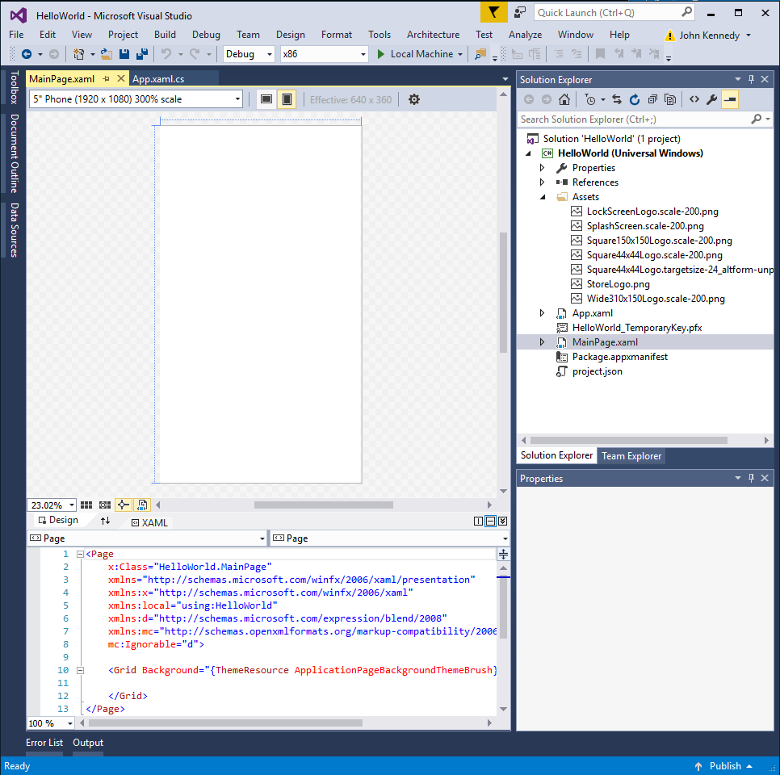

# <a name="create-a-hello-world-app-xaml"></a>Créer une application «Hello World» (XAML)

Ce didacticiel vous explique comment utiliser XAML et C# pour créer une simple application «Hello World» pour la plateforme Windows universelle (UWP) sur Windows10. Dans Microsoft Visual Studio, un seul projet vous permet de générer une application qui s’exécute sur n’importe quel appareil Windows10.

Vous allez apprendre à effectuer les opérations suivantes:

-   créer un projet **Visual Studio2017** qui cible **Windows10** et la **plateforme Windows universelle (UWP)**;
-   écrire du code XAML pour modifier l’interface utilisateur de votre page de démarrage;
-   exécuter le projet sur l’ordinateur local dans Visual Studio;
-   utiliser un objet SpeechSynthesizer pour faire parler l’application quand vous appuyez sur un bouton.


## <a name="before-you-start"></a>Avant de commencer...

-   [Qu’est-ce qu’une application Windows universelle?](universal-application-platform-guide.md)
-   [Télécharger Visual Studio2017 (et Windows10)](https://developer.microsoft.com/windows/downloads). Si vous avez besoin d’aide, découvrez comment [vous préparer](get-set-up.md).
-   Nous partons également du principe que vous utilisez la disposition de fenêtre par défaut de Visual Studio. Si vous modifiez la disposition par défaut, vous pouvez la réinitialiser dans le menu **Fenêtre** en choisissant la commande **Rétablir la disposition de fenêtre**.

> [!NOTE]
> Ce didacticiel utilise Visual Studio Community2017. Si vous utilisez une autre version de Visual Studio, son aspect vous semblera peut-être légèrement différent.

## <a name="video-summary"></a>Résumé de la vidéo

<iframe src="https://channel9.msdn.com/Blogs/One-Dev-Minute/Writing-Your-First-Windows-10-App/player" width="640" height="360" allowFullScreen frameBorder="0"></iframe>


## <a name="step-1-create-a-new-project-in-visual-studio"></a>Étape1: Créer un projet dans Visual Studio

1.  Lancez Visual Studio2017.

2.  Dans le menu **fichier** , sélectionnez **Nouveau > projet** pour ouvrir la boîte de dialogue *Nouveau projet* .

3.  Dans la liste des modèles de gauche, choisissez **installés > Visual c# > Windows universel** pour afficher la liste des modèles de projet UWP.

    (Si aucun modèle universel n’apparaît, c’est qu’il vous manque les composants permettant de créer des applications UWP. Vous pouvez répéter la procédure d’installation et ajouter la prise en charge UWP en cliquant sur **Ouvrir le programme d'installation de Visual Studio** dans la boîte de dialogue *Nouveau projet*. Voir [se préparer](get-set-up.md).)

    

4.  Choisissez le modèle **Application vide (Windows universel)**, puis entrez «HelloWorld» comme **Nom**. Sélectionnez **OK**.

    

> [!NOTE]
> Si vous utilisez Visual Studio pour la première fois, il est possible que la boîte de dialogue Paramètres s'affiche et vous demande d’activer le **Mode développeur**. Le mode développeur est un paramètre qui permet d'accéder à certaines fonctionnalités, telles que l’autorisation d’exécuter des applications directement plutôt qu’uniquement à partir du Windows Store. Pour plus d’informations, consultez [Activer votre appareil pour le développement](enable-your-device-for-development.md). Pour continuer avec ce guide, sélectionnez le **Mode développeur**, cliquez sur **Oui** et fermez la boîte de dialogue.

 

5.  La boîte de dialogue Version cible/Version minimale s’affiche. Les paramètres par défaut étant appropriés pour ce didacticiel, sélectionnez **OK** pour créer le projet.

    

6.  Votre nouveau projet s’ouvre en affichant ses fichiers dans le volet **Explorateur de solutions**, à droite. Vous devrez peut-être choisir l’onglet **Explorateur de solutions** à la place de l’onglet **Propriétés** pour voir vos fichiers.

    

Même si le modèle **Application vide (Windows universel)** est dépouillé, il contient cependant de nombreux fichiers. Ces fichiers sont indispensables pour toutes les applications UWP en C#. Ils se trouvent dans tous les projets que vous créez dans Visual Studio.


### <a name="whats-in-the-files"></a>Que contiennent les fichiers?

Pour afficher et modifier un fichier de votre projet, double-cliquez dessus dans l’**Explorateur de solutions**. Développez un fichier XAML à la manière d’un dossier pour afficher le fichier de code qui lui est associé. Les fichiers XAML s’ouvrent en mode Fractionné avec l’aire de conception et l’éditeur XAML tous deux affichés.
> [!NOTE]
> Qu’est-ce que le XAML? XAML (Extensible Application Markup Language) est le langage utilisé pour définir l’interface utilisateur de votre application. Vous pouvez entrer son code manuellement ou le créer avec les outils de conception VisualStudio. Un fichier .xaml s’accompagne d’un fichier code-behind .xaml.cs qui contient la logique. Ensemble, les fichiers XAML et code-behind forment une classe à part entière. Pour plus d’informations, voir [Vue d’ensemble du langage XAML](https://msdn.microsoft.com/library/windows/apps/Mt185595).

*App.xaml et App.xaml.cs*

-   App.xaml est le fichier dans lequel vous déclarez les ressources utilisées dans l’application.
-   App.xaml.cs est le fichier code-behind d’App.xaml. Comme toutes les pages code-behind, il contient un constructeur qui appelle la méthode `InitializeComponent`. Ce n’est pas vous qui écrivez la méthode `InitializeComponent`. Elle est générée par Visual Studio et vise essentiellement à initialiser les éléments déclarés dans le fichier XAML.
-   App.xaml.cs est le point d’entrée de votre application.
-   App.xaml.cs contient par ailleurs des méthodes destinées à gérer l’activation et la suspension de l’application.

*MainPage.xaml*

-   MainPage.xaml est le fichier dans lequel vous définissez l’interface utilisateur de votre application. Vous pouvez y ajouter directement des éléments en utilisant du balisage XAML ou vous pouvez utiliser les outils de conception fournis avec Visual Studio.
-   MainPage.xaml.cs est la page code-behind de MainPage.xaml. Cette page vous permet d’ajouter la logique de votre application et les gestionnaires d’événements.
-   Ces deux fichiers définissent ensemble une nouvelle classe appelée `MainPage`, qui hérite de l’élément [**Page**](https://msdn.microsoft.com/library/windows/apps/BR227503), dans l’espace de noms `HelloWorld`.

*Package.appxmanifest*
-   Fichier manifeste qui décrit votre application: nom, description, vignette, page de démarrage, etc..
-   Comprend la liste des fichiers contenus dans votre application.

*Ensemble d’images de logo*
-   Assets/Square150x150Logo.scale-200.png représente votre application dans le menu Démarrer.
-   Assets/StoreLogo.png représente votre application dans le MicrosoftStore.
-   Assets/SplashScreen.scale-200.png est l’écran de démarrage qui s’affiche quand votre application démarre.

## <a name="step-2-adding-a-button"></a>Étape2: Ajouter un bouton

### <a name="using-the-designer-view"></a>En utilisant le mode concepteur

Ajoutons un bouton à la page. Dans ce didacticiel, vous n’utiliserez qu’une partie des fichiers mentionnés précédemment: App.xaml, MainPage.xaml et MainPage.xaml.cs.

1.  Double-cliquez sur **MainPage.xaml** pour l’ouvrir en mode Création.

    Vous remarquerez dans la partie supérieure de l’écran la présence d’un affichage graphique et en dessous celle d’un affichage de code XAML. Même si les deux peuvent être modifiés, nous n’utiliserons pour le moment que l’affichage graphique.

    

2.  Cliquez sur l’onglet vertical **Boîte à outils** à gauche pour ouvrir la liste des contrôles d’interface utilisateur. (Vous pouvez cliquer sur l’épingle dans sa barre de titre pour qu’elle reste visible.)

    

3.  Développez **Contrôles XAML communs** et faites glisser le contrôle **Button** jusqu’au milieu de l’aire de conception.

    

    Si vous regardez dans la fenêtre de code XAML, vous constaterez que le contrôle Button y a été aussi ajouté:

 ```XAML
<Button x:name="button" Content="Button" HorizontalAlignment="Left" Margin = "152,293,0,0" VerticalAlignment="Top"/>
 ```

4.  Modifiez le texte du bouton.

    Cliquez dans l’affichage de code XAML et modifiez la valeur de Content en remplaçant «Button» par «Hello World!».

```XAML
<Button x:name="button" Content="Hello, world!" HorizontalAlignment="Left" Margin = "152,293,0,0" VerticalAlignment="Top"/>
```

Le bouton figurant dans l’aire de conception est alors mis à jour pour présenter le nouveau texte.


## <a name="step-3-start-the-app"></a>Étape 3: Démarrer l’application


À ce stade, vous avez créé une application très simple. Le moment est bien choisi pour générer, déployer et lancer votre application et voir à quoi elle ressemble. Vous pouvez déboguer votre application sur l’ordinateur local, dans un simulateur ou un émulateur, ou sur un appareil distant. Voici le menu des périphériques cibles dans Visual Studio.


### <a name="start-the-app-on-a-desktop-device"></a>Démarrer l’application sur un ordinateur de bureau

Par défaut, l’application s’exécute sur l’ordinateur local. Le menu des périphériques cibles vous offre plusieurs options pour le débogage de votre application sur des périphériques de la famille des ordinateurs de bureau.

-   **Simulateur**
-   **Ordinateur local**
-   **Ordinateur distant**

**Pour démarrer le débogage sur l’ordinateur local**

1.  Dans le menu des appareils cibles () figurant sur la barre d’outils **Standard**, assurez-vous que l’option **Ordinateur local** est sélectionnée. (Il s’agit de la sélection par défaut.)
2.  Cliquez sur le bouton **Démarrer le débogage** () de la barre d’outils.

   –ou–

   Dans le menu **Déboguer**, cliquez sur **Démarrer le débogage**.

   –ou–

   Appuyez sur F5.

L’application s’ouvre dans une fenêtre, et un écran de démarrage par défaut s’affiche en premier. Cet écran est défini par une image (SplashScreen.png) et par une couleur d’arrière-plan (spécifiées dans le fichier manifeste de votre application).

L’écran de démarrage disparaît pour céder la place à votre application. Cette dernière se présente comme suit.


Appuyez sur la touche Windows pour ouvrir le menu **Démarrer**, puis affichez toutes les applications. Notez que le déploiement de l’application entraîne l’ajout local de sa vignette au menu **Démarrer**. Pour exécuter de nouveau l’application à un moment ultérieur (pas en mode débogage), appuyez ou cliquez sur sa vignette dans le menu **Démarrer**.

Félicitations! Vous venez de créer votre première application UWP, même si celle-ci ne propose pas (encore) beaucoup de fonctions.

**Pour arrêter le débogage**

   Cliquez sur le bouton **Arrêter le débogage** () dans la barre d’outils.

   –ou–

   Dans le menu **Déboguer**, cliquez sur **Arrêter le débogage**.

   –ou–

   Fermez la fenêtre de l’application.

## <a name="step-4-event-handlers"></a>Étape4: Gestionnaires d’événements

Si le terme «gestionnaire d’événements» vous paraît compliqué, il s’agit simplement d’un autre nom pour désigner le code qui est appelé quand un événement se produit (par exemple, quand l’utilisateur clique sur votre bouton).

1.  Arrêtez l’exécution de l’application, si ce n’est déjà fait.

2.  Double-cliquez sur le contrôle de bouton dans l’aire de conception pour que Visual Studio crée un gestionnaire d’événements pour votre bouton.

  Bien entendu, vous pouvez créer l’intégralité du code manuellement. Vous pouvez aussi sélectionner le bouton en cliquant dessus et consulter le volet **Propriétés** en bas à droite. Si vous basculez dans **Événements** (le petit boulon clignotant), vous pouvez ajouter le nom de votre gestionnaire d’événements.

3.  Modifiez le code du gestionnaire d’événements dans *MainPage.xaml.cs*, la page code-behind. C’est là où les choses deviennent intéressantes. Le gestionnaire d’événements par défaut se présente ceci:

```C#
private void Button_Click(object sender, RoutedEventArgs e)
{

}
```

  Modifions-le de sorte qu’il se présente comme ceci:

```C#
private async void Button_Click(object sender, RoutedEventArgs e)
        {
            MediaElement mediaElement = new MediaElement();
            var synth = new Windows.Media.SpeechSynthesis.SpeechSynthesizer();
            Windows.Media.SpeechSynthesis.SpeechSynthesisStream stream = await synth.SynthesizeTextToStreamAsync("Hello, World!");
            mediaElement.SetSource(stream, stream.ContentType);
            mediaElement.Play();
        }
```

Veillez aussi à inclure le mot clé **async** car à défaut, vous obtiendrez une erreur en essayant d’exécuter l’application.

### <a name="what-did-we-just-do"></a>Que venons-nous de faire?

Ce code utilise certaines API Windows pour créer un objet de synthèse vocale et lui donne du texte à prononcer. (Pour plus d’informations sur l’utilisation de SpeechSynthesis, voir la documentation [Espace de noms SpeechSynthesis](https://msdn.microsoft.com/library/windows/apps/windows.media.speechsynthesis.aspx).)

Quand vous exécutez l’application et que vous cliquez sur le bouton, votre ordinateur (ou téléphone) prononce «Hello World!».


## <a name="summary"></a>Récapitulatif

Félicitations! Vous venez de créer votre première application pour Windows10 et l’application UWP.

Pour apprendre à utiliser XAML et mettre en place les contrôles utilisés par votre application, essayez le [didacticiel de grille](../design/layout/grid-tutorial.md) ou passez directement aux [étapes suivantes](learn-more.md).

## <a name="see-also"></a>Voir aussi

* [Votre première application](your-first-app.md)
* [Publier votre application UWP](https://developer.microsoft.com/store/publish-apps)
* [Articles sur les procédures de développement d’applications UWP](https://developer.microsoft.com/windows/apps/develop)
* [Exemples de code pour les développeurs UWP](https://developer.microsoft.com/windows/samples)
* [Qu’est-ce qu’une application Windows universelle?](universal-application-platform-guide.md)
* [Créer un compte Windows](sign-up.md)
